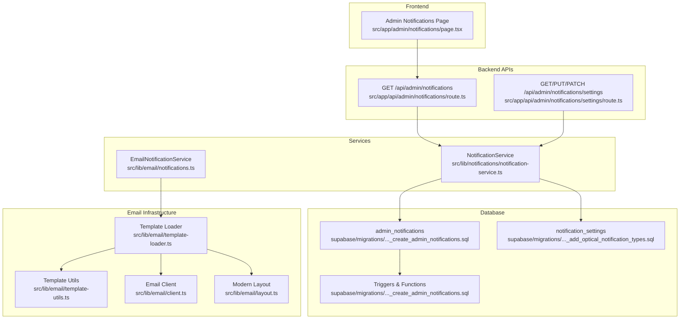
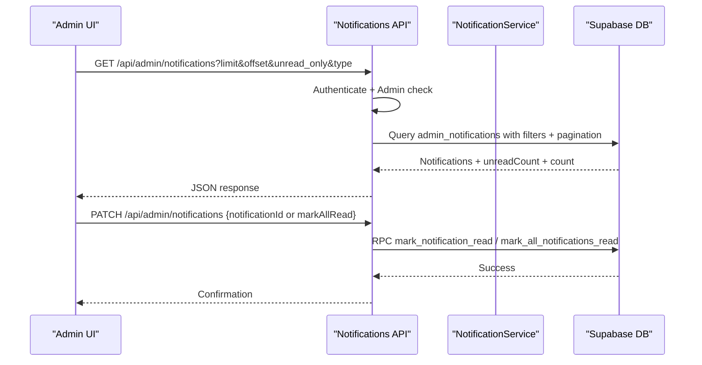
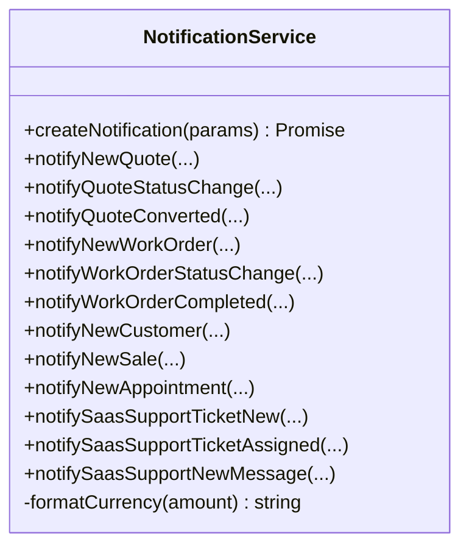
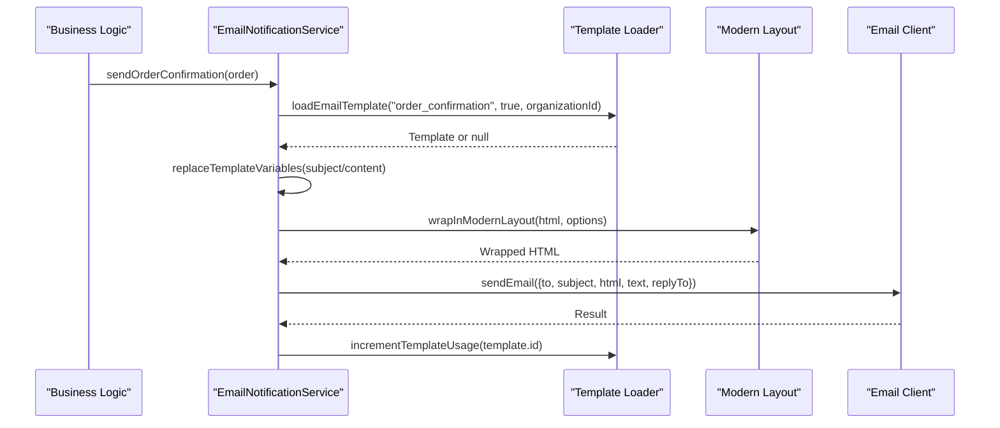
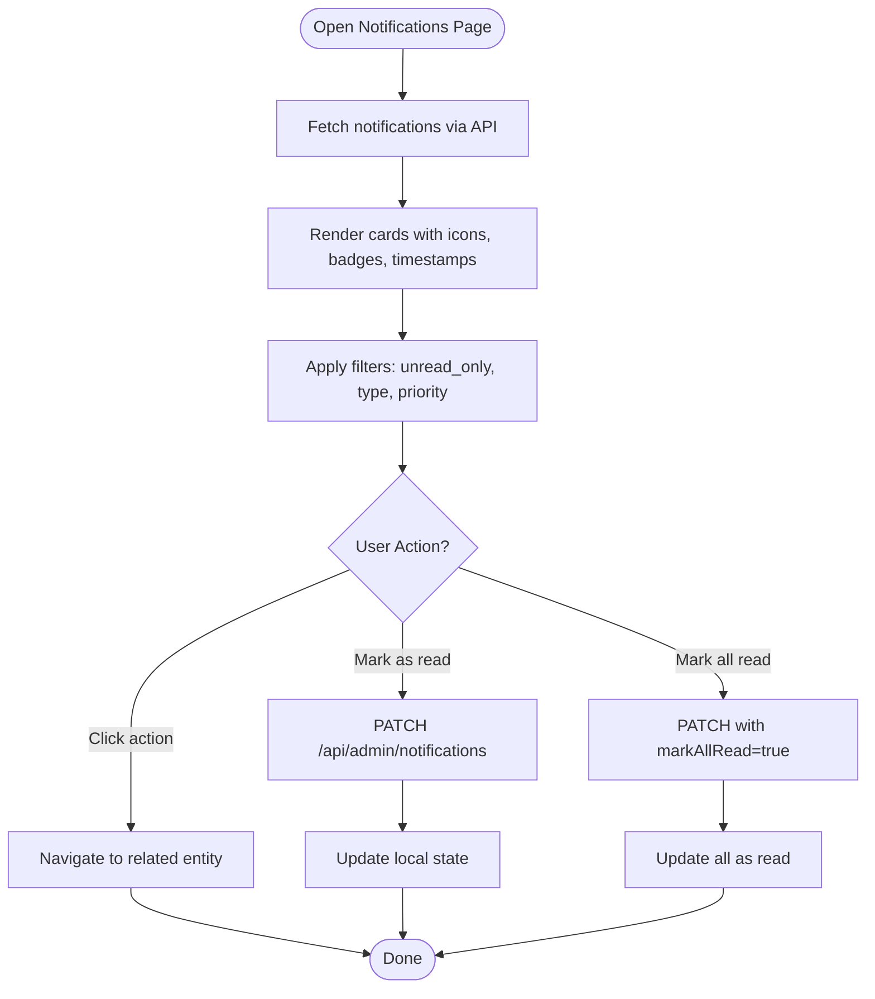
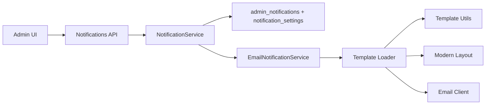

# Notification System

<cite>
**Referenced Files in This Document**
- [notification-service.ts](file://src/lib/notifications/notification-service.ts)
- [notifications.ts](file://src/lib/email/notifications.ts)
- [page.tsx](file://src/app/admin/notifications/page.tsx)
- [route.ts](file://src/app/api/admin/notifications/route.ts)
- [settings/route.ts](file://src/app/api/admin/notificatons/settings/route.ts)
- [create_admin_notifications.sql](file://supabase/migrations/20250118000000_create_admin_notifications.sql)
- [add_optical_notification_types.sql](file://supabase/migrations/20250129000000_add_optical_notification_types.sql)
- [insert_optical_notification_settings.sql](file://supabase/migrations/20250129000001_insert_optical_notification_settings.sql)
- [remove_order_notification_trigger.sql](file://supabase/migrations/20260126000000_remove_order_notification_trigger.sql)
- [admin_notifications_root_dev_visibility.sql](file://supabase/migrations/20260201000001_admin_notifications_root_dev_visibility.sql)
- [add_organization_id_to_notifications.sql](file://supabase/migrations/20260201000002_add_organization_id_to_notifications.sql)
- [template-loader.ts](file://src/lib/email/template-loader.ts)
- [template-utils.ts](file://src/lib/email/template-utils.ts)
- [client.ts](file://src/lib/email/client.ts)
- [layout.ts](file://src/lib/email/layout.ts)
- [apply-notification-migrations.js](file://scripts/apply-notification-migrations.js)
</cite>

## Table of Contents

1. [Introduction](#introduction)
2. [Project Structure](#project-structure)
3. [Core Components](#core-components)
4. [Architecture Overview](#architecture-overview)
5. [Detailed Component Analysis](#detailed-component-analysis)
6. [Dependency Analysis](#dependency-analysis)
7. [Performance Considerations](#performance-considerations)
8. [Troubleshooting Guide](#troubleshooting-guide)
9. [Conclusion](#conclusion)

## Introduction

This document describes the comprehensive notification system in Opttius, covering real-time admin alerts, customer communications, and system status updates. It explains notification channels, delivery mechanisms, preference management, and the integration with email providers. The system supports configurable notification types, priority levels, and delivery schedules, and it integrates with business workflows, customer preferences, and compliance requirements. The documentation includes concrete examples from the codebase, showing notification triggers, template systems, and delivery logs, and provides guidance for support staff and developers.

## Project Structure

The notification system spans frontend UI, backend APIs, database migrations, and email infrastructure:

- Frontend Admin UI: Displays notifications, filters, and read/unread status.
- Backend APIs: Provide CRUD-like operations for notifications and settings.
- Database: Stores admin notifications, settings, and triggers for automatic alerts.
- Email Engine: Loads templates, renders content, wraps layouts, and sends via provider.

**Diagram sources**

- [page.tsx](file://src/app/admin/notifications/page.tsx#L81-L623)
- [route.ts](file://src/app/api/admin/notifications/route.ts#L5-L166)
- [settings/route.ts](file://src/app/api/admin/notifications/settings/route.ts#L7-L243)
- [notification-service.ts](file://src/lib/notifications/notification-service.ts#L49-L160)
- [notifications.ts](file://src/lib/email/notifications.ts#L61-L174)
- [create_admin_notifications.sql](file://supabase/migrations/20250118000000_create_admin_notifications.sql#L32-L71)
- [add_optical_notification_types.sql](file://supabase/migrations/20250129000000_add_optical_notification_types.sql#L47-L67)
- [template-loader.ts](file://src/lib/email/template-loader.ts#L19-L76)
- [template-utils.ts](file://src/lib/email/template-utils.ts#L10-L46)
- [client.ts](file://src/lib/email/client.ts#L54-L88)
- [layout.ts](file://src/lib/email/layout.ts#L16-L141)

**Section sources**

- [page.tsx](file://src/app/admin/notifications/page.tsx#L1-L623)
- [route.ts](file://src/app/api/admin/notifications/route.ts#L1-L166)
- [settings/route.ts](file://src/app/api/admin/notifications/settings/route.ts#L1-L243)
- [notification-service.ts](file://src/lib/notifications/notification-service.ts#L1-L531)
- [notifications.ts](file://src/lib/email/notifications.ts#L1-L800)
- [create_admin_notifications.sql](file://supabase/migrations/20250118000000_create_admin_notifications.sql#L1-L354)
- [add_optical_notification_types.sql](file://supabase/migrations/20250129000000_add_optical_notification_types.sql#L1-L143)
- [insert_optical_notification_settings.sql](file://supabase/migrations/20250129000001_insert_optical_notification_settings.sql#L1-L29)
- [template-loader.ts](file://src/lib/email/template-loader.ts#L1-L116)
- [template-utils.ts](file://src/lib/email/template-utils.ts#L1-L112)
- [client.ts](file://src/lib/email/client.ts#L1-L113)
- [layout.ts](file://src/lib/email/layout.ts#L1-L142)

## Core Components

- NotificationService: Central service for creating admin notifications, resolving priorities, scoping by organization/branch, and invoking database persistence.
- EmailNotificationService: Manages customer-facing email notifications using templates, variables, and provider integration.
- Admin Notifications UI: Client-side page for viewing, filtering, paginating, and marking notifications as read.
- Notification Settings API: Enables administrators to enable/disable notification types, set priority overrides, and configure targeting.
- Database Schema: Defines enums, tables, RLS policies, triggers, and stored procedures for lifecycle management.

Key capabilities:

- Real-time admin alerts for orders, stock, reviews, support tickets, payments, system events, quotes, work orders, appointments, and sales.
- Configurable notification settings per type with priority overrides and role-based targeting.
- Multi-tenant scoping via organization_id and branch_id for óptica deployments.
- Email templating with variable substitution, modern layout wrapping, and provider integration.

**Section sources**

- [notification-service.ts](file://src/lib/notifications/notification-service.ts#L3-L47)
- [notification-service.ts](file://src/lib/notifications/notification-service.ts#L49-L160)
- [notifications.ts](file://src/lib/email/notifications.ts#L61-L174)
- [page.tsx](file://src/app/admin/notifications/page.tsx#L35-L95)
- [settings/route.ts](file://src/app/api/admin/notifications/settings/route.ts#L7-L71)
- [create_admin_notifications.sql](file://supabase/migrations/20250118000000_create_admin_notifications.sql#L4-L29)
- [add_optical_notification_types.sql](file://supabase/migrations/20250129000000_add_optical_notification_types.sql#L47-L67)

## Architecture Overview

The system follows a layered architecture:

- Presentation Layer: Admin UI renders notifications and exposes controls.
- Application Layer: API routes validate admin access, enforce RLS, and delegate to services.
- Domain Layer: Services encapsulate business logic for notifications and emails.
- Persistence Layer: Supabase tables, enums, triggers, and functions manage state and lifecycle.
- Integration Layer: Email provider client handles transport.

**Diagram sources**

- [route.ts](file://src/app/api/admin/notifications/route.ts#L5-L98)
- [route.ts](file://src/app/api/admin/notifications/route.ts#L101-L166)
- [notification-service.ts](file://src/lib/notifications/notification-service.ts#L49-L160)

**Section sources**

- [route.ts](file://src/app/api/admin/notifications/route.ts#L1-L166)
- [page.tsx](file://src/app/admin/notifications/page.tsx#L97-L140)

## Detailed Component Analysis

### NotificationService

Responsibilities:

- Validate and resolve notification settings (enabled/priority).
- Resolve organization_id from branch_id or related entity when not provided.
- Create admin notifications scoped to branch/organization or broadcast to root/dev.
- Provide convenience methods for specific business events (quotes, work orders, customers, sales, appointments, SaaS support tickets).

Implementation highlights:

- Type safety for notification types and priority levels.
- Optional targetAdminId/targetAdminRole for role-based visibility.
- Automatic organization scoping for óptica deployments.
- Currency formatting helper for financial notifications.

**Diagram sources**

- [notification-service.ts](file://src/lib/notifications/notification-service.ts#L3-L47)
- [notification-service.ts](file://src/lib/notifications/notification-service.ts#L49-L531)

**Section sources**

- [notification-service.ts](file://src/lib/notifications/notification-service.ts#L49-L160)
- [notification-service.ts](file://src/lib/notifications/notification-service.ts#L165-L253)
- [notification-service.ts](file://src/lib/notifications/notification-service.ts#L258-L350)
- [notification-service.ts](file://src/lib/notifications/notification-service.ts#L355-L404)
- [notification-service.ts](file://src/lib/notifications/notification-service.ts#L410-L432)
- [notification-service.ts](file://src/lib/notifications/notification-service.ts#L437-L463)
- [notification-service.ts](file://src/lib/notifications/notification-service.ts#L468-L489)
- [notification-service.ts](file://src/lib/notifications/notification-service.ts#L494-L518)

### EmailNotificationService

Responsibilities:

- Load organization-aware email templates from the database.
- Render subject and HTML content using variable substitution and default variables.
- Wrap content in a modern layout with organization branding.
- Send emails via provider client and track template usage.

Key flows:

- Order confirmation, shipping notification, delivery confirmation, payment success/failure, appointment confirmation/reminders, quote sent, work order ready, prescription ready, and account welcome.

**Diagram sources**

- [notifications.ts](file://src/lib/email/notifications.ts#L84-L174)
- [template-loader.ts](file://src/lib/email/template-loader.ts#L19-L76)
- [layout.ts](file://src/lib/email/layout.ts#L16-L141)
- [client.ts](file://src/lib/email/client.ts#L54-L88)

**Section sources**

- [notifications.ts](file://src/lib/email/notifications.ts#L61-L174)
- [notifications.ts](file://src/lib/email/notifications.ts#L177-L274)
- [notifications.ts](file://src/lib/email/notifications.ts#L277-L325)
- [notifications.ts](file://src/lib/email/notifications.ts#L328-L372)
- [notifications.ts](file://src/lib/email/notifications.ts#L375-L419)
- [notifications.ts](file://src/lib/email/notifications.ts#L422-L511)
- [notifications.ts](file://src/lib/email/notifications.ts#L514-L600)
- [notifications.ts](file://src/lib/email/notifications.ts#L603-L686)
- [notifications.ts](file://src/lib/email/notifications.ts#L689-L743)
- [notifications.ts](file://src/lib/email/notifications.ts#L746-L800)
- [template-loader.ts](file://src/lib/email/template-loader.ts#L1-L116)
- [template-utils.ts](file://src/lib/email/template-utils.ts#L10-L46)
- [layout.ts](file://src/lib/email/layout.ts#L16-L141)
- [client.ts](file://src/lib/email/client.ts#L54-L88)

### Admin Notifications UI

Features:

- Fetch notifications with pagination and filters (unread only, type, priority).
- Mark individual or all notifications as read.
- Navigate to related entities via action URLs.
- Real-time stats: total, unread, completed.

**Diagram sources**

- [page.tsx](file://src/app/admin/notifications/page.tsx#L97-L140)
- [page.tsx](file://src/app/admin/notifications/page.tsx#L142-L194)
- [page.tsx](file://src/app/admin/notifications/page.tsx#L212-L218)

**Section sources**

- [page.tsx](file://src/app/admin/notifications/page.tsx#L81-L623)

### Notification Settings Management

Endpoints:

- GET /api/admin/notifications/settings: List all notification settings.
- PUT /api/admin/notifications/settings: Upsert a single setting.
- PATCH /api/admin/notifications/settings: Bulk update multiple settings.

Behavior:

- Enforce admin authorization and RLS.
- Upsert with conflict resolution on notification_type.
- Return detailed results for batch updates.

**Section sources**

- [settings/route.ts](file://src/app/api/admin/notifications/settings/route.ts#L7-L71)
- [settings/route.ts](file://src/app/api/admin/notifications/settings/route.ts#L73-L155)
- [settings/route.ts](file://src/app/api/admin/notifications/settings/route.ts#L157-L243)

### Database Schema and Lifecycle

Tables and enums:

- admin_notifications: Stores notification records with type, priority, related entities, actions, metadata, read/archive status, and scoping fields.
- notification_settings: Controls enablement, priority overrides, and targeting per notification type.

Triggers and functions:

- Automatic notifications for new orders, low/out-of-stock products, and pending reviews.
- Cleanup function to archive or delete expired notifications.
- RPCs to mark notifications as read and compute unread counts.

RLS policies:

- Admin users can view/update notifications targeted to them or all admins.
- Super admin can manage all notifications.
- Root/dev visibility enhancements for SaaS support tickets.

**Section sources**

- [create_admin_notifications.sql](file://supabase/migrations/20250118000000_create_admin_notifications.sql#L4-L29)
- [create_admin_notifications.sql](file://supabase/migrations/20250118000000_create_admin_notifications.sql#L32-L71)
- [create_admin_notifications.sql](file://supabase/migrations/20250118000000_create_admin_notifications.sql#L124-L169)
- [create_admin_notifications.sql](file://supabase/migrations/20250118000000_create_admin_notifications.sql#L171-L229)
- [create_admin_notifications.sql](file://supabase/migrations/20250118000000_create_admin_notifications.sql#L286-L301)
- [create_admin_notifications.sql](file://supabase/migrations/20250118000000_create_admin_notifications.sql#L304-L329)
- [create_admin_notifications.sql](file://supabase/migrations/20250118000000_create_admin_notifications.sql#L332-L344)
- [create_admin_notifications.sql](file://supabase/migrations/20250118000000_create_admin_notifications.sql#L84-L122)
- [add_optical_notification_types.sql](file://supabase/migrations/20250129000000_add_optical_notification_types.sql#L47-L67)
- [add_optical_notification_types.sql](file://supabase/migrations/20250129000000_add_optical_notification_types.sql#L108-L134)
- [insert_optical_notification_settings.sql](file://supabase/migrations/20250129000001_insert_optical_notification_settings.sql#L9-L20)
- [remove_order_notification_trigger.sql](file://supabase/migrations/20260126000000_remove_order_notification_trigger.sql#L1-L200)
- [admin_notifications_root_dev_visibility.sql](file://supabase/migrations/20260201000001_admin_notifications_root_dev_visibility.sql#L1-L200)
- [add_organization_id_to_notifications.sql](file://supabase/migrations/20260201000002_add_organization_id_to_notifications.sql#L1-L200)

## Dependency Analysis

- Frontend depends on backend APIs for data and state mutations.
- NotificationService depends on Supabase client and RLS policies for row-level filtering.
- EmailNotificationService depends on template loader, utils, layout, and provider client.
- Database migrations define the contract for enums, tables, triggers, and functions.

**Diagram sources**

- [page.tsx](file://src/app/admin/notifications/page.tsx#L97-L140)
- [route.ts](file://src/app/api/admin/notifications/route.ts#L5-L98)
- [notification-service.ts](file://src/lib/notifications/notification-service.ts#L49-L160)
- [notifications.ts](file://src/lib/email/notifications.ts#L61-L174)
- [template-loader.ts](file://src/lib/email/template-loader.ts#L19-L76)
- [template-utils.ts](file://src/lib/email/template-utils.ts#L10-L46)
- [layout.ts](file://src/lib/email/layout.ts#L16-L141)
- [client.ts](file://src/lib/email/client.ts#L54-L88)

**Section sources**

- [page.tsx](file://src/app/admin/notifications/page.tsx#L1-L623)
- [route.ts](file://src/app/api/admin/notifications/route.ts#L1-L166)
- [notification-service.ts](file://src/lib/notifications/notification-service.ts#L1-L531)
- [notifications.ts](file://src/lib/email/notifications.ts#L1-L800)
- [template-loader.ts](file://src/lib/email/template-loader.ts#L1-L116)
- [template-utils.ts](file://src/lib/email/template-utils.ts#L1-L112)
- [layout.ts](file://src/lib/email/layout.ts#L1-L142)
- [client.ts](file://src/lib/email/client.ts#L1-L113)

## Performance Considerations

- Indexes on admin_notifications improve filtering and sorting by type, priority, unread status, created_at, and expiration.
- RLS policies ensure efficient row-level filtering without cross-tenant leakage.
- Template loading prioritizes organization-specific templates, falling back to system defaults to minimize latency.
- Batch sending delays in provider client prevent rate limiting.
- Cleanup functions archive or remove stale notifications to maintain query performance.

[No sources needed since this section provides general guidance]

## Troubleshooting Guide

Common issues and resolutions:

- Unauthorized or insufficient privileges accessing notifications API:
  - Ensure admin authentication and role checks pass; verify RPCs for admin/root checks.
- Missing notification_settings table:
  - Run the notification settings migration script or apply the SQL manually.
- Email sending disabled due to missing provider credentials:
  - Configure provider API key and sender email; otherwise, emails will be skipped with warnings.
- Template not found:
  - Confirm active template exists for the requested type and organization; fallback behavior varies by service.
- Organization/branch scoping:
  - Verify organization_id resolution from branch or related entity; ensure RLS policies permit access.

**Section sources**

- [route.ts](file://src/app/api/admin/notifications/route.ts#L10-L36)
- [settings/route.ts](file://src/app/api/admin/notifications/settings/route.ts#L38-L61)
- [apply-notification-migrations.js](file://scripts/apply-notification-migrations.js#L18-L145)
- [client.ts](file://src/lib/email/client.ts#L4-L8)
- [client.ts](file://src/lib/email/client.ts#L62-L65)
- [template-loader.ts](file://src/lib/email/template-loader.ts#L51-L54)

## Conclusion

Opttius’ notification system combines a robust admin alerting mechanism with configurable customer email communications. Administrators can tailor notification types, priorities, and targets, while the system enforces multi-tenant scoping and compliance-friendly RLS policies. Developers can extend notification triggers and templates, integrate new providers, and customize workflows around business events such as quotes, work orders, appointments, and sales. The modular architecture ensures maintainability and scalability across óptica and SaaS deployments.
