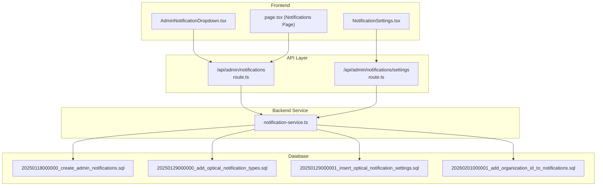
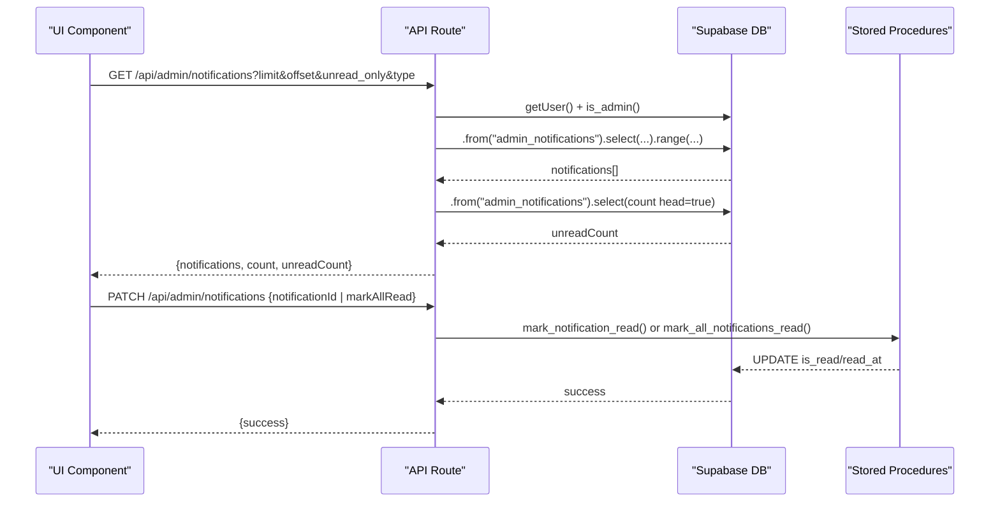
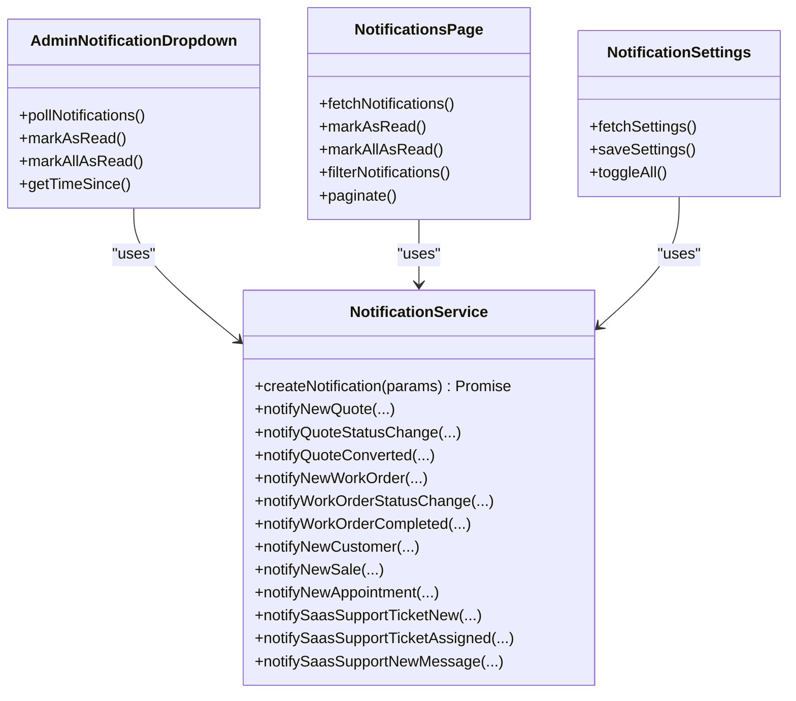

# Real-Time Notifications

<cite>
**Referenced Files in This Document**
- [AdminNotificationDropdown.tsx](file://src/components/admin/AdminNotificationDropdown.tsx)
- [NotificationSettings.tsx](file://src/components/admin/NotificationSettings.tsx)
- [route.ts](file://src/app/api/admin/notifications/route.ts)
- [route.ts](file://src/app/api/admin/notifications/settings/route.ts)
- [notification-service.ts](file://src/lib/notifications/notification-service.ts)
- [page.tsx](file://src/app/admin/notifications/page.tsx)
- [20250118000000_create_admin_notifications.sql](file://supabase/migrations/20250118000000_create_admin_notifications.sql)
- [20250129000000_add_optical_notification_types.sql](file://supabase/migrations/20250129000000_add_optical_notification_types.sql)
- [20250129000001_insert_optical_notification_settings.sql](file://supabase/migrations/20250129000001_insert_optical_notification_settings.sql)
- [20260201000001_add_organization_id_to_notifications.sql](file://supabase/migrations/20260201000001_add_organization_id_to_notifications.sql)
</cite>

## Table of Contents

1. [Introduction](#introduction)
2. [Project Structure](#project-structure)
3. [Core Components](#core-components)
4. [Architecture Overview](#architecture-overview)
5. [Detailed Component Analysis](#detailed-component-analysis)
6. [Dependency Analysis](#dependency-analysis)
7. [Performance Considerations](#performance-considerations)
8. [Troubleshooting Guide](#troubleshooting-guide)
9. [Conclusion](#conclusion)

## Introduction

This document explains the real-time notification system in Opttius, focusing on how admin alerts are generated, filtered, paginated, and presented. It covers notification types (order_new, order_status_change, low_stock, out_of_stock, support_ticket_new, support_ticket_update, payment_received, system_alert, plus optical shop-specific types), priority levels (low, medium, high, urgent), and multi-tenant data isolation via organization scoping. It also documents configuration options for notification preferences, read/unread status management, action URLs, icons mapping, time formatting, and UI components. The content is designed for administrators and developers extending the system.

## Project Structure

The notification system spans three layers:

- Frontend UI components that render notifications and settings
- API routes that enforce admin authorization, filter and paginate notifications, and manage read status
- Backend service and database migrations that define notification types, priorities, and multi-tenant scoping

**Diagram sources**

- [AdminNotificationDropdown.tsx](file://src/components/admin/AdminNotificationDropdown.tsx#L68-L118)
- [page.tsx](file://src/app/admin/notifications/page.tsx#L81-L140)
- [route.ts](file://src/app/api/admin/notifications/settings/route.ts#L7-L71)
- [notification-service.ts](file://src/lib/notifications/notification-service.ts#L49-L160)
- [20250118000000_create_admin_notifications.sql](file://supabase/migrations/20250118000000_create_admin_notifications.sql#L32-L82)
- [20250129000000_add_optical_notification_types.sql](file://supabase/migrations/20250129000000_add_optical_notification_types.sql#L47-L67)
- [20250129000001_insert_optical_notification_settings.sql](file://supabase/migrations/20250129000001_insert_optical_notification_settings.sql#L5-L28)
- [20260201000001_add_organization_id_to_notifications.sql](file://supabase/migrations/20260201000001_add_organization_id_to_notifications.sql#L6-L10)

**Section sources**

- [AdminNotificationDropdown.tsx](file://src/components/admin/AdminNotificationDropdown.tsx#L68-L118)
- [page.tsx](file://src/app/admin/notifications/page.tsx#L81-L140)
- [route.ts](file://src/app/api/admin/notifications/settings/route.ts#L7-L71)
- [notification-service.ts](file://src/lib/notifications/notification-service.ts#L49-L160)
- [20250118000000_create_admin_notifications.sql](file://supabase/migrations/20250118000000_create_admin_notifications.sql#L32-L82)

## Core Components

- AdminNotificationDropdown: Real-time dropdown showing recent notifications, polling every 30 seconds, marking as read on click, and navigating to action URLs.
- Notifications Page: Full-screen panel with filtering (unread only, type, priority), pagination, and bulk actions.
- NotificationSettings: Admin configuration UI to enable/disable types, set priority overrides, and target roles.
- API Routes: Authorization checks, filtering, pagination, and read/unread updates.
- NotificationService: Centralized creation logic with organization/branch scoping, priority resolution, and action URL generation.
- Database Migrations: Define enums, tables, RLS policies, and multi-tenant isolation.

**Section sources**

- [AdminNotificationDropdown.tsx](file://src/components/admin/AdminNotificationDropdown.tsx#L68-L118)
- [page.tsx](file://src/app/admin/notifications/page.tsx#L81-L140)
- [NotificationSettings.tsx](file://src/components/admin/NotificationSettings.tsx#L70-L113)
- [route.ts](file://src/app/api/admin/notifications/route.ts#L5-L98)
- [notification-service.ts](file://src/lib/notifications/notification-service.ts#L49-L160)
- [20250118000000_create_admin_notifications.sql](file://supabase/migrations/20250118000000_create_admin_notifications.sql#L32-L82)

## Architecture Overview

The system uses Supabase for persistence and row-level security (RLS), with Next.js API routes enforcing admin authorization and delegating read/write operations to stored procedures and service clients. Notifications are scoped by organization and optionally by branch for óptica tenants, with SaaS notifications reserved for root/dev users.

**Diagram sources**

- [route.ts](file://src/app/api/admin/notifications/route.ts#L5-L98)
- [20250118000000_create_admin_notifications.sql](file://supabase/migrations/20250118000000_create_admin_notifications.sql#L304-L329)
- [20260201000001_add_organization_id_to_notifications.sql](file://supabase/migrations/20260201000001_add_organization_id_to_notifications.sql#L236-L309)

## Detailed Component Analysis

### Notification Types and Priorities

- Types include system-wide (order_new, order_status_change, low_stock, out_of_stock, support_ticket_new, support_ticket_update, payment_received, system_alert, custom) and optical shop-specific (quote_new, quote_status_change, quote_converted, work_order_new, work_order_status_change, work_order_completed, appointment_new, appointment_cancelled, sale_new).
- Priorities: low, medium, high, urgent.
- Priority handling: Defaults to medium; configurable per type via notification_settings; overridden by service-level priority when provided.

**Section sources**

- [notification-service.ts](file://src/lib/notifications/notification-service.ts#L3-L27)
- [20250129000000_add_optical_notification_types.sql](file://supabase/migrations/20250129000000_add_optical_notification_types.sql#L47-L67)
- [20250129000001_insert_optical_notification_settings.sql](file://supabase/migrations/20250129000001_insert_optical_notification_settings.sql#L9-L19)

### Real-Time Delivery and Polling

- AdminNotificationDropdown polls every 30 seconds for recent notifications and displays unread counts.
- On click, it marks a single notification as read and navigates to action_url if present.
- Bulk mark-as-read is supported via PATCH endpoint.

**Section sources**

- [AdminNotificationDropdown.tsx](file://src/components/admin/AdminNotificationDropdown.tsx#L77-L118)
- [AdminNotificationDropdown.tsx](file://src/components/admin/AdminNotificationDropdown.tsx#L120-L170)
- [route.ts](file://src/app/api/admin/notifications/route.ts#L101-L165)

### Filtering and Pagination

- Notifications page supports:
  - Unread-only filter
  - Type filter
  - Priority filter
  - Pagination with page size 20
- API accepts limit, offset, unread_only, and type query parameters.

**Section sources**

- [page.tsx](file://src/app/admin/notifications/page.tsx#L81-L140)
- [page.tsx](file://src/app/admin/notifications/page.tsx#L90-L117)
- [route.ts](file://src/app/api/admin/notifications/route.ts#L43-L68)

### Multi-Tenant Data Isolation and Organization Scoping

- organization_id column added to admin_notifications to isolate notifications by organization.
- RLS policies ensure:
  - Root/dev users only see SaaS notifications (organization_id IS NULL).
  - Non-root users see only their organization’s notifications and those broadcast within their organization.
  - Branch scoping is enforced via get_user_branches and branch_id filtering.
- Legacy branch_id and related entity fallbacks are handled during creation.

**Section sources**

- [20260201000001_add_organization_id_to_notifications.sql](file://supabase/migrations/20260201000001_add_organization_id_to_notifications.sql#L6-L10)
- [20260201000001_add_organization_id_to_notifications.sql](file://supabase/migrations/20260201000001_add_organization_id_to_notifications.sql#L173-L205)
- [notification-service.ts](file://src/lib/notifications/notification-service.ts#L83-L125)

### Notification Creation and Triggers

- NotificationService.createNotification:
  - Checks notification_settings for enabled/priority overrides
  - Resolves organization_id from branchId, related entity, or explicit parameter
  - Inserts into admin_notifications with optional target_admin_id/role and branch_id
- Database triggers (removed in later migration) previously created notifications for orders and low stock; current logic relies on service-driven creation.

**Section sources**

- [notification-service.ts](file://src/lib/notifications/notification-service.ts#L53-L160)
- [20250118000000_create_admin_notifications.sql](file://supabase/migrations/20250118000000_create_admin_notifications.sql#L124-L169)
- [20250118000000_create_admin_notifications.sql](file://supabase/migrations/20250118000000_create_admin_notifications.sql#L171-L229)
- [20260126000002_remove_order_notification_trigger.sql](file://supabase/migrations/20260126000002_remove_order_notification_trigger.sql)

### Configuration Options and Preferences

- NotificationSettings allows:
  - Enabling/disabling each type
  - Setting priority overrides
  - Targeting all admins or specific roles
  - Bulk toggling and saving changes
- Settings persisted in notification_settings table with RLS enforcement.

**Section sources**

- [NotificationSettings.tsx](file://src/components/admin/NotificationSettings.tsx#L70-L113)
- [route.ts](file://src/app/api/admin/notifications/settings/route.ts#L7-L71)
- [route.ts](file://src/app/api/admin/notifications/settings/route.ts#L157-L242)
- [20250129000000_add_optical_notification_types.sql](file://supabase/migrations/20250129000000_add_optical_notification_types.sql#L47-L67)

### Read/Unread Status Management

- mark_notification_read and mark_all_notifications_read update is_read, read_at, and updated_at.
- Unread count computed via get_unread_notification_count with organization and branch filters.

**Section sources**

- [20250118000000_create_admin_notifications.sql](file://supabase/migrations/20250118000000_create_admin_notifications.sql#L304-L329)
- [20260201000001_add_organization_id_to_notifications.sql](file://supabase/migrations/20260201000001_add_organization_id_to_notifications.sql#L312-L356)

### Icons Mapping and UI Components

- Icons mapped per type for compact dropdown and detailed page.
- UI components include:
  - Notification cards with priority badges
  - Action buttons and timestamps
  - Filtering and pagination controls

**Section sources**

- [AdminNotificationDropdown.tsx](file://src/components/admin/AdminNotificationDropdown.tsx#L49-L66)
- [page.tsx](file://src/app/admin/notifications/page.tsx#L50-L79)

### Time Formatting and User Interaction Patterns

- Relative time display ("a moment ago", "X min/h/days"), with absolute dates for older items.
- Click-to-mark-as-read and click-to-navigate to action_url.
- Bulk mark-all-as-read and refresh actions.

**Section sources**

- [AdminNotificationDropdown.tsx](file://src/components/admin/AdminNotificationDropdown.tsx#L172-L181)
- [page.tsx](file://src/app/admin/notifications/page.tsx#L196-L210)
- [page.tsx](file://src/app/admin/notifications/page.tsx#L234-L257)

## Dependency Analysis

**Diagram sources**

- [notification-service.ts](file://src/lib/notifications/notification-service.ts#L49-L531)
- [AdminNotificationDropdown.tsx](file://src/components/admin/AdminNotificationDropdown.tsx#L68-L170)
- [page.tsx](file://src/app/admin/notifications/page.tsx#L81-L194)
- [NotificationSettings.tsx](file://src/components/admin/NotificationSettings.tsx#L70-L165)

**Section sources**

- [notification-service.ts](file://src/lib/notifications/notification-service.ts#L49-L531)
- [AdminNotificationDropdown.tsx](file://src/components/admin/AdminNotificationDropdown.tsx#L68-L170)
- [page.tsx](file://src/app/admin/notifications/page.tsx#L81-L194)
- [NotificationSettings.tsx](file://src/components/admin/NotificationSettings.tsx#L70-L165)

## Performance Considerations

- Indexes on admin_notifications: target_admin_id, type, priority, is_read (unread), created_at, expires_at.
- RLS policies and organization_id filtering reduce result sets per user.
- Polling interval (30 seconds) balances freshness and load; adjust based on traffic.
- Pagination (page size 20) prevents large payloads; consider increasing for admin pages if needed.

[No sources needed since this section provides general guidance]

## Troubleshooting Guide

- Unauthorized or forbidden responses indicate missing admin privileges; verify is_admin RPC and auth.getUser().
- If notification_settings table is missing, the settings API returns a structured error; run the optical notification migrations.
- If organization scoping appears incorrect, verify organization_id resolution logic and RLS policies for non-root users.
- For SaaS-only visibility, ensure target_admin_role is root and organization_id remains NULL.

**Section sources**

- [route.ts](file://src/app/api/admin/notifications/route.ts#L9-L36)
- [route.ts](file://src/app/api/admin/notifications/settings/route.ts#L41-L60)
- [20260201000001_add_organization_id_to_notifications.sql](file://supabase/migrations/20260201000001_add_organization_id_to_notifications.sql#L173-L205)

## Conclusion

Opttius’ notification system combines a robust backend with flexible frontend presentation. Administrators can configure notification preferences, filter and paginate notifications, and rely on multi-tenant isolation. Developers can extend the system by adding new notification types, adjusting priorities, and integrating service-driven creation logic with organization-aware scoping.
