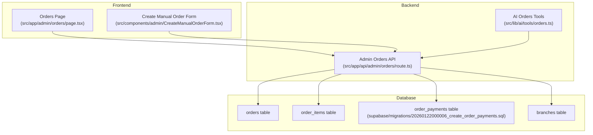
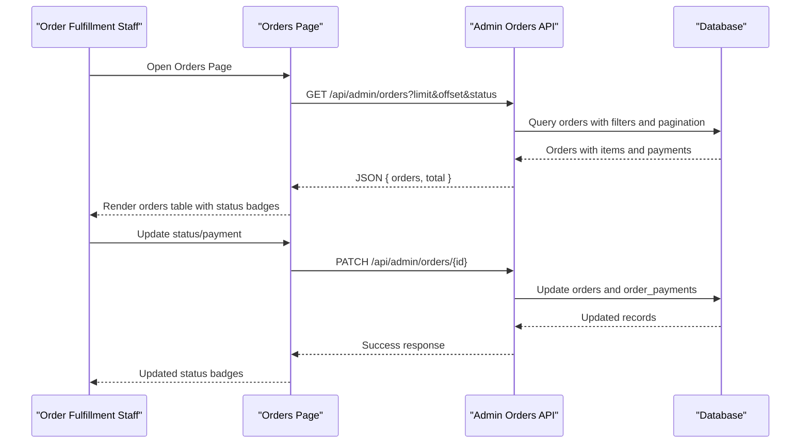
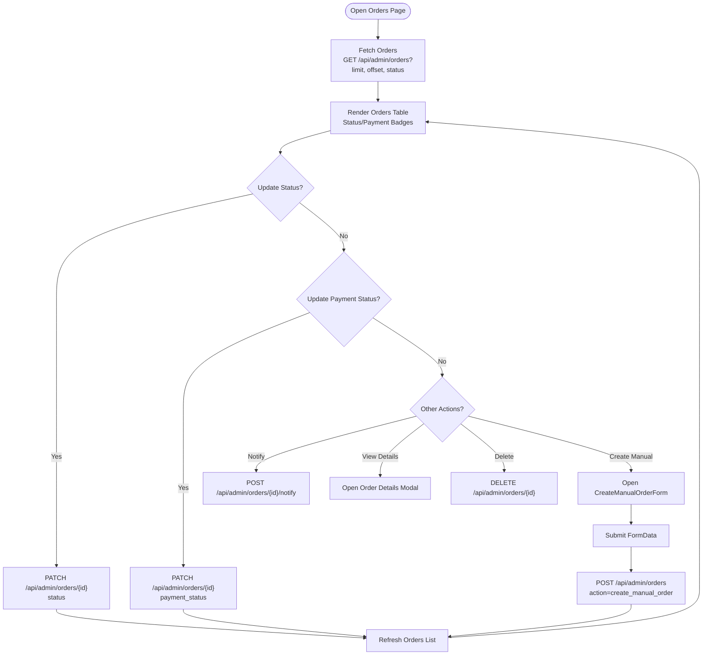
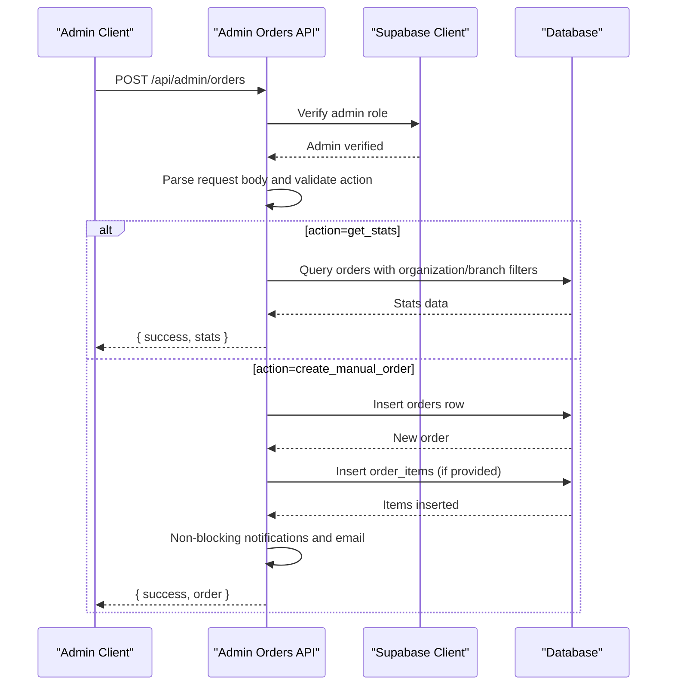
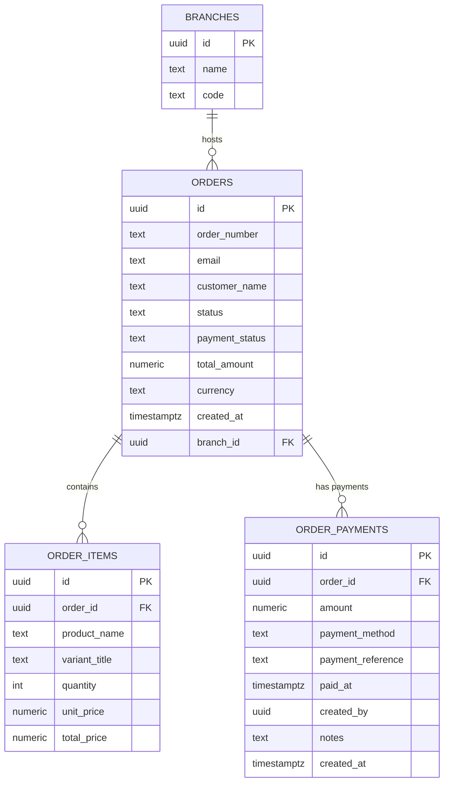
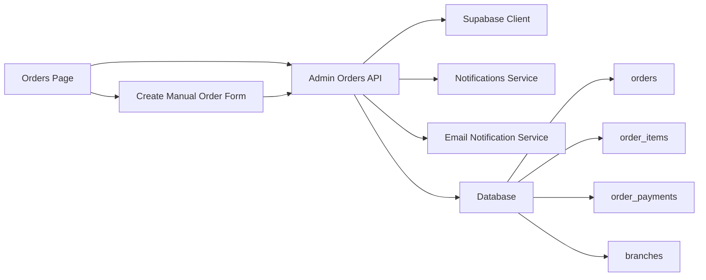

# Order Management

<cite>
**Referenced Files in This Document**
- [Orders Page](file://src/app/admin/orders/page.tsx)
- [Admin Orders API](file://src/app/api/admin/orders/route.ts)
- [AI Orders Tools](file://src/lib/ai/tools/orders.ts)
- [Orders Integration Tests](file://src/__tests__/integration/api/orders.test.ts)
- [Create Manual Order Form](file://src/components/admin/CreateManualOrderForm.tsx)
- [Order Payments Migration](file://supabase/migrations/20260122000006_create_order_payments.sql)
- [Orders Branch Migration](file://supabase/migrations/20260122000004_add_branch_id_to_orders.sql)
</cite>

## Table of Contents

1. [Introduction](#introduction)
2. [Project Structure](#project-structure)
3. [Core Components](#core-components)
4. [Architecture Overview](#architecture-overview)
5. [Detailed Component Analysis](#detailed-component-analysis)
6. [Dependency Analysis](#dependency-analysis)
7. [Performance Considerations](#performance-considerations)
8. [Troubleshooting Guide](#troubleshooting-guide)
9. [Conclusion](#conclusion)

## Introduction

This document explains the order management system in Opttius, covering the complete order lifecycle from creation to fulfillment and delivery. It documents order states, status tracking, fulfillment coordination, configuration options for order types, shipping methods, and payment processing. It also describes relationships with customer profiles, inventory systems, and accounting modules, and provides guidance for order modification, cancellation, returns, and refunds. The content is designed for both order fulfillment staff and developers extending the system.

## Project Structure

The order management system spans frontend pages, backend APIs, AI tools, and database migrations:

- Frontend:
  - Admin Orders page for viewing, filtering, and updating orders
  - Manual order creation form with customer/product search and totals calculation
- Backend:
  - Admin Orders API supporting listing, creation, and statistics
  - AI tools for programmatic order operations
- Database:
  - Migrations for order payments tracking and branch association

**Diagram sources**

- [Orders Page](file://src/app/admin/orders/page.tsx#L83-L195)
- [Create Manual Order Form](file://src/components/admin/CreateManualOrderForm.tsx#L23-L219)
- [Admin Orders API](file://src/app/api/admin/orders/route.ts#L10-L204)
- [AI Orders Tools](file://src/lib/ai/tools/orders.ts#L57-L475)
- [Order Payments Migration](file://supabase/migrations/20260122000006_create_order_payments.sql#L5-L17)
- [Orders Branch Migration](file://supabase/migrations/20260122000004_add_branch_id_to_orders.sql#L5-L6)

**Section sources**

- [Orders Page](file://src/app/admin/orders/page.tsx#L1-L985)
- [Admin Orders API](file://src/app/api/admin/orders/route.ts#L1-L748)
- [AI Orders Tools](file://src/lib/ai/tools/orders.ts#L1-L475)
- [Create Manual Order Form](file://src/components/admin/CreateManualOrderForm.tsx#L1-L561)
- [Order Payments Migration](file://supabase/migrations/20260122000006_create_order_payments.sql#L1-L58)
- [Orders Branch Migration](file://supabase/migrations/20260122000004_add_branch_id_to_orders.sql#L1-L13)

## Core Components

- Orders Page: Displays orders with filtering, pagination, status updates, and actions (notify, view details, delete).
- Admin Orders API: Handles listing, creating manual orders, and retrieving statistics with multi-tenancy and branch scoping.
- AI Orders Tools: Provides structured tools for listing orders, retrieving by ID, updating status/payment status, fetching pending orders, and computing statistics.
- Create Manual Order Form: Enables staff to create orders manually with customer lookup, product search, item management, and totals calculation.
- Database Migrations: Introduce order payments tracking and branch associations for multi-location order management.

Key order attributes exposed by the system include order_number, customer_name/customer_email, status, payment_status, total_amount, created_at, order_items, and order_payments.

**Section sources**

- [Orders Page](file://src/app/admin/orders/page.tsx#L64-L81)
- [Admin Orders API](file://src/app/api/admin/orders/route.ts#L77-L114)
- [AI Orders Tools](file://src/lib/ai/tools/orders.ts#L97-L133)
- [Create Manual Order Form](file://src/components/admin/CreateManualOrderForm.tsx#L24-L47)
- [Order Payments Migration](file://supabase/migrations/20260122000006_create_order_payments.sql#L5-L17)
- [Orders Branch Migration](file://supabase/migrations/20260122000004_add_branch_id_to_orders.sql#L5-L6)

## Architecture Overview

The order management architecture integrates frontend UI, backend API, and database layers with multi-tenancy and branch-aware filtering.

**Diagram sources**

- [Orders Page](file://src/app/admin/orders/page.tsx#L102-L195)
- [Admin Orders API](file://src/app/api/admin/orders/route.ts#L10-L204)

**Section sources**

- [Orders Page](file://src/app/admin/orders/page.tsx#L197-L264)
- [Admin Orders API](file://src/app/api/admin/orders/route.ts#L10-L204)

## Detailed Component Analysis

### Orders Page (Admin UI)

Responsibilities:

- Fetch and display orders with pagination and filtering by status.
- Update order status and payment status via dropdowns.
- Trigger email notifications and open external payment provider links.
- Create manual orders using the Create Manual Order Form.
- Delete orders with confirmation.

Implementation highlights:

- Uses URL search parameters for pagination and filtering.
- Maps frontend status values to database values (e.g., "completed" → "delivered").
- Integrates with EmailNotificationService for order confirmation.
- Supports branch-scoped operations via branch context.

**Diagram sources**

- [Orders Page](file://src/app/admin/orders/page.tsx#L102-L195)
- [Orders Page](file://src/app/admin/orders/page.tsx#L197-L336)

**Section sources**

- [Orders Page](file://src/app/admin/orders/page.tsx#L83-L195)
- [Orders Page](file://src/app/admin/orders/page.tsx#L197-L336)

### Admin Orders API

Responsibilities:

- Authorization checks (admin-only).
- Multi-tenancy and branch scoping via branch context.
- Listing orders with filters (status, payment_status, date range).
- Creating manual orders with validation and notifications.
- Retrieving order statistics (counts, revenue, recent orders).
- Deleting orders (cleanup/testing).

Key behaviors:

- Selects orders with embedded order_items and order_payments.
- Normalizes status values between frontend and database.
- Emits non-blocking notifications and sends order confirmation emails.
- Applies rate limiting for modifications.

**Diagram sources**

- [Admin Orders API](file://src/app/api/admin/orders/route.ts#L207-L667)

**Section sources**

- [Admin Orders API](file://src/app/api/admin/orders/route.ts#L10-L204)
- [Admin Orders API](file://src/app/api/admin/orders/route.ts#L207-L667)

### AI Orders Tools

Capabilities:

- List orders with optional status and payment status filters.
- Retrieve a single order by ID.
- Update order status and payment status.
- Get pending orders and compute order statistics.

Usage:

- Tools require organization context for multi-tenancy isolation.
- Execute database queries with range-based pagination.

**Section sources**

- [AI Orders Tools](file://src/lib/ai/tools/orders.ts#L57-L475)

### Create Manual Order Form

Features:

- Customer search with auto-suggest and pre-fill shipping info.
- Product search with stock visibility and quick-add.
- Dynamic item list with quantity and unit price editing.
- Automatic subtotal and total calculation.
- Submission to create manual orders via API.

Integration points:

- Submits to POST /api/admin/orders with action=create_manual_order.
- Uses customer and product search endpoints for UX.

**Section sources**

- [Create Manual Order Form](file://src/components/admin/CreateManualOrderForm.tsx#L23-L219)
- [Create Manual Order Form](file://src/components/admin/CreateManualOrderForm.tsx#L427-L547)

### Database Schema and Migrations

Order Payments Tracking:

- Adds order_payments table with payment method enumeration and references to orders.
- Provides calculate_order_balance function to compute remaining balance per order.

Branch Association:

- Adds branch_id to orders for multi-branch order tracking.

**Diagram sources**

- [Order Payments Migration](file://supabase/migrations/20260122000006_create_order_payments.sql#L5-L17)
- [Orders Branch Migration](file://supabase/migrations/20260122000004_add_branch_id_to_orders.sql#L5-L6)

**Section sources**

- [Order Payments Migration](file://supabase/migrations/20260122000006_create_order_payments.sql#L1-L58)
- [Orders Branch Migration](file://supabase/migrations/20260122000004_add_branch_id_to_orders.sql#L1-L13)

## Dependency Analysis

- Frontend depends on Admin Orders API for data and mutations.
- Admin Orders API depends on Supabase client, branch middleware, and notification/email services.
- Database migrations define the schema for orders, items, payments, and branch relationships.
- AI tools depend on Supabase client and organization context.

**Diagram sources**

- [Orders Page](file://src/app/admin/orders/page.tsx#L83-L195)
- [Create Manual Order Form](file://src/components/admin/CreateManualOrderForm.tsx#L23-L219)
- [Admin Orders API](file://src/app/api/admin/orders/route.ts#L10-L204)

**Section sources**

- [Orders Page](file://src/app/admin/orders/page.tsx#L1-L985)
- [Admin Orders API](file://src/app/api/admin/orders/route.ts#L1-L748)
- [Create Manual Order Form](file://src/components/admin/CreateManualOrderForm.tsx#L1-L561)

## Performance Considerations

- Pagination: API supports limit/offset for efficient listing; UI handles pagination state and requests.
- Filtering: Server-side filters reduce payload sizes; use status and date range filters judiciously.
- Multi-tenancy: Organization and branch filters ensure small result sets; avoid broad queries without filters.
- Notifications: Non-blocking notifications and email sends prevent UI delays.
- Rate limits: Modifications are rate-limited to protect database resources.

[No sources needed since this section provides general guidance]

## Troubleshooting Guide

Common issues and resolutions:

- Unauthorized access: Ensure admin role verification passes; check user session and RPC is_admin.
- Multi-tenancy isolation: Verify organization_id and branch_id filters; super admin scope differs from regular admin.
- Payment status mismatch: Confirm frontend-to-database status normalization (e.g., "completed" → "delivered").
- Missing order items/payments: API selects embedded relations; ensure foreign keys and inserts are successful.
- Rate limit exceeded: Modification requests may be throttled; retry after cooldown.

**Section sources**

- [Admin Orders API](file://src/app/api/admin/orders/route.ts#L16-L43)
- [Admin Orders API](file://src/app/api/admin/orders/route.ts#L502-L500)
- [Orders Integration Tests](file://src/__tests__/integration/api/orders.test.ts#L85-L193)

## Conclusion

Opttius order management provides a robust, multi-tenant, branch-aware system for managing orders from creation to delivery. The Admin Orders API centralizes order operations with strong filtering, status tracking, and payment reconciliation via the order_payments table. The UI offers intuitive controls for staff, while AI tools enable programmatic automation. Developers can extend functionality by adding new order states, integrating additional payment methods, and enhancing fulfillment workflows without disrupting existing integrations.
