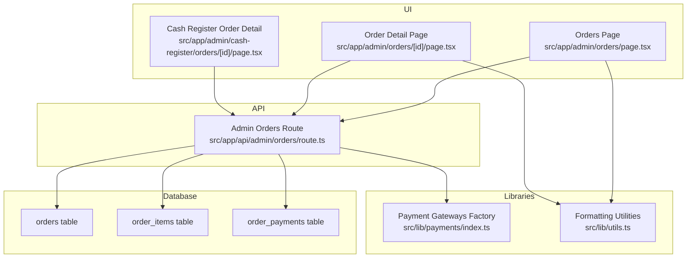
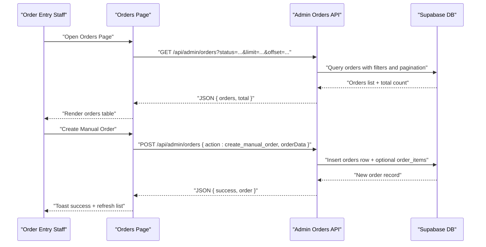
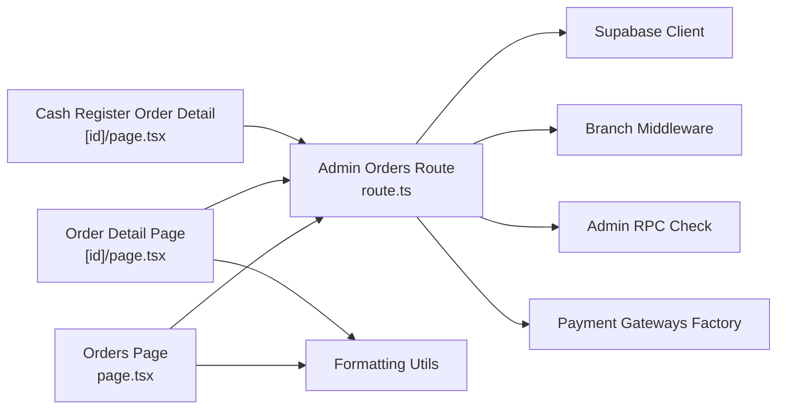

# Order Processing Workflow

<cite>
**Referenced Files in This Document**
- [src/app/admin/orders/page.tsx](file://src/app/admin/orders/page.tsx)
- [src/app/admin/orders/[id]/page.tsx](file://src/app/admin/orders/[id]/page.tsx)
- [src/app/admin/cash-register/orders/[id]/page.tsx](file://src/app/admin/cash-register/orders/[id]/page.tsx)
- [src/app/api/admin/orders/route.ts](file://src/app/api/admin/orders/route.ts)
- [src/lib/payments/index.ts](file://src/lib/payments/index.ts)
- [src/lib/utils.ts](file://src/lib/utils.ts)
- [supabase/migrations/20260122000006_create_order_payments.sql](file://supabase/migrations/20260122000006_create_order_payments.sql)
- [supabase/migrations/20260122000003_add_billing_fields_to_orders.sql](file://supabase/migrations/20260122000003_add_billing_fields_to_orders.sql)
- [supabase/migrations/20260122000004_add_branch_id_to_orders.sql](file://supabase/migrations/20260122000004_add_branch_id_to_orders.sql)
- [supabase/migrations/20260122000007_add_on_hold_payment_status.sql](file://supabase/migrations/20260122000007_add_on_hold_payment_status.sql)
- [supabase/migrations/20260127000000_update_orders_payment_status_for_partial.sql](file://supabase/migrations/20260127000000_update_orders_payment_status_for_partial.sql)
- [supabase/migrations/20260127000001_update_orders_payment_method_type_for_deposit.sql](file://supabase/migrations/20260127000001_update_orders_payment_method_type_for_deposit.sql)
- [supabase/migrations/20260127000002_add_pos_session_to_orders.sql](file://supabase/migrations/20260127000002_add_pos_session_to_orders.sql)
- [supabase/migrations/20260127000003_add_customer_name_to_orders.sql](file://supabase/migrations/20260127000003_add_customer_name_to_orders.sql)
- [supabase/migrations/20260124000004_add_cancellation_reason_to_orders.sql](file://supabase/migrations/20260124000004_add_cancellation_reason_to_orders.sql)
</cite>

## Table of Contents

1. [Introduction](#introduction)
2. [Project Structure](#project-structure)
3. [Core Components](#core-components)
4. [Architecture Overview](#architecture-overview)
5. [Detailed Component Analysis](#detailed-component-analysis)
6. [Dependency Analysis](#dependency-analysis)
7. [Performance Considerations](#performance-considerations)
8. [Troubleshooting Guide](#troubleshooting-guide)
9. [Conclusion](#conclusion)

## Introduction

This document explains the order processing workflow in Opttius from order creation through fulfillment. It covers the end-to-end lifecycle: order entry, validation, initial processing, payment handling, and fulfillment updates. It documents the order forms, validation logic, business rule enforcement, configuration options for order types, pricing, and tax handling, and the relationships with customer profiles, product catalogs, and payment processing systems. It also addresses order modification workflows, duplicate detection, and error handling procedures.

## Project Structure

The order processing system spans UI pages, API routes, and Supabase database migrations that define the data model and business rules.

**Diagram sources**

- [src/app/admin/orders/page.tsx](file://src/app/admin/orders/page.tsx#L1-L985)
- [src/app/admin/orders/[id]/page.tsx](file://src/app/admin/orders/[id]/page.tsx#L1-L270)
- [src/app/admin/cash-register/orders/[id]/page.tsx](file://src/app/admin/cash-register/orders/[id]/page.tsx#L1-L249)
- [src/app/api/admin/orders/route.ts](file://src/app/api/admin/orders/route.ts#L1-L748)
- [src/lib/payments/index.ts](file://src/lib/payments/index.ts#L1-L38)
- [src/lib/utils.ts](file://src/lib/utils.ts#L1-L21)

**Section sources**

- [src/app/admin/orders/page.tsx](file://src/app/admin/orders/page.tsx#L1-L985)
- [src/app/admin/orders/[id]/page.tsx](file://src/app/admin/orders/[id]/page.tsx#L1-L270)
- [src/app/admin/cash-register/orders/[id]/page.tsx](file://src/app/admin/cash-register/orders/[id]/page.tsx#L1-L249)
- [src/app/api/admin/orders/route.ts](file://src/app/api/admin/orders/route.ts#L1-L748)
- [src/lib/payments/index.ts](file://src/lib/payments/index.ts#L1-L38)
- [src/lib/utils.ts](file://src/lib/utils.ts#L1-L21)

## Core Components

- Orders Management UI: Lists, filters, and updates orders; creates manual orders; sends notifications; integrates with payment metadata.
- Order Detail UI: Displays order header, cancellation reason, customer and payment info, amounts, and items.
- Admin Orders API: Implements GET (list/filter), POST (create manual order), and DELETE (cleanup) endpoints with admin checks, branch context, and rate limiting.
- Payment Gateways Factory: Provides pluggable payment integrations used across the system.
- Formatting Utilities: Centralized currency/date formatting used across order displays.

Key responsibilities:

- Order entry and validation via the manual order creation endpoint.
- Multi-tenant filtering by organization and branch.
- Payment status normalization and partial payment support.
- Notification and email triggers after order creation.

**Section sources**

- [src/app/admin/orders/page.tsx](file://src/app/admin/orders/page.tsx#L83-L311)
- [src/app/admin/orders/[id]/page.tsx](file://src/app/admin/orders/[id]/page.tsx#L15-L102)
- [src/app/api/admin/orders/route.ts](file://src/app/api/admin/orders/route.ts#L10-L204)
- [src/lib/payments/index.ts](file://src/lib/payments/index.ts#L19-L34)
- [src/lib/utils.ts](file://src/lib/utils.ts#L9-L21)

## Architecture Overview

The order lifecycle is driven by the UI pages that call the Admin Orders API. The API validates requests, enforces admin permissions, applies multi-tenant filters, and persists data to Supabase. Payment metadata and order items are stored separately to support flexible payment methods and itemization.

**Diagram sources**

- [src/app/admin/orders/page.tsx](file://src/app/admin/orders/page.tsx#L102-L195)
- [src/app/api/admin/orders/route.ts](file://src/app/api/admin/orders/route.ts#L207-L667)

## Detailed Component Analysis

### Orders Listing and Management UI

- Fetches paginated orders with status and payment status filters.
- Supports searching by order number, customer name, or email.
- Allows inline updates to order and payment statuses via PATCH requests.
- Provides actions: view details, mark status transitions, send notifications, open MercadoPago links, and delete orders.
- Uses centralized formatting utilities for currency and dates.

Operational highlights:

- Pagination handled server-side via limit/offset query parameters.
- Filtering applied before rendering.
- Rate-limited mutation endpoints prevent abuse.

**Section sources**

- [src/app/admin/orders/page.tsx](file://src/app/admin/orders/page.tsx#L83-L311)
- [src/app/admin/orders/page.tsx](file://src/app/admin/orders/page.tsx#L338-L424)
- [src/app/admin/orders/page.tsx](file://src/app/admin/orders/page.tsx#L426-L442)

### Order Detail View

- Displays order header, status badges, and payment status badges.
- Shows cancellation reason when present.
- Renders customer and payment method information.
- Calculates paid and pending amounts from order_payments.
- Redirects legacy cash register route to unified order detail.

**Section sources**

- [src/app/admin/orders/[id]/page.tsx](file://src/app/admin/orders/[id]/page.tsx#L15-L102)
- [src/app/admin/orders/[id]/page.tsx](file://src/app/admin/orders/[id]/page.tsx#L49-L71)
- [src/app/admin/cash-register/orders/[id]/page.tsx](file://src/app/admin/cash-register/orders/[id]/page.tsx#L23-L26)

### Admin Orders API

Endpoints and responsibilities:

- GET /api/admin/orders
  - Admin-only endpoint with branch-aware multi-tenancy.
  - Filters by status, payment_status, and date range.
  - Returns paginated results with total count.
- POST /api/admin/orders
  - Action-based routing:
    - get_stats: aggregates order counts, monthly revenue, and recent orders with multi-tenant filtering.
    - create_manual_order: validates required fields, generates order number, maps statuses, inserts order and optional items, triggers notifications and email.
  - Rate-limited for modifications.
- DELETE /api/admin/orders
  - Cleanup endpoint (testing) that deletes all order items then orders.

Validation and business rules:

- Admin authorization enforced via RPC check.
- Multi-tenant filtering by organization_id and branch_id.
- Status mapping: frontend "completed" mapped to DB "delivered".
- Required fields validated for manual order creation (email, positive total_amount).
- Partial payment support via order_payments aggregation.

**Section sources**

- [src/app/api/admin/orders/route.ts](file://src/app/api/admin/orders/route.ts#L10-L204)
- [src/app/api/admin/orders/route.ts](file://src/app/api/admin/orders/route.ts#L207-L667)
- [src/app/api/admin/orders/route.ts](file://src/app/api/admin/orders/route.ts#L671-L747)

### Payment Integrations and Configuration

- Payment Gateways Factory supports multiple providers (Flow, MercadoPago, PayPal, NowPayments).
- Order detail displays normalized payment method labels derived from order metadata.
- Order payments are stored in a dedicated table enabling partial payments and mixed methods.

Configuration options:

- Payment method types include cash, debit, credit, deposit, and card variants.
- On-hold payment status supported for special workflows.
- POS session linkage for cash register orders.

**Section sources**

- [src/lib/payments/index.ts](file://src/lib/payments/index.ts#L1-L38)
- [src/app/admin/orders/[id]/page.tsx](file://src/app/admin/orders/[id]/page.tsx#L56-L71)
- [src/app/admin/cash-register/orders/[id]/page.tsx](file://src/app/admin/cash-register/orders/[id]/page.tsx#L182-L192)
- [supabase/migrations/20260122000006_create_order_payments.sql](file://supabase/migrations/20260122000006_create_order_payments.sql#L1-L200)
- [supabase/migrations/20260122000007_add_on_hold_payment_status.sql](file://supabase/migrations/20260122000007_add_on_hold_payment_status.sql#L1-L200)
- [supabase/migrations/20260127000000_update_orders_payment_status_for_partial.sql](file://supabase/migrations/20260127000000_update_orders_payment_status_for_partial.sql#L1-L200)
- [supabase/migrations/20260127000001_update_orders_payment_method_type_for_deposit.sql](file://supabase/migrations/20260127000001_update_orders_payment_method_type_for_deposit.sql#L1-L200)
- [supabase/migrations/20260127000002_add_pos_session_to_orders.sql](file://supabase/migrations/20260127000002_add_pos_session_to_orders.sql#L1-L200)

### Data Model and Business Rules

- Orders table stores order_number, customer_name, totals, currency, payment metadata, branch_id, organization_id, and cancellation reason.
- Order items table itemizes products with quantities and prices.
- Order payments table captures payment allocations per order.

Tax and pricing:

- Tax handling is configured at the product level and reflected in totals.
- Subtotal vs total distinction preserved for display and reporting.

Multi-tenancy:

- Organization and branch filters ensure data isolation across tenants.

**Section sources**

- [src/app/api/admin/orders/route.ts](file://src/app/api/admin/orders/route.ts#L77-L114)
- [supabase/migrations/20260122000003_add_billing_fields_to_orders.sql](file://supabase/migrations/20260122000003_add_billing_fields_to_orders.sql#L1-L200)
- [supabase/migrations/20260122000004_add_branch_id_to_orders.sql](file://supabase/migrations/20260122000004_add_branch_id_to_orders.sql#L1-L200)
- [supabase/migrations/20260124000004_add_cancellation_reason_to_orders.sql](file://supabase/migrations/20260124000004_add_cancellation_reason_to_orders.sql#L1-L200)

### Order Creation Interfaces and Validation Logic

- Manual order creation:
  - Endpoint accepts orderData with email, total_amount, optional items, shipping fields, and status.
  - Validates presence of email and positive total_amount.
  - Generates order_number using a timestamp-based pattern.
  - Maps frontend "completed" to DB "delivered".
  - Inserts order and optional order_items; triggers non-blocking notifications and email confirmation.

- Duplicate detection:
  - No explicit duplicate detection logic observed in the order creation flow.
  - Timestamp-based order_number reduces collision risk but is not a guarantee.

- Error handling:
  - Unauthorized and admin-check failures return 401/403.
  - Malformed JSON and invalid actions return 400.
  - Rate limit exceeded returns 429.
  - Internal errors return 500.

**Section sources**

- [src/app/admin/orders/page.tsx](file://src/app/admin/orders/page.tsx#L286-L311)
- [src/app/api/admin/orders/route.ts](file://src/app/api/admin/orders/route.ts#L502-L650)

### Fulfillment and Status Workflows

- Status transitions are exposed via inline selectors and dropdown actions:
  - pending → processing → shipped → delivered
  - Additional states: cancelled, refunded, partially_refunded.
- Payment status updates support paid, pending, failed, refunded, partially_refunded.
- Cancellation reason recorded when status is cancelled.

**Section sources**

- [src/app/admin/orders/page.tsx](file://src/app/admin/orders/page.tsx#L593-L633)
- [src/app/admin/orders/page.tsx](file://src/app/admin/orders/page.tsx#L636-L672)
- [src/app/admin/orders/[id]/page.tsx](file://src/app/admin/orders/[id]/page.tsx#L162-L176)
- [supabase/migrations/20260124000004_add_cancellation_reason_to_orders.sql](file://supabase/migrations/20260124000004_add_cancellation_reason_to_orders.sql#L1-L200)

### Integration with Product Catalogs and Inventory

- Order items reference product_id and product_name, enabling catalog linkage.
- Variant titles are persisted for accurate itemization.
- Inventory adjustments are not implemented in the order creation flow; product availability checks would be enforced at the product catalog layer.

**Section sources**

- [src/app/api/admin/orders/route.ts](file://src/app/api/admin/orders/route.ts#L571-L599)

### Relationship with Customer Profiles

- Orders store customer_name and email; order detail displays customer and payment method information.
- Notifications and emails leverage customer identifiers for communication.

**Section sources**

- [src/app/admin/orders/[id]/page.tsx](file://src/app/admin/orders/[id]/page.tsx#L186-L198)
- [src/app/admin/orders/[id]/page.tsx](file://src/app/admin/orders/[id]/page.tsx#L208-L217)

### Payment Processing Systems

- Payment method labels are normalized for display (cash, debit, credit, card, transfer).
- Order payments aggregation enables partial payments and mixed methods.
- Non-blocking email confirmation sent after order creation.

**Section sources**

- [src/app/admin/orders/[id]/page.tsx](file://src/app/admin/orders/[id]/page.tsx#L56-L71)
- [src/app/admin/cash-register/orders/[id]/page.tsx](file://src/app/admin/cash-register/orders/[id]/page.tsx#L182-L192)
- [src/app/api/admin/orders/route.ts](file://src/app/api/admin/orders/route.ts#L617-L644)

## Dependency Analysis

The order processing stack exhibits clear separation of concerns:

- UI pages depend on the Admin Orders API and formatting utilities.
- The API depends on Supabase client initialization, branch middleware, and admin RPC checks.
- Payment integrations are decoupled via a factory pattern.
- Database migrations define the canonical schema for orders, items, and payments.

**Diagram sources**

- [src/app/admin/orders/page.tsx](file://src/app/admin/orders/page.tsx#L61-L62)
- [src/app/admin/orders/[id]/page.tsx](file://src/app/admin/orders/[id]/page.tsx#L11-L13)
- [src/app/admin/cash-register/orders/[id]/page.tsx](file://src/app/admin/cash-register/orders/[id]/page.tsx#L11-L13)
- [src/app/api/admin/orders/route.ts](file://src/app/api/admin/orders/route.ts#L1-L9)
- [src/lib/payments/index.ts](file://src/lib/payments/index.ts#L1-L38)
- [src/lib/utils.ts](file://src/lib/utils.ts#L1-L21)

**Section sources**

- [src/app/admin/orders/page.tsx](file://src/app/admin/orders/page.tsx#L61-L62)
- [src/app/admin/orders/[id]/page.tsx](file://src/app/admin/orders/[id]/page.tsx#L11-L13)
- [src/app/admin/cash-register/orders/[id]/page.tsx](file://src/app/admin/cash-register/orders/[id]/page.tsx#L11-L13)
- [src/app/api/admin/orders/route.ts](file://src/app/api/admin/orders/route.ts#L1-L9)
- [src/lib/payments/index.ts](file://src/lib/payments/index.ts#L1-L38)
- [src/lib/utils.ts](file://src/lib/utils.ts#L1-L21)

## Performance Considerations

- Pagination: The API supports limit/offset to avoid loading large datasets; UI uses a fixed page size and calculates total pages server-side.
- Filtering: Early filtering by organization_id and branch_id minimizes dataset size.
- Rendering: Client-side search is applied only when server-side pagination is not used; otherwise, filtering occurs server-side.
- Non-blocking operations: Notifications and email sending are executed asynchronously to avoid blocking order creation.

[No sources needed since this section provides general guidance]

## Troubleshooting Guide

Common issues and resolutions:

- Unauthorized access: Ensure the user is authenticated and has admin privileges; the API returns 401/403 on failure.
- Invalid request body: JSON parsing errors return 400; verify payload structure for manual order creation.
- Rate limit exceeded: Modification requests are rate-limited; retry after the cooling-off period.
- Missing organization context: Super admin behavior differs from regular admin; ensure branch context is set appropriately.
- Payment method discrepancies: Normalize payment method labels in the UI; verify order_payments aggregation for partial payments.
- Cancellation without reason: The cash register detail page includes a debug card indicating cancelled orders without a reason.

**Section sources**

- [src/app/api/admin/orders/route.ts](file://src/app/api/admin/orders/route.ts#L197-L203)
- [src/app/api/admin/orders/route.ts](file://src/app/api/admin/orders/route.ts#L267-L279)
- [src/app/api/admin/orders/route.ts](file://src/app/api/admin/orders/route.ts#L653-L667)
- [src/app/admin/cash-register/orders/[id]/page.tsx](file://src/app/admin/cash-register/orders/[id]/page.tsx#L148-L169)

## Conclusion

Opttius implements a robust order processing workflow with clear separation between UI, API, and database layers. The Admin Orders API enforces admin permissions, multi-tenancy, and business rules, while the UI provides efficient order entry, validation, and fulfillment controls. Payment integrations are extensible, and partial payment support is built into the data model. Areas for future enhancement include explicit duplicate detection and product availability checks integrated into order creation.
