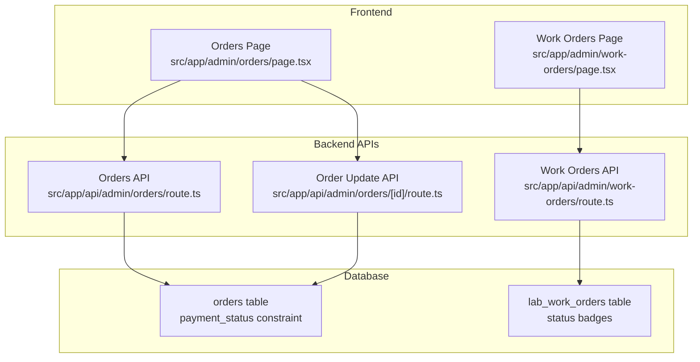
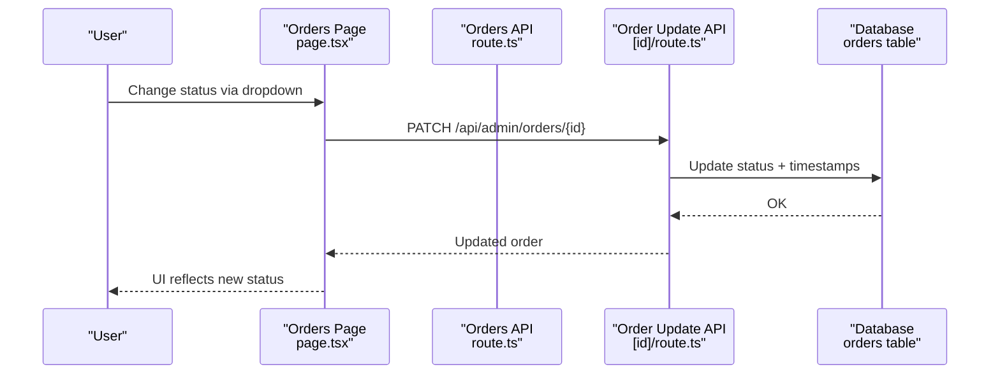
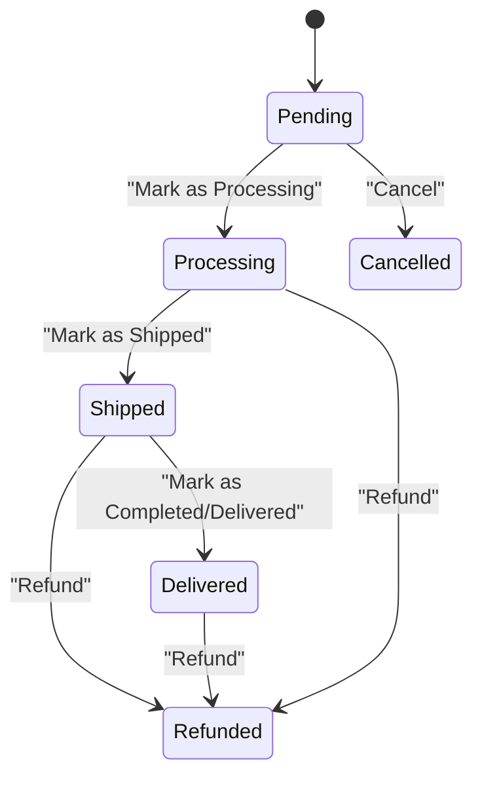
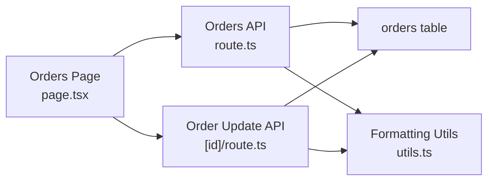

# Order Status Tracking & Management

<cite>
**Referenced Files in This Document**
- [orders.tsx](file://src/app/admin/orders/page.tsx)
- [work-orders.tsx](file://src/app/admin/work-orders/page.tsx)
- [orders-route.ts](file://src/app/api/admin/orders/route.ts)
- [orders-id-route.ts](file://src/app/api/admin/orders/[id]/route.ts)
- [work-orders-route.ts](file://src/app/api/admin/work-orders/route.ts)
- [orders-ai-tool.ts](file://src/lib/ai/tools/orders.ts)
- [utils.ts](file://src/lib/utils.ts)
- [20260127000000_update_orders_payment_status_for_partial.sql](file://supabase/migrations/20260127000000_update_orders_payment_status_for_partial.sql)
</cite>

## Table of Contents

1. [Introduction](#introduction)
2. [Project Structure](#project-structure)
3. [Core Components](#core-components)
4. [Architecture Overview](#architecture-overview)
5. [Detailed Component Analysis](#detailed-component-analysis)
6. [Dependency Analysis](#dependency-analysis)
7. [Performance Considerations](#performance-considerations)
8. [Troubleshooting Guide](#troubleshooting-guide)
9. [Conclusion](#conclusion)
10. [Appendices](#appendices)

## Introduction

This document explains the order status tracking and management system in Opttius, focusing on the order lifecycle, state machine, real-time updates, and integrations with shipping and payment systems. It covers:

- Order state machine and status transitions
- Real-time UI updates and dropdown controls
- Automated timestamping for shipped/delivered states
- Payment status handling including partial payments
- Notifications and audit trails
- Integrations with MercadoPago and internal POS
- Bulk operations, reporting, and rollback considerations

## Project Structure

The order management system spans frontend pages, backend APIs, and database constraints:

- Frontend pages manage order lists, filters, and inline status updates via dropdowns
- Backend APIs enforce authorization, multi-tenancy, and safe updates
- Database constraints define allowed statuses and guard transitions
- AI tools provide programmatic status updates with organization scoping

**Diagram sources**

- [orders.tsx](file://src/app/admin/orders/page.tsx#L593-L633)
- [work-orders.tsx](file://src/app/admin/work-orders/page.tsx#L457-L477)
- [orders-route.ts](file://src/app/api/admin/orders/route.ts#L10-L204)
- [orders-id-route.ts](file://src/app/api/admin/orders/[id]/route.ts#L42-L92)
- [work-orders-route.ts](file://src/app/api/admin/work-orders/route.ts#L15-L198)
- [20260127000000_update_orders_payment_status_for_partial.sql](file://supabase/migrations/20260127000000_update_orders_payment_status_for_partial.sql#L1-L14)

**Section sources**

- [orders.tsx](file://src/app/admin/orders/page.tsx#L593-L633)
- [work-orders.tsx](file://src/app/admin/work-orders/page.tsx#L457-L477)
- [orders-route.ts](file://src/app/api/admin/orders/route.ts#L10-L204)
- [orders-id-route.ts](file://src/app/api/admin/orders/[id]/route.ts#L42-L92)
- [work-orders-route.ts](file://src/app/api/admin/work-orders/route.ts#L15-L198)
- [20260127000000_update_orders_payment_status_for_partial.sql](file://supabase/migrations/20260127000000_update_orders_payment_status_for_partial.sql#L1-L14)

## Core Components

- Orders page with inline status/payment dropdowns, search/filter, and actions
- Work orders page with specialized lens/lab workflow statuses
- Backend APIs for listing, creating, updating, and deleting orders
- Database constraints ensuring valid payment statuses and guarded transitions
- AI tool enabling controlled status updates with organization scoping

Key behaviors:

- Order status dropdowns trigger PATCH requests to update order state
- Payment status dropdowns update payment state independently
- Timestamps for shipped/delivered are set automatically upon transition
- Partial payment support via new payment status values

**Section sources**

- [orders.tsx](file://src/app/admin/orders/page.tsx#L197-L264)
- [orders-id-route.ts](file://src/app/api/admin/orders/[id]/route.ts#L42-L92)
- [20260127000000_update_orders_payment_status_for_partial.sql](file://supabase/migrations/20260127000000_update_orders_payment_status_for_partial.sql#L8-L11)

## Architecture Overview

End-to-end flow for order status updates:

**Diagram sources**

- [orders.tsx](file://src/app/admin/orders/page.tsx#L593-L633)
- [orders-id-route.ts](file://src/app/api/admin/orders/[id]/route.ts#L42-L92)
- [orders-route.ts](file://src/app/api/admin/orders/route.ts#L10-L204)

## Detailed Component Analysis

### Orders Page: Status Dropdowns and Actions

- Inline status dropdowns allow changing order status directly from the list
- Payment status dropdowns manage payment state independently
- Conditional actions (e.g., “Mark as Processing”) appear based on current status
- Integration with MercadoPago via external link when payment ID exists
- Notification button triggers customer email notifications

Implementation highlights:

- Status and payment status updates use dedicated handlers that PATCH the order endpoint
- Local state updates optimistically for responsive UI
- Badges render status with icons and colors for quick recognition

**Section sources**

- [orders.tsx](file://src/app/admin/orders/page.tsx#L593-L633)
- [orders.tsx](file://src/app/admin/orders/page.tsx#L636-L672)
- [orders.tsx](file://src/app/admin/orders/page.tsx#L696-L730)
- [orders.tsx](file://src/app/admin/orders/page.tsx#L741-L752)

### Backend API: Order Updates and Constraints

- Authorization: Admin-only access enforced via RPC checks
- Multi-tenancy: Queries filtered by organization and branch context
- Dynamic updates: Only provided fields are updated; timestamps set for shipped/delivered transitions
- Validation: Manual order creation validates required fields and maps frontend statuses to DB values

Constraints:

- Payment status includes new values: pending, paid, failed, refunded, partially_refunded, partial, on_hold_payment

**Section sources**

- [orders-route.ts](file://src/app/api/admin/orders/route.ts#L10-L204)
- [orders-route.ts](file://src/app/api/admin/orders/route.ts#L502-L650)
- [orders-id-route.ts](file://src/app/api/admin/orders/[id]/route.ts#L42-L92)
- [20260127000000_update_orders_payment_status_for_partial.sql](file://supabase/migrations/20260127000000_update_orders_payment_status_for_partial.sql#L8-L11)

### Work Orders Page: Lens/Lab Workflow

- Dedicated status badges and payment status editing
- Conditional actions based on current status
- Branch-aware filtering and multi-tenant isolation
- Stats cards show key workflow metrics (e.g., “Ready for Pickup”, “Delivered”)

**Section sources**

- [work-orders.tsx](file://src/app/admin/work-orders/page.tsx#L157-L238)
- [work-orders.tsx](file://src/app/admin/work-orders/page.tsx#L457-L477)
- [work-orders-route.ts](file://src/app/api/admin/work-orders/route.ts#L15-L198)

### AI Tool: Controlled Status Updates

- Validates organization context and order ID
- Updates status and sets shipped/delivered timestamps when applicable
- Returns structured success/error responses

**Section sources**

- [orders-ai-tool.ts](file://src/lib/ai/tools/orders.ts#L248-L276)

### State Machine and Transitions

Order status model:

- Order status: pending, processing, shipped, delivered, cancelled, refunded
- Payment status: pending, paid, failed, refunded, partially_refunded, partial, on_hold_payment

Automated transitions:

- Transitioning to shipped sets shipped_at timestamp
- Transitioning to delivered sets delivered_at timestamp

**Diagram sources**

- [orders.tsx](file://src/app/admin/orders/page.tsx#L606-L631)
- [orders-id-route.ts](file://src/app/api/admin/orders/[id]/route.ts#L74-L79)

**Section sources**

- [orders.tsx](file://src/app/admin/orders/page.tsx#L606-L631)
- [orders-id-route.ts](file://src/app/api/admin/orders/[id]/route.ts#L74-L79)

### Real-Time Updates and UI Behaviors

- Dropdown menus replace entire status rows with new values after successful PATCH
- Icons and colors provide immediate visual feedback
- Conditional menu items enable context-specific actions

**Section sources**

- [orders.tsx](file://src/app/admin/orders/page.tsx#L197-L227)
- [orders.tsx](file://src/app/admin/orders/page.tsx#L229-L264)

### Audit Trail and Notifications

- Backend logs all administrative actions
- Order confirmation emails sent after manual order creation
- New sale and new work order notifications triggered after creation

**Section sources**

- [orders-route.ts](file://src/app/api/admin/orders/route.ts#L605-L644)
- [work-orders-route.ts](file://src/app/api/admin/work-orders/route.ts#L409-L424)

### Integrations

- MercadoPago: External links to payment activities when payment IDs exist
- Internal POS: Work orders originate from POS sales, preventing orphaned records

**Section sources**

- [orders.tsx](file://src/app/admin/orders/page.tsx#L741-L752)
- [work-orders.tsx](file://src/app/admin/work-orders/page.tsx#L370-L371)

### Configuration Options

- Custom status definitions: Implemented via database constraints and frontend dropdowns
- Transition rules: Enforced by backend updates and UI conditions
- Notification triggers: Configurable via email notification service and notification service

Note: The payment status constraint is defined in the database migration and includes partial and on_hold_payment values.

**Section sources**

- [20260127000000_update_orders_payment_status_for_partial.sql](file://supabase/migrations/20260127000000_update_orders_payment_status_for_partial.sql#L8-L11)
- [orders.tsx](file://src/app/admin/orders/page.tsx#L648-L671)

### Bulk Operations and Reporting

- Bulk deletion endpoint exists for testing cleanup
- Statistics endpoint aggregates order counts and recent orders with multi-tenancy filters

**Section sources**

- [orders-route.ts](file://src/app/api/admin/orders/route.ts#L671-L747)
- [orders-route.ts](file://src/app/api/admin/orders/route.ts#L290-L499)

### Rollback Procedures

- No explicit rollback endpoints are present in the reviewed code
- Recommended approach: Use PATCH to revert to previous status; maintain audit logs for traceability

[No sources needed since this section provides general guidance]

## Dependency Analysis

- Frontend depends on backend APIs for CRUD operations
- Backend depends on Supabase client and branch middleware for multi-tenancy
- Database constraints govern allowed status values and transitions
- Utilities provide shared formatting functions

**Diagram sources**

- [orders.tsx](file://src/app/admin/orders/page.tsx#L593-L633)
- [orders-route.ts](file://src/app/api/admin/orders/route.ts#L10-L204)
- [orders-id-route.ts](file://src/app/api/admin/orders/[id]/route.ts#L42-L92)
- [utils.ts](file://src/lib/utils.ts#L8-L21)

**Section sources**

- [orders.tsx](file://src/app/admin/orders/page.tsx#L593-L633)
- [orders-route.ts](file://src/app/api/admin/orders/route.ts#L10-L204)
- [orders-id-route.ts](file://src/app/api/admin/orders/[id]/route.ts#L42-L92)
- [utils.ts](file://src/lib/utils.ts#L8-L21)

## Performance Considerations

- Pagination and filtering reduce payload sizes on the orders list
- Optimistic UI updates improve perceived responsiveness
- Batch-related data fetching avoids N+1 queries for work orders

[No sources needed since this section provides general guidance]

## Troubleshooting Guide

Common issues and resolutions:

- Unauthorized access: Ensure admin role and proper authentication
- Multi-tenancy filtering: Verify branch/organization context
- Payment status mismatches: Confirm allowed values per database constraint
- Timestamp not updating: Verify status transition logic in update handler

**Section sources**

- [orders-route.ts](file://src/app/api/admin/orders/route.ts#L16-L42)
- [orders-id-route.ts](file://src/app/api/admin/orders/[id]/route.ts#L42-L92)
- [20260127000000_update_orders_payment_status_for_partial.sql](file://supabase/migrations/20260127000000_update_orders_payment_status_for_partial.sql#L8-L11)

## Conclusion

Opttius implements a robust order status management system with clear state transitions, real-time UI updates, and strong backend safeguards. The system supports partial payments, integrates with MercadoPago, and provides actionable dashboards for fulfillment specialists. Developers can extend status definitions and transition rules by updating database constraints and frontend dropdowns while maintaining auditability and multi-tenancy.

## Appendices

### Status Definitions and Allowed Values

- Order status: pending, processing, shipped, delivered, cancelled, refunded
- Payment status: pending, paid, failed, refunded, partially_refunded, partial, on_hold_payment

**Section sources**

- [orders.tsx](file://src/app/admin/orders/page.tsx#L606-L631)
- [orders.tsx](file://src/app/admin/orders/page.tsx#L648-L671)
- [20260127000000_update_orders_payment_status_for_partial.sql](file://supabase/migrations/20260127000000_update_orders_payment_status_for_partial.sql#L8-L11)
