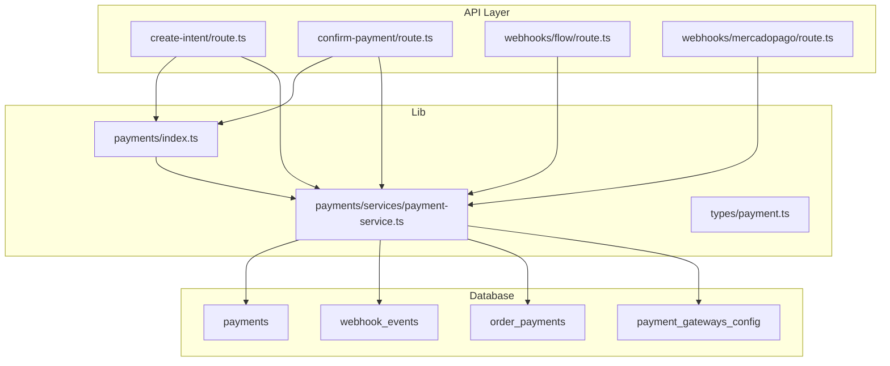
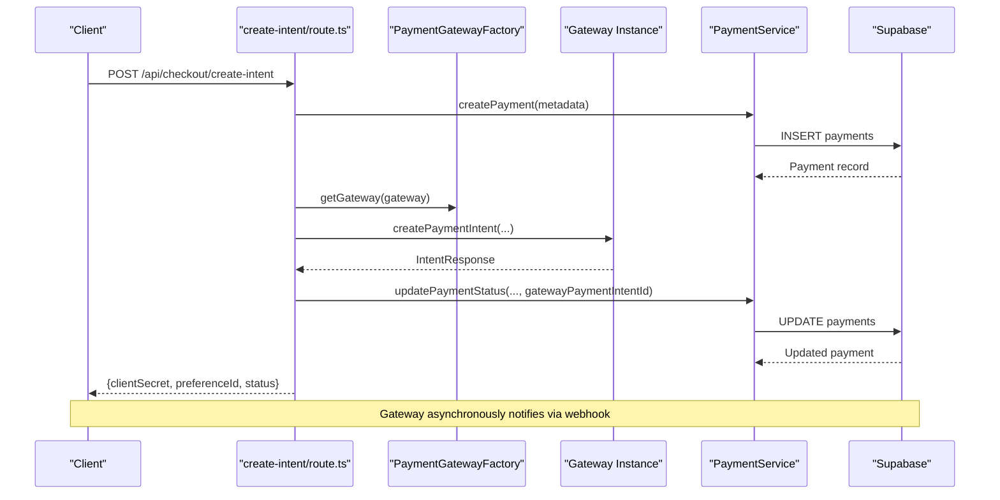
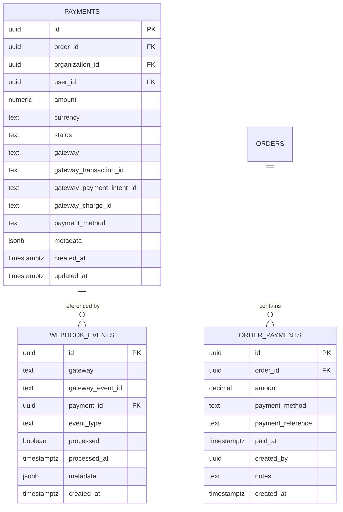
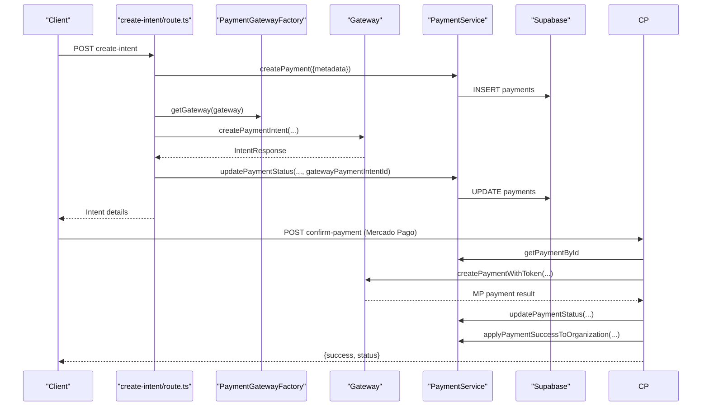
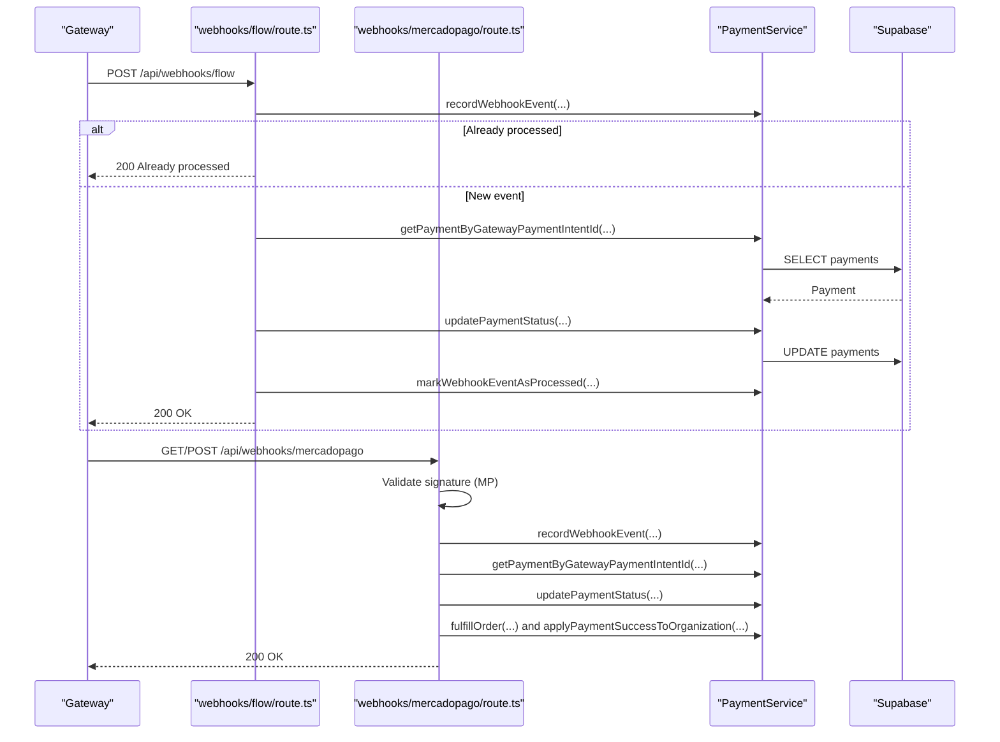
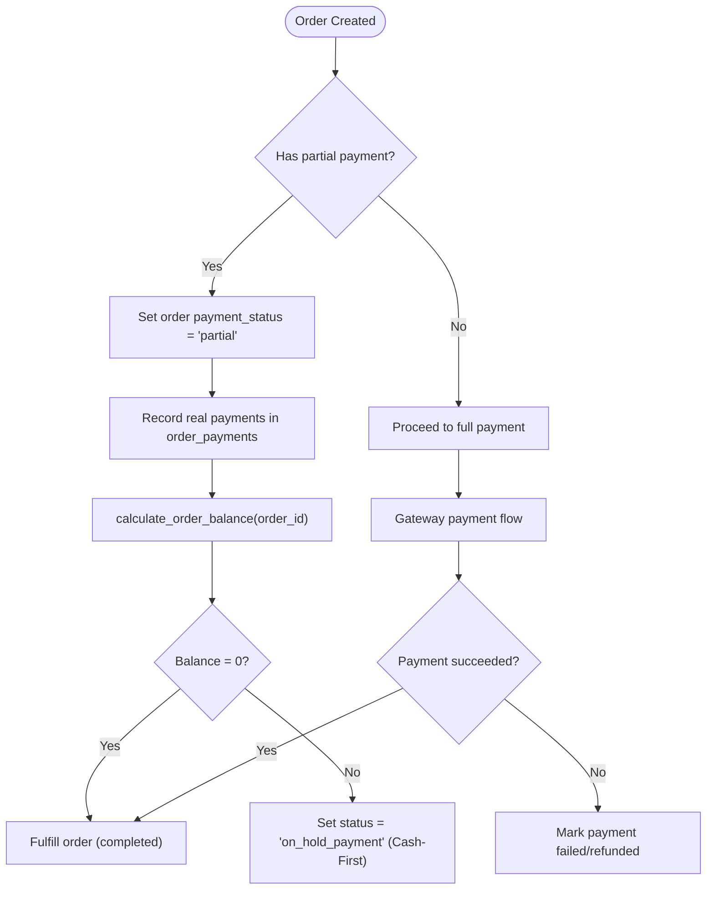
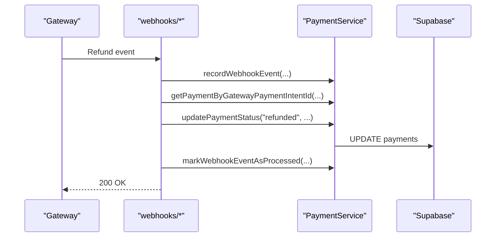
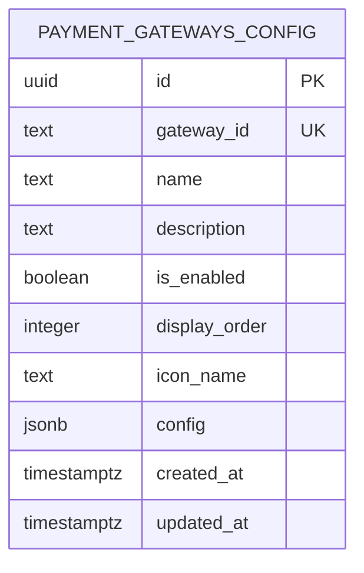
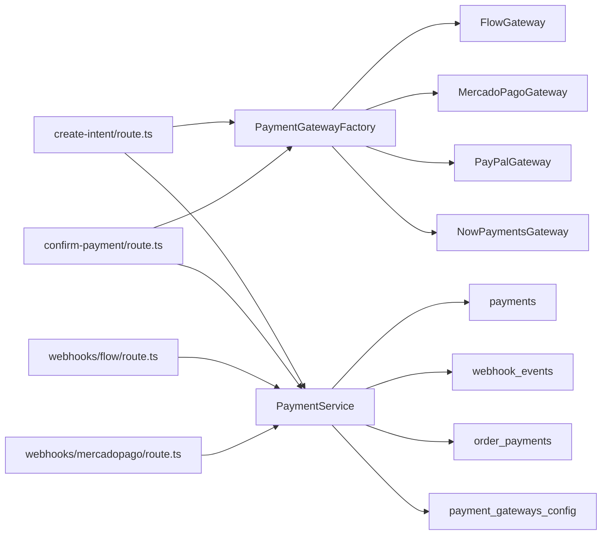

# Payment Integration & Order Fulfillment

<cite>
**Referenced Files in This Document**
- [index.ts](file://src/lib/payments/index.ts)
- [payment.ts](file://src/types/payment.ts)
- [payment-service.ts](file://src/lib/payments/services/payment-service.ts)
- [create-intent/route.ts](file://src/app/api/checkout/create-intent/route.ts)
- [confirm-payment/route.ts](file://src/app/api/checkout/confirm-payment/route.ts)
- [flow/route.ts](file://src/app/api/webhooks/flow/route.ts)
- [mercadopago/route.ts](file://src/app/api/webhooks/mercadopago/route.ts)
- [create_payments_and_webhook_events.sql](file://supabase/migrations/20260131000000_create_payments_and_webhook_events.sql)
- [create_order_payments.sql](file://supabase/migrations/20260122000006_create_order_payments.sql)
- [add_on_hold_payment_status.sql](file://supabase/migrations/20260122000007_add_on_hold_payment_status.sql)
- [update_orders_payment_status_for_partial.sql](file://supabase/migrations/20260127000000_update_orders_payment_status_for_partial.sql)
- [create_payment_gateways_config.sql](file://supabase/migrations/20260203000003_create_payment_gateways_config.sql)
</cite>

## Table of Contents

1. [Introduction](#introduction)
2. [Project Structure](#project-structure)
3. [Core Components](#core-components)
4. [Architecture Overview](#architecture-overview)
5. [Detailed Component Analysis](#detailed-component-analysis)
6. [Dependency Analysis](#dependency-analysis)
7. [Performance Considerations](#performance-considerations)
8. [Troubleshooting Guide](#troubleshooting-guide)
9. [Conclusion](#conclusion)
10. [Appendices](#appendices)

## Introduction

This document explains how Opttius coordinates payments with order fulfillment across multiple payment gateways. It covers payment-to-order synchronization, partial payments, status reconciliation, gateway integration, webhook processing, and confirmation workflows. It also documents configuration options for payment methods and gateways, and outlines relationships with accounting and subscription systems. The goal is to make the payment flow accessible to financial staff while providing developers with implementation details and operational guidance.

## Project Structure

Opttius organizes payment logic into:

- Gateway factory and interfaces for extensibility
- Payment domain types
- Payment service for database operations and orchestration
- Public checkout APIs for intent creation and payment confirmation
- Webhook handlers per gateway for asynchronous status updates
- Database migrations defining payment, webhook events, order payments, and gateway configuration tables

**Diagram sources**

- [create-intent/route.ts](file://src/app/api/checkout/create-intent/route.ts#L1-L260)
- [confirm-payment/route.ts](file://src/app/api/checkout/confirm-payment/route.ts#L1-L232)
- [flow/route.ts](file://src/app/api/webhooks/flow/route.ts#L1-L116)
- [mercadopago/route.ts](file://src/app/api/webhooks/mercadopago/route.ts#L1-L372)
- [index.ts](file://src/lib/payments/index.ts#L1-L38)
- [payment-service.ts](file://src/lib/payments/services/payment-service.ts#L1-L494)
- [payment.ts](file://src/types/payment.ts#L1-L48)
- [create_payments_and_webhook_events.sql](file://supabase/migrations/20260131000000_create_payments_and_webhook_events.sql#L24-L150)
- [create_order_payments.sql](file://supabase/migrations/20260122000006_create_order_payments.sql#L4-L58)
- [create_payment_gateways_config.sql](file://supabase/migrations/20260203000003_create_payment_gateways_config.sql#L5-L52)

**Section sources**

- [index.ts](file://src/lib/payments/index.ts#L1-L38)
- [payment.ts](file://src/types/payment.ts#L1-L48)
- [payment-service.ts](file://src/lib/payments/services/payment-service.ts#L1-L494)
- [create-intent/route.ts](file://src/app/api/checkout/create-intent/route.ts#L1-L260)
- [confirm-payment/route.ts](file://src/app/api/checkout/confirm-payment/route.ts#L1-L232)
- [flow/route.ts](file://src/app/api/webhooks/flow/route.ts#L1-L116)
- [mercadopago/route.ts](file://src/app/api/webhooks/mercadopago/route.ts#L1-L372)
- [create_payments_and_webhook_events.sql](file://supabase/migrations/20260131000000_create_payments_and_webhook_events.sql#L1-L150)
- [create_order_payments.sql](file://supabase/migrations/20260122000006_create_order_payments.sql#L1-L58)
- [create_payment_gateways_config.sql](file://supabase/migrations/20260203000003_create_payment_gateways_config.sql#L1-L52)

## Core Components

- PaymentGatewayFactory: Selects a gateway implementation by type ("flow", "mercadopago", "paypal", "nowpayments").
- Payment types: Define payment record shape, statuses, and webhook event structure aligned with database schemas.
- PaymentService: Orchestrates payment lifecycle, idempotent webhook handling, order fulfillment, and organization subscription updates.
- Checkout APIs:
  - Create payment intent: Initializes a payment record and requests a gateway intent.
  - Confirm payment: Finalizes a payment (e.g., Mercado Pago token-based).
- Webhooks: Receive asynchronous updates from gateways, reconcile statuses, and trigger fulfillment and subscription logic.

Key capabilities:

- Multi-tenant payment records with row-level security
- Idempotent webhook processing via webhook_events
- Order fulfillment on successful payment
- Organization subscription tier and billing cycle updates
- Partial payment support via order balances and statuses

**Section sources**

- [index.ts](file://src/lib/payments/index.ts#L13-L34)
- [payment.ts](file://src/types/payment.ts#L8-L48)
- [payment-service.ts](file://src/lib/payments/services/payment-service.ts#L19-L494)
- [create-intent/route.ts](file://src/app/api/checkout/create-intent/route.ts#L18-L235)
- [confirm-payment/route.ts](file://src/app/api/checkout/confirm-payment/route.ts#L17-L216)
- [flow/route.ts](file://src/app/api/webhooks/flow/route.ts#L13-L99)
- [mercadopago/route.ts](file://src/app/api/webhooks/mercadopago/route.ts#L15-L347)

## Architecture Overview

The payment system follows a request-driven creation pattern with asynchronous reconciliation via webhooks. The checkout APIs create a payment record and a gateway intent. Gateways notify Opttius through webhooks. PaymentService reconciles statuses, fulfills orders, and updates organization subscriptions.

**Diagram sources**

- [create-intent/route.ts](file://src/app/api/checkout/create-intent/route.ts#L132-L235)
- [index.ts](file://src/lib/payments/index.ts#L19-L34)
- [payment-service.ts](file://src/lib/payments/services/payment-service.ts#L27-L94)
- [create_payments_and_webhook_events.sql](file://supabase/migrations/20260131000000_create_payments_and_webhook_events.sql#L24-L41)

## Detailed Component Analysis

### Payment Types and Schema Alignment

- Payment entity captures gateway identifiers, amounts, currency, status, and metadata.
- WebhookEvent mirrors gateway events with gatewayEventId uniqueness for idempotency.
- Database constraints enforce valid statuses and gateway values.

**Diagram sources**

- [payment.ts](file://src/types/payment.ts#L12-L28)
- [payment.ts](file://src/types/payment.ts#L35-L47)
- [create_payments_and_webhook_events.sql](file://supabase/migrations/20260131000000_create_payments_and_webhook_events.sql#L24-L62)
- [create_order_payments.sql](file://supabase/migrations/20260122000006_create_order_payments.sql#L5-L17)

**Section sources**

- [payment.ts](file://src/types/payment.ts#L8-L48)
- [create_payments_and_webhook_events.sql](file://supabase/migrations/20260131000000_create_payments_and_webhook_events.sql#L24-L150)
- [create_order_payments.sql](file://supabase/migrations/20260122000006_create_order_payments.sql#L4-L58)

### Payment Creation and Confirmation Workflows

- Create Intent:
  - Validates amount, currency, and gateway selection.
  - Normalizes currencies for specific gateways (e.g., NOWPayments USD conversion).
  - Creates a payment record with pending status and metadata.
  - Requests a gateway intent and persists gateway identifiers.
- Confirm Payment (Mercado Pago):
  - Validates organization context and gateway compatibility.
  - Submits token-based payment to gateway.
  - Updates payment status and applies organization subscription changes on success.
  - Optionally saves card for future billing.

**Diagram sources**

- [create-intent/route.ts](file://src/app/api/checkout/create-intent/route.ts#L132-L235)
- [confirm-payment/route.ts](file://src/app/api/checkout/confirm-payment/route.ts#L96-L216)
- [index.ts](file://src/lib/payments/index.ts#L19-L34)
- [payment-service.ts](file://src/lib/payments/services/payment-service.ts#L27-L94)
- [payment-service.ts](file://src/lib/payments/services/payment-service.ts#L299-L445)

**Section sources**

- [create-intent/route.ts](file://src/app/api/checkout/create-intent/route.ts#L18-L235)
- [confirm-payment/route.ts](file://src/app/api/checkout/confirm-payment/route.ts#L17-L216)
- [index.ts](file://src/lib/payments/index.ts#L13-L34)
- [payment-service.ts](file://src/lib/payments/services/payment-service.ts#L27-L94)

### Webhook Processing and Status Reconciliation

- Idempotency: Each webhook event is recorded with gatewayEventId uniqueness. Duplicate events are detected and skipped.
- Status reconciliation: PaymentService updates payment status and triggers fulfillment and organization updates when appropriate.
- Flow and Mercado Pago handlers:
  - Flow: Extracts gateway identifiers from events and updates payments; fulfills orders on success.
  - Mercado Pago: Validates signatures, handles subscription/preapproval topics, merchant_order updates, and standard payment events.

**Diagram sources**

- [flow/route.ts](file://src/app/api/webhooks/flow/route.ts#L26-L99)
- [mercadopago/route.ts](file://src/app/api/webhooks/mercadopago/route.ts#L262-L347)
- [payment-service.ts](file://src/lib/payments/services/payment-service.ts#L207-L269)
- [payment-service.ts](file://src/lib/payments/services/payment-service.ts#L50-L94)
- [payment-service.ts](file://src/lib/payments/services/payment-service.ts#L271-L293)
- [payment-service.ts](file://src/lib/payments/services/payment-service.ts#L299-L445)

**Section sources**

- [flow/route.ts](file://src/app/api/webhooks/flow/route.ts#L13-L115)
- [mercadopago/route.ts](file://src/app/api/webhooks/mercadopago/route.ts#L15-L371)
- [payment-service.ts](file://src/lib/payments/services/payment-service.ts#L207-L269)

### Partial Payments and Cash-First Logic

- Orders support a "partial" status to reflect deposits or partial funding.
- A dedicated order_payments table tracks real cash/transfer/check payments against orders, enabling Cash-First workflows.
- A function computes order balance as total minus sum of order_payments, ensuring accurate outstanding amounts.

**Diagram sources**

- [update_orders_payment_status_for_partial.sql](file://supabase/migrations/20260127000000_update_orders_payment_status_for_partial.sql#L8-L11)
- [add_on_hold_payment_status.sql](file://supabase/migrations/20260122000007_add_on_hold_payment_status.sql#L9-L24)
- [create_order_payments.sql](file://supabase/migrations/20260122000006_create_order_payments.sql#L30-L55)

**Section sources**

- [update_orders_payment_status_for_partial.sql](file://supabase/migrations/20260127000000_update_orders_payment_status_for_partial.sql#L1-L15)
- [add_on_hold_payment_status.sql](file://supabase/migrations/20260122000007_add_on_hold_payment_status.sql#L1-L28)
- [create_order_payments.sql](file://supabase/migrations/20260122000006_create_order_payments.sql#L1-L58)

### Refund Coordination and Reconciliation

- PaymentService updates payment status to "refunded" upon receiving refund events from gateways.
- Webhook handlers record and process refund events idempotently, preventing duplicate actions.
- For organization subscriptions, refunds do not automatically downgrade tiers; administrators can manage subscription states accordingly.

**Diagram sources**

- [payment-service.ts](file://src/lib/payments/services/payment-service.ts#L50-L94)
- [payment-service.ts](file://src/lib/payments/services/payment-service.ts#L207-L269)
- [create_payments_and_webhook_events.sql](file://supabase/migrations/20260131000000_create_payments_and_webhook_events.sql#L111-L122)

**Section sources**

- [payment-service.ts](file://src/lib/payments/services/payment-service.ts#L50-L94)
- [mercadopago/route.ts](file://src/app/api/webhooks/mercadopago/route.ts#L316-L333)
- [flow/route.ts](file://src/app/api/webhooks/flow/route.ts#L80-L97)

### Configuration Options for Payment Methods and Settlement

- Payment gateways configuration table controls visibility and UI presentation for checkout.
- Policies enable public read for checkout UI and restricted management for elevated roles.
- Gateway-specific settings can be extended via the config JSON field.

**Diagram sources**

- [create_payment_gateways_config.sql](file://supabase/migrations/20260203000003_create_payment_gateways_config.sql#L5-L16)

**Section sources**

- [create_payment_gateways_config.sql](file://supabase/migrations/20260203000003_create_payment_gateways_config.sql#L1-L52)

### Relationships with Accounting, Inventory, and Shipping

- Order Payments: The order_payments table records real cash/transfer/check payments, supporting cash-first logic and settlement reconciliation.
- Organization Subscriptions: Successful payments update organization subscription tier and billing periods, aligning with accounting cycles.
- Inventory and Shipping: While not directly implemented here, the system’s design supports triggering inventory reservations and shipping workflows after order fulfillment. These would integrate with order status transitions and could be implemented via additional handlers or services.

**Section sources**

- [create_order_payments.sql](file://supabase/migrations/20260122000006_create_order_payments.sql#L4-L58)
- [payment-service.ts](file://src/lib/payments/services/payment-service.ts#L299-L445)

## Dependency Analysis

- PaymentGatewayFactory depends on gateway-specific implementations (Flow, Mercado Pago, PayPal, NowPayments).
- PaymentService encapsulates database operations and orchestrates reconciliation, fulfillment, and subscription updates.
- Webhook handlers depend on PaymentService and gateway-specific processors to extract identifiers and statuses.
- Database migrations define the canonical schema and constraints for payments, webhooks, order payments, and gateway configuration.

**Diagram sources**

- [index.ts](file://src/lib/payments/index.ts#L19-L34)
- [create-intent/route.ts](file://src/app/api/checkout/create-intent/route.ts#L132-L133)
- [confirm-payment/route.ts](file://src/app/api/checkout/confirm-payment/route.ts#L119-L120)
- [flow/route.ts](file://src/app/api/webhooks/flow/route.ts#L15-L16)
- [mercadopago/route.ts](file://src/app/api/webhooks/mercadopago/route.ts#L17-L19)
- [payment-service.ts](file://src/lib/payments/services/payment-service.ts#L19-L24)
- [create_payments_and_webhook_events.sql](file://supabase/migrations/20260131000000_create_payments_and_webhook_events.sql#L24-L150)

**Section sources**

- [index.ts](file://src/lib/payments/index.ts#L19-L34)
- [payment-service.ts](file://src/lib/payments/services/payment-service.ts#L19-L24)

## Performance Considerations

- Idempotent webhook handling prevents redundant processing and reduces load.
- Database indexes on gateway identifiers and timestamps optimize lookups and reconciliation.
- Rate limiting on checkout endpoints protects upstream gateways and internal resources.
- Currency normalization for specific gateways avoids repeated conversions and errors.

[No sources needed since this section provides general guidance]

## Troubleshooting Guide

Common issues and resolutions:

- Missing gateway identifiers in webhook events:
  - Handlers log warnings and mark events as processed to prevent retries.
- Duplicate webhook events:
  - Idempotency via webhook_events ensures duplicate events are ignored.
- Payment not found by gateway intent ID:
  - Handlers gracefully handle missing internal payments and mark events processed.
- Signature validation failures (Mercado Pago):
  - Handlers reject unauthorized events and log validation errors.
- Currency mismatch for specific gateways:
  - Checkout API normalizes currencies for supported gateways; verify rates and rounding.
- Order fulfillment not triggered:
  - Verify payment status is "succeeded" and order_id is linked; check logs for fulfillment errors.

Operational checks:

- Inspect webhook_events for processed flags and metadata.
- Review payment records for gateway identifiers and statuses.
- Confirm organization subscription updates after successful payments.

**Section sources**

- [flow/route.ts](file://src/app/api/webhooks/flow/route.ts#L44-L78)
- [mercadopago/route.ts](file://src/app/api/webhooks/mercadopago/route.ts#L233-L245)
- [mercadopago/route.ts](file://src/app/api/webhooks/mercadopago/route.ts#L280-L314)
- [create-intent/route.ts](file://src/app/api/checkout/create-intent/route.ts#L113-L124)
- [payment-service.ts](file://src/lib/payments/services/payment-service.ts#L207-L269)

## Conclusion

Opttius implements a robust, gateway-agnostic payment system with strong reconciliation via webhooks, idempotent processing, and clear separation of concerns. It supports partial payments, Cash-First workflows, and seamless organization subscription updates. Developers can extend gateway support through the factory, while financial teams benefit from clear audit trails and reconciliation mechanisms.

[No sources needed since this section summarizes without analyzing specific files]

## Appendices

### API Definitions

- Create Payment Intent
  - Method: POST
  - Path: /api/checkout/create-intent
  - Body fields: amount, currency, gateway, subscription_tier, isUpgrade, isDowngrade
  - Response: paymentId, clientSecret, preferenceId, approvalUrl, invoiceUrl, gatewayPaymentIntentId, status
- Confirm Payment (Mercado Pago)
  - Method: POST
  - Path: /api/checkout/confirm-payment
  - Body fields: token, paymentId, payerEmail, payment_method_id, issuer_id, description, saveCard
  - Response: success, paymentId, status, gatewayPaymentId

**Section sources**

- [create-intent/route.ts](file://src/app/api/checkout/create-intent/route.ts#L18-L235)
- [confirm-payment/route.ts](file://src/app/api/checkout/confirm-payment/route.ts#L17-L216)

### Gateway Configuration Fields

- gateway_id: Unique identifier for the gateway
- name: Display name
- description: Short description
- is_enabled: Visibility toggle
- display_order: Ordering for UI
- icon_name: UI icon reference
- config: JSON configuration (e.g., badges, labels)

**Section sources**

- [create_payment_gateways_config.sql](file://supabase/migrations/20260203000003_create_payment_gateways_config.sql#L5-L16)
