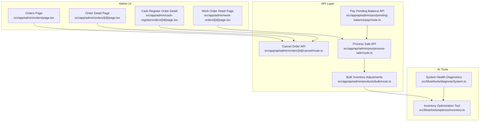
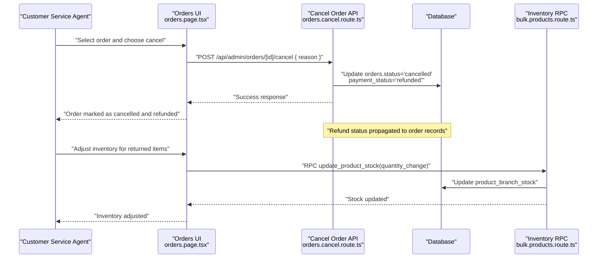
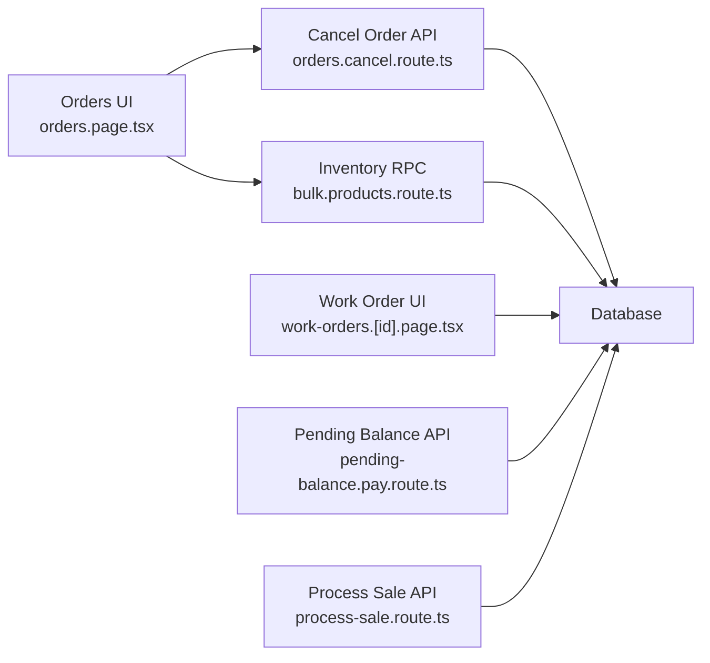

# Return & Refund Management

<cite>
**Referenced Files in This Document**
- [orders.page.tsx](file://src/app/admin/orders/page.tsx)
- [orders.[id].page.tsx](file://src/app/admin/orders/[id]/page.tsx)
- [orders.cancel.route.ts](file://src/app/api/admin/orders/[id]/cancel/route.ts)
- [work-orders.[id].page.tsx](file://src/app/admin/work-orders/[id]/page.tsx)
- [process-sale.route.ts](file://src/app/api/admin/pos/process-sale/route.ts)
- [pending-balance.pay.route.ts](file://src/app/api/admin/pos/pending-balance/pay/route.ts)
- [bulk.products.route.ts](file://src/app/api/admin/products/bulk/route.ts)
- [optimizeInventory.ts](file://src/lib/ai/tools/optimizeInventory.ts)
- [diagnoseSystem.ts](file://src/lib/ai/tools/diagnoseSystem.ts)
- [cash-register.orders.[id].page.tsx](file://src/app/admin/cash-register/orders/[id]/page.tsx)
- [PlanDeRefraccionSecciones.md](file://docs/PlanDeRefraccionSecciones.md)
</cite>

## Table of Contents

1. [Introduction](#introduction)
2. [Project Structure](#project-structure)
3. [Core Components](#core-components)
4. [Architecture Overview](#architecture-overview)
5. [Detailed Component Analysis](#detailed-component-analysis)
6. [Dependency Analysis](#dependency-analysis)
7. [Performance Considerations](#performance-considerations)
8. [Troubleshooting Guide](#troubleshooting-guide)
9. [Conclusion](#conclusion)
10. [Appendices](#appendices)

## Introduction

This document describes the return and refund management system in Opttius with a focus on:

- Return authorization process
- Item inspection workflows
- Refund processing automation
- Return reason classification
- Inventory return handling
- Financial refund coordination
- Configuration options for return policies, restocking fees, and refund methods
- Relationships with inventory systems, accounting reconciliation, and customer communication
- Return fraud prevention, exchange processing, and return shipping cost allocation

The content is designed for customer service representatives and developers, providing practical guidance and technical implementation details mapped to actual code.

## Project Structure

The return and refund domain spans several areas:

- Admin UI for order and work order views
- APIs for cancellation and payment reconciliation
- Inventory adjustment utilities
- AI tools for inventory diagnostics and optimization
- Cash register order detail pages for cancellation reasons

**Diagram sources**

- [orders.page.tsx](file://src/app/admin/orders/page.tsx#L1-L985)
- [orders.[id].page.tsx](file://src/app/admin/orders/[id]/page.tsx#L161-L200)
- [work-orders.[id].page.tsx](file://src/app/admin/work-orders/[id]/page.tsx#L363-L418)
- [cash-register.orders.[id].page.tsx](file://src/app/admin/cash-register/orders/[id]/page.tsx#L129-L169)
- [orders.cancel.route.ts](file://src/app/api/admin/orders/[id]/cancel/route.ts#L43-L142)
- [process-sale.route.ts](file://src/app/api/admin/pos/process-sale/route.ts#L832-L889)
- [pending-balance.pay.route.ts](file://src/app/api/admin/pos/pending-balance/pay/route.ts#L229-L261)
- [bulk.products.route.ts](file://src/app/api/admin/products/bulk/route.ts#L205-L279)
- [optimizeInventory.ts](file://src/lib/ai/tools/optimizeInventory.ts#L1-L185)
- [diagnoseSystem.ts](file://src/lib/ai/tools/diagnoseSystem.ts#L200-L286)

**Section sources**

- [orders.page.tsx](file://src/app/admin/orders/page.tsx#L1-L985)
- [orders.[id].page.tsx](file://src/app/admin/orders/[id]/page.tsx#L161-L200)
- [work-orders.[id].page.tsx](file://src/app/admin/work-orders/[id]/page.tsx#L363-L418)
- [cash-register.orders.[id].page.tsx](file://src/app/admin/cash-register/orders/[id]/page.tsx#L129-L169)
- [orders.cancel.route.ts](file://src/app/api/admin/orders/[id]/cancel/route.ts#L43-L142)
- [process-sale.route.ts](file://src/app/api/admin/pos/process-sale/route.ts#L832-L889)
- [pending-balance.pay.route.ts](file://src/app/api/admin/pos/pending-balance/pay/route.ts#L229-L261)
- [bulk.products.route.ts](file://src/app/api/admin/products/bulk/route.ts#L205-L279)
- [optimizeInventory.ts](file://src/lib/ai/tools/optimizeInventory.ts#L1-L185)
- [diagnoseSystem.ts](file://src/lib/ai/tools/diagnoseSystem.ts#L200-L286)

## Core Components

- Orders management UI and cancellation workflow
- Work order lifecycle impacting return-ready states
- Inventory adjustments for returned items
- Payment reconciliation for partial and full refunds
- AI-driven inventory diagnostics supporting return decisions

Key implementation references:

- Order cancellation and refund status updates
- Work order statuses including returned state
- Inventory stock adjustments via RPC
- Payment status transitions and pending balance handling
- Inventory optimization and health diagnostics

**Section sources**

- [orders.cancel.route.ts](file://src/app/api/admin/orders/[id]/cancel/route.ts#L43-L142)
- [work-orders.[id].page.tsx](file://src/app/admin/work-orders/[id]/page.tsx#L363-L418)
- [bulk.products.route.ts](file://src/app/api/admin/products/bulk/route.ts#L205-L279)
- [pending-balance.pay.route.ts](file://src/app/api/admin/pos/pending-balance/pay/route.ts#L229-L261)
- [optimizeInventory.ts](file://src/lib/ai/tools/optimizeInventory.ts#L1-L185)
- [diagnoseSystem.ts](file://src/lib/ai/tools/diagnoseSystem.ts#L200-L286)

## Architecture Overview

The return/refund flow integrates order, inventory, and payment systems. The following sequence illustrates cancellation and refund coordination:

**Diagram sources**

- [orders.page.tsx](file://src/app/admin/orders/page.tsx#L197-L264)
- [orders.cancel.route.ts](file://src/app/api/admin/orders/[id]/cancel/route.ts#L98-L126)
- [bulk.products.route.ts](file://src/app/api/admin/products/bulk/route.ts#L250-L269)

## Detailed Component Analysis

### Return Authorization Process

- Authorization triggers from the Orders UI where agents can change order status to “cancelled” and payment status to “refunded.”
- The cancellation endpoint validates admin role and branch access, then updates the order accordingly.
- The order detail page surfaces cancellation reasons for transparency.

Implementation references:

- Status and payment status updates during cancellation
- Access control checks for cancellation
- Cancellation reason display in order detail

**Section sources**

- [orders.page.tsx](file://src/app/admin/orders/page.tsx#L599-L626)
- [orders.page.tsx](file://src/app/admin/orders/page.tsx#L338-L424)
- [orders.cancel.route.ts](file://src/app/api/admin/orders/[id]/cancel/route.ts#L43-L142)
- [orders.[id].page.tsx](file://src/app/admin/orders/[id]/page.tsx#L161-L200)

### Item Inspection Workflows

- Work order detail displays lifecycle states including “returned,” enabling inspection tracking.
- Returned state indicates items were returned and awaiting inventory adjustments.

Implementation references:

- Work order status configuration including returned state
- UI badges and labels for returned items

**Section sources**

- [work-orders.[id].page.tsx](file://src/app/admin/work-orders/[id]/page.tsx#L363-L418)

### Refund Processing Automation

- Payment reconciliation supports partial and full refunds via pending balance handling.
- After payment application, the system determines whether the order is fully paid or still pending.

Implementation references:

- Pending balance payment recording and status updates
- Cash-first logic determining work order and payment statuses

**Section sources**

- [pending-balance.pay.route.ts](file://src/app/api/admin/pos/pending-balance/pay/route.ts#L229-L261)
- [process-sale.route.ts](file://src/app/api/admin/pos/process-sale/route.ts#L1096-L1125)
- [PlanDeRefraccionSecciones.md](file://docs/PlanDeRefraccionSecciones.md#L512-L593)

### Return Reason Classification

- The cancellation endpoint requires a reason, which is persisted with the order.
- The order detail page displays the cancellation reason for auditability.

Implementation references:

- Required reason field in cancellation request
- Persistence of cancellation reason
- Display of cancellation reason in order detail

**Section sources**

- [orders.cancel.route.ts](file://src/app/api/admin/orders/[id]/cancel/route.ts#L64-L107)
- [orders.[id].page.tsx](file://src/app/admin/orders/[id]/page.tsx#L161-L200)
- [cash-register.orders.[id].page.tsx](file://src/app/admin/cash-register/orders/[id]/page.tsx#L129-L169)

### Inventory Return Handling

- Returned items are reintroduced into inventory via RPC-based stock adjustments.
- Bulk inventory adjustments support set/add operations per product.

Implementation references:

- RPC invocation to update product stock quantities
- Bulk adjustment logic and stock mapping

**Section sources**

- [bulk.products.route.ts](file://src/app/api/admin/products/bulk/route.ts#L205-L279)

### Financial Refund Coordination

- Order cancellation sets payment status to refunded.
- Payment reconciliation APIs handle partial payments and finalize orders when balances are cleared.

Implementation references:

- Payment status transitions on cancellation
- Pending balance payment recording

**Section sources**

- [orders.cancel.route.ts](file://src/app/api/admin/orders/[id]/cancel/route.ts#L98-L126)
- [pending-balance.pay.route.ts](file://src/app/api/admin/pos/pending-balance/pay/route.ts#L229-L261)

### Configuration Options

- Return policy configuration is not explicitly present in the analyzed files. Administrators can manage order states and payment statuses, but dedicated return policy settings are not visible here.
- Restocking fee and refund method configurations are not present in the analyzed files.

Recommendation:

- Introduce a dedicated returns settings module to define:
  - Allowed return windows
  - Acceptable item conditions
  - Restocking fee percentages
  - Supported refund methods (original/payment method)
  - Exchange eligibility rules

[No sources needed since this section provides recommendations without analyzing specific files]

### Relationships with Inventory Systems

- Inventory adjustments are performed via RPC functions that modify branch-specific stock.
- AI tools diagnose inventory health and can guide return-related decisions (e.g., identifying overstock items likely to be returned).

Implementation references:

- Stock update RPC usage
- Inventory optimization and health diagnostics

**Section sources**

- [bulk.products.route.ts](file://src/app/api/admin/products/bulk/route.ts#L250-L269)
- [optimizeInventory.ts](file://src/lib/ai/tools/optimizeInventory.ts#L1-L185)
- [diagnoseSystem.ts](file://src/lib/ai/tools/diagnoseSystem.ts#L200-L286)

### Accounting Reconciliation

- Order and payment statuses reflect refund actions, enabling reconciliation.
- Pending balance handling ensures accurate tracking until full settlement.

[No sources needed since this section provides general guidance]

### Customer Communication

- The Orders UI allows sending email notifications to customers, which can be used to inform about cancellations/refunds.
- Cancellation reasons are displayed in order details for transparency.

**Section sources**

- [orders.page.tsx](file://src/app/admin/orders/page.tsx#L266-L284)
- [orders.[id].page.tsx](file://src/app/admin/orders/[id]/page.tsx#L161-L200)

### Return Fraud Prevention

- Role-based access controls restrict who can cancel orders.
- Branch-scoped access ensures agents can only act on orders within their accessible branches.

**Section sources**

- [orders.cancel.route.ts](file://src/app/api/admin/orders/[id]/cancel/route.ts#L43-L96)

### Exchange Processing

- Exchange workflows are not explicitly implemented in the analyzed files. Consider extending the work order lifecycle to include exchange states and inventory reservations for exchanged items.

[No sources needed since this section provides recommendations without analyzing specific files]

### Return Shipping Cost Allocation

- There is no explicit handling of return shipping costs in the analyzed files. Consider adding a configurable return shipping fee and allocating it to the customer or absorbing it based on policy.

[No sources needed since this section provides recommendations without analyzing specific files]

## Dependency Analysis

The return/refund flow depends on:

- Order cancellation API for status and payment updates
- Inventory RPC for stock adjustments
- Payment reconciliation APIs for pending balances
- Work order states for inspection and returned tracking

**Diagram sources**

- [orders.page.tsx](file://src/app/admin/orders/page.tsx#L197-L264)
- [orders.cancel.route.ts](file://src/app/api/admin/orders/[id]/cancel/route.ts#L98-L126)
- [bulk.products.route.ts](file://src/app/api/admin/products/bulk/route.ts#L250-L269)
- [work-orders.[id].page.tsx](file://src/app/admin/work-orders/[id]/page.tsx#L363-L418)
- [pending-balance.pay.route.ts](file://src/app/api/admin/pos/pending-balance/pay/route.ts#L229-L261)
- [process-sale.route.ts](file://src/app/api/admin/pos/process-sale/route.ts#L1096-L1125)

**Section sources**

- [orders.page.tsx](file://src/app/admin/orders/page.tsx#L197-L264)
- [orders.cancel.route.ts](file://src/app/api/admin/orders/[id]/cancel/route.ts#L98-L126)
- [bulk.products.route.ts](file://src/app/api/admin/products/bulk/route.ts#L250-L269)
- [work-orders.[id].page.tsx](file://src/app/admin/work-orders/[id]/page.tsx#L363-L418)
- [pending-balance.pay.route.ts](file://src/app/api/admin/pos/pending-balance/pay/route.ts#L229-L261)
- [process-sale.route.ts](file://src/app/api/admin/pos/process-sale/route.ts#L1096-L1125)

## Performance Considerations

- Batch inventory adjustments reduce repeated RPC calls.
- AI diagnostics can prevent overstock situations that increase return risk.
- Limiting actionable items in inventory optimization prevents overwhelming agents.

[No sources needed since this section provides general guidance]

## Troubleshooting Guide

Common scenarios and resolutions:

- Cancellation denied due to insufficient permissions: Verify admin role and branch access.
- Missing cancellation reason: Ensure the reason field is provided in the cancellation request.
- Inventory not adjusting after return: Confirm RPC invocation and branch-specific stock records.
- Partial payment remains after return: Use pending balance API to settle remaining amounts.

**Section sources**

- [orders.cancel.route.ts](file://src/app/api/admin/orders/[id]/cancel/route.ts#L43-L142)
- [bulk.products.route.ts](file://src/app/api/admin/products/bulk/route.ts#L250-L269)
- [pending-balance.pay.route.ts](file://src/app/api/admin/pos/pending-balance/pay/route.ts#L229-L261)

## Conclusion

Opttius provides foundational capabilities for return and refund management through order cancellation, inventory adjustments, and payment reconciliation. To enhance the system, introduce dedicated return policy configuration, restocking fees, and exchange workflows. Strengthen fraud prevention with stricter access controls and consider return shipping cost allocation and automated refund approvals based on policy rules.

[No sources needed since this section summarizes without analyzing specific files]

## Appendices

- Related implementation references for cash-first logic and work order status transitions are documented in the included reference material.

**Section sources**

- [process-sale.route.ts](file://src/app/api/admin/pos/process-sale/route.ts#L1096-L1125)
- [PlanDeRefraccionSecciones.md](file://docs/PlanDeRefraccionSecciones.md#L512-L593)
