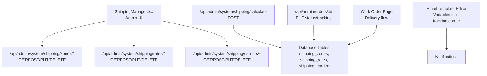
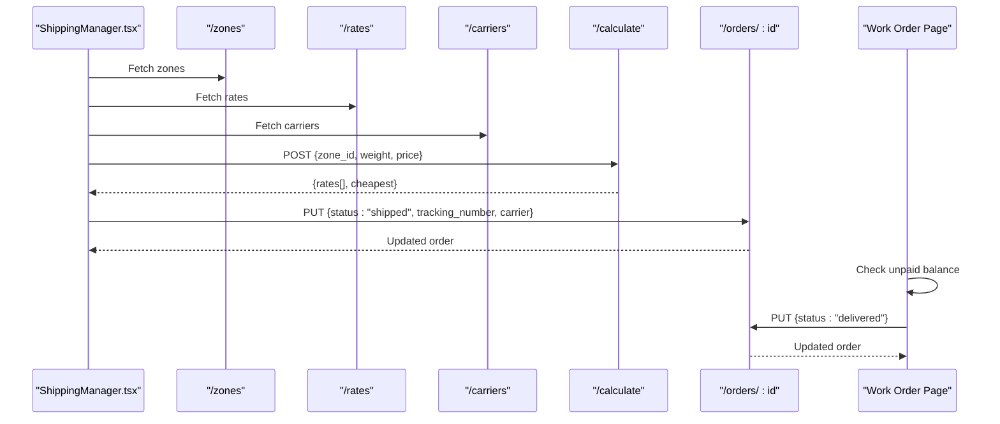
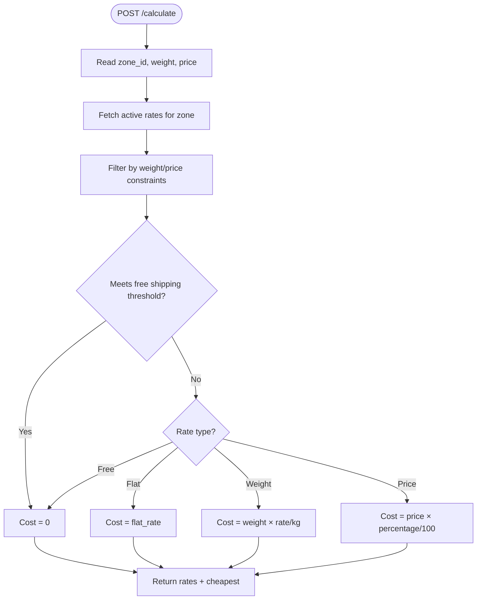
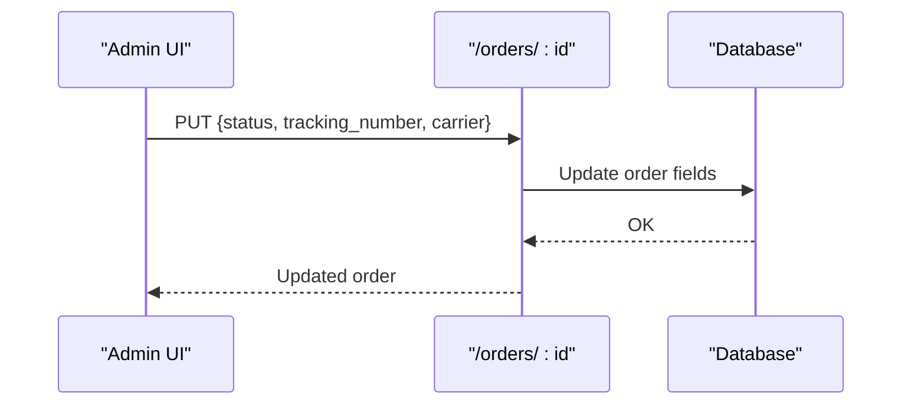
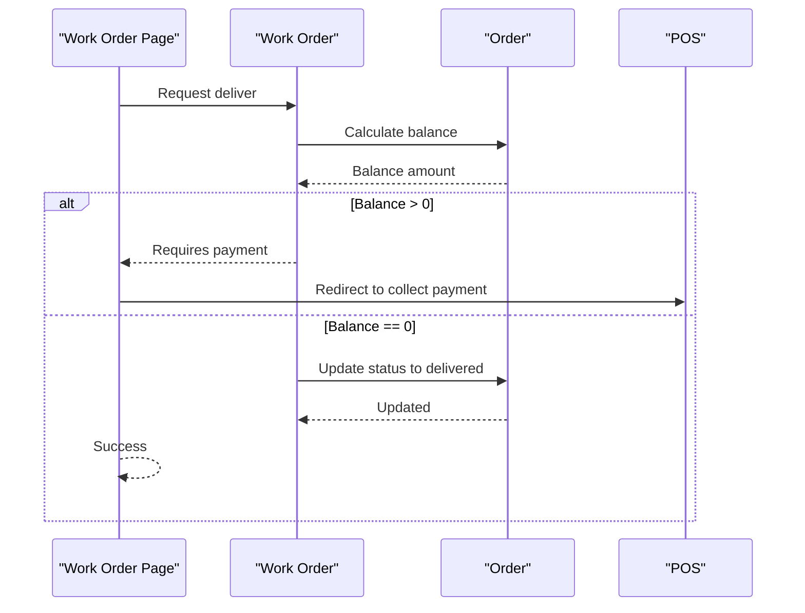
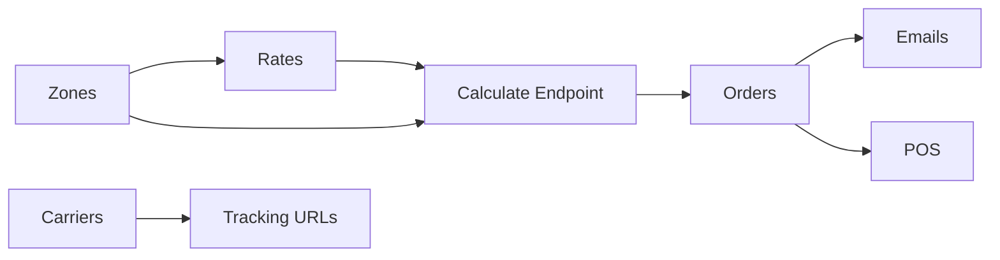

# Shipping & Fulfillment Management

<cite>
**Referenced Files in This Document**
- [route.ts](file://src/app/api/admin/system/shipping/calculate/route.ts)
- [route.ts](file://src/app/api/admin/system/shipping/carriers/route.ts)
- [route.ts](file://src/app/api/admin/system/shipping/rates/route.ts)
- [route.ts](file://src/app/api/admin/system/shipping/rates/[id]/route.ts)
- [route.ts](file://src/app/api/admin/system/shipping/zones/route.ts)
- [route.ts](file://src/app/api/admin/system/shipping/zones/[id]/route.ts)
- [ShippingManager.tsx](file://src/components/admin/ShippingManager.tsx)
- [route.ts](file://src/app/api/admin/orders/[id]/route.ts)
- [page.tsx](file://src/app/admin/work-orders/[id]/page.tsx)
- [PlanDeRefraccionSecciones.md](file://docs/PlanDeRefraccionSecciones.md)
- [EmailTemplateEditor.tsx](file://src/components/admin/EmailTemplateEditor.tsx)
</cite>

## Table of Contents

1. [Introduction](#introduction)
2. [Project Structure](#project-structure)
3. [Core Components](#core-components)
4. [Architecture Overview](#architecture-overview)
5. [Detailed Component Analysis](#detailed-component-analysis)
6. [Dependency Analysis](#dependency-analysis)
7. [Performance Considerations](#performance-considerations)
8. [Troubleshooting Guide](#troubleshooting-guide)
9. [Conclusion](#conclusion)
10. [Appendices](#appendices)

## Introduction

This document explains the shipping and fulfillment management system in Opttius. It covers how shipping zones and rates are configured, how shipping costs are calculated, how carriers are integrated, and how fulfillment status is tracked across orders and work orders. It also documents fulfillment notifications, return label workflows, dispute handling, and optimization strategies for warehouse-to-delivery operations. The content is designed for logistics coordinators who configure and operate the system and for developers extending shipping capabilities.

## Project Structure

The shipping and fulfillment domain is implemented as a set of Next.js routes under the admin API and a React admin component for configuration. The key areas are:

- Shipping zones and rates configuration via REST endpoints
- Carrier configuration and integration
- Shipping cost calculation engine
- Order and work-order fulfillment status updates
- Email notifications templating for shipping events

**Diagram sources**

- [ShippingManager.tsx](file://src/components/admin/ShippingManager.tsx#L148-L181)
- [route.ts](file://src/app/api/admin/system/shipping/zones/route.ts#L5-L39)
- [route.ts](file://src/app/api/admin/system/shipping/rates/route.ts#L5-L38)
- [route.ts](file://src/app/api/admin/system/shipping/carriers/route.ts#L4-L20)
- [route.ts](file://src/app/api/admin/system/shipping/calculate/route.ts#L5-L121)
- [route.ts](file://src/app/api/admin/orders/[id]/route.ts#L42-L92)
- [page.tsx](file://src/app/admin/work-orders/[id]/page.tsx#L276-L306)
- [EmailTemplateEditor.tsx](file://src/components/admin/EmailTemplateEditor.tsx#L241-L297)

**Section sources**

- [ShippingManager.tsx](file://src/components/admin/ShippingManager.tsx#L148-L181)
- [route.ts](file://src/app/api/admin/system/shipping/zones/route.ts#L5-L39)
- [route.ts](file://src/app/api/admin/system/shipping/rates/route.ts#L5-L38)
- [route.ts](file://src/app/api/admin/system/shipping/carriers/route.ts#L4-L20)
- [route.ts](file://src/app/api/admin/system/shipping/calculate/route.ts#L5-L121)
- [route.ts](file://src/app/api/admin/orders/[id]/route.ts#L42-L92)
- [page.tsx](file://src/app/admin/work-orders/[id]/page.tsx#L276-L306)
- [EmailTemplateEditor.tsx](file://src/components/admin/EmailTemplateEditor.tsx#L241-L297)

## Core Components

- Shipping zones: Define geographic regions and active flags for rate applicability.
- Shipping rates: Define pricing rules per zone (flat, weight, price percentage, free) with thresholds and delivery estimates.
- Carriers: Store carrier metadata, tracking URL templates, and optional API keys.
- Calculation engine: Computes applicable rates given zone, weight, and order value; selects the cheapest option.
- Admin UI: Provides CRUD and toggle controls for zones, rates, and carriers.
- Fulfillment status: Updates order/work-order status and timestamps for shipped/delivered; integrates with POS for outstanding balances.
- Notifications: Templated emails include shipping variables such as tracking number and carrier.

**Section sources**

- [route.ts](file://src/app/api/admin/system/shipping/zones/route.ts#L18-L32)
- [route.ts](file://src/app/api/admin/system/shipping/rates/route.ts#L11-L30)
- [route.ts](file://src/app/api/admin/system/shipping/carriers/route.ts#L7-L16)
- [route.ts](file://src/app/api/admin/system/shipping/calculate/route.ts#L24-L107)
- [ShippingManager.tsx](file://src/components/admin/ShippingManager.tsx#L48-L87)
- [route.ts](file://src/app/api/admin/orders/[id]/route.ts#L49-L92)
- [page.tsx](file://src/app/admin/work-orders/[id]/page.tsx#L276-L306)
- [EmailTemplateEditor.tsx](file://src/components/admin/EmailTemplateEditor.tsx#L241-L297)

## Architecture Overview

The system separates configuration (zones/rates/carriers) from runtime fulfillment. The calculation endpoint evaluates active rates against input criteria and returns the cheapest option. Fulfillment updates are applied to orders and work orders, optionally integrating with POS for unpaid balances.

**Diagram sources**

- [ShippingManager.tsx](file://src/components/admin/ShippingManager.tsx#L152-L181)
- [route.ts](file://src/app/api/admin/system/shipping/zones/route.ts#L18-L32)
- [route.ts](file://src/app/api/admin/system/shipping/rates/route.ts#L11-L30)
- [route.ts](file://src/app/api/admin/system/shipping/carriers/route.ts#L7-L16)
- [route.ts](file://src/app/api/admin/system/shipping/calculate/route.ts#L5-L121)
- [route.ts](file://src/app/api/admin/orders/[id]/route.ts#L49-L92)
- [page.tsx](file://src/app/admin/work-orders/[id]/page.tsx#L276-L306)

## Detailed Component Analysis

### Shipping Zones

- Purpose: Define geographic coverage and activation state for rate application.
- Fields include name, description, countries, states, cities, postal codes, is_active, sort_order.
- API supports listing, creation, updates, and deletion with admin authorization checks.

Implementation highlights:

- Validation ensures a name is provided during creation.
- Arrays normalize single values into arrays for countries/states/cities/postal codes.
- Sorting by sort_order and name improves admin UX.

**Section sources**

- [route.ts](file://src/app/api/admin/system/shipping/zones/route.ts#L42-L106)
- [route.ts](file://src/app/api/admin/system/shipping/zones/[id]/route.ts#L5-L32)
- [route.ts](file://src/app/api/admin/system/shipping/zones/[id]/route.ts#L35-L122)
- [route.ts](file://src/app/api/admin/system/shipping/zones/[id]/route.ts#L124-L170)

### Shipping Rates

- Purpose: Define pricing rules per zone with multiple rate types and constraints.
- Types: flat, weight-per-kg, price-percentage, free.
- Constraints: min/max weight, min/max price, free shipping threshold, estimated delivery days, is_active, sort_order.

Calculation logic:

- Filters active rates by zone and constraints.
- Applies rate_type formula: flat, weight × rate, price × percentage, or free.
- Enforces free shipping threshold if met.

**Section sources**

- [route.ts](file://src/app/api/admin/system/shipping/rates/route.ts#L5-L38)
- [route.ts](file://src/app/api/admin/system/shipping/rates/[id]/route.ts#L4-L24)
- [route.ts](file://src/app/api/admin/system/shipping/rates/[id]/route.ts#L26-L54)
- [route.ts](file://src/app/api/admin/system/shipping/rates/[id]/route.ts#L56-L82)
- [route.ts](file://src/app/api/admin/system/shipping/calculate/route.ts#L24-L107)

### Carriers

- Purpose: Manage carrier metadata and tracking integration.
- Fields include name, code, tracking_url_template, optional api_key, is_active.
- Tracking template supports placeholders for the tracking number.

Integration points:

- Tracking URL template enables clickable links in UI/email.
- Optional API key can be stored for future integrations.

**Section sources**

- [route.ts](file://src/app/api/admin/system/shipping/carriers/route.ts#L4-L20)
- [route.ts](file://src/app/api/admin/system/shipping/carriers/route.ts#L22-L50)
- [route.ts](file://src/app/api/admin/system/shipping/carriers/route.ts#L52-L82)
- [route.ts](file://src/app/api/admin/system/shipping/carriers/route.ts#L84-L114)
- [ShippingManager.tsx](file://src/components/admin/ShippingManager.tsx#L961-L1031)

### Shipping Cost Calculation Engine

- Endpoint: POST /api/admin/system/shipping/calculate
- Inputs: zone_id, weight, price
- Process:
  - Fetch active rates for the zone ordered by sort_order.
  - Filter by weight and price constraints; honor free shipping threshold.
  - Compute cost per rate type; return all options and the cheapest.

**Diagram sources**

- [route.ts](file://src/app/api/admin/system/shipping/calculate/route.ts#L5-L121)

**Section sources**

- [route.ts](file://src/app/api/admin/system/shipping/calculate/route.ts#L5-L121)

### Fulfillment Status Updates (Orders)

- Endpoint: PUT /api/admin/orders/:id
- Updates include status, shipped_at, delivered_at, payment_status, tracking_number, carrier.
- Timestamps are set when transitioning to shipped or delivered if not previously set.

**Diagram sources**

- [route.ts](file://src/app/api/admin/orders/[id]/route.ts#L49-L92)

**Section sources**

- [route.ts](file://src/app/api/admin/orders/[id]/route.ts#L49-L92)

### Fulfillment Delivery Flow (Work Orders)

- The work order page coordinates delivery and integrates with POS for unpaid balances.
- If a balance exists, the system requests payment before marking as delivered.
- On successful delivery, timestamps and statuses are updated.

**Diagram sources**

- [page.tsx](file://src/app/admin/work-orders/[id]/page.tsx#L276-L306)
- [PlanDeRefraccionSecciones.md](file://docs/PlanDeRefraccionSecciones.md#L792-L849)

**Section sources**

- [page.tsx](file://src/app/admin/work-orders/[id]/page.tsx#L276-L306)
- [PlanDeRefraccionSecciones.md](file://docs/PlanDeRefraccionSecciones.md#L792-L849)

### Admin UI: ShippingManager

- Fetches zones, rates, and carriers via dedicated endpoints.
- Provides forms to create/edit/delete and toggle activation for each entity.
- Presents summarized views with badges and switches for quick operational control.

Key UI flows:

- Zone creation/edit dialog with country/state/city/postal code normalization.
- Rate creation/edit dialog supporting all rate types and constraints.
- Carrier creation/edit dialog with tracking URL template and API key.

**Section sources**

- [ShippingManager.tsx](file://src/components/admin/ShippingManager.tsx#L148-L181)
- [ShippingManager.tsx](file://src/components/admin/ShippingManager.tsx#L183-L267)
- [ShippingManager.tsx](file://src/components/admin/ShippingManager.tsx#L269-L369)
- [ShippingManager.tsx](file://src/components/admin/ShippingManager.tsx#L371-L449)
- [ShippingManager.tsx](file://src/components/admin/ShippingManager.tsx#L752-L809)
- [ShippingManager.tsx](file://src/components/admin/ShippingManager.tsx#L812-L959)
- [ShippingManager.tsx](file://src/components/admin/ShippingManager.tsx#L961-L1031)

## Dependency Analysis

- Configuration dependencies:
  - Zones define scope for rates.
  - Rates depend on zones and rate_type constraints.
  - Carriers are independent but integrate with tracking and notifications.
- Runtime dependencies:
  - Calculation depends on active zones and rates.
  - Fulfillment depends on order/work-order records and POS for unpaid balances.
- UI dependencies:
  - ShippingManager orchestrates all CRUD operations and displays derived metrics.

**Diagram sources**

- [route.ts](file://src/app/api/admin/system/shipping/zones/route.ts#L18-L32)
- [route.ts](file://src/app/api/admin/system/shipping/rates/route.ts#L11-L30)
- [route.ts](file://src/app/api/admin/system/shipping/carriers/route.ts#L7-L16)
- [route.ts](file://src/app/api/admin/system/shipping/calculate/route.ts#L24-L107)
- [route.ts](file://src/app/api/admin/orders/[id]/route.ts#L49-L92)
- [EmailTemplateEditor.tsx](file://src/components/admin/EmailTemplateEditor.tsx#L241-L297)

**Section sources**

- [route.ts](file://src/app/api/admin/system/shipping/zones/route.ts#L18-L32)
- [route.ts](file://src/app/api/admin/system/shipping/rates/route.ts#L11-L30)
- [route.ts](file://src/app/api/admin/system/shipping/carriers/route.ts#L7-L16)
- [route.ts](file://src/app/api/admin/system/shipping/calculate/route.ts#L24-L107)
- [route.ts](file://src/app/api/admin/orders/[id]/route.ts#L49-L92)
- [EmailTemplateEditor.tsx](file://src/components/admin/EmailTemplateEditor.tsx#L241-L297)

## Performance Considerations

- Indexing and sorting:
  - Zones and rates are sorted by sort_order and name to optimize rendering and selection.
- Filtering efficiency:
  - Active rate filtering and constraint checks occur server-side to minimize client computation.
- Batch loading:
  - The admin UI fetches zones, rates, and carriers concurrently to reduce latency.
- Recommendations:
  - Keep zones granular but not excessive to avoid long filter chains.
  - Use free shipping thresholds judiciously to simplify calculations.
  - Cache frequently accessed zones/rates in memory if scale grows.

[No sources needed since this section provides general guidance]

## Troubleshooting Guide

Common issues and resolutions:

- Unauthorized access to admin endpoints:
  - Ensure admin authentication is established; endpoints check user session and return 401 if missing.
- Missing required fields:
  - Creating zones requires a name; creating rates requires zone_id, name, and rate_type.
- Calculation errors:
  - Verify zone_id is provided and active rates exist for the zone.
  - Confirm weight and price inputs are numeric where required.
- Fulfillment delays:
  - Ensure shipped_at/delivered_at timestamps are set only once by checking current order state before update.
- POS integration for unpaid balances:
  - If delivery is blocked due to unpaid balance, redirect to POS to collect payment before marking delivered.

**Section sources**

- [route.ts](file://src/app/api/admin/system/shipping/zones/route.ts#L58-L69)
- [route.ts](file://src/app/api/admin/system/shipping/rates/route.ts#L54-L59)
- [route.ts](file://src/app/api/admin/system/shipping/calculate/route.ts#L15-L20)
- [route.ts](file://src/app/api/admin/orders/[id]/route.ts#L49-L92)
- [page.tsx](file://src/app/admin/work-orders/[id]/page.tsx#L276-L306)

## Conclusion

Opttius provides a modular shipping and fulfillment system centered on configurable zones and rates, carrier metadata, and robust calculation logic. The admin UI streamlines day-to-day operations, while the order and work-order APIs ensure accurate fulfillment tracking and integration with POS for financial closure. Extending the system involves adding new rate types, carrier integrations, and notification templates aligned with the existing patterns.

[No sources needed since this section summarizes without analyzing specific files]

## Appendices

### Configuration Options Summary

- Shipping zones
  - Fields: name, description, countries, states, cities, postal_codes, is_active, sort_order
  - Behavior: Activation toggles rate applicability; sorting improves UX
- Shipping rates
  - Fields: zone_id, name, description, rate_type, flat_rate, weight_rate_per_kg, price_rate_percentage, min/max weight/price, free_shipping_threshold, estimated_days_min/max, is_active, sort_order
  - Behavior: Constraint-based filtering; free shipping threshold overrides cost
- Carriers
  - Fields: name, code, tracking_url_template, api_key, is_active
  - Behavior: Tracking URL template substitution; optional API key storage

**Section sources**

- [route.ts](file://src/app/api/admin/system/shipping/zones/route.ts#L42-L106)
- [route.ts](file://src/app/api/admin/system/shipping/rates/route.ts#L5-L38)
- [route.ts](file://src/app/api/admin/system/shipping/carriers/route.ts#L4-L20)
- [ShippingManager.tsx](file://src/components/admin/ShippingManager.tsx#L48-L87)

### Fulfillment Tracking and Notifications

- Tracking integration:
  - Carrier tracking URL template enables clickable links in UI/email.
- Notifications:
  - Email template variables include tracking_number and carrier for customer communication.

**Section sources**

- [route.ts](file://src/app/api/admin/system/shipping/carriers/route.ts#L7-L16)
- [EmailTemplateEditor.tsx](file://src/components/admin/EmailTemplateEditor.tsx#L241-L297)

### Return Shipping Labels and Disputes

- Return labels:
  - Not implemented in the analyzed code; propose adding a return reason field and a label generation action in the order/work-order flows.
- Disputes:
  - Not implemented in the analyzed code; propose adding a dispute status and escalation workflow synchronized with order/work-order updates.

[No sources needed since this section proposes future enhancements]
