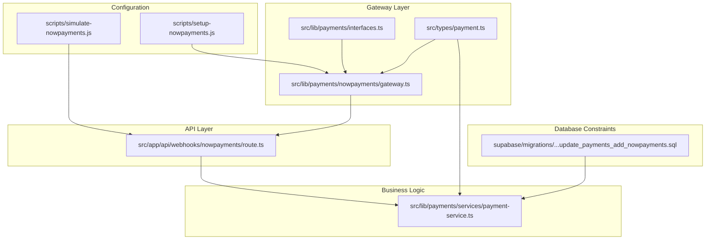
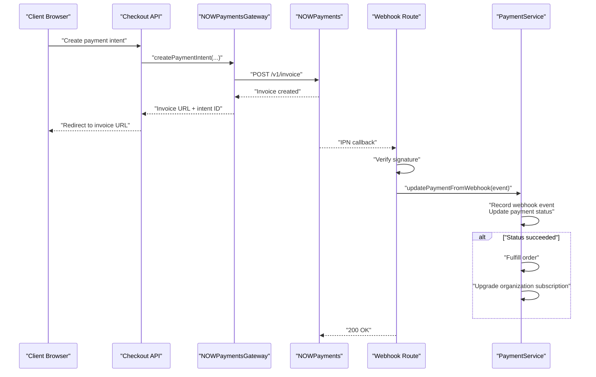
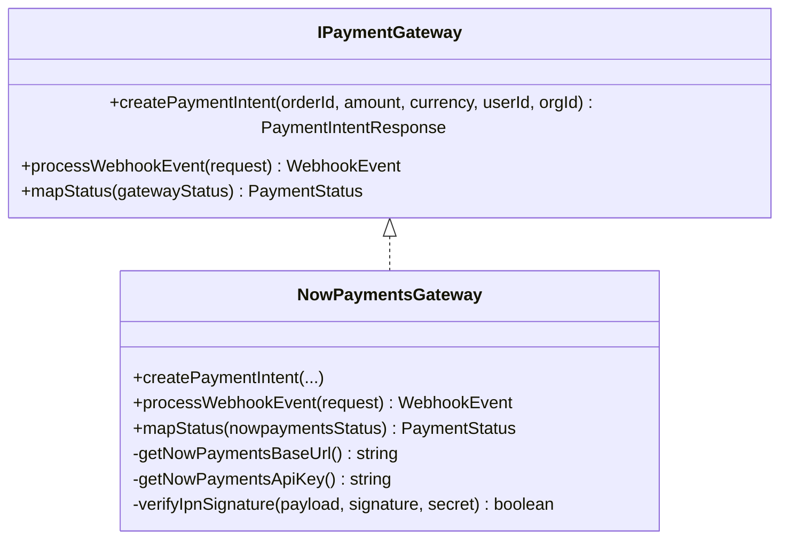
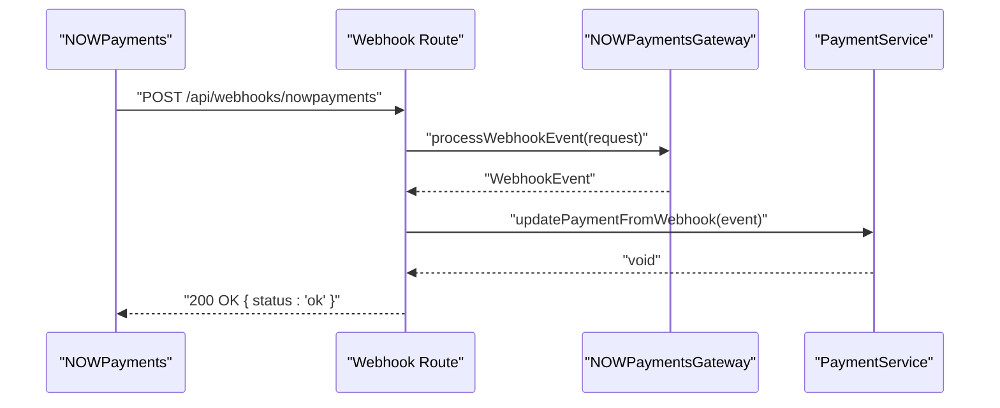
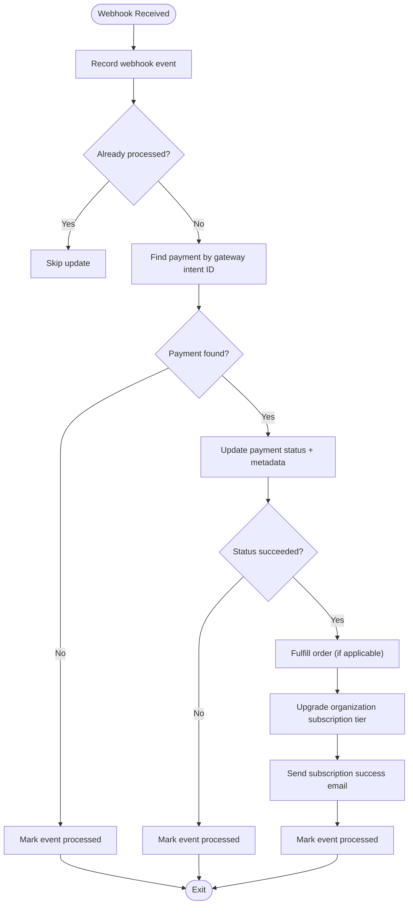
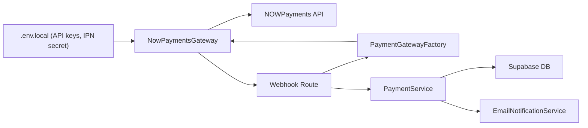

# Cryptocurrency Payment Processing

<cite>
**Referenced Files in This Document**
- [setup-nowpayments.js](file://scripts/setup-nowpayments.js)
- [simulate-nowpayments.js](file://scripts/simulate-nowpayments.js)
- [gateway.ts](file://src/lib/payments/nowpayments/gateway.ts)
- [README.md](file://src/lib/payments/nowpayments/README.md)
- [route.ts](file://src/app/api/webhooks/nowpayments/route.ts)
- [interfaces.ts](file://src/lib/payments/interfaces.ts)
- [payment-service.ts](file://src/lib/payments/services/payment-service.ts)
- [payment.ts](file://src/types/payment.ts)
- [20260203000002_update_payments_add_nowpayments.sql](file://supabase/migrations/20260203000002_update_payments_add_nowpayments.sql)
- [checkout.page.tsx](file://src/app/checkout/page.tsx)
- [CheckoutForm.tsx](file://src/components/checkout/CheckoutForm.tsx)
- [nowpayments-gateway.test.ts](file://src/__tests__/unit/lib/payments/nowpayments-gateway.test.ts)
- [nowpayments.test.ts](file://src/__tests__/integration/api/webhooks/nowpayments.test.ts)
</cite>

## Table of Contents

1. [Introduction](#introduction)
2. [Project Structure](#project-structure)
3. [Core Components](#core-components)
4. [Architecture Overview](#architecture-overview)
5. [Detailed Component Analysis](#detailed-component-analysis)
6. [Dependency Analysis](#dependency-analysis)
7. [Performance Considerations](#performance-considerations)
8. [Troubleshooting Guide](#troubleshooting-guide)
9. [Conclusion](#conclusion)
10. [Appendices](#appendices)

## Introduction

This document explains how Opttius integrates cryptocurrency payments via NOWPayments. It covers the complete payment lifecycle from quote generation to settlement, including invoice creation, redirect-based payment, webhook processing, status mapping, and subscription activation. It also documents configuration, security controls, and operational guidance for managing exchange rate volatility and compliance.

## Project Structure

The cryptocurrency payment implementation spans several areas:

- Configuration and setup scripts for NOWPayments
- Gateway abstraction and NOWPayments-specific implementation
- Webhook handler for real-time payment updates
- Payment service orchestrating database updates and subscription activation
- Types and database constraints ensuring data integrity
- Tests validating gateway behavior and webhook processing

**Diagram sources**

- [setup-nowpayments.js](file://scripts/setup-nowpayments.js#L1-L226)
- [simulate-nowpayments.js](file://scripts/simulate-nowpayments.js#L1-L200)
- [interfaces.ts](file://src/lib/payments/interfaces.ts#L1-L42)
- [gateway.ts](file://src/lib/payments/nowpayments/gateway.ts#L1-L240)
- [route.ts](file://src/app/api/webhooks/nowpayments/route.ts#L1-L70)
- [payment-service.ts](file://src/lib/payments/services/payment-service.ts#L1-L494)
- [payment.ts](file://src/types/payment.ts#L1-L48)
- [20260203000002_update_payments_add_nowpayments.sql](file://supabase/migrations/20260203000002_update_payments_add_nowpayments.sql#L1-L18)

**Section sources**

- [setup-nowpayments.js](file://scripts/setup-nowpayments.js#L1-L226)
- [gateway.ts](file://src/lib/payments/nowpayments/gateway.ts#L1-L240)
- [route.ts](file://src/app/api/webhooks/nowpayments/route.ts#L1-L70)
- [payment-service.ts](file://src/lib/payments/services/payment-service.ts#L1-L494)
- [payment.ts](file://src/types/payment.ts#L1-L48)
- [20260203000002_update_payments_add_nowpayments.sql](file://supabase/migrations/20260203000002_update_payments_add_nowpayments.sql#L1-L18)

## Core Components

- NOWPaymentsGateway: Implements the IPaymentGateway contract to create invoices and process webhooks.
- Webhook route: Receives IPNs, validates signatures, and delegates to PaymentService.
- PaymentService: Persists payment updates, ensures idempotency, fulfills orders, and activates subscriptions.
- Types and constraints: Define canonical statuses and restrict allowed gateways to ensure data integrity.

Key capabilities:

- Hosted invoice creation with redirect URLs
- HMAC-SHA512 signature verification for webhooks
- Status mapping to unified PaymentStatus
- Idempotent webhook handling and duplicate prevention
- Organization subscription upgrade and email notification

**Section sources**

- [interfaces.ts](file://src/lib/payments/interfaces.ts#L1-L42)
- [gateway.ts](file://src/lib/payments/nowpayments/gateway.ts#L58-L240)
- [route.ts](file://src/app/api/webhooks/nowpayments/route.ts#L18-L58)
- [payment-service.ts](file://src/lib/payments/services/payment-service.ts#L115-L185)
- [payment.ts](file://src/types/payment.ts#L8-L48)
- [20260203000002_update_payments_add_nowpayments.sql](file://supabase/migrations/20260203000002_update_payments_add_nowpayments.sql#L5-L13)

## Architecture Overview

The crypto payment flow is a request-response plus asynchronous callback pattern:

1. Client initiates a payment intent via the checkout API.
2. The gateway creates a NOWPayments invoice and returns an invoice URL.
3. The client is redirected to the hosted invoice page to complete payment.
4. NOWPayments posts an IPN to the webhook endpoint with payment status.
5. The webhook handler verifies the signature, normalizes the event, and updates the payment.
6. Upon success, the system fulfills the order and upgrades the organization’s subscription.

**Diagram sources**

- [gateway.ts](file://src/lib/payments/nowpayments/gateway.ts#L62-L138)
- [route.ts](file://src/app/api/webhooks/nowpayments/route.ts#L18-L58)
- [payment-service.ts](file://src/lib/payments/services/payment-service.ts#L115-L185)

## Detailed Component Analysis

### NOWPaymentsGateway

Responsibilities:

- Build API base URL and select the correct API key based on sandbox mode
- Create a hosted invoice and return invoice URL and intent identifiers
- Parse and normalize webhook payloads
- Verify IPN signatures using HMAC-SHA512
- Map gateway statuses to unified PaymentStatus

Implementation highlights:

- Uses environment variables for API keys and IPN secret
- Redirects to hosted invoice pages for improved UX and PCI compliance
- Supports sandbox mode for testing without affecting production

**Diagram sources**

- [interfaces.ts](file://src/lib/payments/interfaces.ts#L20-L41)
- [gateway.ts](file://src/lib/payments/nowpayments/gateway.ts#L58-L240)

**Section sources**

- [gateway.ts](file://src/lib/payments/nowpayments/gateway.ts#L16-L42)
- [gateway.ts](file://src/lib/payments/nowpayments/gateway.ts#L62-L138)
- [gateway.ts](file://src/lib/payments/nowpayments/gateway.ts#L143-L208)
- [gateway.ts](file://src/lib/payments/nowpayments/gateway.ts#L213-L238)

### Webhook Handler

Responsibilities:

- Receive IPN callbacks from NOWPayments
- Delegate to the gateway to parse and verify the event
- Persist and process the event via PaymentService
- Return 200 OK to NOWPayments to acknowledge receipt

Operational notes:

- Signature verification is mandatory and enforced
- The handler logs errors but responds with 200 to avoid retries on invalid requests
- Idempotency is handled by the service layer

**Diagram sources**

- [route.ts](file://src/app/api/webhooks/nowpayments/route.ts#L18-L58)
- [gateway.ts](file://src/lib/payments/nowpayments/gateway.ts#L143-L208)
- [payment-service.ts](file://src/lib/payments/services/payment-service.ts#L115-L185)

**Section sources**

- [route.ts](file://src/app/api/webhooks/nowpayments/route.ts#L18-L58)

### PaymentService

Responsibilities:

- Create and update payment records
- Record webhook events for idempotency
- Fulfill orders and upgrade organization subscriptions on success
- Apply payment metadata to determine plan tier or infer from amount
- Send subscription success notifications

Idempotency and safety:

- Checks for existing webhook events before processing
- Marks events as processed to prevent duplicate handling
- Gracefully handles missing payments by marking events processed

**Diagram sources**

- [payment-service.ts](file://src/lib/payments/services/payment-service.ts#L115-L185)
- [payment-service.ts](file://src/lib/payments/services/payment-service.ts#L207-L269)
- [payment-service.ts](file://src/lib/payments/services/payment-service.ts#L272-L293)
- [payment-service.ts](file://src/lib/payments/services/payment-service.ts#L299-L445)

**Section sources**

- [payment-service.ts](file://src/lib/payments/services/payment-service.ts#L115-L185)
- [payment-service.ts](file://src/lib/payments/services/payment-service.ts#L207-L269)
- [payment-service.ts](file://src/lib/payments/services/payment-service.ts#L272-L293)
- [payment-service.ts](file://src/lib/payments/services/payment-service.ts#L299-L445)

### Types and Database Constraints

- Unified PaymentStatus: pending, succeeded, failed, refunded
- Allowed gateways include nowpayments alongside others
- Webhook events table constrained to supported gateways
- Payment records capture gateway identifiers and metadata

**Section sources**

- [payment.ts](file://src/types/payment.ts#L8-L48)
- [20260203000002_update_payments_add_nowpayments.sql](file://supabase/migrations/20260203000002_update_payments_add_nowpayments.sql#L5-L13)

### Checkout Integration

- The checkout page renders the checkout UI and interacts with the checkout API
- The checkout form supports selecting payment methods, including crypto
- The checkout API routes handle intent creation and redirects to the hosted invoice

Note: The checkout UI and API routes are referenced here for context; refer to the checkout page and form components for implementation details.

**Section sources**

- [checkout.page.tsx](file://src/app/checkout/page.tsx#L1-L13)
- [CheckoutForm.tsx](file://src/components/checkout/CheckoutForm.tsx#L1-L200)

## Dependency Analysis

The gateway depends on:

- Environment variables for API keys and IPN secret
- NOWPayments API endpoints for invoice creation and status
- Next.js request/response abstractions for webhook handling

The webhook handler depends on:

- PaymentGatewayFactory to obtain the NOWPayments gateway
- PaymentService for database operations

PaymentService depends on:

- Supabase client for database operations
- Email notification service for subscription success notifications

**Diagram sources**

- [gateway.ts](file://src/lib/payments/nowpayments/gateway.ts#L16-L42)
- [route.ts](file://src/app/api/webhooks/nowpayments/route.ts#L23-L35)
- [payment-service.ts](file://src/lib/payments/services/payment-service.ts#L16-L17)

**Section sources**

- [gateway.ts](file://src/lib/payments/nowpayments/gateway.ts#L16-L42)
- [route.ts](file://src/app/api/webhooks/nowpayments/route.ts#L23-L35)
- [payment-service.ts](file://src/lib/payments/services/payment-service.ts#L16-L17)

## Performance Considerations

- Prefer hosted invoices to reduce client-side complexity and improve checkout UX.
- Keep webhook handlers lightweight; delegate heavy operations to the service layer.
- Use idempotency to avoid redundant database writes and mitigate retry storms.
- Monitor gateway latency and implement circuit breakers if external API performance degrades.
- Cache frequently accessed configuration (e.g., supported currencies) to minimize repeated API calls.

## Troubleshooting Guide

Common issues and resolutions:

- Webhook not arriving
  - Ensure the webhook URL is configured in the NOWPayments dashboard and accessible via HTTPS.
  - Confirm NEXT_PUBLIC_BASE_URL matches the tunnel URL during local testing.
  - Verify ngrok is running and the endpoint responds to health checks.

- Signature verification failed
  - Confirm NOWPAYMENTS_IPN_SECRET matches the dashboard value.
  - Check for trailing spaces or encoding issues in the environment variable.
  - Ensure the raw body is used for signature calculation.

- Payment status not updating
  - Inspect application logs for webhook processing errors.
  - Verify the order_id in the webhook payload matches the payment record ID.
  - Check database constraints and ensure gateway is allowed.

- API errors (401 unauthorized)
  - Verify the correct API key is set for the selected environment (sandbox vs production).
  - Ensure x-api-key header is present in requests.

Testing aids:

- Use the setup script to validate API connectivity and discover supported currencies.
- Simulate webhooks locally using the provided simulation script.
- Run unit and integration tests to validate gateway behavior and webhook processing.

**Section sources**

- [README.md](file://src/lib/payments/nowpayments/README.md#L213-L240)
- [setup-nowpayments.js](file://scripts/setup-nowpayments.js#L42-L86)
- [simulate-nowpayments.js](file://scripts/simulate-nowpayments.js#L1-L200)
- [nowpayments-gateway.test.ts](file://src/__tests__/unit/lib/payments/nowpayments-gateway.test.ts#L1-L200)
- [nowpayments.test.ts](file://src/__tests__/integration/api/webhooks/nowpayments.test.ts#L1-L200)

## Conclusion

Opttius’ NOWPayments integration provides a secure, scalable, and auditable pathway for accepting cryptocurrency payments. By leveraging hosted invoices, strict signature verification, and idempotent webhook processing, the system maintains reliability while offering flexibility for future enhancements such as specific cryptocurrency selection and multi-currency pricing.

## Appendices

### Configuration Checklist

- Obtain API keys and IPN secret from the NOWPayments dashboard.
- Set environment variables for sandbox or production mode.
- Configure the webhook URL in the NOWPayments dashboard.
- Ensure HTTPS is enabled for production webhooks.
- Test with sandbox mode and simulated payments.

**Section sources**

- [README.md](file://src/lib/payments/nowpayments/README.md#L42-L77)
- [setup-nowpayments.js](file://scripts/setup-nowpayments.js#L110-L219)

### Exchange Rate Handling and Volatility Management

- NOWPayments auto-converts payments to the requested currency; monitor pay_amount and pay_currency in webhook metadata.
- Consider setting fixed fiat amounts to minimize volatility impact on pricing.
- Store both fiat and crypto amounts for auditability and reconciliation.

**Section sources**

- [gateway.ts](file://src/lib/payments/nowpayments/gateway.ts#L180-L207)

### Security Considerations

- Always enable and enforce IPN signature verification.
- Use environment-specific API keys and secrets.
- Log all gateway interactions for auditing.
- Avoid exposing secrets in client-side code.
- Implement rate limiting and idempotency to protect against abuse.

**Section sources**

- [gateway.ts](file://src/lib/payments/nowpayments/gateway.ts#L47-L56)
- [README.md](file://src/lib/payments/nowpayments/README.md#L189-L212)

### Practical Examples

- Crypto payment form: Integrate the checkout UI and select “Crypto” as the payment method.
- Webhook processing: The webhook route validates signatures and updates payments via PaymentService.
- Error handling: The webhook handler returns 200 on errors to prevent retries while logging issues.

**Section sources**

- [CheckoutForm.tsx](file://src/components/checkout/CheckoutForm.tsx#L1-L200)
- [route.ts](file://src/app/api/webhooks/nowpayments/route.ts#L18-L58)
- [payment-service.ts](file://src/lib/payments/services/payment-service.ts#L115-L185)
