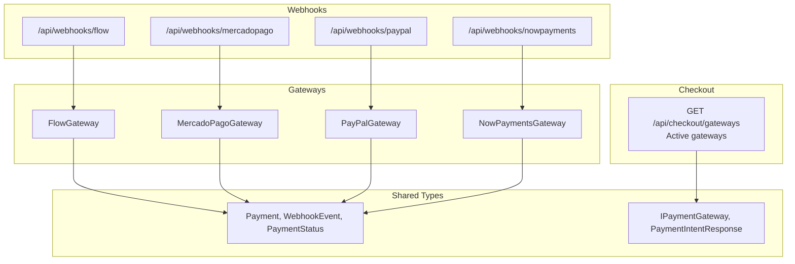
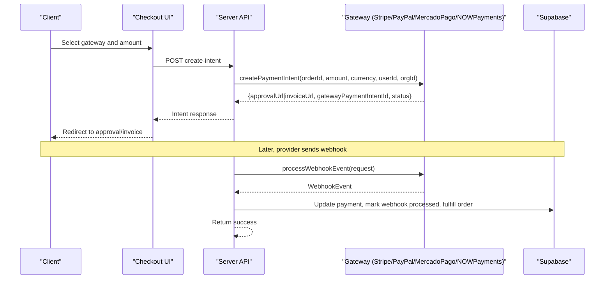
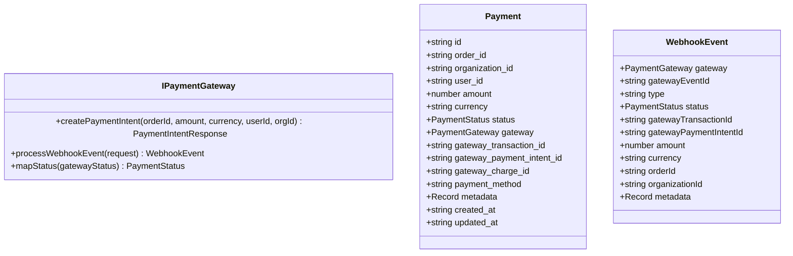
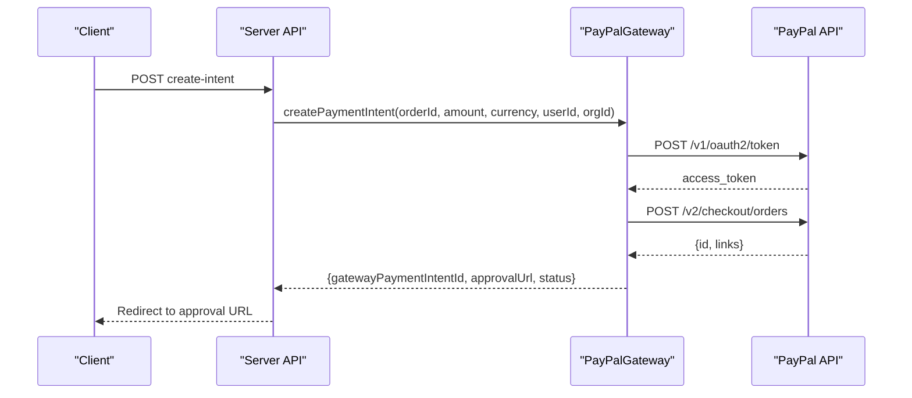
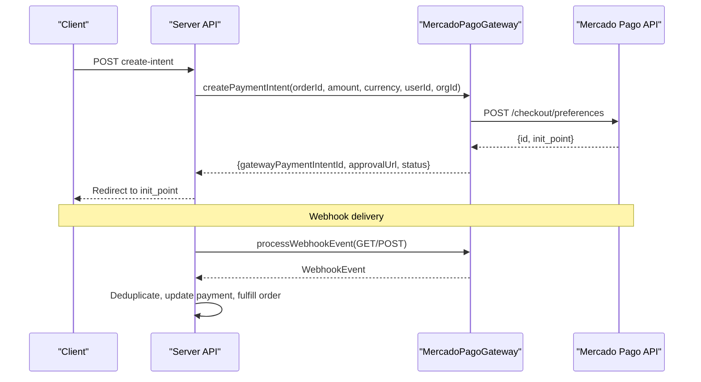
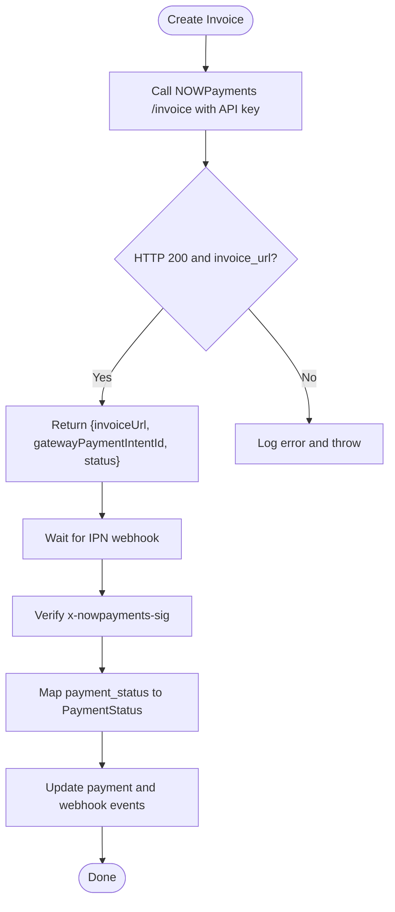
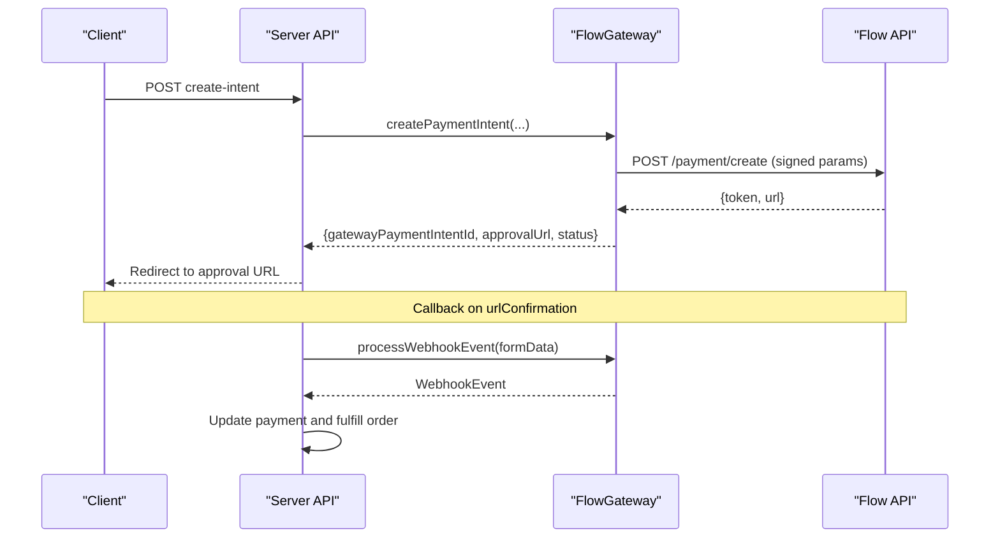
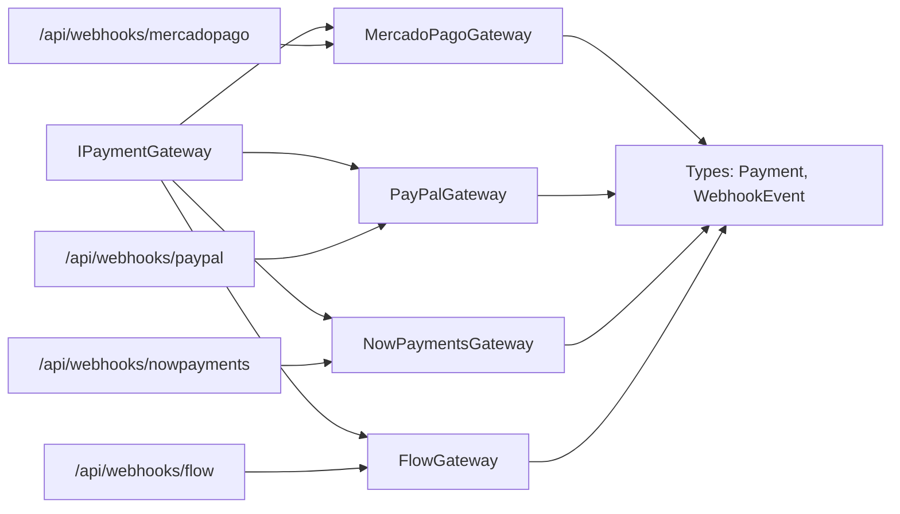

# Payment Gateways Integration

<cite>
**Referenced Files in This Document**
- [payment.ts](file://src/types/payment.ts)
- [interfaces.ts](file://src/lib/payments/interfaces.ts)
- [mercadopago/gateway.ts](file://src/lib/payments/mercadopago/gateway.ts)
- [paypal/gateway.ts](file://src/lib/payments/paypal/gateway.ts)
- [nowpayments/gateway.ts](file://src/lib/payments/nowpayments/gateway.ts)
- [flow/gateway.ts](file://src/lib/payments/flow/gateway.ts)
- [mercadopago/route.ts](file://src/app/api/webhooks/mercadopago/route.ts)
- [paypal/route.ts](file://src/app/api/webhooks/paypal/route.ts)
- [nowpayments/route.ts](file://src/app/api/webhooks/nowpayments/route.ts)
- [flow/route.ts](file://src/app/api/webhooks/flow/route.ts)
- [gateways/route.ts](file://src/app/api/checkout/gateways/route.ts)
- [mercadopago.ts](file://src/lib/mercadopago.ts)
</cite>

## Table of Contents

1. [Introduction](#introduction)
2. [Project Structure](#project-structure)
3. [Core Components](#core-components)
4. [Architecture Overview](#architecture-overview)
5. [Detailed Component Analysis](#detailed-component-analysis)
6. [Dependency Analysis](#dependency-analysis)
7. [Performance Considerations](#performance-considerations)
8. [Troubleshooting Guide](#troubleshooting-guide)
9. [Conclusion](#conclusion)
10. [Appendices](#appendices)

## Introduction

This document explains the payment gateway integration in Opttius, covering Stripe, PayPal, Mercado Pago, and NOWPayments cryptocurrency payments. It details gateway configuration, API authentication, transaction processing workflows, supported payment methods, currency handling, regional compliance, and gateway-specific features such as saved payments and recurring plans. It also provides troubleshooting guidance for common integration issues.

## Project Structure

The payment system is organized around a shared interface and per-gateway implementations, with dedicated webhook handlers and a checkout configuration endpoint.

**Diagram sources**

- [gateways/route.ts](file://src/app/api/checkout/gateways/route.ts#L1-L26)
- [interfaces.ts](file://src/lib/payments/interfaces.ts#L1-L42)
- [payment.ts](file://src/types/payment.ts#L1-L48)
- [mercadopago/gateway.ts](file://src/lib/payments/mercadopago/gateway.ts#L68-L170)
- [paypal/gateway.ts](file://src/lib/payments/paypal/gateway.ts#L59-L144)
- [nowpayments/gateway.ts](file://src/lib/payments/nowpayments/gateway.ts#L58-L138)
- [flow/gateway.ts](file://src/lib/payments/flow/gateway.ts#L47-L131)
- [mercadopago/route.ts](file://src/app/api/webhooks/mercadopago/route.ts#L1-L372)
- [paypal/route.ts](file://src/app/api/webhooks/paypal/route.ts#L1-L117)
- [nowpayments/route.ts](file://src/app/api/webhooks/nowpayments/route.ts#L1-L70)
- [flow/route.ts](file://src/app/api/webhooks/flow/route.ts#L1-L116)

**Section sources**

- [gateways/route.ts](file://src/app/api/checkout/gateways/route.ts#L1-L26)
- [interfaces.ts](file://src/lib/payments/interfaces.ts#L1-L42)
- [payment.ts](file://src/types/payment.ts#L1-L48)

## Core Components

- Shared types define Payment, WebhookEvent, and PaymentStatus, ensuring consistent handling across gateways.
- IPaymentGateway defines the contract for creating payment intents and processing webhooks.
- Gateway implementations encapsulate provider-specific logic, authentication, and status mapping.
- Webhook routes validate signatures, deduplicate events, resolve internal payments, and update order/subscription states.

Key responsibilities:

- Payment creation: Build provider-specific requests, capture approval URLs or invoice URLs, and return standardized intent responses.
- Webhook processing: Validate authenticity, normalize events, avoid duplicates, update payment records, and fulfill orders/subscriptions.

**Section sources**

- [payment.ts](file://src/types/payment.ts#L8-L47)
- [interfaces.ts](file://src/lib/payments/interfaces.ts#L10-L41)

## Architecture Overview

The system supports multiple gateways with a unified interface. Frontend triggers payment creation via checkout, receives approval/invoice URLs, and later receives asynchronous webhooks to reconcile payment status.

**Diagram sources**

- [interfaces.ts](file://src/lib/payments/interfaces.ts#L20-L41)
- [paypal/gateway.ts](file://src/lib/payments/paypal/gateway.ts#L60-L144)
- [mercadopago/gateway.ts](file://src/lib/payments/mercadopago/gateway.ts#L69-L170)
- [nowpayments/gateway.ts](file://src/lib/payments/nowpayments/gateway.ts#L62-L138)
- [flow/gateway.ts](file://src/lib/payments/flow/gateway.ts#L48-L131)
- [paypal/route.ts](file://src/app/api/webhooks/paypal/route.ts#L14-L100)
- [mercadopago/route.ts](file://src/app/api/webhooks/mercadopago/route.ts#L15-L347)
- [nowpayments/route.ts](file://src/app/api/webhooks/nowpayments/route.ts#L18-L43)
- [flow/route.ts](file://src/app/api/webhooks/flow/route.ts#L13-L99)

## Detailed Component Analysis

### Shared Types and Interfaces

- PaymentStatus: pending, succeeded, failed, refunded.
- PaymentGateway: flow, mercadopago, paypal, nowpayments.
- Payment: normalized record with gateway identifiers and metadata.
- WebhookEvent: normalized webhook payload for reconciliation.
- IPaymentGateway: createPaymentIntent, processWebhookEvent, mapStatus.

**Diagram sources**

- [interfaces.ts](file://src/lib/payments/interfaces.ts#L20-L41)
- [payment.ts](file://src/types/payment.ts#L12-L47)

**Section sources**

- [payment.ts](file://src/types/payment.ts#L8-L47)
- [interfaces.ts](file://src/lib/payments/interfaces.ts#L1-L42)

### PayPal Gateway

- Authentication: OAuth2 client credentials flow against PayPal API base URL.
- Payment creation: Uses v2/checkout/orders with CAPTURE intent; returns approval URL.
- Webhook: Accepts CHECKOUT.ORDER.COMPLETED and PAYMENT.CAPTURE.COMPLETED; maps statuses to PaymentStatus.

**Diagram sources**

- [paypal/gateway.ts](file://src/lib/payments/paypal/gateway.ts#L22-L144)
- [paypal/route.ts](file://src/app/api/webhooks/paypal/route.ts#L14-L100)

**Section sources**

- [paypal/gateway.ts](file://src/lib/payments/paypal/gateway.ts#L12-L234)
- [paypal/route.ts](file://src/app/api/webhooks/paypal/route.ts#L1-L117)

### Mercado Pago Gateway

- Authentication: Uses access token from environment; supports sandbox mode.
- Payment creation: Creates preference with back_urls and notification_url; returns preferenceId and init_point.
- Webhook: Validates signature via x-signature header; handles payment and merchant_order topics; maps statuses.
- Saved payments and subscriptions: Supports customer creation, card addition, preapproval plan and subscription creation.

**Diagram sources**

- [mercadopago/gateway.ts](file://src/lib/payments/mercadopago/gateway.ts#L68-L170)
- [mercadopago/route.ts](file://src/app/api/webhooks/mercadopago/route.ts#L15-L347)

**Section sources**

- [mercadopago/gateway.ts](file://src/lib/payments/mercadopago/gateway.ts#L35-L696)
- [mercadopago/route.ts](file://src/app/api/webhooks/mercadopago/route.ts#L1-L372)

### NOWPayments Gateway (Cryptocurrency)

- Authentication: API key per sandbox mode; IPN signature verification via HMAC-SHA512.
- Payment creation: Creates hosted invoice via /v1/invoice; returns invoice_url and invoice_id.
- Webhook: Validates x-nowpayments-sig; normalizes event and maps statuses.

**Diagram sources**

- [nowpayments/gateway.ts](file://src/lib/payments/nowpayments/gateway.ts#L58-L208)
- [nowpayments/route.ts](file://src/app/api/webhooks/nowpayments/route.ts#L18-L43)

**Section sources**

- [nowpayments/gateway.ts](file://src/lib/payments/nowpayments/gateway.ts#L13-L240)
- [nowpayments/route.ts](file://src/app/api/webhooks/nowpayments/route.ts#L1-L70)

### Flow Gateway (Chilean Payment)

- Authentication: HMAC-SHA256 signature built from sorted parameters and secret key; supports sandbox mode.
- Payment creation: Posts to /payment/create with apiKey, commerceOrder, subject, amount, email, urlConfirmation, urlReturn, and signature.
- Webhook: Reads form-encoded callback, verifies optional signature, maps status to PaymentStatus.

**Diagram sources**

- [flow/gateway.ts](file://src/lib/payments/flow/gateway.ts#L47-L131)
- [flow/route.ts](file://src/app/api/webhooks/flow/route.ts#L13-L99)

**Section sources**

- [flow/gateway.ts](file://src/lib/payments/flow/gateway.ts#L14-L227)
- [flow/route.ts](file://src/app/api/webhooks/flow/route.ts#L1-L116)

### Checkout Gateways Configuration

- GET /api/checkout/gateways returns enabled gateways from payment_gateways_config, ordered for display.

**Section sources**

- [gateways/route.ts](file://src/app/api/checkout/gateways/route.ts#L1-L26)

## Dependency Analysis

- Gateways depend on environment variables for authentication and base URLs.
- Webhook routes depend on PaymentService for idempotency, payment lookup, fulfillment, and organization updates.
- Mercado Pago webhook handler additionally validates signatures and supports subscription updates.

**Diagram sources**

- [interfaces.ts](file://src/lib/payments/interfaces.ts#L20-L41)
- [mercadopago/gateway.ts](file://src/lib/payments/mercadopago/gateway.ts#L68-L170)
- [paypal/gateway.ts](file://src/lib/payments/paypal/gateway.ts#L59-L144)
- [nowpayments/gateway.ts](file://src/lib/payments/nowpayments/gateway.ts#L58-L138)
- [flow/gateway.ts](file://src/lib/payments/flow/gateway.ts#L47-L131)
- [mercadopago/route.ts](file://src/app/api/webhooks/mercadopago/route.ts#L15-L347)
- [paypal/route.ts](file://src/app/api/webhooks/paypal/route.ts#L14-L100)
- [nowpayments/route.ts](file://src/app/api/webhooks/nowpayments/route.ts#L18-L43)
- [flow/route.ts](file://src/app/api/webhooks/flow/route.ts#L13-L99)

**Section sources**

- [interfaces.ts](file://src/lib/payments/interfaces.ts#L1-L42)
- [mercadopago/route.ts](file://src/app/api/webhooks/mercadopago/route.ts#L1-L372)

## Performance Considerations

- Prefer hosted payment pages (preferences, invoices) to reduce client-side complexity and improve conversion rates.
- Use idempotency checks to avoid duplicate processing and redundant database writes.
- Validate webhook signatures early to fail fast and reduce unnecessary downstream work.
- Cache gateway client instances per process where safe; otherwise rely on provider SDK defaults.
- Monitor gateway-specific rate limits and adjust retry/backoff strategies accordingly.

## Troubleshooting Guide

Common issues and resolutions:

- Missing environment variables
  - PayPal: Missing PAYPAL_CLIENT_ID or PAYPAL_CLIENT_SECRET; set base URL and credentials.
  - Mercado Pago: Missing access token; configure sandbox or production tokens.
  - NOWPayments: Missing API key or IPN secret; ensure correct mode.
  - Flow: Missing API key and secret key; configure sandbox or production.
- Webhook signature failures
  - PayPal: Signature verification recommended in production; ensure proper headers.
  - Mercado Pago: x-signature and x-request-id must match; validate webhook secret.
  - NOWPayments: x-nowpayments-sig must match HMAC-SHA512 of raw body with IPN secret.
- Missing gatewayPaymentIntentId
  - Occurs when webhook lacks intent reference; webhook handler marks as processed and logs.
- Duplicate events
  - Webhook routes check webhook_events table; skip if already processed.
- Currency and amount rounding
  - Some providers require integer amounts (e.g., CLP); ensure rounding before API calls.
- Sandbox vs production
  - Verify base URLs and tokens for each provider; mismatch leads to authentication errors.

**Section sources**

- [paypal/gateway.ts](file://src/lib/payments/paypal/gateway.ts#L12-L57)
- [mercadopago/gateway.ts](file://src/lib/payments/mercadopago/gateway.ts#L35-L66)
- [nowpayments/gateway.ts](file://src/lib/payments/nowpayments/gateway.ts#L16-L56)
- [flow/gateway.ts](file://src/lib/payments/flow/gateway.ts#L14-L30)
- [paypal/route.ts](file://src/app/api/webhooks/paypal/route.ts#L14-L100)
- [mercadopago/route.ts](file://src/app/api/webhooks/mercadopago/route.ts#L233-L245)
- [nowpayments/route.ts](file://src/app/api/webhooks/nowpayments/route.ts#L18-L57)
- [flow/route.ts](file://src/app/api/webhooks/flow/route.ts#L13-L99)

## Conclusion

Opttius integrates multiple payment gateways through a unified interface and robust webhook handling. The system supports major providers (PayPal, Mercado Pago, NOWPayments) and regional gateways (Flow), with consistent status mapping, idempotent processing, and extensible architecture. Proper environment configuration and signature validation are essential for secure and reliable operations.

## Appendices

### Supported Payment Methods and Regional Notes

- PayPal: Standard card payments and buyer account funding.
- Mercado Pago: Credit/debit cards, bank transfers, and local payment methods; supports subscriptions and saved cards.
- NOWPayments: Cryptocurrencies (Bitcoin, Ethereum, stablecoins, and more depending on provider availability).
- Flow: Local Chilean payment methods with HMAC-signed requests.

[No sources needed since this section provides general guidance]

### Currency Handling

- Amounts are rounded to provider minimum units (e.g., whole CLP units) before API calls.
- Currency codes are normalized uppercase before sending to gateways.

**Section sources**

- [mercadopago/gateway.ts](file://src/lib/payments/mercadopago/gateway.ts#L88-L98)
- [paypal/gateway.ts](file://src/lib/payments/paypal/gateway.ts#L84-L86)
- [nowpayments/gateway.ts](file://src/lib/payments/nowpayments/gateway.ts#L82-L86)
- [flow/gateway.ts](file://src/lib/payments/flow/gateway.ts#L74-L74)

### Gateway-Specific Features

- 3D Secure: PayPal and Mercado Pago handle 3D Secure during checkout; ensure provider configuration aligns with PCI requirements.
- Saved Payments: Mercado Pago supports customer creation and card storage; Flow does not expose saved payment APIs in current stub.
- Installment Plans: Mercado Pago supports preapproval plans and subscriptions; PayPal supports recurring billing via subscriptions.

**Section sources**

- [mercadopago.ts](file://src/lib/mercadopago.ts#L1-L21)
- [mercadopago/gateway.ts](file://src/lib/payments/mercadopago/gateway.ts#L518-L640)
- [paypal/gateway.ts](file://src/lib/payments/paypal/gateway.ts#L1-L234)
