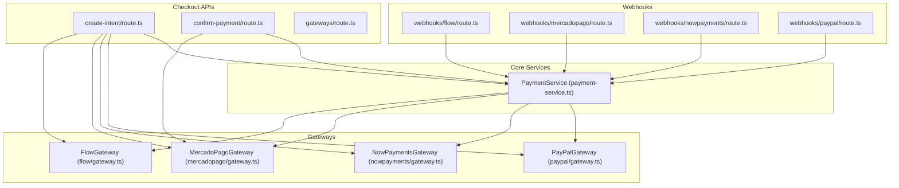
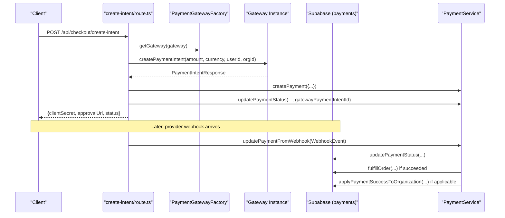
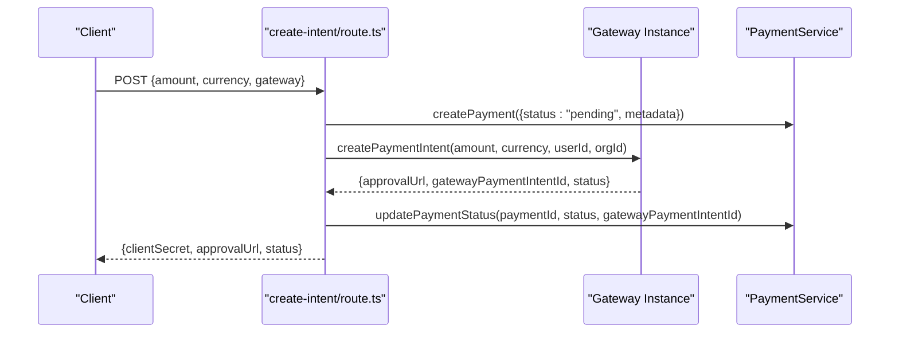
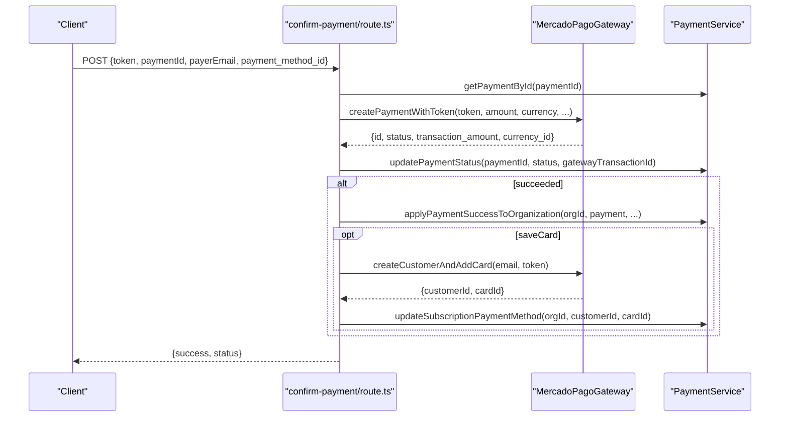
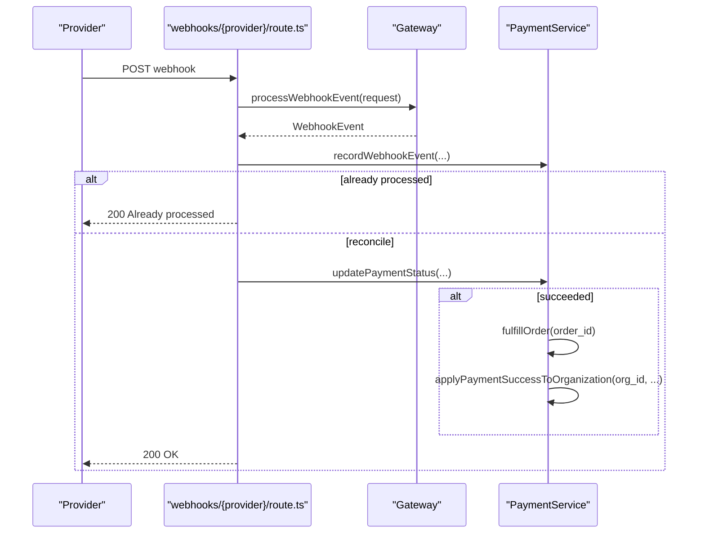
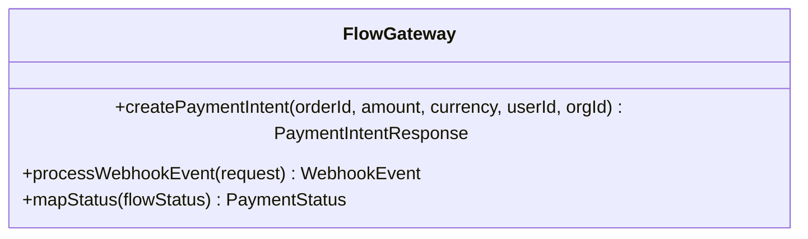
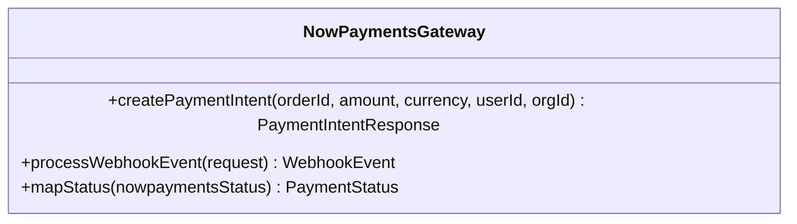
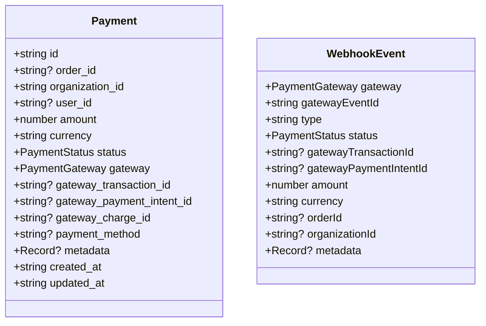
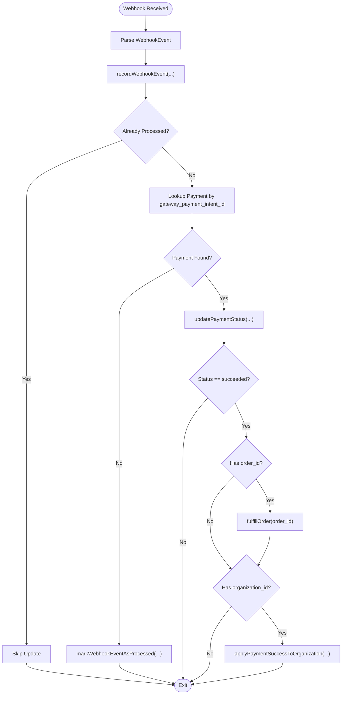
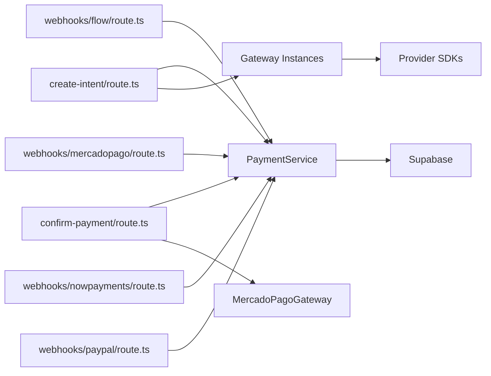

# Payment Processing System

<cite>
**Referenced Files in This Document**
- [src/app/api/checkout/create-intent/route.ts](file://src/app/api/checkout/create-intent/route.ts)
- [src/app/api/checkout/confirm-payment/route.ts](file://src/app/api/checkout/confirm-payment/route.ts)
- [src/app/api/checkout/gateways/route.ts](file://src/app/api/checkout/gateways/route.ts)
- [src/app/api/webhooks/flow/route.ts](file://src/app/api/webhooks/flow/route.ts)
- [src/app/api/webhooks/mercadopago/route.ts](file://src/app/api/webhooks/mercadopago/route.ts)
- [src/app/api/webhooks/nowpayments/route.ts](file://src/app/api/webhooks/nowpayments/route.ts)
- [src/app/api/webhooks/paypal/route.ts](file://src/app/api/webhooks/paypal/route.ts)
- [src/lib/payments/services/payment-service.ts](file://src/lib/payments/services/payment-service.ts)
- [src/lib/payments/flow/gateway.ts](file://src/lib/payments/flow/gateway.ts)
- [src/lib/payments/mercadopago/gateway.ts](file://src/lib/payments/mercadopago/gateway.ts)
- [src/lib/payments/nowpayments/gateway.ts](file://src/lib/payments/nowpayments/gateway.ts)
- [src/lib/payments/paypal/gateway.ts](file://src/lib/payments/paypal/gateway.ts)
- [src/types/payment.ts](file://src/types/payment.ts)
</cite>

## Table of Contents

1. [Introduction](#introduction)
2. [Project Structure](#project-structure)
3. [Core Components](#core-components)
4. [Architecture Overview](#architecture-overview)
5. [Detailed Component Analysis](#detailed-component-analysis)
6. [Dependency Analysis](#dependency-analysis)
7. [Performance Considerations](#performance-considerations)
8. [Troubleshooting Guide](#troubleshooting-guide)
9. [Conclusion](#conclusion)
10. [Appendices](#appendices)

## Introduction

This document explains the payment processing system in Opttius, focusing on multi-gateway integration and financial workflows. It covers the complete payment lifecycle: payment intent creation, gateway processing, webhook handling, reconciliation, and settlement. Implementation details include cryptocurrency payments via NOWPayments, traditional card payments via Mercado Pago, and alternative payment methods via Flow and PayPal. Configuration options for payment methods, currencies, tax handling, and settlement processes are documented alongside relationships with orders, customer profiles, and accounting modules. Security, PCI compliance, fraud prevention, and dispute resolution guidance is included, along with practical examples from the codebase.

## Project Structure

The payment system is organized around:

- Public checkout APIs for intent creation and confirmation
- Webhook handlers per gateway for asynchronous status updates
- A centralized payment service orchestrating database operations and business logic
- Gateway-specific implementations encapsulating provider integrations
- Shared types defining payment and webhook event structures



**Diagram sources**

- [src/app/api/checkout/create-intent/route.ts](file://src/app/api/checkout/create-intent/route.ts#L34-L259)
- [src/app/api/checkout/confirm-payment/route.ts](file://src/app/api/checkout/confirm-payment/route.ts#L32-L231)
- [src/app/api/checkout/gateways/route.ts](file://src/app/api/checkout/gateways/route.ts#L8-L25)
- [src/app/api/webhooks/flow/route.ts](file://src/app/api/webhooks/flow/route.ts#L13-L115)
- [src/app/api/webhooks/mercadopago/route.ts](file://src/app/api/webhooks/mercadopago/route.ts#L15-L371)
- [src/app/api/webhooks/nowpayments/route.ts](file://src/app/api/webhooks/nowpayments/route.ts#L18-L69)
- [src/app/api/webhooks/paypal/route.ts](file://src/app/api/webhooks/paypal/route.ts#L14-L116)
- [src/lib/payments/services/payment-service.ts](file://src/lib/payments/services/payment-service.ts#L19-L493)
- [src/lib/payments/flow/gateway.ts](file://src/lib/payments/flow/gateway.ts#L47-L226)
- [src/lib/payments/mercadopago/gateway.ts](file://src/lib/payments/mercadopago/gateway.ts#L68-L695)
- [src/lib/payments/nowpayments/gateway.ts](file://src/lib/payments/nowpayments/gateway.ts#L58-L239)
- [src/lib/payments/paypal/gateway.ts](file://src/lib/payments/paypal/gateway.ts#L59-L233)

**Section sources**

- [src/app/api/checkout/create-intent/route.ts](file://src/app/api/checkout/create-intent/route.ts#L34-L259)
- [src/app/api/checkout/confirm-payment/route.ts](file://src/app/api/checkout/confirm-payment/route.ts#L32-L231)
- [src/app/api/checkout/gateways/route.ts](file://src/app/api/checkout/gateways/route.ts#L8-L25)
- [src/app/api/webhooks/flow/route.ts](file://src/app/api/webhooks/flow/route.ts#L13-L115)
- [src/app/api/webhooks/mercadopago/route.ts](file://src/app/api/webhooks/mercadopago/route.ts#L15-L371)
- [src/app/api/webhooks/nowpayments/route.ts](file://src/app/api/webhooks/nowpayments/route.ts#L18-L69)
- [src/app/api/webhooks/paypal/route.ts](file://src/app/api/webhooks/paypal/route.ts#L14-L116)
- [src/lib/payments/services/payment-service.ts](file://src/lib/payments/services/payment-service.ts#L19-L493)
- [src/lib/payments/flow/gateway.ts](file://src/lib/payments/flow/gateway.ts#L47-L226)
- [src/lib/payments/mercadopago/gateway.ts](file://src/lib/payments/mercadopago/gateway.ts#L68-L695)
- [src/lib/payments/nowpayments/gateway.ts](file://src/lib/payments/nowpayments/gateway.ts#L58-L239)
- [src/lib/payments/paypal/gateway.ts](file://src/lib/payments/paypal/gateway.ts#L59-L233)

## Core Components

- Payment types define shared structures for payment records and webhook events.
- PaymentService centralizes database operations, idempotent webhook handling, order fulfillment, and organization subscription updates.
- Gateway implementations encapsulate provider-specific logic for intent creation, token-based payments, and webhook parsing.

Key responsibilities:

- Intent creation: create-intent API validates inputs, selects gateway, creates payment record, delegates to gateway, and returns client-secret and approval URLs.
- Confirmation: confirm-payment API handles Mercado Pago Bricks token-based payments and applies results to organization.
- Webhooks: per-gateway routes validate signatures, parse events, update payments, and trigger downstream actions.
- Settlement: PaymentService updates organization tier, creates/updates subscriptions, and sends notifications.

**Section sources**

- [src/types/payment.ts](file://src/types/payment.ts#L8-L48)
- [src/lib/payments/services/payment-service.ts](file://src/lib/payments/services/payment-service.ts#L26-L493)
- [src/lib/payments/flow/gateway.ts](file://src/lib/payments/flow/gateway.ts#L48-L131)
- [src/lib/payments/mercadopago/gateway.ts](file://src/lib/payments/mercadopago/gateway.ts#L69-L170)
- [src/lib/payments/nowpayments/gateway.ts](file://src/lib/payments/nowpayments/gateway.ts#L62-L138)
- [src/lib/payments/paypal/gateway.ts](file://src/lib/payments/paypal/gateway.ts#L60-L144)

## Architecture Overview

The system follows a gateway-agnostic design:

- Checkout APIs create payment intents via PaymentGatewayFactory and delegate to specific gateway instances.
- Gateways return standardized PaymentIntentResponse with approval URLs and gateway identifiers.
- Webhooks are routed to provider-specific handlers that convert events to unified WebhookEvent structures.
- PaymentService reconciles webhook events against stored payments, fulfills orders, and updates organization subscriptions.



**Diagram sources**

- [src/app/api/checkout/create-intent/route.ts](file://src/app/api/checkout/create-intent/route.ts#L132-L235)
- [src/lib/payments/services/payment-service.ts](file://src/lib/payments/services/payment-service.ts#L115-L185)
- [src/app/api/webhooks/mercadopago/route.ts](file://src/app/api/webhooks/mercadopago/route.ts#L316-L345)

## Detailed Component Analysis

### Payment Lifecycle: Intent Creation

- Validates amount, currency, and gateway selection.
- Normalizes currencies for specific providers (e.g., NOWPayments CLP to USD).
- Creates a payment record with metadata and pending status.
- Delegates to selected gateway to create an intent and returns approval URL and identifiers.



**Diagram sources**

- [src/app/api/checkout/create-intent/route.ts](file://src/app/api/checkout/create-intent/route.ts#L100-L235)
- [src/lib/payments/flow/gateway.ts](file://src/lib/payments/flow/gateway.ts#L48-L131)
- [src/lib/payments/mercadopago/gateway.ts](file://src/lib/payments/mercadopago/gateway.ts#L69-L170)
- [src/lib/payments/nowpayments/gateway.ts](file://src/lib/payments/nowpayments/gateway.ts#L62-L138)
- [src/lib/payments/paypal/gateway.ts](file://src/lib/payments/paypal/gateway.ts#L60-L144)

**Section sources**

- [src/app/api/checkout/create-intent/route.ts](file://src/app/api/checkout/create-intent/route.ts#L18-L235)

### Payment Confirmation (Mercado Pago Bricks)

- Validates token, paymentId, and organization context.
- Calls gateway’s token-based payment creation.
- Updates payment status and, on success, applies to organization and optionally saves card.



**Diagram sources**

- [src/app/api/checkout/confirm-payment/route.ts](file://src/app/api/checkout/confirm-payment/route.ts#L96-L216)
- [src/lib/payments/mercadopago/gateway.ts](file://src/lib/payments/mercadopago/gateway.ts#L315-L401)

**Section sources**

- [src/app/api/checkout/confirm-payment/route.ts](file://src/app/api/checkout/confirm-payment/route.ts#L17-L216)
- [src/lib/payments/mercadopago/gateway.ts](file://src/lib/payments/mercadopago/gateway.ts#L315-L401)

### Webhook Handling and Reconciliation

- Each provider exposes a dedicated webhook endpoint.
- Handlers validate signatures (where required), parse events, record idempotency, reconcile with stored payments, and trigger downstream actions.



**Diagram sources**

- [src/app/api/webhooks/flow/route.ts](file://src/app/api/webhooks/flow/route.ts#L18-L99)
- [src/app/api/webhooks/mercadopago/route.ts](file://src/app/api/webhooks/mercadopago/route.ts#L255-L347)
- [src/app/api/webhooks/nowpayments/route.ts](file://src/app/api/webhooks/nowpayments/route.ts#L23-L43)
- [src/app/api/webhooks/paypal/route.ts](file://src/app/api/webhooks/paypal/route.ts#L19-L100)
- [src/lib/payments/services/payment-service.ts](file://src/lib/payments/services/payment-service.ts#L115-L185)

**Section sources**

- [src/app/api/webhooks/flow/route.ts](file://src/app/api/webhooks/flow/route.ts#L13-L115)
- [src/app/api/webhooks/mercadopago/route.ts](file://src/app/api/webhooks/mercadopago/route.ts#L15-L371)
- [src/app/api/webhooks/nowpayments/route.ts](file://src/app/api/webhooks/nowpayments/route.ts#L18-L69)
- [src/app/api/webhooks/paypal/route.ts](file://src/app/api/webhooks/paypal/route.ts#L14-L116)

### Gateway Implementations

#### Flow (Chilean local gateway)

- Creates payment orders with HMAC signature verification.
- Processes webhook events and maps statuses to unified status model.
- Returns approval URL and gateway identifiers for client redirection.



**Diagram sources**

- [src/lib/payments/flow/gateway.ts](file://src/lib/payments/flow/gateway.ts#L47-L226)

**Section sources**

- [src/lib/payments/flow/gateway.ts](file://src/lib/payments/flow/gateway.ts#L48-L131)
- [src/lib/payments/flow/gateway.ts](file://src/lib/payments/flow/gateway.ts#L133-L198)

#### Mercado Pago (Bricks + Preferences)

- Creates preferences for hosted checkout and parses payment/webhook events.
- Supports token-based payments (Bricks), customer/card management, and recurring plans.
- Handles merchant_order topics and subscription preapproval updates.

```mermaid
classDiagram
class MercadoPagoGateway {
+createPaymentIntent(orderId, amount, currency, userId, orgId) PaymentIntentResponse
+processWebhookEvent(request) WebhookEvent
+createPaymentWithToken(token, amount, currency, ...) {id, status, ...}
+createCustomer(email) string
+findCustomerByEmail(email) string?
+addCardToCustomer(customerId, token) string
+createCustomerAndAddCard(email, token) {customerId, cardId}
+createPreApprovalPlan(reason, amount, currency, backUrl) {id, init_point?}
+createPreApproval(planId, payerEmail, cardTokenId, reason, extRef, backUrl) {id, status, init_point?}
+getPreApproval(preapprovalId) {id, status, external_reference?}
+getMerchantOrder(merchantOrderId) MerchantOrderInfo?
+mapStatus(mpStatus) PaymentStatus
}
```

**Diagram sources**

- [src/lib/payments/mercadopago/gateway.ts](file://src/lib/payments/mercadopago/gateway.ts#L68-L695)

**Section sources**

- [src/lib/payments/mercadopago/gateway.ts](file://src/lib/payments/mercadopago/gateway.ts#L69-L170)
- [src/lib/payments/mercadopago/gateway.ts](file://src/lib/payments/mercadopago/gateway.ts#L172-L256)
- [src/lib/payments/mercadopago/gateway.ts](file://src/lib/payments/mercadopago/gateway.ts#L302-L401)
- [src/lib/payments/mercadopago/gateway.ts](file://src/lib/payments/mercadopago/gateway.ts#L403-L509)
- [src/lib/payments/mercadopago/gateway.ts](file://src/lib/payments/mercadopago/gateway.ts#L511-L640)
- [src/lib/payments/mercadopago/gateway.ts](file://src/lib/payments/mercadopago/gateway.ts#L642-L674)

#### NOWPayments (Cryptocurrency)

- Creates invoices and verifies IPN signatures using IPN secret.
- Maps statuses including partial payments to pending.



**Diagram sources**

- [src/lib/payments/nowpayments/gateway.ts](file://src/lib/payments/nowpayments/gateway.ts#L58-L239)

**Section sources**

- [src/lib/payments/nowpayments/gateway.ts](file://src/lib/payments/nowpayments/gateway.ts#L62-L138)
- [src/lib/payments/nowpayments/gateway.ts](file://src/lib/payments/nowpayments/gateway.ts#L143-L208)

#### PayPal

- Creates checkout orders using OAuth credentials and parses webhook events.
- Maps PayPal statuses to unified status model.


**Diagram sources**

- [src/lib/payments/paypal/gateway.ts](file://src/lib/payments/paypal/gateway.ts#L59-L233)

**Section sources**

- [src/lib/payments/paypal/gateway.ts](file://src/lib/payments/paypal/gateway.ts#L60-L144)
- [src/lib/payments/paypal/gateway.ts](file://src/lib/payments/paypal/gateway.ts#L146-L209)

### Payment Types and Data Contracts

Shared types define payment records and webhook events, ensuring consistency across gateways.



**Diagram sources**

- [src/types/payment.ts](file://src/types/payment.ts#L12-L47)

**Section sources**

- [src/types/payment.ts](file://src/types/payment.ts#L8-L48)

### Payment Service Orchestration

- Creates payment records and updates statuses atomically.
- Records and deduplicates webhook events for idempotency.
- Fulfill orders and update organization subscription tiers upon success.
- Apply payment success to organization for SaaS billing and notifications.



**Diagram sources**

- [src/lib/payments/services/payment-service.ts](file://src/lib/payments/services/payment-service.ts#L115-L185)
- [src/lib/payments/services/payment-service.ts](file://src/lib/payments/services/payment-service.ts#L207-L247)
- [src/lib/payments/services/payment-service.ts](file://src/lib/payments/services/payment-service.ts#L272-L293)
- [src/lib/payments/services/payment-service.ts](file://src/lib/payments/services/payment-service.ts#L299-L445)

**Section sources**

- [src/lib/payments/services/payment-service.ts](file://src/lib/payments/services/payment-service.ts#L26-L185)
- [src/lib/payments/services/payment-service.ts](file://src/lib/payments/services/payment-service.ts#L206-L293)
- [src/lib/payments/services/payment-service.ts](file://src/lib/payments/services/payment-service.ts#L299-L445)

## Dependency Analysis

- Checkout routes depend on PaymentService and PaymentGatewayFactory.
- Webhook routes depend on gateway-specific implementations and PaymentService.
- PaymentService depends on Supabase client for database operations.
- Gateways depend on provider SDKs and environment variables for configuration.



**Diagram sources**

- [src/app/api/checkout/create-intent/route.ts](file://src/app/api/checkout/create-intent/route.ts#L14-L133)
- [src/app/api/checkout/confirm-payment/route.ts](file://src/app/api/checkout/confirm-payment/route.ts#L14-L119)
- [src/app/api/webhooks/flow/route.ts](file://src/app/api/webhooks/flow/route.ts#L13-L19)
- [src/app/api/webhooks/mercadopago/route.ts](file://src/app/api/webhooks/mercadopago/route.ts#L15-L18)
- [src/app/api/webhooks/nowpayments/route.ts](file://src/app/api/webhooks/nowpayments/route.ts#L18-L35)
- [src/app/api/webhooks/paypal/route.ts](file://src/app/api/webhooks/paypal/route.ts#L14-L17)
- [src/lib/payments/services/payment-service.ts](file://src/lib/payments/services/payment-service.ts#L20-L24)
- [src/lib/payments/mercadopago/gateway.ts](file://src/lib/payments/mercadopago/gateway.ts#L68-L695)

**Section sources**

- [src/app/api/checkout/create-intent/route.ts](file://src/app/api/checkout/create-intent/route.ts#L14-L133)
- [src/app/api/checkout/confirm-payment/route.ts](file://src/app/api/checkout/confirm-payment/route.ts#L14-L119)
- [src/app/api/webhooks/flow/route.ts](file://src/app/api/webhooks/flow/route.ts#L13-L19)
- [src/app/api/webhooks/mercadopago/route.ts](file://src/app/api/webhooks/mercadopago/route.ts#L15-L18)
- [src/app/api/webhooks/nowpayments/route.ts](file://src/app/api/webhooks/nowpayments/route.ts#L18-L35)
- [src/app/api/webhooks/paypal/route.ts](file://src/app/api/webhooks/paypal/route.ts#L14-L17)
- [src/lib/payments/services/payment-service.ts](file://src/lib/payments/services/payment-service.ts#L20-L24)

## Performance Considerations

- Rate limiting is applied to payment endpoints to prevent abuse.
- Webhook handlers use idempotency to avoid duplicate processing.
- Gateway calls are optimized by minimizing round-trips and caching provider configurations where feasible.
- Database operations are batched where possible (e.g., updating payment status and marking webhook processed).

[No sources needed since this section provides general guidance]

## Troubleshooting Guide

Common issues and resolutions:

- Missing organization context: ensure user belongs to an organization before creating intents.
- Gateway configuration errors: verify environment variables for each provider (API keys, secrets, base URLs).
- Signature validation failures: confirm IPN/webhook signature secrets are configured and match provider settings.
- Partial payments: NOWPayments treats partial payments as pending; reconcile manually if required.
- Idempotency: webhook events are recorded and marked processed; investigate duplicates if retries occur.

**Section sources**

- [src/app/api/checkout/create-intent/route.ts](file://src/app/api/checkout/create-intent/route.ts#L76-L96)
- [src/app/api/webhooks/nowpayments/route.ts](file://src/app/api/webhooks/nowpayments/route.ts#L44-L57)
- [src/lib/payments/nowpayments/gateway.ts](file://src/lib/payments/nowpayments/gateway.ts#L143-L159)
- [src/lib/payments/services/payment-service.ts](file://src/lib/payments/services/payment-service.ts#L207-L247)

## Conclusion

Opttius implements a robust, gateway-agnostic payment system supporting multiple providers and payment methods. The design emphasizes idempotent webhook handling, clear separation of concerns, and seamless integration with orders and organization subscriptions. By leveraging shared types, a centralized service, and provider-specific gateways, the system scales across providers while maintaining consistent behavior and strong operational observability.

[No sources needed since this section summarizes without analyzing specific files]

## Appendices

### Configuration Options

- Environment variables per gateway:
  - Flow: API keys and secret keys (sandbox or live), base URL override.
  - Mercado Pago: Access token (sandbox or live), back URLs, statement descriptor.
  - NOWPayments: API key and IPN secret, sandbox mode toggle.
  - PayPal: Base URL, client credentials, and application context URLs.
- Currency handling:
  - Intent creation normalizes currencies for specific providers (e.g., CLP to USD for NOWPayments).
- Tax and settlement:
  - Organization tier and subscription records are updated on successful payments.
  - Notifications are sent upon subscription success.

**Section sources**

- [src/lib/payments/flow/gateway.ts](file://src/lib/payments/flow/gateway.ts#L14-L30)
- [src/lib/payments/mercadopago/gateway.ts](file://src/lib/payments/mercadopago/gateway.ts#L42-L66)
- [src/lib/payments/nowpayments/gateway.ts](file://src/lib/payments/nowpayments/gateway.ts#L16-L42)
- [src/lib/payments/paypal/gateway.ts](file://src/lib/payments/paypal/gateway.ts#L12-L20)
- [src/app/api/checkout/create-intent/route.ts](file://src/app/api/checkout/create-intent/route.ts#L113-L124)

### Security and Compliance

- PCI compliance: Card data is handled by providers (Mercado Pago Bricks, PayPal) to minimize in-app PCI scope.
- Fraud prevention: Provider-native controls (e.g., Mercado Pago risk scoring) apply; implement additional checks as needed.
- Disputes: Monitor provider disputes via webhooks and maintain audit trails in webhook_events and payments.

**Section sources**

- [src/app/api/webhooks/mercadopago/route.ts](file://src/app/api/webhooks/mercadopago/route.ts#L233-L245)
- [src/lib/payments/services/payment-service.ts](file://src/lib/payments/services/payment-service.ts#L207-L247)

### International Transactions and Subscriptions

- International support: Gateways handle multiple currencies; ensure provider support and exchange considerations.
- Subscriptions: Mercado Pago supports recurring plans and preapprovals; gateway-specific flows manage plan creation and subscription updates.

**Section sources**

- [src/lib/payments/mercadopago/gateway.ts](file://src/lib/payments/mercadopago/gateway.ts#L518-L640)
