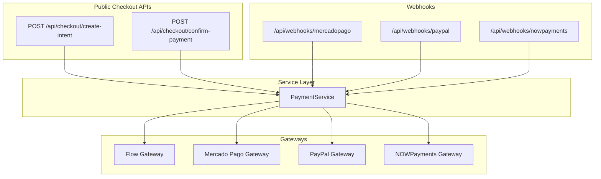
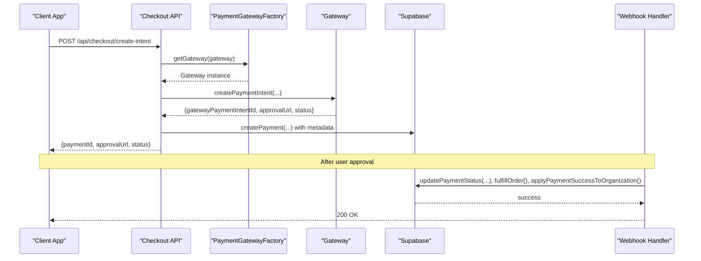
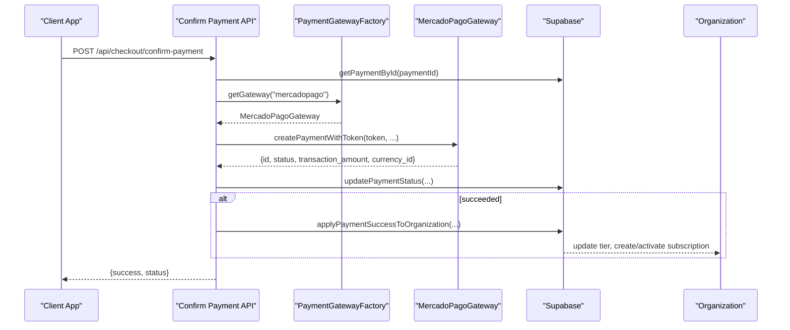
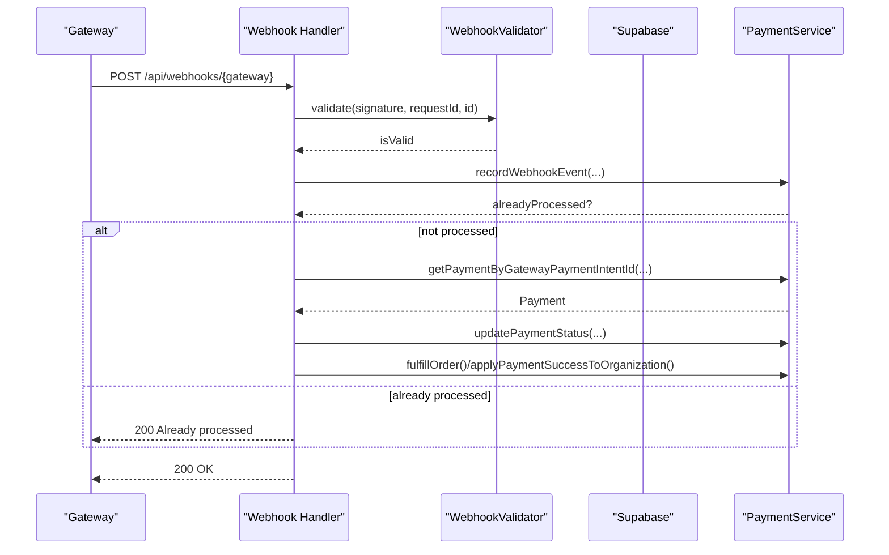
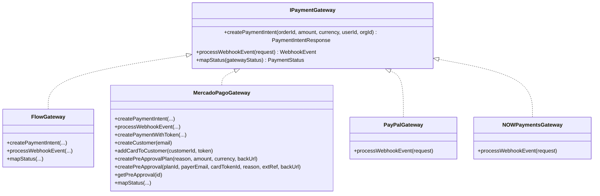
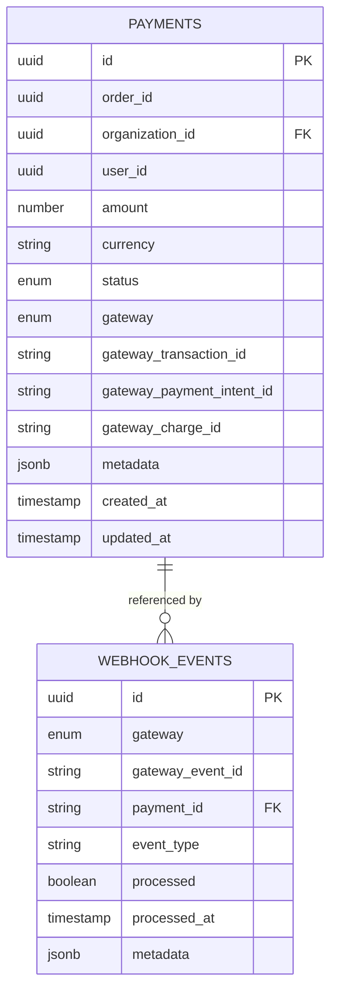
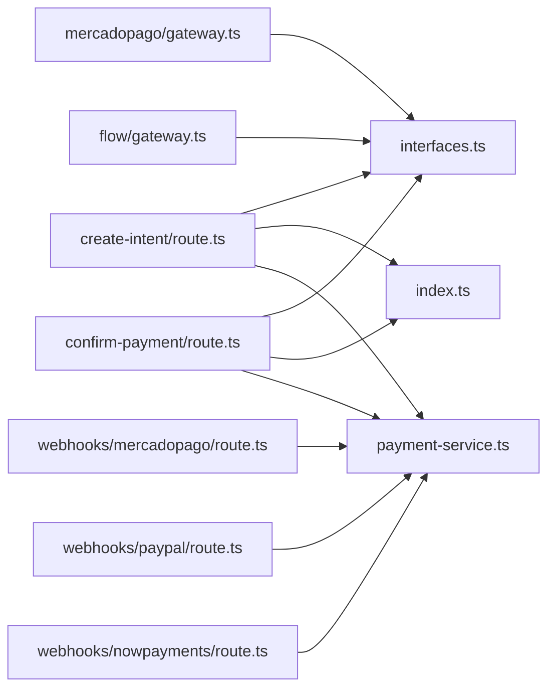

# Payment Security and Compliance

<cite>
**Referenced Files in This Document**
- [index.ts](file://src/lib/payments/index.ts)
- [interfaces.ts](file://src/lib/payments/interfaces.ts)
- [payment-service.ts](file://src/lib/payments/services/payment-service.ts)
- [mercadopago/gateway.ts](file://src/lib/payments/mercadopago/gateway.ts)
- [flow/gateway.ts](file://src/lib/payments/flow/gateway.ts)
- [create-intent/route.ts](file://src/app/api/checkout/create-intent/route.ts)
- [confirm-payment/route.ts](file://src/app/api/checkout/confirm-payment/route.ts)
- [webhooks/mercadopago/route.ts](file://src/app/api/webhooks/mercadopago/route.ts)
- [webhooks/paypal/route.ts](file://src/app/api/webhooks/paypal/route.ts)
- [webhooks/nowpayments/route.ts](file://src/app/api/webhooks/nowpayments/route.ts)
- [payment.ts](file://src/types/payment.ts)
- [mercadopago/webhook-validator.ts](file://src/lib/payments/mercadopago/webhook-validator.ts)
- [mercadopago.ts](file://src/lib/mercadopago.ts)
</cite>

## Table of Contents

1. [Introduction](#introduction)
2. [Project Structure](#project-structure)
3. [Core Components](#core-components)
4. [Architecture Overview](#architecture-overview)
5. [Detailed Component Analysis](#detailed-component-analysis)
6. [Dependency Analysis](#dependency-analysis)
7. [Performance Considerations](#performance-considerations)
8. [Security Measures and Compliance](#security-measures-and-compliance)
9. [Penetration Testing and Vulnerability Assessments](#penetration-testing-and-vulnerability-assessments)
10. [Incident Response Procedures](#incident-response-procedures)
11. [Troubleshooting Guide](#troubleshooting-guide)
12. [Conclusion](#conclusion)

## Introduction

This document provides comprehensive guidance for payment security and compliance in Opttius. It focuses on PCI DSS alignment, data encryption, secure payment tokenization, fraud detection, risk assessment, and transaction monitoring. It also documents secure payment intent creation, token handling, sensitive data protection, and compliance with GDPR, PCI, and financial industry standards. Guidance is grounded in the repository’s payment architecture and includes practical examples and diagrams derived from the codebase.

## Project Structure

Opttius implements a gateway-agnostic payment architecture with:

- A factory pattern for payment gateways (Flow, Mercado Pago, PayPal, NOWPayments)
- A unified service layer for payment lifecycle and webhook handling
- Public checkout APIs for intent creation and confirmation
- Webhook handlers per gateway with idempotency and signature validation
- Strong typing for payment and webhook events

**Diagram sources**

- [create-intent/route.ts](file://src/app/api/checkout/create-intent/route.ts#L1-L260)
- [confirm-payment/route.ts](file://src/app/api/checkout/confirm-payment/route.ts#L1-L232)
- [index.ts](file://src/lib/payments/index.ts#L1-L38)
- [payment-service.ts](file://src/lib/payments/services/payment-service.ts#L1-L494)
- [webhooks/mercadopago/route.ts](file://src/app/api/webhooks/mercadopago/route.ts#L1-L372)
- [webhooks/paypal/route.ts](file://src/app/api/webhooks/paypal/route.ts#L1-L117)
- [webhooks/nowpayments/route.ts](file://src/app/api/webhooks/nowpayments/route.ts#L1-L70)

**Section sources**

- [index.ts](file://src/lib/payments/index.ts#L1-L38)
- [interfaces.ts](file://src/lib/payments/interfaces.ts#L1-L42)
- [payment-service.ts](file://src/lib/payments/services/payment-service.ts#L1-L494)
- [create-intent/route.ts](file://src/app/api/checkout/create-intent/route.ts#L1-L260)
- [confirm-payment/route.ts](file://src/app/api/checkout/confirm-payment/route.ts#L1-L232)
- [webhooks/mercadopago/route.ts](file://src/app/api/webhooks/mercadopago/route.ts#L1-L372)
- [webhooks/paypal/route.ts](file://src/app/api/webhooks/paypal/route.ts#L1-L117)
- [webhooks/nowpayments/route.ts](file://src/app/api/webhooks/nowpayments/route.ts#L1-L70)

## Core Components

- PaymentGatewayFactory: Selects and instantiates a gateway implementation based on type.
- IPaymentGateway: Defines the contract for payment intents, webhooks, and status mapping.
- PaymentService: Encapsulates payment persistence, webhook idempotency, order fulfillment, and organization subscription updates.
- Gateway Implementations:
  - FlowGateway: HMAC signing, payment creation, webhook parsing, and status mapping.
  - MercadoPagoGateway: Preference-based checkout, token-based payments, customer/card management, preapproval plans/subscriptions, and merchant order retrieval.
  - PayPalGateway: Webhook processing and status updates.
  - NOWPaymentsGateway: Cryptocurrency payment notifications and updates.

**Section sources**

- [index.ts](file://src/lib/payments/index.ts#L1-L38)
- [interfaces.ts](file://src/lib/payments/interfaces.ts#L1-L42)
- [payment-service.ts](file://src/lib/payments/services/payment-service.ts#L1-L494)
- [flow/gateway.ts](file://src/lib/payments/flow/gateway.ts#L1-L227)
- [mercadopago/gateway.ts](file://src/lib/payments/mercadopago/gateway.ts#L1-L696)
- [webhooks/paypal/route.ts](file://src/app/api/webhooks/paypal/route.ts#L1-L117)
- [webhooks/nowpayments/route.ts](file://src/app/api/webhooks/nowpayments/route.ts#L1-L70)

## Architecture Overview

The payment flow integrates frontend checkout with backend APIs and gateway-specific integrations. Secure communication relies on HTTPS, validated webhook signatures, and idempotent event processing.

**Diagram sources**

- [create-intent/route.ts](file://src/app/api/checkout/create-intent/route.ts#L1-L260)
- [index.ts](file://src/lib/payments/index.ts#L1-L38)
- [mercadopago/gateway.ts](file://src/lib/payments/mercadopago/gateway.ts#L69-L170)
- [payment-service.ts](file://src/lib/payments/services/payment-service.ts#L26-L94)
- [webhooks/mercadopago/route.ts](file://src/app/api/webhooks/mercadopago/route.ts#L1-L372)

## Detailed Component Analysis

### Payment Intent Creation and Tokenization

Secure intent creation:

- Authentication and organization context validation
- Zod schema validation for amount, currency, gateway, and subscription metadata
- Gateway-specific intent creation returning approval URLs or client secrets
- Payment record persisted with metadata and gateway identifiers

Token-based payment confirmation (Mercado Pago):

- Validates token, paymentId, payer email, and payment_method_id
- Calls gateway.createPaymentWithToken to charge the card
- Updates payment status and applies organization subscription logic
- Optional card saving via gateway.createCustomerAndAddCard

**Diagram sources**

- [confirm-payment/route.ts](file://src/app/api/checkout/confirm-payment/route.ts#L1-L232)
- [mercadopago/gateway.ts](file://src/lib/payments/mercadopago/gateway.ts#L315-L401)
- [payment-service.ts](file://src/lib/payments/services/payment-service.ts#L299-L445)

**Section sources**

- [create-intent/route.ts](file://src/app/api/checkout/create-intent/route.ts#L1-L260)
- [confirm-payment/route.ts](file://src/app/api/checkout/confirm-payment/route.ts#L1-L232)
- [mercadopago/gateway.ts](file://src/lib/payments/mercadopago/gateway.ts#L315-L401)
- [payment-service.ts](file://src/lib/payments/services/payment-service.ts#L299-L445)

### Webhook Processing and Idempotency

Webhook handlers implement:

- Signature validation (where applicable)
- Idempotency via webhook_events table
- Lookup of payment by gatewayPaymentIntentId
- Status updates, order fulfillment, and organization subscription updates

**Diagram sources**

- [webhooks/mercadopago/route.ts](file://src/app/api/webhooks/mercadopago/route.ts#L1-L372)
- [webhooks/paypal/route.ts](file://src/app/api/webhooks/paypal/route.ts#L1-L117)
- [webhooks/nowpayments/route.ts](file://src/app/api/webhooks/nowpayments/route.ts#L1-L70)
- [mercadopago/webhook-validator.ts](file://src/lib/payments/mercadopago/webhook-validator.ts)
- [payment-service.ts](file://src/lib/payments/services/payment-service.ts#L206-L269)

**Section sources**

- [webhooks/mercadopago/route.ts](file://src/app/api/webhooks/mercadopago/route.ts#L1-L372)
- [webhooks/paypal/route.ts](file://src/app/api/webhooks/paypal/route.ts#L1-L117)
- [webhooks/nowpayments/route.ts](file://src/app/api/webhooks/nowpayments/route.ts#L1-L70)
- [mercadopago/webhook-validator.ts](file://src/lib/payments/mercadopago/webhook-validator.ts)
- [payment-service.ts](file://src/lib/payments/services/payment-service.ts#L206-L269)

### Gateway Implementations and Tokenization

- FlowGateway: Generates HMAC signature for payment creation, validates webhook signature, and maps statuses.
- MercadoPagoGateway: Supports preference-based checkout, token-based payments, customer/card management, preapproval plans/subscriptions, and merchant order retrieval.
- PayPalGateway: Processes PayPal webhook events and updates payment status.
- NOWPaymentsGateway: Handles cryptocurrency IPN callbacks and updates payment records.

**Diagram sources**

- [interfaces.ts](file://src/lib/payments/interfaces.ts#L1-L42)
- [flow/gateway.ts](file://src/lib/payments/flow/gateway.ts#L1-L227)
- [mercadopago/gateway.ts](file://src/lib/payments/mercadopago/gateway.ts#L1-L696)
- [webhooks/paypal/route.ts](file://src/app/api/webhooks/paypal/route.ts#L1-L117)
- [webhooks/nowpayments/route.ts](file://src/app/api/webhooks/nowpayments/route.ts#L1-L70)

**Section sources**

- [flow/gateway.ts](file://src/lib/payments/flow/gateway.ts#L1-L227)
- [mercadopago/gateway.ts](file://src/lib/payments/mercadopago/gateway.ts#L1-L696)
- [webhooks/paypal/route.ts](file://src/app/api/webhooks/paypal/route.ts#L1-L117)
- [webhooks/nowpayments/route.ts](file://src/app/api/webhooks/nowpayments/route.ts#L1-L70)

### Data Types and Schema Alignment

Payment and webhook event types align with the database schema for payments and webhook_events, ensuring consistent persistence and lookup.

**Diagram sources**

- [payment.ts](file://src/types/payment.ts#L12-L47)
- [payment-service.ts](file://src/lib/payments/services/payment-service.ts#L206-L269)

**Section sources**

- [payment.ts](file://src/types/payment.ts#L1-L48)
- [payment-service.ts](file://src/lib/payments/services/payment-service.ts#L206-L269)

## Dependency Analysis

- Checkout APIs depend on PaymentGatewayFactory and PaymentService
- Gateways encapsulate external SDKs and handle signature generation/validation
- Webhook handlers depend on PaymentService for idempotent updates
- Database access is centralized through Supabase client utilities

**Diagram sources**

- [create-intent/route.ts](file://src/app/api/checkout/create-intent/route.ts#L1-L260)
- [confirm-payment/route.ts](file://src/app/api/checkout/confirm-payment/route.ts#L1-L232)
- [interfaces.ts](file://src/lib/payments/interfaces.ts#L1-L42)
- [index.ts](file://src/lib/payments/index.ts#L1-L38)
- [mercadopago/gateway.ts](file://src/lib/payments/mercadopago/gateway.ts#L1-L696)
- [flow/gateway.ts](file://src/lib/payments/flow/gateway.ts#L1-L227)
- [webhooks/mercadopago/route.ts](file://src/app/api/webhooks/mercadopago/route.ts#L1-L372)
- [webhooks/paypal/route.ts](file://src/app/api/webhooks/paypal/route.ts#L1-L117)
- [webhooks/nowpayments/route.ts](file://src/app/api/webhooks/nowpayments/route.ts#L1-L70)

**Section sources**

- [create-intent/route.ts](file://src/app/api/checkout/create-intent/route.ts#L1-L260)
- [confirm-payment/route.ts](file://src/app/api/checkout/confirm-payment/route.ts#L1-L232)
- [interfaces.ts](file://src/lib/payments/interfaces.ts#L1-L42)
- [index.ts](file://src/lib/payments/index.ts#L1-L38)
- [mercadopago/gateway.ts](file://src/lib/payments/mercadopago/gateway.ts#L1-L696)
- [flow/gateway.ts](file://src/lib/payments/flow/gateway.ts#L1-L227)
- [webhooks/mercadopago/route.ts](file://src/app/api/webhooks/mercadopago/route.ts#L1-L372)
- [webhooks/paypal/route.ts](file://src/app/api/webhooks/paypal/route.ts#L1-L117)
- [webhooks/nowpayments/route.ts](file://src/app/api/webhooks/nowpayments/route.ts#L1-L70)

## Performance Considerations

- Rate limiting on payment APIs prevents abuse and ensures throughput stability.
- Idempotent webhook processing avoids redundant database writes and reduces load.
- Gateway calls are asynchronous; ensure timeouts and retries are configured appropriately in production environments.
- Prefer integer-based amounts for gateways requiring whole units to minimize conversion overhead.

[No sources needed since this section provides general guidance]

## Security Measures and Compliance

### PCI DSS Compliance

- Tokenization-first approach: Card details are handled by gateways (Mercado Pago, Flow). Opttius receives tokens or references, not primary account numbers.
- Minimal data retention: PaymentService persists only necessary identifiers and metadata; sensitive PANs are not stored.
- Environment separation: Sandbox mode toggles for gateways using separate credentials and endpoints.
- Idempotency: webhook_events table prevents duplicate processing, reducing risk of double-charging.

**Section sources**

- [mercadopago/gateway.ts](file://src/lib/payments/mercadopago/gateway.ts#L315-L401)
- [flow/gateway.ts](file://src/lib/payments/flow/gateway.ts#L48-L131)
- [payment-service.ts](file://src/lib/payments/services/payment-service.ts#L206-L269)

### Data Encryption

- Transport encryption: All endpoints operate over HTTPS; webhook URLs include HTTPS in development.
- At-rest encryption: Supabase encrypts data at rest; sensitive environment variables are scoped per gateway.
- Signature verification: Flow and Mercado Pago webhooks include signatures validated by dedicated validators.

**Section sources**

- [mercadopago/gateway.ts](file://src/lib/payments/mercadopago/gateway.ts#L77-L85)
- [flow/gateway.ts](file://src/lib/payments/flow/gateway.ts#L56-L59)
- [webhooks/mercadopago/route.ts](file://src/app/api/webhooks/mercadopago/route.ts#L233-L245)
- [mercadopago/webhook-validator.ts](file://src/lib/payments/mercadopago/webhook-validator.ts)

### Secure Payment Tokenization

- Mercado Pago Bricks tokenization: Tokens are generated client-side and sent to confirm-payment API for gateway charging.
- Saved cards: Optional customer creation and card addition via gateway APIs; sensitive data remains with gateway.

**Section sources**

- [confirm-payment/route.ts](file://src/app/api/checkout/confirm-payment/route.ts#L118-L158)
- [mercadopago/gateway.ts](file://src/lib/payments/mercadopago/gateway.ts#L499-L509)

### Fraud Detection, Risk Assessment, and Transaction Monitoring

- Idempotency and event logging: webhook_events and PaymentService logs enable monitoring and reconciliation.
- Status mapping: Gateway statuses are normalized to application statuses for consistent monitoring.
- Metadata enrichment: Payment metadata includes subscription tier and upgrade/downgrade flags for risk profiling.

**Section sources**

- [payment-service.ts](file://src/lib/payments/services/payment-service.ts#L206-L269)
- [mercadopago/gateway.ts](file://src/lib/payments/mercadopago/gateway.ts#L676-L694)
- [create-intent/route.ts](file://src/app/api/checkout/create-intent/route.ts#L136-L140)

### Regulatory Compliance

- GDPR: Minimal personal data collection; user and organization IDs are used for context. No PAN storage.
- Financial Industry Standards: Gateway APIs enforce cardholder data security; Opttius delegates tokenization and reporting to gateways.

**Section sources**

- [payment.ts](file://src/types/payment.ts#L12-L28)
- [mercadopago/gateway.ts](file://src/lib/payments/mercadopago/gateway.ts#L356-L365)

### Security Best Practices for Payment APIs

- Input validation: Zod schemas validate all request bodies.
- Authentication: APIs require authenticated sessions and organization context.
- HTTPS enforcement: Webhook URLs and base URLs are constructed with HTTPS where applicable.
- Logging: Structured logs capture errors and warnings without exposing sensitive data.

**Section sources**

- [create-intent/route.ts](file://src/app/api/checkout/create-intent/route.ts#L18-L27)
- [confirm-payment/route.ts](file://src/app/api/checkout/confirm-payment/route.ts#L17-L25)
- [create-intent/route.ts](file://src/app/api/checkout/create-intent/route.ts#L79-L96)
- [confirm-payment/route.ts](file://src/app/api/checkout/confirm-payment/route.ts#L42-L71)

## Penetration Testing and Vulnerability Assessments

- Endpoint coverage: Test all public checkout endpoints and webhook handlers for injection, CSRF, and unauthorized access.
- Signature validation: Verify webhook signature checks for Mercado Pago and Flow.
- Idempotency: Validate webhook_events table behavior under duplicate deliveries.
- Rate limiting: Confirm limits are enforced and bypass attempts are blocked.
- Sensitive data: Ensure no PANs or CVV are logged or persisted.

[No sources needed since this section provides general guidance]

## Incident Response Procedures

- Immediate actions:
  - Isolate affected webhook endpoints and disable retries temporarily if needed.
  - Review PaymentService logs and webhook_events entries for anomalies.
  - Validate gateway signatures and reprocess events if necessary.
- Post-incident:
  - Audit payment records for duplicates or incorrect statuses.
  - Update security controls (signatures, rate limits, environment variables).
  - Communicate with stakeholders and document lessons learned.

**Section sources**

- [payment-service.ts](file://src/lib/payments/services/payment-service.ts#L206-L269)
- [webhooks/mercadopago/route.ts](file://src/app/api/webhooks/mercadopago/route.ts#L233-L245)

## Troubleshooting Guide

Common issues and resolutions:

- Missing organization context: Ensure user belongs to an organization before creating payment intents.
- Invalid webhook signature: Verify MERCADOPAGO_WEBHOOK_SECRET and signature headers.
- Duplicate webhook events: Check webhook_events table; idempotency prevents duplicate processing.
- Gateway configuration errors: Confirm API keys and sandbox mode environment variables.

**Section sources**

- [create-intent/route.ts](file://src/app/api/checkout/create-intent/route.ts#L76-L96)
- [webhooks/mercadopago/route.ts](file://src/app/api/webhooks/mercadopago/route.ts#L233-L245)
- [payment-service.ts](file://src/lib/payments/services/payment-service.ts#L206-L269)

## Conclusion

Opttius implements a secure, gateway-agnostic payment system with strong emphasis on tokenization, idempotent webhook processing, and minimal sensitive data retention. By leveraging gateway-native security controls and robust logging, the system aligns with PCI DSS and supports GDPR and financial industry compliance. Adhering to the documented best practices and procedures ensures resilient and secure payment operations.
