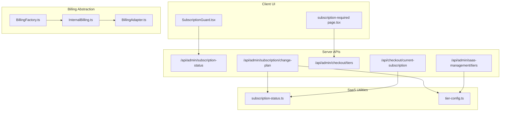
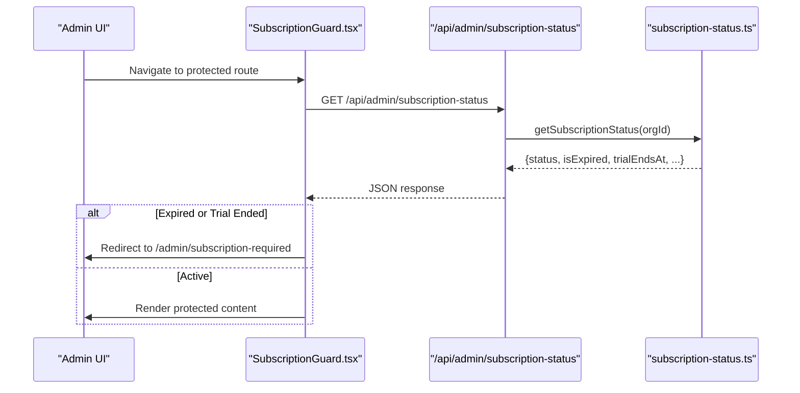
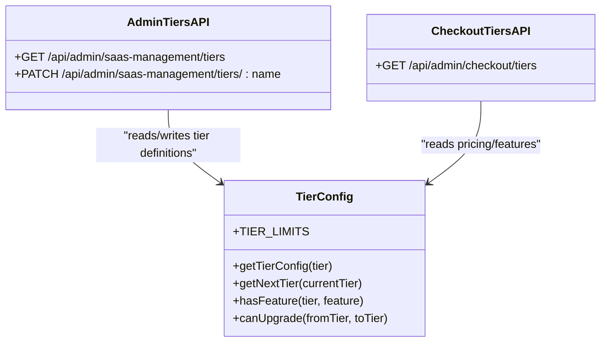
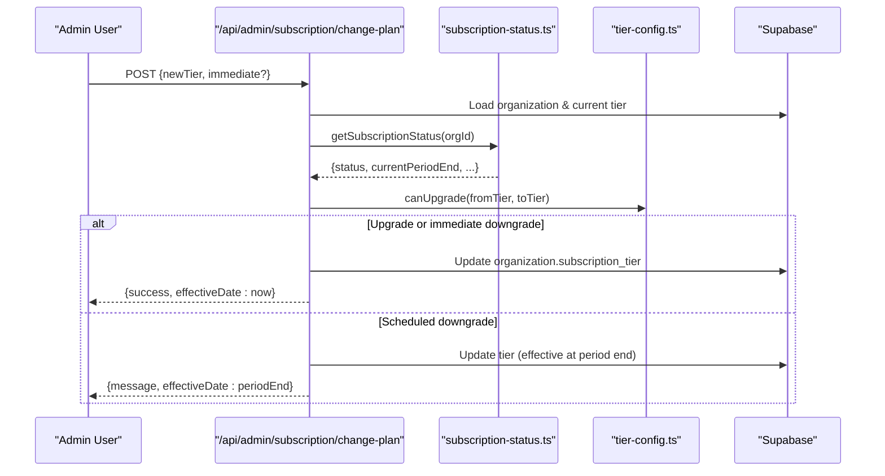
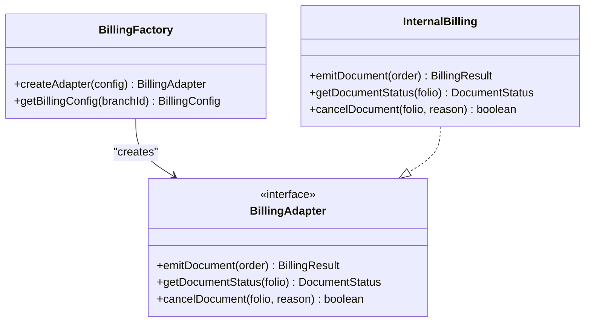
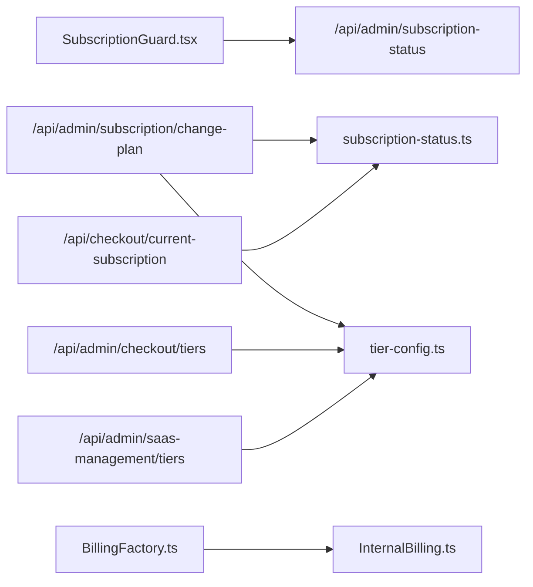

# Subscription and Recurring Billing

<cite>
**Referenced Files in This Document**
- [BillingFactory.ts](file://src/lib/billing/BillingFactory.ts)
- [BillingAdapter.ts](file://src/lib/billing/adapters/BillingAdapter.ts)
- [InternalBilling.ts](file://src/lib/billing/adapters/InternalBilling.ts)
- [subscription-status.ts](file://src/lib/saas/subscription-status.ts)
- [subscription-status route.ts](file://src/app/api/admin/subscription-status/route.ts)
- [change-plan route.ts](file://src/app/api/admin/subscription/change-plan/route.ts)
- [tier-config.ts](file://src/lib/saas/tier-config.ts)
- [checkout tiers route.ts](file://src/app/api/admin/checkout/tiers/route.ts)
- [saas-management tiers route.ts](file://src/app/api/admin/saas-management/tiers/route.ts)
- [current-subscription route.ts](file://src/app/api/checkout/current-subscription/route.ts)
- [subscription-required page.tsx](file://src/app/admin/subscription-required/page.tsx)
- [SubscriptionGuard.tsx](file://src/components/admin/SubscriptionGuard.tsx)
</cite>

## Table of Contents

1. [Introduction](#introduction)
2. [Project Structure](#project-structure)
3. [Core Components](#core-components)
4. [Architecture Overview](#architecture-overview)
5. [Detailed Component Analysis](#detailed-component-analysis)
6. [Dependency Analysis](#dependency-analysis)
7. [Performance Considerations](#performance-considerations)
8. [Troubleshooting Guide](#troubleshooting-guide)
9. [Conclusion](#conclusion)
10. [Appendices](#appendices)

## Introduction

This document describes the subscription and recurring billing system in Opttius. It focuses on tier-based pricing, subscription lifecycle management (plan upgrades, downgrades, cancellations), automated billing cycles, payment processing, and integration points with payment gateways. It also covers subscription analytics, revenue tracking, and customer communication workflows, and provides guidance for implementing promotional pricing, trial periods, and subscription-based features.

## Project Structure

The subscription system spans several layers:

- SaaS tier configuration and guard logic
- Subscription status utilities and API endpoints
- Tier administration APIs for listing and updating tiers
- Checkout integration endpoints for retrieving tiers and current subscription state
- Billing adapter abstraction for invoice emission (internal billing)

**Diagram sources**

- [SubscriptionGuard.tsx](file://src/components/admin/SubscriptionGuard.tsx#L1-L77)
- [subscription-required page.tsx](file://src/app/admin/subscription-required/page.tsx#L1-L98)
- [subscription-status route.ts](file://src/app/api/admin/subscription-status/route.ts#L1-L45)
- [change-plan route.ts](file://src/app/api/admin/subscription/change-plan/route.ts#L1-L159)
- [checkout tiers route.ts](file://src/app/api/admin/checkout/tiers/route.ts#L1-L33)
- [current-subscription route.ts](file://src/app/api/checkout/current-subscription/route.ts#L1-L56)
- [saas-management tiers route.ts](file://src/app/api/admin/saas-management/tiers/route.ts#L1-L172)
- [subscription-status.ts](file://src/lib/saas/subscription-status.ts#L1-L142)
- [tier-config.ts](file://src/lib/saas/tier-config.ts#L1-L139)
- [BillingFactory.ts](file://src/lib/billing/BillingFactory.ts#L1-L50)
- [BillingAdapter.ts](file://src/lib/billing/adapters/BillingAdapter.ts#L1-L78)
- [InternalBilling.ts](file://src/lib/billing/adapters/InternalBilling.ts#L1-L269)

**Section sources**

- [subscription-status.ts](file://src/lib/saas/subscription-status.ts#L1-L142)
- [subscription-status route.ts](file://src/app/api/admin/subscription-status/route.ts#L1-L45)
- [change-plan route.ts](file://src/app/api/admin/subscription/change-plan/route.ts#L1-L159)
- [tier-config.ts](file://src/lib/saas/tier-config.ts#L1-L139)
- [checkout tiers route.ts](file://src/app/api/admin/checkout/tiers/route.ts#L1-L33)
- [current-subscription route.ts](file://src/app/api/checkout/current-subscription/route.ts#L1-L56)
- [saas-management tiers route.ts](file://src/app/api/admin/saas-management/tiers/route.ts#L1-L172)
- [subscription-required page.tsx](file://src/app/admin/subscription-required/page.tsx#L1-L98)
- [SubscriptionGuard.tsx](file://src/components/admin/SubscriptionGuard.tsx#L1-L77)
- [BillingFactory.ts](file://src/lib/billing/BillingFactory.ts#L1-L50)
- [BillingAdapter.ts](file://src/lib/billing/adapters/BillingAdapter.ts#L1-L78)
- [InternalBilling.ts](file://src/lib/billing/adapters/InternalBilling.ts#L1-L269)

## Core Components

- Tier configuration defines pricing and feature sets per plan and validates upgrade eligibility.
- Subscription status utilities compute effective status, trial expiration, and grace windows.
- Admin APIs manage tier listings and updates, and expose tier prices for checkout.
- Client-side guards and pages enforce subscription checks and guide users to renew or contact support.
- Billing adapter abstraction supports internal billing (shadow billing) and can be extended for external gateways.

Key implementation references:

- Tier configuration and upgrade logic: [tier-config.ts](file://src/lib/saas/tier-config.ts#L1-L139)
- Subscription status computation: [subscription-status.ts](file://src/lib/saas/subscription-status.ts#L1-L142)
- Change plan API (upgrade/downgrade handling): [change-plan route.ts](file://src/app/api/admin/subscription/change-plan/route.ts#L1-L159)
- Tier listing for checkout: [checkout tiers route.ts](file://src/app/api/admin/checkout/tiers/route.ts#L1-L33)
- Current subscription state for checkout: [current-subscription route.ts](file://src/app/api/checkout/current-subscription/route.ts#L1-L56)
- Subscription guard and required page: [SubscriptionGuard.tsx](file://src/components/admin/SubscriptionGuard.tsx#L1-L77), [subscription-required page.tsx](file://src/app/admin/subscription-required/page.tsx#L1-L98)
- Billing adapter abstraction and internal billing: [BillingFactory.ts](file://src/lib/billing/BillingFactory.ts#L1-L50), [BillingAdapter.ts](file://src/lib/billing/adapters/BillingAdapter.ts#L1-L78), [InternalBilling.ts](file://src/lib/billing/adapters/InternalBilling.ts#L1-L269)

**Section sources**

- [tier-config.ts](file://src/lib/saas/tier-config.ts#L1-L139)
- [subscription-status.ts](file://src/lib/saas/subscription-status.ts#L1-L142)
- [change-plan route.ts](file://src/app/api/admin/subscription/change-plan/route.ts#L1-L159)
- [checkout tiers route.ts](file://src/app/api/admin/checkout/tiers/route.ts#L1-L33)
- [current-subscription route.ts](file://src/app/api/checkout/current-subscription/route.ts#L1-L56)
- [SubscriptionGuard.tsx](file://src/components/admin/SubscriptionGuard.tsx#L1-L77)
- [subscription-required page.tsx](file://src/app/admin/subscription-required/page.tsx#L1-L98)
- [BillingFactory.ts](file://src/lib/billing/BillingFactory.ts#L1-L50)
- [BillingAdapter.ts](file://src/lib/billing/adapters/BillingAdapter.ts#L1-L78)
- [InternalBilling.ts](file://src/lib/billing/adapters/InternalBilling.ts#L1-L269)

## Architecture Overview

The subscription system integrates client-side guards, server-side status computation, tier configuration, and administrative controls. Payment gateway integration is designed to be gateway-agnostic via adapters and is configured centrally.

**Diagram sources**

- [SubscriptionGuard.tsx](file://src/components/admin/SubscriptionGuard.tsx#L1-L77)
- [subscription-status route.ts](file://src/app/api/admin/subscription-status/route.ts#L1-L45)
- [subscription-status.ts](file://src/lib/saas/subscription-status.ts#L1-L142)

## Detailed Component Analysis

### Tier-Based Pricing and Configuration

- Defines three tiers (basic, pro, premium) with explicit pricing and feature flags.
- Provides helper functions to compare tiers, compute next tier, and check feature availability.
- Administrators can list and update tiers via dedicated APIs.

Implementation highlights:

- Tier limits and features: [tier-config.ts](file://src/lib/saas/tier-config.ts#L35-L90)
- Upgrade eligibility: [tier-config.ts](file://src/lib/saas/tier-config.ts#L132-L139)
- Listing tiers for checkout: [checkout tiers route.ts](file://src/app/api/admin/checkout/tiers/route.ts#L1-L33)
- Admin management of tiers: [saas-management tiers route.ts](file://src/app/api/admin/saas-management/tiers/route.ts#L1-L172)

**Diagram sources**

- [tier-config.ts](file://src/lib/saas/tier-config.ts#L1-L139)
- [saas-management tiers route.ts](file://src/app/api/admin/saas-management/tiers/route.ts#L1-L172)
- [checkout tiers route.ts](file://src/app/api/admin/checkout/tiers/route.ts#L1-L33)

**Section sources**

- [tier-config.ts](file://src/lib/saas/tier-config.ts#L1-L139)
- [saas-management tiers route.ts](file://src/app/api/admin/saas-management/tiers/route.ts#L1-L172)
- [checkout tiers route.ts](file://src/app/api/admin/checkout/tiers/route.ts#L1-L33)

### Subscription Lifecycle Management

- Computes subscription status, trial expiration, and grace windows.
- Supports plan upgrades/downgrades with immediate or scheduled changes.
- Exposes endpoints to check current subscription and to change plans.

Key flows:

- Status computation: [subscription-status.ts](file://src/lib/saas/subscription-status.ts#L33-L133)
- Status endpoint: [subscription-status route.ts](file://src/app/api/admin/subscription-status/route.ts#L1-L45)
- Change plan endpoint: [change-plan route.ts](file://src/app/api/admin/subscription/change-plan/route.ts#L1-L159)
- Current subscription endpoint: [current-subscription route.ts](file://src/app/api/checkout/current-subscription/route.ts#L1-L56)

**Diagram sources**

- [change-plan route.ts](file://src/app/api/admin/subscription/change-plan/route.ts#L1-L159)
- [subscription-status.ts](file://src/lib/saas/subscription-status.ts#L1-L142)
- [tier-config.ts](file://src/lib/saas/tier-config.ts#L132-L139)

**Section sources**

- [subscription-status.ts](file://src/lib/saas/subscription-status.ts#L1-L142)
- [subscription-status route.ts](file://src/app/api/admin/subscription-status/route.ts#L1-L45)
- [change-plan route.ts](file://src/app/api/admin/subscription/change-plan/route.ts#L1-L159)
- [current-subscription route.ts](file://src/app/api/checkout/current-subscription/route.ts#L1-L56)

### Automated Billing Cycles and Payment Gateways

- Payment gateway integration is designed to be gateway-agnostic via adapters.
- The billing factory selects the appropriate adapter based on configuration.
- Internal billing adapter emits internal documents and can be extended to integrate with external gateways.

References:

- Billing factory: [BillingFactory.ts](file://src/lib/billing/BillingFactory.ts#L21-L36)
- Billing adapter interface: [BillingAdapter.ts](file://src/lib/billing/adapters/BillingAdapter.ts#L9-L31)
- Internal billing adapter: [InternalBilling.ts](file://src/lib/billing/adapters/InternalBilling.ts#L21-L139)

**Diagram sources**

- [BillingFactory.ts](file://src/lib/billing/BillingFactory.ts#L21-L36)
- [BillingAdapter.ts](file://src/lib/billing/adapters/BillingAdapter.ts#L9-L31)
- [InternalBilling.ts](file://src/lib/billing/adapters/InternalBilling.ts#L21-L139)

**Section sources**

- [BillingFactory.ts](file://src/lib/billing/BillingFactory.ts#L1-L50)
- [BillingAdapter.ts](file://src/lib/billing/adapters/BillingAdapter.ts#L1-L78)
- [InternalBilling.ts](file://src/lib/billing/adapters/InternalBilling.ts#L1-L269)

### Subscription Analytics and Revenue Tracking

- Admin tier listing API computes counts and estimated monthly revenue per tier.
- This enables revenue tracking and analytics dashboards.

Reference:

- Tier analytics endpoint: [saas-management tiers route.ts](file://src/app/api/admin/saas-management/tiers/route.ts#L30-L61)

**Section sources**

- [saas-management tiers route.ts](file://src/app/api/admin/saas-management/tiers/route.ts#L1-L172)

### Customer Communication Workflows

- Subscription guard redirects expired users to a dedicated page guiding them to subscribe or contact support.
- The page displays contextual messaging depending on whether the trial or subscription expired.

References:

- Guard logic: [SubscriptionGuard.tsx](file://src/components/admin/SubscriptionGuard.tsx#L1-L77)
- Required subscription page: [subscription-required page.tsx](file://src/app/admin/subscription-required/page.tsx#L1-L98)

**Section sources**

- [SubscriptionGuard.tsx](file://src/components/admin/SubscriptionGuard.tsx#L1-L77)
- [subscription-required page.tsx](file://src/app/admin/subscription-required/page.tsx#L1-L98)

### Proration Calculations

- The change-plan endpoint does not implement proration in the current codebase.
- Upgrades may take effect immediately; downgrades are scheduled at the end of the current billing period.
- To implement proration, extend the change-plan logic to calculate pro-rated adjustments and adjust billing accordingly.

Reference:

- Plan change logic: [change-plan route.ts](file://src/app/api/admin/subscription/change-plan/route.ts#L78-L150)

**Section sources**

- [change-plan route.ts](file://src/app/api/admin/subscription/change-plan/route.ts#L1-L159)

### Promotional Pricing and Trial Periods

- Tier configuration includes pricing per month; promotional pricing can be modeled by adjusting tier prices or adding temporary discounts.
- Trial logic is handled in subscription status utilities; demo/root organizations are exempt from expiration.

References:

- Tier pricing: [tier-config.ts](file://src/lib/saas/tier-config.ts#L35-L90)
- Trial handling: [subscription-status.ts](file://src/lib/saas/subscription-status.ts#L38-L74)

**Section sources**

- [tier-config.ts](file://src/lib/saas/tier-config.ts#L1-L139)
- [subscription-status.ts](file://src/lib/saas/subscription-status.ts#L1-L142)

## Dependency Analysis

The system exhibits clear separation of concerns:

- UI guards depend on subscription status endpoints.
- Administrative tier management depends on tier configuration.
- Payment gateway integration is abstracted via adapters.

**Diagram sources**

- [SubscriptionGuard.tsx](file://src/components/admin/SubscriptionGuard.tsx#L1-L77)
- [subscription-status route.ts](file://src/app/api/admin/subscription-status/route.ts#L1-L45)
- [change-plan route.ts](file://src/app/api/admin/subscription/change-plan/route.ts#L1-L159)
- [checkout tiers route.ts](file://src/app/api/admin/checkout/tiers/route.ts#L1-L33)
- [current-subscription route.ts](file://src/app/api/checkout/current-subscription/route.ts#L1-L56)
- [saas-management tiers route.ts](file://src/app/api/admin/saas-management/tiers/route.ts#L1-L172)
- [subscription-status.ts](file://src/lib/saas/subscription-status.ts#L1-L142)
- [tier-config.ts](file://src/lib/saas/tier-config.ts#L1-L139)
- [BillingFactory.ts](file://src/lib/billing/BillingFactory.ts#L1-L50)
- [InternalBilling.ts](file://src/lib/billing/adapters/InternalBilling.ts#L1-L269)

**Section sources**

- [SubscriptionGuard.tsx](file://src/components/admin/SubscriptionGuard.tsx#L1-L77)
- [subscription-status route.ts](file://src/app/api/admin/subscription-status/route.ts#L1-L45)
- [change-plan route.ts](file://src/app/api/admin/subscription/change-plan/route.ts#L1-L159)
- [checkout tiers route.ts](file://src/app/api/admin/checkout/tiers/route.ts#L1-L33)
- [current-subscription route.ts](file://src/app/api/checkout/current-subscription/route.ts#L1-L56)
- [saas-management tiers route.ts](file://src/app/api/admin/saas-management/tiers/route.ts#L1-L172)
- [subscription-status.ts](file://src/lib/saas/subscription-status.ts#L1-L142)
- [tier-config.ts](file://src/lib/saas/tier-config.ts#L1-L139)
- [BillingFactory.ts](file://src/lib/billing/BillingFactory.ts#L1-L50)
- [InternalBilling.ts](file://src/lib/billing/adapters/InternalBilling.ts#L1-L269)

## Performance Considerations

- Subscription status queries are lightweight and cached implicitly by the client; avoid redundant polling.
- Tier listing and analytics endpoints should leverage database indexing on tier and organization status fields.
- Billing adapter operations should minimize database round-trips by batching inserts and using server-side functions where possible.

## Troubleshooting Guide

Common issues and resolutions:

- Unauthorized access to subscription endpoints: ensure the user is authenticated and associated with an organization.
  - Reference: [subscription-status route.ts](file://src/app/api/admin/subscription-status/route.ts#L14-L32)
- Organization not assigned: the system returns a safe default when no organization is found.
  - Reference: [subscription-status route.ts](file://src/app/api/admin/subscription-status/route.ts#L24-L32)
- Trial or subscription expired: redirect to the subscription-required page for renewal or support.
  - References: [SubscriptionGuard.tsx](file://src/components/admin/SubscriptionGuard.tsx#L42-L46), [subscription-required page.tsx](file://src/app/admin/subscription-required/page.tsx#L32-L37)
- Plan change errors: verify tier validity and upgrade eligibility.
  - Reference: [change-plan route.ts](file://src/app/api/admin/subscription/change-plan/route.ts#L44-L73)

**Section sources**

- [subscription-status route.ts](file://src/app/api/admin/subscription-status/route.ts#L1-L45)
- [SubscriptionGuard.tsx](file://src/components/admin/SubscriptionGuard.tsx#L1-L77)
- [subscription-required page.tsx](file://src/app/admin/subscription-required/page.tsx#L1-L98)
- [change-plan route.ts](file://src/app/api/admin/subscription/change-plan/route.ts#L1-L159)

## Conclusion

Opttius implements a gateway-agnostic subscription model with tier-based pricing, robust status computation, and administrative controls. While proration and external payment gateway integration are not present in the current codebase, the architecture supports extension to handle recurring billing, failed payment retries, and promotional pricing. The provided APIs and utilities offer a solid foundation for building a production-ready subscription system.

## Appendices

- Example references for implementation paths:
  - Plan upgrade/downgrade scheduling: [change-plan route.ts](file://src/app/api/admin/subscription/change-plan/route.ts#L78-L150)
  - Tier listing for checkout: [checkout tiers route.ts](file://src/app/api/admin/checkout/tiers/route.ts#L1-L33)
  - Current subscription state: [current-subscription route.ts](file://src/app/api/checkout/current-subscription/route.ts#L1-L56)
  - Subscription status computation: [subscription-status.ts](file://src/lib/saas/subscription-status.ts#L33-L133)
  - Billing adapter abstraction: [BillingAdapter.ts](file://src/lib/billing/adapters/BillingAdapter.ts#L9-L31), [InternalBilling.ts](file://src/lib/billing/adapters/InternalBilling.ts#L21-L139)
