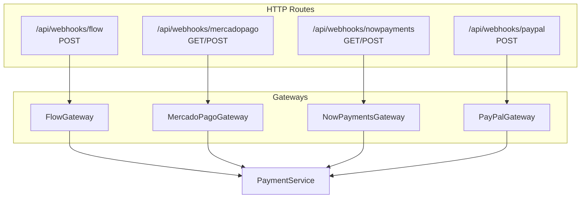
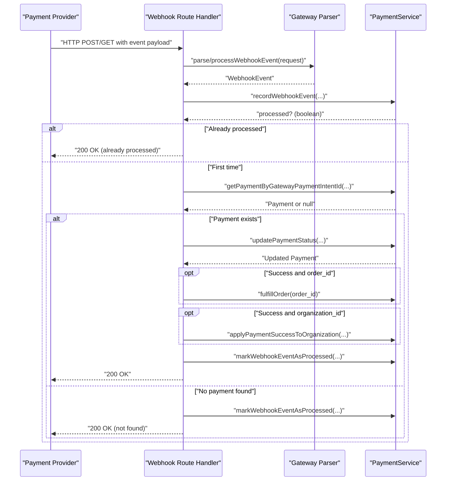
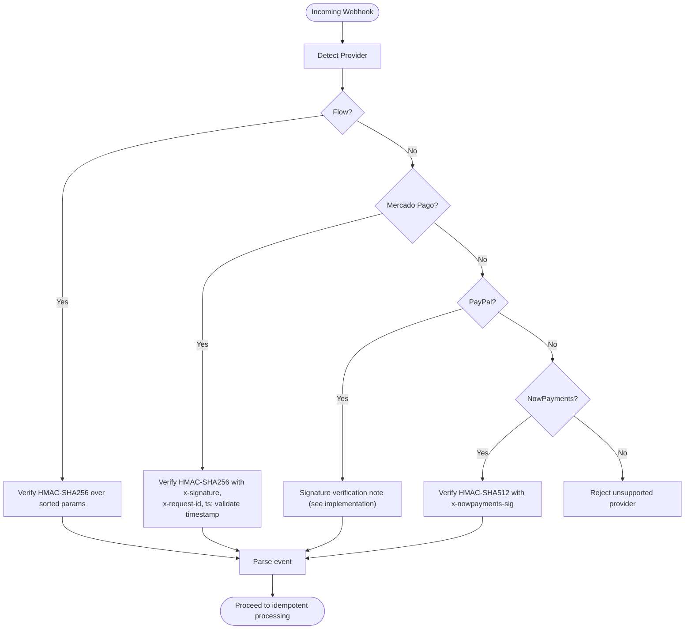
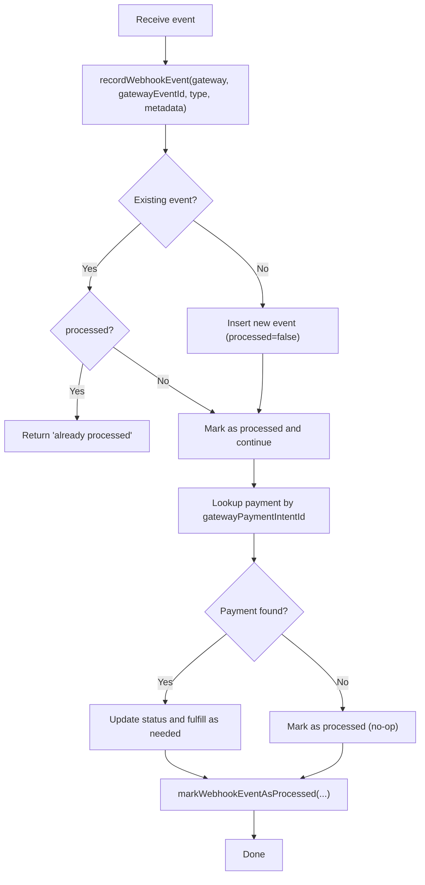
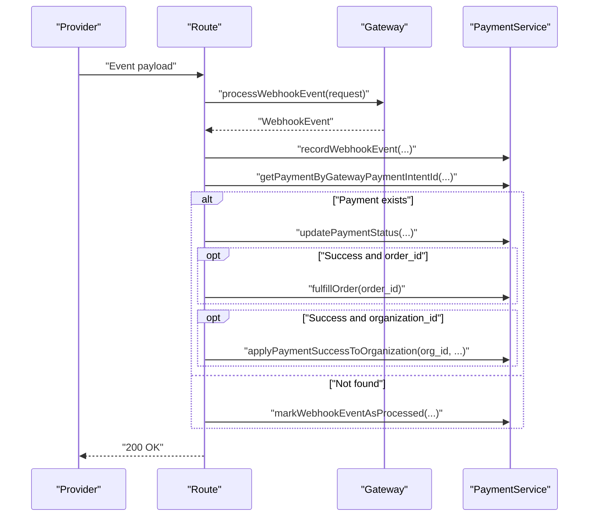
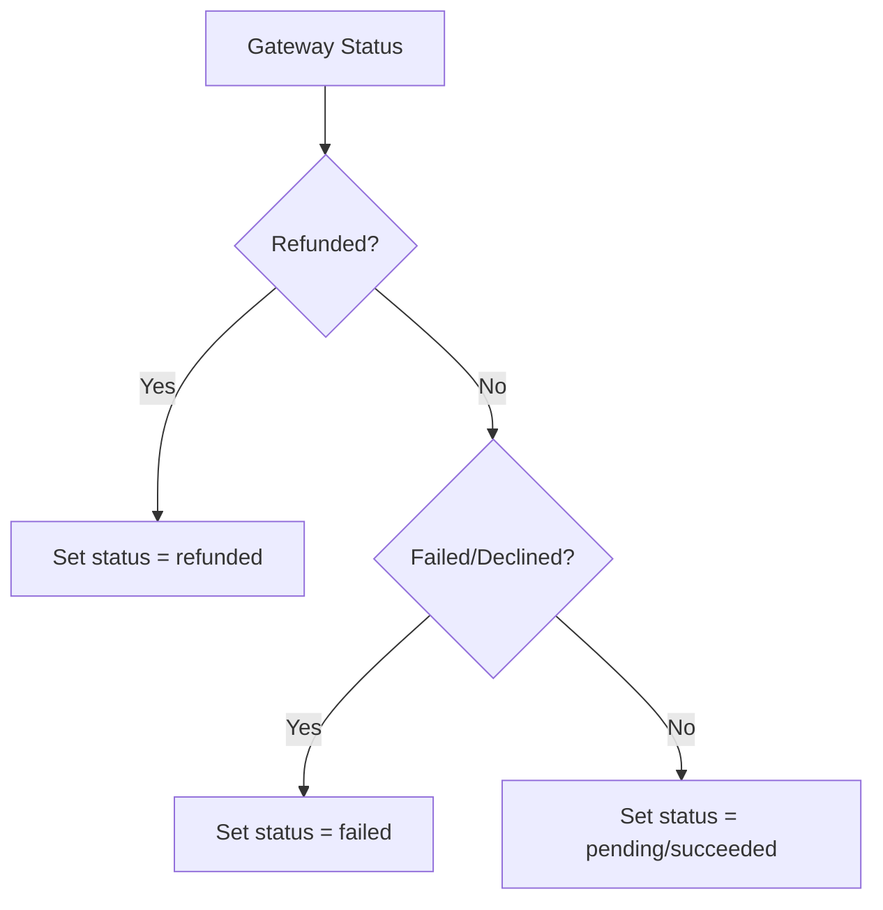
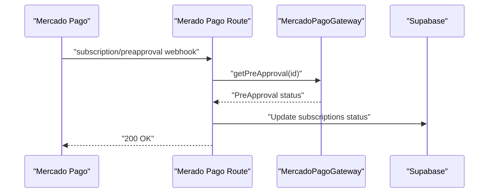
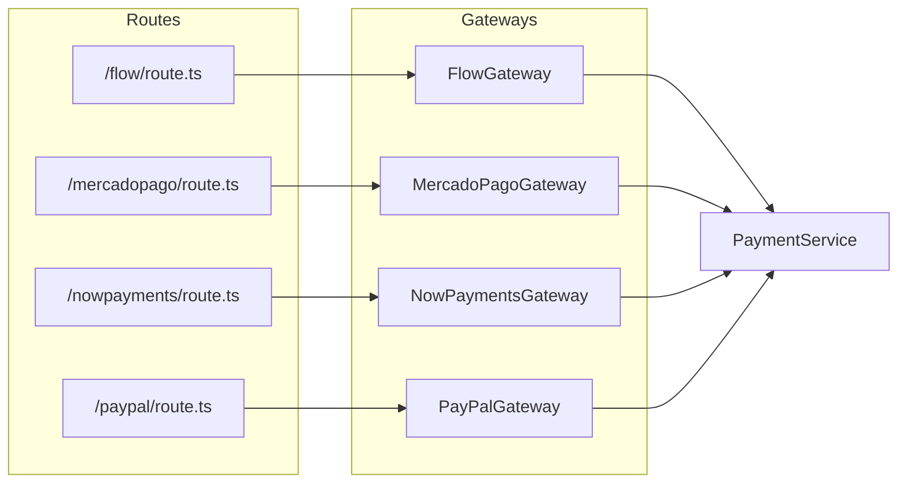

# Webhook Processing and Event Handling

<cite>
**Referenced Files in This Document**
- [index.ts](file://src/lib/payments/index.ts)
- [payment.ts](file://src/types/payment.ts)
- [route.ts](file://src/app/api/webhooks/flow/route.ts)
- [route.ts](file://src/app/api/webhooks/mercadopago/route.ts)
- [route.ts](file://src/app/api/webhooks/nowpayments/route.ts)
- [route.ts](file://src/app/api/webhooks/paypal/route.ts)
- [payment-service.ts](file://src/lib/payments/services/payment-service.ts)
- [gateway.ts](file://src/lib/payments/flow/gateway.ts)
- [gateway.ts](file://src/lib/payments/mercadopago/gateway.ts)
- [webhook-validator.ts](file://src/lib/payments/mercadopago/webhook-validator.ts)
- [gateway.ts](file://src/lib/payments/paypal/gateway.ts)
- [gateway.ts](file://src/lib/payments/nowpayments/gateway.ts)
</cite>

## Table of Contents

1. [Introduction](#introduction)
2. [Project Structure](#project-structure)
3. [Core Components](#core-components)
4. [Architecture Overview](#architecture-overview)
5. [Detailed Component Analysis](#detailed-component-analysis)
6. [Dependency Analysis](#dependency-analysis)
7. [Performance Considerations](#performance-considerations)
8. [Troubleshooting Guide](#troubleshooting-guide)
9. [Conclusion](#conclusion)
10. [Appendices](#appendices)

## Introduction

This document explains the webhook processing and event handling system for the payment integrations across multiple gateways. It covers how real-time payment events are ingested, validated, deduplicated, and transformed into internal payment updates. It also documents security controls (signature verification), idempotency, error handling, retry behavior, and practical guidance for testing, local development, and extending support to additional providers.

## Project Structure

The webhook system is organized around per-gateway route handlers and a shared payment service that encapsulates database operations and idempotency logic. Gateways implement parsing and normalization of provider-specific event payloads into a unified internal event model.

**Diagram sources**

- [route.ts](file://src/app/api/webhooks/flow/route.ts#L1-L116)
- [route.ts](file://src/app/api/webhooks/mercadopago/route.ts#L1-L372)
- [route.ts](file://src/app/api/webhooks/nowpayments/route.ts#L1-L70)
- [route.ts](file://src/app/api/webhooks/paypal/route.ts#L1-L117)
- [gateway.ts](file://src/lib/payments/flow/gateway.ts#L1-L227)
- [gateway.ts](file://src/lib/payments/mercadopago/gateway.ts#L1-L696)
- [gateway.ts](file://src/lib/payments/nowpayments/gateway.ts#L1-L240)
- [gateway.ts](file://src/lib/payments/paypal/gateway.ts#L1-L234)
- [payment-service.ts](file://src/lib/payments/services/payment-service.ts#L1-L494)

**Section sources**

- [index.ts](file://src/lib/payments/index.ts#L1-L38)
- [payment.ts](file://src/types/payment.ts#L1-L48)

## Core Components

- Unified event model: The internal WebhookEvent type defines canonical fields for gateway, event identifiers, type, status, amounts, and metadata.
- Per-gateway route handlers: Each provider exposes a Next.js route that validates inputs, parses the event, records idempotency, resolves the internal payment, updates status, and fulfills orders or subscriptions as applicable.
- PaymentService: Centralized DB operations for idempotency tracking, payment lookup, status updates, order fulfillment, and organization subscription updates.
- Gateway implementations: Each gateway normalizes provider-specific payloads into the internal WebhookEvent shape and maps statuses consistently.

**Section sources**

- [payment.ts](file://src/types/payment.ts#L35-L48)
- [payment-service.ts](file://src/lib/payments/services/payment-service.ts#L206-L269)
- [gateway.ts](file://src/lib/payments/flow/gateway.ts#L133-L198)
- [gateway.ts](file://src/lib/payments/mercadopago/gateway.ts#L172-L256)
- [gateway.ts](file://src/lib/payments/nowpayments/gateway.ts#L143-L208)
- [gateway.ts](file://src/lib/payments/paypal/gateway.ts#L146-L209)

## Architecture Overview

The webhook pipeline follows a consistent flow across providers:

**Diagram sources**

- [route.ts](file://src/app/api/webhooks/flow/route.ts#L13-L115)
- [route.ts](file://src/app/api/webhooks/mercadopago/route.ts#L15-L371)
- [route.ts](file://src/app/api/webhooks/nowpayments/route.ts#L18-L58)
- [route.ts](file://src/app/api/webhooks/paypal/route.ts#L14-L116)
- [payment-service.ts](file://src/lib/payments/services/payment-service.ts#L115-L185)

## Detailed Component Analysis

### Webhook Security and Signature Verification

- Flow: Validates callback signature when present using HMAC-SHA256 over sorted parameters and the configured secret key.
- Mercado Pago: Validates HMAC signature using headers x-signature and x-request-id, with timestamp validation and configurable secret. Validation is skipped in development if secret is not configured.
- PayPal: Does not perform signature verification in the route handler; the implementation notes indicate production should validate signatures using webhook ID and certificates.
- NowPayments: Validates IPN signature using HMAC-SHA512 with the configured IPN secret and the x-nowpayments-sig header.

**Diagram sources**

- [gateway.ts](file://src/lib/payments/flow/gateway.ts#L133-L198)
- [webhook-validator.ts](file://src/lib/payments/mercadopago/webhook-validator.ts#L35-L136)
- [gateway.ts](file://src/lib/payments/paypal/gateway.ts#L146-L209)
- [gateway.ts](file://src/lib/payments/nowpayments/gateway.ts#L143-L208)

**Section sources**

- [gateway.ts](file://src/lib/payments/flow/gateway.ts#L151-L169)
- [webhook-validator.ts](file://src/lib/payments/mercadopago/webhook-validator.ts#L35-L136)
- [gateway.ts](file://src/lib/payments/paypal/gateway.ts#L146-L149)
- [gateway.ts](file://src/lib/payments/nowpayments/gateway.ts#L153-L159)

### Idempotency and Deduplication

- Each route handler records the incoming event in the webhook_events table with processed=false initially.
- If the same gatewayEventId is seen again, the route handler short-circuits and returns success without reprocessing.
- PaymentService.recordWebhookEvent returns whether the event was already processed; PaymentService.markWebhookEventAsProcessed flips processed=true upon completion.

**Diagram sources**

- [payment-service.ts](file://src/lib/payments/services/payment-service.ts#L206-L269)
- [route.ts](file://src/app/api/webhooks/flow/route.ts#L26-L42)
- [route.ts](file://src/app/api/webhooks/mercadopago/route.ts#L262-L278)
- [route.ts](file://src/app/api/webhooks/nowpayments/route.ts#L32-L36)
- [route.ts](file://src/app/api/webhooks/paypal/route.ts#L27-L43)

**Section sources**

- [payment-service.ts](file://src/lib/payments/services/payment-service.ts#L206-L269)
- [route.ts](file://src/app/api/webhooks/flow/route.ts#L26-L42)
- [route.ts](file://src/app/api/webhooks/mercadopago/route.ts#L262-L278)
- [route.ts](file://src/app/api/webhooks/nowpayments/route.ts#L32-L36)
- [route.ts](file://src/app/api/webhooks/paypal/route.ts#L27-L43)

### Real-Time Event Processing Workflows

#### Payment Confirmations

- Flow: Parses token, status, and optional signature; maps status to internal state; updates payment and optionally fulfills order.
- Mercado Pago: Supports payment topic and merchant_order fallback; updates payment and organization subscription on success.
- PayPal: Accepts CHECKOUT.ORDER.COMPLETED and PAYMENT.CAPTURE.COMPLETED; updates payment and fulfills order.
- NowPayments: Accepts IPN with status mapping; updates payment and organization subscription on success.

**Diagram sources**

- [route.ts](file://src/app/api/webhooks/flow/route.ts#L13-L115)
- [route.ts](file://src/app/api/webhooks/mercadopago/route.ts#L15-L371)
- [route.ts](file://src/app/api/webhooks/nowpayments/route.ts#L18-L58)
- [route.ts](file://src/app/api/webhooks/paypal/route.ts#L14-L116)
- [payment-service.ts](file://src/lib/payments/services/payment-service.ts#L115-L185)

**Section sources**

- [route.ts](file://src/app/api/webhooks/flow/route.ts#L80-L99)
- [route.ts](file://src/app/api/webhooks/mercadopago/route.ts#L316-L346)
- [route.ts](file://src/app/api/webhooks/paypal/route.ts#L81-L100)
- [route.ts](file://src/app/api/webhooks/nowpayments/route.ts#L32-L43)

#### Chargebacks and Refunds

- Flow: Maps rejected/cancelled statuses to failed; refund handling depends on provider-specific events.
- Mercado Pago: Explicitly maps refunded to refunded; supports merchant_order to reconcile finalization.
- PayPal: Maps REFUNDED to refunded; route handles event types accordingly.
- NowPayments: Maps refunded/expired to failed; partially_paid treated as pending.

**Diagram sources**

- [gateway.ts](file://src/lib/payments/flow/gateway.ts#L200-L225)
- [gateway.ts](file://src/lib/payments/mercadopago/gateway.ts#L676-L694)
- [gateway.ts](file://src/lib/payments/paypal/gateway.ts#L211-L232)
- [gateway.ts](file://src/lib/payments/nowpayments/gateway.ts#L213-L238)

**Section sources**

- [gateway.ts](file://src/lib/payments/mercadopago/gateway.ts#L676-L694)
- [gateway.ts](file://src/lib/payments/paypal/gateway.ts#L211-L232)
- [gateway.ts](file://src/lib/payments/nowpayments/gateway.ts#L224-L238)

#### Subscription Events (Plans and Preapproval)

- Mercado Pago: Route handler recognizes subscription_preapproval and preapproval topics; queries gateway for preapproval status and updates subscription records accordingly.

**Diagram sources**

- [route.ts](file://src/app/api/webhooks/mercadopago/route.ts#L76-L145)
- [gateway.ts](file://src/lib/payments/mercadopago/gateway.ts#L642-L674)

**Section sources**

- [route.ts](file://src/app/api/webhooks/mercadopago/route.ts#L76-L145)
- [gateway.ts](file://src/lib/payments/mercadopago/gateway.ts#L642-L674)

### Error Handling Strategies and Retry Behavior

- Route handlers wrap processing in try/catch, logging errors and returning structured responses. Providers may return 500 on internal failures; otherwise, 200 to acknowledge receipt.
- NowPayments route intentionally returns 200 even on errors to prevent repeated retries by the provider while still logging the error.
- PaymentService throws on DB errors, allowing routes to surface 500 responses.

**Section sources**

- [route.ts](file://src/app/api/webhooks/flow/route.ts#L100-L114)
- [route.ts](file://src/app/api/webhooks/mercadopago/route.ts#L348-L362)
- [route.ts](file://src/app/api/webhooks/nowpayments/route.ts#L44-L57)
- [route.ts](file://src/app/api/webhooks/paypal/route.ts#L101-L115)
- [payment-service.ts](file://src/lib/payments/services/payment-service.ts#L197-L202)

### Dead Letter Queue Management

- The system does not implement a dedicated dead-letter queue. Instead:
  - Unknown or unhandled events are logged and skipped.
  - Missing identifiers (e.g., gatewayPaymentIntentId) lead to marking the event as processed and returning success to avoid retries.
  - For providers like NowPayments, returning 200 prevents provider retries, reducing DLQ pressure.

**Section sources**

- [route.ts](file://src/app/api/webhooks/flow/route.ts#L44-L58)
- [route.ts](file://src/app/api/webhooks/mercadopago/route.ts#L280-L294)
- [route.ts](file://src/app/api/webhooks/nowpayments/route.ts#L51-L57)
- [route.ts](file://src/app/api/webhooks/paypal/route.ts#L45-L59)

### Concrete Examples of Webhook Handlers

- Flow: Parses form data, verifies signature if present, maps status, updates payment, and fulfills order when applicable.
- Mercado Pago: Validates signature, supports multiple topics (payment, merchant_order, subscription), updates payments and subscriptions.
- PayPal: Accepts order completion and capture completion events, updates payments and fulfills orders.
- NowPayments: Validates IPN signature, maps statuses, updates payments and organization subscriptions.

**Section sources**

- [route.ts](file://src/app/api/webhooks/flow/route.ts#L13-L115)
- [route.ts](file://src/app/api/webhooks/mercadopago/route.ts#L15-L371)
- [route.ts](file://src/app/api/webhooks/paypal/route.ts#L14-L116)
- [route.ts](file://src/app/api/webhooks/nowpayments/route.ts#L18-L58)

### Extending Webhook Support to Additional Providers

- Add a new route under src/app/api/webhooks/{provider}/route.ts implementing POST/GET handlers.
- Implement a new gateway class under src/lib/payments/{provider}/gateway.ts with processWebhookEvent and status mapping.
- Integrate with PaymentService.updatePaymentFromWebhook or follow the route pattern to record idempotency and update payments.
- Configure provider credentials and secrets in environment variables as needed.
- Add tests similar to existing ones to validate parsing and status mapping.

**Section sources**

- [index.ts](file://src/lib/payments/index.ts#L19-L34)
- [gateway.ts](file://src/lib/payments/flow/gateway.ts#L47-L227)
- [gateway.ts](file://src/lib/payments/mercadopago/gateway.ts#L68-L696)
- [gateway.ts](file://src/lib/payments/nowpayments/gateway.ts#L58-L240)
- [gateway.ts](file://src/lib/payments/paypal/gateway.ts#L59-L234)

## Dependency Analysis

The payment system exhibits clear separation of concerns:

- Routes depend on Gateways for parsing and on PaymentService for persistence.
- Gateways depend on provider SDKs or HTTP clients and environment configuration.
- PaymentService encapsulates DB operations and idempotency logic.

**Diagram sources**

- [route.ts](file://src/app/api/webhooks/flow/route.ts#L1-L116)
- [route.ts](file://src/app/api/webhooks/mercadopago/route.ts#L1-L372)
- [route.ts](file://src/app/api/webhooks/nowpayments/route.ts#L1-L70)
- [route.ts](file://src/app/api/webhooks/paypal/route.ts#L1-L117)
- [gateway.ts](file://src/lib/payments/flow/gateway.ts#L1-L227)
- [gateway.ts](file://src/lib/payments/mercadopago/gateway.ts#L1-L696)
- [gateway.ts](file://src/lib/payments/nowpayments/gateway.ts#L1-L240)
- [gateway.ts](file://src/lib/payments/paypal/gateway.ts#L1-L234)
- [payment-service.ts](file://src/lib/payments/services/payment-service.ts#L1-L494)

**Section sources**

- [index.ts](file://src/lib/payments/index.ts#L19-L34)

## Performance Considerations

- Minimize external provider calls: Gateways should fetch minimal data needed to parse events; defer heavy operations to PaymentService.
- Idempotency reduces redundant work and prevents race conditions.
- Logging should be structured and non-sensitive; avoid logging raw provider secrets.
- Consider batching or async processing for high-volume scenarios, though current routes are synchronous.

## Troubleshooting Guide

Common issues and remedies:

- Missing or invalid signatures:
  - Flow: Ensure secret key is configured and signature matches.
  - Mercado Pago: Set MERCADOPAGO_WEBHOOK_SECRET; verify x-signature, x-request-id, and timestamp.
  - PayPal: Implement signature verification using webhook ID and certificates.
  - NowPayments: Ensure NOWPAYMENTS_IPN_SECRET is set and x-nowpayments-sig matches.
- Missing gatewayPaymentIntentId:
  - Routes log warnings and mark event as processed; ensure payment intents are created and stored properly.
- Duplicate events:
  - Idempotency prevents reprocessing; check webhook_events table for processed flags.
- Provider-specific topics:
  - Mercado Pago: merchant_order fallback requires preference_id resolution; verify order retrieval.
- Logging:
  - Use structured logs to correlate request IDs, gatewayEventIds, and payment IDs.

**Section sources**

- [gateway.ts](file://src/lib/payments/flow/gateway.ts#L151-L169)
- [webhook-validator.ts](file://src/lib/payments/mercadopago/webhook-validator.ts#L42-L50)
- [gateway.ts](file://src/lib/payments/paypal/gateway.ts#L146-L149)
- [gateway.ts](file://src/lib/payments/nowpayments/gateway.ts#L153-L159)
- [route.ts](file://src/app/api/webhooks/flow/route.ts#L44-L58)
- [route.ts](file://src/app/api/webhooks/mercadopago/route.ts#L280-L294)
- [route.ts](file://src/app/api/webhooks/nowpayments/route.ts#L51-L57)
- [route.ts](file://src/app/api/webhooks/paypal/route.ts#L45-L59)

## Conclusion

The webhook system provides a robust, provider-agnostic mechanism for real-time payment event processing. It emphasizes security through signature verification, reliability through idempotency, and maintainability through centralized service logic. The modular design enables straightforward extension to additional providers and customization of event workflows.

## Appendices

### Environment Variables and Setup

- Flow: FLOW_API_KEY(\_SANDBOX), FLOW_SECRET_KEY(\_SANDBOX), FLOW_API_URL, NEXT_PUBLIC_BASE_URL.
- Mercado Pago: MP_ACCESS_TOKEN(\_SANDBOX) or MERCADOPAGO_ACCESS_TOKEN(\_SANDBOX), MERCADOPAGO_WEBHOOK_SECRET, NEXT_PUBLIC_BASE_URL.
- PayPal: PAYPAL_CLIENT_ID, PAYPAL_CLIENT_SECRET, PAYPAL_API_BASE_URL.
- NowPayments: NOWPAYMENTS_API_KEY(\_SANDBOX), NOWPAYMENTS_IPN_SECRET, NEXT_PUBLIC_BASE_URL.

**Section sources**

- [gateway.ts](file://src/lib/payments/flow/gateway.ts#L14-L30)
- [gateway.ts](file://src/lib/payments/mercadopago/gateway.ts#L42-L66)
- [gateway.ts](file://src/lib/payments/paypal/gateway.ts#L12-L20)
- [gateway.ts](file://src/lib/payments/nowpayments/gateway.ts#L27-L42)

### Testing and Local Development

- Use local tunnels (e.g., ngrok) to expose webhook endpoints during development.
- For Mercado Pago, configure notification_url to the tunnel URL.
- For NowPayments, set IPN callback URL to the exposed endpoint.
- Validate signature verification by sending signed/un-signed requests and observing route behavior.
- Inspect logs for correlation IDs and event IDs to trace processing.

[No sources needed since this section provides general guidance]
