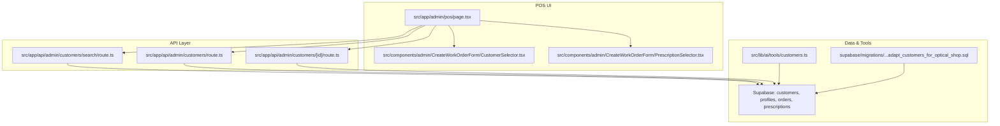
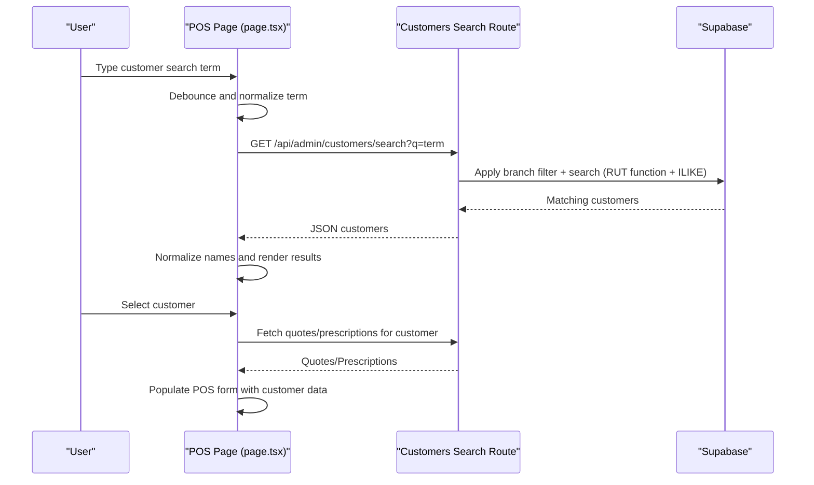
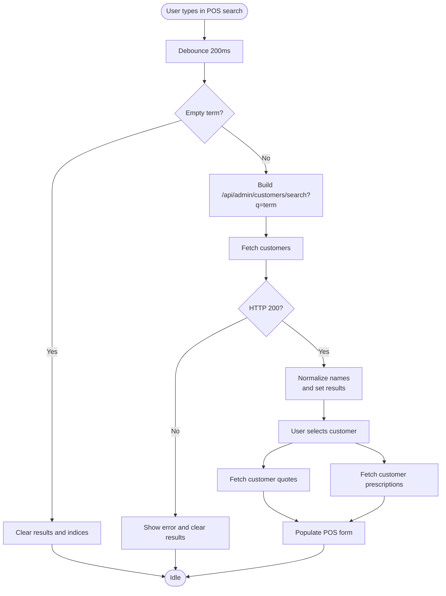
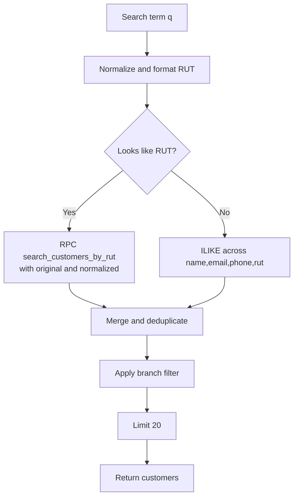
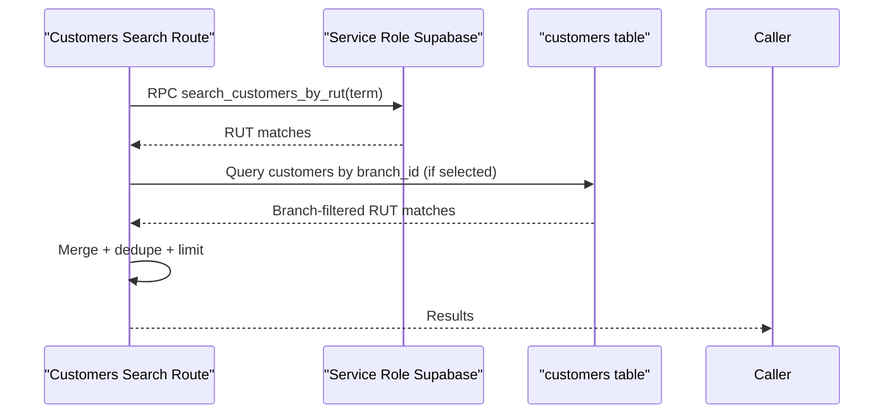
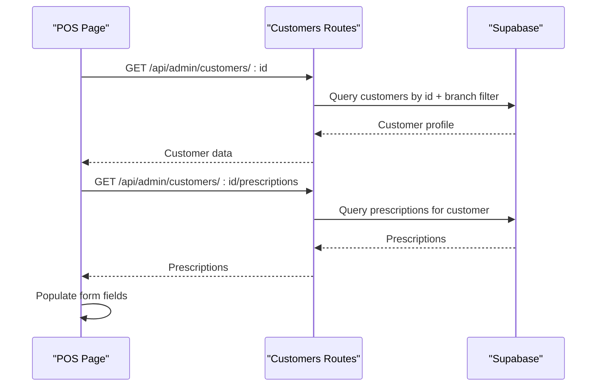
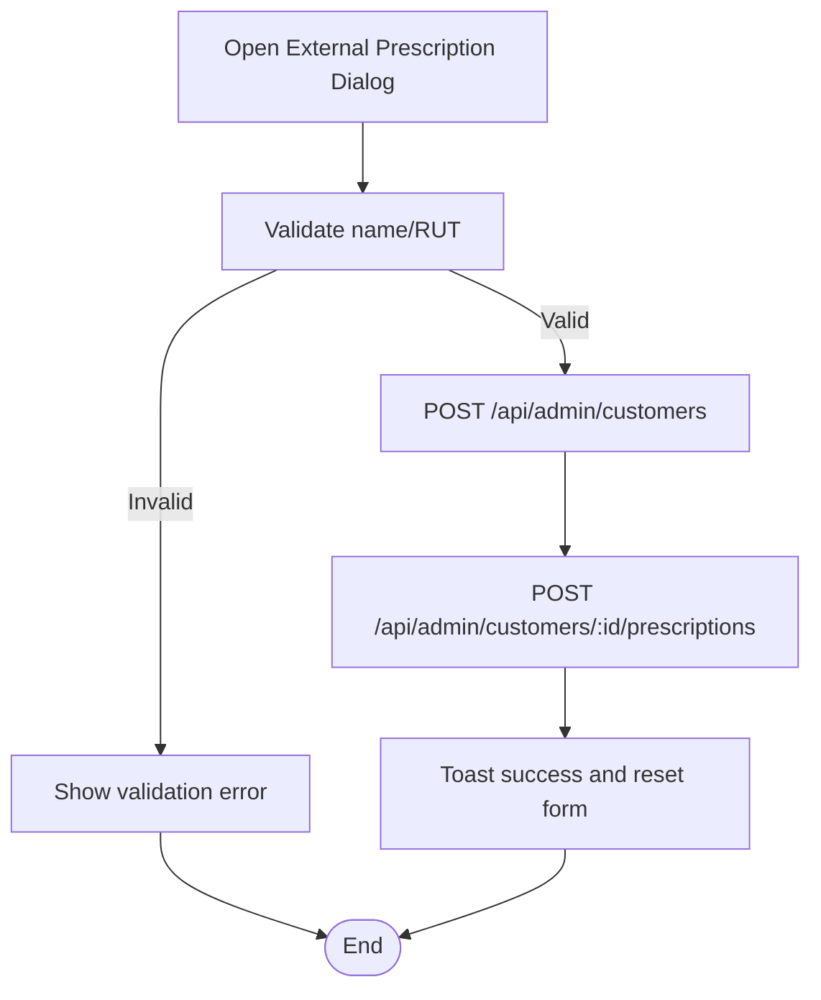
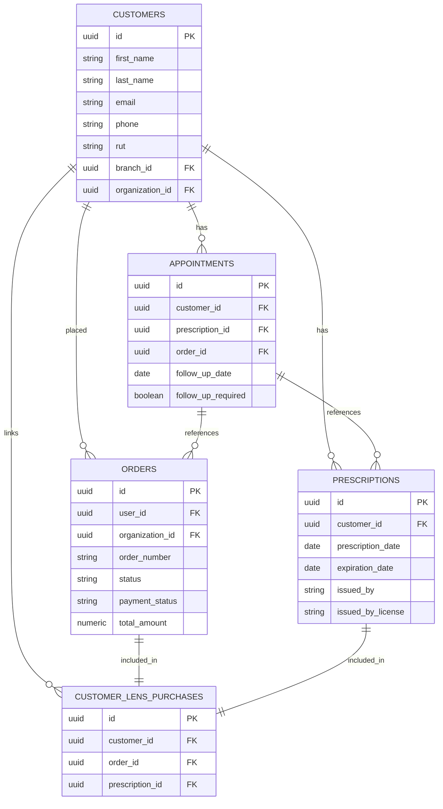
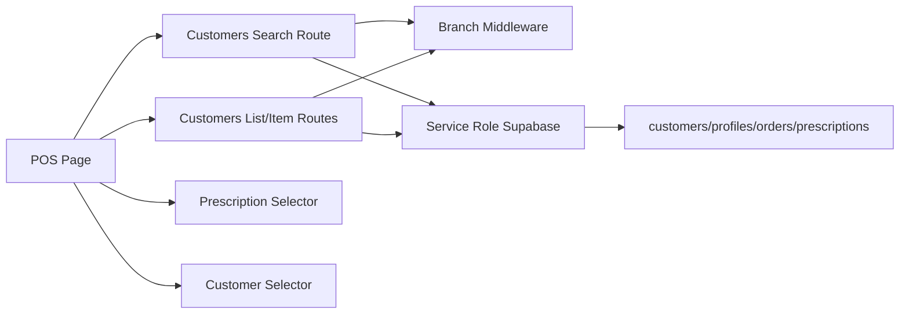

# Customer Management in POS

<cite>
**Referenced Files in This Document**
- [src/app/admin/pos/page.tsx](file://src/app/admin/pos/page.tsx)
- [src/app/api/admin/customers/search/route.ts](file://src/app/api/admin/customers/search/route.ts)
- [src/app/api/admin/customers/route.ts](file://src/app/api/admin/customers/route.ts)
- [src/app/api/admin/customers/[id]/route.ts](file://src/app/api/admin/customers/[id]/route.ts)
- [src/components/admin/CreateWorkOrderForm/CustomerSelector.tsx](file://src/components/admin/CreateWorkOrderForm/CustomerSelector.tsx)
- [src/components/admin/CreateWorkOrderForm/PrescriptionSelector.tsx](file://src/components/admin/CreateWorkOrderForm/PrescriptionSelector.tsx)
- [src/lib/ai/tools/customers.ts](file://src/lib/ai/tools/customers.ts)
- [src/__tests__/integration/api/customers.test.ts](file://src/__tests__/integration/api/customers.test.ts)
- [supabase/migrations/20250123000000_adapt_customers_for_optical_shop.sql](file://supabase/migrations/20250123000000_adapt_customers_for_optical_shop.sql)
</cite>

## Table of Contents

1. [Introduction](#introduction)
2. [Project Structure](#project-structure)
3. [Core Components](#core-components)
4. [Architecture Overview](#architecture-overview)
5. [Detailed Component Analysis](#detailed-component-analysis)
6. [Dependency Analysis](#dependency-analysis)
7. [Performance Considerations](#performance-considerations)
8. [Troubleshooting Guide](#troubleshooting-guide)
9. [Conclusion](#conclusion)
10. [Appendices](#appendices)

## Introduction

This document explains customer management within the POS system, focusing on how customers are searched, matched, and integrated with appointment history, prescriptions, and purchase history. It covers:

- Intelligent search by name, RUT, email, and phone
- Cross-branch customer retrieval and RUT-based matching
- Customer selection workflow and how customer data populates the POS form
- POS-specific features such as walk-in customers and external prescriptions
- Practical scenarios for retail environments

## Project Structure

Customer management spans UI, API routes, Supabase migrations, and shared components:

- POS page orchestrates customer search and selection
- API routes implement search, filtering, and branch-aware queries
- Supabase migrations define customer and related record schemas
- Shared components support customer and prescription selection in related forms

**Diagram sources**

- [src/app/admin/pos/page.tsx](file://src/app/admin/pos/page.tsx#L500-L699)
- [src/app/api/admin/customers/search/route.ts](file://src/app/api/admin/customers/search/route.ts#L1-L200)
- [src/app/api/admin/customers/route.ts](file://src/app/api/admin/customers/route.ts#L94-L129)
- [src/app/api/admin/customers/[id]/route.ts](file://src/app/api/admin/customers/[id]/route.ts#L66-L104)
- [src/components/admin/CreateWorkOrderForm/CustomerSelector.tsx](file://src/components/admin/CreateWorkOrderForm/CustomerSelector.tsx)
- [src/components/admin/CreateWorkOrderForm/PrescriptionSelector.tsx](file://src/components/admin/CreateWorkOrderForm/PrescriptionSelector.tsx)
- [src/lib/ai/tools/customers.ts](file://src/lib/ai/tools/customers.ts#L1-L366)
- [supabase/migrations/20250123000000_adapt_customers_for_optical_shop.sql](file://supabase/migrations/20250123000000_adapt_customers_for_optical_shop.sql#L122-L155)

**Section sources**

- [src/app/admin/pos/page.tsx](file://src/app/admin/pos/page.tsx#L500-L699)
- [src/app/api/admin/customers/search/route.ts](file://src/app/api/admin/customers/search/route.ts#L1-L200)
- [src/app/api/admin/customers/route.ts](file://src/app/api/admin/customers/route.ts#L94-L129)
- [src/app/api/admin/customers/[id]/route.ts](file://src/app/api/admin/customers/[id]/route.ts#L66-L104)
- [src/components/admin/CreateWorkOrderForm/CustomerSelector.tsx](file://src/components/admin/CreateWorkOrderForm/CustomerSelector.tsx)
- [src/components/admin/CreateWorkOrderForm/PrescriptionSelector.tsx](file://src/components/admin/CreateWorkOrderForm/PrescriptionSelector.tsx)
- [src/lib/ai/tools/customers.ts](file://src/lib/ai/tools/customers.ts#L1-L366)
- [supabase/migrations/20250123000000_adapt_customers_for_optical_shop.sql](file://supabase/migrations/20250123000000_adapt_customers_for_optical_shop.sql#L122-L155)

## Core Components

- POS customer search and selection:
  - Debounced search triggers a fetch to the customers search endpoint
  - Results are normalized to display a friendly name and filtered by branch context
- Intelligent search algorithm:
  - Supports name, email, phone, and RUT (including partial matches)
  - Uses a SQL function for RUT search and falls back to standard ILIKE queries
- Cross-branch retrieval:
  - Branch-aware filtering ensures users only see relevant customers
  - RUT-based matching works across branches for the same person
- POS-specific features:
  - Walk-in customers with external prescriptions
  - Automatic selection of current prescriptions when available
- Integration with history:
  - Customer quotes and prescriptions are fetched and populated into the POS form

**Section sources**

- [src/app/admin/pos/page.tsx](file://src/app/admin/pos/page.tsx#L500-L699)
- [src/app/api/admin/customers/search/route.ts](file://src/app/api/admin/customers/search/route.ts#L1-L200)
- [src/app/api/admin/customers/search/route.ts](file://src/app/api/admin/customers/search/route.ts#L103-L347)
- [src/app/api/admin/customers/route.ts](file://src/app/api/admin/customers/route.ts#L94-L129)
- [src/app/api/admin/customers/[id]/route.ts](file://src/app/api/admin/customers/[id]/route.ts#L66-L104)
- [src/components/admin/CreateWorkOrderForm/PrescriptionSelector.tsx](file://src/components/admin/CreateWorkOrderForm/PrescriptionSelector.tsx#L45-L89)

## Architecture Overview

The POS customer management flow integrates UI, API, and database layers with branch-aware filtering and intelligent search.

**Diagram sources**

- [src/app/admin/pos/page.tsx](file://src/app/admin/pos/page.tsx#L500-L699)
- [src/app/api/admin/customers/search/route.ts](file://src/app/api/admin/customers/search/route.ts#L1-L200)
- [src/app/api/admin/customers/search/route.ts](file://src/app/api/admin/customers/search/route.ts#L103-L347)

## Detailed Component Analysis

### POS Customer Search and Selection Workflow

- Debounced search triggers a fetch to the search endpoint
- Results are normalized to a display-friendly name
- Branch context filters results for non-super admins
- On selection, quotes and prescriptions are fetched and the POS form is populated

**Diagram sources**

- [src/app/admin/pos/page.tsx](file://src/app/admin/pos/page.tsx#L500-L699)

**Section sources**

- [src/app/admin/pos/page.tsx](file://src/app/admin/pos/page.tsx#L500-L699)

### Intelligent Search Algorithm (Name, RUT, Email, Phone)

- Term normalization and formatting enable flexible matching
- RUT detection supports partial matches and multiple formats
- Two-pronged search:
  - SQL function for robust RUT partial matching
  - Standard OR ILIKE queries across name, email, phone, and RUT
- Branch-aware filtering applied consistently

**Diagram sources**

- [src/app/api/admin/customers/search/route.ts](file://src/app/api/admin/customers/search/route.ts#L1-L200)
- [src/app/api/admin/customers/search/route.ts](file://src/app/api/admin/customers/search/route.ts#L103-L347)

**Section sources**

- [src/app/api/admin/customers/search/route.ts](file://src/app/api/admin/customers/search/route.ts#L1-L200)
- [src/app/api/admin/customers/search/route.ts](file://src/app/api/admin/customers/search/route.ts#L103-L347)

### Cross-Branch Customer Retrieval and RUT-Based Matching

- Branch context determines visibility:
  - Super admins without a selected branch return empty for RUT searches
  - Non-super admins without a branch return empty
  - Selected branch filters results accordingly
- RUT matching:
  - Uses both formatted and normalized variants
  - Deduplicates results from function and ILIKE searches
  - Filters to the selected branch when applicable

**Diagram sources**

- [src/app/api/admin/customers/search/route.ts](file://src/app/api/admin/customers/search/route.ts#L103-L347)

**Section sources**

- [src/app/api/admin/customers/search/route.ts](file://src/app/api/admin/customers/search/route.ts#L103-L347)

### Customer Lookup and Profile Integration

- Customer lookup by ID respects branch context and organization isolation
- POS form population:
  - Sets customer and formats RUT
  - Loads quotes and prescriptions for cross-branch context
- Walk-in customers with external prescriptions:
  - Dialog collects customer and prescription details
  - Creates customer and associated prescription atomically

**Diagram sources**

- [src/app/api/admin/customers/[id]/route.ts](file://src/app/api/admin/customers/[id]/route.ts#L66-L104)
- [src/app/admin/pos/page.tsx](file://src/app/admin/pos/page.tsx#L1126-L1139)
- [src/app/admin/pos/page.tsx](file://src/app/admin/pos/page.tsx#L1141-L1337)

**Section sources**

- [src/app/api/admin/customers/[id]/route.ts](file://src/app/api/admin/customers/[id]/route.ts#L66-L104)
- [src/app/admin/pos/page.tsx](file://src/app/admin/pos/page.tsx#L1126-L1139)
- [src/app/admin/pos/page.tsx](file://src/app/admin/pos/page.tsx#L1141-L1337)

### POS-Specific Features: Walk-In Customers and External Prescriptions

- External customer creation:
  - Validates required fields (name and RUT)
  - Creates customer and immediately creates a prescription
- Automatic current prescription selection:
  - Prescription selector auto-selects the most recent “current” prescription when available

**Diagram sources**

- [src/app/admin/pos/page.tsx](file://src/app/admin/pos/page.tsx#L1141-L1337)
- [src/components/admin/CreateWorkOrderForm/PrescriptionSelector.tsx](file://src/components/admin/CreateWorkOrderForm/PrescriptionSelector.tsx#L45-L89)

**Section sources**

- [src/app/admin/pos/page.tsx](file://src/app/admin/pos/page.tsx#L258-L288)
- [src/app/admin/pos/page.tsx](file://src/app/admin/pos/page.tsx#L1141-L1337)
- [src/components/admin/CreateWorkOrderForm/PrescriptionSelector.tsx](file://src/components/admin/CreateWorkOrderForm/PrescriptionSelector.tsx#L45-L89)

### Customer History Integration: Appointments, Prescriptions, and Purchase History

- Appointment history and related records:
  - Appointments link to prescriptions and orders
- Purchase history:
  - Customer lens purchases table connects orders and prescriptions
- POS integration:
  - POS loads quotes and prescriptions for the selected customer
  - Cross-branch matching uses RUT/email when loading quotes

**Diagram sources**

- [supabase/migrations/20250123000000_adapt_customers_for_optical_shop.sql](file://supabase/migrations/20250123000000_adapt_customers_for_optical_shop.sql#L122-L155)

**Section sources**

- [supabase/migrations/20250123000000_adapt_customers_for_optical_shop.sql](file://supabase/migrations/20250123000000_adapt_customers_for_optical_shop.sql#L122-L155)
- [src/app/admin/pos/page.tsx](file://src/app/admin/pos/page.tsx#L557-L642)

### AI Customer Tools Integration

- AI tools support customer search, retrieval, updates, and order/statistics queries
- These tools operate against the profiles table and enforce organization context

**Section sources**

- [src/lib/ai/tools/customers.ts](file://src/lib/ai/tools/customers.ts#L1-L366)

## Dependency Analysis

- UI depends on:
  - Branch context for filtering
  - Search endpoint for results
  - Customer and prescription endpoints for history
- API depends on:
  - Supabase service role to bypass RLS for search
  - Branch middleware for multi-tenancy and branch filtering
  - RUT normalization/formatting utilities
- Database depends on:
  - Migration-defined tables and relationships
  - SQL function for RUT search

**Diagram sources**

- [src/app/admin/pos/page.tsx](file://src/app/admin/pos/page.tsx#L500-L699)
- [src/app/api/admin/customers/search/route.ts](file://src/app/api/admin/customers/search/route.ts#L1-L200)
- [src/app/api/admin/customers/route.ts](file://src/app/api/admin/customers/route.ts#L94-L129)
- [src/app/api/admin/customers/[id]/route.ts](file://src/app/api/admin/customers/[id]/route.ts#L66-L104)

**Section sources**

- [src/app/admin/pos/page.tsx](file://src/app/admin/pos/page.tsx#L500-L699)
- [src/app/api/admin/customers/search/route.ts](file://src/app/api/admin/customers/search/route.ts#L1-L200)
- [src/app/api/admin/customers/route.ts](file://src/app/api/admin/customers/route.ts#L94-L129)
- [src/app/api/admin/customers/[id]/route.ts](file://src/app/api/admin/customers/[id]/route.ts#L66-L104)

## Performance Considerations

- Debouncing reduces network requests during typing
- Branch filtering limits result sets early
- RUT function enables efficient partial matching; fallback ILIKE queries are limited to 20 results
- Deduplication avoids redundant entries when merging function and ILIKE results

[No sources needed since this section provides general guidance]

## Troubleshooting Guide

- No results when searching by RUT:
  - Ensure the RUT is at least two characters long and contains digits and allowed characters
  - Verify branch context is selected for non-super admins
- Empty results for non-super admins without branch:
  - Select a branch in the branch selector
- Validation errors when creating external customer:
  - Name (first or last) and RUT are required
- Multi-tenancy isolation:
  - Users can only access customers within their organization and selected branch

**Section sources**

- [src/app/api/admin/customers/search/route.ts](file://src/app/api/admin/customers/search/route.ts#L76-L82)
- [src/app/admin/pos/page.tsx](file://src/app/admin/pos/page.tsx#L1141-L1337)
- [src/**tests**/integration/api/customers.test.ts](file://src/__tests__/integration/api/customers.test.ts#L102-L177)

## Conclusion

The POS customer management system provides a robust, branch-aware search experience with intelligent RUT matching and seamless integration with customer history. The workflow supports walk-in customers, external prescriptions, and cross-branch data retrieval, ensuring accurate and efficient customer-centric operations in retail environments.

[No sources needed since this section summarizes without analyzing specific files]

## Appendices

### Common Scenarios

- Search by name or email:
  - Type a partial name or email; results appear after a short delay
- Search by phone:
  - Enter a partial or full phone number; results include matches across the organization and branch
- Search by RUT:
  - Enter RUT with or without formatting; partial matches supported
- Cross-branch lookup:
  - Same person may have multiple customer records per branch; RUT-based matching retrieves all
- Walk-in customer with external prescription:
  - Use the external prescription dialog to create a customer and associated prescription quickly

[No sources needed since this section provides general guidance]
