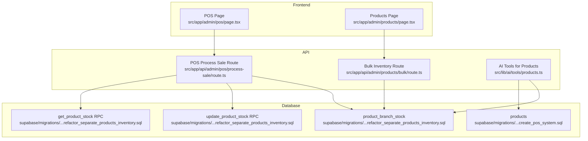
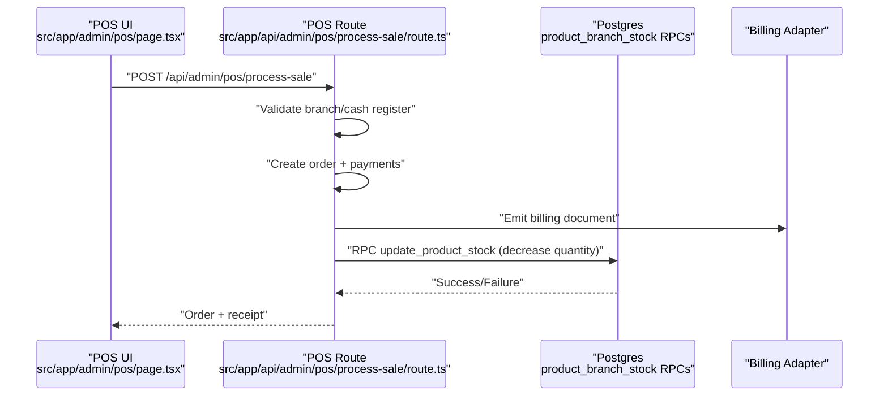
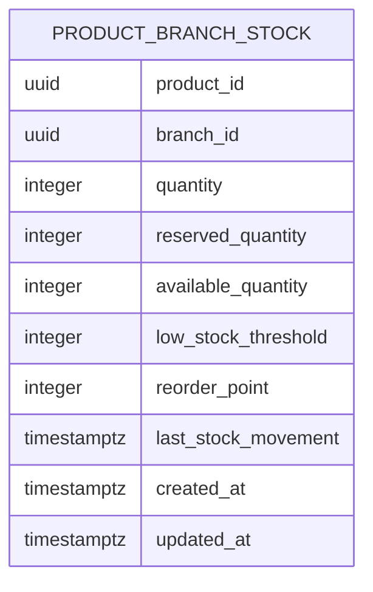
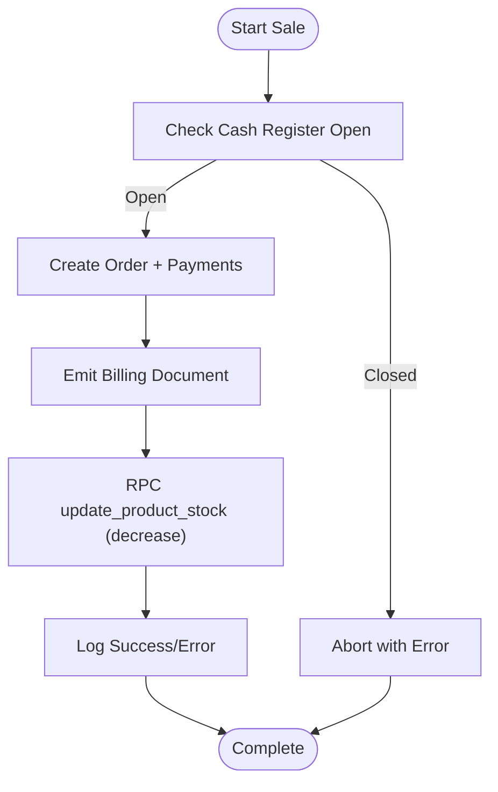
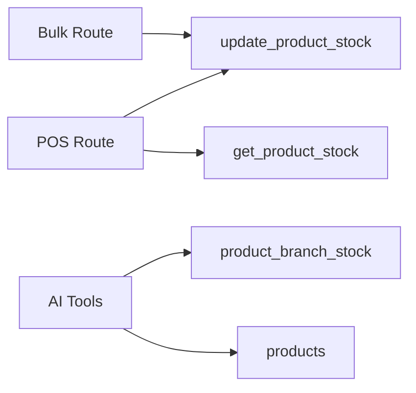

# Inventory Management Integration

<cite>
**Referenced Files in This Document**
- [20260120000000_refactor_separate_products_inventory.sql](file://supabase/migrations/20260120000000_refactor_separate_products_inventory.sql)
- [20250121000000_create_pos_system.sql](file://supabase/migrations/20250121000000_create_pos_system.sql)
- [process-sale/route.ts](file://src/app/api/admin/pos/process-sale/route.ts)
- [bulk/route.ts](file://src/app/api/admin/products/bulk/route.ts)
- [products.ts](file://src/lib/ai/tools/products.ts)
- [page.tsx](file://src/app/admin/products/page.tsx)
- [POS page.tsx](file://src/app/admin/pos/page.tsx)
- [PlanDeRefraccionSecciones.md](file://docs/PlanDeRefraccionSecciones.md)
</cite>

## Table of Contents

1. [Introduction](#introduction)
2. [Project Structure](#project-structure)
3. [Core Components](#core-components)
4. [Architecture Overview](#architecture-overview)
5. [Detailed Component Analysis](#detailed-component-analysis)
6. [Dependency Analysis](#dependency-analysis)
7. [Performance Considerations](#performance-considerations)
8. [Troubleshooting Guide](#troubleshooting-guide)
9. [Conclusion](#conclusion)
10. [Appendices](#appendices)

## Introduction

This document explains the inventory management integration within the POS system. It covers real-time inventory tracking, stock level updates during POS transactions, validation before sale completion, and integration with product catalog management. It also documents low stock alerts, out-of-stock handling, inventory reservation during quote-to-sale conversion, backorder processing, partial fulfillment, inventory transfers between branches, inventory accuracy and reconciliation, and reporting integration. Examples include stock shortages, bulk sales, and inventory adjustments.

## Project Structure

The inventory system is implemented via:

- Supabase Postgres migrations defining the inventory schema and stored procedures
- API routes orchestrating POS sales and inventory updates
- Frontend POS and product management pages
- AI tools for inventory queries and actions

**Diagram sources**

- [POS page.tsx](file://src/app/admin/pos/page.tsx#L148-L190)
- [Products page.tsx](file://src/app/admin/products/page.tsx#L72-L126)
- [process-sale/route.ts](file://src/app/api/admin/pos/process-sale/route.ts#L17-L125)
- [bulk/route.ts](file://src/app/api/admin/products/bulk/route.ts#L205-L279)
- [products.ts](file://src/lib/ai/tools/products.ts#L584-L683)
- [20260120000000_refactor_separate_products_inventory.sql](file://supabase/migrations/20260120000000_refactor_separate_products_inventory.sql#L9-L224)
- [20250121000000_create_pos_system.sql](file://supabase/migrations/20250121000000_create_pos_system.sql#L224-L247)

**Section sources**

- [POS page.tsx](file://src/app/admin/pos/page.tsx#L148-L190)
- [Products page.tsx](file://src/app/admin/products/page.tsx#L72-L126)
- [process-sale/route.ts](file://src/app/api/admin/pos/process-sale/route.ts#L17-L125)
- [bulk/route.ts](file://src/app/api/admin/products/bulk/route.ts#L205-L279)
- [products.ts](file://src/lib/ai/tools/products.ts#L584-L683)
- [20260120000000_refactor_separate_products_inventory.sql](file://supabase/migrations/20260120000000_refactor_separate_products_inventory.sql#L9-L224)
- [20250121000000_create_pos_system.sql](file://supabase/migrations/20250121000000_create_pos_system.sql#L224-L247)

## Core Components

- Inventory schema and stored procedures:
  - product_branch_stock: per-branch stock with reserved/available quantities and thresholds
  - update_product_stock RPC: centralized stock update with reserve option
  - get_product_stock RPC: per-branch stock retrieval
- POS sale orchestration:
  - Validates cash register status, creates order, registers payments, emits billing, and updates inventory
- Bulk inventory operations:
  - Batch adjust stock via RPC update_product_stock
- AI tools:
  - Low stock queries and inventory adjustments across branches

Key implementation references:

- [product_branch_stock DDL and RPCs](file://supabase/migrations/20260120000000_refactor_separate_products_inventory.sql#L9-L224)
- [POS sale flow and inventory update](file://src/app/api/admin/pos/process-sale/route.ts#L817-L951)
- [Bulk inventory adjustment](file://src/app/api/admin/products/bulk/route.ts#L205-L279)
- [AI low stock and adjustment](file://src/lib/ai/tools/products.ts#L584-L683)

**Section sources**

- [20260120000000_refactor_separate_products_inventory.sql](file://supabase/migrations/20260120000000_refactor_separate_products_inventory.sql#L9-L224)
- [process-sale/route.ts](file://src/app/api/admin/pos/process-sale/route.ts#L817-L951)
- [bulk/route.ts](file://src/app/api/admin/products/bulk/route.ts#L205-L279)
- [products.ts](file://src/lib/ai/tools/products.ts#L584-L683)

## Architecture Overview

The POS sale flow integrates financial, logistic, and operational transactions. Inventory deduction occurs only upon order confirmation, ensuring accurate stock counts.

**Diagram sources**

- [POS page.tsx](file://src/app/admin/pos/page.tsx#L148-L190)
- [process-sale/route.ts](file://src/app/api/admin/pos/process-sale/route.ts#L17-L125)
- [process-sale/route.ts](file://src/app/api/admin/pos/process-sale/route.ts#L817-L951)
- [20260120000000_refactor_separate_products_inventory.sql](file://supabase/migrations/20260120000000_refactor_separate_products_inventory.sql#L74-L136)

**Section sources**

- [process-sale/route.ts](file://src/app/api/admin/pos/process-sale/route.ts#L17-L125)
- [process-sale/route.ts](file://src/app/api/admin/pos/process-sale/route.ts#L817-L951)
- [20260120000000_refactor_separate_products_inventory.sql](file://supabase/migrations/20260120000000_refactor_separate_products_inventory.sql#L74-L136)

## Detailed Component Analysis

### Inventory Schema and Stored Procedures

- product_branch_stock:
  - Columns: product_id, branch_id, quantity, reserved_quantity, available_quantity (generated), low_stock_threshold, reorder_point, last_stock_movement, timestamps
  - Indexes: available_quantity, low_stock threshold filter
- RPC update_product_stock:
  - Accepts product_id, branch_id, quantity_change (negative to decrease), reserve flag
  - Creates record if missing; updates quantity or reserved_quantity accordingly
- RPC get_product_stock:
  - Returns quantity, reserved_quantity, available_quantity, thresholds, and low_stock flag

**Diagram sources**

- [20260120000000_refactor_separate_products_inventory.sql](file://supabase/migrations/20260120000000_refactor_separate_products_inventory.sql#L9-L224)

**Section sources**

- [20260120000000_refactor_separate_products_inventory.sql](file://supabase/migrations/20260120000000_refactor_separate_products_inventory.sql#L9-L224)

### POS Transaction and Inventory Deduction

- Precondition checks:
  - Cash register open status verified before sale
- Order creation and payment registration
- Billing emission via adapter
- Inventory update:
  - Uses RPC update_product_stock with negative quantity_change
  - Handles missing stock records by creating with zero quantity then decreasing
  - Logs errors without failing the sale

**Diagram sources**

- [process-sale/route.ts](file://src/app/api/admin/pos/process-sale/route.ts#L144-L222)
- [process-sale/route.ts](file://src/app/api/admin/pos/process-sale/route.ts#L817-L951)
- [20260120000000_refactor_separate_products_inventory.sql](file://supabase/migrations/20260120000000_refactor_separate_products_inventory.sql#L74-L136)

**Section sources**

- [process-sale/route.ts](file://src/app/api/admin/pos/process-sale/route.ts#L144-L222)
- [process-sale/route.ts](file://src/app/api/admin/pos/process-sale/route.ts#L817-L951)

### Stock Validation and Out-of-Stock Handling

- Before decreasing stock, the system retrieves current quantity from product_branch_stock
- If no record exists, it creates one with quantity=0 and then decreases
- Errors during stock update are logged but do not block sale completion

Practical implication:

- First-sale scenarios without prior stock records are supported
- Real-time availability is derived from available_quantity = quantity - reserved_quantity

**Section sources**

- [process-sale/route.ts](file://src/app/api/admin/pos/process-sale/route.ts#L865-L951)
- [20260120000000_refactor_separate_products_inventory.sql](file://supabase/migrations/20260120000000_refactor_separate_products_inventory.sql#L9-L224)

### Low Stock Alerts and Thresholds

- low_stock_threshold and reorder_point columns enable automated alerts
- RPC get_product_stock computes is_low_stock = available_quantity <= low_stock_threshold
- AI tools query low stock products for proactive replenishment

**Section sources**

- [20260120000000_refactor_separate_products_inventory.sql](file://supabase/migrations/20260120000000_refactor_separate_products_inventory.sql#L15-L21)
- [20260120000000_refactor_separate_products_inventory.sql](file://supabase/migrations/20260120000000_refactor_separate_products_inventory.sql#L41-L70)
- [products.ts](file://src/lib/ai/tools/products.ts#L729-L759)

### Inventory Adjustment Workflows (Bulk and AI)

- Bulk operations:
  - Compute new quantity based on adjustment_type (set/add)
  - Use RPC update_product_stock with p_reserve=false
- AI tools:
  - Low stock query by threshold
  - Adjust inventory with fallback to legacy products.inventory_quantity

**Section sources**

- [bulk/route.ts](file://src/app/api/admin/products/bulk/route.ts#L205-L279)
- [products.ts](file://src/lib/ai/tools/products.ts#L584-L683)

### Quote-to-Sale Conversion and Reservation

- During quote loading, the POS form prepares product and lens data
- Inventory reservation is handled by reserved_quantity updates via RPC when needed
- After sale confirmation, reserved_quantity transitions to sold quantity

Note: The migration includes a decrement_inventory function for legacy support; current POS uses product_branch_stock RPCs.

**Section sources**

- [POS page.tsx](file://src/app/admin/pos/page.tsx#L364-L413)
- [20260120000000_refactor_separate_products_inventory.sql](file://supabase/migrations/20260120000000_refactor_separate_products_inventory.sql#L74-L136)
- [20250121000000_create_pos_system.sql](file://supabase/migrations/20250121000000_create_pos_system.sql#L224-L247)

### Backorder Processing and Partial Fulfillment

- Backorders are not explicitly modeled in the referenced code
- Partial fulfillment is supported conceptually by:
  - Using reserved_quantity to prevent overselling
  - Updating quantity on successful sale completion
- For backorders, implement a policy to mark items as backordered when available_quantity < requested_quantity and defer shipping until restock

[No sources needed since this section provides conceptual guidance]

### Inventory Transfers Between Branches

- product_branch_stock is keyed by branch_id, enabling per-branch stock visibility
- To transfer inventory between branches:
  - Decrease quantity in source branch via RPC update_product_stock
  - Increase quantity in destination branch via RPC update_product_stock
- Implement a dedicated transfer API endpoint to ensure atomicity and audit trails

[No sources needed since this section provides conceptual guidance]

### Inventory Accuracy and Reconciliation

- last_stock_movement tracks the last stock change
- available_quantity is a generated column ensuring consistency
- Use periodic reconciliations comparing product_branch_stock.quantity vs. physical counts
- Investigate discrepancies by reviewing last_stock_movement timestamps and RPC invocations

**Section sources**

- [20260120000000_refactor_separate_products_inventory.sql](file://supabase/migrations/20260120000000_refactor_separate_products_inventory.sql#L19-L21)
- [20260120000000_refactor_separate_products_inventory.sql](file://supabase/migrations/20260120000000_refactor_separate_products_inventory.sql#L10-L13)

### Reporting Integration

- Products page supports low stock filtering and bulk operations
- AI tools expose low stock queries for dashboards and alerts
- Extend reports to include branch-level stock, turnover metrics, and reorder recommendations

**Section sources**

- [Products page.tsx](file://src/app/admin/products/page.tsx#L103-L126)
- [products.ts](file://src/lib/ai/tools/products.ts#L729-L759)

## Dependency Analysis

- POS route depends on:
  - Branch middleware for branch context
  - Supabase service role client for secure DB operations
  - RPCs in product_branch_stock for inventory updates
- Bulk route depends on:
  - Service role client
  - RPC update_product_stock
- AI tools depend on:
  - Supabase client
  - product_branch_stock and products tables

**Diagram sources**

- [process-sale/route.ts](file://src/app/api/admin/pos/process-sale/route.ts#L17-L125)
- [bulk/route.ts](file://src/app/api/admin/products/bulk/route.ts#L205-L279)
- [products.ts](file://src/lib/ai/tools/products.ts#L584-L683)
- [20260120000000_refactor_separate_products_inventory.sql](file://supabase/migrations/20260120000000_refactor_separate_products_inventory.sql#L74-L136)

**Section sources**

- [process-sale/route.ts](file://src/app/api/admin/pos/process-sale/route.ts#L17-L125)
- [bulk/route.ts](file://src/app/api/admin/products/bulk/route.ts#L205-L279)
- [products.ts](file://src/lib/ai/tools/products.ts#L584-L683)

## Performance Considerations

- Indexes on product_branch_stock:
  - available_quantity for fast availability checks
  - branch_id + available_quantity with low_stock_threshold filter for targeted alerts
- Generated column available_quantity reduces computation overhead at query time
- RPC update_product_stock encapsulates concurrency-safe updates

Recommendations:

- Monitor slow queries on low_stock threshold scans
- Consider partitioning by branch for very large datasets
- Batch inventory adjustments to reduce RPC calls

**Section sources**

- [20260120000000_refactor_separate_products_inventory.sql](file://supabase/migrations/20260120000000_refactor_separate_products_inventory.sql#L162-L167)

## Troubleshooting Guide

Common issues and resolutions:

- Cash register closed:
  - Ensure POS session is open for the branch before processing sales
- Missing stock records:
  - The system auto-creates zero-quantity records; verify branch_id correctness
- Stock update failures:
  - Check RPC logs; errors are logged but do not abort sales
- Low stock alerts not triggering:
  - Verify low_stock_threshold and available_quantity calculations

**Section sources**

- [process-sale/route.ts](file://src/app/api/admin/pos/process-sale/route.ts#L144-L222)
- [process-sale/route.ts](file://src/app/api/admin/pos/process-sale/route.ts#L865-L951)
- [20260120000000_refactor_separate_products_inventory.sql](file://supabase/migrations/20260120000000_refactor_separate_products_inventory.sql#L41-L70)

## Conclusion

The POS inventory integration centers on a robust per-branch stock model with centralized RPC updates, real-time validation, and flexible adjustment workflows. By decoupling quote reservations from immediate deductions and confirming inventory changes only at sale completion, the system maintains accuracy while supporting advanced features like low stock alerts, bulk operations, and future extensions such as backorders and inter-branch transfers.

## Appendices

### Example Scenarios

- Stock shortage during sale:
  - available_quantity < requested quantity → sale proceeds but stock remains unchanged; log warning
  - Consider implementing backorder flagging for future fulfillment

- Bulk sale of multiple SKUs:
  - POS collects items; RPC update_product_stock invoked per SKU with negative quantity_change
  - Reserved_quantity prevents oversell during quote-to-sale conversion

- Inventory adjustment:
  - Bulk route computes new quantity and calls RPC update_product_stock
  - AI tools query low stock and adjust quantities with fallback to legacy columns

**Section sources**

- [process-sale/route.ts](file://src/app/api/admin/pos/process-sale/route.ts#L817-L951)
- [bulk/route.ts](file://src/app/api/admin/products/bulk/route.ts#L205-L279)
- [products.ts](file://src/lib/ai/tools/products.ts#L584-L683)
