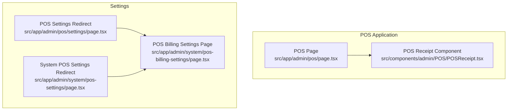
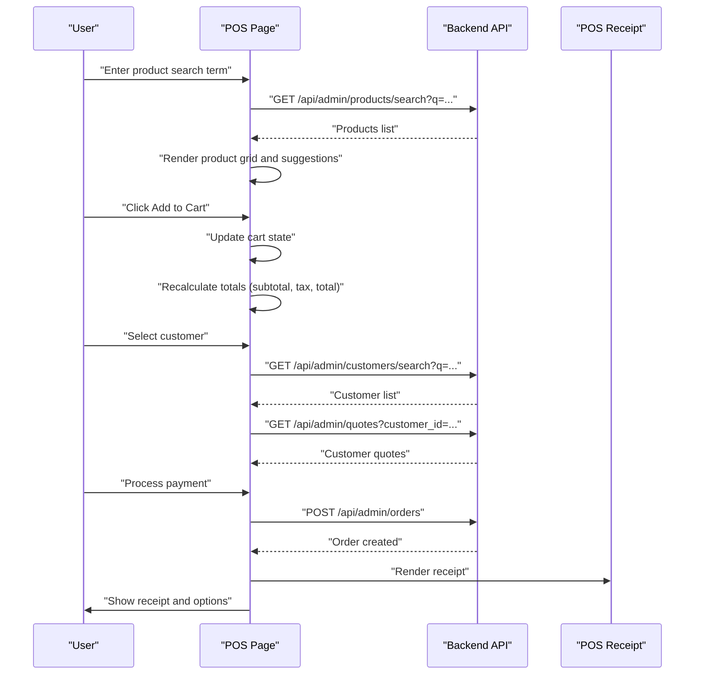
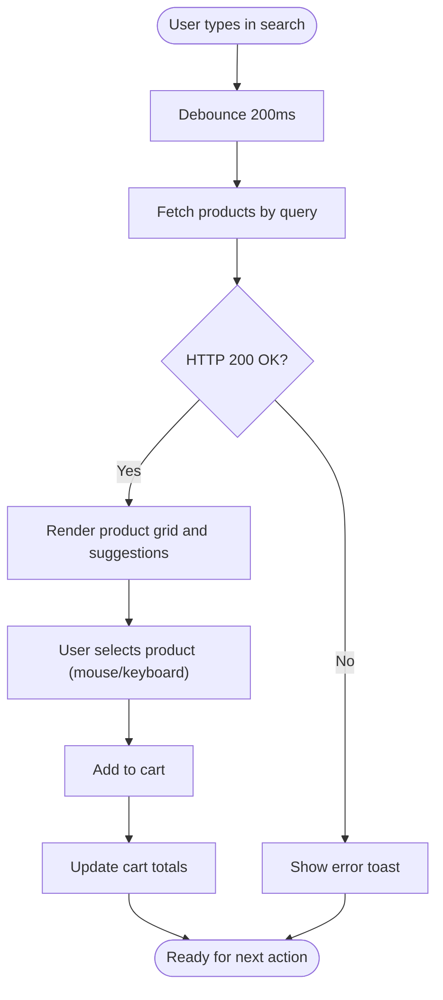
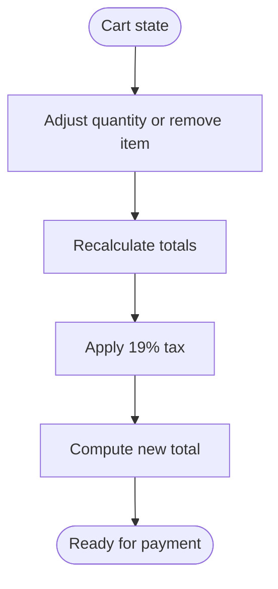
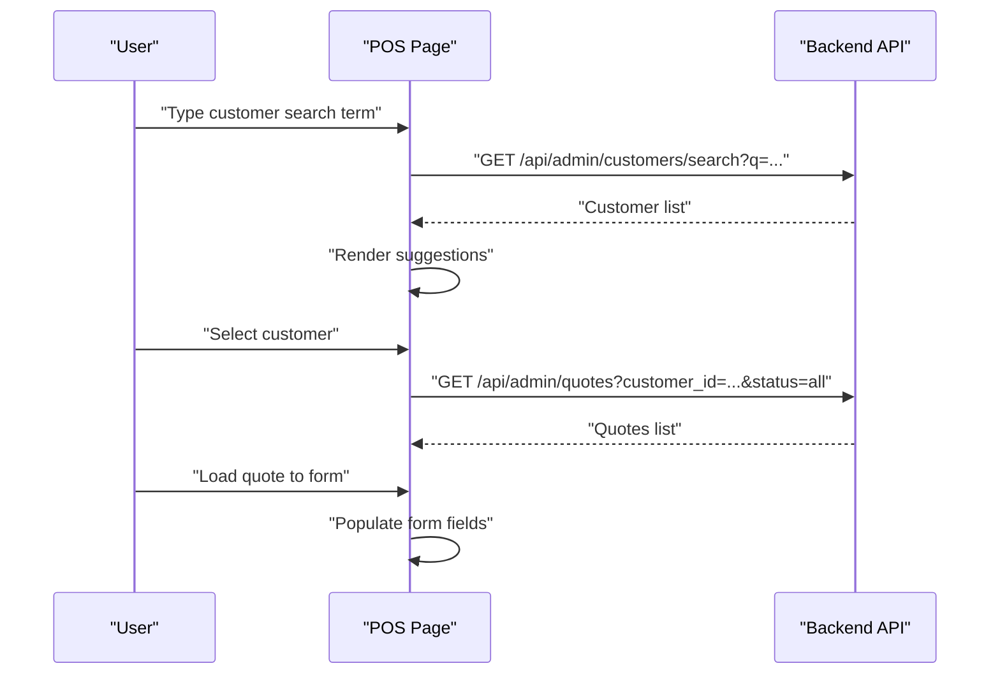
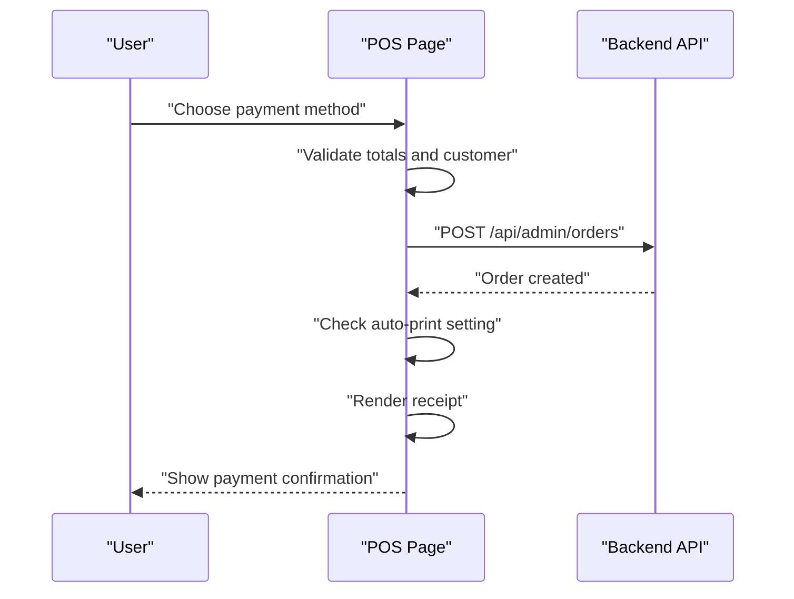
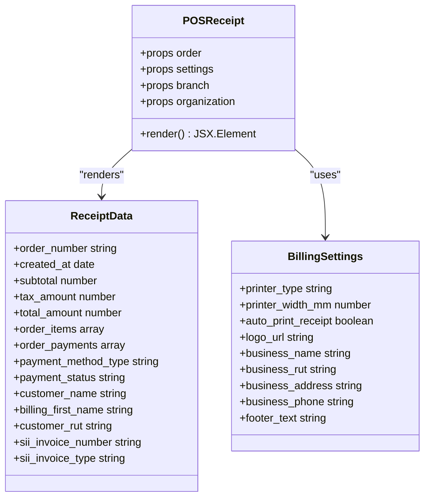
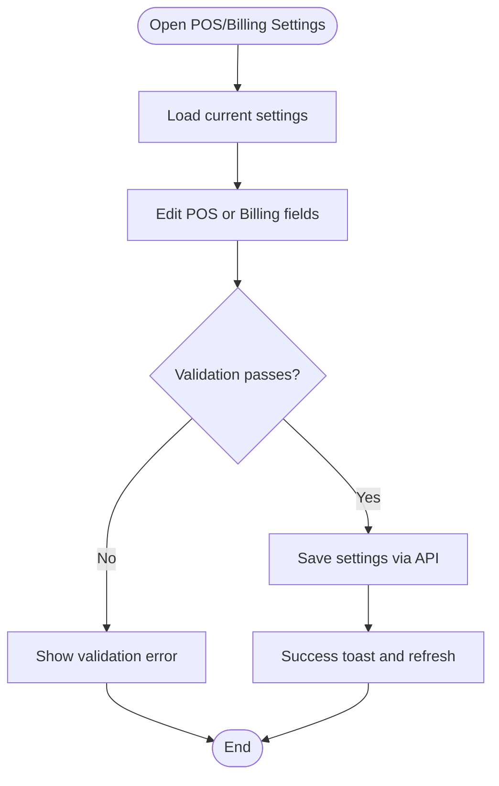
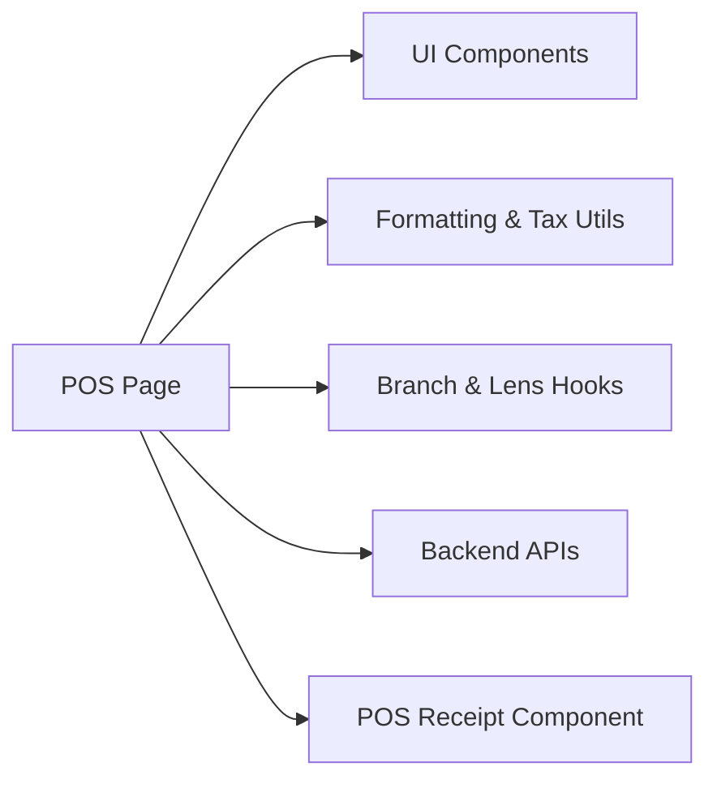

# POS Interface & User Experience

<cite>
**Referenced Files in This Document**
- [POS Page](file://src/app/admin/pos/page.tsx)
- [POS Receipt Component](file://src/components/admin/POS/POSReceipt.tsx)
- [POS Settings Redirect](file://src/app/admin/pos/settings/page.tsx)
- [POS Settings Redirect (System)](file://src/app/admin/system/pos-settings/page.tsx)
- [POS Billing Settings Page](file://src/app/admin/system/pos-billing-settings/page.tsx)
</cite>

## Table of Contents

1. [Introduction](#introduction)
2. [Project Structure](#project-structure)
3. [Core Components](#core-components)
4. [Architecture Overview](#architecture-overview)
5. [Detailed Component Analysis](#detailed-component-analysis)
6. [Dependency Analysis](#dependency-analysis)
7. [Performance Considerations](#performance-considerations)
8. [Troubleshooting Guide](#troubleshooting-guide)
9. [Conclusion](#conclusion)
10. [Appendices](#appendices)

## Introduction

This document describes the Point of Sale (POS) interface and user experience in Opttius. It covers the main POS screen layout, product search, cart management, customer selection, payment processing, receipt printing, and POS settings configuration. It also documents the POS receipt component, keyboard shortcuts, touch-friendly controls, accessibility features, and POS-specific UI patterns such as quantity adjustment, item removal, and real-time price updates. Finally, it provides examples of POS workflow scenarios and user interaction patterns.

## Project Structure

The POS functionality is implemented as a client-side Next.js page with supporting UI components and settings pages:

- POS main page: handles product search, cart, customer lookup, payment processing, and printing
- POS receipt component: renders printable receipts with invoice formatting and printer integration
- Settings pages: redirect legacy routes and expose POS/Billing configuration

**Diagram sources**

- [POS Page](file://src/app/admin/pos/page.tsx#L1-L800)
- [POS Receipt Component](file://src/components/admin/POS/POSReceipt.tsx#L1-L211)
- [POS Settings Redirect](file://src/app/admin/pos/settings/page.tsx#L1-L23)
- [POS Settings Redirect (System)](file://src/app/admin/system/pos-settings/page.tsx#L1-L23)
- [POS Billing Settings Page](file://src/app/admin/system/pos-billing-settings/page.tsx#L1-L800)

**Section sources**

- [POS Page](file://src/app/admin/pos/page.tsx#L1-L800)
- [POS Receipt Component](file://src/components/admin/POS/POSReceipt.tsx#L1-L211)
- [POS Settings Redirect](file://src/app/admin/pos/settings/page.tsx#L1-L23)
- [POS Settings Redirect (System)](file://src/app/admin/system/pos-settings/page.tsx#L1-L23)
- [POS Billing Settings Page](file://src/app/admin/system/pos-billing-settings/page.tsx#L1-L800)

## Core Components

- POS Page: orchestrates product search, cart management, customer selection, payment processing, and printing
- POS Receipt Component: renders receipts with invoice formatting, tax calculations, and printer integration
- Settings Pages: configure POS deposit minimums and billing/printing preferences

Key responsibilities:

- Product search and selection with keyboard navigation and suggestions
- Cart operations: add/remove items, adjust quantities, apply discounts
- Customer lookup with intelligent search and cross-branch quote retrieval
- Payment processing: cash, card, transfer with partial payments and pending balances
- Receipt generation and printing with configurable printer types and sizes

**Section sources**

- [POS Page](file://src/app/admin/pos/page.tsx#L148-L800)
- [POS Receipt Component](file://src/components/admin/POS/POSReceipt.tsx#L14-L211)
- [POS Billing Settings Page](file://src/app/admin/system/pos-billing-settings/page.tsx#L69-L800)

## Architecture Overview

The POS UI is a single-page application built with React and Next.js. It integrates with backend APIs for:

- Product search and inventory
- Customer search and quote retrieval
- Cash register status checks
- Billing and POS settings persistence
- Order creation and payment processing

**Diagram sources**

- [POS Page](file://src/app/admin/pos/page.tsx#L495-L600)
- [POS Receipt Component](file://src/components/admin/POS/POSReceipt.tsx#L14-L211)

## Detailed Component Analysis

### POS Main Screen Layout

The POS page organizes the interface into distinct functional areas:

- Top toolbar: branch selector, focusable search input, quick actions
- Left column: product grid and search suggestions
- Center column: cart summary and totals
- Right column: customer lookup, payment options, and action buttons
- Bottom area: pending balance management and quote loading

UI patterns:

- Real-time price updates as users adjust quantities or apply discounts
- Keyboard navigation for product and customer suggestion lists
- Touch-friendly controls with large buttons and swipe gestures
- Accessibility: ARIA labels, focus management, and keyboard shortcuts

**Section sources**

- [POS Page](file://src/app/admin/pos/page.tsx#L148-L800)

### Product Search and Selection

Implementation highlights:

- Debounced search with intelligent filtering by name, SKU, and barcode
- On-screen suggestions with arrow-key navigation and Enter selection
- Product grid with image, name, price, and stock indicators
- Quick-add via click or keyboard Enter

**Diagram sources**

- [POS Page](file://src/app/admin/pos/page.tsx#L156-L194)
- [POS Page](file://src/app/admin/pos/page.tsx#L500-L555)

**Section sources**

- [POS Page](file://src/app/admin/pos/page.tsx#L156-L194)
- [POS Page](file://src/app/admin/pos/page.tsx#L500-L555)

### Cart Management

Core capabilities:

- Quantity adjustment with increment/decrement buttons
- Item removal with confirmation
- Discount application (percentage or fixed amount)
- Real-time recalculation of subtotal, tax (19%), and total
- Change calculation for cash payments

**Diagram sources**

- [POS Page](file://src/app/admin/pos/page.tsx#L415-L425)

**Section sources**

- [POS Page](file://src/app/admin/pos/page.tsx#L415-L425)

### Customer Selection and Quote Loading

Features:

- Intelligent customer search (name, email, RUT)
- Cross-branch quote retrieval by RUT/email
- Load quote into form for review and modification before cart addition
- External customer and prescription creation for walk-ins

**Diagram sources**

- [POS Page](file://src/app/admin/pos/page.tsx#L500-L600)

**Section sources**

- [POS Page](file://src/app/admin/pos/page.tsx#L500-L600)

### Payment Processing

Supported methods:

- Cash (with optional partial payment)
- Debit/Credit cards
- Transfer

Workflow:

- Select payment method and enter cash received (if applicable)
- Process payment via API
- Handle partial payments and pending balances
- Auto-print receipt based on settings

**Diagram sources**

- [POS Page](file://src/app/admin/pos/page.tsx#L162-L190)
- [POS Page](file://src/app/admin/pos/page.tsx#L426-L460)

**Section sources**

- [POS Page](file://src/app/admin/pos/page.tsx#L162-L190)
- [POS Page](file://src/app/admin/pos/page.tsx#L426-L460)

### Receipt Printing and POS Receipt Component

The POS receipt component renders printable receipts with:

- Business branding (logo, name, RUT, address, phone)
- Order details (order number, date, invoice type)
- Customer information (if available)
- Items table with product name, quantity, unit price, and total price
- Tax breakdown (subtotal, IVA 19%, total)
- Payment methods and amounts
- Pending balance display for partial payments
- Footer with closing message and cut line for thermal printers

Printer integration:

- Supports thermal (80mm default), A4, Letter, and custom sizes
- Auto-print toggle in billing settings
- Responsive monospace font for consistent thermal printing

**Diagram sources**

- [POS Receipt Component](file://src/components/admin/POS/POSReceipt.tsx#L7-L211)

**Section sources**

- [POS Receipt Component](file://src/components/admin/POS/POSReceipt.tsx#L14-L211)

### POS Settings Configuration

POS settings:

- Minimum deposit percentage and fixed amount for orders
- Global vs branch-scoped configuration with confirmation prompts

Billing/printing settings:

- Business information (name, RUT, address, phone, email)
- Document customization (logo, header/footer text, terms and conditions)
- Default document type (boleta/factura)
- Printer type and dimensions (thermal, A4, Letter, custom)
- Auto-print receipt toggle

**Diagram sources**

- [POS Billing Settings Page](file://src/app/admin/system/pos-billing-settings/page.tsx#L114-L161)
- [POS Billing Settings Page](file://src/app/admin/system/pos-billing-settings/page.tsx#L163-L265)

**Section sources**

- [POS Billing Settings Page](file://src/app/admin/system/pos-billing-settings/page.tsx#L69-L800)
- [POS Settings Redirect](file://src/app/admin/pos/settings/page.tsx#L1-L23)
- [POS Settings Redirect (System)](file://src/app/admin/system/pos-settings/page.tsx#L1-L23)

## Dependency Analysis

The POS page depends on:

- UI primitives (cards, inputs, buttons, dialogs, tabs, tables)
- Utility functions for currency/date formatting and tax calculations
- Hooks for branch context and lens price calculation
- Backend APIs for products, customers, quotes, cash register, and billing settings

**Diagram sources**

- [POS Page](file://src/app/admin/pos/page.tsx#L1-L100)
- [POS Receipt Component](file://src/components/admin/POS/POSReceipt.tsx#L1-L12)

**Section sources**

- [POS Page](file://src/app/admin/pos/page.tsx#L1-L100)

## Performance Considerations

- Debounced search reduces API calls during typing
- Efficient cart updates with immutable state patterns
- Conditional rendering for modals and dialogs to minimize DOM
- Lazy loading of quote and customer data on demand
- Printer width/height defaults avoid unnecessary recalculations

## Troubleshooting Guide

Common issues and resolutions:

- Cash register status not updating: verify branch selection and network connectivity; the POS page polls every 30 seconds
- Customer search returns empty: ensure search term length and network availability; check toast messages for errors
- Receipt not printing: confirm auto-print setting and printer type; verify printer connectivity
- Partial payments not reflected: ensure payment method supports partial amounts and pending balance is recorded

**Section sources**

- [POS Page](file://src/app/admin/pos/page.tsx#L426-L460)
- [POS Page](file://src/app/admin/pos/page.tsx#L500-L555)
- [POS Billing Settings Page](file://src/app/admin/system/pos-billing-settings/page.tsx#L614-L623)

## Conclusion

The Opttius POS interface provides a comprehensive, real-time sales experience with robust product search, cart management, customer lookup, and payment processing. Its receipt component ensures accurate invoicing with configurable printer settings, while the settings pages enable flexible POS and billing customization. The UI emphasizes accessibility, touch-friendliness, and responsive feedback to streamline daily operations.

## Appendices

### Keyboard Shortcuts and Accessibility

- Focus management: search inputs receive focus on page load
- Keyboard navigation: arrow keys navigate suggestions; Enter selects items
- ARIA roles and labels: ensure compatibility with assistive technologies
- High contrast and readable fonts: improve visibility for extended use

**Section sources**

- [POS Page](file://src/app/admin/pos/page.tsx#L495-L498)
- [POS Page](file://src/app/admin/pos/page.tsx#L500-L555)

### POS Workflow Scenarios

- Walk-in sale: search product, add to cart, select customer (optional), process payment, print receipt
- Quote-to-sale: load quote from URL, review and adjust items, select customer, process payment, print receipt
- Partial payment: enter cash received, record partial payment, manage pending balance dialog, finalize later

**Section sources**

- [POS Page](file://src/app/admin/pos/page.tsx#L364-L413)
- [POS Page](file://src/app/admin/pos/page.tsx#L162-L190)
- [POS Page](file://src/app/admin/pos/page.tsx#L180-L190)
