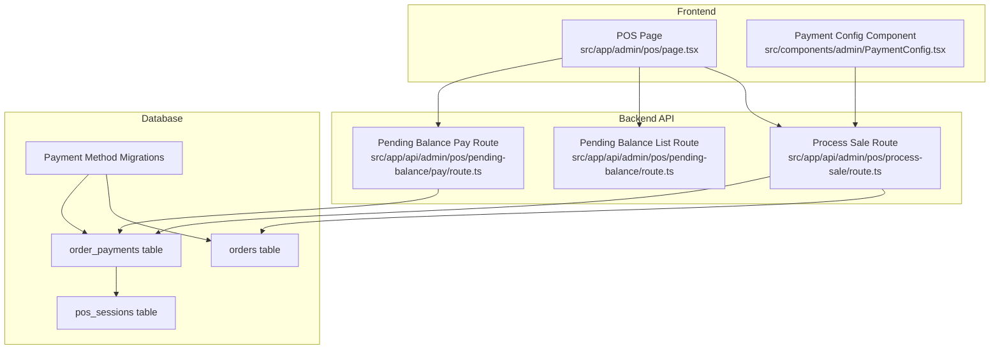
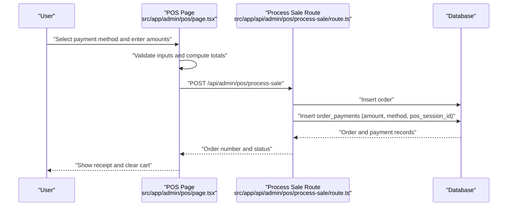
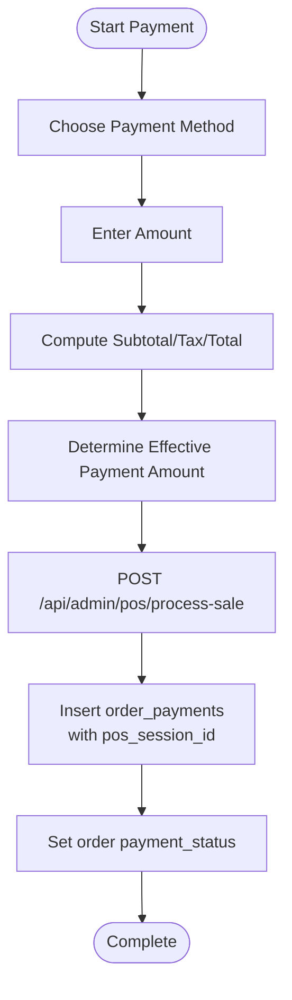
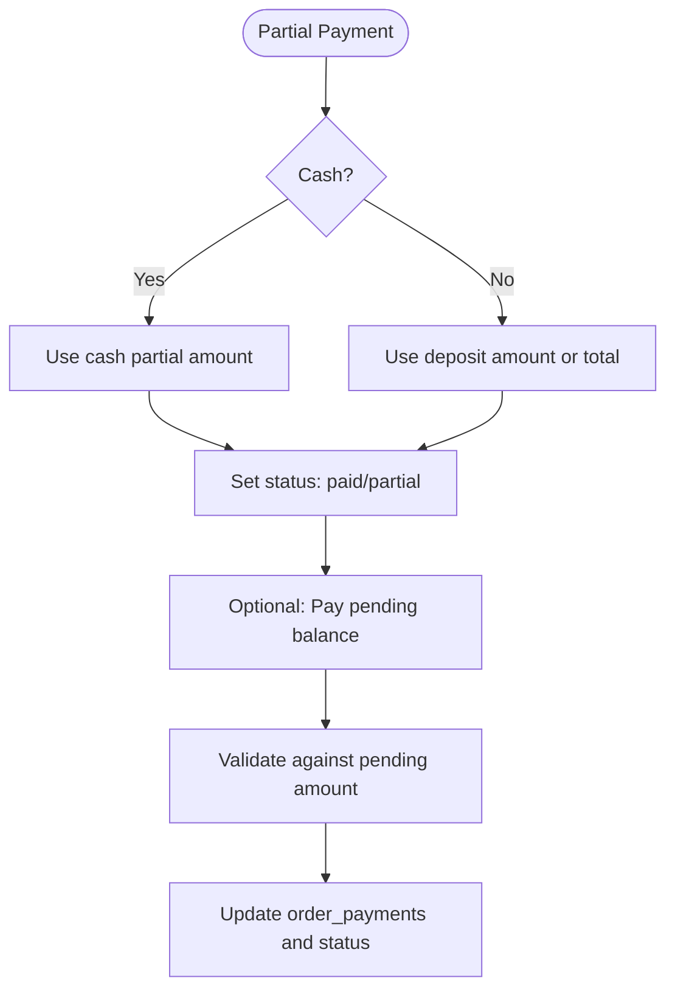
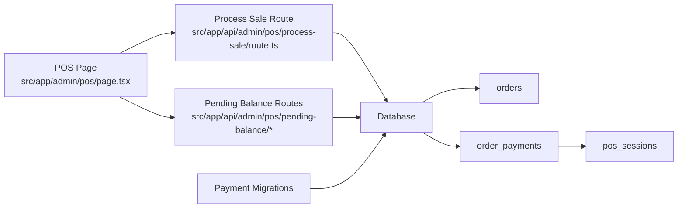

# Payment Processing & Methods

<cite>
**Referenced Files in This Document**
- [POS Page](file://src/app/admin/pos/page.tsx)
- [Payment Types](file://src/types/payment.ts)
- [MercadoPago Stub](file://src/lib/mercadopago.ts)
- [Payment Config Component](file://src/components/admin/PaymentConfig.tsx)
- [Process Sale Route](file://src/app/api/admin/pos/process-sale/route.ts)
- [Pending Balance Pay Route](file://src/app/api/admin/pos/pending-balance/pay/route.ts)
- [Pending Balance Orders Route](file://src/app/api/admin/pos/pending-balance/route.ts)
- [Cash Register Page](file://src/app/admin/cash-register/page.tsx)
- [Order Payments Migration](file://supabase/migrations/20260122000009_update_payment_methods_and_add_session.sql)
- [Order Payments Migration v2](file://supabase/migrations/20250130000000_update_payment_methods_and_add_session.sql)
- [Orders Deposit Migration](file://supabase/migrations/20260127000001_update_orders_payment_method_type_for_deposit.sql)
</cite>

## Table of Contents

1. [Introduction](#introduction)
2. [Project Structure](#project-structure)
3. [Core Components](#core-components)
4. [Architecture Overview](#architecture-overview)
5. [Detailed Component Analysis](#detailed-component-analysis)
6. [Dependency Analysis](#dependency-analysis)
7. [Performance Considerations](#performance-considerations)
8. [Troubleshooting Guide](#troubleshooting-guide)
9. [Conclusion](#conclusion)

## Introduction

This document explains the payment processing system within the POS interface, covering supported payment methods, transaction flow, partial payments, integration points, validation logic, amount calculation, change determination, POS-specific features (split payments, modifications, voids), security and PCI considerations, and transaction logging. It synthesizes frontend UI logic, backend API routes, and database migrations to present a complete picture of how payments are processed end-to-end.

## Project Structure

The payment system spans three main areas:

- Frontend POS page orchestrating user interactions, validations, and API calls
- Backend API routes handling order creation, payment registration, and pending balance payments
- Database migrations ensuring payment method constraints and POS session tracking

**Diagram sources**

- [POS Page](file://src/app/admin/pos/page.tsx#L2746-L2750)
- [Process Sale Route](file://src/app/api/admin/pos/process-sale/route.ts#L711-L734)
- [Pending Balance Pay Route](file://src/app/api/admin/pos/pending-balance/pay/route.ts#L129-L141)
- [Order Payments Migration](file://supabase/migrations/20260122000009_update_payment_methods_and_add_session.sql#L38-L49)

**Section sources**

- [POS Page](file://src/app/admin/pos/page.tsx#L2888-L2941)
- [Process Sale Route](file://src/app/api/admin/pos/process-sale/route.ts#L703-L734)
- [Pending Balance Pay Route](file://src/app/api/admin/pos/pending-balance/pay/route.ts#L83-L163)

## Core Components

- Payment methods supported in the POS UI: cash, debit card, credit card, and transfer. The backend also recognizes "card" as a generic card method and "deposit" as a legacy partial payment method type.
- Amount calculation and change determination:
  - Subtotal, tax, and total computed from cart items and tax percentage.
  - Change calculated only for cash full payments; partial cash payments do not compute change.
- Partial payment handling:
  - Supports partial payments via cash received, cash partial amount, or deposit amount depending on method.
  - Final payment status determined as paid, partial, or pending based on amounts.
- Pending balance collection:
  - Dedicated endpoint to pay outstanding balances on existing orders with validation and POS session association.
- POS session tracking:
  - Payments are associated with the current POS session for auditability and reconciliation.

**Section sources**

- [POS Page](file://src/app/admin/pos/page.tsx#L415-L425)
- [POS Page](file://src/app/admin/pos/page.tsx#L2537-L2561)
- [POS Page](file://src/app/admin/pos/page.tsx#L2746-L2750)
- [Process Sale Route](file://src/app/api/admin/pos/process-sale/route.ts#L711-L734)
- [Pending Balance Pay Route](file://src/app/api/admin/pos/pending-balance/pay/route.ts#L83-L163)
- [Order Payments Migration](file://supabase/migrations/20260122000009_update_payment_methods_and_add_session.sql#L38-L49)

## Architecture Overview

The payment flow begins in the POS UI, validates inputs, constructs an order payload, and posts it to the backend. The backend creates the order and registers payments, associating them with the current POS session. For partial payments, the system updates order payment status accordingly.

**Diagram sources**

- [POS Page](file://src/app/admin/pos/page.tsx#L2746-L2750)
- [Process Sale Route](file://src/app/api/admin/pos/process-sale/route.ts#L711-L734)

**Section sources**

- [POS Page](file://src/app/admin/pos/page.tsx#L2537-L2561)
- [Process Sale Route](file://src/app/api/admin/pos/process-sale/route.ts#L703-L734)

## Detailed Component Analysis

### Supported Payment Methods

- Cash: Full or partial cash payments; change computed only for full cash payments.
- Debit Card: Partial or full card payments; supports deposit amount override.
- Credit Card: Partial or full card payments; supports deposit amount override.
- Transfer: Partial or full transfer payments; deposit amount used when applicable.
- Generic Card: Recognized as "card" in backend mapping.
- Legacy Deposit: Migrated to "transfer" in database constraints.

**Section sources**

- [POS Page](file://src/app/admin/pos/page.tsx#L146-L166)
- [POS Page](file://src/app/admin/pos/page.tsx#L2541-L2561)
- [Process Sale Route](file://src/app/api/admin/pos/process-sale/route.ts#L714-L722)
- [Order Payments Migration v2](file://supabase/migrations/20250130000000_update_payment_methods_and_add_session.sql#L22-L28)
- [Order Payments Migration](file://supabase/migrations/20260122000009_update_payment_methods_and_add_session.sql#L13-L18)

### Payment Flow: Amount Entry to Transaction Completion

- Amount determination:
  - Cash: Uses cash received or cash partial amount.
  - Transfer/Debit/Credit: Uses deposit amount if provided; otherwise total.
- Payment status:
  - Paid if payment amount covers total.
  - Partial if payment amount is less than total.
- Order creation:
  - POST to /api/admin/pos/process-sale with cart items, customer info, and payment details.
- Payment registration:
  - Backend inserts order_payments with mapped method ("cash", "debit", "credit", "transfer", "card").
  - Associates payment with current POS session if available.

**Diagram sources**

- [POS Page](file://src/app/admin/pos/page.tsx#L2537-L2561)
- [POS Page](file://src/app/admin/pos/page.tsx#L2746-L2750)
- [Process Sale Route](file://src/app/api/admin/pos/process-sale/route.ts#L711-L734)

**Section sources**

- [POS Page](file://src/app/admin/pos/page.tsx#L2537-L2561)
- [POS Page](file://src/app/admin/pos/page.tsx#L2746-L2750)
- [Process Sale Route](file://src/app/api/admin/pos/process-sale/route.ts#L711-L734)

### Partial Payment Handling

- Cash partial:
  - Uses cash partial amount; change not computed.
- Transfer/debit/credit partial:
  - Uses deposit amount; falls back to total if deposit amount is zero.
- Pending balance:
  - Separate endpoint to pay outstanding balances on existing orders.
  - Validates payment amount against pending balance and updates order status.

**Diagram sources**

- [POS Page](file://src/app/admin/pos/page.tsx#L2541-L2561)
- [Pending Balance Pay Route](file://src/app/api/admin/pos/pending-balance/pay/route.ts#L83-L163)

**Section sources**

- [POS Page](file://src/app/admin/pos/page.tsx#L2541-L2561)
- [Pending Balance Pay Route](file://src/app/api/admin/pos/pending-balance/pay/route.ts#L83-L163)

### Integration with External Payment Processors

- The codebase includes a stub for MercadoPago integration. While the stub exports empty objects, the POS supports "mercadopago" as a payment gateway type in global payment types and the backend route maps "card" to "card" for generic card payments.
- For actual processor integrations, the POS UI would need to integrate with the chosen gateway (e.g., redirect flows, hosted fields, or SDKs), and the backend would need to accept and process the corresponding payment events.

**Section sources**

- [MercadoPago Stub](file://src/lib/mercadopago.ts#L1-L21)
- [Payment Types](file://src/types/payment.ts#L10-L10)
- [Process Sale Route](file://src/app/api/admin/pos/process-sale/route.ts#L714-L722)

### Implementation Details: Validation, Calculation, and Change

- Validation:
  - Cash received must be sufficient for full payment; partial cash sets status accordingly.
  - Transfer/debit/credit payments use deposit amount if provided.
- Amount calculation:
  - Subtotal, tax, and total derived from cart items and tax percentage.
- Change determination:
  - Only computed for cash full payments; partial cash payments do not compute change.

**Section sources**

- [POS Page](file://src/app/admin/pos/page.tsx#L415-L425)
- [POS Page](file://src/app/admin/pos/page.tsx#L2541-L2561)

### POS-Specific Features

- Split payments:
  - Implemented via deposit amount for card, transfer, and cash methods; partial cash handled separately.
- Payment modifications:
  - Pending balance payments allow adding further payments to existing orders.
- Void transactions:
  - Not implemented in the referenced code; voiding would require backend support to reverse payments and adjust order status.

**Section sources**

- [POS Page](file://src/app/admin/pos/page.tsx#L164-L166)
- [POS Page](file://src/app/admin/pos/page.tsx#L2551-L2561)
- [Pending Balance Pay Route](file://src/app/api/admin/pos/pending-balance/pay/route.ts#L129-L141)

### Security Considerations and PCI Compliance

- PCI DSS compliance typically requires avoiding card data on application servers. Recommended practices:
  - Use secure payment gateways with PCI-compliant SDKs or hosted fields.
  - Never log sensitive card data; mask logs and sanitize inputs.
  - Enforce HTTPS and secure cookies; validate and sanitize all inputs.
  - Limit stored data to minimal necessary fields (e.g., masked PAN, expiry, CVV not stored).
  - Implement role-based access controls and audit trails for payment operations.
- The POS currently stores payment method types and amounts; ensure sensitive data is handled by the gateway and not persisted in raw form.

[No sources needed since this section provides general guidance]

### Transaction Logging

- Backend routes log errors and return structured error responses for failed operations.
- Payment records include payment method, amount, POS session association, and creator metadata for auditability.

**Section sources**

- [Process Sale Route](file://src/app/api/admin/pos/process-sale/route.ts#L703-L709)
- [Pending Balance Pay Route](file://src/app/api/admin/pos/pending-balance/pay/route.ts#L143-L152)

## Dependency Analysis

The payment system depends on:

- POS UI for user input and order construction
- Backend routes for order creation and payment registration
- Database for storing orders, payments, and POS sessions
- Migrations for payment method constraints and POS session tracking

**Diagram sources**

- [POS Page](file://src/app/admin/pos/page.tsx#L2746-L2750)
- [Process Sale Route](file://src/app/api/admin/pos/process-sale/route.ts#L711-L734)
- [Pending Balance Pay Route](file://src/app/api/admin/pos/pending-balance/pay/route.ts#L129-L141)
- [Order Payments Migration](file://supabase/migrations/20260122000009_update_payment_methods_and_add_session.sql#L38-L49)

**Section sources**

- [POS Page](file://src/app/admin/pos/page.tsx#L2746-L2750)
- [Process Sale Route](file://src/app/api/admin/pos/process-sale/route.ts#L711-L734)
- [Pending Balance Pay Route](file://src/app/api/admin/pos/pending-balance/pay/route.ts#L129-L141)
- [Order Payments Migration](file://supabase/migrations/20260122000009_update_payment_methods_and_add_session.sql#L38-L49)

## Performance Considerations

- Debounced search for products and customers reduces unnecessary API calls.
- Efficient tax calculations based on cart items avoid repeated computations.
- POS session association enables fast querying of payments by session and date.

[No sources needed since this section provides general guidance]

## Troubleshooting Guide

Common issues and resolutions:

- Cash insufficient:
  - Ensure cash received meets or exceeds total; otherwise, partial payment status applies.
- Transfer/debit/credit amount mismatch:
  - Verify deposit amount; if zero, total is used automatically.
- Pending balance errors:
  - Confirm payment amount does not exceed pending balance; ensure a valid POS session is available.
- Payment method constraints:
  - Legacy "deposit" method migrated to "transfer"; ensure database constraints reflect the latest migration.

**Section sources**

- [POS Page](file://src/app/admin/pos/page.tsx#L2541-L2561)
- [Pending Balance Pay Route](file://src/app/api/admin/pos/pending-balance/pay/route.ts#L2844-L2849)
- [Order Payments Migration v2](file://supabase/migrations/20250130000000_update_payment_methods_and_add_session.sql#L17-L28)
- [Order Payments Migration](file://supabase/migrations/20260122000009_update_payment_methods_and_add_session.sql#L7-L18)

## Conclusion

The POS payment system integrates UI-driven payment entry with backend order and payment creation, supporting cash, debit card, credit card, and transfer methods. Partial payments are handled consistently across methods, and pending balances can be collected via a dedicated endpoint. POS session tracking ensures auditability. For production, integrate secure payment gateways, enforce PCI-compliant handling of sensitive data, and extend void capabilities as needed.
