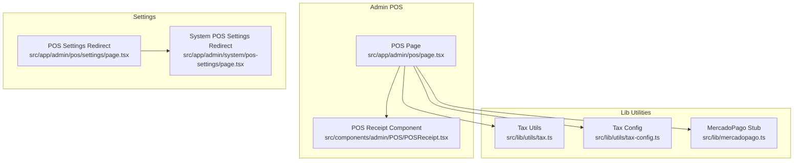
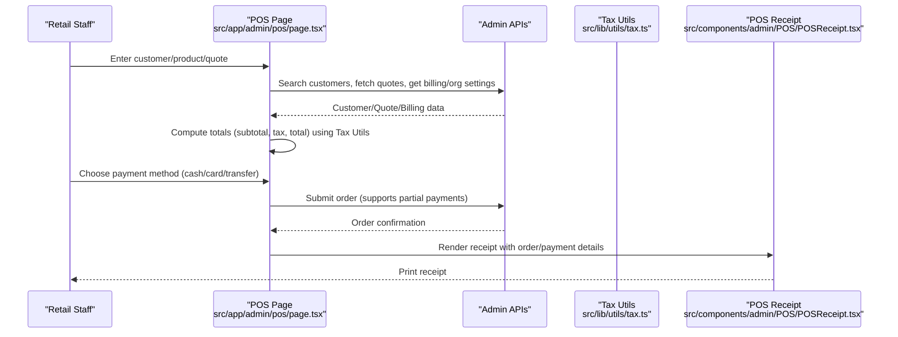
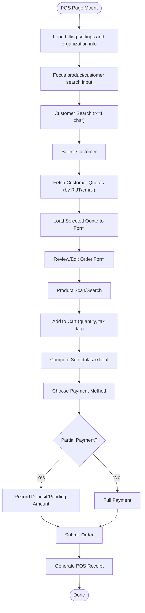
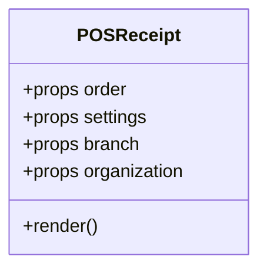
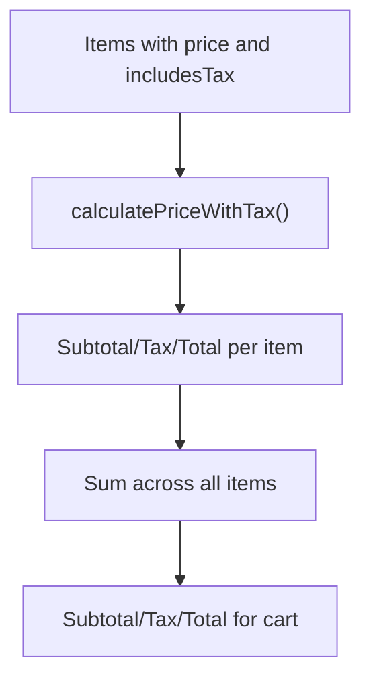
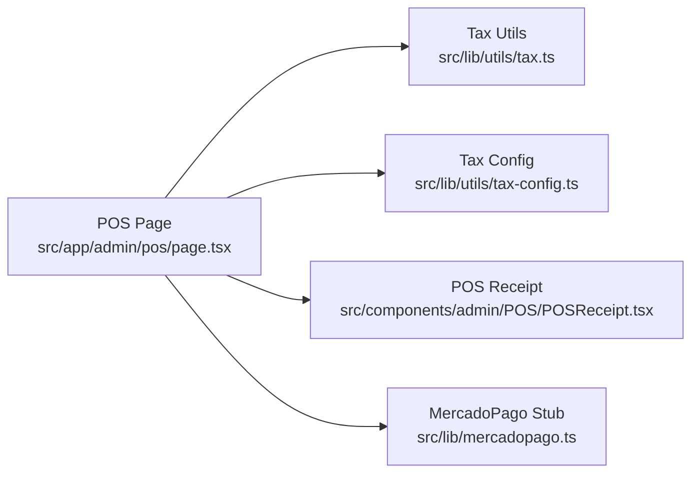

# Point of Sale (POS) System

<cite>
**Referenced Files in This Document**
- [page.tsx](file://src/app/admin/pos/page.tsx)
- [POSReceipt.tsx](file://src/components/admin/POS/POSReceipt.tsx)
- [tax.ts](file://src/lib/utils/tax.ts)
- [tax-config.ts](file://src/lib/utils/tax-config.ts)
- [mercadopago.ts](file://src/lib/mercadopago.ts)
- [page.tsx](file://src/app/admin/pos/settings/page.tsx)
- [page.tsx](file://src/app/admin/system/pos-settings/page.tsx)
</cite>

## Table of Contents

1. [Introduction](#introduction)
2. [Project Structure](#project-structure)
3. [Core Components](#core-components)
4. [Architecture Overview](#architecture-overview)
5. [Detailed Component Analysis](#detailed-component-analysis)
6. [Dependency Analysis](#dependency-analysis)
7. [Performance Considerations](#performance-considerations)
8. [Troubleshooting Guide](#troubleshooting-guide)
9. [Conclusion](#conclusion)
10. [Appendices](#appendices)

## Introduction

This document explains the integrated POS system in Opttius, covering the complete point-of-sale workflow: customer lookup, product scanning, quote loading, payment processing, and receipt generation. It documents the POS interface, inventory integration, real-time price calculations, configuration options for tax handling and discounts, and relationships with customer profiles, inventory systems, and accounting modules. It also addresses POS-specific features such as partial payments, order modifications, and return processing, balancing accessibility for retail staff with technical implementation details for developers.

## Project Structure

The POS system is primarily implemented in:

- Admin POS page: interactive checkout interface, cart management, customer and quote integration, payment orchestration, and totals computation.
- POS receipt component: printable receipt rendering with configurable printer settings.
- Tax utilities: tax-inclusive/exclusive price calculations and dynamic tax percentage retrieval.
- Payment gateway stubs: MercadoPago integration placeholders for future implementation.
- POS settings redirects: legacy routes redirecting to the new billing settings location.

**Diagram sources**

- [page.tsx](file://src/app/admin/pos/page.tsx#L148-L800)
- [POSReceipt.tsx](file://src/components/admin/POS/POSReceipt.tsx#L14-L211)
- [tax.ts](file://src/lib/utils/tax.ts#L1-L95)
- [tax-config.ts](file://src/lib/utils/tax-config.ts#L1-L92)
- [mercadopago.ts](file://src/lib/mercadopago.ts#L1-L21)
- [page.tsx](file://src/app/admin/pos/settings/page.tsx#L1-L23)
- [page.tsx](file://src/app/admin/system/pos-settings/page.tsx#L1-L23)

**Section sources**

- [page.tsx](file://src/app/admin/pos/page.tsx#L148-L800)
- [POSReceipt.tsx](file://src/components/admin/POS/POSReceipt.tsx#L14-L211)
- [tax.ts](file://src/lib/utils/tax.ts#L1-L95)
- [tax-config.ts](file://src/lib/utils/tax-config.ts#L1-L92)
- [mercadopago.ts](file://src/lib/mercadopago.ts#L1-L21)
- [page.tsx](file://src/app/admin/pos/settings/page.tsx#L1-L23)
- [page.tsx](file://src/app/admin/system/pos-settings/page.tsx#L1-L23)

## Core Components

- POS Page (checkout interface):
  - Manages customer search and selection, product search and cart, quote loading, discount application, payment methods, partial payments, and order submission.
  - Integrates with billing settings, organization data, and branch context.
  - Computes tax-inclusive and tax-exclusive totals using utility functions.
- POS Receipt Component:
  - Renders receipts with configurable printer type and width, including customer, items, taxes, totals, and payment history.
- Tax Utilities:
  - Provides functions to compute subtotal, tax, and total amounts for mixed tax-inclusive/exclusive items.
  - Retrieves dynamic tax percentage from system configuration.
- Payment Gateway Stubs:
  - Includes MercadoPago labels and stub exports for future integration.
- POS Settings Redirects:
  - Legacy routes redirect to the new billing settings location under “System”.

**Section sources**

- [page.tsx](file://src/app/admin/pos/page.tsx#L91-L348)
- [POSReceipt.tsx](file://src/components/admin/POS/POSReceipt.tsx#L7-L12)
- [tax.ts](file://src/lib/utils/tax.ts#L13-L94)
- [tax-config.ts](file://src/lib/utils/tax-config.ts#L12-L45)
- [mercadopago.ts](file://src/lib/mercadopago.ts#L4-L21)
- [page.tsx](file://src/app/admin/pos/settings/page.tsx#L10-L22)
- [page.tsx](file://src/app/admin/system/pos-settings/page.tsx#L10-L22)

## Architecture Overview

The POS workflow integrates UI state management, API-driven data fetching, and client-side tax calculations. The POS page orchestrates:

- Customer lookup via search API.
- Quote loading and form population for order creation.
- Real-time cart updates and totals computation.
- Payment method selection and partial payment handling.
- Receipt generation and printing.

**Diagram sources**

- [page.tsx](file://src/app/admin/pos/page.tsx#L426-L493)
- [tax.ts](file://src/lib/utils/tax.ts#L46-L94)
- [POSReceipt.tsx](file://src/components/admin/POS/POSReceipt.tsx#L14-L211)

## Detailed Component Analysis

### POS Page: Checkout Workflow

Key responsibilities:

- Customer lookup and selection with intelligent search and cross-branch quote retrieval.
- Quote loading from URL parameters into the order form for review and modification prior to purchase.
- Cart management with per-item quantities and tax inclusion flags.
- Real-time totals computation using tax utilities.
- Payment method selection and partial payment handling (including cash partial).
- Order submission and receipt generation.

**Diagram sources**

- [page.tsx](file://src/app/admin/pos/page.tsx#L462-L493)
- [page.tsx](file://src/app/admin/pos/page.tsx#L500-L555)
- [page.tsx](file://src/app/admin/pos/page.tsx#L557-L600)
- [page.tsx](file://src/app/admin/pos/page.tsx#L602-L800)
- [page.tsx](file://src/app/admin/pos/page.tsx#L415-L425)

**Section sources**

- [page.tsx](file://src/app/admin/pos/page.tsx#L148-L800)

### POS Receipt Component: Printing and Rendering

Responsibilities:

- Renders receipts with configurable printer type and width.
- Displays organization and branch details, order metadata, customer info, items table, tax breakdown, totals, and payment history.
- Supports pending balance display for partial payments.

**Diagram sources**

- [POSReceipt.tsx](file://src/components/admin/POS/POSReceipt.tsx#L7-L12)

**Section sources**

- [POSReceipt.tsx](file://src/components/admin/POS/POSReceipt.tsx#L14-L211)

### Tax Calculation Utilities

Responsibilities:

- Compute price breakdown for individual items considering tax inclusion/exclusion.
- Aggregate totals across multiple items with mixed tax scenarios.
- Retrieve dynamic tax percentage from system configuration with fallback.

**Diagram sources**

- [tax.ts](file://src/lib/utils/tax.ts#L13-L38)
- [tax.ts](file://src/lib/utils/tax.ts#L46-L94)

**Section sources**

- [tax.ts](file://src/lib/utils/tax.ts#L1-L95)
- [tax-config.ts](file://src/lib/utils/tax-config.ts#L12-L45)

### Payment Gateway Integration

Current state:

- MercadoPago labels and stub exports are present for compatibility.
- Future implementation would integrate payment intents and callbacks.

**Section sources**

- [mercadopago.ts](file://src/lib/mercadopago.ts#L1-L21)

### POS Settings and Redirects

- Legacy POS settings routes redirect to the new billing settings location under “System”.
- Ensures backward compatibility while consolidating configuration.

**Section sources**

- [page.tsx](file://src/app/admin/pos/settings/page.tsx#L10-L22)
- [page.tsx](file://src/app/admin/system/pos-settings/page.tsx#L10-L22)

## Dependency Analysis

The POS page depends on:

- Tax utilities for accurate totals computation.
- Receipt component for printable output.
- System configuration for tax percentage retrieval.
- API endpoints for customer search, quote loading, billing settings, and organization data.

**Diagram sources**

- [page.tsx](file://src/app/admin/pos/page.tsx#L55-L64)
- [tax.ts](file://src/lib/utils/tax.ts#L1-L95)
- [tax-config.ts](file://src/lib/utils/tax-config.ts#L1-L92)
- [POSReceipt.tsx](file://src/components/admin/POS/POSReceipt.tsx#L1-L211)
- [mercadopago.ts](file://src/lib/mercadopago.ts#L1-L21)

**Section sources**

- [page.tsx](file://src/app/admin/pos/page.tsx#L55-L64)
- [tax.ts](file://src/lib/utils/tax.ts#L1-L95)
- [tax-config.ts](file://src/lib/utils/tax-config.ts#L1-L92)
- [POSReceipt.tsx](file://src/components/admin/POS/POSReceipt.tsx#L1-L211)
- [mercadopago.ts](file://src/lib/mercadopago.ts#L1-L21)

## Performance Considerations

- Debounced customer search reduces API calls during typing.
- Periodic cash register status polling avoids manual refresh.
- Efficient cart aggregation using mapped item arrays for totals computation.
- Receipt rendering optimized for minimal DOM and fixed monospace font for thermal printers.

[No sources needed since this section provides general guidance]

## Troubleshooting Guide

Common issues and resolutions:

- Customer search returns no results:
  - Verify network connectivity and that the search term meets minimum length requirements.
  - Confirm branch context and permissions.
- Quote fails to load:
  - Ensure the quote belongs to the current branch or matches the customer’s RUT/email.
  - Check for URL parameter correctness and API availability.
- Tax mismatch:
  - Confirm system configuration for tax percentage and product price inclusion flags.
- Partial payment discrepancies:
  - Review deposit amount and remaining balance logic; ensure order payment records reflect applied amounts.
- Receipt printing:
  - Validate printer type and width settings; ensure receipt component renders with correct props.

**Section sources**

- [page.tsx](file://src/app/admin/pos/page.tsx#L500-L555)
- [page.tsx](file://src/app/admin/pos/page.tsx#L557-L600)
- [page.tsx](file://src/app/admin/pos/page.tsx#L358-L361)
- [page.tsx](file://src/app/admin/pos/page.tsx#L426-L460)
- [POSReceipt.tsx](file://src/components/admin/POS/POSReceipt.tsx#L18-L31)

## Conclusion

The Opttius POS system provides a robust, extensible foundation for retail operations. It supports customer-centric workflows, flexible quote-to-cart conversion, real-time tax-aware totals, and configurable receipt printing. Developers can extend payment integrations, refine discount logic, and enhance inventory synchronization while maintaining a user-friendly interface for retail staff.

[No sources needed since this section summarizes without analyzing specific files]

## Appendices

### POS Workflow Reference

- Customer Lookup: Intelligent search with debounced requests and cross-branch quote retrieval.
- Product Scanning: Add/remove items, adjust quantities, and manage tax inclusion flags.
- Quote Loading: Load quotes into the order form for review and modification.
- Payment Processing: Cash, card, transfer, and partial payments with pending balances.
- Receipt Generation: Configurable printer settings and payment history display.

**Section sources**

- [page.tsx](file://src/app/admin/pos/page.tsx#L500-L555)
- [page.tsx](file://src/app/admin/pos/page.tsx#L602-L800)
- [page.tsx](file://src/app/admin/pos/page.tsx#L415-L425)
- [POSReceipt.tsx](file://src/components/admin/POS/POSReceipt.tsx#L14-L211)
