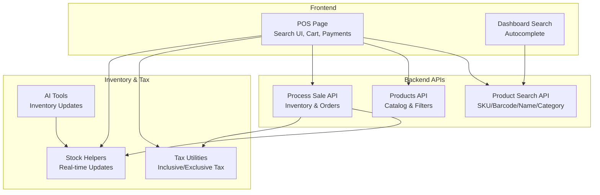
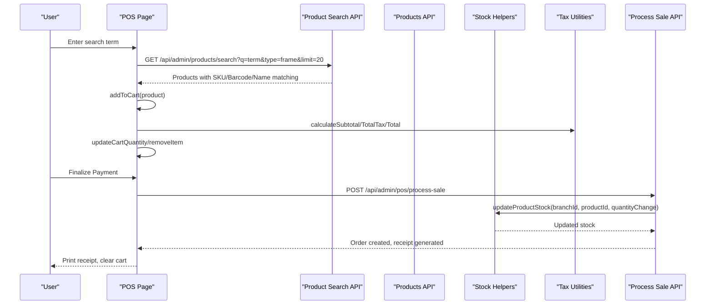
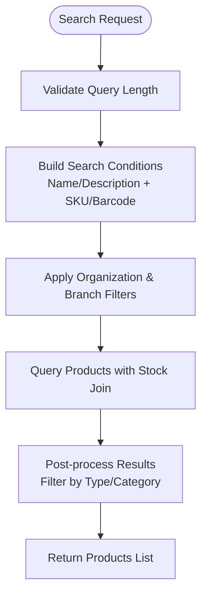
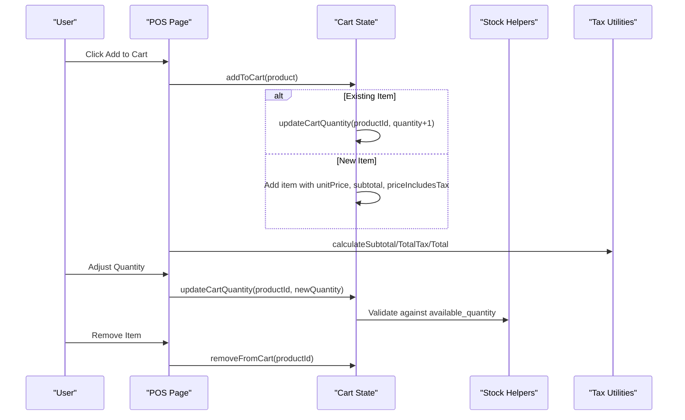
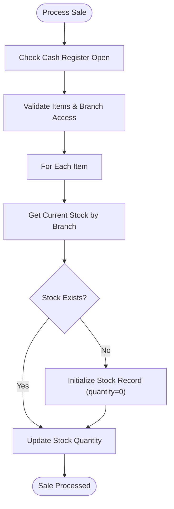
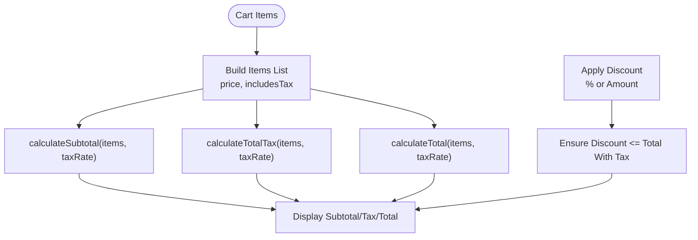
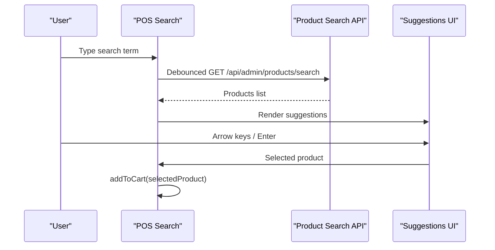
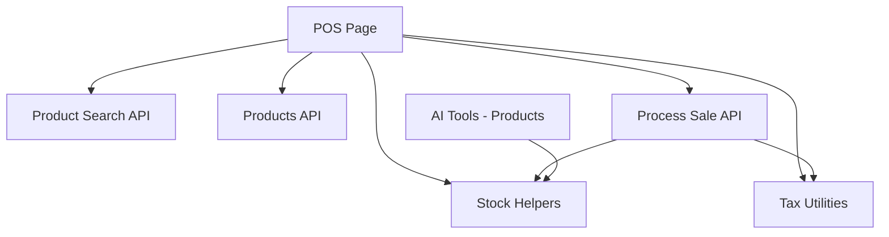

# Product Search & Shopping Cart

<cite>
**Referenced Files in This Document**
- [POS Page](file://src/app/admin/pos/page.tsx)
- [Product Search API](file://src/app/api/admin/products/search/route.ts)
- [Products API](file://src/app/api/admin/products/route.ts)
- [Process Sale API](file://src/app/api/admin/pos/process-sale/route.ts)
- [Tax Utilities](file://src/lib/utils/tax.ts)
- [Stock Helpers](file://src/lib/inventory/stock-helpers.ts)
- [Dashboard Search](file://src/components/admin/DashboardSearch.tsx)
- [AI Tools - Products](file://src/lib/ai/tools/products.ts)
</cite>

## Table of Contents

1. [Introduction](#introduction)
2. [Project Structure](#project-structure)
3. [Core Components](#core-components)
4. [Architecture Overview](#architecture-overview)
5. [Detailed Component Analysis](#detailed-component-analysis)
6. [Dependency Analysis](#dependency-analysis)
7. [Performance Considerations](#performance-considerations)
8. [Troubleshooting Guide](#troubleshooting-guide)
9. [Conclusion](#conclusion)

## Introduction

This document provides comprehensive documentation for the product search and shopping cart functionality in the Opttius POS system, tailored for optical retail environments. It explains how the system supports SKU, barcode, name, and category-based searches, manages the shopping cart with item addition, quantity adjustments, and removal, integrates with inventory management for real-time stock updates and availability checks, and implements product pricing, tax calculation, and discount application. It also covers POS-specific features such as temporary items, promotional pricing, and bundle deals, along with practical examples for common search scenarios and cart workflows in optical retail.

## Project Structure

The POS search and cart functionality spans several key areas:

- Frontend POS interface for search, cart management, and payment processing
- Backend APIs for product search, product catalog queries, and sale processing
- Inventory management utilities for stock updates and availability checks
- Tax calculation utilities for inclusive/exclusive tax pricing
- Dashboard search integration for quick product lookup

**Diagram sources**

- [POS Page](file://src/app/admin/pos/page.tsx#L148-L6075)
- [Product Search API](file://src/app/api/admin/products/search/route.ts#L1-L263)
- [Products API](file://src/app/api/admin/products/route.ts#L1-L1220)
- [Process Sale API](file://src/app/api/admin/pos/process-sale/route.ts#L1-L1457)
- [Stock Helpers](file://src/lib/inventory/stock-helpers.ts#L48-L199)
- [Tax Utilities](file://src/lib/utils/tax.ts#L1-L95)
- [Dashboard Search](file://src/components/admin/DashboardSearch.tsx#L46-L92)
- [AI Tools - Products](file://src/lib/ai/tools/products.ts#L584-L622)

**Section sources**

- [POS Page](file://src/app/admin/pos/page.tsx#L148-L6075)
- [Product Search API](file://src/app/api/admin/products/search/route.ts#L1-L263)
- [Products API](file://src/app/api/admin/products/route.ts#L1-L1220)
- [Process Sale API](file://src/app/api/admin/pos/process-sale/route.ts#L1-L1457)
- [Stock Helpers](file://src/lib/inventory/stock-helpers.ts#L48-L199)
- [Tax Utilities](file://src/lib/utils/tax.ts#L1-L95)
- [Dashboard Search](file://src/components/admin/DashboardSearch.tsx#L46-L92)
- [AI Tools - Products](file://src/lib/ai/tools/products.ts#L584-L622)

## Core Components

- Product Search Engine: Supports intelligent search across name, description, SKU, and barcode with prioritization for exact matches.
- Shopping Cart Management: Handles item addition, quantity updates, removal, and POS-specific features like temporary items and discounts.
- Inventory Integration: Real-time stock updates and availability checks during purchase processing.
- Tax Calculation: Computes tax-inclusive and tax-exclusive pricing with configurable tax rates.
- Discount System: Supports percentage and fixed-amount discounts applied to cart totals or individual items.
- Autocomplete & Suggestion: Provides quick product lookup via dashboard search and POS search suggestions.

**Section sources**

- [POS Page](file://src/app/admin/pos/page.tsx#L924-L5387)
- [Product Search API](file://src/app/api/admin/products/search/route.ts#L65-L124)
- [Products API](file://src/app/api/admin/products/route.ts#L234-L248)
- [Process Sale API](file://src/app/api/admin/pos/process-sale/route.ts#L865-L921)
- [Tax Utilities](file://src/lib/utils/tax.ts#L13-L94)
- [Stock Helpers](file://src/lib/inventory/stock-helpers.ts#L67-L171)

## Architecture Overview

The POS system orchestrates search, cart management, and sale processing with robust inventory and tax integration.

**Diagram sources**

- [POS Page](file://src/app/admin/pos/page.tsx#L875-L953)
- [Product Search API](file://src/app/api/admin/products/search/route.ts#L51-L124)
- [Products API](file://src/app/api/admin/products/route.ts#L57-L100)
- [Process Sale API](file://src/app/api/admin/pos/process-sale/route.ts#L17-L124)
- [Stock Helpers](file://src/lib/inventory/stock-helpers.ts#L67-L171)
- [Tax Utilities](file://src/lib/utils/tax.ts#L46-L94)

## Detailed Component Analysis

### Product Search Mechanism

The search system supports multiple criteria:

- Exact SKU/Barcode matches are prioritized when the query resembles a code pattern.
- Name and description searches use case-insensitive matching.
- Category-based filtering is supported via dedicated endpoints and UI filters.
- Branch-aware product visibility ensures multi-tenant isolation and correct stock display.

Key implementation details:

- Intelligent search logic in the POS page handles keyboard navigation and suggestion rendering.
- The product search API builds dynamic OR conditions for SKU/barcode/name/description while enforcing organization and branch filters.
- The products API supports advanced filters (category, price range, stock status) and nested relation handling for variants and branch stock.

**Diagram sources**

- [POS Page](file://src/app/admin/pos/page.tsx#L875-L907)
- [Product Search API](file://src/app/api/admin/products/search/route.ts#L65-L124)
- [Products API](file://src/app/api/admin/products/route.ts#L234-L248)

**Section sources**

- [POS Page](file://src/app/admin/pos/page.tsx#L875-L907)
- [Product Search API](file://src/app/api/admin/products/search/route.ts#L65-L124)
- [Products API](file://src/app/api/admin/products/route.ts#L234-L248)

### Shopping Cart Management

The cart supports:

- Item addition with automatic quantity increment if the same product is added again.
- Quantity adjustment with validation against available stock.
- Removal of items from the cart.
- POS-specific features:
  - Temporary items (e.g., lens services, treatments, labor) identified by non-UUID product IDs.
  - Promotional pricing and bundle deals represented as special items with negative unit prices for discounts.
  - Work-order eligibility checks based on product types and categories.

**Diagram sources**

- [POS Page](file://src/app/admin/pos/page.tsx#L924-L976)
- [POS Page](file://src/app/admin/pos/page.tsx#L5339-L5381)
- [Tax Utilities](file://src/lib/utils/tax.ts#L46-L94)

**Section sources**

- [POS Page](file://src/app/admin/pos/page.tsx#L924-L976)
- [POS Page](file://src/app/admin/pos/page.tsx#L5339-L5381)
- [Tax Utilities](file://src/lib/utils/tax.ts#L46-L94)

### Inventory Integration and Availability Checking

During sale processing:

- The system validates current stock for each product and branch.
- If stock does not exist, it initializes a zero-stock record before applying reductions.
- Stock updates use a dedicated helper that supports reserved quantities and threshold tracking.

**Diagram sources**

- [Process Sale API](file://src/app/api/admin/pos/process-sale/route.ts#L865-L921)
- [Stock Helpers](file://src/lib/inventory/stock-helpers.ts#L67-L171)

**Section sources**

- [Process Sale API](file://src/app/api/admin/pos/process-sale/route.ts#L865-L921)
- [Stock Helpers](file://src/lib/inventory/stock-helpers.ts#L67-L171)

### Pricing, Tax Calculation, and Discount Application

- Tax handling:
  - Supports both tax-inclusive and tax-exclusive pricing.
  - Calculates subtotal, tax amount, and total for multiple items with mixed tax inclusion flags.
- Discount system:
  - Supports percentage or fixed-amount discounts.
  - Discounts can be applied as a separate cart item with negative unit price.
  - Ensures discount does not exceed the total with tax.

**Diagram sources**

- [POS Page](file://src/app/admin/pos/page.tsx#L415-L424)
- [Tax Utilities](file://src/lib/utils/tax.ts#L46-L94)
- [POS Page](file://src/app/admin/pos/page.tsx#L2220-L2246)

**Section sources**

- [POS Page](file://src/app/admin/pos/page.tsx#L415-L424)
- [Tax Utilities](file://src/lib/utils/tax.ts#L46-L94)
- [POS Page](file://src/app/admin/pos/page.tsx#L2220-L2246)

### Product Suggestion System and Autocomplete

- POS search suggestions:
  - Keyboard navigation with arrow keys and enter selection.
  - Auto-focus on mount for efficient scanning workflows.
- Dashboard search:
  - Quick customer and product search with unified results.
  - Displays SKU, barcode, and stock information for products.

**Diagram sources**

- [POS Page](file://src/app/admin/pos/page.tsx#L875-L907)
- [Product Search API](file://src/app/api/admin/products/search/route.ts#L51-L124)
- [Dashboard Search](file://src/components/admin/DashboardSearch.tsx#L49-L92)

**Section sources**

- [POS Page](file://src/app/admin/pos/page.tsx#L875-L907)
- [Product Search API](file://src/app/api/admin/products/search/route.ts#L51-L124)
- [Dashboard Search](file://src/components/admin/DashboardSearch.tsx#L49-L92)

### POS-Specific Cart Features

- Temporary items:
  - Identified by non-UUID product IDs (e.g., lens-, treatments-, labor-, frame-manual-).
  - Used for services and work-order requirements.
- Promotional pricing and bundles:
  - Represented as special items with negative unit prices for discounts.
  - Applied to cart totals with tax inclusion considerations.
- Work-order eligibility:
  - Checks product types and categories to determine if items require work orders.

**Section sources**

- [POS Page](file://src/app/admin/pos/page.tsx#L924-L976)
- [POS Page](file://src/app/admin/pos/page.tsx#L2220-L2246)
- [Process Sale API](file://src/app/api/admin/pos/process-sale/route.ts#L953-L982)

## Dependency Analysis

The POS system exhibits clear separation of concerns:

- Frontend depends on backend APIs for search, catalog, and sale processing.
- Inventory operations are isolated in dedicated helpers with explicit error handling.
- Tax utilities are reusable across POS and quoting workflows.
- AI tools integrate with inventory updates for automated stock management.

**Diagram sources**

- [POS Page](file://src/app/admin/pos/page.tsx#L148-L6075)
- [Product Search API](file://src/app/api/admin/products/search/route.ts#L1-L263)
- [Products API](file://src/app/api/admin/products/route.ts#L1-L1220)
- [Process Sale API](file://src/app/api/admin/pos/process-sale/route.ts#L1-L1457)
- [Stock Helpers](file://src/lib/inventory/stock-helpers.ts#L48-L199)
- [Tax Utilities](file://src/lib/utils/tax.ts#L1-L95)
- [AI Tools - Products](file://src/lib/ai/tools/products.ts#L584-L622)

**Section sources**

- [POS Page](file://src/app/admin/pos/page.tsx#L148-L6075)
- [Product Search API](file://src/app/api/admin/products/search/route.ts#L1-L263)
- [Products API](file://src/app/api/admin/products/route.ts#L1-L1220)
- [Process Sale API](file://src/app/api/admin/pos/process-sale/route.ts#L1-L1457)
- [Stock Helpers](file://src/lib/inventory/stock-helpers.ts#L48-L199)
- [Tax Utilities](file://src/lib/utils/tax.ts#L1-L95)
- [AI Tools - Products](file://src/lib/ai/tools/products.ts#L584-L622)

## Performance Considerations

- Search performance:
  - Use debounced search to minimize API calls.
  - Prefer exact SKU/barcode matches for faster lookups.
  - Limit search result sets with appropriate limits.
- Inventory updates:
  - Batch stock updates where possible to reduce database round trips.
  - Initialize missing stock records efficiently before applying changes.
- Tax calculations:
  - Compute tax totals once per cart update to avoid redundant calculations.

## Troubleshooting Guide

Common issues and resolutions:

- Search returns no results:
  - Verify query length and character encoding.
  - Check organization and branch filters are correctly applied.
- Out-of-stock items:
  - Ensure branch-specific stock is initialized and updated.
  - Validate available_quantity vs. requested quantity.
- Incorrect tax totals:
  - Confirm price_includes_tax flags on products.
  - Recalculate totals after discount application.
- Payment processing failures:
  - Verify cash register is open and POS session exists.
  - Check branch access permissions for non-super admins.

**Section sources**

- [Process Sale API](file://src/app/api/admin/pos/process-sale/route.ts#L144-L222)
- [Stock Helpers](file://src/lib/inventory/stock-helpers.ts#L85-L171)
- [Tax Utilities](file://src/lib/utils/tax.ts#L13-L94)

## Conclusion

The Opttius POS system delivers a robust, optical-retail-focused product search and shopping cart experience. Its multi-criteria search, real-time inventory integration, flexible tax and discount handling, and POS-specific features enable efficient, accurate transactions. By leveraging branch-aware filtering, temporary items, and promotional pricing, the system supports complex optical workflows while maintaining performance and reliability.
