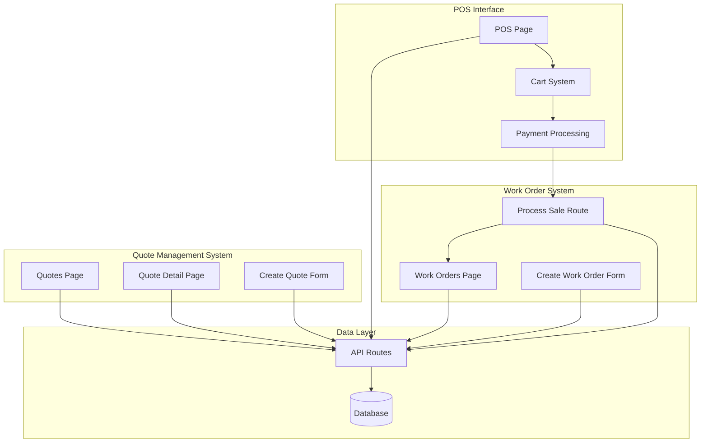
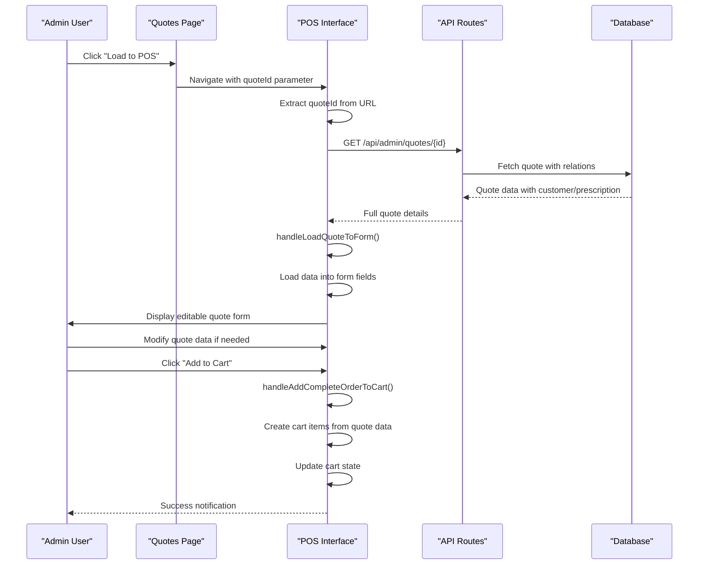
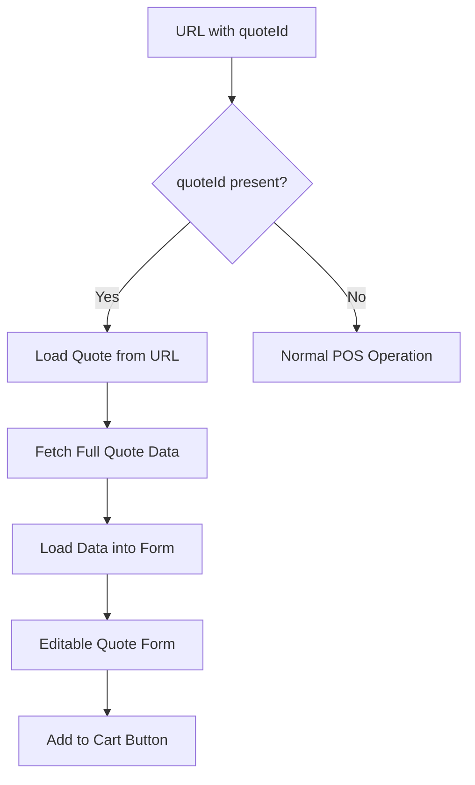
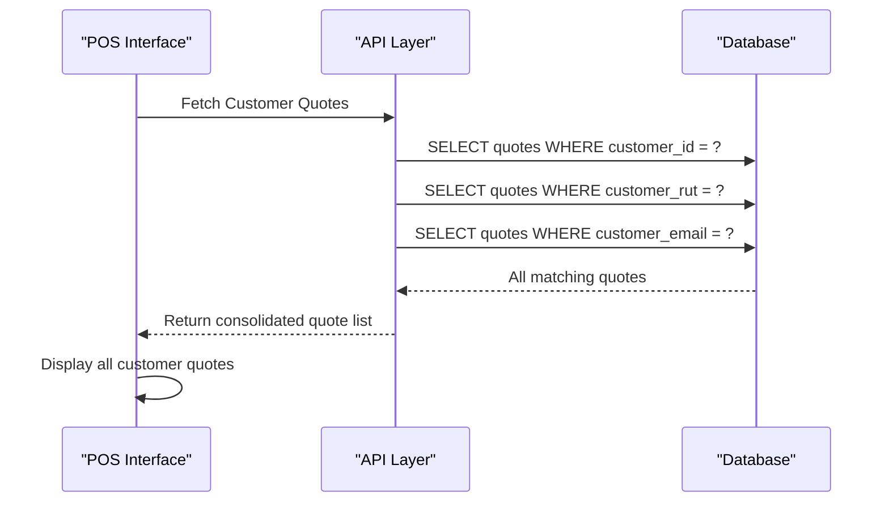
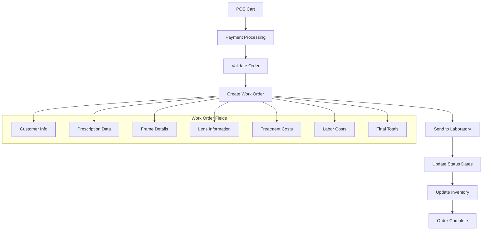
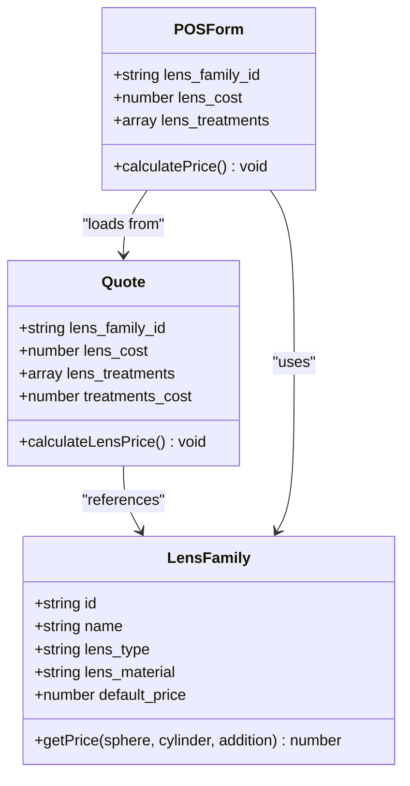
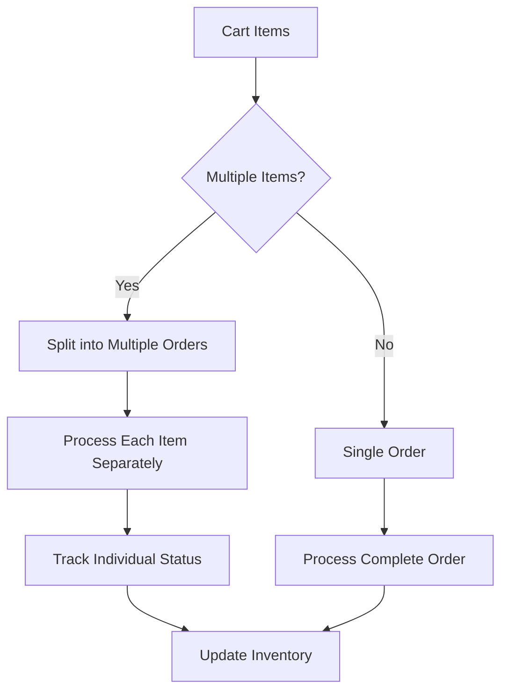
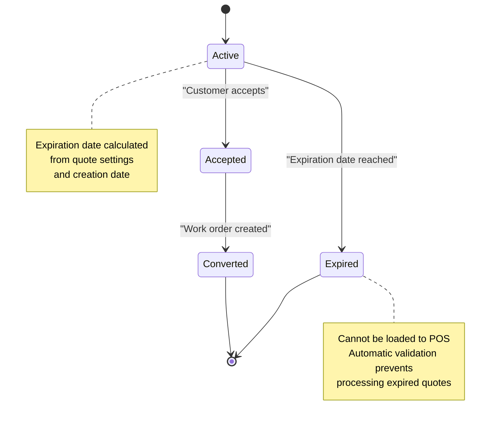
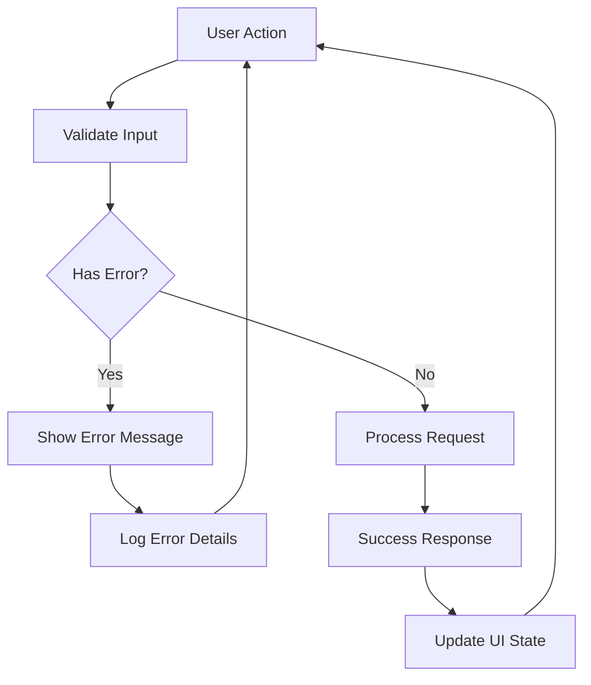
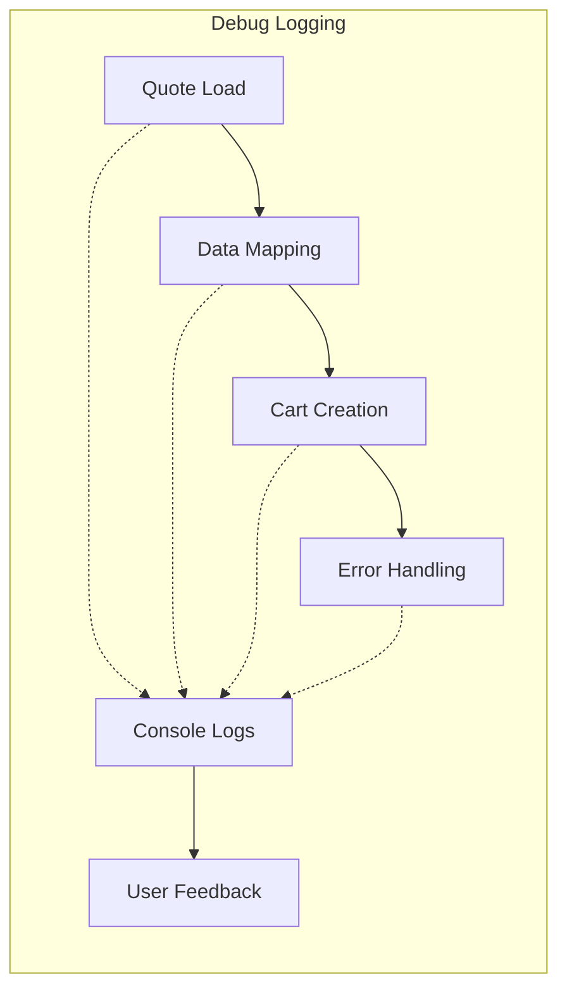

# Quote Loading & Work Order Integration

<cite>
**Referenced Files in This Document**
- [POS Page](file://src/app/admin/pos/page.tsx)
- [Quotes Page](file://src/app/admin/quotes/page.tsx)
- [Work Orders Page](file://src/app/admin/work-orders/page.tsx)
- [Create Quote Form](file://src/components/admin/CreateQuoteForm.tsx)
- [Create Work Order Form](file://src/components/admin/CreateWorkOrderForm/index.tsx)
- [POS Process Sale Route](file://src/app/api/admin/pos/process-sale/route.ts)
- [Quote Detail Page](file://src/app/admin/quotes/[id]/page.tsx)
- [Quote API Route](file://src/app/api/admin/quotes/[id]/route.ts)
- [Utils Formatting](file://src/lib/utils.ts)
</cite>

## Table of Contents

1. [Introduction](#introduction)
2. [System Architecture Overview](#system-architecture-overview)
3. [Quote Loading Workflow](#quote-loading-workflow)
4. [POS Integration Details](#pos-integration-details)
5. [Work Order Creation Process](#work-order-creation-process)
6. [Data Mapping & Validation](#data-mapping--validation)
7. [POS-Specific Features](#pos-specific-features)
8. [Error Handling & Edge Cases](#error-handling--edge-cases)
9. [Implementation Examples](#implementation-examples)
10. [Troubleshooting Guide](#troubleshooting-guide)
11. [Conclusion](#conclusion)

## Introduction

The Opttius POS system provides seamless integration between quote management and point-of-sale processing through a sophisticated workflow that enables immediate quote-to-sale conversion. This documentation explains how quotes from the quote management system can be loaded directly into the POS interface, including lens data, frame information, and treatment details. The system supports both optical and contact lens prescriptions, handles presbyopia solutions, and integrates with the work order creation and laboratory processing workflows.

## System Architecture Overview

The quote loading and work order integration workflow spans three primary components:

**Diagram sources**

- [POS Page](file://src/app/admin/pos/page.tsx#L148-L413)
- [Quotes Page](file://src/app/admin/quotes/page.tsx#L97-L152)
- [Work Orders Page](file://src/app/admin/work-orders/page.tsx#L90-L155)
- [Create Work Order Form](file://src/components/admin/CreateWorkOrderForm/index.tsx#L32-L70)

## Quote Loading Workflow

The quote loading process follows a structured sequence that ensures data integrity and user flexibility:

**Diagram sources**

- [POS Page](file://src/app/admin/pos/page.tsx#L364-L413)
- [POS Page](file://src/app/admin/pos/page.tsx#L603-L831)
- [POS Page](file://src/app/admin/pos/page.tsx#L1884-L2260)

**Section sources**

- [POS Page](file://src/app/admin/pos/page.tsx#L364-L413)
- [POS Page](file://src/app/admin/pos/page.tsx#L603-L831)
- [POS Page](file://src/app/admin/pos/page.tsx#L1884-L2260)

## POS Integration Details

### Quote Loading Implementation

The POS interface implements sophisticated quote loading capabilities through multiple pathways:

#### URL Parameter Loading

The system automatically detects quote IDs in the URL and loads them into the POS form:

**Diagram sources**

- [POS Page](file://src/app/admin/pos/page.tsx#L364-L413)

#### Customer Cross-Branch Processing

The system supports cross-branch quote processing through customer RUT matching:

**Diagram sources**

- [POS Page](file://src/app/admin/pos/page.tsx#L560-L600)

**Section sources**

- [POS Page](file://src/app/admin/pos/page.tsx#L364-L413)
- [POS Page](file://src/app/admin/pos/page.tsx#L560-L600)

### Data Mapping & Structure

The POS system maps quote data to cart items through a structured approach:

| Quote Field              | Cart Item Type | Description                |
| ------------------------ | -------------- | -------------------------- |
| `frame_name`             | Product        | Frame item with pricing    |
| `lens_family_id`         | Custom Lens    | Optical lens from family   |
| `contact_lens_family_id` | Contact Lens   | Contact lens family        |
| `lens_treatments`        | Treatment      | Additional lens treatments |
| `lens_cost`              | Custom Lens    | Manual lens cost           |
| `treatments_cost`        | Treatment      | Treatment costs            |
| `labor_cost`             | Labor          | Mounting labor             |
| `customer_own_frame`     | Product        | Customer-provided frame    |

**Section sources**

- [POS Page](file://src/app/admin/pos/page.tsx#L1884-L2260)

## Work Order Creation Process

The work order creation process integrates seamlessly with the POS workflow:

**Diagram sources**

- [Create Work Order Form](file://src/components/admin/CreateWorkOrderForm/index.tsx#L173-L245)
- [POS Process Sale Route](file://src/app/api/admin/pos/process-sale/route.ts#L1259-L1290)

**Section sources**

- [Create Work Order Form](file://src/components/admin/CreateWorkOrderForm/index.tsx#L173-L245)
- [POS Process Sale Route](file://src/app/api/admin/pos/process-sale/route.ts#L1259-L1290)

## Data Mapping & Validation

### Lens Family Integration

The system integrates lens families with automatic pricing calculations:

**Diagram sources**

- [Create Quote Form](file://src/components/admin/CreateQuoteForm.tsx#L338-L406)
- [POS Page](file://src/app/admin/pos/page.tsx#L1602-L1645)

### Treatment Validation

The system validates treatment selections against lens families:

| Treatment Type    | Availability       | Cost Calculation |
| ----------------- | ------------------ | ---------------- |
| Anti-Reflective   | Included in family | Free             |
| Blue Light Filter | Included in family | Free             |
| Tint              | Optional extra     | Custom cost      |
| Prism             | Always available   | Custom cost      |
| Photochromic      | Included in family | Free             |

**Section sources**

- [Create Quote Form](file://src/components/admin/CreateQuoteForm.tsx#L1753-L1805)
- [POS Page](file://src/app/admin/pos/page.tsx#L1812-L1843)

## POS-Specific Features

### Partial Fulfillment Support

The POS system supports partial fulfillment through flexible cart management:

### Quote Expiration Handling

The system implements robust quote expiration management:

**Diagram sources**

- [Quotes Page](file://src/app/admin/quotes/page.tsx#L506-L520)

### Cross-Branch Processing

The system supports cross-branch quote processing through customer identification:

| Customer Identifier | Cross-Branch Support | Use Case                     |
| ------------------- | -------------------- | ---------------------------- |
| Customer ID         | Limited              | Same organization only       |
| RUT                 | Full                 | All branches in organization |
| Email               | Full                 | All branches in organization |

**Section sources**

- [POS Page](file://src/app/admin/pos/page.tsx#L560-L600)
- [Quotes Page](file://src/app/admin/quotes/page.tsx#L506-L520)

## Error Handling & Edge Cases

### Common Error Scenarios

### Error Categories

| Error Type               | Trigger              | Response           |
| ------------------------ | -------------------- | ------------------ |
| Network Failure          | API timeout          | Retry mechanism    |
| Invalid Quote ID         | Non-existent quote   | Toast notification |
| Expired Quote            | Past expiration date | Block loading      |
| Insufficient Permissions | Access denied        | Redirect to login  |
| Invalid Prescription     | Missing data         | Validation errors  |

**Section sources**

- [POS Page](file://src/app/admin/pos/page.tsx#L2369-L2373)
- [POS Page](file://src/app/admin/pos/page.tsx#L827-L831)

## Implementation Examples

### Typical Quote Loading Scenarios

#### Scenario 1: Standard Optical Prescription

1. Customer presents optical prescription
2. Admin creates quote with frame and single vision lenses
3. Customer accepts quote
4. Admin loads quote to POS
5. POS displays editable form with lens pricing
6. Admin modifies treatments if needed
7. Admin adds items to cart and processes payment

#### Scenario 2: Presbyopia with Two Separate Lenses

1. Customer has presbyopia prescription
2. Admin selects "Two Separate Lenses" solution
3. System calculates costs for far and near lenses
4. Admin can adjust individual lens costs
5. System creates separate lens items in cart

#### Scenario 3: Contact Lens Prescription

1. Customer has contact lens prescription
2. Admin selects contact lens family
3. System calculates price from matrix
4. Admin can adjust quantity if needed
5. System creates contact lens item in cart

### Workflow Variations

| Variation           | Trigger                   | Action                      | Outcome                        |
| ------------------- | ------------------------- | --------------------------- | ------------------------------ |
| Manual Frame        | No frame product          | Create manual frame entry   | Frame added with custom price  |
| Customer Own Frame  | Customer brings own frame | Set customer_own_frame flag | Frame added with zero cost     |
| Two Separate Lenses | Presbyopia solution       | Calculate far/near costs    | Separate lens items created    |
| Contact Lenses      | Contact lens family       | Use matrix pricing          | Contact lens item created      |
| Partial Payment     | Cash partial              | Enable partial payment mode | Payment processed with deposit |

**Section sources**

- [POS Page](file://src/app/admin/pos/page.tsx#L1914-L2080)
- [POS Page](file://src/app/admin/pos/page.tsx#L2082-L2260)

## Troubleshooting Guide

### Common Issues and Solutions

#### Issue: Quote Not Loading to POS

**Symptoms**: "Error loading quote" notification appears
**Causes**:

- Network connectivity issues
- Quote has expired
- Insufficient permissions
- Invalid quote ID

**Solutions**:

1. Check network connection
2. Verify quote status is not expired
3. Ensure user has proper branch access
4. Confirm quote ID validity

#### Issue: Lens Pricing Not Calculating

**Symptoms**: Lens cost shows as $0 despite valid prescription
**Causes**:

- Missing lens family selection
- Invalid prescription data
- Matrix calculation failure

**Solutions**:

1. Select appropriate lens family
2. Verify prescription has valid sphere/cylinder values
3. Check matrix configuration in admin panel

#### Issue: Cart Item Conflicts

**Symptoms**: Duplicate items or incorrect quantities
**Causes**:

- Same item added multiple times
- Manual frame conflicts with catalog frame
- Treatment conflicts

**Solutions**:

1. Review cart for duplicates
2. Choose either manual or catalog frame consistently
3. Remove conflicting treatments

### Debug Information

The system provides comprehensive logging for troubleshooting:

**Section sources**

- [POS Page](file://src/app/admin/pos/page.tsx#L516-L550)
- [POS Page](file://src/app/admin/pos/page.tsx#L810-L830)

## Conclusion

The Opttius POS system provides a comprehensive solution for quote loading and work order integration through its sophisticated data mapping, validation mechanisms, and flexible processing workflows. The system's support for cross-branch processing, partial fulfillment, and various lens types ensures seamless integration between quote management and point-of-sale operations. The robust error handling and debugging capabilities enable efficient troubleshooting while maintaining system reliability.

Key benefits of the implementation include:

- Seamless quote-to-sale conversion process
- Support for complex lens configurations
- Cross-branch quote processing capabilities
- Flexible payment and fulfillment options
- Comprehensive error handling and validation
- Integration with work order and laboratory systems

The documented workflows and implementation details provide a solid foundation for understanding and extending the quote loading and work order integration functionality within the Opttius POS system.
