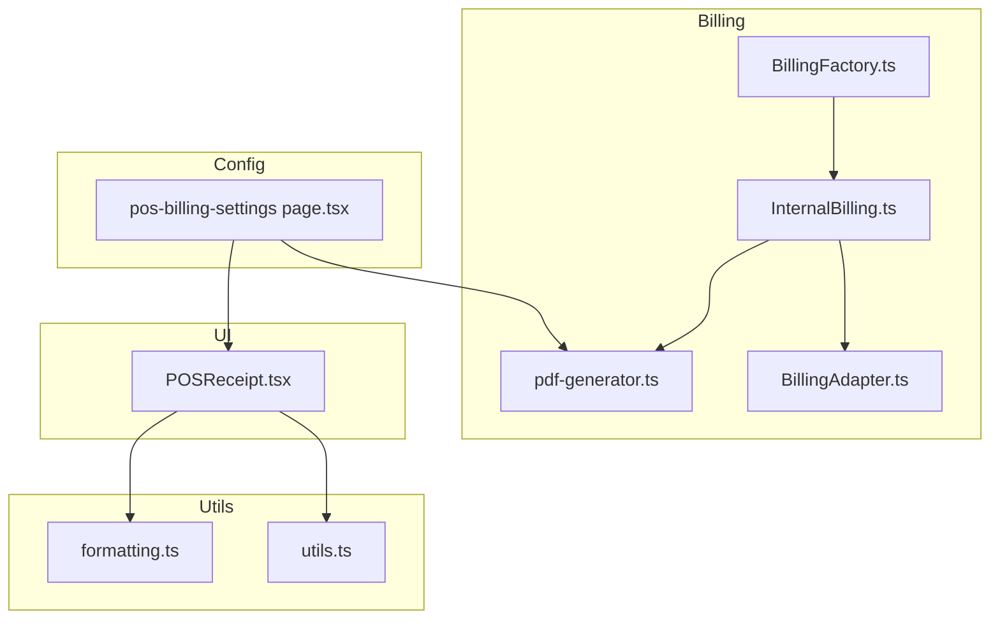
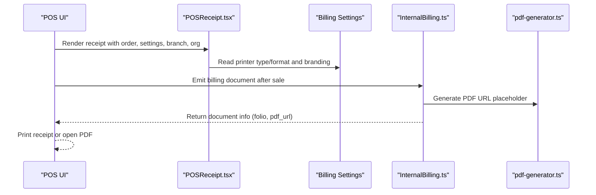
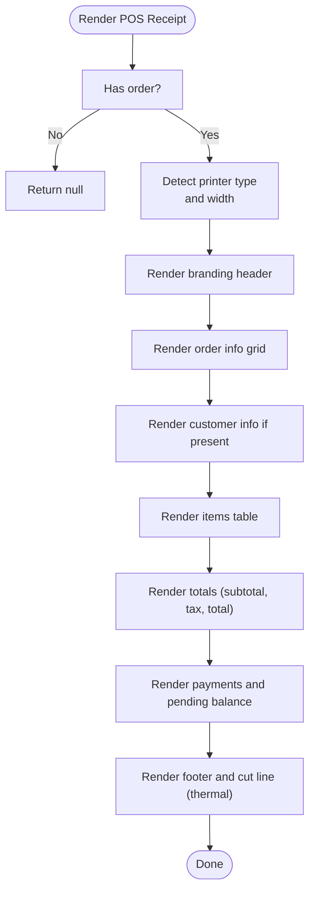
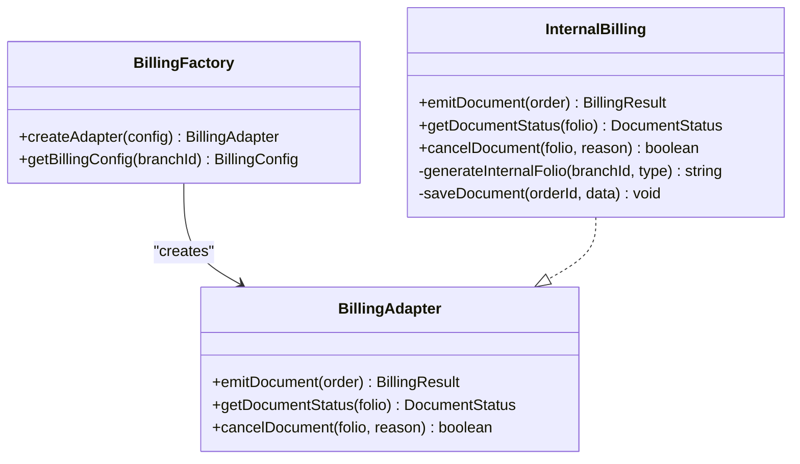
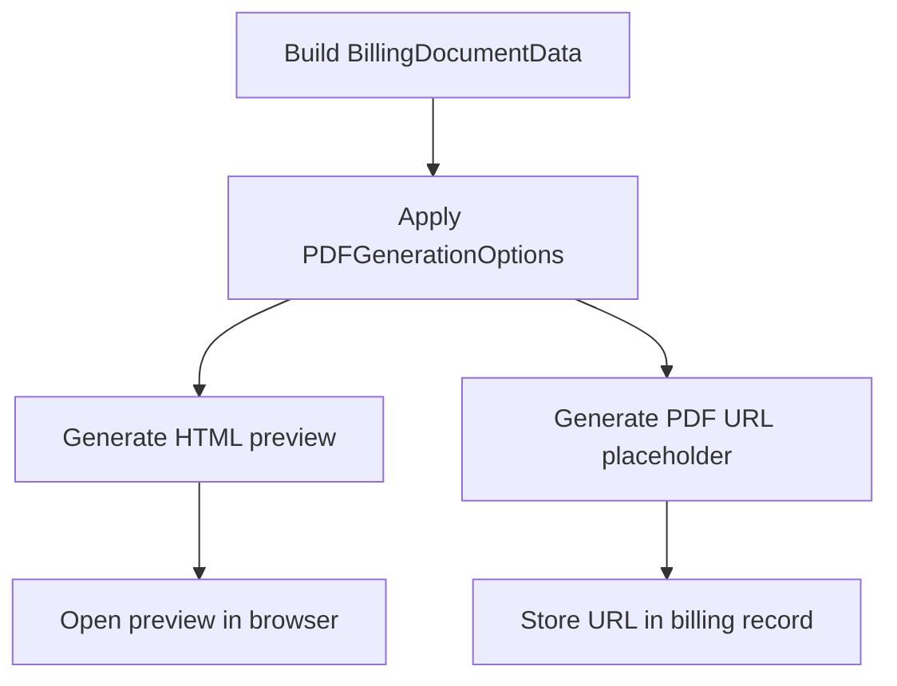
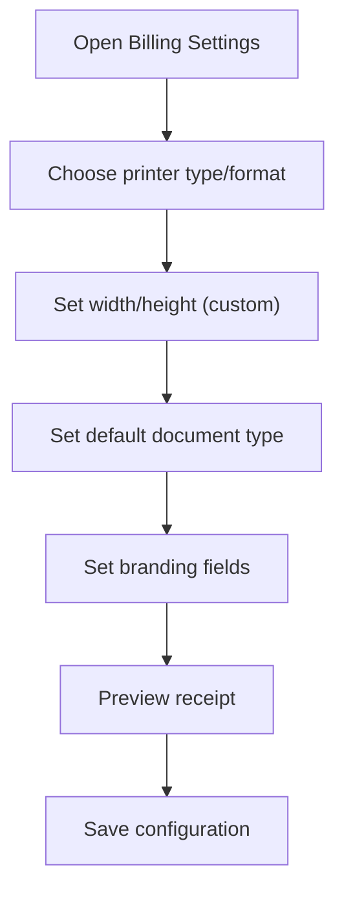
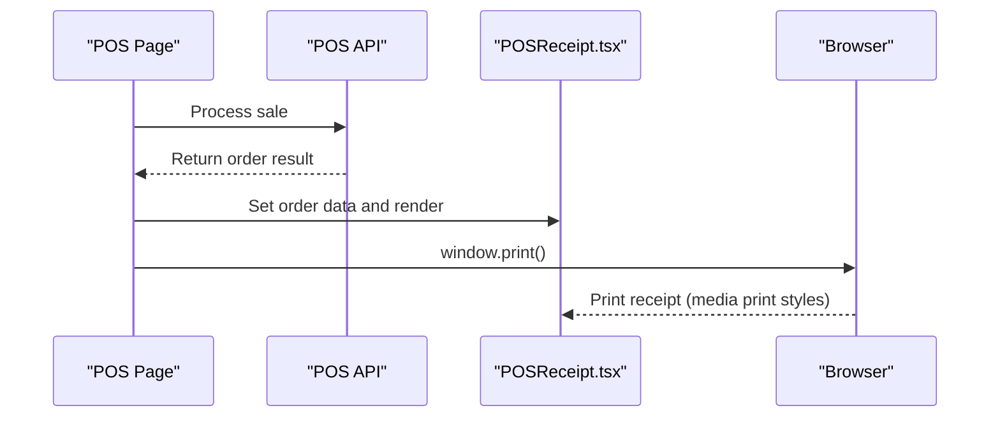
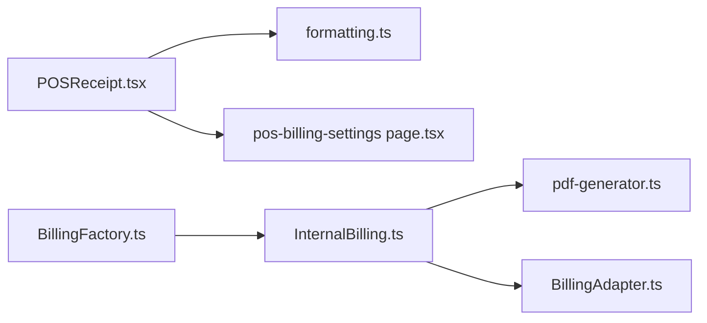

# Receipt Generation & Printing

<cite>
**Referenced Files in This Document**
- [POSReceipt.tsx](file://src/components/admin/POS/POSReceipt.tsx)
- [pdf-generator.ts](file://src/lib/billing/pdf-generator.ts)
- [BillingFactory.ts](file://src/lib/billing/BillingFactory.ts)
- [BillingAdapter.ts](file://src/lib/billing/adapters/BillingAdapter.ts)
- [InternalBilling.ts](file://src/lib/billing/adapters/InternalBilling.ts)
- [formatting.ts](file://src/lib/utils/formatting.ts)
- [utils.ts](file://src/lib/utils.ts)
- [pos-billing-settings page.tsx](file://src/app/admin/system/pos-billing-settings/page.tsx)
- [AUTOMATIC_PRINTING_IMPLEMENTATION.md](file://docs/AUTOMATIC_PRINTING_IMPLEMENTATION.md)
</cite>

## Table of Contents

1. [Introduction](#introduction)
2. [Project Structure](#project-structure)
3. [Core Components](#core-components)
4. [Architecture Overview](#architecture-overview)
5. [Detailed Component Analysis](#detailed-component-analysis)
6. [Dependency Analysis](#dependency-analysis)
7. [Performance Considerations](#performance-considerations)
8. [Troubleshooting Guide](#troubleshooting-guide)
9. [Conclusion](#conclusion)
10. [Appendices](#appendices)

## Introduction

This document explains the receipt generation and printing system in the Point of Sale (POS). It covers the receipt template structure, tax and payment details, printing to thermal printers and PDF generation, integration with billing settings and SII invoice type configuration, receipt data formatting, multi-language support, custom branding, POS-specific features (duplicate receipts, void receipts, reprints), storage and retrieval, and customer copy distribution. Examples of receipt types and printing scenarios in optical retail environments are included.

## Project Structure

The receipt system spans UI rendering, billing adapters, PDF generation utilities, and system configuration pages. The POS receipt renderer produces printable receipts, while the billing subsystem emits internal documents and prepares PDFs. Billing settings define branding, printer format, and document defaults.

**Diagram sources**

- [POSReceipt.tsx](file://src/components/admin/POS/POSReceipt.tsx#L1-L211)
- [pdf-generator.ts](file://src/lib/billing/pdf-generator.ts#L1-L188)
- [BillingFactory.ts](file://src/lib/billing/BillingFactory.ts#L1-L50)
- [BillingAdapter.ts](file://src/lib/billing/adapters/BillingAdapter.ts#L1-L78)
- [InternalBilling.ts](file://src/lib/billing/adapters/InternalBilling.ts#L1-L269)
- [formatting.ts](file://src/lib/utils/formatting.ts#L1-L342)
- [utils.ts](file://src/lib/utils.ts#L1-L21)
- [pos-billing-settings page.tsx](file://src/app/admin/system/pos-billing-settings/page.tsx#L670-L900)

**Section sources**

- [POSReceipt.tsx](file://src/components/admin/POS/POSReceipt.tsx#L1-L211)
- [pdf-generator.ts](file://src/lib/billing/pdf-generator.ts#L1-L188)
- [BillingFactory.ts](file://src/lib/billing/BillingFactory.ts#L1-L50)
- [BillingAdapter.ts](file://src/lib/billing/adapters/BillingAdapter.ts#L1-L78)
- [InternalBilling.ts](file://src/lib/billing/adapters/InternalBilling.ts#L1-L269)
- [formatting.ts](file://src/lib/utils/formatting.ts#L1-L342)
- [utils.ts](file://src/lib/utils.ts#L1-L21)
- [pos-billing-settings page.tsx](file://src/app/admin/system/pos-billing-settings/page.tsx#L670-L900)

## Core Components

- POS receipt renderer: Builds the printable receipt with branding, order details, taxes, totals, and payments.
- Billing adapter factory: Selects the billing implementation (currently internal billing).
- Internal billing adapter: Emits internal documents, generates folios, persists records, and coordinates PDF URLs.
- PDF generator: Provides HTML preview and placeholder PDF generation for billing documents.
- Formatting utilities: Centralized currency/date formatting with locale support.
- Billing settings UI: Manages printer type/format, custom branding, and document defaults.

**Section sources**

- [POSReceipt.tsx](file://src/components/admin/POS/POSReceipt.tsx#L14-L208)
- [BillingFactory.ts](file://src/lib/billing/BillingFactory.ts#L21-L36)
- [InternalBilling.ts](file://src/lib/billing/adapters/InternalBilling.ts#L21-L139)
- [pdf-generator.ts](file://src/lib/billing/pdf-generator.ts#L62-L84)
- [formatting.ts](file://src/lib/utils/formatting.ts#L47-L199)

## Architecture Overview

The POS receipt rendering pipeline integrates with billing configuration and internal billing to produce receipts and documents. The system supports:

- Thermal printer receipts with dynamic width and anti-fraud cut line.
- A4/Letter receipts for desktop printing.
- Internal document emission with folios and PDF placeholders.
- Branding customization via billing settings (logo, header/footer).
- Multi-language formatting for dates and currency.

**Diagram sources**

- [POSReceipt.tsx](file://src/components/admin/POS/POSReceipt.tsx#L14-L208)
- [InternalBilling.ts](file://src/lib/billing/adapters/InternalBilling.ts#L27-L139)
- [pdf-generator.ts](file://src/lib/billing/pdf-generator.ts#L62-L84)
- [pos-billing-settings page.tsx](file://src/app/admin/system/pos-billing-settings/page.tsx#L670-L767)

## Detailed Component Analysis

### POS Receipt Renderer

The POS receipt renderer builds a printable receipt tailored to thermal or standard paper formats. It includes:

- Organization branding (logo, business name, RUT, branch address/phone).
- Order metadata (order number, SII invoice number, date, invoice type).
- Customer details (name, RUT) when available.
- Line items with quantities, unit prices, and totals.
- Tax breakdown (subtotal, IVA 19%, total).
- Payment details (methods and amounts) and partial payment balances.
- Footer with custom messages and anti-fraud cut line for thermal.

**Diagram sources**

- [POSReceipt.tsx](file://src/components/admin/POS/POSReceipt.tsx#L14-L208)

**Section sources**

- [POSReceipt.tsx](file://src/components/admin/POS/POSReceipt.tsx#L14-L208)

### Billing Adapter and Internal Billing

The billing subsystem uses an adapter pattern to decouple internal billing from potential future fiscal billing integrations:

- Adapter interface defines emission, status, and cancellation operations.
- Internal billing adapter:
  - Determines document type from order (boleta, factura, internal_ticket).
  - Generates internal sequential folios per branch and type.
  - Persists billing records and items.
  - Updates order with document info and PDF URL.
  - Cancels internal documents by updating order state.

**Diagram sources**

- [BillingAdapter.ts](file://src/lib/billing/adapters/BillingAdapter.ts#L9-L78)
- [InternalBilling.ts](file://src/lib/billing/adapters/InternalBilling.ts#L21-L269)
- [BillingFactory.ts](file://src/lib/billing/BillingFactory.ts#L21-L48)

**Section sources**

- [BillingAdapter.ts](file://src/lib/billing/adapters/BillingAdapter.ts#L9-L78)
- [InternalBilling.ts](file://src/lib/billing/adapters/InternalBilling.ts#L27-L139)
- [BillingFactory.ts](file://src/lib/billing/BillingFactory.ts#L21-L36)

### PDF Generation for Billing Documents

The PDF generator provides:

- A data contract for billing documents (business/customer info, items, totals, customization).
- Options for logo inclusion, custom header/footer, and templates.
- HTML preview generation for quick review.
- Placeholder PDF URL generation for internal documents.

**Diagram sources**

- [pdf-generator.ts](file://src/lib/billing/pdf-generator.ts#L9-L84)

**Section sources**

- [pdf-generator.ts](file://src/lib/billing/pdf-generator.ts#L9-L84)

### Billing Settings and Printer Configuration

The billing settings page allows configuring:

- Printer type (thermal, A4, Letter, custom).
- Paper dimensions for custom format previews.
- Default document type (boleta/factura).
- Branding fields (business name, RUT, address, phone, logo URL, header/footer text).
- Preview tab to visualize receipt appearance.

**Diagram sources**

- [pos-billing-settings page.tsx](file://src/app/admin/system/pos-billing-settings/page.tsx#L670-L767)
- [pos-billing-settings page.tsx](file://src/app/admin/system/pos-billing-settings/page.tsx#L769-L817)
- [pos-billing-settings page.tsx](file://src/app/admin/system/pos-billing-settings/page.tsx#L819-L900)

**Section sources**

- [pos-billing-settings page.tsx](file://src/app/admin/system/pos-billing-settings/page.tsx#L670-L767)
- [pos-billing-settings page.tsx](file://src/app/admin/system/pos-billing-settings/page.tsx#L769-L817)
- [pos-billing-settings page.tsx](file://src/app/admin/system/pos-billing-settings/page.tsx#L819-L900)

### Automatic Printing Implementation

The automatic printing guide outlines:

- Creating the receipt component.
- Using API responses to trigger printing.
- Applying media print styles to isolate the receipt during printing.
- Validating receipt content for boletas and facturas.

**Diagram sources**

- [AUTOMATIC_PRINTING_IMPLEMENTATION.md](file://docs/AUTOMATIC_PRINTING_IMPLEMENTATION.md#L19-L41)

**Section sources**

- [AUTOMATIC_PRINTING_IMPLEMENTATION.md](file://docs/AUTOMATIC_PRINTING_IMPLEMENTATION.md#L1-L79)

## Dependency Analysis

Key dependencies and relationships:

- POS receipt depends on formatting utilities for currency/date formatting.
- Billing settings influence receipt width and branding.
- Internal billing depends on PDF generator for URL placeholders and on Supabase for persistence.
- Billing factory selects the appropriate adapter implementation.

**Diagram sources**

- [POSReceipt.tsx](file://src/components/admin/POS/POSReceipt.tsx#L4-L5)
- [formatting.ts](file://src/lib/utils/formatting.ts#L10-L20)
- [pos-billing-settings page.tsx](file://src/app/admin/system/pos-billing-settings/page.tsx#L670-L767)
- [InternalBilling.ts](file://src/lib/billing/adapters/InternalBilling.ts#L17-L19)
- [pdf-generator.ts](file://src/lib/billing/pdf-generator.ts#L7-L8)
- [BillingAdapter.ts](file://src/lib/billing/adapters/BillingAdapter.ts#L9-L31)
- [BillingFactory.ts](file://src/lib/billing/BillingFactory.ts#L21-L36)

**Section sources**

- [POSReceipt.tsx](file://src/components/admin/POS/POSReceipt.tsx#L4-L5)
- [formatting.ts](file://src/lib/utils/formatting.ts#L10-L20)
- [InternalBilling.ts](file://src/lib/billing/adapters/InternalBilling.ts#L17-L19)
- [pdf-generator.ts](file://src/lib/billing/pdf-generator.ts#L7-L8)
- [BillingAdapter.ts](file://src/lib/billing/adapters/BillingAdapter.ts#L9-L31)
- [BillingFactory.ts](file://src/lib/billing/BillingFactory.ts#L21-L36)

## Performance Considerations

- Receipt rendering uses lightweight formatting utilities and avoids heavy computations.
- PDF generation is currently a placeholder; production should leverage efficient PDF libraries and streaming to avoid blocking the UI.
- Printing is triggered after DOM updates; ensure minimal reflows by keeping receipt content concise.
- Billing operations persist to Supabase; batch writes for document items when possible.

## Troubleshooting Guide

Common issues and resolutions:

- Missing logo or branding fields: Verify billing settings for logo URL and header/footer text.
- Incorrect receipt width on thermal printers: Confirm printer type and width settings in billing settings.
- Partial payment not reflected: Ensure order includes payment records and status is set to partial.
- PDF URL not generated: Internal billing returns a placeholder URL; implement actual PDF generation to replace the placeholder.
- SII invoice type not applied: The receipt displays the invoice type from the order; ensure the order carries the correct SII type.

**Section sources**

- [POSReceipt.tsx](file://src/components/admin/POS/POSReceipt.tsx#L64-L81)
- [POSReceipt.tsx](file://src/components/admin/POS/POSReceipt.tsx#L174-L189)
- [InternalBilling.ts](file://src/lib/billing/adapters/InternalBilling.ts#L125-L134)
- [pdf-generator.ts](file://src/lib/billing/pdf-generator.ts#L62-L84)

## Conclusion

The POS receipt system combines a flexible receipt renderer, configurable billing settings, and an internal billing adapter to support optical retail needs. It provides branded receipts for thermal and standard paper, handles tax and payment details, and prepares PDFs for internal documentation. Future enhancements can include fiscal billing integration, improved PDF generation, and expanded POS-specific features like duplicates, voids, and reprints.

## Appendices

### Receipt Template Structure

- Header: Logo, business name, RUT, branch info, address, phone.
- Order info: Order number, SII invoice number, date, invoice type.
- Customer: Name and RUT when available.
- Items: Product name, quantity, unit price, total price.
- Totals: Subtotal, IVA (19%), total.
- Payments: Methods and amounts; pending balance for partial payments.
- Footer: Custom footer text and standard message.

**Section sources**

- [POSReceipt.tsx](file://src/components/admin/POS/POSReceipt.tsx#L32-L197)

### Tax Calculations

- Subtotal and total are taken from order totals.
- IVA is shown when tax amount is greater than zero.
- Currency formatting uses locale-aware CLP formatting.

**Section sources**

- [POSReceipt.tsx](file://src/components/admin/POS/POSReceipt.tsx#L135-L150)
- [formatting.ts](file://src/lib/utils/formatting.ts#L178-L199)

### Payment Details

- Displays order payments if available; otherwise falls back to payment method type and total.
- Shows pending balance for partial payments.

**Section sources**

- [POSReceipt.tsx](file://src/components/admin/POS/POSReceipt.tsx#L152-L190)

### Multi-Language Support

- Date and currency formatting use locale options; CLP currency is default.
- Relative date formatting and time-ago helpers are available for other contexts.

**Section sources**

- [formatting.ts](file://src/lib/utils/formatting.ts#L47-L115)
- [formatting.ts](file://src/lib/utils/formatting.ts#L178-L199)
- [formatting.ts](file://src/lib/utils/formatting.ts#L258-L286)

### Custom Branding Options

- Logo URL, business name, RUT, address, phone, header text, and footer text are configurable in billing settings.

**Section sources**

- [POSReceipt.tsx](file://src/components/admin/POS/POSReceipt.tsx#L34-L55)
- [pos-billing-settings page.tsx](file://src/app/admin/system/pos-billing-settings/page.tsx#L670-L767)

### POS-Specific Features

- Duplicate receipts: Implemented by re-rendering the receipt with the same order data.
- Void receipts: Internal billing cancels documents by updating order state; integrate UI to reflect cancellation.
- Reprint functionality: Trigger printing again using the saved order data and receipt component.

**Section sources**

- [InternalBilling.ts](file://src/lib/billing/adapters/InternalBilling.ts#L246-L267)
- [AUTOMATIC_PRINTING_IMPLEMENTATION.md](file://docs/AUTOMATIC_PRINTING_IMPLEMENTATION.md#L33-L41)

### Receipt Storage, Retrieval, and Distribution

- Internal billing stores document metadata and items, and sets a PDF URL placeholder.
- Orders are updated with document type, internal folio, and PDF URL for later retrieval.
- Customer copies can be distributed via the generated PDF URL.

**Section sources**

- [InternalBilling.ts](file://src/lib/billing/adapters/InternalBilling.ts#L50-L124)

### Examples of Receipt Types and Printing Scenarios

- Thermal receipt (80mm): Compact layout optimized for small printers.
- A4/Letter receipt: Larger format for desktop printing.
- Boleta vs Factura: Invoice type selection influences branding and customer fields.
- Partial payment: Pending balance is highlighted for follow-up collections.

**Section sources**

- [POSReceipt.tsx](file://src/components/admin/POS/POSReceipt.tsx#L18-L23)
- [POSReceipt.tsx](file://src/components/admin/POS/POSReceipt.tsx#L70-L81)
- [POSReceipt.tsx](file://src/components/admin/POS/POSReceipt.tsx#L174-L189)
- [pos-billing-settings page.tsx](file://src/app/admin/system/pos-billing-settings/page.tsx#L784-L801)
