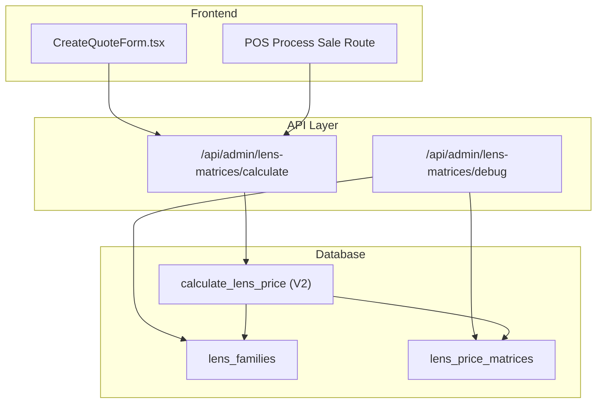
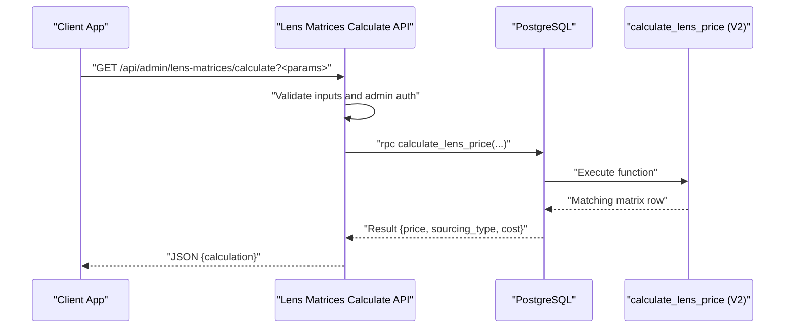
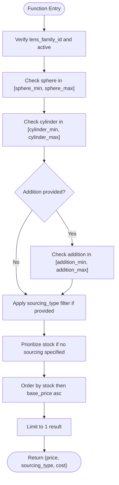
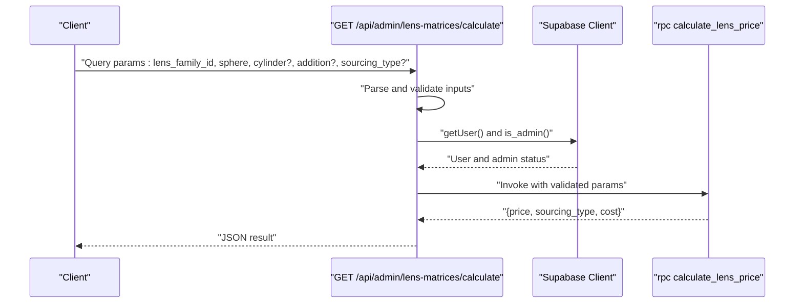
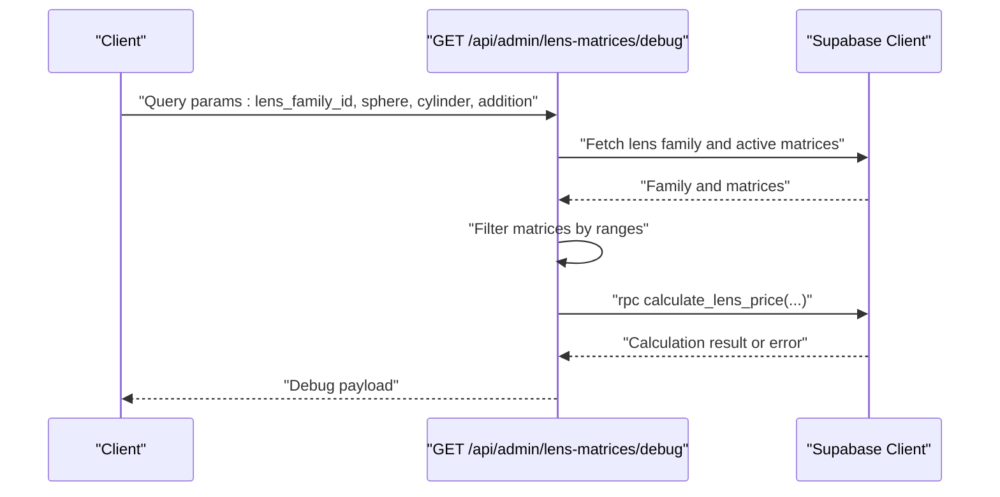
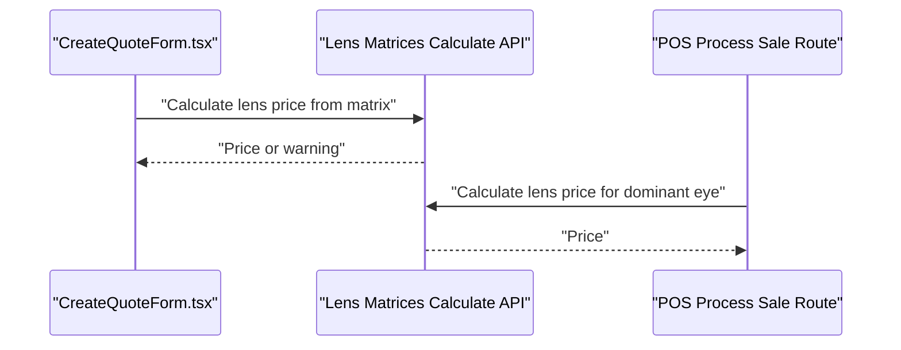
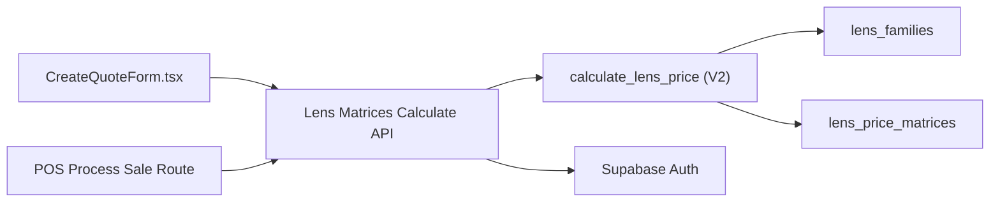

# Prescription Calculation Engine

<cite>
**Referenced Files in This Document**
- [prescription-helpers.ts](file://src/lib/prescription-helpers.ts)
- [lens-matrices-calculate-route.ts](file://src/app/api/admin/lens-matrices/calculate/route.ts)
- [lens-matrices-debug-route.ts](file://src/app/api/admin/lens-matrices/debug/route.ts)
- [test-lens-price-calculation.js](file://scripts/test-lens-price-calculation.js)
- [debug-prescriptions.js](file://debug-prescriptions.js)
- [calculate_lens_price (V2)](file://supabase/migrations/20260122000002_lens_matrices_v2_fix_schema.sql#L165-L198)
- [lens_families_and_matrices_schema](file://supabase/migrations/20260129000000_create_lens_families_and_matrices.sql)
- [LENS_PRICE_CALCULATION_SYSTEM.md](file://docs/LENS_PRICE_CALCULATION_SYSTEM.md)
- [process-sale-route.ts](file://src/app/api/admin/pos/process-sale/route.ts)
- [CreateQuoteForm.tsx](file://src/components/admin/CreateQuoteForm.tsx)
</cite>

## Table of Contents

1. [Introduction](#introduction)
2. [Project Structure](#project-structure)
3. [Core Components](#core-components)
4. [Architecture Overview](#architecture-overview)
5. [Detailed Component Analysis](#detailed-component-analysis)
6. [Dependency Analysis](#dependency-analysis)
7. [Performance Considerations](#performance-considerations)
8. [Troubleshooting Guide](#troubleshooting-guide)
9. [Conclusion](#conclusion)
10. [Appendices](#appendices)

## Introduction

This document explains the prescription calculation engine in Opttius, focusing on how lens parameters (sphere, cylinder, axis, addition) are processed, how price matrices are matched, and how optical properties are integrated with lens families. It documents the mathematical matching logic, the API endpoints, the PostgreSQL function that performs the pricing, and the client-side integration points used in quotes and POS. It also covers error handling, edge cases, and performance optimization strategies for real-time validation and pricing.

## Project Structure

The prescription calculation engine spans three layers:

- Frontend integration: Quote and POS flows that trigger price calculations.
- API layer: Admin endpoints that validate inputs and call the database function.
- Database layer: Lens families and price matrices with a robust matching function.

**Diagram sources**

- [CreateQuoteForm.tsx](file://src/components/admin/CreateQuoteForm.tsx#L409-L439)
- [process-sale-route.ts](file://src/app/api/admin/pos/process-sale/route.ts#L533-L551)
- [lens-matrices-calculate-route.ts](file://src/app/api/admin/lens-matrices/calculate/route.ts#L1-L159)
- [lens-matrices-debug-route.ts](file://src/app/api/admin/lens-matrices/debug/route.ts#L1-L176)
- [calculate_lens_price (V2)](file://supabase/migrations/20260122000002_lens_matrices_v2_fix_schema.sql#L165-L198)
- [lens_families_and_matrices_schema](file://supabase/migrations/20260129000000_create_lens_families_and_matrices.sql)

**Section sources**

- [CreateQuoteForm.tsx](file://src/components/admin/CreateQuoteForm.tsx#L409-L439)
- [process-sale-route.ts](file://src/app/api/admin/pos/process-sale/route.ts#L533-L551)
- [lens-matrices-calculate-route.ts](file://src/app/api/admin/lens-matrices/calculate/route.ts#L1-L159)
- [lens-matrices-debug-route.ts](file://src/app/api/admin/lens-matrices/debug/route.ts#L1-L176)
- [calculate_lens_price (V2)](file://supabase/migrations/20260122000eries/calculate_lens_price/range.sql#L165-L198)
- [lens_families_and_matrices_schema](file://supabase/migrations/20260129000000_create_lens_families_and_matrices.sql)

## Core Components

- Lens families define genetic optical properties (type and material) used by the pricing function.
- Price matrices define ranges for sphere, cylinder, and optional addition, plus sourcing type and costs.
- The PostgreSQL function matches a lens family and optical parameters to the best-fit matrix row.
- API endpoints validate inputs, enforce admin permissions, and return pricing results.
- Frontend components integrate pricing into quotes and POS workflows.

**Section sources**

- [lens_families_and_matrices_schema](file://supabase/migrations/20260129000000_create_lens_families_and_matrices.sql)
- [calculate_lens_price (V2)](file://supabase/migrations/20260122000002_lens_matrices_v2_fix_schema.sql#L165-L198)
- [lens-matrices-calculate-route.ts](file://src/app/api/admin/lens-matrices/calculate/route.ts#L1-L159)
- [CreateQuoteForm.tsx](file://src/components/admin/CreateQuoteForm.tsx#L409-L439)

## Architecture Overview

The engine follows a layered pattern:

- Input validation and authorization occur in the API layer.
- The database function encapsulates the matching logic and prioritization rules.
- Results are returned to the caller (frontend forms or services).

**Diagram sources**

- [lens-matrices-calculate-route.ts](file://src/app/api/admin/lens-matrices/calculate/route.ts#L17-L158)
- [calculate_lens_price (V2)](file://supabase/migrations/20260122000002_lens_matrices_v2_fix_schema.sql#L165-L198)

## Detailed Component Analysis

### Mathematical Matching and Pricing Algorithm

The core algorithm resides in the PostgreSQL function that:

- Joins lens families and price matrices.
- Filters by lens family ID and active status.
- Matches sphere and cylinder ranges (inclusive).
- Optionally filters by addition range when provided.
- Optionally filters by sourcing type when specified.
- Prioritizes stock sourcing when no explicit sourcing is requested.
- Selects the lowest base price among matches.

**Diagram sources**

- [calculate_lens_price (V2)](file://supabase/migrations/20260122000002_lens_matrices_v2_fix_schema.sql#L165-L198)

**Section sources**

- [calculate_lens_price (V2)](file://supabase/migrations/20260122000002_lens_matrices_v2_fix_schema.sql#L165-L198)
- [LENS_PRICE_CALCULATION_SYSTEM.md](file://docs/LENS_PRICE_CALCULATION_SYSTEM.md#L215-L226)

### API Endpoint: Lens Matrices Calculate

The calculate endpoint:

- Validates presence of lens family and sphere.
- Parses and validates numeric inputs (sphere, cylinder).
- Accepts optional addition and sourcing type.
- Calls the database function and returns the result or appropriate errors.

**Diagram sources**

- [lens-matrices-calculate-route.ts](file://src/app/api/admin/lens-matrices/calculate/route.ts#L17-L158)

**Section sources**

- [lens-matrices-calculate-route.ts](file://src/app/api/admin/lens-matrices/calculate/route.ts#L17-L158)

### API Endpoint: Lens Matrices Debug

The debug endpoint:

- Fetches lens family and all active matrices for the family.
- Computes matching matrices client-side based on ranges.
- Attempts the database calculation and returns both sets of results for comparison.

**Diagram sources**

- [lens-matrices-debug-route.ts](file://src/app/api/admin/lens-matrices/debug/route.ts#L16-L175)

**Section sources**

- [lens-matrices-debug-route.ts](file://src/app/api/admin/lens-matrices/debug/route.ts#L16-L175)

### Frontend Integration: Quotes and POS

- Quote form attempts to calculate lens price from matrix and falls back to manual entry if unavailable.
- POS sale logic selects the higher absolute sphere/cylinder for the dominant eye when computing price.

**Diagram sources**

- [CreateQuoteForm.tsx](file://src/components/admin/CreateQuoteForm.tsx#L409-L439)
- [process-sale-route.ts](file://src/app/api/admin/pos/process-sale/route.ts#L533-L551)
- [lens-matrices-calculate-route.ts](file://src/app/api/admin/lens-matrices/calculate/route.ts#L17-L158)

**Section sources**

- [CreateQuoteForm.tsx](file://src/components/admin/CreateQuoteForm.tsx#L409-L439)
- [process-sale-route.ts](file://src/app/api/admin/pos/process-sale/route.ts#L533-L551)

### Optical Parameter Handling: Sphere/Cylinder/Axis/Addition

- Sphere and cylinder are required for matrix matching; axis and addition are optional.
- The matching function accepts axis and addition parameters but does not constrain them in the V2 function; axis is not used for pricing in this function.
- Addition is supported for matching when present; otherwise, the function ignores it.

**Section sources**

- [calculate_lens_price (V2)](file://supabase/migrations/20260122000002_lens_matrices_v2_fix_schema.sql#L165-L198)
- [LENS_PRICE_CALCULATION_SYSTEM.md](file://docs/LENS_PRICE_CALCULATION_SYSTEM.md#L215-L226)

### Lens Families and Price Matrices Schema

- Lens families carry lens_type and lens_material used by the pricing function.
- Price matrices define inclusive ranges for sphere, cylinder, optional addition, sourcing type, and cost/price.
- Indexes optimize range queries on sphere and cylinder.

**Section sources**

- [lens_families_and_matrices_schema](file://supabase/migrations/20260129000000_create_lens_families_and_matrices.sql)
- [LENS_PRICE_CALCULATION_SYSTEM.md](file://docs/LENS_PRICE_CALCULATION_SYSTEM.md#L194-L213)

### Example Workflows from the Codebase

- Functional tests demonstrate:
  - Matrix addition ranges must be configured.
  - Direct RPC invocation succeeds for single vision and progressive with addition.
  - API endpoint returns pricing or appropriate errors.

**Section sources**

- [test-lens-price-calculation.js](file://scripts/test-lens-price-calculation.js#L26-L189)

## Dependency Analysis

The engine’s dependencies are intentionally decoupled:

- API routes depend on Supabase client and RPC.
- The RPC depends on lens families and matrices tables.
- Frontend components depend on API endpoints and handle failures gracefully.

**Diagram sources**

- [lens-matrices-calculate-route.ts](file://src/app/api/admin/lens-matrices/calculate/route.ts#L1-L159)
- [calculate_lens_price (V2)](file://supabase/migrations/20260122000002_lens_matrices_v2_fix_schema.sql#L165-L198)
- [CreateQuoteForm.tsx](file://src/components/admin/CreateQuoteForm.tsx#L409-L439)
- [process-sale-route.ts](file://src/app/api/admin/pos/process-sale/route.ts#L533-L551)

**Section sources**

- [lens-matrices-calculate-route.ts](file://src/app/api/admin/lens-matrices/calculate/route.ts#L1-L159)
- [calculate_lens_price (V2)](file://supabase/migrations/20260122000002_lens_matrices_v2_fix_schema.sql#L165-L198)
- [CreateQuoteForm.tsx](file://src/components/admin/CreateQuoteForm.tsx#L409-L439)
- [process-sale-route.ts](file://src/app/api/admin/pos/process-sale/route.ts#L533-L551)

## Performance Considerations

- Range indexes on sphere and cylinder enable efficient overlap checks.
- The function prioritizes stock sourcing when unspecified, reducing downstream decisions.
- Client-side filtering in the debug endpoint helps diagnose matching issues quickly.
- Recommendations:
  - Keep matrix granularity balanced to avoid excessive rows.
  - Prefer explicit sourcing when cost-sensitive to avoid extra sorting.
  - Cache frequently used lens families and recent calculations at the application level if needed.

**Section sources**

- [lens_families_and_matrices_schema](file://supabase/migrations/20260129000000_create_lens_families_and_matrices.sql)
- [calculate_lens_price (V2)](file://supabase/migrations/20260122000002_lens_matrices_v2_fix_schema.sql#L165-L198)

## Troubleshooting Guide

Common issues and resolutions:

- Unauthorized or missing admin privileges: Ensure the caller is authenticated and has admin status.
- Invalid or missing parameters: Verify lens_family_id and sphere are present and numeric.
- No matching matrix: Use the debug endpoint to inspect available matrices and ranges.
- Addition-related mismatches: Confirm addition_min/addition_max are configured for progressive families.
- Prescriptions column mismatch: Use the debug script to inspect the actual columns in the prescriptions table.

**Section sources**

- [lens-matrices-calculate-route.ts](file://src/app/api/admin/lens-matrices/calculate/route.ts#L21-L81)
- [lens-matrices-debug-route.ts](file://src/app/api/admin/lens-matrices/debug/route.ts#L47-L101)
- [test-lens-price-calculation.js](file://scripts/test-lens-price-calculation.js#L29-L51)
- [debug-prescriptions.js](file://debug-prescriptions.js#L10-L17)

## Conclusion

The Opttius prescription calculation engine cleanly separates concerns across frontend, API, and database layers. The V2 PostgreSQL function provides a robust, indexed matching algorithm that supports inclusive ranges for sphere and cylinder, optional addition, and sourcing-type preferences. The API endpoints and frontend integrations ensure reliable real-time pricing while gracefully handling edge cases.

## Appendices

### Appendix A: API Definitions

- Endpoint: GET /api/admin/lens-matrices/calculate
  - Query parameters: lens_family_id (UUID), sphere (number), cylinder (number, default 0), addition (number, optional), sourcing_type ("stock" or "surfaced", optional)
  - Returns: { calculation: { price, sourcing_type, cost } } or error

- Endpoint: GET /api/admin/lens-matrices/debug
  - Query parameters: lens_family_id (UUID), sphere (number), cylinder (number), addition (number, optional)
  - Returns: Debug payload including matching matrices and calculation result/error

**Section sources**

- [lens-matrices-calculate-route.ts](file://src/app/api/admin/lens-matrices/calculate/route.ts#L6-L16)
- [lens-matrices-debug-route.ts](file://src/app/api/admin/lens-matrices/debug/route.ts#L6-L15)

### Appendix B: Prescription Type Translation

Helper utilities for translating prescription types to display labels.

**Section sources**

- [prescription-helpers.ts](file://src/lib/prescription-helpers.ts#L1-L38)
