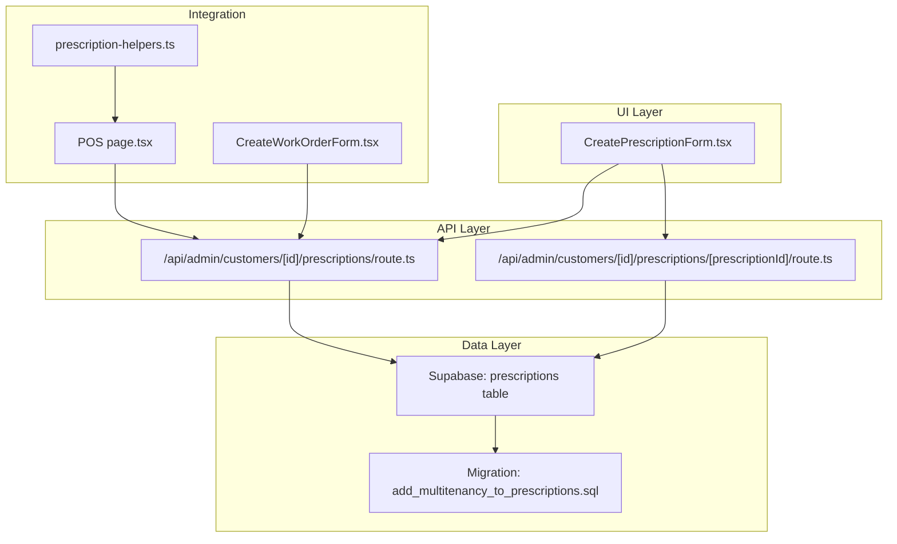
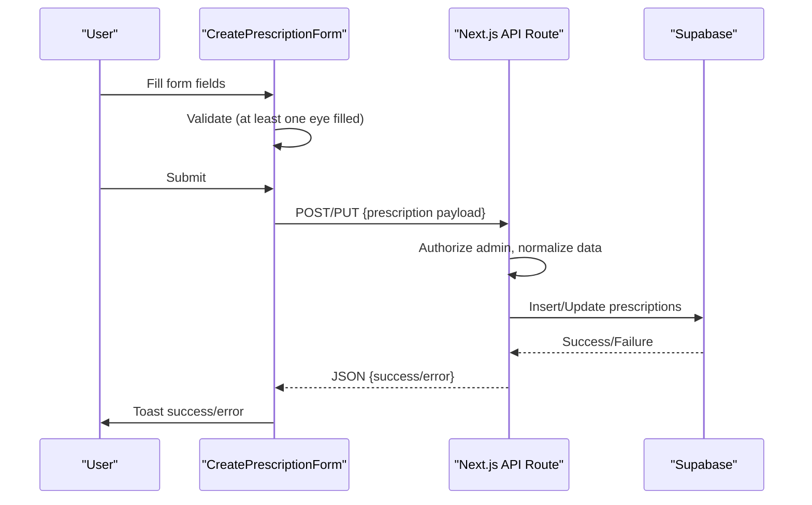
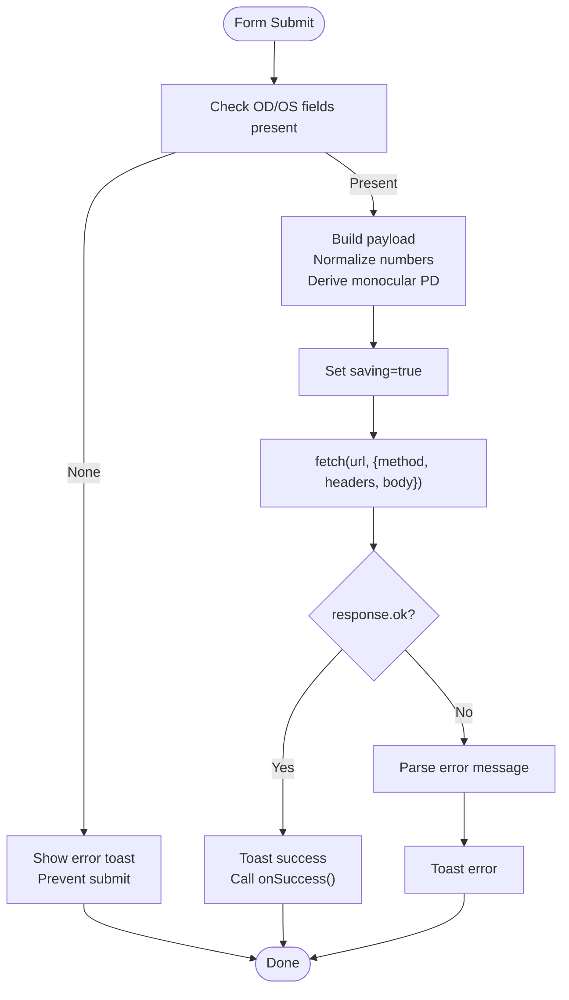
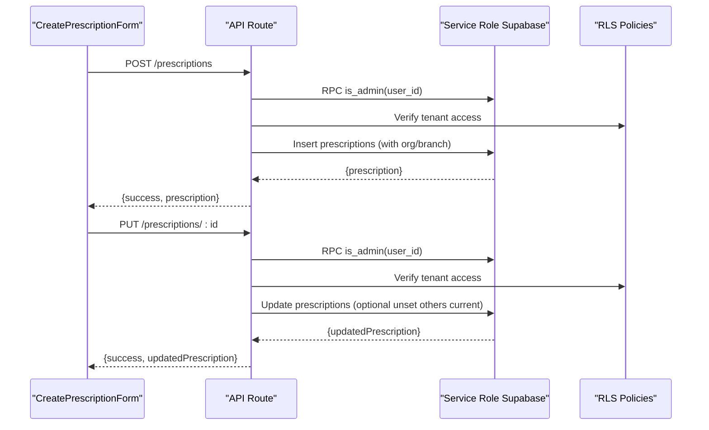
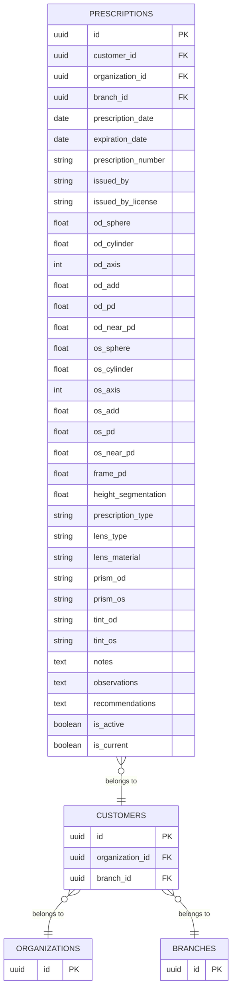
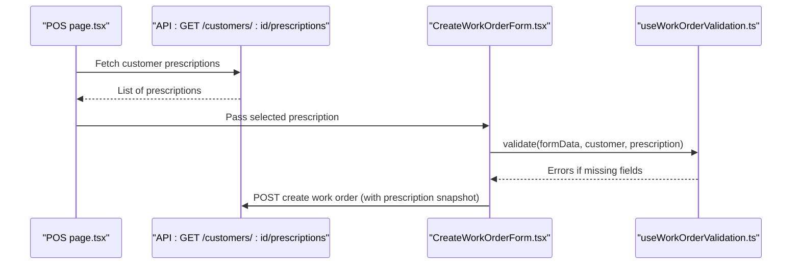
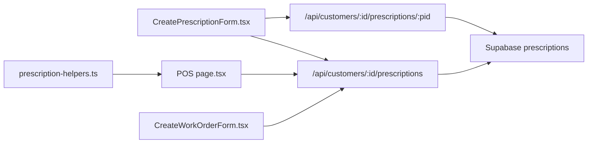

# Prescription Form Handling

<cite>
**Referenced Files in This Document**
- [CreatePrescriptionForm.tsx](file://src/components/admin/CreatePrescriptionForm.tsx)
- [prescription-helpers.ts](file://src/lib/prescription-helpers.ts)
- [route.ts](file://src/app/api/admin/customers/[id]/prescriptions/route.ts)
- [route.ts](file://src/app/api/admin/customers/[id]/prescriptions/[prescriptionId]/route.ts)
- [page.tsx](file://src/app/admin/customers/[id]/page.tsx)
- [page.tsx](file://src/app/admin/pos/page.tsx)
- [CreateWorkOrderForm.tsx](file://src/components/admin/CreateWorkOrderForm.tsx)
- [useWorkOrderValidation.ts](file://src/components/admin/CreateWorkOrderForm/hooks/useWorkOrderValidation.ts)
- [20260204000001_add_multitenancy_to_prescriptions.sql](file://supabase/migrations/20260204000001_add_multitenancy_to_prescriptions.sql)
- [debug-prescriptions.js](file://debug-prescriptions.js)
</cite>

## Table of Contents

1. [Introduction](#introduction)
2. [Project Structure](#project-structure)
3. [Core Components](#core-components)
4. [Architecture Overview](#architecture-overview)
5. [Detailed Component Analysis](#detailed-component-analysis)
6. [Dependency Analysis](#dependency-analysis)
7. [Performance Considerations](#performance-considerations)
8. [Troubleshooting Guide](#troubleshooting-guide)
9. [Conclusion](#conclusion)

## Introduction

This document explains the prescription form handling system in Opttius, focusing on the CreatePrescriptionForm component, validation rules, user interactions, and integrations with customer profiles, appointment scheduling, and work order generation. It also covers form field mappings to the underlying prescription data model, real-time validation feedback, error handling, accessibility and responsive design considerations, and internationalization support for medical forms.

## Project Structure

The prescription form system spans UI components, API routes, and database schema:

- UI: CreatePrescriptionForm renders and validates the form, manages state, and submits data via fetch.
- API: Next.js routes under /api/admin/customers/[id]/prescriptions handle CRUD operations with Supabase.
- Data model: Prescriptions table supports multi-tenancy via organization_id and branch_id.
- Helpers: Translation utilities for prescription types.
- Integrations: POS and Work Order flows consume prescription data.

**Diagram sources**

- [CreatePrescriptionForm.tsx](file://src/components/admin/CreatePrescriptionForm.tsx#L1-L770)
- [route.ts](file://src/app/api/admin/customers/[id]/prescriptions/route.ts#L1-L104)
- [route.ts](file://src/app/api/admin/customers/[id]/prescriptions/[prescriptionId]/route.ts#L1-L230)
- [20260204000001_add_multitenancy_to_prescriptions.sql](file://supabase/migrations/20260204000001_add_multitenancy_to_prescriptions.sql#L1-L59)
- [page.tsx](file://src/app/admin/pos/page.tsx#L3433-L3713)
- [CreateWorkOrderForm.tsx](file://src/components/admin/CreateWorkOrderForm.tsx#L29-L81)
- [prescription-helpers.ts](file://src/lib/prescription-helpers.ts#L1-L38)

**Section sources**

- [CreatePrescriptionForm.tsx](file://src/components/admin/CreatePrescriptionForm.tsx#L1-L770)
- [route.ts](file://src/app/api/admin/customers/[id]/prescriptions/route.ts#L1-L104)
- [route.ts](file://src/app/api/admin/customers/[id]/prescriptions/[prescriptionId]/route.ts#L1-L230)
- [20260204000001_add_multitenancy_to_prescriptions.sql](file://supabase/migrations/20260204000001_add_multitenancy_to_prescriptions.sql#L1-L59)
- [prescription-helpers.ts](file://src/lib/prescription-helpers.ts#L1-L38)

## Core Components

- CreatePrescriptionForm: Client-side form component managing state, validation, and submission to the backend.
- API Routes: Server handlers for listing, creating, updating, and deleting prescriptions per customer.
- Prescription Helpers: Utilities for translating and enumerating prescription types.
- POS and Work Order: Consumers of prescription data for external flows.

Key responsibilities:

- Validate presence of at least one eye’s prescription data.
- Normalize numeric fields and derive monocular PD from binocular PD.
- Enforce tenant-aware access via organization_id and branch_id.
- Provide real-time feedback via toast notifications and disabled states during save.

**Section sources**

- [CreatePrescriptionForm.tsx](file://src/components/admin/CreatePrescriptionForm.tsx#L143-L230)
- [route.ts](file://src/app/api/admin/customers/[id]/prescriptions/route.ts#L58-L104)
- [route.ts](file://src/app/api/admin/customers/[id]/prescriptions/[prescriptionId]/route.ts#L68-L172)
- [prescription-helpers.ts](file://src/lib/prescription-helpers.ts#L15-L37)

## Architecture Overview

The form follows a unidirectional data flow: user input updates local state, validation runs before submission, and the component performs a fetch to the appropriate API endpoint. The API routes enforce admin authorization, normalize incoming data, and apply multi-tenant row-level security policies.

**Diagram sources**

- [CreatePrescriptionForm.tsx](file://src/components/admin/CreatePrescriptionForm.tsx#L143-L230)
- [route.ts](file://src/app/api/admin/customers/[id]/prescriptions/[prescriptionId]/route.ts#L68-L172)

## Detailed Component Analysis

### CreatePrescriptionForm Component

- State management: Centralized in a single object covering dates, provider info, spherical/cylindrical/axis/add values for both eyes, pupillary distances, frame measurements, lens recommendations, special requirements, notes, and status flags.
- Validation:
  - Prevents submission if neither right nor left eye has any values.
  - Converts numeric strings to numbers for OD/OS sphere/cylinder/axis/add, derives monocular PD from binocular PD, and sets null for optional fields.
- Submission:
  - Chooses endpoint based on initialData presence (create vs update).
  - Uses fetch with JSON body and handles non-OK responses by parsing error messages.
  - Provides loading state and success/error toasts.

**Diagram sources**

- [CreatePrescriptionForm.tsx](file://src/components/admin/CreatePrescriptionForm.tsx#L143-L230)

**Section sources**

- [CreatePrescriptionForm.tsx](file://src/components/admin/CreatePrescriptionForm.tsx#L34-L97)
- [CreatePrescriptionForm.tsx](file://src/components/admin/CreatePrescriptionForm.tsx#L143-L230)

### API Routes for Prescriptions

- GET all prescriptions for a customer: Returns ordered list by prescription_date descending.
- POST create: Validates admin, optionally unsets other current prescriptions if marking as current, links organization_id and branch_id from customer, and inserts the record.
- PUT update: Validates admin, optionally unsets other current prescriptions if marking as current, updates all fields, and returns updated record.
- DELETE: Validates admin and deletes the specified prescription.

**Diagram sources**

- [route.ts](file://src/app/api/admin/customers/[id]/prescriptions/route.ts#L58-L104)
- [route.ts](file://src/app/api/admin/customers/[id]/prescriptions/[prescriptionId]/route.ts#L68-L172)
- [20260204000001_add_multitenancy_to_prescriptions.sql](file://supabase/migrations/20260204000001_add_multitenancy_to_prescriptions.sql#L25-L54)

**Section sources**

- [route.ts](file://src/app/api/admin/customers/[id]/prescriptions/route.ts#L1-L104)
- [route.ts](file://src/app/api/admin/customers/[id]/prescriptions/[prescriptionId]/route.ts#L1-L230)

### Prescription Data Model and Multi-Tenancy

- Columns include patient measurements, lens recommendations, and status flags.
- Migration adds organization_id and branch_id to prescriptions and updates RLS policies to restrict access to the user’s organization or root users.
- Indexes are created on organization_id and branch_id for performance.

**Diagram sources**

- [20260204000001_add_multitenancy_to_prescriptions.sql](file://supabase/migrations/20260204000001_add_multitenancy_to_prescriptions.sql#L1-L59)

**Section sources**

- [20260204000001_add_multitenancy_to_prescriptions.sql](file://supabase/migrations/20260204000001_add_multitenancy_to_prescriptions.sql#L1-L59)
- [debug-prescriptions.js](file://debug-prescriptions.js#L1-L19)

### Integration with Customer Profiles

- The customer page displays a tabbed view of prescriptions, showing OD/OS measurements, issuer, type, and notes.
- It provides actions to create the first prescription or navigate to the form.

**Section sources**

- [page.tsx](file://src/app/admin/customers/[id]/page.tsx#L900-L1000)

### Integration with POS and Work Orders

- POS page allows selecting a customer’s prescriptions and entering external prescription details.
- Work Order form requires a customer, a prescription, lens type/material, and frame name; validation ensures completeness before enabling submission.

**Diagram sources**

- [page.tsx](file://src/app/admin/pos/page.tsx#L3433-L3713)
- [CreateWorkOrderForm.tsx](file://src/components/admin/CreateWorkOrderForm.tsx#L29-L81)
- [useWorkOrderValidation.ts](file://src/components/admin/CreateWorkOrderForm/hooks/useWorkOrderValidation.ts#L50-L95)

**Section sources**

- [page.tsx](file://src/app/admin/pos/page.tsx#L3433-L3713)
- [CreateWorkOrderForm.tsx](file://src/components/admin/CreateWorkOrderForm.tsx#L29-L81)
- [useWorkOrderValidation.ts](file://src/components/admin/CreateWorkOrderForm/hooks/useWorkOrderValidation.ts#L50-L95)

### Form Field Mappings and Validation Rules

- Required fields:
  - Prescription date is required.
  - At least one eye must have sphere/cylinder/add values.
- Numeric normalization:
  - Sphere/cylinder/add converted to float; axis to integer.
  - Pupillary distance derived as half of binocular PD for monocular fields.
- Optional fields:
  - Expiration date, license, frame PD, height segmentation, prism/tint values, notes/observations/recommendations.
- Status toggles:
  - is_active and is_current flags control visibility and primary status.

**Section sources**

- [CreatePrescriptionForm.tsx](file://src/components/admin/CreatePrescriptionForm.tsx#L245-L310)
- [CreatePrescriptionForm.tsx](file://src/components/admin/CreatePrescriptionForm.tsx#L146-L153)
- [CreatePrescriptionForm.tsx](file://src/components/admin/CreatePrescriptionForm.tsx#L172-L209)

### Real-Time Validation Feedback and Error Handling

- Immediate client-side validation prevents submission without any eye data.
- Toast notifications provide success and error feedback after fetch.
- API routes return structured errors with messages for display.

**Section sources**

- [CreatePrescriptionForm.tsx](file://src/components/admin/CreatePrescriptionForm.tsx#L150-L153)
- [CreatePrescriptionForm.tsx](file://src/components/admin/CreatePrescriptionForm.tsx#L213-L229)
- [route.ts](file://src/app/api/admin/customers/[id]/prescriptions/[prescriptionId]/route.ts#L152-L159)

### Examples of Form Workflows

#### Glasses (Single Vision)

- Fill right/left eye sphere values.
- Optionally set cylinder/axis/add for correction needs.
- Choose lens type and material suitable for single vision.
- Set is_current if applicable.

#### Contact Lenses

- Select “Contact Lens” type in the lens recommendation section.
- Enter base curve, diameter, and brand-specific parameters as needed.
- Choose appropriate coatings (e.g., anti-reflection, blue light filter).

#### Multifocal Designs (Bifocal/Trifocal/Progressive)

- Enter height segmentation for bifocal/trifocal.
- For progressive, ensure accurate PD values and consider prism/tint adjustments.
- Select lens type as “Progressive” or “Bifocal.”

Note: These workflows describe typical data entry patterns aligned with the form’s fields and lens recommendation controls.

**Section sources**

- [CreatePrescriptionForm.tsx](file://src/components/admin/CreatePrescriptionForm.tsx#L587-L661)

### Accessibility and Responsive Design

- Uses semantic labels and inputs for screen readers.
- Grid layouts adapt to smaller screens for optimal readability.
- Disabled states prevent submissions while saving.
- Clear visual hierarchy and spacing improve usability.

[No sources needed since this section provides general guidance]

### Internationalization Support

- Prescription type labels are localized to Spanish for UI presentation.
- POS and customer pages display labels in Spanish, indicating locale-aware rendering.

**Section sources**

- [prescription-helpers.ts](file://src/lib/prescription-helpers.ts#L5-L13)
- [page.tsx](file://src/app/admin/pos/page.tsx#L3433-L3447)

## Dependency Analysis

- CreatePrescriptionForm depends on:
  - UI primitives (Button, Input, Select, Textarea, Switch).
  - Local state and fetch for persistence.
- API routes depend on:
  - Supabase client and service role for tenant-aware operations.
  - Row-level security policies enforcing organization isolation.
- POS and Work Order forms depend on:
  - API endpoints for retrieving prescriptions and creating work orders.

**Diagram sources**

- [CreatePrescriptionForm.tsx](file://src/components/admin/CreatePrescriptionForm.tsx#L157-L159)
- [route.ts](file://src/app/api/admin/customers/[id]/prescriptions/route.ts#L58-L104)
- [route.ts](file://src/app/api/admin/customers/[id]/prescriptions/[prescriptionId]/route.ts#L68-L172)
- [page.tsx](file://src/app/admin/pos/page.tsx#L3433-L3713)
- [CreateWorkOrderForm.tsx](file://src/components/admin/CreateWorkOrderForm.tsx#L29-L81)
- [prescription-helpers.ts](file://src/lib/prescription-helpers.ts#L15-L37)

**Section sources**

- [CreatePrescriptionForm.tsx](file://src/components/admin/CreatePrescriptionForm.tsx#L1-L770)
- [route.ts](file://src/app/api/admin/customers/[id]/prescriptions/route.ts#L1-L104)
- [route.ts](file://src/app/api/admin/customers/[id]/prescriptions/[prescriptionId]/route.ts#L1-L230)
- [page.tsx](file://src/app/admin/pos/page.tsx#L3433-L3713)
- [CreateWorkOrderForm.tsx](file://src/components/admin/CreateWorkOrderForm.tsx#L29-L81)
- [prescription-helpers.ts](file://src/lib/prescription-helpers.ts#L1-L38)

## Performance Considerations

- Minimize re-renders by consolidating state updates in batched setters.
- Normalize numeric fields early to avoid repeated conversions.
- Use disabled buttons during save to prevent duplicate submissions.
- Database queries leverage indexes on organization_id and branch_id for efficient filtering.

[No sources needed since this section provides general guidance]

## Troubleshooting Guide

- Validation fails with “At least one eye must have data”:
  - Ensure either OD or OS has sphere/cylinder/add values.
- API returns unauthorized or forbidden:
  - Confirm admin role and proper tenant context.
- Multi-tenancy mismatch:
  - Verify organization_id and branch_id linkage in prescriptions and customer records.
- Missing columns in prescriptions table:
  - Run the multitenancy migration to add organization_id and branch_id.

**Section sources**

- [CreatePrescriptionForm.tsx](file://src/components/admin/CreatePrescriptionForm.tsx#L150-L153)
- [route.ts](file://src/app/api/admin/customers/[id]/prescriptions/[prescriptionId]/route.ts#L15-L32)
- [20260204000001_add_multitenancy_to_prescriptions.sql](file://supabase/migrations/20260204000001_add_multitenancy_to_prescriptions.sql#L1-L59)
- [debug-prescriptions.js](file://debug-prescriptions.js#L10-L17)

## Conclusion

The CreatePrescriptionForm integrates tightly with backend APIs and database policies to provide a robust, tenant-aware, and user-friendly interface for capturing and managing patient prescriptions. Its validation, normalization, and integration points support downstream workflows like POS and Work Orders, while localization and responsive design improve usability across locales and devices.
