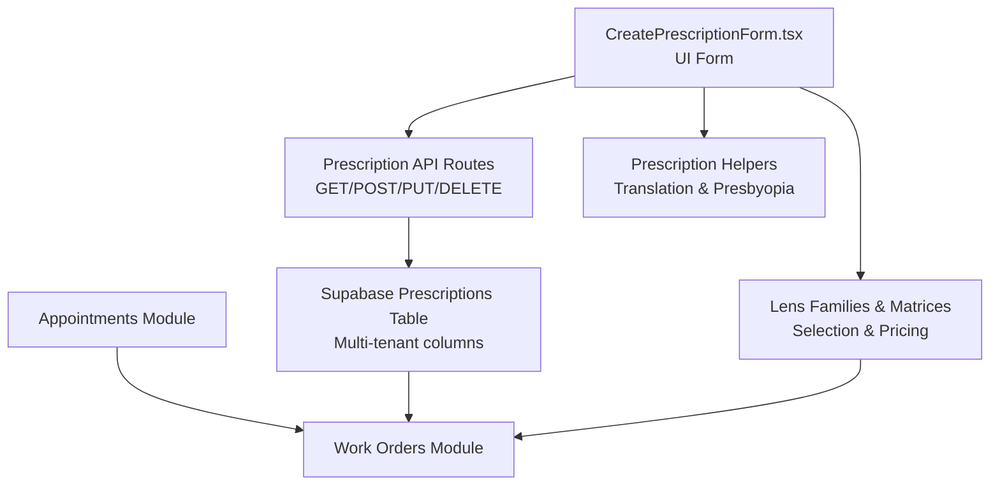
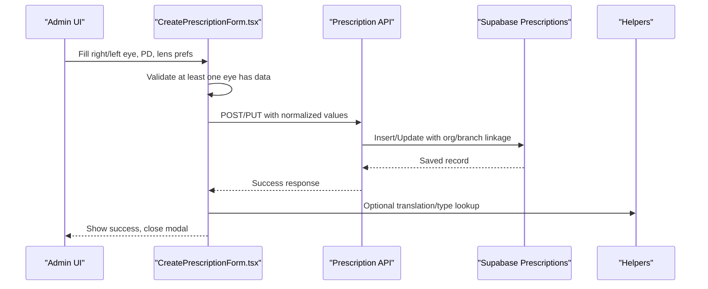
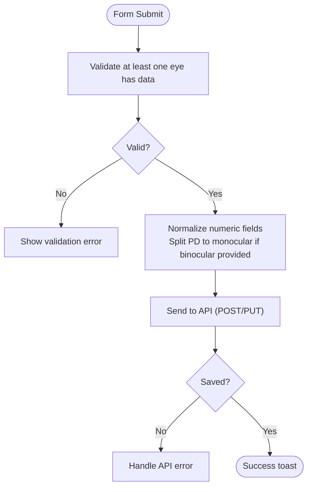
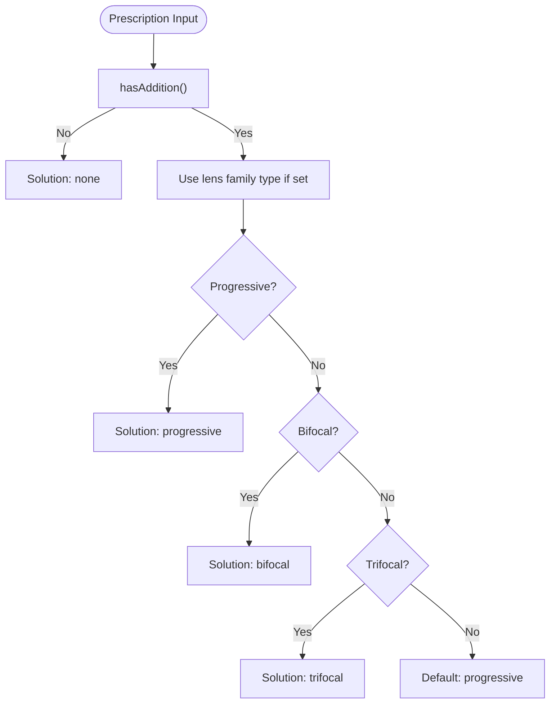
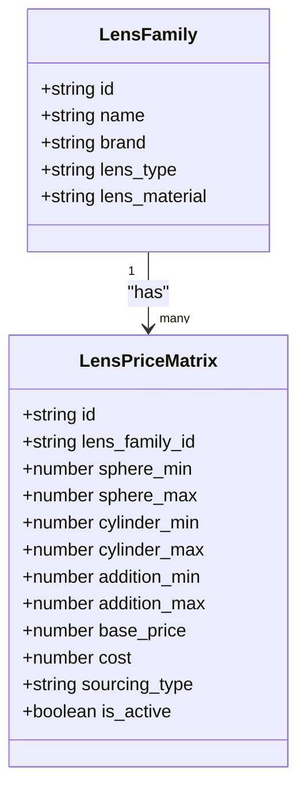
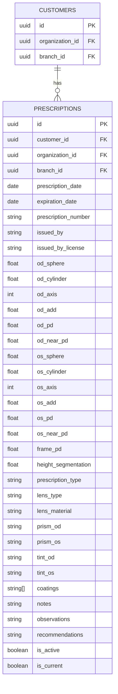
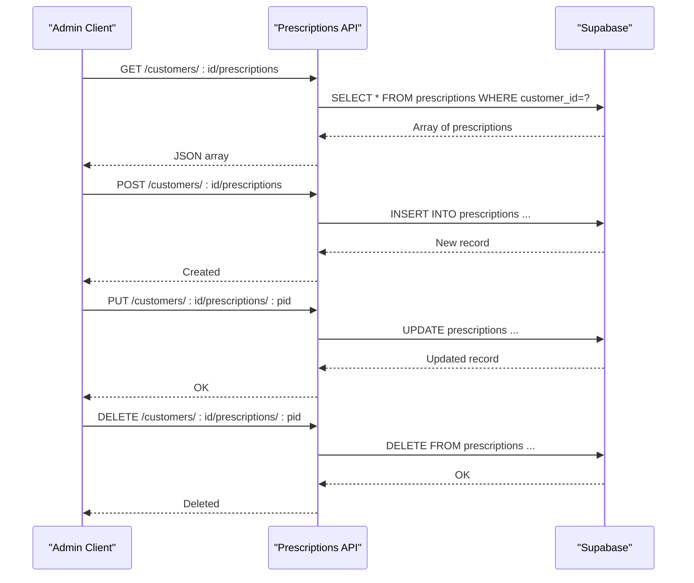
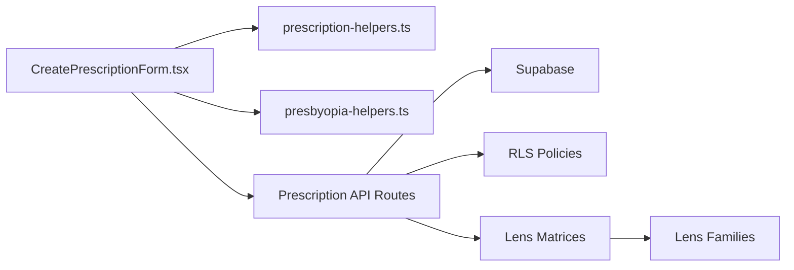

# Prescription Management

<cite>
**Referenced Files in This Document**
- [CreatePrescriptionForm.tsx](file://src/components/admin/CreatePrescriptionForm.tsx)
- [prescription-helpers.ts](file://src/lib/prescription-helpers.ts)
- [presbyopia-helpers.ts](file://src/lib/presbyopia-helpers.ts)
- [prescriptions route.ts](file://src/app/api/admin/customers/[id]/prescriptions/route.ts)
- [prescription route.ts](file://src/app/api/admin/customers/[id]/prescriptions/[prescriptionId]/route.ts)
- [debug-prescriptions.js](file://debug-prescriptions.js)
- [add_multitenancy_to_prescriptions.sql](file://supabase/migrations/20260204000001_add_multitenancy_to_prescriptions.sql)
- [lens-matrices page.tsx](file://src/app/admin/lens-matrices/page.tsx)
- [lens-families detail page.tsx](file://src/app/admin/lens-families/[id]/page.tsx)
</cite>

## Table of Contents

1. [Introduction](#introduction)
2. [Project Structure](#project-structure)
3. [Core Components](#core-components)
4. [Architecture Overview](#architecture-overview)
5. [Detailed Component Analysis](#detailed-component-analysis)
6. [Dependency Analysis](#dependency-analysis)
7. [Performance Considerations](#performance-considerations)
8. [Troubleshooting Guide](#troubleshooting-guide)
9. [Conclusion](#conclusion)
10. [Appendices](#appendices)

## Introduction

This document explains the optical prescription management system in Opttius, covering the end-to-end workflow for capturing, validating, calculating, and tracking prescriptions. It documents how right/left eye measurements (sphere, cylinder, axis, addition) are handled, how binocular pupillary distance (PD) and near-use PD are processed, and how lens type/material/treatments are configured and applied. It also describes the relationships with customer profiles, appointment scheduling, and work order generation, along with terminology, units, and international standards alignment.

## Project Structure

Prescription management spans UI forms, API routes, helper libraries, and optical pricing matrices. The key areas are:

- Prescription creation UI: [CreatePrescriptionForm.tsx](file://src/components/admin/CreatePrescriptionForm.tsx)
- API endpoints for CRUD operations: [prescriptions route.ts](file://src/app/api/admin/customers/[id]/prescriptions/route.ts), [prescription route.ts](file://src/app/api/admin/customers/[id]/prescriptions/[prescriptionId]/route.ts)
- Helper utilities for translations and presbyopia logic: [prescription-helpers.ts](file://src/lib/prescription-helpers.ts), [presbyopia-helpers.ts](file://src/lib/presbyopia-helpers.ts)
- Lens families and price matrices for lens selection and pricing: [lens-matrices page.tsx](file://src/app/admin/lens-matrices/page.tsx), [lens-families detail page.tsx](file://src/app/admin/lens-families/[id]/page.tsx)
- Multi-tenancy migration for prescriptions: [add_multitenancy_to_prescriptions.sql](file://supabase/migrations/20260204000001_add_multitenancy_to_prescriptions.sql)
- Debugging tool to inspect columns: [debug-prescriptions.js](file://debug-prescriptions.js)

**Diagram sources**

- [CreatePrescriptionForm.tsx](file://src/components/admin/CreatePrescriptionForm.tsx#L1-L770)
- [prescriptions route.ts](file://src/app/api/admin/customers/[id]/prescriptions/route.ts#L1-L167)
- [prescription route.ts](file://src/app/api/admin/customers/[id]/prescriptions/[prescriptionId]/route.ts#L1-L231)
- [prescription-helpers.ts](file://src/lib/prescription-helpers.ts#L1-L38)
- [presbyopia-helpers.ts](file://src/lib/presbyopia-helpers.ts#L1-L169)
- [lens-matrices page.tsx](file://src/app/admin/lens-matrices/page.tsx#L1-L800)
- [lens-families detail page.tsx](file://src/app/admin/lens-families/[id]/page.tsx#L1-L16)

**Section sources**

- [CreatePrescriptionForm.tsx](file://src/components/admin/CreatePrescriptionForm.tsx#L1-L770)
- [prescriptions route.ts](file://src/app/api/admin/customers/[id]/prescriptions/route.ts#L1-L167)
- [prescription route.ts](file://src/app/api/admin/customers/[id]/prescriptions/[prescriptionId]/route.ts#L1-L231)
- [prescription-helpers.ts](file://src/lib/prescription-helpers.ts#L1-L38)
- [presbyopia-helpers.ts](file://src/lib/presbyopia-helpers.ts#L1-L169)
- [lens-matrices page.tsx](file://src/app/admin/lens-matrices/page.tsx#L1-L800)
- [lens-families detail page.tsx](file://src/app/admin/lens-families/[id]/page.tsx#L1-L16)
- [add_multitenancy_to_prescriptions.sql](file://supabase/migrations/20260204000001_add_multitenancy_to_prescriptions.sql#L1-L59)
- [debug-prescriptions.js](file://debug-prescriptions.js#L1-L20)

## Core Components

- Prescription form (right/left eye, PD, lens recommendations, notes, status)
- API endpoints for customer-prescription CRUD with admin authorization checks
- Helper utilities for translating lens types and computing presbyopia-related metrics
- Lens families and matrices for lens type/material/treatment selection and pricing
- Multi-tenancy enforcement via organization_id and branch_id on prescriptions

Key implementation highlights:

- Right/left eye measurements are captured separately with SPH/CYL/AXIS/ADD fields.
- Binocular PD is split evenly for monocular PD fields when saved.
- Addition power management supports presbyopia solutions (progressive, bifocal, trifocal, reading).
- Lens type, material, and coatings are configurable and surfaced in the form.
- Current/active flags enable primary prescription tracking per customer.

**Section sources**

- [CreatePrescriptionForm.tsx](file://src/components/admin/CreatePrescriptionForm.tsx#L34-L97)
- [CreatePrescriptionForm.tsx](file://src/components/admin/CreatePrescriptionForm.tsx#L146-L230)
- [prescriptions route.ts](file://src/app/api/admin/customers/[id]/prescriptions/route.ts#L90-L148)
- [prescription route.ts](file://src/app/api/admin/customers/[id]/prescriptions/[prescriptionId]/route.ts#L98-L147)
- [prescription-helpers.ts](file://src/lib/prescription-helpers.ts#L5-L37)
- [presbyopia-helpers.ts](file://src/lib/presbyopia-helpers.ts#L25-L116)
- [lens-matrices page.tsx](file://src/app/admin/lens-matrices/page.tsx#L69-L86)

## Architecture Overview

The system follows a layered architecture:

- UI layer: Prescription form captures patient data and lens preferences.
- API layer: Next.js routes enforce admin authorization and interact with Supabase.
- Data layer: Prescriptions table stores clinical and lens recommendation data with multi-tenancy.
- Business logic: Helpers compute presbyopia metrics and translate labels.
- Lens ecosystem: Lens families and matrices provide configuration and pricing.

**Diagram sources**

- [CreatePrescriptionForm.tsx](file://src/components/admin/CreatePrescriptionForm.tsx#L146-L230)
- [prescriptions route.ts](file://src/app/api/admin/customers/[id]/prescriptions/route.ts#L58-L166)
- [prescription route.ts](file://src/app/api/admin/customers/[id]/prescriptions/[prescriptionId]/route.ts#L68-L172)
- [prescription-helpers.ts](file://src/lib/prescription-helpers.ts#L20-L37)

## Detailed Component Analysis

### Prescription Creation and Validation

- Fields captured:
  - Right eye (OD): SPH, CYL, AXIS, ADD
  - Left eye (OS): SPH, CYL, AXIS, ADD
  - Binocular PD and near-use PD
  - Lens type, material, coatings
  - Issuer info, expiration, notes
  - Active/current flags
- Validation:
  - At least one eye must have values (SPH/CYL/ADD).
  - Numeric fields use step increments appropriate for diopters.
  - PD values are split evenly into monocular PD on save.
- Submission:
  - POST creates a new prescription linked to the customer and multi-tenant context.
  - PUT updates existing records and enforces “current” exclusivity.

**Diagram sources**

- [CreatePrescriptionForm.tsx](file://src/components/admin/CreatePrescriptionForm.tsx#L146-L230)
- [prescriptions route.ts](file://src/app/api/admin/customers/[id]/prescriptions/route.ts#L106-L148)
- [prescription route.ts](file://src/app/api/admin/customers/[id]/prescriptions/[prescriptionId]/route.ts#L108-L147)

**Section sources**

- [CreatePrescriptionForm.tsx](file://src/components/admin/CreatePrescriptionForm.tsx#L34-L97)
- [CreatePrescriptionForm.tsx](file://src/components/admin/CreatePrescriptionForm.tsx#L146-L230)
- [prescriptions route.ts](file://src/app/api/admin/customers/[id]/prescriptions/route.ts#L90-L148)
- [prescription route.ts](file://src/app/api/admin/customers/[id]/prescriptions/[prescriptionId]/route.ts#L98-L147)

### Addition Power Management and Presbyopia Logic

- Functions determine presence, maximum, and average addition values.
- Near sphere is computed as far sphere plus maximum addition.
- Default presbyopia solution is derived from lens family type or defaults to progressive.
- Compatibility checks ensure lens families match intended presbyopia solution.

**Diagram sources**

- [presbyopia-helpers.ts](file://src/lib/presbyopia-helpers.ts#L25-L116)

**Section sources**

- [presbyopia-helpers.ts](file://src/lib/presbyopia-helpers.ts#L25-L116)

### Lens Types, Materials, and Treatments Configuration

- Lens types supported include single vision, bifocal, trifocal, progressive, reading, computer, sports.
- Materials include CR-39, polycarbonate, high-index variants, Trivex, glass.
- Coatings include anti-reflective, blue light filter, UV protection, scratch-resistant, anti-fog, photochromic, polarized.
- Lens families define lens_type and lens_material; matrices define pricing ranges by SPH/CYL/ADD and sourcing type.

**Diagram sources**

- [lens-matrices page.tsx](file://src/app/admin/lens-matrices/page.tsx#L45-L67)

**Section sources**

- [CreatePrescriptionForm.tsx](file://src/components/admin/CreatePrescriptionForm.tsx#L99-L126)
- [lens-matrices page.tsx](file://src/app/admin/lens-matrices/page.tsx#L69-L86)
- [lens-matrices page.tsx](file://src/app/admin/lens-matrices/page.tsx#L105-L117)

### Multi-Tenancy and Data Model

- Prescriptions are linked to organization_id and branch_id for tenant isolation.
- RLS policies restrict access to users’ own organization or root users.
- Migration populates tenant columns from customer records and adds indexes.

**Diagram sources**

- [add_multitenancy_to_prescriptions.sql](file://supabase/migrations/20260204000001_add_multitenancy_to_prescriptions.sql#L4-L59)

**Section sources**

- [add_multitenancy_to_prescriptions.sql](file://supabase/migrations/20260204000001_add_multitenancy_to_prescriptions.sql#L1-L59)
- [debug-prescriptions.js](file://debug-prescriptions.js#L10-L19)

### API Workflows

- GET all prescriptions for a customer ordered by most recent date.
- POST creates a new prescription, auto-linking organization/branch from customer, and enforcing “current” exclusivity.
- PUT updates a specific prescription and similarly manages “current” flag.
- DELETE removes a prescription.

**Diagram sources**

- [prescriptions route.ts](file://src/app/api/admin/customers/[id]/prescriptions/route.ts#L6-L56)
- [prescriptions route.ts](file://src/app/api/admin/customers/[id]/prescriptions/route.ts#L58-L166)
- [prescription route.ts](file://src/app/api/admin/customers/[id]/prescriptions/[prescriptionId]/route.ts#L7-L66)
- [prescription route.ts](file://src/app/api/admin/customers/[id]/prescriptions/[prescriptionId]/route.ts#L68-L172)
- [prescription route.ts](file://src/app/api/admin/customers/[id]/prescriptions/[prescriptionId]/route.ts#L174-L231)

**Section sources**

- [prescriptions route.ts](file://src/app/api/admin/customers/[id]/prescriptions/route.ts#L6-L56)
- [prescriptions route.ts](file://src/app/api/admin/customers/[id]/prescriptions/route.ts#L58-L166)
- [prescription route.ts](file://src/app/api/admin/customers/[id]/prescriptions/[prescriptionId]/route.ts#L7-L66)
- [prescription route.ts](file://src/app/api/admin/customers/[id]/prescriptions/[prescriptionId]/route.ts#L68-L172)
- [prescription route.ts](file://src/app/api/admin/customers/[id]/prescriptions/[prescriptionId]/route.ts#L174-L231)

## Dependency Analysis

- UI depends on:
  - Form state and validation logic
  - Helper utilities for translations and presbyopia computations
  - Lens families and matrices for lens selection
- API depends on:
  - Supabase client and service role for secure writes
  - Authorization RPC (is_admin) and RLS policies
- Data model depends on:
  - Multi-tenancy columns and indexes
  - Customer organization/branch linkage

**Diagram sources**

- [CreatePrescriptionForm.tsx](file://src/components/admin/CreatePrescriptionForm.tsx#L1-L770)
- [prescription-helpers.ts](file://src/lib/prescription-helpers.ts#L1-L38)
- [presbyopia-helpers.ts](file://src/lib/presbyopia-helpers.ts#L1-L169)
- [prescriptions route.ts](file://src/app/api/admin/customers/[id]/prescriptions/route.ts#L1-L167)
- [prescription route.ts](file://src/app/api/admin/customers/[id]/prescriptions/[prescriptionId]/route.ts#L1-L231)
- [lens-matrices page.tsx](file://src/app/admin/lens-matrices/page.tsx#L1-L800)

**Section sources**

- [CreatePrescriptionForm.tsx](file://src/components/admin/CreatePrescriptionForm.tsx#L1-L770)
- [prescription-helpers.ts](file://src/lib/prescription-helpers.ts#L1-L38)
- [presbyopia-helpers.ts](file://src/lib/presbyopia-helpers.ts#L1-L169)
- [prescriptions route.ts](file://src/app/api/admin/customers/[id]/prescriptions/route.ts#L1-L167)
- [prescription route.ts](file://src/app/api/admin/customers/[id]/prescriptions/[prescriptionId]/route.ts#L1-L231)
- [lens-matrices page.tsx](file://src/app/admin/lens-matrices/page.tsx#L1-L800)

## Performance Considerations

- Prefer filtering and pagination on the client for lens matrices to reduce payload sizes.
- Use indexes on organization_id and branch_id for fast tenant-scoped queries.
- Normalize numeric inputs to avoid unnecessary string conversions.
- Batch updates for “current” flag to minimize redundant writes.

## Troubleshooting Guide

Common issues and resolutions:

- Unauthorized access: Ensure the admin authorization RPC passes and RLS policies are intact.
- Missing tenant columns: Run the multi-tenancy migration to add organization_id and branch_id.
- Invalid form submission: Verify at least one eye has data; ensure numeric steps align with diopter increments.
- Presbyopia mismatch: Confirm lens family type matches the intended presbyopia solution.

**Section sources**

- [prescriptions route.ts](file://src/app/api/admin/customers/[id]/prescriptions/route.ts#L15-L32)
- [prescription route.ts](file://src/app/api/admin/customers/[id]/prescriptions/[prescriptionId]/route.ts#L15-L32)
- [add_multitenancy_to_prescriptions.sql](file://supabase/migrations/20260204000001_add_multitenancy_to_prescriptions.sql#L25-L54)
- [CreatePrescriptionForm.tsx](file://src/components/admin/CreatePrescriptionForm.tsx#L146-L153)

## Conclusion

Opttius provides a robust, multi-tenant prescription management system with comprehensive optical data capture, validation, and lens configuration. The UI form supports standard clinical fields and lens preferences, while the API enforces admin authorization and tenant isolation. Helpers streamline presbyopia logic and label translation, and lens families/matrices enable precise pricing and compatibility checks. Together, these components support efficient workflow from prescription capture to work order generation.

## Appendices

### Optical Terminology and Units

- SPH: Sphere (diopters)
- CYL: Cylinder (diopters)
- AXIS: Axis (degrees 0–180)
- ADD: Addition (dioptric near addition for presbyopia)
- PD: Pupillary Distance (millimeters)
- Materials: CR-39, polycarbonate, high-index, Trivex, glass
- Coatings: Anti-reflective, blue light filter, UV protection, scratch-resistant, anti-fog, photochromic, polarized

### International Standards Alignment

- Data fields align with standard clinical notation (SPH/CYL/AXIS/ADD).
- Units follow international standards (diopters for refractive power, millimeters for PD).
- Multi-tenancy and RLS policies support enterprise-grade data governance.
