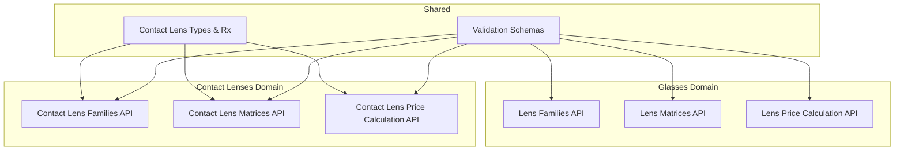
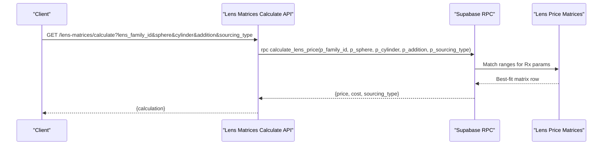
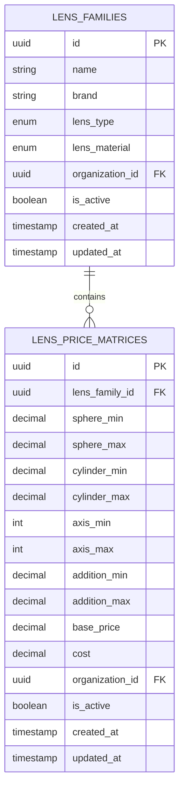
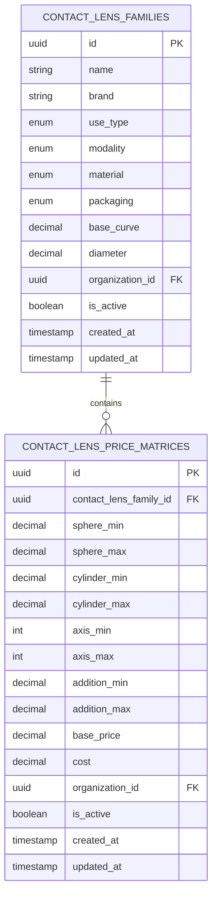
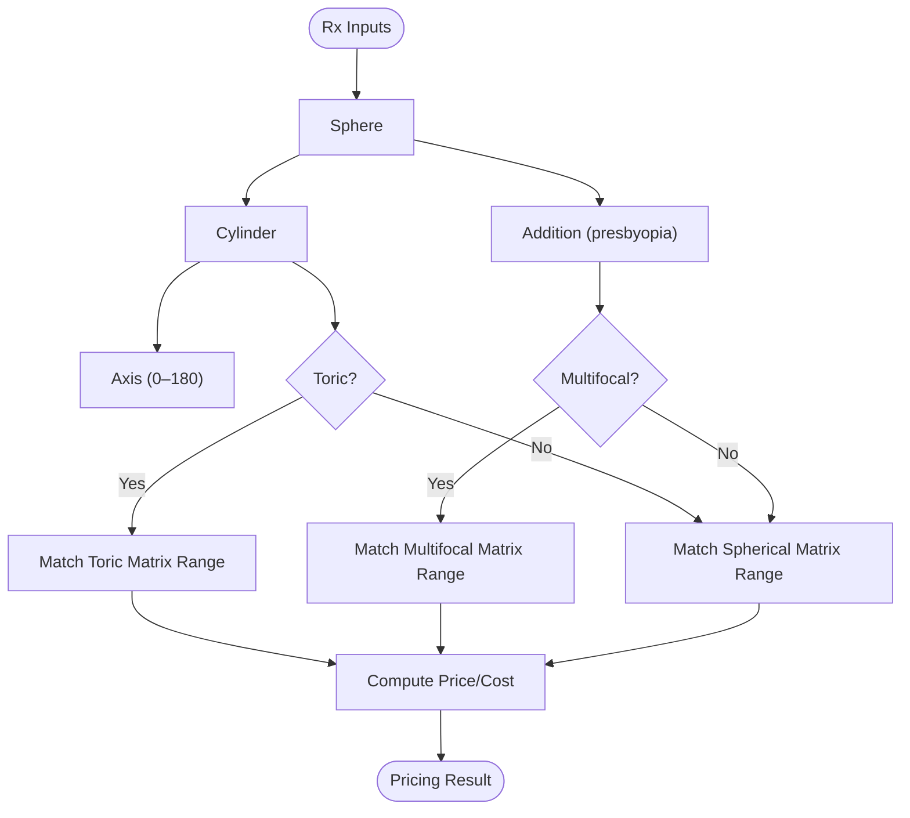
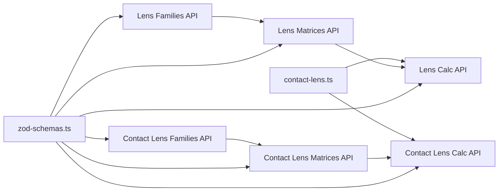

# Prescription Types & Formats

<cite>
**Referenced Files in This Document**
- [prescription-helpers.ts](file://src/lib/prescription-helpers.ts)
- [contact-lens.ts](file://src/types/contact-lens.ts)
- [lens-families route.ts](file://src/app/api/admin/lens-families/route.ts)
- [lens-matrices route.ts](file://src/app/api/admin/lens-matrices/route.ts)
- [lens-matrices calculate route.ts](file://src/app/api/admin/lens-matrices/calculate/route.ts)
- [contact-lens-families route.ts](file://src/app/api/admin/contact-lens-families/route.ts)
- [contact-lens-matrices route.ts](file://src/app/api/admin/contact-lens-matrices/route.ts)
- [contact-lens-matrices calculate route.ts](file://src/app/api/admin/contact-lens-matrices/calculate/route.ts)
- [zod-schemas.ts](file://src/lib/api/validation/zod-schemas.ts)
</cite>

## Table of Contents

1. [Introduction](#introduction)
2. [Project Structure](#project-structure)
3. [Core Components](#core-components)
4. [Architecture Overview](#architecture-overview)
5. [Detailed Component Analysis](#detailed-component-analysis)
6. [Dependency Analysis](#dependency-analysis)
7. [Performance Considerations](#performance-considerations)
8. [Troubleshooting Guide](#troubleshooting-guide)
9. [Conclusion](#conclusion)
10. [Appendices](#appendices)

## Introduction

This document explains how Opttius models and validates optical prescriptions and contact lens parameters. It covers:

- Optical Rx data structures for glasses and contact lenses
- Measurement units and validation rules
- Differences among spherical, toric, multifocal, and cosmetic contact lens types
- Examples of Rx formats and their clinical significance
- How Rx parameters relate to lens design specifications
- International standards alignment and regulatory considerations

## Project Structure

Opttius organizes optical data around two primary domains:

- Glasses (lens families and price matrices)
- Contact lenses (families and price matrices)

Key areas:

- Type definitions for contact lens parameters and Rx
- API routes for managing lens families and matrices
- Calculation endpoints for pricing based on Rx parameters
- Validation schemas ensuring consistent data entry

**Diagram sources**

- [contact-lens.ts](file://src/types/contact-lens.ts#L1-L76)
- [lens-families route.ts](file://src/app/api/admin/lens-families/route.ts#L1-L222)
- [lens-matrices route.ts](file://src/app/api/admin/lens-matrices/route.ts#L1-L224)
- [lens-matrices calculate route.ts](file://src/app/api/admin/lens-matrices/calculate/route.ts#L1-L159)
- [contact-lens-families route.ts](file://src/app/api/admin/contact-lens-families/route.ts#L1-L176)
- [contact-lens-matrices route.ts](file://src/app/api/admin/contact-lens-matrices/route.ts#L1-L203)
- [contact-lens-matrices calculate route.ts](file://src/app/api/admin/contact-lens-matrices/calculate/route.ts#L1-L172)
- [zod-schemas.ts](file://src/lib/api/validation/zod-schemas.ts#L1-L800)

**Section sources**

- [contact-lens.ts](file://src/types/contact-lens.ts#L1-L76)
- [lens-families route.ts](file://src/app/api/admin/lens-families/route.ts#L1-L222)
- [lens-matrices route.ts](file://src/app/api/admin/lens-matrices/route.ts#L1-L224)
- [lens-matrices calculate route.ts](file://src/app/api/admin/lens-matrices/calculate/route.ts#L1-L159)
- [contact-lens-families route.ts](file://src/app/api/admin/contact-lens-families/route.ts#L1-L176)
- [contact-lens-matrices route.ts](file://src/app/api/admin/contact-lens-matrices/route.ts#L1-L203)
- [contact-lens-matrices calculate route.ts](file://src/app/api/admin/contact-lens-matrices/calculate/route.ts#L1-L172)
- [zod-schemas.ts](file://src/lib/api/validation/zod-schemas.ts#L1-L800)

## Core Components

- Rx data structures:
  - Glasses Rx: sphere, cylinder, axis, addition
  - Contact lens Rx: sphere, cylinder, axis, addition, base curve, diameter
- Lens families and matrices:
  - Lens families define lens attributes (type, material, etc.)
  - Price matrices define pricing ranges for Rx parameters
- Calculation APIs:
  - Compute lens price given Rx and family selection
  - Multi-tenant enforcement via organization_id

**Section sources**

- [contact-lens.ts](file://src/types/contact-lens.ts#L61-L68)
- [lens-families route.ts](file://src/app/api/admin/lens-families/route.ts#L55-L87)
- [lens-matrices route.ts](file://src/app/api/admin/lens-matrices/route.ts#L74-L115)
- [lens-matrices calculate route.ts](file://src/app/api/admin/lens-matrices/calculate/route.ts#L107-L150)
- [contact-lens-matrices calculate route.ts](file://src/app/api/admin/contact-lens-matrices/calculate/route.ts#L117-L163)

## Architecture Overview

The system separates Rx modeling from pricing logic:

- Rx types are defined centrally
- Families and matrices are managed via dedicated APIs
- Calculation endpoints call stored procedures to match Rx ranges and compute price/cost

**Diagram sources**

- [lens-matrices calculate route.ts](file://src/app/api/admin/lens-matrices/calculate/route.ts#L107-L150)
- [lens-matrices route.ts](file://src/app/api/admin/lens-matrices/route.ts#L74-L115)

## Detailed Component Analysis

### Rx Data Structures and Units

- Glasses Rx fields:
  - sphere: spherical power (dioptric power)
  - cylinder: cylindrical power (dioptric power)
  - axis: axis in degrees (0–180)
  - addition: reading addition (dioptric power)
- Contact lens Rx extends glasses Rx with:
  - base_curve: base curve (millimeters)
  - diameter: lens diameter (millimeters)

Units and typical ranges:

- Dioptric power: commonly ±20.00 to ±30.00 D for sphere; ±4.00 D for cylinder; 0–180° for axis; 0–4.00 D for addition
- Contact lens base curve and diameter: typically 8.0–10.0 mm for base curve; 13.0–15.0 mm for diameter

Validation rules observed in code:

- Numbers validated and sanitized
- Axis constrained to 0–180 when provided
- Addition non-negative when provided

**Section sources**

- [contact-lens.ts](file://src/types/contact-lens.ts#L61-L68)
- [contact-lens-matrices calculate route.ts](file://src/app/api/admin/contact-lens-matrices/calculate/route.ts#L98-L115)

### Glasses Prescription Types and Translation

- Supported types include single vision, bifocal, trifocal, progressive, reading, computer, and sports
- Translation helper converts internal codes to localized labels

Clinical relevance:

- Single vision: distance correction only
- Progressive/ bifocal/ trifocal: multifocal designs for distance, intermediate, and near
- Reading/computer: specialized addition designs
- Sports: considerations for active lifestyle

**Section sources**

- [prescription-helpers.ts](file://src/lib/prescription-helpers.ts#L5-L13)
- [prescription-helpers.ts](file://src/lib/prescription-helpers.ts#L20-L37)

### Contact Lens Types and Modalities

- Modality types:
  - Spherical: single power
  - Toric: with cylinder and axis for astigmatism
  - Multifocal: addition for presbyopia
  - Cosmetic: color/tints without vision correction
- Use types: daily, bi-weekly, monthly, extended wear
- Materials: silicone hydrogel, hydrogel, rigid gas permeable
- Packaging: box sizes and bottles

These types map directly to Rx parameters:

- Spherical: sphere only
- Toric: sphere, cylinder, axis
- Multifocal: sphere, cylinder, axis, addition
- Cosmetic: cosmetic tint parameters (not vision correction)

**Section sources**

- [contact-lens.ts](file://src/types/contact-lens.ts#L9-L23)
- [contact-lens.ts](file://src/types/contact-lens.ts#L25-L40)

### Lens Families and Matrices (Glasses)

- Lens families capture lens attributes (brand, material, type) and organization isolation
- Price matrices define pricing bands for sphere, cylinder, axis, and addition
- Multi-tenancy enforced via organization_id

**Diagram sources**

- [lens-families route.ts](file://src/app/api/admin/lens-families/route.ts#L55-L87)
- [lens-matrices route.ts](file://src/app/api/admin/lens-matrices/route.ts#L74-L115)

**Section sources**

- [lens-families route.ts](file://src/app/api/admin/lens-families/route.ts#L55-L87)
- [lens-matrices route.ts](file://src/app/api/admin/lens-matrices/route.ts#L74-L115)

### Contact Lens Families and Matrices

- Contact lens families mirror the glasses model with modality, use type, material, packaging
- Price matrices define pricing bands for sphere, cylinder, axis, addition, and supply base_curve/diameter

**Diagram sources**

- [contact-lens.ts](file://src/types/contact-lens.ts#L25-L59)
- [contact-lens-families route.ts](file://src/app/api/admin/contact-lens-families/route.ts#L60-L86)
- [contact-lens-matrices route.ts](file://src/app/api/admin/contact-lens-matrices/route.ts#L58-L101)

**Section sources**

- [contact-lens.ts](file://src/types/contact-lens.ts#L25-L59)
- [contact-lens-families route.ts](file://src/app/api/admin/contact-lens-families/route.ts#L60-L86)
- [contact-lens-matrices route.ts](file://src/app/api/admin/contact-lens-matrices/route.ts#L58-L101)

### Rx Parameter Mapping to Lens Design

- Spherical power determines overall refractive strength
- Cylinder and axis correct astigmatism; axis validated to 0–180
- Addition accommodates presbyopia; used in multifocal designs
- Toric and multifocal require precise matching of cylinder/axis/addition ranges
- Cosmetic lenses separate tint parameters from vision correction

**Diagram sources**

- [contact-lens-matrices calculate route.ts](file://src/app/api/admin/contact-lens-matrices/calculate/route.ts#L98-L163)
- [lens-matrices calculate route.ts](file://src/app/api/admin/lens-matrices/calculate/route.ts#L83-L99)

**Section sources**

- [contact-lens-matrices calculate route.ts](file://src/app/api/admin/contact-lens-matrices/calculate/route.ts#L98-L163)
- [lens-matrices calculate route.ts](file://src/app/api/admin/lens-matrices/calculate/route.ts#L83-L99)

### Validation Rules and Standards Alignment

Observed validation behaviors:

- Numeric parameters validated and parsed
- Axis constrained to 0–180 when provided
- Addition validated as non-negative when provided
- Multi-tenancy enforced via organization_id across families and matrices
- RPC-based calculations ensure consistent pricing logic

Standards alignment:

- Dioptric power and axis units align with international standard notation
- Base curve and diameter units align with standard contact lens specifications
- Validation prevents out-of-range values that could lead to incorrect prescriptions

**Section sources**

- [contact-lens-matrices calculate route.ts](file://src/app/api/admin/contact-lens-matrices/calculate/route.ts#L79-L115)
- [lens-matrices calculate route.ts](file://src/app/api/admin/lens-matrices/calculate/route.ts#L67-L81)
- [lens-families route.ts](file://src/app/api/admin/lens-families/route.ts#L62-L68)
- [lens-matrices route.ts](file://src/app/api/admin/lens-matrices/route.ts#L53-L70)
- [contact-lens-families route.ts](file://src/app/api/admin/contact-lens-families/route.ts#L66-L69)
- [contact-lens-matrices route.ts](file://src/app/api/admin/contact-lens-matrices/route.ts#L76-L79)

## Dependency Analysis

- Rx types depend on shared type definitions
- Calculation APIs depend on lens families and matrices
- Validation schemas underpin API bodies and queries
- Multi-tenancy filters propagate across APIs

**Diagram sources**

- [contact-lens.ts](file://src/types/contact-lens.ts#L1-L76)
- [lens-families route.ts](file://src/app/api/admin/lens-families/route.ts#L1-L222)
- [lens-matrices route.ts](file://src/app/api/admin/lens-matrices/route.ts#L1-L224)
- [lens-matrices calculate route.ts](file://src/app/api/admin/lens-matrices/calculate/route.ts#L1-L159)
- [contact-lens-families route.ts](file://src/app/api/admin/contact-lens-families/route.ts#L1-L176)
- [contact-lens-matrices route.ts](file://src/app/api/admin/contact-lens-matrices/route.ts#L1-L203)
- [contact-lens-matrices calculate route.ts](file://src/app/api/admin/contact-lens-matrices/calculate/route.ts#L1-L172)
- [zod-schemas.ts](file://src/lib/api/validation/zod-schemas.ts#L1-L800)

**Section sources**

- [contact-lens.ts](file://src/types/contact-lens.ts#L1-L76)
- [lens-families route.ts](file://src/app/api/admin/lens-families/route.ts#L1-L222)
- [lens-matrices route.ts](file://src/app/api/admin/lens-matrices/route.ts#L1-L224)
- [lens-matrices calculate route.ts](file://src/app/api/admin/lens-matrices/calculate/route.ts#L1-L159)
- [contact-lens-families route.ts](file://src/app/api/admin/contact-lens-families/route.ts#L1-L176)
- [contact-lens-matrices route.ts](file://src/app/api/admin/contact-lens-matrices/route.ts#L1-L203)
- [contact-lens-matrices calculate route.ts](file://src/app/api/admin/contact-lens-matrices/calculate/route.ts#L1-L172)
- [zod-schemas.ts](file://src/lib/api/validation/zod-schemas.ts#L1-L800)

## Performance Considerations

- Matrix lookups rely on range matching; keep ranges granular but reasonable to avoid excessive scans
- Prefer pre-filtering by family_id to reduce cross-family comparisons
- RPC-based calculations centralize logic and improve consistency; ensure indexing on matrix ranges
- Multi-tenancy filters add minimal overhead but prevent cross-organization data leakage

## Troubleshooting Guide

Common issues and resolutions:

- No price matrix match for contact lenses:
  - Verify family has configured matrices and Rx falls within defined ranges
  - Confirm axis is between 0 and 180 when applicable
- Invalid axis values:
  - Ensure axis is an integer within 0–180
- Addition must be non-negative:
  - Validate addition is numeric and ≥0 when provided
- Multi-tenancy errors:
  - Ensure organization_id is set and matches the requesting admin’s organization

**Section sources**

- [contact-lens-matrices calculate route.ts](file://src/app/api/admin/contact-lens-matrices/calculate/route.ts#L98-L115)
- [contact-lens-matrices calculate route.ts](file://src/app/api/admin/contact-lens-matrices/calculate/route.ts#L141-L150)

## Conclusion

Opttius provides a structured, validated approach to optical prescriptions and contact lens pricing:

- Rx parameters are modeled consistently for glasses and contact lenses
- Families and matrices enable flexible, multi-tenant pricing rules
- Calculation APIs enforce validation and return accurate price/cost outcomes
- The system aligns with international standards for optical measurements while supporting clinical needs for toric, multifocal, and cosmetic modalities

## Appendices

### Rx Format Examples and Clinical Significance

- Spherical (SPH):
  - Example: SPH -2.00
  - Significance: Distance vision correction
- Toric (SPH, CYL, AXIS):
  - Example: SPH -1.50, CYL -1.00, AXIS 90
  - Significance: Astigmatism correction; axis placement critical
- Multifocal (SPH, CYL, AXIS, ADD):
  - Example: SPH -1.00, CYL -1.25, AXIS 180, ADD 2.00
  - Significance: Near addition for presbyopia; progressive or bifocal design
- Cosmetic (color tints):
  - Example: Base curve 8.6 mm, Diameter 13.8 mm
  - Significance: Vision correction not required; fit parameters still important

[No sources needed since this section provides general guidance]
