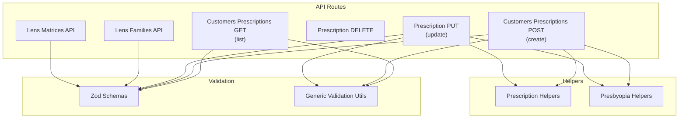
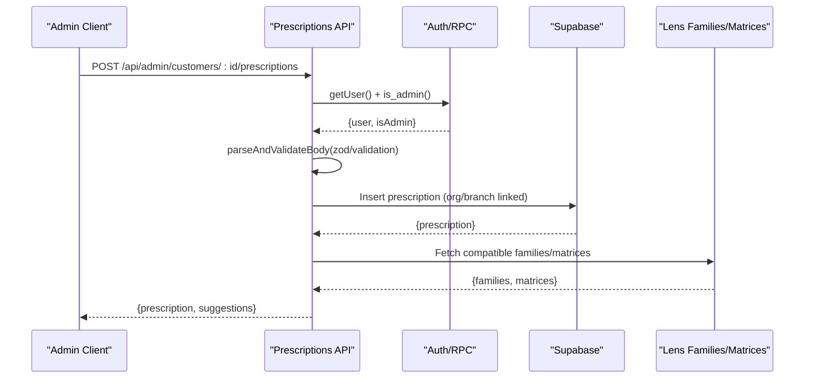
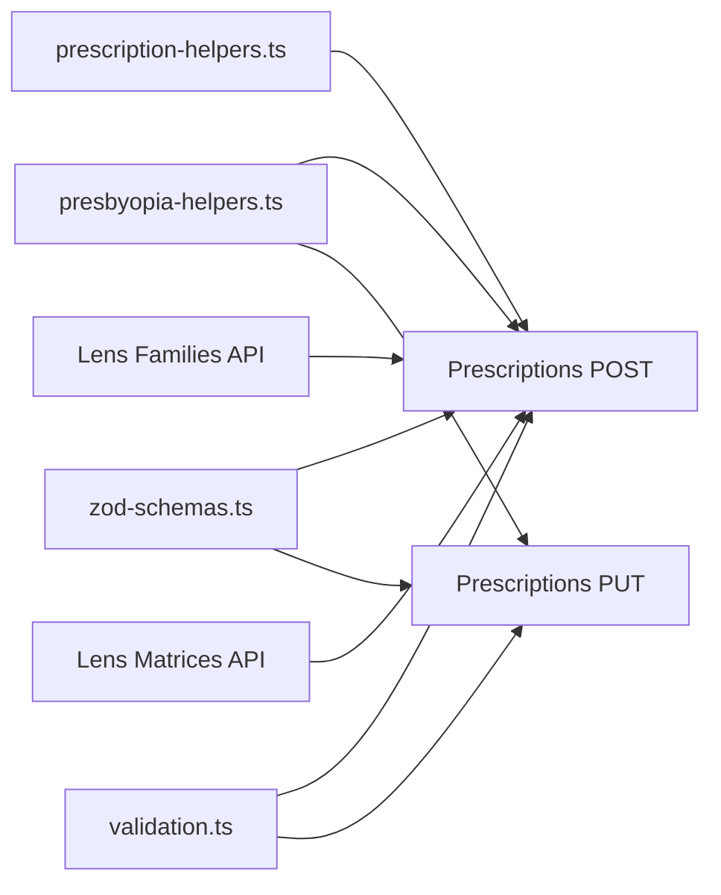

# Prescription Validation Rules

<cite>
**Referenced Files in This Document**
- [prescription-helpers.ts](file://src/lib/prescription-helpers.ts)
- [presbyopia-helpers.ts](file://src/lib/presbyopia-helpers.ts)
- [route.ts](file://src/app/api/admin/customers/[id]/prescriptions/route.ts)
- [route.ts](file://src/app/api/admin/customers/[id]/prescriptions/[prescriptionId]/route.ts)
- [route.ts](file://src/app/api/admin/lens-families/route.ts)
- [route.ts](file://src/app/api/admin/lens-matrices/route.ts)
- [zod-schemas.ts](file://src/lib/api/validation/zod-schemas.ts)
- [validation.ts](file://src/lib/api/validation.ts)
- [organization-schemas.ts](file://src/lib/api/validation/organization-schemas.ts)
- [database.ts](file://src/types/database.ts)
</cite>

## Table of Contents

1. [Introduction](#introduction)
2. [Project Structure](#project-structure)
3. [Core Components](#core-components)
4. [Architecture Overview](#architecture-overview)
5. [Detailed Component Analysis](#detailed-component-analysis)
6. [Dependency Analysis](#dependency-analysis)
7. [Performance Considerations](#performance-considerations)
8. [Troubleshooting Guide](#troubleshooting-guide)
9. [Conclusion](#conclusion)
10. [Appendices](#appendices)

## Introduction

This document defines the clinical and operational validation rules for prescriptions in Opttius. It covers optical parameter validation (power limits, cylinder ratios, axis compatibility, addition power ranges), integration with lens family constraints and material limitations, and patient-specific considerations. It also explains how validation fits into the prescription processing pipeline, regulatory alignment, safety thresholds, and professional guidelines adherence. The goal is to ensure prescriptions are safe, compliant, and manufacturable.

## Project Structure

Prescription validation spans several layers:

- API routes for CRUD operations on prescriptions
- Validation utilities for request bodies and query parameters
- Zod schemas for structured validation and normalization
- Lens family and matrix APIs that constrain manufacturing feasibility
- Helper libraries for presbyopia logic and translation

**Diagram sources**

- [route.ts](file://src/app/api/admin/customers/[id]/prescriptions/route.ts#L1-L167)
- [route.ts](file://src/app/api/admin/customers/[id]/prescriptions/[prescriptionId]/route.ts#L1-L231)
- [route.ts](file://src/app/api/admin/lens-families/route.ts#L1-L222)
- [route.ts](file://src/app/api/admin/lens-matrices/route.ts#L1-L224)
- [zod-schemas.ts](file://src/lib/api/validation/zod-schemas.ts#L1-L800)
- [validation.ts](file://src/lib/api/validation.ts#L1-L440)
- [prescription-helpers.ts](file://src/lib/prescription-helpers.ts#L1-L38)
- [presbyopia-helpers.ts](file://src/lib/presbyopia-helpers.ts#L1-L169)

**Section sources**

- [route.ts](file://src/app/api/admin/customers/[id]/prescriptions/route.ts#L1-L167)
- [route.ts](file://src/app/api/admin/customers/[id]/prescriptions/[prescriptionId]/route.ts#L1-L231)
- [route.ts](file://src/app/api/admin/lens-families/route.ts#L1-L222)
- [route.ts](file://src/app/api/admin/lens-matrices/route.ts#L1-L224)
- [zod-schemas.ts](file://src/lib/api/validation/zod-schemas.ts#L1-L800)
- [validation.ts](file://src/lib/api/validation.ts#L1-L440)
- [prescription-helpers.ts](file://src/lib/prescription-helpers.ts#L1-L38)
- [presbyopia-helpers.ts](file://src/lib/presbyopia-helpers.ts#L1-L169)

## Core Components

- Prescription API routes enforce admin authorization and manage CRUD operations, including multi-tenancy via organization and branch linkage.
- Validation utilities provide reusable rules for type, range, and custom checks.
- Zod schemas define strong typing and normalization for optical and administrative fields.
- Presbyopia helpers compute addition-based solutions and lens-family compatibility.
- Translation helpers support internationalization of prescription types.

Key responsibilities:

- Authorization and tenant isolation
- Input sanitization and validation
- Optical parameter normalization and constraints
- Lens family and material feasibility checks
- Patient-specific factor handling (e.g., PD, prism, tint, coatings)

**Section sources**

- [route.ts](file://src/app/api/admin/customers/[id]/prescriptions/route.ts#L1-L167)
- [route.ts](file://src/app/api/admin/customers/[id]/prescriptions/[prescriptionId]/route.ts#L1-L231)
- [validation.ts](file://src/lib/api/validation.ts#L1-L440)
- [zod-schemas.ts](file://src/lib/api/validation/zod-schemas.ts#L1-L800)
- [presbyopia-helpers.ts](file://src/lib/presbyopia-helpers.ts#L1-L169)
- [prescription-helpers.ts](file://src/lib/prescription-helpers.ts#L1-L38)

## Architecture Overview

The validation workflow integrates client-side and server-side checks, with a focus on:

- Early rejection of malformed or unsafe inputs
- Multi-tenant filtering of lens families/matrices
- Consistent normalization and translation
- Lens feasibility verification against manufacturing constraints

**Diagram sources**

- [route.ts](file://src/app/api/admin/customers/[id]/prescriptions/route.ts#L58-L167)
- [route.ts](file://src/app/api/admin/lens-families/route.ts#L1-L222)
- [route.ts](file://src/app/api/admin/lens-matrices/route.ts#L1-L224)
- [zod-schemas.ts](file://src/lib/api/validation/zod-schemas.ts#L1-L800)
- [validation.ts](file://src/lib/api/validation.ts#L1-L440)

## Detailed Component Analysis

### Prescription API Layer

- Authentication and authorization: routes require admin access and validate user roles.
- Multi-tenancy: inserts/updates link prescriptions to customer’s organization and branch.
- Current prescription flag: setting a prescription as current automatically unsets others for the same customer.
- Field coverage: includes spherical, cylindrical, axis, addition (ADD), pupillary distances (PD), prism, tint, coatings, notes, and type/material hints.

Operational notes:

- Date fields are normalized to date strings.
- Boolean toggles default to safe values when omitted.
- Organization and branch IDs are propagated from customer record.

**Section sources**

- [route.ts](file://src/app/api/admin/customers/[id]/prescriptions/route.ts#L1-L167)
- [route.ts](file://src/app/api/admin/customers/[id]/prescriptions/[prescriptionId]/route.ts#L1-L231)

### Validation Utilities

- Generic validation rules support required fields, types, min/max bounds, regex patterns, enums, and custom validators.
- Request body parsing and sanitization combine JSON parsing, trimming, and strict validation.
- Query parameter validation supports coercion to numbers/booleans.

Usage:

- Apply before processing sensitive operations like creating or updating prescriptions.
- Centralize error messages for consistent UX.

**Section sources**

- [validation.ts](file://src/lib/api/validation.ts#L1-L440)

### Zod Schemas for Optical and Administrative Fields

- Strong typing for optical parameters (sphere, cylinder, axis, ADD) with numeric validation.
- PD, near PD, prism, tint, and coating fields supported with appropriate constraints.
- Lens family and material fields included for downstream feasibility checks.
- POS lens/frame data schemas enable structured validation for sale processing.

Practical impact:

- Ensures numeric inputs are finite and positive where required.
- Normalizes strings (trim, lower/upper case) consistently.
- Enables downstream logic to rely on validated shapes.

**Section sources**

- [zod-schemas.ts](file://src/lib/api/validation/zod-schemas.ts#L717-L800)

### Presbyopia Helpers

- Addition detection and aggregation (max, average).
- Far/near sphere calculations.
- Default presbyopia solution selection based on prescription type or presence of ADD.
- Lens family compatibility mapping for progressive, bifocal, trifocal, separate lenses.

Clinical relevance:

- Guides lens selection aligned with patient’s presbyopia needs.
- Prevents incompatible combinations (e.g., ADD with single vision).

**Section sources**

- [presbyopia-helpers.ts](file://src/lib/presbyopia-helpers.ts#L1-L169)

### Lens Family and Matrix Constraints

- Lens families API filters by organization to maintain multi-tenant isolation.
- Lens matrices API restricts visibility to matrices belonging to families within the user’s organization.
- Creation validates that the target lens family belongs to the user’s organization.

Implications:

- Manufacturing feasibility is enforced by limiting choices to organization-scoped families/matrices.
- Prevents cross-tenant data leakage while ensuring valid options.

**Section sources**

- [route.ts](file://src/app/api/admin/lens-families/route.ts#L1-L222)
- [route.ts](file://src/app/api/admin/lens-matrices/route.ts#L1-L224)

### Translation and Type Labels

- Prescription type translation supports localized labels for optical types.
- Useful for UI rendering and reporting.

**Section sources**

- [prescription-helpers.ts](file://src/lib/prescription-helpers.ts#L1-L38)

## Dependency Analysis

**Diagram sources**

- [prescription-helpers.ts](file://src/lib/prescription-helpers.ts#L1-L38)
- [presbyopia-helpers.ts](file://src/lib/presbyopia-helpers.ts#L1-L169)
- [route.ts](file://src/app/api/admin/customers/[id]/prescriptions/route.ts#L58-L167)
- [route.ts](file://src/app/api/admin/customers/[id]/prescriptions/[prescriptionId]/route.ts#L68-L172)
- [zod-schemas.ts](file://src/lib/api/validation/zod-schemas.ts#L1-L800)
- [validation.ts](file://src/lib/api/validation.ts#L1-L440)
- [route.ts](file://src/app/api/admin/lens-families/route.ts#L1-L222)
- [route.ts](file://src/app/api/admin/lens-matrices/route.ts#L1-L224)

**Section sources**

- [route.ts](file://src/app/api/admin/customers/[id]/prescriptions/route.ts#L1-L167)
- [route.ts](file://src/app/api/admin/customers/[id]/prescriptions/[prescriptionId]/route.ts#L1-L231)
- [route.ts](file://src/app/api/admin/lens-families/route.ts#L1-L222)
- [route.ts](file://src/app/api/admin/lens-matrices/route.ts#L1-L224)
- [zod-schemas.ts](file://src/lib/api/validation/zod-schemas.ts#L1-L800)
- [validation.ts](file://src/lib/api/validation.ts#L1-L440)
- [prescription-helpers.ts](file://src/lib/prescription-helpers.ts#L1-L38)
- [presbyopia-helpers.ts](file://src/lib/presbyopia-helpers.ts#L1-L169)

## Performance Considerations

- Prefer Zod schemas for early validation to reduce database round trips.
- Batch lens family/matrix queries when generating recommendations.
- Cache frequently accessed lens families for the organization to minimize repeated reads.
- Avoid unnecessary nested selects; fetch only required fields for recommendation logic.

## Troubleshooting Guide

Common issues and resolutions:

- Unauthorized or forbidden access: Verify admin role and user session.
- Validation failures: Review field types, required values, and ranges; ensure numeric fields are finite.
- Multi-tenancy mismatch: Confirm the lens family belongs to the user’s organization.
- Incompatible presbyopia solution: Adjust lens family selection based on computed solution.

Diagnostic steps:

- Inspect API response error messages for specific field violations.
- Log sanitized request bodies for debugging.
- Cross-check lens family/material constraints returned by lens APIs.

**Section sources**

- [route.ts](file://src/app/api/admin/customers/[id]/prescriptions/route.ts#L1-L167)
- [route.ts](file://src/app/api/admin/customers/[id]/prescriptions/[prescriptionId]/route.ts#L1-L231)
- [validation.ts](file://src/lib/api/validation.ts#L1-L440)
- [route.ts](file://src/app/api/admin/lens-families/route.ts#L1-L222)
- [route.ts](file://src/app/api/admin/lens-matrices/route.ts#L1-L224)

## Conclusion

Opttius implements a robust, multi-layered validation pipeline for prescriptions that combines authorization, sanitization, structured schemas, and lens-family constraints. By aligning optical parameters with manufacturing feasibility and professional guidelines, the system ensures safe, compliant, and manufacturable outcomes. The presbyopia helpers further refine recommendations to match patient needs, while translation utilities support global deployments.

## Appendices

### Validation Scenarios and Examples

Note: The following scenarios describe typical validation behaviors without quoting specific code. Replace placeholders with real values during testing.

- Scenario A: Single vision prescription with valid sphere and cylinder values
  - Validate sphere and cylinder ranges and axis boundaries.
  - Ensure PD values are within typical ranges.
  - Confirm lens family supports single vision.

- Scenario B: Presbyopia with addition
  - Detect addition presence and compute near sphere.
  - Recommend progressive or bifocal/trifocal families depending on type.
  - Ensure ADD falls within accepted ranges.

- Scenario C: Invalid axis value
  - Axis must be within allowed bounds; otherwise, return validation error.
  - Suggest correction to nearest acceptable value.

- Scenario D: Cylinder exceeding sphere magnitude
  - Enforce cylinder ≤ |sphere| to avoid unrealistic prescriptions.
  - Recommend reducing cylinder or sphere accordingly.

- Scenario E: Lens family mismatch
  - If ADD is present, ensure selected lens family supports presbyopia.
  - Otherwise, suggest compatible alternatives.

- Scenario F: Current prescription flag
  - Setting a prescription as current clears previous current flags for the same customer.
  - Ensure only one current prescription exists.

- Scenario G: Multi-tenancy isolation
  - Lens families and matrices are filtered by organization ID.
  - Attempting to reference a family outside the organization should fail.

- Scenario H: Regulatory and safety thresholds
  - Enforce maximum ADD limits and safe sphere/cylinder combinations.
  - Flag extreme values requiring review.

- Scenario I: Professional guidelines adherence
  - Align lens type selection with prescription type and patient needs.
  - Consider prism and tint/coating fields for comfort and protection.

- Scenario J: Error conditions and corrective recommendations
  - Missing required fields: return field name and “required” message.
  - Out-of-range values: return “must be at least X” or “must be no more than Y.”
  - Incompatible combinations: suggest corrected lens family or parameter adjustments.

[No sources needed since this section provides general guidance]
