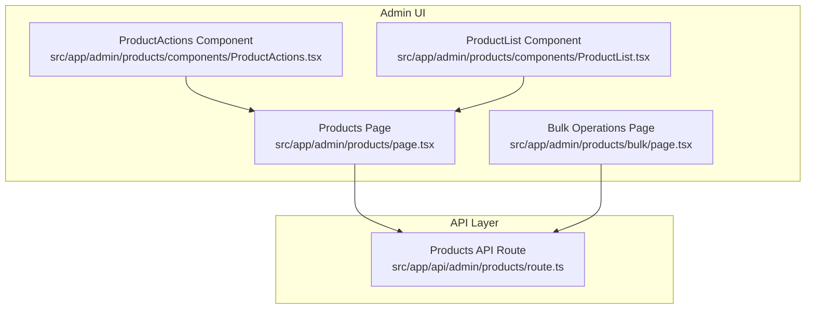
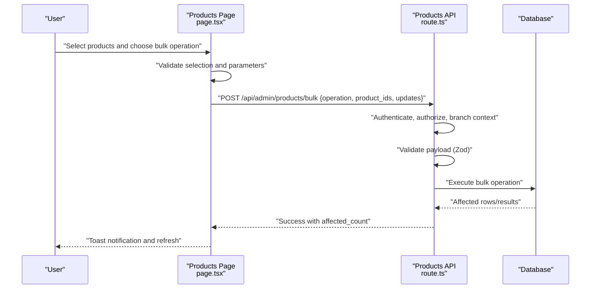
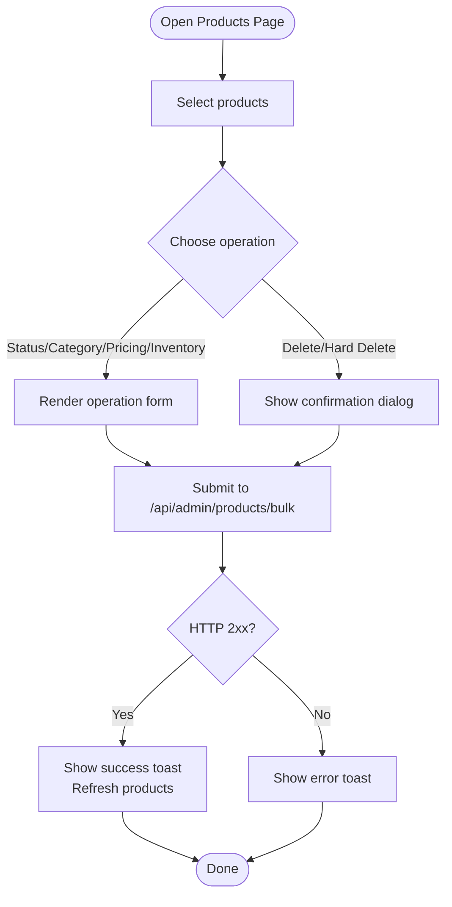
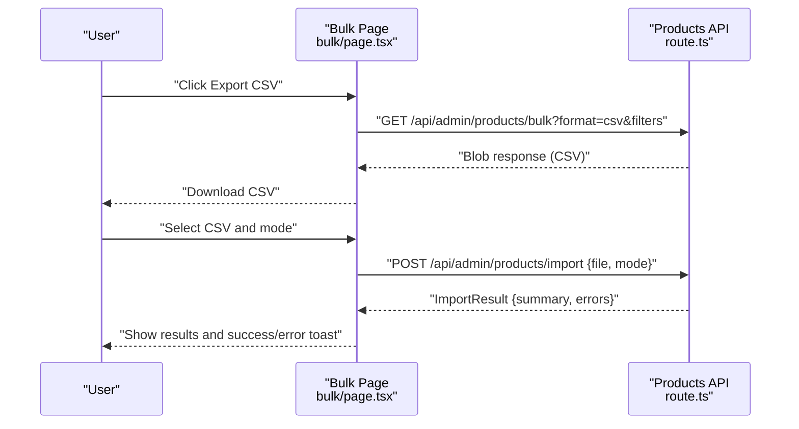
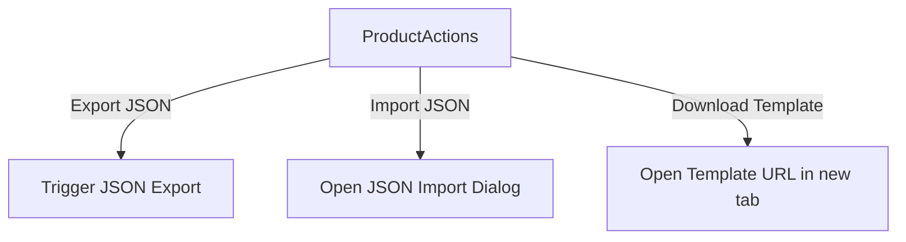
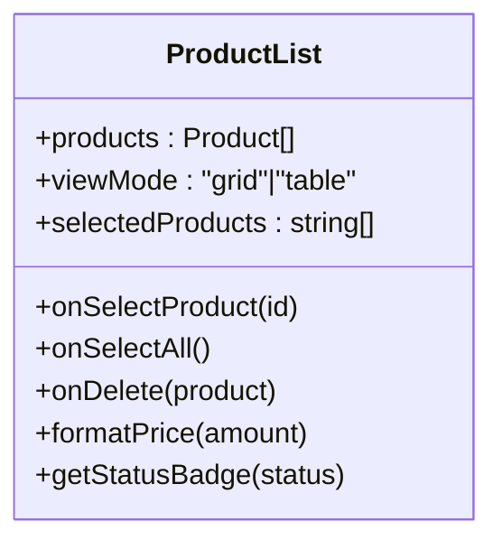
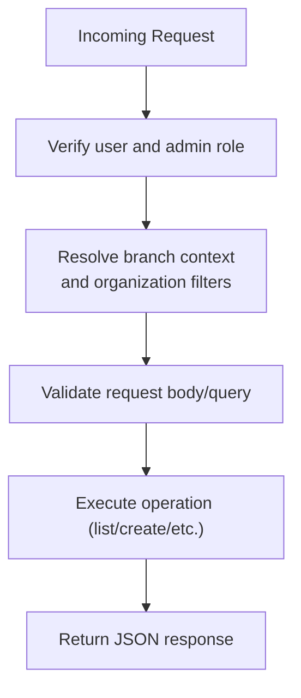
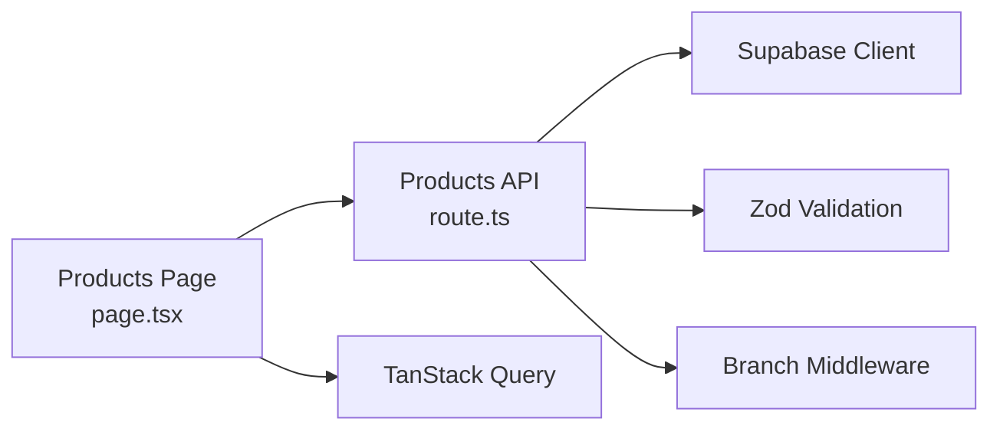

# Bulk Operations & Data Management

<cite>
**Referenced Files in This Document**
- [page.tsx](file://src/app/admin/products/page.tsx)
- [bulk/page.tsx](file://src/app/admin/products/bulk/page.tsx)
- [ProductActions.tsx](file://src/app/admin/products/components/ProductActions.tsx)
- [ProductList.tsx](file://src/app/admin/products/components/ProductList.tsx)
- [route.ts](file://src/app/api/admin/products/route.ts)
</cite>

## Table of Contents

1. [Introduction](#introduction)
2. [Project Structure](#project-structure)
3. [Core Components](#core-components)
4. [Architecture Overview](#architecture-overview)
5. [Detailed Component Analysis](#detailed-component-analysis)
6. [Dependency Analysis](#dependency-analysis)
7. [Performance Considerations](#performance-considerations)
8. [Troubleshooting Guide](#troubleshooting-guide)
9. [Conclusion](#conclusion)

## Introduction

This document explains the bulk product operations and data management system in Opttius. It covers import/export workflows, CSV/JSON template systems, bulk update capabilities, validation, error handling, batch processing, and integrations with external systems. It also documents mass updates, deletions, and status changes, along with data integrity checks, conflict resolution, and rollback procedures.

## Project Structure

The bulk operations feature spans three primary areas:

- Admin UI for managing products and bulk actions
- Bulk operations dedicated page for CSV/JSON import/export and mass edits
- Backend API routes for product CRUD, bulk operations, and data exports

**Diagram sources**

- [page.tsx](file://src/app/admin/products/page.tsx#L72-L800)
- [bulk/page.tsx](file://src/app/admin/products/bulk/page.tsx#L94-L540)
- [ProductActions.tsx](file://src/app/admin/products/components/ProductActions.tsx#L33-L119)
- [ProductList.tsx](file://src/app/admin/products/components/ProductList.tsx#L19-L57)
- [route.ts](file://src/app/api/admin/products/route.ts#L24-L539)

**Section sources**

- [page.tsx](file://src/app/admin/products/page.tsx#L1-L800)
- [bulk/page.tsx](file://src/app/admin/products/bulk/page.tsx#L1-L540)
- [ProductActions.tsx](file://src/app/admin/products/components/ProductActions.tsx#L1-L119)
- [ProductList.tsx](file://src/app/admin/products/components/ProductList.tsx#L1-L57)
- [route.ts](file://src/app/api/admin/products/route.ts#L1-L539)

## Core Components

- Products Page: Provides selection, bulk operation triggers, single deletion, and import/export controls.
- Bulk Operations Page: Dedicated interface for CSV/JSON import/export and mass updates.
- ProductActions Component: Exposes JSON export/import and navigation to bulk operations.
- ProductList Component: Renders products in grid or table modes and delegates selection and actions.
- Products API Route: Implements product listing, validation, and branch/context-aware filtering.

Key capabilities:

- Bulk updates: status, category, pricing adjustments, inventory adjustments, duplication, soft/hard delete.
- Import/export: CSV export, CSV import, JSON export, JSON import with templates.
- Validation and error handling: Zod-based validation, rate limiting, and detailed error responses.
- Batch processing: Server-side pagination and filtering; client-side selection and bulk submission.

**Section sources**

- [page.tsx](file://src/app/admin/products/page.tsx#L134-L276)
- [bulk/page.tsx](file://src/app/admin/products/bulk/page.tsx#L177-L260)
- [ProductActions.tsx](file://src/app/admin/products/components/ProductActions.tsx#L33-L78)
- [ProductList.tsx](file://src/app/admin/products/components/ProductList.tsx#L19-L57)
- [route.ts](file://src/app/api/admin/products/route.ts#L24-L539)

## Architecture Overview

The bulk operations architecture integrates frontend UI components with backend API routes. The UI collects selections and operation parameters, then submits them to the API. The API validates requests, enforces branch and organization context, performs validations, and executes operations atomically where applicable.

**Diagram sources**

- [page.tsx](file://src/app/admin/products/page.tsx#L209-L276)
- [route.ts](file://src/app/api/admin/products/route.ts#L542-L740)

**Section sources**

- [page.tsx](file://src/app/admin/products/page.tsx#L209-L276)
- [route.ts](file://src/app/api/admin/products/route.ts#L542-L740)

## Detailed Component Analysis

### Products Page (Bulk Operations Hub)

Responsibilities:

- Maintains selection state for multiple products.
- Presents bulk operation dialog with dynamic forms for status/category/pricing/inventory updates and deletion options.
- Handles JSON import/export via dedicated actions and templates.
- Submits bulk operations to the backend with branch context headers.

Key behaviors:

- Selection toggles and “select all”.
- Dynamic bulk operation form rendering based on chosen operation.
- JSON import with mode selection and results display.
- CSV export with filters.

**Diagram sources**

- [page.tsx](file://src/app/admin/products/page.tsx#L134-L276)

**Section sources**

- [page.tsx](file://src/app/admin/products/page.tsx#L134-L276)

### Bulk Operations Page (CSV/JSON Import/Export)

Responsibilities:

- Dedicated CSV/JSON import/export interface.
- CSV export with category/status filters.
- CSV import with mode selection (create/update/upsert).
- JSON export and template download links.
- Bulk operation execution with validation and feedback.

**Diagram sources**

- [bulk/page.tsx](file://src/app/admin/products/bulk/page.tsx#L262-L328)

**Section sources**

- [bulk/page.tsx](file://src/app/admin/products/bulk/page.tsx#L262-L328)

### ProductActions Component (JSON Import/Export)

Responsibilities:

- Provides quick access to JSON export/import and template download.
- Integrates with the Products Page to trigger JSON operations.

**Diagram sources**

- [ProductActions.tsx](file://src/app/admin/products/components/ProductActions.tsx#L33-L78)

**Section sources**

- [ProductActions.tsx](file://src/app/admin/products/components/ProductActions.tsx#L33-L78)

### ProductList Component (Rendering and Selection)

Responsibilities:

- Renders products in grid or table mode.
- Delegates selection callbacks and action handlers to parent components.

**Diagram sources**

- [ProductList.tsx](file://src/app/admin/products/components/ProductList.tsx#L19-L57)

**Section sources**

- [ProductList.tsx](file://src/app/admin/products/components/ProductList.tsx#L19-L57)

### Products API Route (Validation, Filtering, Branch Context)

Responsibilities:

- Authentication and admin authorization checks.
- Branch-aware filtering and organization isolation.
- Zod-based validation for product creation and updates.
- Bulk operation endpoint handling (not shown here) and export endpoints.

**Diagram sources**

- [route.ts](file://src/app/api/admin/products/route.ts#L24-L120)

**Section sources**

- [route.ts](file://src/app/api/admin/products/route.ts#L24-L120)

## Dependency Analysis

- Frontend depends on:
  - Supabase client for authentication and data access.
  - TanStack Query for caching and invalidation.
  - UI components for dialogs, selects, and tables.
- Backend depends on:
  - Supabase for database operations.
  - Zod for request validation.
  - Branch middleware for tenant and branch context.
  - Rate limiting middleware for API protection.

**Diagram sources**

- [page.tsx](file://src/app/admin/products/page.tsx#L50-L60)
- [bulk/page.tsx](file://src/app/admin/products/bulk/page.tsx#L97-L98)
- [route.ts](file://src/app/api/admin/products/route.ts#L1-L23)

**Section sources**

- [page.tsx](file://src/app/admin/products/page.tsx#L50-L60)
- [bulk/page.tsx](file://src/app/admin/products/bulk/page.tsx#L97-L98)
- [route.ts](file://src/app/api/admin/products/route.ts#L1-L23)

## Performance Considerations

- Pagination and filtering:
  - Backend supports pagination and multiple filters to reduce payload sizes.
  - Branch and organization filters are applied efficiently to maintain multi-tenancy.
- Client-side caching:
  - TanStack Query caches product lists and invalidates on bulk operations to keep UI fresh.
- Batch processing:
  - Bulk operations are executed server-side to minimize client overhead and ensure atomicity where supported.

[No sources needed since this section provides general guidance]

## Troubleshooting Guide

Common issues and resolutions:

- Unauthorized or insufficient permissions:
  - Ensure the user is authenticated and has admin privileges.
- Branch context mismatches:
  - Verify the branch header or query parameter aligns with the user’s accessible branches.
- Validation errors:
  - Review the returned validation details and correct missing or invalid fields.
- Import failures:
  - Check CSV/JSON format against templates and ensure mode selection matches intended behavior.
- Export issues:
  - Confirm filters and format parameters are valid; retry with minimal filters if necessary.

**Section sources**

- [page.tsx](file://src/app/admin/products/page.tsx#L247-L253)
- [bulk/page.tsx](file://src/app/admin/products/bulk/page.tsx#L307-L321)
- [route.ts](file://src/app/api/admin/products/route.ts#L631-L666)

## Conclusion

Opttius provides a robust, secure, and efficient system for bulk product operations. The UI enables intuitive selection and mass updates, while the backend enforces strict validation, branch-aware filtering, and multi-tenancy. CSV/JSON import/export workflows integrate seamlessly with external systems, and comprehensive error handling ensures reliable operations.
