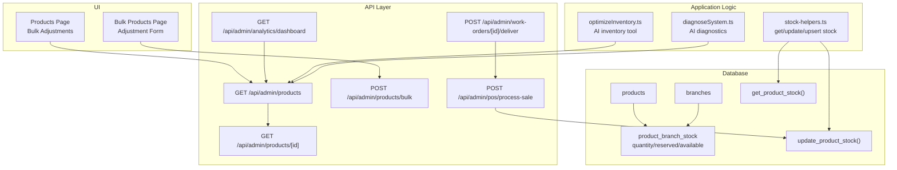
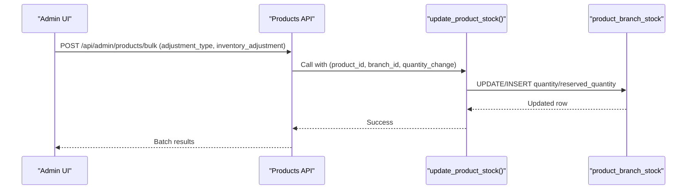
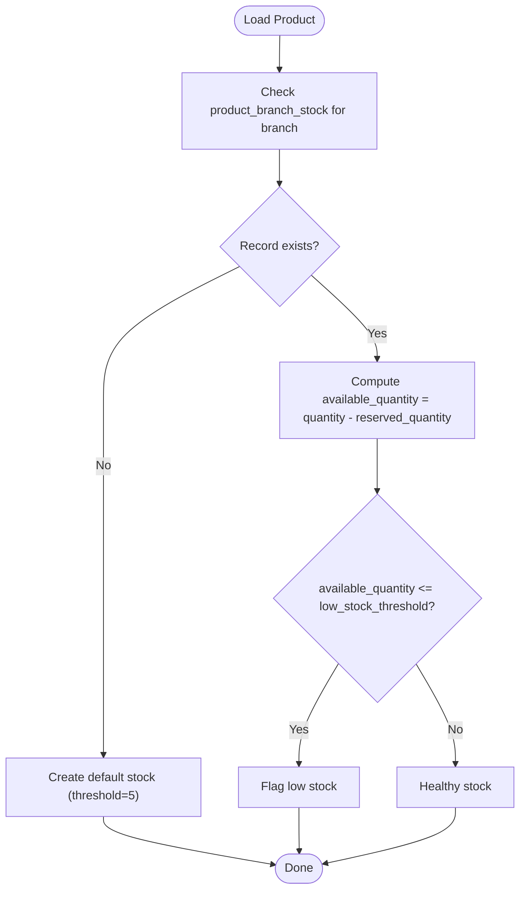
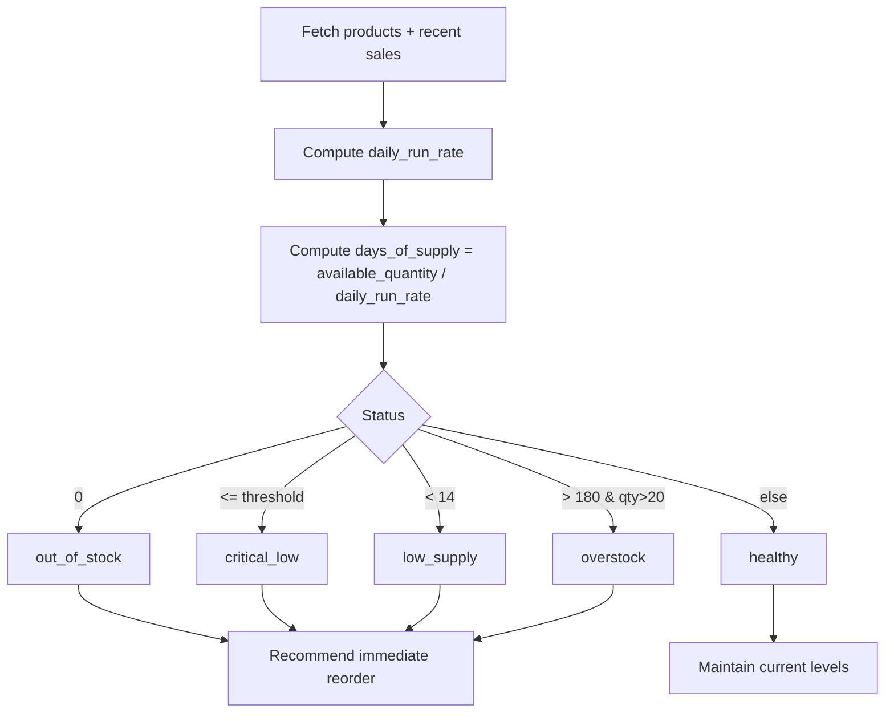
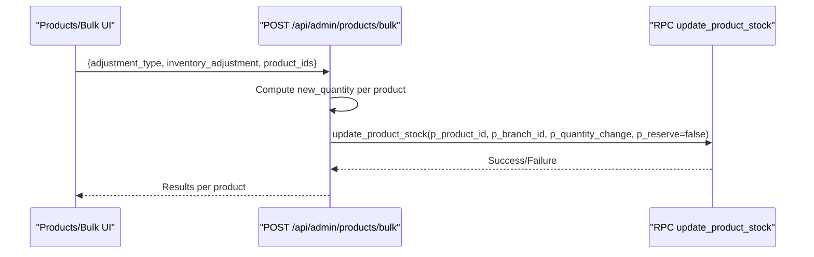
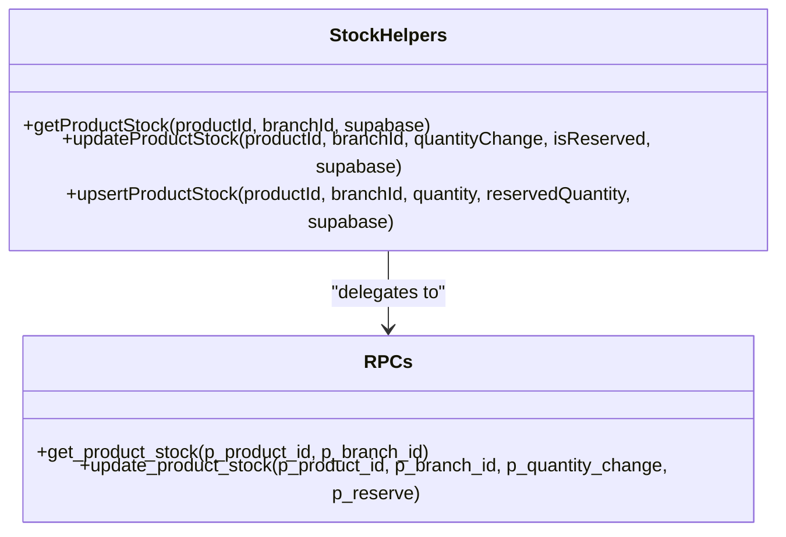
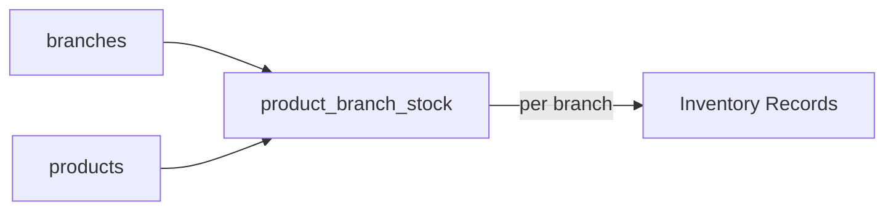
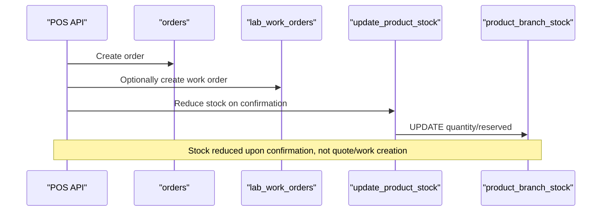
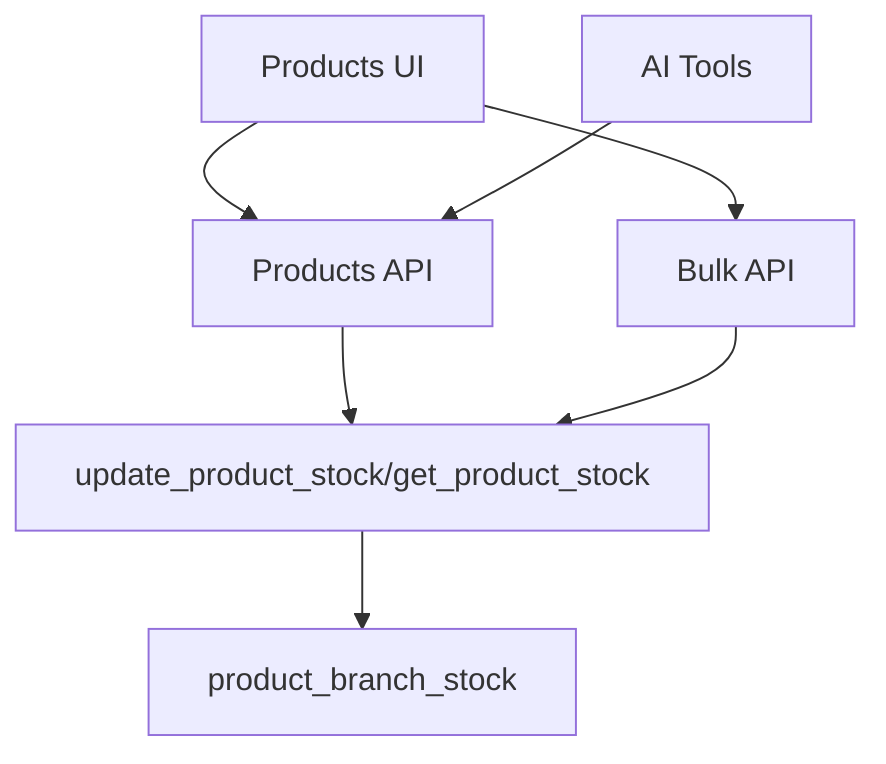

# Inventory Management & Stock Control

<cite>
**Referenced Files in This Document**
- [PlanDeRefraccionSecciones.md](file://docs/PlanDeRefraccionSecciones.md)
- [20260120000000_refactor_separate_products_inventory.sql](file://supabase/migrations/20260120000000_refactor_separate_products_inventory.sql)
- [20251216000000_create_branches_system.sql](file://supabase/migrations/20251216000000_create_branches_system.sql)
- [stock-helpers.ts](file://src/lib/inventory/stock-helpers.ts)
- [route.ts (bulk inventory updates)](file://src/app/api/admin/products/bulk/route.ts)
- [route.ts (individual product)](file://src/app/api/admin/products/[id]/route.ts)
- [route.ts (products list)](file://src/app/api/admin/products/route.ts)
- [Products Page (bulk UI)](file://src/app/admin/products/page.tsx)
- [Bulk Products Page (bulk UI)](file://src/app/admin/products/bulk/page.tsx)
- [optimizeInventory.ts](file://src/lib/ai/tools/optimizeInventory.ts)
- [diagnoseSystem.ts](file://src/lib/ai/tools/diagnoseSystem.ts)
- [route.ts (POS process sale)](file://src/app/api/admin/pos/process-sale/route.ts)
- [route.ts (work order deliver)](file://src/app/api/admin/work-orders/[id]/deliver/route.ts)
- [route.ts (analytics dashboard)](file://src/app/api/admin/analytics/dashboard/route.ts)
</cite>

## Table of Contents

1. [Introduction](#introduction)
2. [Project Structure](#project-structure)
3. [Core Components](#core-components)
4. [Architecture Overview](#architecture-overview)
5. [Detailed Component Analysis](#detailed-component-analysis)
6. [Dependency Analysis](#dependency-analysis)
7. [Performance Considerations](#performance-considerations)
8. [Troubleshooting Guide](#troubleshooting-guide)
9. [Conclusion](#conclusion)
10. [Appendices](#appendices)

## Introduction

This document explains Opttius inventory management and stock control capabilities. It covers stock tracking across branches, reorder points, low stock alerts, inventory adjustments (including bulk operations), automated stock calculations, integration with purchase orders and suppliers, warehouse operations, valuation and cost tracking, and the relationship between inventory and sales, order fulfillment, and financial reporting.

## Project Structure

Opttius separates product catalog from branch-specific inventory, with stored procedures and helper functions to manage stock movements consistently. The UI exposes bulk inventory adjustment workflows, while backend APIs orchestrate stock updates and integrate with POS and work order flows.

**Diagram sources**

- [Products Page (bulk UI)](file://src/app/admin/products/page.tsx#L515-L560)
- [Bulk Products Page (bulk UI)](file://src/app/admin/products/bulk/page.tsx#L449-L489)
- [route.ts (bulk inventory updates)](file://src/app/api/admin/products/bulk/route.ts#L205-L279)
- [route.ts (individual product)](file://src/app/api/admin/products/[id]/route.ts#L150-L188)
- [route.ts (products list)](file://src/app/api/admin/products/route.ts#L430-L453)
- [route.ts (POS process sale)](file://src/app/api/admin/pos/process-sale/route.ts#L1259-L1290)
- [route.ts (work order deliver)](file://src/app/api/admin/work-orders/[id]/deliver/route.ts#L83-L120)
- [route.ts (analytics dashboard)](file://src/app/api/admin/analytics/dashboard/route.ts#L213-L249)
- [stock-helpers.ts](file://src/lib/inventory/stock-helpers.ts#L11-L171)
- [optimizeInventory.ts](file://src/lib/ai/tools/optimizeInventory.ts#L1-L185)
- [diagnoseSystem.ts](file://src/lib/ai/tools/diagnoseSystem.ts#L249-L286)
- [20260120000000_refactor_separate_products_inventory.sql](file://supabase/migrations/20260120000000_refactor_separate_products_inventory.sql#L41-L120)
- [20251216000000_create_branches_system.sql](file://supabase/migrations/20251216000000_create_branches_system.sql#L35-L70)

**Section sources**

- [PlanDeRefraccionSecciones.md](file://docs/PlanDeRefraccionSecciones.md#L39-L63)
- [20260120000000_refactor_separate_products_inventory.sql](file://supabase/migrations/20260120000000_refactor_separate_products_inventory.sql#L34-L224)
- [20251216000000_create_branches_system.sql](file://supabase/migrations/20251216000000_create_branches_system.sql#L1-L368)

## Core Components

- Branch-specific inventory table: Tracks quantity, reserved_quantity, available_quantity, thresholds, and last movement timestamps per product and branch.
- Stored procedures:
  - get_product_stock: Fetches stock and low-stock flag for a product/branch.
  - update_product_stock: Updates stock or reserved quantities atomically; creates records if missing.
- Application helpers:
  - getProductStock, updateProductStock, upsertProductStock: Typed helpers wrapping Supabase queries and RPCs.
- Bulk inventory adjustment API: Applies set/add adjustments across multiple products via RPC.
- POS and Work Order integrations: Reduce stock upon order confirmation; enforce payment clearance before delivery.
- AI tools:
  - optimizeInventory: Analyzes stock vs. sales velocity, computes days of supply, and recommends actions.
  - diagnoseSystem: Computes low/out-of/over stock rates and flags inventory health.

**Section sources**

- [PlanDeRefraccionSecciones.md](file://docs/PlanDeRefraccionSecciones.md#L39-L63)
- [stock-helpers.ts](file://src/lib/inventory/stock-helpers.ts#L11-L171)
- [route.ts (bulk inventory updates)](file://src/app/api/admin/products/bulk/route.ts#L205-L279)
- [optimizeInventory.ts](file://src/lib/ai/tools/optimizeInventory.ts#L1-L185)
- [diagnoseSystem.ts](file://src/lib/ai/tools/diagnoseSystem.ts#L249-L286)

## Architecture Overview

The inventory architecture centers on a separation between product definitions and branch-specific stock. Stock updates are centralized via RPCs to ensure atomicity and consistency. The POS and work order flows trigger stock reductions at the right time (order confirmation), while bulk operations and AI tools support proactive management.

**Diagram sources**

- [route.ts (bulk inventory updates)](file://src/app/api/admin/products/bulk/route.ts#L205-L279)
- [20260120000000_refactor_separate_products_inventory.sql](file://supabase/migrations/20260120000000_refactor_separate_products_inventory.sql#L74-L120)

## Detailed Component Analysis

### Inventory Tracking and Low Stock Alerts

- Data model: product_branch_stock stores quantity, reserved_quantity, available_quantity, low_stock_threshold, reorder_point, and last_stock_movement.
- Low stock detection: available_quantity ≤ low_stock_threshold triggers low stock status.
- UI exposure: Products page supports “show low stock only” filtering and displays stock indicators.

**Diagram sources**

- [PlanDeRefraccionSecciones.md](file://docs/PlanDeRefraccionSecciones.md#L39-L63)
- [stock-helpers.ts](file://src/lib/inventory/stock-helpers.ts#L11-L56)

**Section sources**

- [PlanDeRefraccionSecciones.md](file://docs/PlanDeRefraccionSecciones.md#L39-L63)
- [stock-helpers.ts](file://src/lib/inventory/stock-helpers.ts#L11-L56)

### Reorder Points and Automated Calculations

- Reorder point column is present in inventory schema; the system computes days of supply and suggests reorder timing based on recent sales velocity.
- AI tool optimizeInventory calculates:
  - Sold last 30 days
  - Daily run rate
  - Days of supply
  - Status: healthy, critical_low, low_supply, overstock
  - Recommendations and stock valuation (quantity × cost_price)

**Diagram sources**

- [optimizeInventory.ts](file://src/lib/ai/tools/optimizeInventory.ts#L107-L137)

**Section sources**

- [optimizeInventory.ts](file://src/lib/ai/tools/optimizeInventory.ts#L1-L185)

### Inventory Adjustment Workflows and Batch Updates

- Adjustment types:
  - Set quantity: sets stock to a target value.
  - Add/Subtract: increases or decreases current stock.
- Backend flow:
  - API reads current branch stock, computes new quantity, derives quantity_change, and calls update_product_stock RPC.
  - RPC ensures atomic updates and creation of missing records.

**Diagram sources**

- [Products Page (bulk UI)](file://src/app/admin/products/page.tsx#L515-L560)
- [Bulk Products Page (bulk UI)](file://src/app/admin/products/bulk/page.tsx#L449-L489)
- [route.ts (bulk inventory updates)](file://src/app/api/admin/products/bulk/route.ts#L205-L279)
- [20260120000000_refactor_separate_products_inventory.sql](file://supabase/migrations/20260120000000_refactor_separate_products_inventory.sql#L74-L120)

**Section sources**

- [Products Page (bulk UI)](file://src/app/admin/products/page.tsx#L515-L560)
- [Bulk Products Page (bulk UI)](file://src/app/admin/products/bulk/page.tsx#L449-L489)
- [route.ts (bulk inventory updates)](file://src/app/api/admin/products/bulk/route.ts#L205-L279)

### Automated Stock Calculations and Validation

- Available quantity computed as quantity − reserved_quantity.
- Helper functions:
  - getProductStock: fetches current stock.
  - updateProductStock/upsertProductStock: create or update stock with validation and defaults.
- RPCs:
  - get_product_stock: returns stock and low stock flag.
  - update_product_stock: updates quantities or reserved amounts; creates records if absent.

**Diagram sources**

- [stock-helpers.ts](file://src/lib/inventory/stock-helpers.ts#L11-L171)
- [20260120000000_refactor_separate_products_inventory.sql](file://supabase/migrations/20260120000000_refactor_separate_products_inventory.sql#L41-L120)

**Section sources**

- [stock-helpers.ts](file://src/lib/inventory/stock-helpers.ts#L11-L171)
- [20260120000000_refactor_separate_products_inventory.sql](file://supabase/migrations/20260120000000_refactor_separate_products_inventory.sql#L41-L120)

### Integration with Purchase Orders, Suppliers, and Warehousing

- Multi-branch system: branches table and branch-specific settings enable warehouse-style operations across locations.
- Purchase orders and suppliers are part of the broader system; inventory updates occur via RPCs and are branch-scoped.
- The migration establishes branch-level isolation and default stock population from legacy product inventory.

**Diagram sources**

- [20251216000000_create_branches_system.sql](file://supabase/migrations/20251216000000_create_branches_system.sql#L35-L70)

**Section sources**

- [20251216000000_create_branches_system.sql](file://supabase/migrations/20251216000000_create_branches_system.sql#L1-L368)

### Multi-Location Stock Management

- Each product has a separate stock record per branch.
- Functions and helpers operate on product_id + branch_id tuples.
- UI supports branch selection and filtering; APIs expose branch-scoped stock.

**Section sources**

- [route.ts (individual product)](file://src/app/api/admin/products/[id]/route.ts#L150-L188)
- [route.ts (products list)](file://src/app/api/admin/products/route.ts#L430-L453)
- [stock-helpers.ts](file://src/lib/inventory/stock-helpers.ts#L11-L56)

### Relationship Between Inventory and Sales, Fulfillment, and Financial Reporting

- POS sales path:
  - POS API orchestrates sale creation and may create a work order.
  - Stock reduction occurs during order confirmation.
- Work order delivery:
  - Delivery endpoint checks unpaid balances before allowing fulfillment.
- Analytics dashboard:
  - Aggregates POS and work order revenues; inventory tools feed insights for stock valuation and health.

**Diagram sources**

- [route.ts (POS process sale)](file://src/app/api/admin/pos/process-sale/route.ts#L1259-L1290)
- [route.ts (work order deliver)](file://src/app/api/admin/work-orders/[id]/deliver/route.ts#L83-L120)
- [20260120000000_refactor_separate_products_inventory.sql](file://supabase/migrations/20260120000000_refactor_separate_products_inventory.sql#L74-L120)

**Section sources**

- [route.ts (POS process sale)](file://src/app/api/admin/pos/process-sale/route.ts#L1259-L1290)
- [route.ts (work order deliver)](file://src/app/api/admin/work-orders/[id]/deliver/route.ts#L83-L120)
- [route.ts (analytics dashboard)](file://src/app/api/admin/analytics/dashboard/route.ts#L213-L249)

### Examples from the Codebase

- Inventory forms and dialogs:
  - Bulk adjustment UI on Products page and Bulk Products page with “set” and “add” modes.
- Reporting components:
  - AI optimizeInventory returns actionable items and stock valuation.
  - AI diagnoseSystem computes low/out-of/over stock rates and issues.

**Section sources**

- [Products Page (bulk UI)](file://src/app/admin/products/page.tsx#L515-L560)
- [Bulk Products Page (bulk UI)](file://src/app/admin/products/bulk/page.tsx#L449-L489)
- [optimizeInventory.ts](file://src/lib/ai/tools/optimizeInventory.ts#L165-L176)
- [diagnoseSystem.ts](file://src/lib/ai/tools/diagnoseSystem.ts#L259-L284)

## Dependency Analysis

- UI depends on:
  - Products API for listing and filtering.
  - Bulk API for mass adjustments.
- API depends on:
  - Supabase RPCs for stock updates.
  - Branch and product schemas for scoping.
- AI tools depend on:
  - Product and sales data to compute metrics and recommendations.

**Diagram sources**

- [route.ts (bulk inventory updates)](file://src/app/api/admin/products/bulk/route.ts#L205-L279)
- [route.ts (products list)](file://src/app/api/admin/products/route.ts#L430-L453)
- [optimizeInventory.ts](file://src/lib/ai/tools/optimizeInventory.ts#L1-L185)
- [20260120000000_refactor_separate_products_inventory.sql](file://supabase/migrations/20260120000000_refactor_separate_products_inventory.sql#L41-L120)

**Section sources**

- [route.ts (bulk inventory updates)](file://src/app/api/admin/products/bulk/route.ts#L205-L279)
- [route.ts (products list)](file://src/app/api/admin/products/route.ts#L430-L453)
- [optimizeInventory.ts](file://src/lib/ai/tools/optimizeInventory.ts#L1-L185)

## Performance Considerations

- Prefer branch-scoped queries to limit result sets.
- Use RPCs for atomic updates to avoid race conditions.
- Limit bulk operations to necessary product sets to reduce RPC calls.
- Cache frequently accessed product metadata in UI to minimize repeated API calls.

## Troubleshooting Guide

- No stock record found:
  - Helper logs and returns null when no row is found; UI should display zero stock and allow creation via upsert.
- Update failures:
  - RPC errors are logged; verify product_id and branch_id combinations and adjust quantity_change accordingly.
- Low stock alerts not triggering:
  - Confirm low_stock_threshold is set and available_quantity reflects correct computation (quantity − reserved_quantity).
- Bulk update inconsistencies:
  - Ensure adjustment_type and inventory_adjustment are valid numbers; quantityChange must be non-zero to invoke RPC.

**Section sources**

- [stock-helpers.ts](file://src/lib/inventory/stock-helpers.ts#L33-L56)
- [route.ts (bulk inventory updates)](file://src/app/api/admin/products/bulk/route.ts#L250-L269)

## Conclusion

Opttius implements a robust, branch-aware inventory system with clear separation between product definitions and stock, centralized atomic updates via RPCs, and integrated workflows with POS and work orders. AI tools provide proactive insights for stock optimization and diagnostics. The system supports multi-location operations, accurate valuation, and reliable low stock alerts aligned with real sales confirmations.

## Appendices

- Inventory schema highlights:
  - Fields: quantity, reserved_quantity, available_quantity, low_stock_threshold, reorder_point, last_stock_movement.
  - Constraints: unique product_id + branch_id.

**Section sources**

- [PlanDeRefraccionSecciones.md](file://docs/PlanDeRefraccionSecciones.md#L39-L63)
