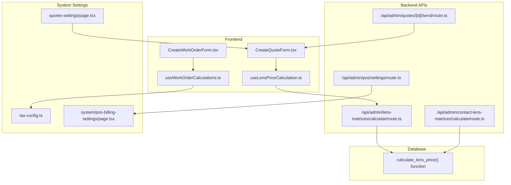
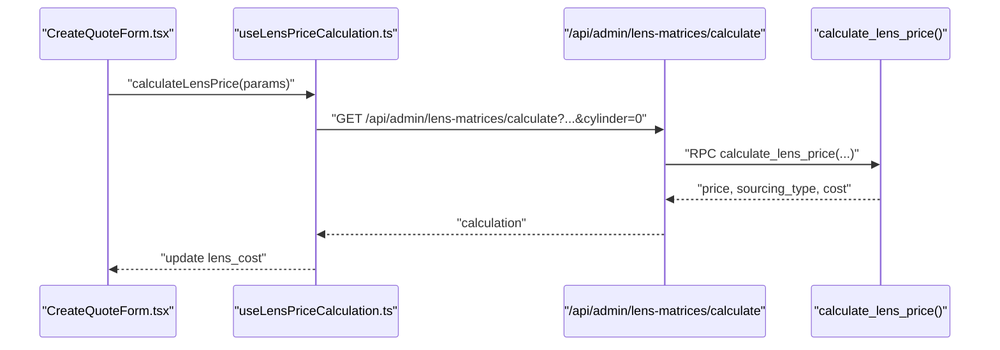
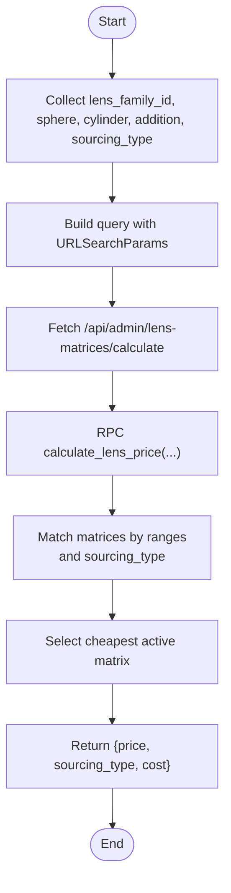
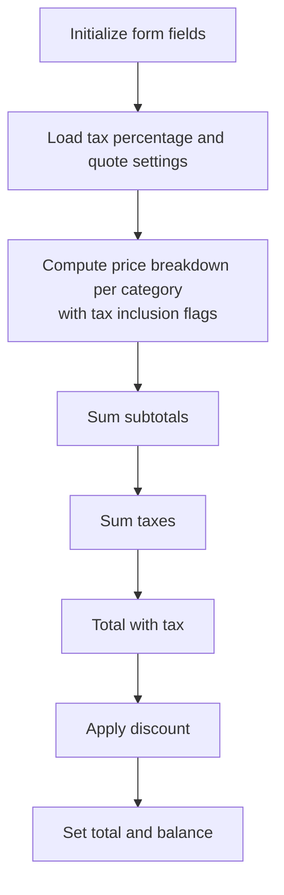
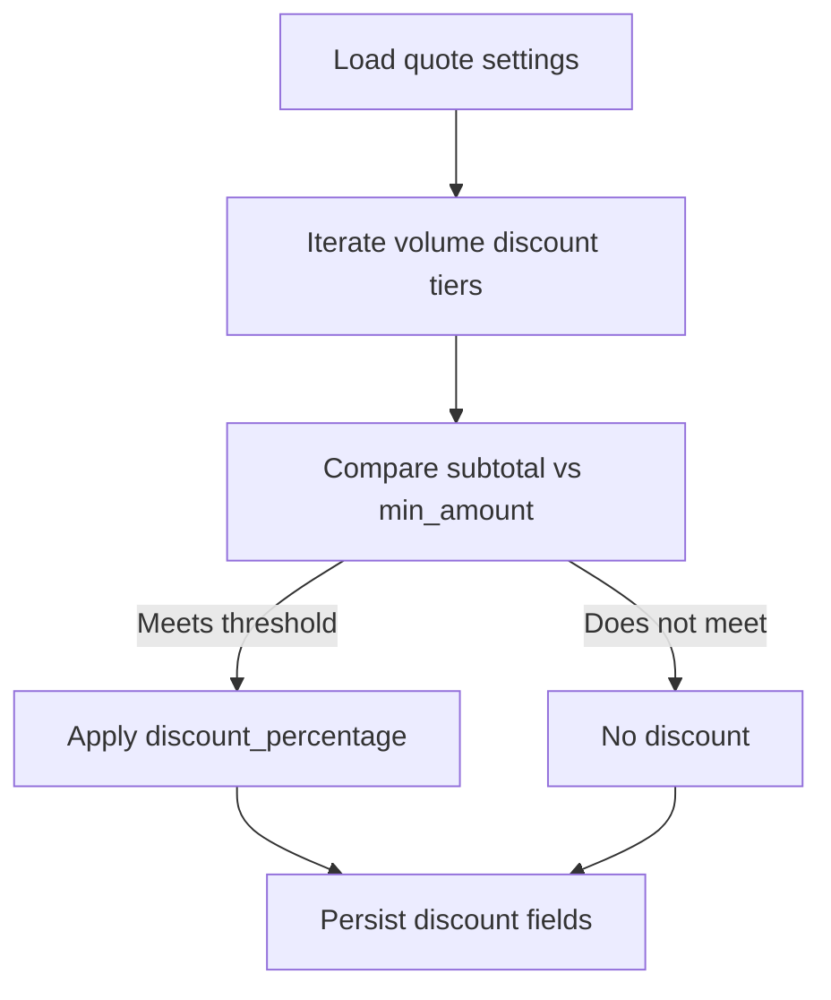
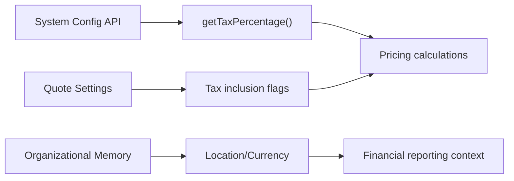
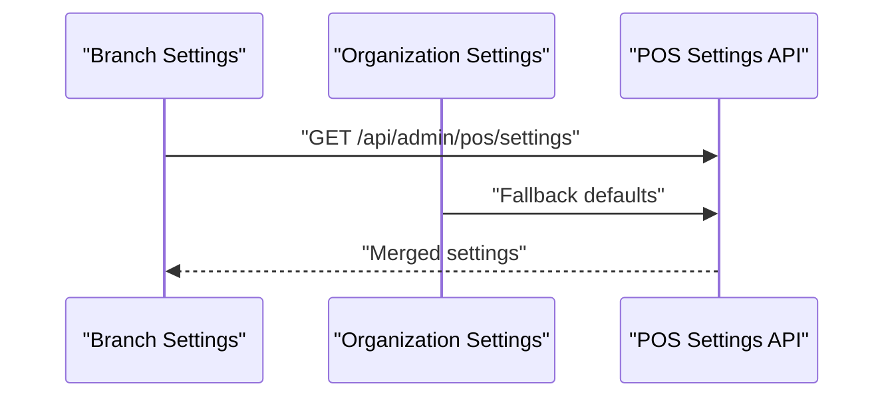
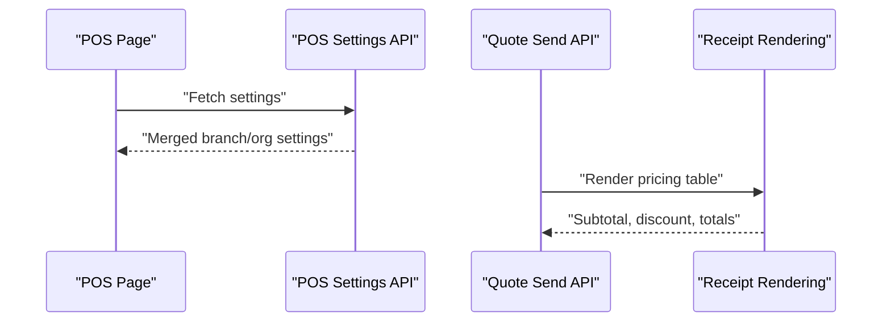
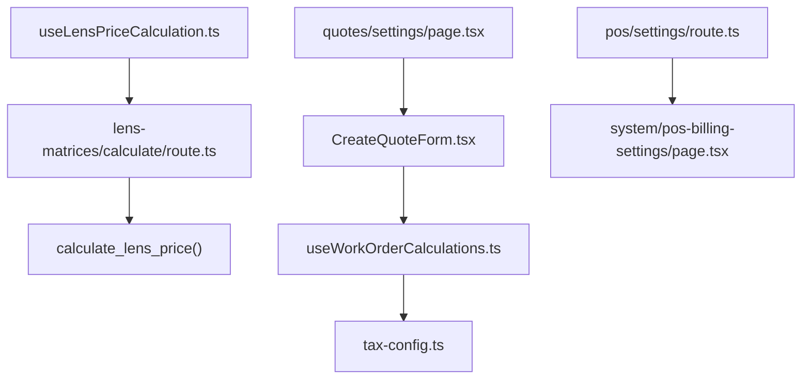

# Pricing Strategy & Markup Management

<cite>
**Referenced Files in This Document**
- [LENS_PRICE_CALCULATION_SYSTEM.md](file://docs/LENS_PRICE_CALCULATION_SYSTEM.md)
- [useLensPriceCalculation.ts](file://src/hooks/useLensPriceCalculation.ts)
- [CreateWorkOrderForm.tsx](file://src/components/admin/CreateWorkOrderForm.tsx)
- [useWorkOrderCalculations.ts](file://src/components/admin/CreateWorkOrderForm/hooks/useWorkOrderCalculations.ts)
- [CreateQuoteForm.tsx](file://src/components/admin/CreateQuoteForm.tsx)
- [quotes-settings-page.tsx](file://src/app/admin/quotes/settings/page.tsx)
- [tax-config.ts](file://src/lib/utils/tax-config.ts)
- [pos-settings-route.ts](file://src/app/api/admin/pos/settings/route.ts)
- [pos-billing-settings-page.tsx](file://src/app/admin/system/pos-billing-settings/page.tsx)
- [lens-matrices-calculate-route.ts](file://src/app/api/admin/lens-matrices/calculate/route.ts)
- [contact-lens-matrices-calculate-route.ts](file://src/app/api/admin/contact-lens-matrices/calculate/route.ts)
- [send-quote-route.ts](file://src/app/api/admin/quotes/[id]/send/route.ts)
- [organizational-memory.ts](file://src/lib/ai/memory/organizational.ts)
</cite>

## Table of Contents

1. [Introduction](#introduction)
2. [Project Structure](#project-structure)
3. [Core Components](#core-components)
4. [Architecture Overview](#architecture-overview)
5. [Detailed Component Analysis](#detailed-component-analysis)
6. [Dependency Analysis](#dependency-analysis)
7. [Performance Considerations](#performance-considerations)
8. [Troubleshooting Guide](#troubleshooting-guide)
9. [Conclusion](#conclusion)
10. [Appendices](#appendices)

## Introduction

This document explains Opttius pricing strategy and markup management across three pillars:

- Dynamic pricing engine for lenses and frames
- Cost-plus markup and competitive pricing strategies
- Volume discounts, promotional pricing, and seasonal adjustments

It documents how prices are calculated, how taxes are applied, how multi-location settings influence pricing, and how the system integrates with POS, quotes, and financial reporting.

## Project Structure

The pricing system spans frontend hooks, backend APIs, database functions, and administrative settings pages:

- Lens pricing engine: React hook and API routes for lens families and matrices
- Quote and work order pricing: Calculation hooks and forms for totals, taxes, and discounts
- Administrative settings: Volume discounts, tax configuration, POS billing settings
- Integration points: POS, quotes, receipts, and financial reporting

**Diagram sources**

- [useLensPriceCalculation.ts](file://src/hooks/useLensPriceCalculation.ts#L1-L75)
- [CreateQuoteForm.tsx](file://src/components/admin/CreateQuoteForm.tsx#L990-L2726)
- [CreateWorkOrderForm.tsx](file://src/components/admin/CreateWorkOrderForm.tsx)
- [useWorkOrderCalculations.ts](file://src/components/admin/CreateWorkOrderForm/hooks/useWorkOrderCalculations.ts#L1-L153)
- [lens-matrices-calculate-route.ts](file://src/app/api/admin/lens-matrices/calculate/route.ts)
- [contact-lens-matrices-calculate-route.ts](file://src/app/api/admin/contact-lens-matrices/calculate/route.ts)
- [send-quote-route.ts](file://src/app/api/admin/quotes/[id]/send/route.ts#L252-L284)
- [pos-settings-route.ts](file://src/app/api/admin/pos/settings/route.ts#L72-L339)
- [quotes-settings-page.tsx](file://src/app/admin/quotes/settings/page.tsx#L700-L830)
- [tax-config.ts](file://src/lib/utils/tax-config.ts#L1-L92)
- [pos-billing-settings-page.tsx](file://src/app/admin/system/pos-billing-settings/page.tsx#L399-L443)

**Section sources**

- [useLensPriceCalculation.ts](file://src/hooks/useLensPriceCalculation.ts#L1-L75)
- [CreateQuoteForm.tsx](file://src/components/admin/CreateQuoteForm.tsx#L990-L2726)
- [useWorkOrderCalculations.ts](file://src/components/admin/CreateWorkOrderForm/hooks/useWorkOrderCalculations.ts#L1-L153)
- [quotes-settings-page.tsx](file://src/app/admin/quotes/settings/page.tsx#L700-L830)
- [tax-config.ts](file://src/lib/utils/tax-config.ts#L1-L92)
- [pos-settings-route.ts](file://src/app/api/admin/pos/settings/route.ts#L72-L339)
- [pos-billing-settings-page.tsx](file://src/app/admin/system/pos-billing-settings/page.tsx#L399-L443)
- [lens-matrices-calculate-route.ts](file://src/app/api/admin/lens-matrices/calculate/route.ts)
- [contact-lens-matrices-calculate-route.ts](file://src/app/api/admin/contact-lens-matrices/calculate/route.ts)
- [send-quote-route.ts](file://src/app/api/admin/quotes/[id]/send/route.ts#L252-L284)

## Core Components

- Lens pricing engine: Uses lens families and price matrices to compute costs via a SQL function, exposed through a React hook and API route.
- Quote/work order pricing: Computes subtotal, tax, discount, and totals considering tax-inclusive settings per item category.
- Volume discounts: Configurable tiers applied automatically based on quote amount thresholds.
- Tax configuration: Centralized tax percentage retrieval from system configuration with fallback defaults.
- Multi-location pricing: POS and quote settings merge branch-level overrides with organization-level defaults.

**Section sources**

- [LENS_PRICE_CALCULATION_SYSTEM.md](file://docs/LENS_PRICE_CALCULATION_SYSTEM.md#L1-L580)
- [useLensPriceCalculation.ts](file://src/hooks/useLensPriceCalculation.ts#L1-L75)
- [CreateQuoteForm.tsx](file://src/components/admin/CreateQuoteForm.tsx#L990-L2726)
- [useWorkOrderCalculations.ts](file://src/components/admin/CreateWorkOrderForm/hooks/useWorkOrderCalculations.ts#L1-L153)
- [quotes-settings-page.tsx](file://src/app/admin/quotes/settings/page.tsx#L700-L830)
- [tax-config.ts](file://src/lib/utils/tax-config.ts#L1-L92)
- [pos-settings-route.ts](file://src/app/api/admin/pos/settings/route.ts#L72-L339)

## Architecture Overview

The pricing architecture combines:

- Database-driven pricing rules (lens families and matrices)
- Frontend-driven quote/work order calculations
- Administrative controls for volume discounts and tax behavior
- Multi-location settings for branch-specific overrides

**Diagram sources**

- [CreateQuoteForm.tsx](file://src/components/admin/CreateQuoteForm.tsx#L990-L2726)
- [useLensPriceCalculation.ts](file://src/hooks/useLensPriceCalculation.ts#L1-L75)
- [lens-matrices-calculate-route.ts](file://src/app/api/admin/lens-matrices/calculate/route.ts)

## Detailed Component Analysis

### Lens Pricing Engine

The lens pricing engine calculates costs based on:

- Lens family selection
- Prescription parameters: sphere, cylinder, addition
- Optional sourcing type preference
- Matrix ranges and base price/cost

Key behaviors:

- Cylinder is always sent (default 0) to avoid mismatches
- Addition is optional; matrices enforce addition_min/addition_max
- Function selects the cheapest active matrix, preferring stock when unspecified

**Diagram sources**

- [useLensPriceCalculation.ts](file://src/hooks/useLensPriceCalculation.ts#L1-L75)
- [lens-matrices-calculate-route.ts](file://src/app/api/admin/lens-matrices/calculate/route.ts)
- [LENS_PRICE_CALCULATION_SYSTEM.md](file://docs/LENS_PRICE_CALCULATION_SYSTEM.md#L105-L142)

**Section sources**

- [useLensPriceCalculation.ts](file://src/hooks/useLensPriceCalculation.ts#L1-L75)
- [LENS_PRICE_CALCULATION_SYSTEM.md](file://docs/LENS_PRICE_CALCULATION_SYSTEM.md#L1-L580)

### Quote and Work Order Pricing

Quote and work order forms compute totals with:

- Tax inclusion per category (frame, lens, treatments, labor, lab)
- Subtotal from untaxed components
- Total tax computed from each component’s breakdown
- Discount applied to total with tax
- Final total and balance derived from deposit

**Diagram sources**

- [useWorkOrderCalculations.ts](file://src/components/admin/CreateWorkOrderForm/hooks/useWorkOrderCalculations.ts#L1-L153)
- [CreateQuoteForm.tsx](file://src/components/admin/CreateQuoteForm.tsx#L990-L2726)
- [tax-config.ts](file://src/lib/utils/tax-config.ts#L1-L92)

**Section sources**

- [useWorkOrderCalculations.ts](file://src/components/admin/CreateWorkOrderForm/hooks/useWorkOrderCalculations.ts#L1-L153)
- [CreateQuoteForm.tsx](file://src/components/admin/CreateQuoteForm.tsx#L990-L2726)
- [tax-config.ts](file://src/lib/utils/tax-config.ts#L1-L92)

### Volume Discounts and Promotional Pricing

Administrative settings enable:

- Configurable volume discount tiers with minimum amounts and percentages
- Automatic application based on quote subtotal thresholds
- Promotion management via terms and conditions and notes templates

**Diagram sources**

- [quotes-settings-page.tsx](file://src/app/admin/quotes/settings/page.tsx#L700-L830)

**Section sources**

- [quotes-settings-page.tsx](file://src/app/admin/quotes/settings/page.tsx#L700-L830)

### Tax Implications and Currency Considerations

- Tax percentage is fetched from system configuration with fallback defaults
- Quote settings control whether individual components include tax
- AI organizational memory infers location and currency for broader context

**Diagram sources**

- [tax-config.ts](file://src/lib/utils/tax-config.ts#L1-L92)
- [CreateQuoteForm.tsx](file://src/components/admin/CreateQuoteForm.tsx#L990-L2726)
- [organizational-memory.ts](file://src/lib/ai/memory/organizational.ts#L88-L126)

**Section sources**

- [tax-config.ts](file://src/lib/utils/tax-config.ts#L1-L92)
- [organizational-memory.ts](file://src/lib/ai/memory/organizational.ts#L88-L126)

### Multi-Location Pricing Variations

- POS settings merge branch-level overrides with organization-level defaults
- Quote settings and tax behavior can vary by branch
- Billing settings support fixed minimum deposits and branch-specific configurations

**Diagram sources**

- [pos-settings-route.ts](file://src/app/api/admin/pos/settings/route.ts#L72-L339)
- [pos-billing-settings-page.tsx](file://src/app/admin/system/pos-billing-settings/page.tsx#L399-L443)

**Section sources**

- [pos-settings-route.ts](file://src/app/api/admin/pos/settings/route.ts#L72-L339)
- [pos-billing-settings-page.tsx](file://src/app/admin/system/pos-billing-settings/page.tsx#L399-L443)

### Integration with POS, Quotes, and Financial Reporting

- POS loads merged settings for consistent behavior across locations
- Quote send route renders a pricing breakdown for receipts
- Financial reporting benefits from consistent tax and discount logic

**Diagram sources**

- [pos-settings-route.ts](file://src/app/api/admin/pos/settings/route.ts#L72-L339)
- [send-quote-route.ts](file://src/app/api/admin/quotes/[id]/send/route.ts#L252-L284)

**Section sources**

- [send-quote-route.ts](file://src/app/api/admin/quotes/[id]/send/route.ts#L252-L284)

## Dependency Analysis

- Lens pricing depends on:
  - React hook for API communication
  - Backend route invoking a SQL function
  - Database matrices and families
- Quote/work order totals depend on:
  - Tax configuration utilities
  - Quote settings for tax inclusion
  - Form field changes driving recalculations

**Diagram sources**

- [useLensPriceCalculation.ts](file://src/hooks/useLensPriceCalculation.ts#L1-L75)
- [lens-matrices-calculate-route.ts](file://src/app/api/admin/lens-matrices/calculate/route.ts)
- [CreateQuoteForm.tsx](file://src/components/admin/CreateQuoteForm.tsx#L990-L2726)
- [useWorkOrderCalculations.ts](file://src/components/admin/CreateWorkOrderForm/hooks/useWorkOrderCalculations.ts#L1-L153)
- [tax-config.ts](file://src/lib/utils/tax-config.ts#L1-L92)
- [quotes-settings-page.tsx](file://src/app/admin/quotes/settings/page.tsx#L700-L830)
- [pos-settings-route.ts](file://src/app/api/admin/pos/settings/route.ts#L72-L339)
- [pos-billing-settings-page.tsx](file://src/app/admin/system/pos-billing-settings/page.tsx#L399-L443)

**Section sources**

- [useLensPriceCalculation.ts](file://src/hooks/useLensPriceCalculation.ts#L1-L75)
- [CreateQuoteForm.tsx](file://src/components/admin/CreateQuoteForm.tsx#L990-L2726)
- [useWorkOrderCalculations.ts](file://src/components/admin/CreateWorkOrderForm/hooks/useWorkOrderCalculations.ts#L1-L153)
- [quotes-settings-page.tsx](file://src/app/admin/quotes/settings/page.tsx#L700-L830)
- [tax-config.ts](file://src/lib/utils/tax-config.ts#L1-L92)
- [pos-settings-route.ts](file://src/app/api/admin/pos/settings/route.ts#L72-L339)
- [pos-billing-settings-page.tsx](file://src/app/admin/system/pos-billing-settings/page.tsx#L399-L443)

## Performance Considerations

- Lens matrix queries use indexed ranges; ensure matrices are normalized and ranges are inclusive to minimize misses.
- Recalculation hooks debounce totals computation to avoid excessive re-renders.
- Tax calculations are client-side and cached via settings loading to reduce network overhead.

## Troubleshooting Guide

Common issues and resolutions:

- Addition parameter not passed: Verify the API route forwards the addition parameter to the SQL function.
- Missing addition_min/addition_max: Apply the migration ensuring these fields exist for all matrices.
- Cylinder omitted when zero: Ensure the frontend always sends cylinder (default 0).
- No matching matrix: Use the debug endpoint to inspect available matrices and ranges.

**Section sources**

- [LENS_PRICE_CALCULATION_SYSTEM.md](file://docs/LENS_PRICE_CALCULATION_SYSTEM.md#L144-L175)
- [lens-matrices-calculate-route.ts](file://src/app/api/admin/lens-matrices/calculate/route.ts)
- [organizational-memory.ts](file://src/lib/ai/memory/organizational.ts#L88-L126)

## Conclusion

Opttius implements a robust, configurable pricing system:

- Dynamic lens pricing via database matrices and a SQL function
- Flexible quote/work order totals with tax-inclusive controls
- Automated volume discounts and promotion templates
- Multi-location settings for branch-specific behavior
- Clear integration points for POS, quotes, and financial reporting

## Appendices

- Example references:
  - Lens price calculation hook: [useLensPriceCalculation.ts](file://src/hooks/useLensPriceCalculation.ts#L1-L75)
  - Quote totals computation: [CreateQuoteForm.tsx](file://src/components/admin/CreateQuoteForm.tsx#L990-L2726)
  - Work order totals computation: [useWorkOrderCalculations.ts](file://src/components/admin/CreateWorkOrderForm/hooks/useWorkOrderCalculations.ts#L1-L153)
  - Volume discounts UI: [quotes-settings-page.tsx](file://src/app/admin/quotes/settings/page.tsx#L700-L830)
  - Tax configuration utilities: [tax-config.ts](file://src/lib/utils/tax-config.ts#L1-L92)
  - POS settings merging: [pos-settings-route.ts](file://src/app/api/admin/pos/settings/route.ts#L72-L339)
  - Lens pricing engine documentation: [LENS_PRICE_CALCULATION_SYSTEM.md](file://docs/LENS_PRICE_CALCULATION_SYSTEM.md#L1-L580)
