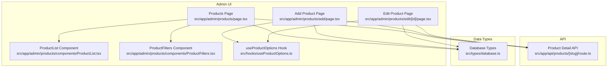
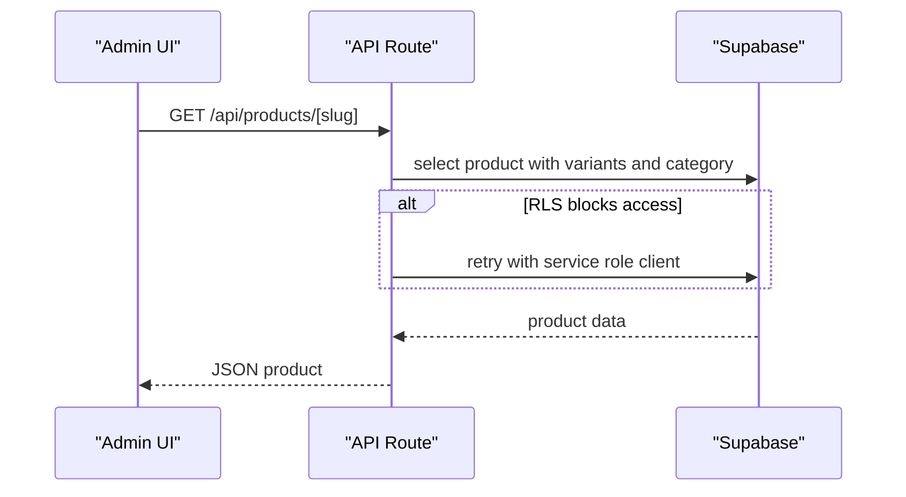
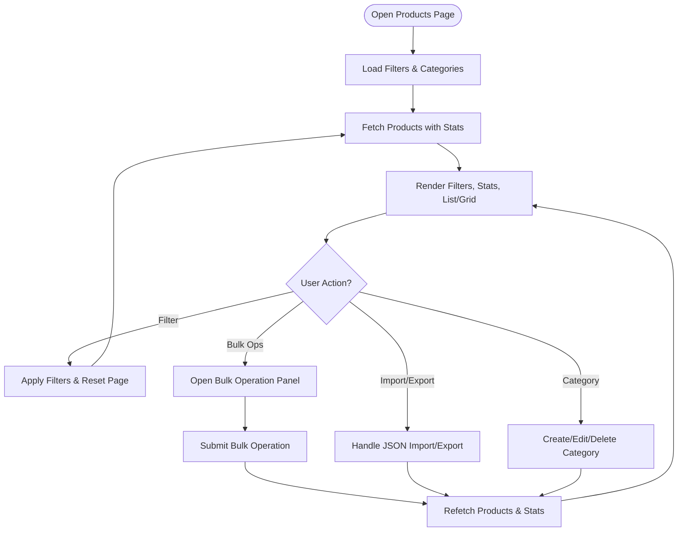
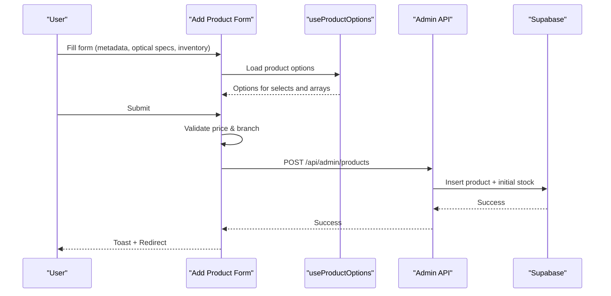
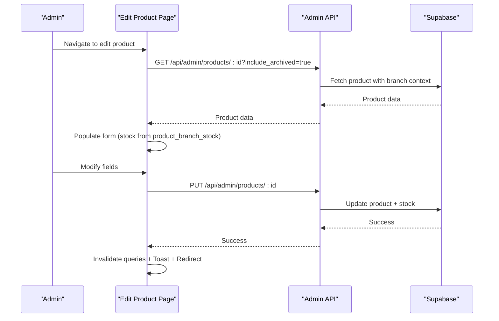
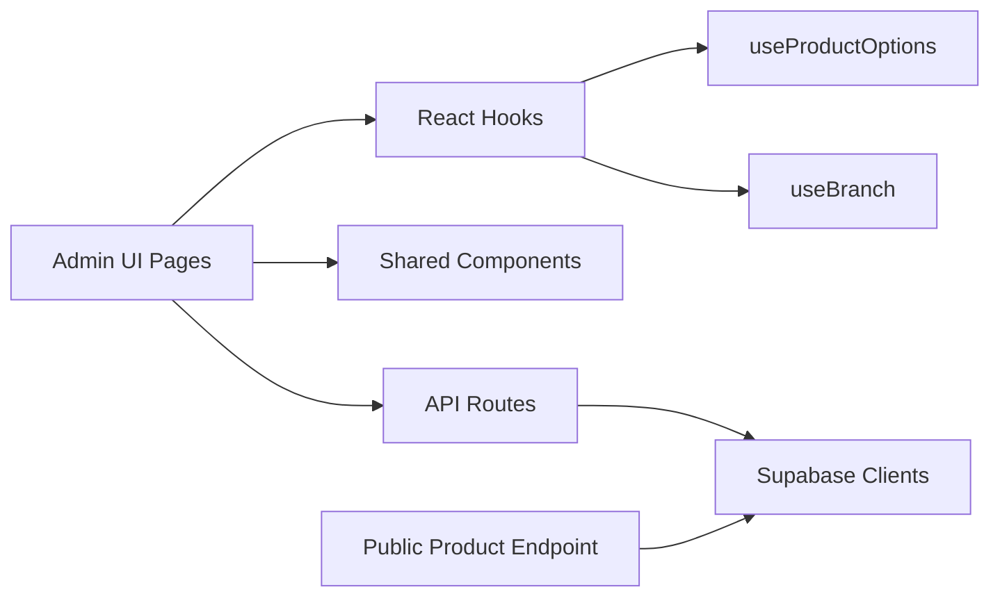

# Product Catalog Management

<cite>
**Referenced Files in This Document**
- [page.tsx](file://src/app/admin/products/page.tsx)
- [add/page.tsx](file://src/app/admin/products/add/page.tsx)
- [edit/[id]/page.tsx](file://src/app/admin/products/edit/[id]/page.tsx)
- [ProductList.tsx](file://src/app/admin/products/components/ProductList.tsx)
- [ProductFilters.tsx](file://src/app/admin/products/components/ProductFilters.tsx)
- [useProductOptions.ts](file://src/hooks/useProductOptions.ts)
- [route.ts](file://src/app/api/products/[slug]/route.ts)
- [database.ts](file://src/types/database.ts)
</cite>

## Table of Contents

1. [Introduction](#introduction)
2. [Project Structure](#project-structure)
3. [Core Components](#core-components)
4. [Architecture Overview](#architecture-overview)
5. [Detailed Component Analysis](#detailed-component-analysis)
6. [Dependency Analysis](#dependency-analysis)
7. [Performance Considerations](#performance-considerations)
8. [Troubleshooting Guide](#troubleshooting-guide)
9. [Conclusion](#conclusion)

## Introduction

This document explains the product catalog management system in Opttius with a focus on optical product lifecycle. It covers the end-to-end management of frames, lenses, accessories, and services, including specification management, creation, categorization, pricing strategies, inventory tracking, product options, customizable fields, variants, and search functionality. It also documents relationships among products, suppliers, pricing matrices, and customer preferences, and provides guidance for lifecycle management from creation through discontinuation, seasonal adjustments, and promotional pricing.

## Project Structure

The product catalog is primarily implemented in the admin area under the “Products” section. Key areas include:

- Admin product listing, filtering, bulk operations, and category management
- Product creation and editing forms with optical-specific fields
- Product options and dynamic field sets
- Public product detail endpoint for storefront consumption
- TypeScript database type definitions for product entities

**Diagram sources**

- [page.tsx](file://src/app/admin/products/page.tsx#L72-L1309)
- [add/page.tsx](file://src/app/admin/products/add/page.tsx#L40-L1538)
- [edit/[id]/page.tsx](file://src/app/admin/products/edit/[id]/page.tsx#L27-L1594)
- [ProductList.tsx](file://src/app/admin/products/components/ProductList.tsx#L1-L57)
- [ProductFilters.tsx](file://src/app/admin/products/components/ProductFilters.tsx#L1-L137)
- [useProductOptions.ts](file://src/hooks/useProductOptions.ts#L1-L73)
- [route.ts](file://src/app/api/products/[slug]/route.ts#L1-L87)
- [database.ts](file://src/types/database.ts#L122-L175)

**Section sources**

- [page.tsx](file://src/app/admin/products/page.tsx#L72-L1309)
- [add/page.tsx](file://src/app/admin/products/add/page.tsx#L40-L1538)
- [edit/[id]/page.tsx](file://src/app/admin/products/edit/[id]/page.tsx#L27-L1594)
- [ProductList.tsx](file://src/app/admin/products/components/ProductList.tsx#L1-L57)
- [ProductFilters.tsx](file://src/app/admin/products/components/ProductFilters.tsx#L1-L137)
- [useProductOptions.ts](file://src/hooks/useProductOptions.ts#L1-L73)
- [route.ts](file://src/app/api/products/[slug]/route.ts#L1-L87)
- [database.ts](file://src/types/database.ts#L122-L175)

## Core Components

- Admin Products Listing and Management
  - Provides filtering, pagination, bulk operations, category management, and import/export capabilities.
  - Supports grid and table view modes with persistent user preferences.
  - Integrates with product statistics and categories via dedicated hooks.

- Product Creation and Editing Forms
  - Unified form supporting optical product types: frames, lenses, accessories, and services.
  - Dynamic optical fields (frame materials/shapes/colors, lens types/materials/coatings, UV protection, blue light filter, photochromic, prescription availability, warranty).
  - Preset and customizable arrays for features and tints.
  - Branch-aware persistence and validation.

- Product Options and Dynamic Fields
  - Centralized product options loaded from the backend to drive form selects and arrays.
  - Provides fallbacks for backward compatibility when options are unavailable.

- Public Product Detail Endpoint
  - Fetches a single product by slug with variants and category relations.
  - Handles row-level security by attempting a service role client when needed.

- Database Types
  - Defines product entity shape and relationships for type-safe development.

**Section sources**

- [page.tsx](file://src/app/admin/products/page.tsx#L72-L1309)
- [add/page.tsx](file://src/app/admin/products/add/page.tsx#L40-L1538)
- [edit/[id]/page.tsx](file://src/app/admin/products/edit/[id]/page.tsx#L27-L1594)
- [useProductOptions.ts](file://src/hooks/useProductOptions.ts#L1-L73)
- [route.ts](file://src/app/api/products/[slug]/route.ts#L1-L87)
- [database.ts](file://src/types/database.ts#L122-L175)

## Architecture Overview

The product catalog system follows a layered architecture:

- Presentation Layer: Next.js app router pages and shared UI components.
- Domain Layer: Product forms, filters, and list rendering.
- Integration Layer: API routes for admin operations and public product retrieval.
- Data Layer: Supabase client usage with row-level security and service role fallback.

**Diagram sources**

- [route.ts](file://src/app/api/products/[slug]/route.ts#L1-L87)

**Section sources**

- [route.ts](file://src/app/api/products/[slug]/route.ts#L1-L87)

## Detailed Component Analysis

### Admin Products Page

Responsibilities:

- Manage view modes, pagination, and filters.
- Load and display products with stats and categories.
- Perform bulk operations (status/category/pricing/inventory updates, soft/hard delete).
- Import/export product catalogs in JSON format.
- Manage categories and their slugs.

Key behaviors:

- Uses local storage to persist view mode and items-per-page.
- Applies filters server-side and resets pagination when filters change.
- Branch-aware requests using x-branch-id header.
- Renders bulk operation panels conditionally based on selection and operation type.

**Diagram sources**

- [page.tsx](file://src/app/admin/products/page.tsx#L72-L1309)

**Section sources**

- [page.tsx](file://src/app/admin/products/page.tsx#L72-L1309)

### Product Creation Form (Add Product)

Responsibilities:

- Capture product metadata, optical specifications, and inventory.
- Dynamically populate form options from useProductOptions hook.
- Validate price and branch selection before submission.
- Persist product with branch association and initial stock.

Key behaviors:

- Auto-generates slug from product name.
- Converts frame measurements and prescription ranges to numeric values for persistence.
- Branch-aware submission via x-branch-id header.
- Prevents data loss with protected form state.

**Diagram sources**

- [add/page.tsx](file://src/app/admin/products/add/page.tsx#L40-L1538)
- [useProductOptions.ts](file://src/hooks/useProductOptions.ts#L1-L73)

**Section sources**

- [add/page.tsx](file://src/app/admin/products/add/page.tsx#L40-L1538)
- [useProductOptions.ts](file://src/hooks/useProductOptions.ts#L1-L73)

### Product Editing Form (Edit Product)

Responsibilities:

- Load existing product data with archived visibility for admin editing.
- Update product metadata, optical specifications, and inventory.
- Branch-aware updates and cache invalidation.

Key behaviors:

- Loads stock from product_branch_stock with fallback to deprecated inventory_quantity.
- Converts numeric fields back to strings for form inputs.
- Branch-aware PUT requests and React Query cache invalidation.

**Diagram sources**

- [edit/[id]/page.tsx](file://src/app/admin/products/edit/[id]/page.tsx#L27-L1594)

**Section sources**

- [edit/[id]/page.tsx](file://src/app/admin/products/edit/[id]/page.tsx#L27-L1594)

### Product Options and Dynamic Fields

Responsibilities:

- Load centralized product options (e.g., product_type, frame_type, lens_type, lens_material, lens_coatings, uv_protection).
- Provide fallbacks when options are unavailable.
- Drive form selects and array fields for features and tints.

Implementation highlights:

- Options fetched from /api/admin/product-options.
- Transforms backend fields into a map keyed by field_key for easy form binding.

**Section sources**

- [useProductOptions.ts](file://src/hooks/useProductOptions.ts#L1-L73)

### Product List and Filters

Responsibilities:

- Render products in grid or table view.
- Provide search, category, status, low-stock, and view-mode toggles.
- Support selection and bulk actions.

Integration:

- ProductList delegates to ProductGrid or ProductTable based on view mode.
- Filters component emits changes to parent state.

**Section sources**

- [ProductList.tsx](file://src/app/admin/products/components/ProductList.tsx#L1-L57)
- [ProductFilters.tsx](file://src/app/admin/products/components/ProductFilters.tsx#L1-L137)

### Public Product Detail Endpoint

Responsibilities:

- Serve product details by slug for storefront use.
- Include variants and category relations.
- Handle row-level security by falling back to service role client when needed.

**Section sources**

- [route.ts](file://src/app/api/products/[slug]/route.ts#L1-L87)

### Database Types for Products

Responsibilities:

- Define product entity shape and relationships for type-safe development.
- Provide base tables, inserts, updates, and enums.

Note: The referenced product table definition focuses on a simplified product entity. The admin product forms and API routes indicate a richer schema with optical fields and branch stock, which is handled by the admin APIs and UI.

**Section sources**

- [database.ts](file://src/types/database.ts#L122-L175)

## Dependency Analysis

- UI Components depend on:
  - useProductOptions for dynamic field options.
  - useBranch for branch-aware requests.
  - React Query for caching and invalidation.
- Admin Pages depend on:
  - useProducts/useProductStats/useCategories for data.
  - useProductOptions for form options.
- API Routes depend on:
  - Supabase clients with row-level security and service role fallback.
- Public Product Endpoint depends on:
  - Supabase service role client for public access when RLS blocks.

**Diagram sources**

- [page.tsx](file://src/app/admin/products/page.tsx#L59-L68)
- [add/page.tsx](file://src/app/admin/products/add/page.tsx#L32-L47)
- [edit/[id]/page.tsx](file://src/app/admin/products/edit/[id]/page.tsx#L24-L32)
- [useProductOptions.ts](file://src/hooks/useProductOptions.ts#L1-L73)
- [route.ts](file://src/app/api/products/[slug]/route.ts#L1-L87)

**Section sources**

- [page.tsx](file://src/app/admin/products/page.tsx#L59-L68)
- [add/page.tsx](file://src/app/admin/products/add/page.tsx#L32-L47)
- [edit/[id]/page.tsx](file://src/app/admin/products/edit/[id]/page.tsx#L24-L32)
- [useProductOptions.ts](file://src/hooks/useProductOptions.ts#L1-L73)
- [route.ts](file://src/app/api/products/[slug]/route.ts#L1-L87)

## Performance Considerations

- Server-Side Filtering and Pagination
  - The admin page applies filters server-side and resets pagination, reducing client-side computation and network overhead.
- Local Storage Persistence
  - View mode and items-per-page are persisted locally to avoid repeated recalculations and improve UX.
- Memoized Components
  - ProductList uses memoization to prevent unnecessary re-renders when props remain unchanged.
- Branch-Aware Requests
  - Using x-branch-id headers ensures targeted queries and avoids cross-branch data transfer.
- Cache Invalidation
  - After edits, React Query caches are invalidated to keep lists and stats fresh.

[No sources needed since this section provides general guidance]

## Troubleshooting Guide

Common issues and resolutions:

- Product Not Found by Slug
  - Verify the product exists, is active, and slug is correct. The public endpoint returns 404 when not found.
  - Check row-level security policies; the endpoint retries with a service role client when needed.
- Branch Context Issues
  - Ensure a branch is selected or super admin privileges are used. Admin forms require a valid branch context for creation and updates.
- Price Validation Failures
  - The creation form validates that price is a non-negative number. Ensure numeric input and correct decimal formatting.
- Bulk Operations Failures
  - Confirm at least one product is selected and a valid operation is chosen. Review error messages returned by the API.
- Import/Export Problems
  - Validate JSON format and structure. The import endpoint supports create/update modes and returns a summary of results.

**Section sources**

- [route.ts](file://src/app/api/products/[slug]/route.ts#L70-L76)
- [add/page.tsx](file://src/app/admin/products/add/page.tsx#L406-L450)
- [page.tsx](file://src/app/admin/products/page.tsx#L209-L276)
- [page.tsx](file://src/app/admin/products/page.tsx#L311-L356)

## Conclusion

Opttius provides a comprehensive product catalog management system tailored for optical retail. The admin interface supports robust creation, editing, filtering, bulk operations, and import/export workflows. The unified form accommodates frames, lenses, accessories, and services with extensive optical specifications and dynamic options. Public product endpoints enable storefront consumption with secure access patterns. By leveraging branch-aware requests, cache invalidation, and server-side filtering, the system balances performance and usability while ensuring accurate inventory and pricing management across the optical product lifecycle.
