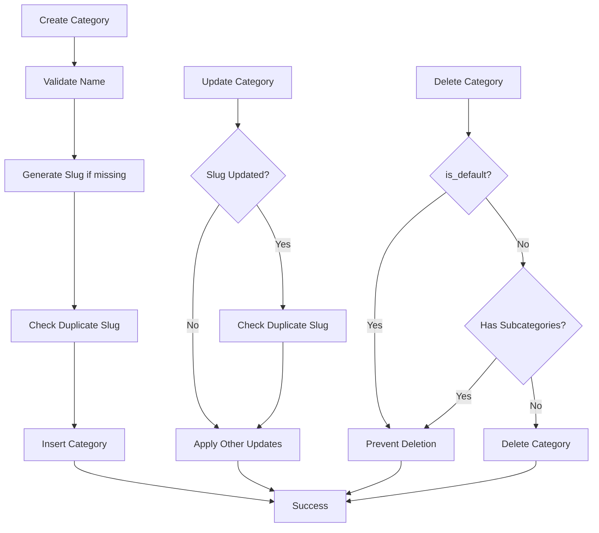

# Product Categorization & Organization

<cite>
**Referenced Files in This Document**
- [page.tsx](file://src/app/admin/categories/page.tsx)
- [categories.ts](file://src/lib/ai/tools/categories.ts)
- [20241220000001_create_ecommerce_system.sql](file://supabase/migrations/20241220000001_create_ecommerce_system.sql)
- [20260123000001_add_system_categories.sql](file://supabase/migrations/20260123000001_add_system_categories.sql)
- [20260130000000_protect_default_categories.sql](file://supabase/migrations/20260130000000_protect_default_categories.sql)
</cite>

## Table of Contents

1. [Introduction](#introduction)
2. [Project Structure](#project-structure)
3. [Core Components](#core-components)
4. [Architecture Overview](#architecture-overview)
5. [Detailed Component Analysis](#detailed-component-analysis)
6. [Dependency Analysis](#dependency-analysis)
7. [Performance Considerations](#performance-considerations)
8. [Troubleshooting Guide](#troubleshooting-guide)
9. [Conclusion](#conclusion)

## Introduction

This document explains the product categorization system in Opttius, focusing on the hierarchical category model, category management workflows, and the relationships between categories and products. It covers category creation, editing, deletion, validation, slug generation, filtering, and integration with product listings, search, and reporting. It also documents visibility rules, multi-branch considerations, and protections against accidental deletion of default categories.

## Project Structure

The categorization system spans three primary areas:

- Admin UI for managing categories
- AI tools for programmatic category operations
- Database schema and policies supporting hierarchy, visibility, and safety

**Diagram sources**

- [page.tsx](file://src/app/admin/categories/page.tsx#L1-L492)
- [categories.ts](file://src/lib/ai/tools/categories.ts#L1-L544)
- [20241220000001_create_ecommerce_system.sql](file://supabase/migrations/20241220000001_create_ecommerce_system.sql#L1-L250)
- [20260123000001_add_system_categories.sql](file://supabase/migrations/20260123000001_add_system_categories.sql#L1-L27)
- [20260130000000_protect_default_categories.sql](file://supabase/migrations/20260130000000_protect_default_categories.sql#L1-L39)

**Section sources**

- [page.tsx](file://src/app/admin/categories/page.tsx#L1-L492)
- [categories.ts](file://src/lib/ai/tools/categories.ts#L1-L544)
- [20241220000001_create_ecommerce_system.sql](file://supabase/migrations/20241220000001_create_ecommerce_system.sql#L1-L250)
- [20260123000001_add_system_categories.sql](file://supabase/migrations/20260123000001_add_system_categories.sql#L1-L27)
- [20260130000000_protect_default_categories.sql](file://supabase/migrations/20260130000000_protect_default_categories.sql#L1-L39)

## Core Components

- Hierarchical categories table with parent-child relationships and optional slugs
- Admin UI for CRUD operations with auto-generated slugs and validation
- AI tools for listing, retrieving, creating, updating, deleting, and building category trees
- Database triggers and policies to protect default categories and enforce visibility

Key capabilities:

- Multi-level hierarchy with parent_id references
- Visibility controlled by is_active flag and RLS policies
- Slug uniqueness enforced at creation/update
- Deletion safeguards for default/system categories

**Section sources**

- [20241220000001_create_ecommerce_system.sql](file://supabase/migrations/20241220000001_create_ecommerce_system.sql#L1-L250)
- [page.tsx](file://src/app/admin/categories/page.tsx#L75-L84)
- [categories.ts](file://src/lib/ai/tools/categories.ts#L16-L41)
- [20260130000000_protect_default_categories.sql](file://supabase/migrations/20260130000000_protect_default_categories.sql#L18-L36)

## Architecture Overview

The system integrates a React admin page with Supabase-backed category operations. The AI tools encapsulate category logic for external integrations, while database migrations define schema, indexes, and protections.

**Diagram sources**

- [page.tsx](file://src/app/admin/categories/page.tsx#L57-L73)
- [page.tsx](file://src/app/admin/categories/page.tsx#L120-L176)
- [page.tsx](file://src/app/admin/categories/page.tsx#L183-L219)
- [categories.ts](file://src/lib/ai/tools/categories.ts#L69-L123)
- [categories.ts](file://src/lib/ai/tools/categories.ts#L234-L304)
- [categories.ts](file://src/lib/ai/tools/categories.ts#L407-L463)

## Detailed Component Analysis

### Admin Category Management UI

The admin page provides a full CRUD interface for categories:

- Listing with cards showing name, slug, description, and creation date
- Create/Edit dialog with auto-generated slug on name change
- Delete confirmation with safeguards for default categories
- Loading and error states

**Diagram sources**

- [page.tsx](file://src/app/admin/categories/page.tsx#L30-L73)
- [page.tsx](file://src/app/admin/categories/page.tsx#L102-L176)
- [page.tsx](file://src/app/admin/categories/page.tsx#L178-L219)

**Section sources**

- [page.tsx](file://src/app/admin/categories/page.tsx#L30-L492)

### Category Creation, Editing, and Deletion Workflows

- Creation: Name is required; slug auto-generated; optional description/image; parent_id nullable; sort_order defaults to 0; is_active defaults to true
- Editing: Partial updates supported; slug uniqueness checked when changed
- Deletion: Protected if is_default=true; prevents deletion of categories with subcategories

**Diagram sources**

- [categories.ts](file://src/lib/ai/tools/categories.ts#L16-L41)
- [categories.ts](file://src/lib/ai/tools/categories.ts#L234-L304)
- [categories.ts](file://src/lib/ai/tools/categories.ts#L340-L392)
- [categories.ts](file://src/lib/ai/tools/categories.ts#L407-L463)
- [page.tsx](file://src/app/admin/categories/page.tsx#L75-L84)
- [page.tsx](file://src/app/admin/categories/page.tsx#L120-L176)
- [page.tsx](file://src/app/admin/categories/page.tsx#L183-L219)

**Section sources**

- [categories.ts](file://src/lib/ai/tools/categories.ts#L16-L41)
- [categories.ts](file://src/lib/ai/tools/categories.ts#L234-L304)
- [categories.ts](file://src/lib/ai/tools/categories.ts#L340-L392)
- [categories.ts](file://src/lib/ai/tools/categories.ts#L407-L463)
- [page.tsx](file://src/app/admin/categories/page.tsx#L75-L84)
- [page.tsx](file://src/app/admin/categories/page.tsx#L120-L176)
- [page.tsx](file://src/app/admin/categories/page.tsx#L183-L219)

### Category Filtering and Search

The AI tools expose robust filtering:

- Search by name (ILIKE)
- Filter by parent_id
- Filter by is_active
- Pagination with limit and page
- Tree retrieval with nested children

**Diagram sources**

- [categories.ts](file://src/lib/ai/tools/categories.ts#L45-L124)
- [categories.ts](file://src/lib/ai/tools/categories.ts#L466-L542)

**Section sources**

- [categories.ts](file://src/lib/ai/tools/categories.ts#L45-L124)
- [categories.ts](file://src/lib/ai/tools/categories.ts#L466-L542)

### Category Tree Construction

The AI tool builds a hierarchical tree from flat category records:

- Map all nodes by id
- Attach children to parents using parent_id
- Root nodes are those without parent_id

**Diagram sources**

- [categories.ts](file://src/lib/ai/tools/categories.ts#L508-L534)

**Section sources**

- [categories.ts](file://src/lib/ai/tools/categories.ts#L508-L534)

### Database Schema and Policies

The categories table supports:

- Hierarchical parent_id references with ON DELETE SET NULL
- Indexes on slug, parent_id, and is_active for performance
- Row Level Security policies controlling visibility
- Triggers to update timestamps

Default/system categories and protections:

- is_system marks system-level categories (e.g., "Marcos")
- is_default marks core default categories protected from deletion
- Trigger prevents deletion of default categories

**Diagram sources**

- [20241220000001_create_ecommerce_system.sql](file://supabase/migrations/20241220000001_create_ecommerce_system.sql#L1-L250)
- [20260123000001_add_system_categories.sql](file://supabase/migrations/20260123000001_add_system_categories.sql#L1-L27)
- [20260130000000_protect_default_categories.sql](file://supabase/migrations/20260130000000_protect_default_categories.sql#L1-L39)

**Section sources**

- [20241220000001_create_ecommerce_system.sql](file://supabase/migrations/20241220000001_create_ecommerce_system.sql#L1-L250)
- [20260123000001_add_system_categories.sql](file://supabase/migrations/20260123000001_add_system_categories.sql#L1-L27)
- [20260130000000_protect_default_categories.sql](file://supabase/migrations/20260130000000_protect_default_categories.sql#L1-L39)

### Product-Category Relationships

Products reference categories via category_id with ON DELETE SET NULL, meaning:

- Deleting a category does not delete its products
- Products lose their category association (category_id becomes null)
- This preserves product data integrity while removing categorization

**Diagram sources**

- [categories.ts](file://src/lib/ai/tools/categories.ts#L443-L447)
- [20241220000001_create_ecommerce_system.sql](file://supabase/migrations/20241220000001_create_ecommerce_system.sql#L1-L250)

**Section sources**

- [categories.ts](file://src/lib/ai/tools/categories.ts#L443-L447)
- [20241220000001_create_ecommerce_system.sql](file://supabase/migrations/20241220000001_create_ecommerce_system.sql#L1-L250)

### Visibility Rules and Reporting

- is_active controls whether categories appear in listings
- RLS policies govern who can view categories
- Reporting can leverage counts of products and subcategories per category

**Diagram sources**

- [categories.ts](file://src/lib/ai/tools/categories.ts#L173-L183)
- [20241220000001_create_ecommerce_system.sql](file://supabase/migrations/20241220000001_create_ecommerce_system.sql#L232-L240)

**Section sources**

- [categories.ts](file://src/lib/ai/tools/categories.ts#L173-L183)
- [20241220000001_create_ecommerce_system.sql](file://supabase/migrations/20241220000001_create_ecommerce_system.sql#L232-L240)

## Dependency Analysis

- Admin UI depends on API endpoints for category operations
- AI tools depend on Supabase client and organization context
- Database constraints enforce referential integrity and cascading behavior
- Triggers and policies protect default categories and maintain audit fields

**Diagram sources**

- [page.tsx](file://src/app/admin/categories/page.tsx#L57-L73)
- [categories.ts](file://src/lib/ai/tools/categories.ts#L69-L123)
- [20241220000001_create_ecommerce_system.sql](file://supabase/migrations/20241220000001_create_ecommerce_system.sql#L1-L250)
- [20260130000000_protect_default_categories.sql](file://supabase/migrations/20260130000000_protect_default_categories.sql#L18-L36)

**Section sources**

- [page.tsx](file://src/app/admin/categories/page.tsx#L57-L73)
- [categories.ts](file://src/lib/ai/tools/categories.ts#L69-L123)
- [20241220000001_create_ecommerce_system.sql](file://supabase/migrations/20241220000001_create_ecommerce_system.sql#L1-L250)
- [20260130000000_protect_default_categories.sql](file://supabase/migrations/20260130000000_protect_default_categories.sql#L18-L36)

## Performance Considerations

- Indexes on slug, parent_id, and is_active improve query performance
- Tree construction is O(n) with hash map lookups
- Pagination limits results to avoid heavy loads
- Consider caching frequently accessed category trees for high-traffic scenarios

[No sources needed since this section provides general guidance]

## Troubleshooting Guide

Common issues and resolutions:

- Duplicate slug errors during creation/update: The system appends a timestamp suffix to ensure uniqueness
- Cannot delete default categories: Deletion is blocked by a trigger; remove the is_default flag or consult system administrators
- Category deletion fails due to subcategories: Delete or reassign child categories first
- Empty category lists: Verify is_active flag and RLS policies; ensure categories are created under the correct organization context

**Section sources**

- [categories.ts](file://src/lib/ai/tools/categories.ts#L261-L270)
- [categories.ts](file://src/lib/ai/tools/categories.ts#L352-L363)
- [categories.ts](file://src/lib/ai/tools/categories.ts#L430-L441)
- [20260130000000_protect_default_categories.sql](file://supabase/migrations/20260130000000_protect_default_categories.sql#L18-L36)

## Conclusion

Opttius implements a robust, hierarchical product categorization system with strong safeguards, flexible filtering, and clear admin workflows. The combination of UI-driven management, AI-powered tools, and database-level protections ensures reliable category operations, safe defaults, and scalable performance.
