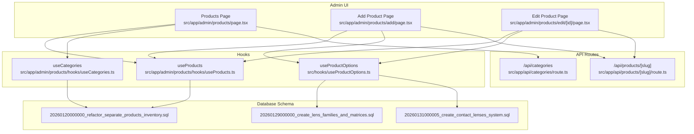
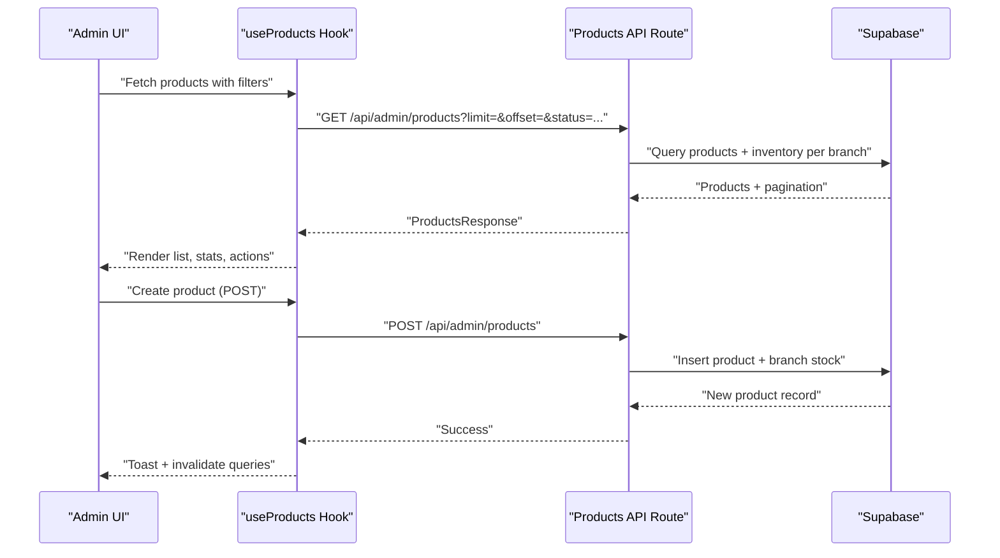
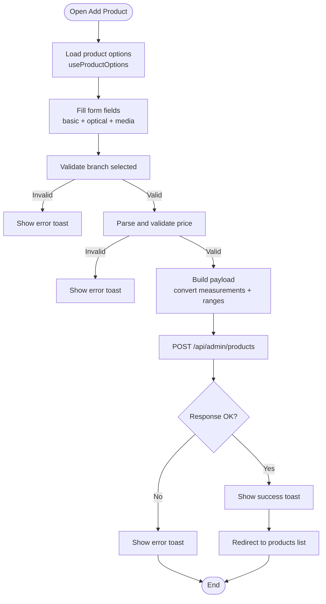
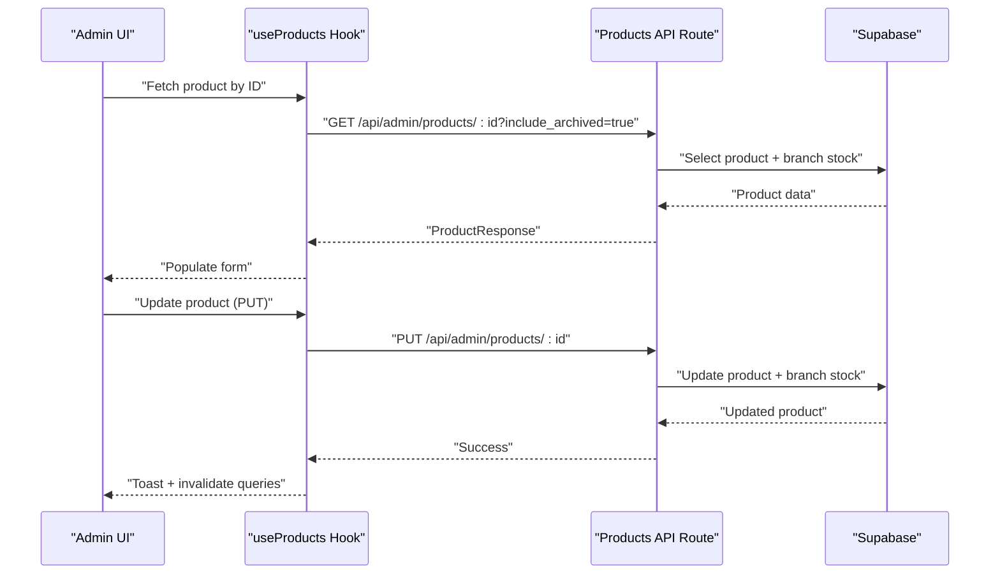
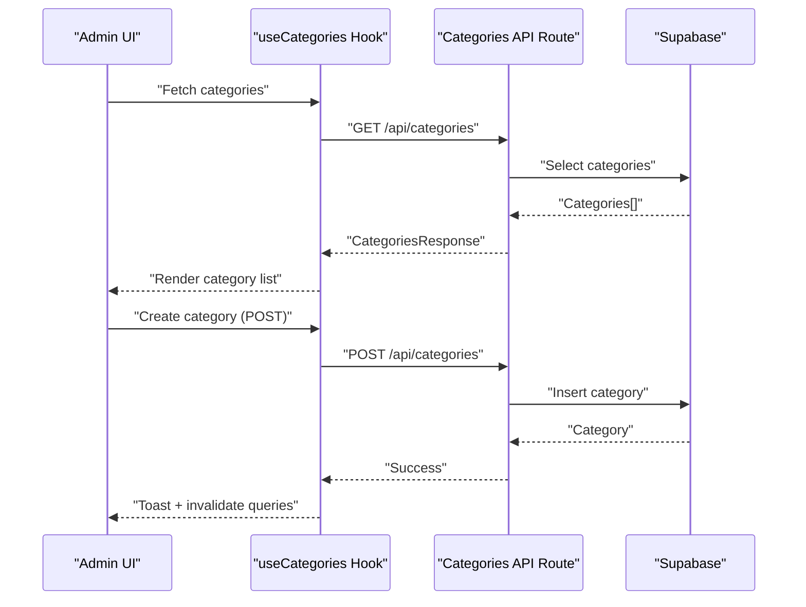
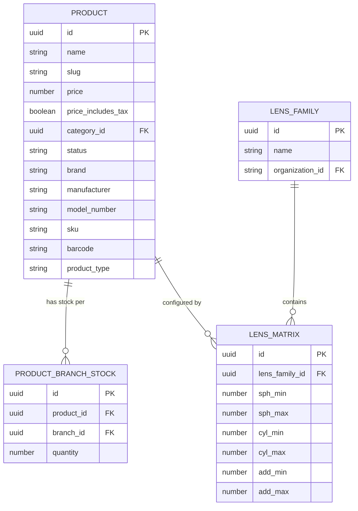

# Product Definition & Configuration

<cite>
**Referenced Files in This Document**
- [page.tsx](file://src/app/admin/products/page.tsx)
- [add/page.tsx](file://src/app/admin/products/add/page.tsx)
- [edit/[id]/page.tsx](file://src/app/admin/products/edit/[id]/page.tsx)
- [useProducts.ts](file://src/app/admin/products/hooks/useProducts.ts)
- [useCategories.ts](file://src/app/admin/products/hooks/useCategories.ts)
- [useProductOptions.ts](file://src/hooks/useProductOptions.ts)
- [categories/route.ts](file://src/app/api/categories/route.ts)
- [products/[slug]/route.ts](file://src/app/api/products/[slug]/route.ts)
- [20260120000000_refactor_separate_products_inventory.sql](file://supabase/migrations/20260120000000_refactor_separate_products_inventory.sql)
- [20260129000000_create_lens_families_and_matrices.sql](file://supabase/migrations/20260129000000_create_lens_families_and_matrices.sql)
- [20260129000001_update_payments_gateway_stripe_to_flow.sql](file://supabase/migrations/20260129000001_update_payments_gateway_stripe_to_flow.sql)
- [20260131000005_create_contact_lenses_system.sql](file://supabase/migrations/20260131000005_create_contact_lenses_system.sql)
- [20260131000006_add_contact_lens_fields_to_quotes_and_work_orders.sql](file://supabase/migrations/20260131000006_add_contact_lens_fields_to_quotes_and_work_orders.sql)
- [20260131000007_seed_contact_lens_demo_data.sql](file://supabase/migrations/20260131000007_seed_contact_lenses_demo_data.sql)
</cite>

## Table of Contents

1. [Introduction](#introduction)
2. [Project Structure](#project-structure)
3. [Core Components](#core-components)
4. [Architecture Overview](#architecture-overview)
5. [Detailed Component Analysis](#detailed-component-analysis)
6. [Dependency Analysis](#dependency-analysis)
7. [Performance Considerations](#performance-considerations)
8. [Troubleshooting Guide](#troubleshooting-guide)
9. [Conclusion](#conclusion)

## Introduction

This document explains how Opttius manages product definition and configuration across optical retail needs. It covers the end-to-end product creation workflow, form validation, categorization, optical-specific attributes (frames, lenses, accessories, services), variants and SKUs, barcode integration, media management, and the relationships to inventory tracking, pricing, and customer selection processes. The content is grounded in the actual codebase and database migrations to ensure accuracy and practical applicability.

## Project Structure

The product management surface is organized around:

- Admin UI pages for listing, adding, editing, and bulk operations
- React Query hooks for data fetching and mutations
- API routes for CRUD operations and category management
- Supabase migrations defining product and inventory schemas

**Diagram sources**

- [page.tsx](file://src/app/admin/products/page.tsx#L72-L1309)
- [add/page.tsx](file://src/app/admin/products/add/page.tsx#L40-L1538)
- [edit/[id]/page.tsx](file://src/app/admin/products/edit/[id]/page.tsx#L27-L1594)
- [useProducts.ts](file://src/app/admin/products/hooks/useProducts.ts#L103-L225)
- [useCategories.ts](file://src/app/admin/products/hooks/useCategories.ts#L22-L124)
- [useProductOptions.ts](file://src/hooks/useProductOptions.ts#L30-L73)
- [categories/route.ts](file://src/app/api/categories/route.ts)
- [products/[slug]/route.ts](file://src/app/api/products/[slug]/route.ts)
- [20260120000000_refactor_separate_products_inventory.sql](file://supabase/migrations/20260120000000_refactor_separate_products_inventory.sql)
- [20260129000000_create_lens_families_and_matrices.sql](file://supabase/migrations/20260129000000_create_lens_families_and_matrices.sql)
- [20260131000005_create_contact_lenses_system.sql](file://supabase/migrations/20260131000005_create_contact_lenses_system.sql)

**Section sources**

- [page.tsx](file://src/app/admin/products/page.tsx#L72-L1309)
- [add/page.tsx](file://src/app/admin/products/add/page.tsx#L40-L1538)
- [edit/[id]/page.tsx](file://src/app/admin/products/edit/[id]/page.tsx#L27-L1594)
- [useProducts.ts](file://src/app/admin/products/hooks/useProducts.ts#L103-L225)
- [useCategories.ts](file://src/app/admin/products/hooks/useCategories.ts#L22-L124)
- [useProductOptions.ts](file://src/hooks/useProductOptions.ts#L30-L73)

## Core Components

- Products listing and management UI with filters, bulk operations, and import/export
- Add/Edit product forms with optical-specific sections (frame, lens, accessory, service)
- Validation pipeline for prices, branch association, and required fields
- Category management and dynamic option loading via product options
- Inventory separation per branch and stock quantity handling
- Lens families and matrices for optical configuration

**Section sources**

- [page.tsx](file://src/app/admin/products/page.tsx#L72-L1309)
- [add/page.tsx](file://src/app/admin/products/add/page.tsx#L40-L1538)
- [edit/[id]/page.tsx](file://src/app/admin/products/edit/[id]/page.tsx#L27-L1594)
- [useProducts.ts](file://src/app/admin/products/hooks/useProducts.ts#L103-L225)
- [useCategories.ts](file://src/app/admin/products/hooks/useCategories.ts#L22-L124)
- [useProductOptions.ts](file://src/hooks/useProductOptions.ts#L30-L73)

## Architecture Overview

The product lifecycle spans UI forms, React Query hooks, API routes, and database migrations. The system supports multitenancy via branch headers and separates product inventory from global product metadata.

**Diagram sources**

- [useProducts.ts](file://src/app/admin/products/hooks/useProducts.ts#L47-L101)
- [useProducts.ts](file://src/app/admin/products/hooks/useProducts.ts#L122-L150)
- [page.tsx](file://src/app/admin/products/page.tsx#L234-L245)

**Section sources**

- [useProducts.ts](file://src/app/admin/products/hooks/useProducts.ts#L47-L101)
- [useProducts.ts](file://src/app/admin/products/hooks/useProducts.ts#L122-L150)
- [page.tsx](file://src/app/admin/products/page.tsx#L234-L245)

## Detailed Component Analysis

### Product Creation Workflow

The creation workflow is implemented in the Add Product page. It collects:

- Basic info: name, slug, short description
- Pricing and inventory: price, stock quantity for current branch, tax inclusion flag
- Optical product fields: product type, brand, manufacturer, model number
- Frame-specific attributes: type, material, shape, gender, size, color, measurements, features
- Lens-specific attributes: type, material, index, coatings, tints, UV protection, blue light filter, photochromic, prescription availability, prescription range, warranty
- SKU and barcode
- Media: featured image
- Status and publication date

Validation logic includes:

- Branch selection requirement for creation
- Price parsing and numeric validation with minimum zero
- Converting frame measurements and prescription ranges to integers/floats
- Ensuring price is a valid number before submission

**Diagram sources**

- [add/page.tsx](file://src/app/admin/products/add/page.tsx#L341-L605)
- [useProductOptions.ts](file://src/hooks/useProductOptions.ts#L30-L73)

**Section sources**

- [add/page.tsx](file://src/app/admin/products/add/page.tsx#L40-L1538)
- [useProductOptions.ts](file://src/hooks/useProductOptions.ts#L30-L73)

### Product Editing and Validation

The Edit Product page mirrors the creation form with:

- Pre-populated values from the API
- Stock quantity sourced from branch stock
- Same validation rules applied on submit
- Branch-aware headers for PUT requests

**Diagram sources**

- [edit/[id]/page.tsx](file://src/app/admin/products/edit/[id]/page.tsx#L273-L476)
- [edit/[id]/page.tsx](file://src/app/admin/products/edit/[id]/page.tsx#L518-L652)
- [useProducts.ts](file://src/app/admin/products/hooks/useProducts.ts#L152-L180)

**Section sources**

- [edit/[id]/page.tsx](file://src/app/admin/products/edit/[id]/page.tsx#L27-L1594)
- [useProducts.ts](file://src/app/admin/products/hooks/useProducts.ts#L152-L180)

### Product Form Implementation and Validation Rules

Key validation and optical-specific requirements:

- Required fields: product type, name, price, stock quantity for current branch
- Price must be a numeric value ≥ 0
- Branch selection enforced for creation
- Optional fields: slug, short description, tags, cost price, tax inclusion flag
- Optical fields: frame and lens sections conditionally visible based on product type
- Prescription range validated only when “prescription available” is checked
- Measurement fields converted to integers; lens index and percentages converted to numbers

**Section sources**

- [add/page.tsx](file://src/app/admin/products/add/page.tsx#L426-L450)
- [add/page.tsx](file://src/app/admin/products/add/page.tsx#L518-L553)
- [edit/[id]/page.tsx](file://src/app/admin/products/edit/[id]/page.tsx#L518-L576)
- [edit/[id]/page.tsx](file://src/app/admin/products/edit/[id]/page.tsx#L587-L608)

### Product Categorization and Custom Fields

- Categories are fetched from the categories API and rendered in the UI
- Dynamic product options are loaded via the product options hook to populate selects and arrays
- Categories can be created, updated, and deleted through dedicated mutations

**Diagram sources**

- [useCategories.ts](file://src/app/admin/products/hooks/useCategories.ts#L13-L20)
- [useCategories.ts](file://src/app/admin/products/hooks/useCategories.ts#L31-L57)
- [page.tsx](file://src/app/admin/products/page.tsx#L630-L702)

**Section sources**

- [useCategories.ts](file://src/app/admin/products/hooks/useCategories.ts#L13-L20)
- [useCategories.ts](file://src/app/admin/products/hooks/useCategories.ts#L31-L57)
- [page.tsx](file://src/app/admin/products/page.tsx#L630-L702)

### Attribute Mapping and Optical-Specific Fields

- Product type drives visibility of frame or lens sections
- Frame fields: type, material, shape, gender, size, color, measurements, features
- Lens fields: type, material, index, coatings, tints, UV protection, blue light filter, photochromic, prescription availability, prescription range
- Shared fields: brand, manufacturer, model number, SKU, barcode, warranty

**Section sources**

- [add/page.tsx](file://src/app/admin/products/add/page.tsx#L133-L138)
- [add/page.tsx](file://src/app/admin/products/add/page.tsx#L140-L237)
- [add/page.tsx](file://src/app/admin/products/add/page.tsx#L239-L267)
- [edit/[id]/page.tsx](file://src/app/admin/products/edit/[id]/page.tsx#L52-L57)
- [edit/[id]/page.tsx](file://src/app/admin/products/edit/[id]/page.tsx#L133-L155)
- [edit/[id]/page.tsx](file://src/app/admin/products/edit/[id]/page.tsx#L157-L185)

### Variants, SKU, and Barcode Integration

- SKU and barcode are top-level product fields
- Variants are not explicitly modeled in the UI code reviewed; however, the presence of SKU and barcode indicates variant-level identification capability
- Barcode integration is supported as a product-level field

**Section sources**

- [add/page.tsx](file://src/app/admin/products/add/page.tsx#L952-L981)
- [edit/[id]/page.tsx](file://src/app/admin/products/edit/[id]/page.tsx#L952-L981)

### Product Media Management

- Featured image is handled via an image upload component
- Gallery is present in the edit form state but not rendered in the current view
- Media URLs are stored as strings in the product record

**Section sources**

- [add/page.tsx](file://src/app/admin/products/add/page.tsx#L982-L997)
- [edit/[id]/page.tsx](file://src/app/admin/products/edit/[id]/page.tsx#L982-L997)

### Relationship to Inventory Tracking, Pricing, and Customer Selection

- Inventory is separated per branch using a dedicated stock table; stock quantity is captured during product creation and can be adjusted later
- Pricing is stored per product with optional tax inclusion flag
- Customer selection processes (quotes, work orders) reference lens families and matrices, indicating downstream optical configuration

**Diagram sources**

- [20260120000000_refactor_separate_products_inventory.sql](file://supabase/migrations/20260120000000_refactor_separate_products_inventory.sql)
- [20260129000000_create_lens_families_and_matrices.sql](file://supabase/migrations/20260129000000_create_lens_families_and_matrices.sql)

**Section sources**

- [20260120000000_refactor_separate_products_inventory.sql](file://supabase/migrations/20260120000000_refactor_separate_products_inventory.sql)
- [20260129000000_create_lens_families_and_matrices.sql](file://supabase/migrations/20260129000000_create_lens_families_and_matrices.sql)

## Dependency Analysis

- UI pages depend on React Query hooks for data and mutations
- Hooks encapsulate branch-aware headers and error handling
- API routes delegate to Supabase for persistence
- Migrations define schema evolution for products, inventory, and optical systems

**Diagram sources**

- [useProducts.ts](file://src/app/admin/products/hooks/useProducts.ts#L103-L225)
- [useCategories.ts](file://src/app/admin/products/hooks/useCategories.ts#L22-L124)
- [page.tsx](file://src/app/admin/products/page.tsx#L72-L1309)

**Section sources**

- [useProducts.ts](file://src/app/admin/products/hooks/useProducts.ts#L103-L225)
- [useCategories.ts](file://src/app/admin/products/hooks/useCategories.ts#L22-L124)
- [page.tsx](file://src/app/admin/products/page.tsx#L72-L1309)

## Performance Considerations

- React Query caching reduces redundant network calls; queries are invalidated after create/update/delete
- Pagination parameters are passed to the API to limit payload sizes
- Branch-aware headers ensure minimal dataset retrieval per tenant
- Image uploads are handled via UI components; media URLs are stored as lightweight strings

[No sources needed since this section provides general guidance]

## Troubleshooting Guide

Common issues and resolutions:

- Branch not selected during creation: The form prevents submission and shows an error toast
- Invalid price format: Numeric parsing validates ≥ 0; errors are surfaced via toast
- API errors: Mutations catch and display error messages returned by the backend
- Category operations: Dedicated mutations handle create/update/delete with toast feedback

**Section sources**

- [add/page.tsx](file://src/app/admin/products/add/page.tsx#L405-L411)
- [add/page.tsx](file://src/app/admin/products/add/page.tsx#L437-L450)
- [useProducts.ts](file://src/app/admin/products/hooks/useProducts.ts#L135-L138)
- [useCategories.ts](file://src/app/admin/products/hooks/useCategories.ts#L43-L46)

## Conclusion

Opttius provides a robust, optical-focused product definition and configuration system. The UI integrates validation, optical-specific fields, and branch-aware inventory handling. The hooks and API routes ensure reliable data persistence, while migrations evolve the schema to support frames, lenses, and contact lenses. This foundation enables efficient product management, accurate pricing, and seamless integration with customer-facing workflows such as quotes and work orders.
