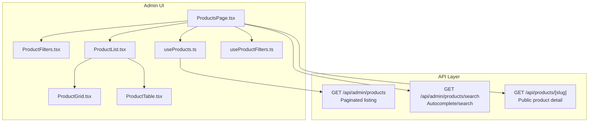
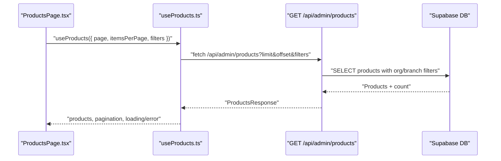
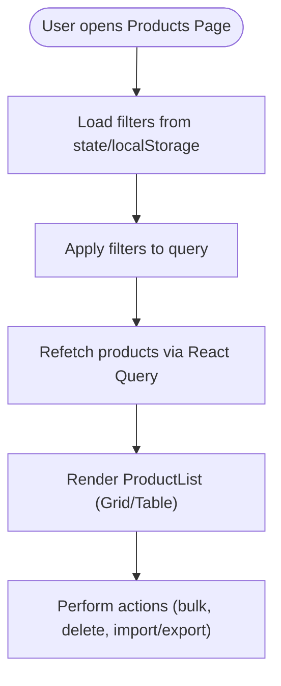
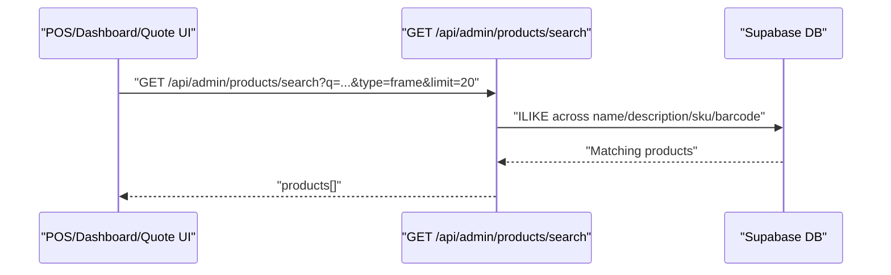
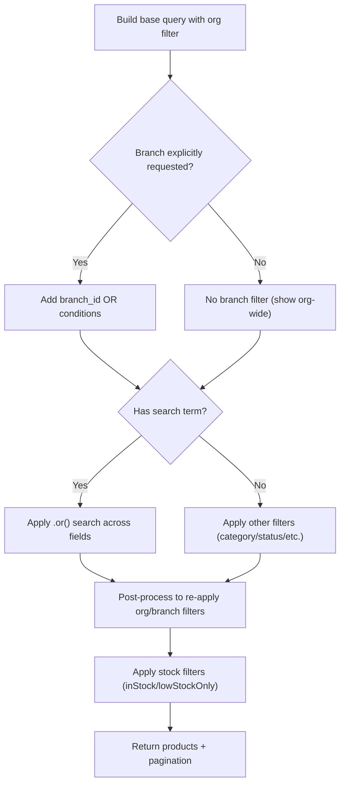
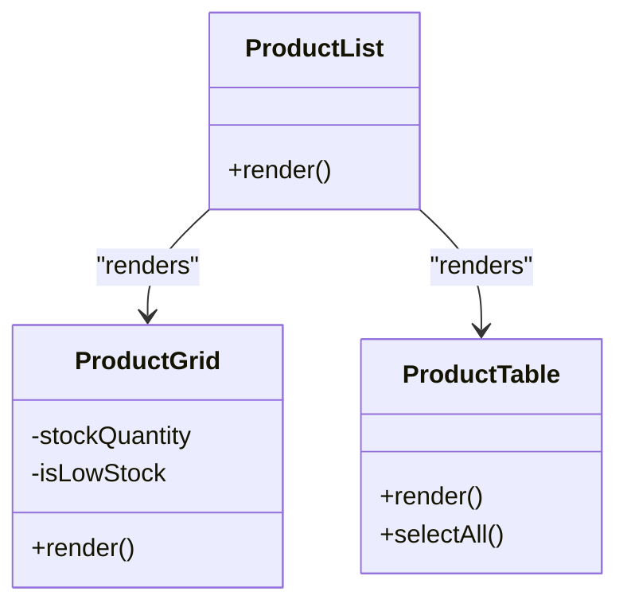
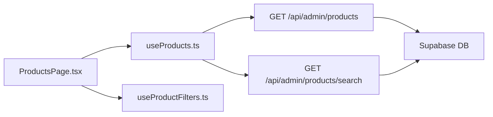

# Search & Product Discovery

<cite>
**Referenced Files in This Document**
- [ProductsPage.tsx](file://src/app/admin/products/page.tsx)
- [ProductFilters.tsx](file://src/app/admin/products/components/ProductFilters.tsx)
- [ProductList.tsx](file://src/app/admin/products/components/ProductList.tsx)
- [ProductGrid.tsx](file://src/app/admin/products/components/ProductGrid.tsx)
- [ProductTable.tsx](file://src/app/admin/products/components/ProductTable.tsx)
- [useProducts.ts](file://src/app/admin/products/hooks/useProducts.ts)
- [useProductFilters.ts](file://src/app/admin/products/hooks/useProductFilters.ts)
- [products.route.ts](file://src/app/api/admin/products/route.ts)
- [products.search.route.ts](file://src/app/api/admin/products/search/route.ts)
- [products.[slug].route.ts](file://src/app/api/products/[slug]/route.ts)
- [POS page.tsx](file://src/app/admin/pos/page.tsx)
- [DashboardSearch.tsx](file://src/components/admin/DashboardSearch.tsx)
- [CreateQuoteForm.tsx](file://src/components/admin/CreateQuoteForm.tsx)
</cite>

## Table of Contents

1. [Introduction](#introduction)
2. [Project Structure](#project-structure)
3. [Core Components](#core-components)
4. [Architecture Overview](#architecture-overview)
5. [Detailed Component Analysis](#detailed-component-analysis)
6. [Dependency Analysis](#dependency-analysis)
7. [Performance Considerations](#performance-considerations)
8. [Troubleshooting Guide](#troubleshooting-guide)
9. [Conclusion](#conclusion)
10. [Appendices](#appendices)

## Introduction

This document explains the product search and discovery functionality in Opttius. It covers the search algorithm, filtering mechanisms, faceted search, autocomplete, and result presentation. It also documents the integration points with POS, dashboards, and quote workflows, along with performance characteristics, indexing strategies, and analytics considerations.

## Project Structure

The search and discovery system spans:

- Admin product catalog UI (filters, grid/table, pagination)
- Client-side React Query hooks for product loading and mutations
- Backend APIs for paginated product listing, search, and product detail retrieval
- Branch-aware, organization-scoped queries with optional stock scoping

**Diagram sources**

- [ProductsPage.tsx](file://src/app/admin/products/page.tsx#L72-L130)
- [ProductFilters.tsx](file://src/app/admin/products/components/ProductFilters.tsx#L30-L42)
- [ProductList.tsx](file://src/app/admin/products/components/ProductList.tsx#L19-L28)
- [ProductGrid.tsx](file://src/app/admin/products/components/ProductGrid.tsx#L20-L27)
- [ProductTable.tsx](file://src/app/admin/products/components/ProductTable.tsx#L29-L37)
- [useProducts.ts](file://src/app/admin/products/hooks/useProducts.ts#L103-L120)
- [products.route.ts](file://src/app/api/admin/products/route.ts#L24-L94)
- [products.search.route.ts](file://src/app/api/admin/products/search/route.ts#L9-L55)
- [products.[slug].route.ts](file://src/app/api/products/[slug]/route.ts#L4-L37)

**Section sources**

- [ProductsPage.tsx](file://src/app/admin/products/page.tsx#L72-L130)
- [useProducts.ts](file://src/app/admin/products/hooks/useProducts.ts#L103-L120)
- [products.route.ts](file://src/app/api/admin/products/route.ts#L24-L94)
- [products.search.route.ts](file://src/app/api/admin/products/search/route.ts#L9-L55)
- [products.[slug].route.ts](file://src/app/api/products/[slug]/route.ts#L4-L37)

## Core Components

- Admin product listing page orchestrates filters, pagination, and result rendering.
- Filters include search term, category, status, low-stock toggle, and view mode.
- Results are rendered in grid or table views with action buttons and stock indicators.
- Client-side hooks manage query keys, caching, and mutations.
- Backend APIs provide paginated listings, search with prioritized exact matches, and public product detail.

**Section sources**

- [ProductsPage.tsx](file://src/app/admin/products/page.tsx#L95-L126)
- [ProductFilters.tsx](file://src/app/admin/products/components/ProductFilters.tsx#L30-L42)
- [ProductGrid.tsx](file://src/app/admin/products/components/ProductGrid.tsx#L20-L27)
- [ProductTable.tsx](file://src/app/admin/products/components/ProductTable.tsx#L29-L37)
- [useProducts.ts](file://src/app/admin/products/hooks/useProducts.ts#L103-L120)

## Architecture Overview

The system follows a layered architecture:

- UI layer: Next.js client components and hooks
- Data layer: TanStack React Query for caching and fetching
- API layer: Next.js routes with Supabase client and branch/organization middleware
- Database layer: Supabase with multi-tenancy enforced by organization_id and branch scoping

**Diagram sources**

- [ProductsPage.tsx](file://src/app/admin/products/page.tsx#L110-L126)
- [useProducts.ts](file://src/app/admin/products/hooks/useProducts.ts#L47-L101)
- [products.route.ts](file://src/app/api/admin/products/route.ts#L95-L138)

## Detailed Component Analysis

### Admin Product Listing and Filters

- Filters state is centralized and persisted across sessions.
- On filter change, the page resets to the first page and refetches data.
- View mode toggles between grid and table; items per page is stored locally.

**Diagram sources**

- [ProductsPage.tsx](file://src/app/admin/products/page.tsx#L72-L130)
- [ProductFilters.tsx](file://src/app/admin/products/components/ProductFilters.tsx#L30-L42)
- [ProductList.tsx](file://src/app/admin/products/components/ProductList.tsx#L19-L28)

**Section sources**

- [ProductsPage.tsx](file://src/app/admin/products/page.tsx#L72-L130)
- [ProductFilters.tsx](file://src/app/admin/products/components/ProductFilters.tsx#L30-L42)
- [ProductList.tsx](file://src/app/admin/products/components/ProductList.tsx#L19-L28)

### Search Algorithm and Autocomplete

- Dedicated search endpoint supports:
  - Case-insensitive partial matches across name, description, SKU, and barcode
  - Exact code prioritization for SKU/barcode when query matches alphanumeric pattern
  - Optional product type filtering (“frame” with category fallback)
  - Organization-scoped results and branch-aware stock resolution
- Autocomplete is integrated in:
  - POS product search (debounced, keyboard navigation)
  - Dashboard global search (switches between customer and product results)
  - Quote creation (frame search with “frame” type)

**Diagram sources**

- [products.search.route.ts](file://src/app/api/admin/products/search/route.ts#L65-L146)
- [POS page.tsx](file://src/app/admin/pos/page.tsx#L843-L922)
- [DashboardSearch.tsx](file://src/components/admin/DashboardSearch.tsx#L49-L92)
- [CreateQuoteForm.tsx](file://src/components/admin/CreateQuoteForm.tsx#L945-L991)

**Section sources**

- [products.search.route.ts](file://src/app/api/admin/products/search/route.ts#L65-L146)
- [POS page.tsx](file://src/app/admin/pos/page.tsx#L843-L922)
- [DashboardSearch.tsx](file://src/components/admin/DashboardSearch.tsx#L49-L92)
- [CreateQuoteForm.tsx](file://src/components/admin/CreateQuoteForm.tsx#L945-L991)

### Faceted Search and Filtering

- Server-side filters include:
  - Category, status, search term, low stock, in stock, price range, featured
  - Multi-tenant isolation via organization_id
  - Branch scoping with global vs branch-specific visibility
- Post-processing handles stock filters and branch filtering when Supabase nested relation filters conflict with search conditions.

**Diagram sources**

- [products.route.ts](file://src/app/api/admin/products/route.ts#L95-L138)
- [products.route.ts](file://src/app/api/admin/products/route.ts#L234-L271)
- [products.route.ts](file://src/app/api/admin/products/route.ts#L377-L516)

**Section sources**

- [products.route.ts](file://src/app/api/admin/products/route.ts#L95-L138)
- [products.route.ts](file://src/app/api/admin/products/route.ts#L234-L271)
- [products.route.ts](file://src/app/api/admin/products/route.ts#L377-L516)

### Result Presentation Systems

- Grid view highlights stock status and offers quick actions.
- Table view adds selectable rows, category badges, and action links.
- Both views integrate with branch-scoped stock metrics and status badges.

**Diagram sources**

- [ProductGrid.tsx](file://src/app/admin/products/components/ProductGrid.tsx#L20-L27)
- [ProductTable.tsx](file://src/app/admin/products/components/ProductTable.tsx#L29-L37)
- [ProductList.tsx](file://src/app/admin/products/components/ProductList.tsx#L19-L28)

**Section sources**

- [ProductGrid.tsx](file://src/app/admin/products/components/ProductGrid.tsx#L20-L27)
- [ProductTable.tsx](file://src/app/admin/products/components/ProductTable.tsx#L29-L37)
- [ProductList.tsx](file://src/app/admin/products/components/ProductList.tsx#L19-L28)

### Public Product Detail Retrieval

- Public product detail endpoint selects product with variants and category relation, using RLS-safe client or service role fallback.

**Section sources**

- [products.[slug].route.ts](file://src/app/api/products/[slug]/route.ts#L4-L37)

## Dependency Analysis

- UI depends on:
  - useProducts hook for data fetching and mutations
  - useProductFilters for local facet state
  - ProductFilters, ProductList, ProductGrid, ProductTable for rendering
- API depends on:
  - Supabase client and branch middleware
  - Zod validation for requests
  - Rate limiting middleware
- Data model:
  - Products with optional variants and branch stock records
  - Multi-tenancy via organization_id and branch_id scoping

**Diagram sources**

- [ProductsPage.tsx](file://src/app/admin/products/page.tsx#L95-L126)
- [useProducts.ts](file://src/app/admin/products/hooks/useProducts.ts#L103-L120)
- [products.route.ts](file://src/app/api/admin/products/route.ts#L24-L94)
- [products.search.route.ts](file://src/app/api/admin/products/search/route.ts#L9-L55)

**Section sources**

- [ProductsPage.tsx](file://src/app/admin/products/page.tsx#L95-L126)
- [useProducts.ts](file://src/app/admin/products/hooks/useProducts.ts#L103-L120)
- [products.route.ts](file://src/app/api/admin/products/route.ts#L24-L94)
- [products.search.route.ts](file://src/app/api/admin/products/search/route.ts#L9-L55)

## Performance Considerations

- Caching and stale-time:
  - Products query cached for 30 seconds to reduce repeated network calls.
- Debouncing:
  - POS search debounced to 200ms; frame search debounced to 300ms to minimize API calls.
- Pagination:
  - Offset-based pagination with configurable limit; count computed server-side.
- Branch scoping:
  - When branch explicitly requested, branch filters applied in query; otherwise, organization-wide results are returned to avoid excessive filtering.
- Stock computation:
  - Available quantity derived from reserved quantity; legacy inventory fallback supported.
- Rate limits:
  - Search endpoint protected by rate limiting middleware.

**Section sources**

- [useProducts.ts](file://src/app/admin/products/hooks/useProducts.ts#L119-L120)
- [POS page.tsx](file://src/app/admin/pos/page.tsx#L871-L872)
- [CreateQuoteForm.tsx](file://src/components/admin/CreateQuoteForm.tsx#L950-L951)
- [products.route.ts](file://src/app/api/admin/products/route.ts#L66-L77)
- [products.search.route.ts](file://src/app/api/admin/products/search/route.ts#L10-L12)

## Troubleshooting Guide

- Unauthorized or insufficient permissions:
  - Admin RPC check and branch middleware ensure only authorized users can access search/list endpoints.
- Multi-tenancy leaks:
  - Organization filter applied before search; branch filters handled carefully to avoid overriding org isolation.
- Empty results:
  - When no branch explicitly requested and searching, results include organization-wide products; ensure filters are correct.
- Rate limiting:
  - Excessive search requests return 429; adjust client-side throttling.
- Stock discrepancies:
  - Post-processing resolves branch stock; legacy inventory fallback ensures compatibility.

**Section sources**

- [products.search.route.ts](file://src/app/api/admin/products/search/route.ts#L16-L36)
- [products.search.route.ts](file://src/app/api/admin/products/search/route.ts#L89-L121)
- [products.route.ts](file://src/app/api/admin/products/route.ts#L140-L170)
- [products.route.ts](file://src/app/api/admin/products/route.ts#L248-L259)

## Conclusion

Opttius implements a robust, multi-tenant product search and discovery system with:

- Server-side faceted filtering and organization-scoped results
- Branch-aware stock resolution and flexible visibility rules
- Efficient client caching and debounced autocomplete
- Clear UI affordances for grid/table views and actions

## Appendices

### API Definitions

- GET /api/admin/products
  - Purpose: Paginated product listing with filters
  - Query params: limit, offset, category, search, in_stock, low_stock_only, status, include_archived, sort_by, sort_order
  - Response: products[], pagination
  - Branch behavior: When branch explicitly requested, branch filter applied; otherwise, organization-wide results

- GET /api/admin/products/search
  - Purpose: Autocomplete/search with prioritized exact matches
  - Query params: q, type, limit
  - Response: products[]
  - Behavior: Organization-scoped; branch-aware stock resolution

- GET /api/products/[slug]
  - Purpose: Public product detail
  - Response: product with variants and category

**Section sources**

- [products.route.ts](file://src/app/api/admin/products/route.ts#L57-L94)
- [products.search.route.ts](file://src/app/api/admin/products/search/route.ts#L51-L55)
- [products.[slug].route.ts](file://src/app/api/products/[slug]/route.ts#L9-L37)
