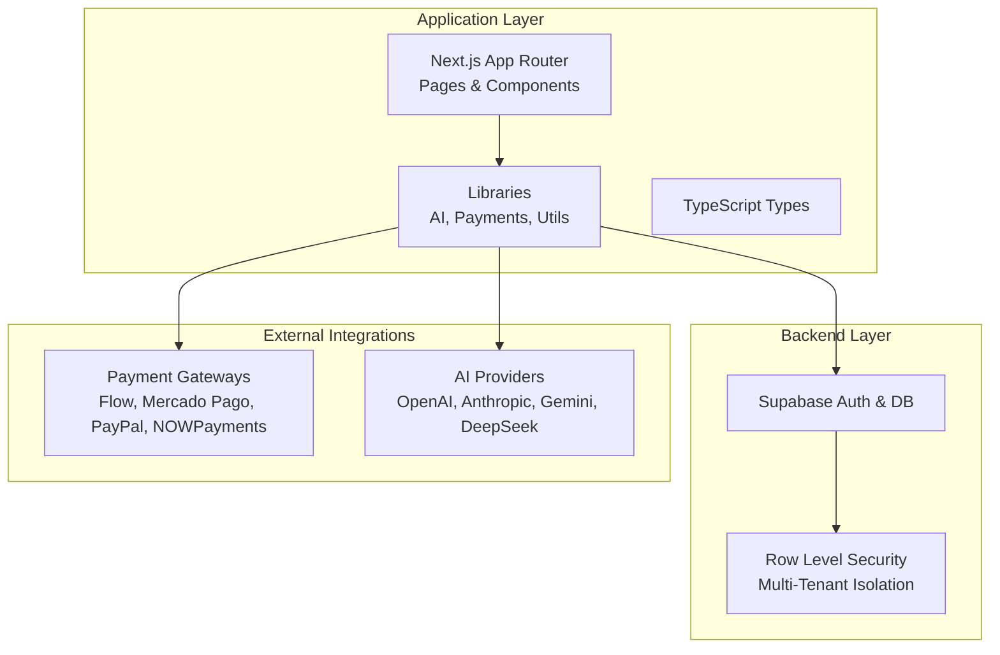
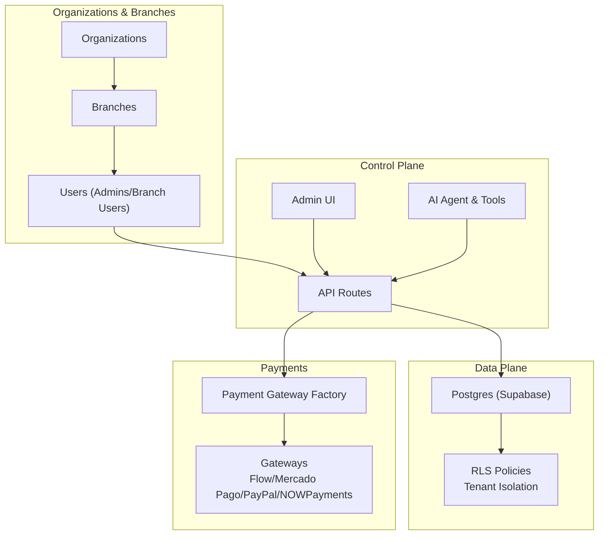
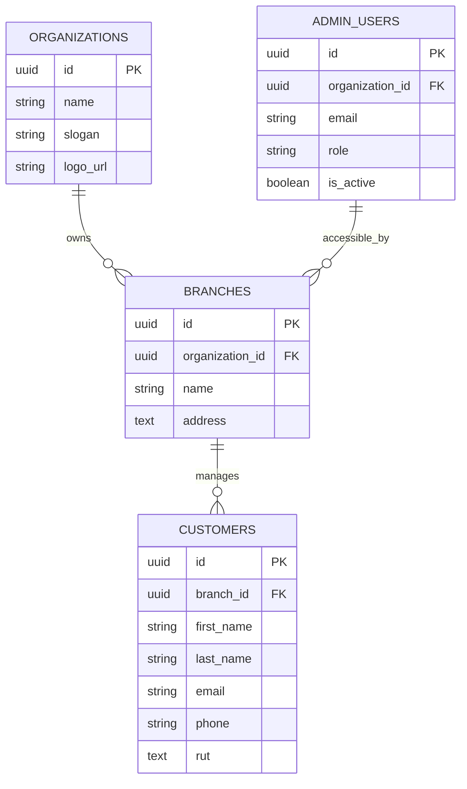
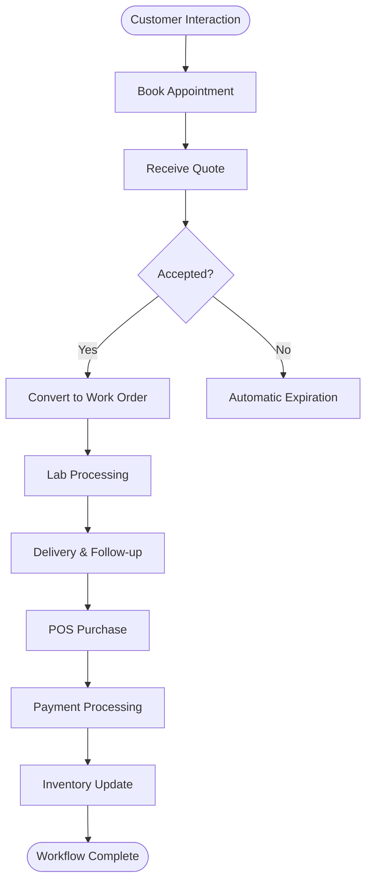
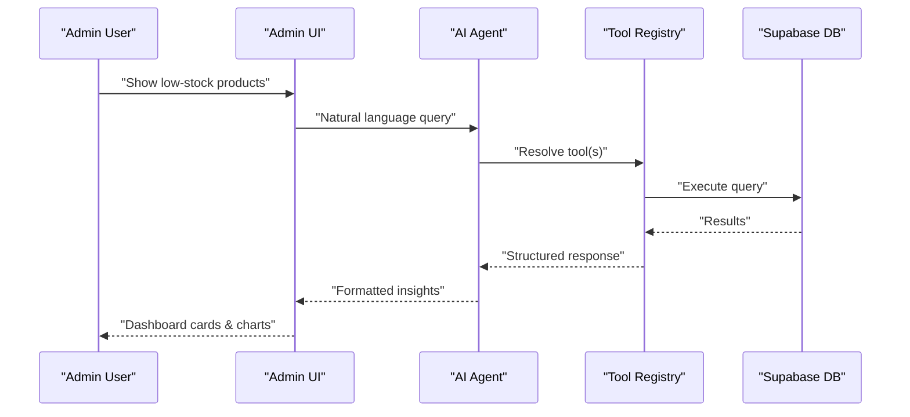
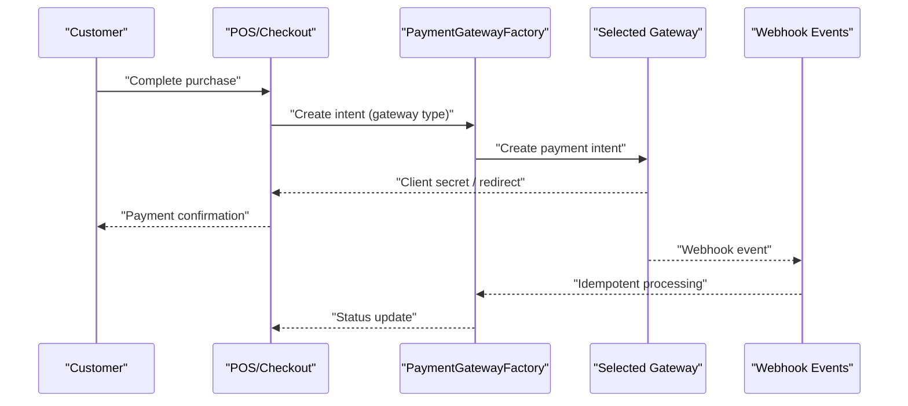
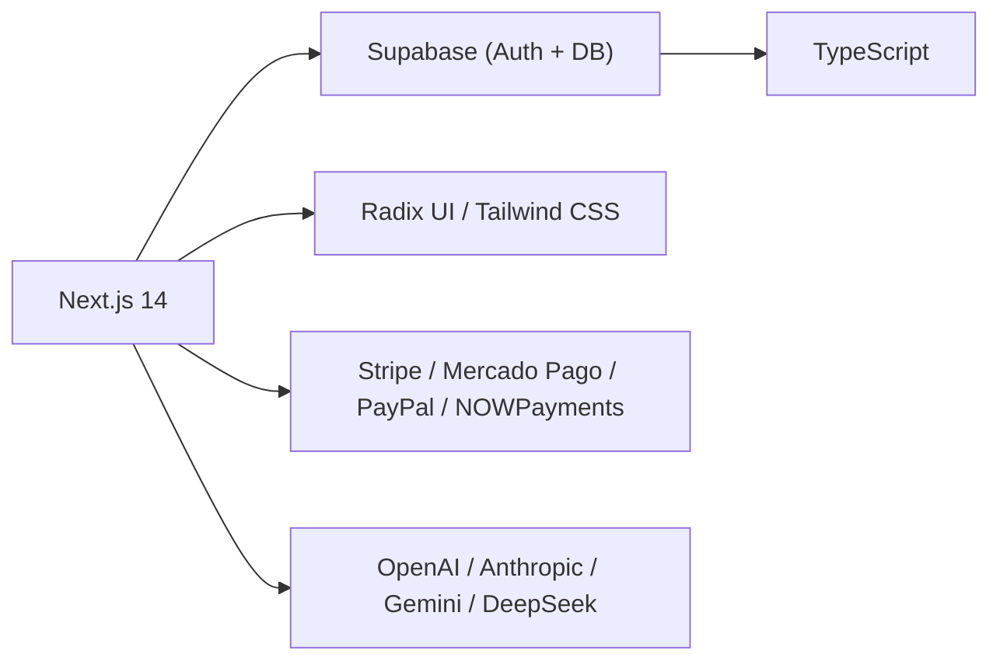

# Business Value Proposition

<cite>
**Referenced Files in This Document**
- [README.md](file://README.md)
- [SETUP_GUIDE.md](file://SETUP_GUIDE.md)
- [business.ts](file://src/config/business.ts)
- [package.json](file://package.json)
- [20251218000000_separate_customers_from_users.sql](file://supabase/migrations/20251218000000_separate_customers_from_users.sql)
- [20260131000000_create_payments_and_webhook_events.sql](file://supabase/migrations/20260131000000_create_payments_and_webhook_events.sql)
- [index.ts (AI Tools)](file://src/lib/ai/tools/index.ts)
- [index.ts (Payments Factory)](file://src/lib/payments/index.ts)
- [page.tsx (Saas Management Redirect)](file://src/app/admin/saas-management/page.tsx)
</cite>

## Table of Contents

1. [Introduction](#introduction)
2. [Project Structure](#project-structure)
3. [Core Components](#core-components)
4. [Architecture Overview](#architecture-overview)
5. [Detailed Component Analysis](#detailed-component-analysis)
6. [Dependency Analysis](#dependency-analysis)
7. [Performance Considerations](#performance-considerations)
8. [Troubleshooting Guide](#troubleshooting-guide)
9. [Conclusion](#conclusion)
10. [Appendices](#appendices)

## Introduction

Opttius is a complete optical management platform designed to modernize and streamline the operations of single-location optical shops and multi-unit optical chains. It addresses core pain points in optical retail and lab operations—inefficient appointment scheduling, manual quote and order management, fragmented customer data, and lack of real-time analytics—through an integrated, automated system. The platform’s multi-tenant architecture enables centralized governance for optical chains while preserving branch-level autonomy. Its AI-powered insights system augments decision-making with actionable trends and recommendations, and its integrated, multi-gateway payment processing eliminates the need for disparate payment solutions. These capabilities collectively reduce administrative overhead, improve inventory turnover, enhance customer retention, and deliver measurable ROI.

## Project Structure

Opttius is built as a modern web application using Next.js 14 with TypeScript, Supabase for backend and database, and a comprehensive suite of UI components and libraries. The repository includes:

- Application code under src/, organized by pages, components, libraries, and configuration
- Supabase migrations defining the multi-tenant optical management schema
- Extensive documentation and setup guides for local development and deployment
- Scripts for administration, seeding, and AI insights generation

**Diagram sources**

- [README.md](file://README.md#L283-L330)
- [SETUP_GUIDE.md](file://SETUP_GUIDE.md#L435-L443)
- [package.json](file://package.json#L36-L86)

**Section sources**

- [README.md](file://README.md#L283-L330)
- [SETUP_GUIDE.md](file://SETUP_GUIDE.md#L435-L443)
- [package.json](file://package.json#L36-L86)

## Core Components

Opttius delivers a comprehensive optical management solution with the following core capabilities:

- Integrated optical workflows: appointment scheduling, customer management, quote lifecycle, lab work orders, POS sales, and inventory
- Multi-tenant architecture enabling centralized management for optical chains with branch-level isolation and customization
- Real-time analytics and reporting dashboards
- AI-powered insights and assistant for intelligent operations
- Unified payment processing supporting multiple gateways and crypto payments

These components are documented in the project’s feature set and technical overview.

**Section sources**

- [README.md](file://README.md#L5-L86)
- [README.md](file://README.md#L406-L442)

## Architecture Overview

Opttius employs a multi-tenant architecture implemented via Supabase Row Level Security (RLS). Each organization (chain) and branch operates within isolated data domains while sharing common administrative controls. The system integrates:

- Supabase Auth for identity and RBAC
- Supabase Postgres for data persistence with tenant-aware policies
- Payment gateways via a unified factory pattern
- AI agent with tool-calling capabilities for autonomous operations

**Diagram sources**

- [20251218000000_separate_customers_from_users.sql](file://supabase/migrations/20251218000000_separate_customers_from_users.sql#L7-L59)
- [20260131000000_create_payments_and_webhook_events.sql](file://supabase/migrations/20260131000000_create_payments_and_webhook_events.sql#L24-L41)
- [index.ts (Payments Factory)](file://src/lib/payments/index.ts#L19-L34)
- [index.ts (AI Tools)](file://src/lib/ai/tools/index.ts#L15-L27)

**Section sources**

- [20251218000000_separate_customers_from_users.sql](file://supabase/migrations/20251218000000_separate_customers_from_users.sql#L76-L150)
- [20260131000000_create_payments_and_webhook_events.sql](file://supabase/migrations/20260131000000_create_payments_and_webhook_events.sql#L64-L108)
- [index.ts (Payments Factory)](file://src/lib/payments/index.ts#L19-L34)
- [index.ts (AI Tools)](file://src/lib/ai/tools/index.ts#L15-L27)

## Detailed Component Analysis

### Multi-Tenant Architecture for Optical Chains

Opttius separates users (software access) from customers (branch-specific clients), ensuring data isolation and compliance with chain-wide governance. Branch-level access is enforced via RLS policies, allowing administrators to manage multiple locations while maintaining operational independence.

Key benefits:

- Centralized billing, subscriptions, and administrative controls
- Branch-specific customer data, inventory, and workflows
- Granular access control and auditability

**Diagram sources**

- [20251218000000_separate_customers_from_users.sql](file://supabase/migrations/20251218000000_separate_customers_from_users.sql#L7-L59)

**Section sources**

- [20251218000000_separate_customers_from_users.sql](file://supabase/migrations/20251218000000_separate_customers_from_users.sql#L76-L150)

### Workflow Automation Across Optical Operations

Opttius automates end-to-end optical workflows:

- Appointment scheduling with availability checks and guest booking
- Quote lifecycle with expiration and conversion to work orders
- POS sales with integrated payment processing and tax calculation
- Inventory tracking and low-stock alerts
- Customer history and visual health records

[No sources needed since this diagram shows conceptual workflow, not actual code structure]

**Section sources**

- [README.md](file://README.md#L15-L50)

### AI-Powered Insights and Assistant

Opttius includes an AI agent capable of understanding natural language commands and executing tool-based operations across products, orders, customers, analytics, support, business flow analysis, diagnostics, market trends, inventory optimization, and recommendations. This reduces manual effort and accelerates decision-making.

**Diagram sources**

- [index.ts (AI Tools)](file://src/lib/ai/tools/index.ts#L15-L27)

**Section sources**

- [README.md](file://README.md#L525-L597)
- [index.ts (AI Tools)](file://src/lib/ai/tools/index.ts#L15-L27)

### Integrated Payment Processing

Opttius provides a unified payment processing layer supporting multiple gateways (including crypto) and organizations. The payment gateway factory abstracts provider differences, while webhook events ensure idempotent, reliable reconciliation.

**Diagram sources**

- [index.ts (Payments Factory)](file://src/lib/payments/index.ts#L19-L34)
- [20260131000000_create_payments_and_webhook_events.sql](file://supabase/migrations/20260131000000_create_payments_and_webhook_events.sql#L24-L41)
- [20260131000000_create_payments_and_webhook_events.sql](file://supabase/migrations/20260131000000_create_payments_and_webhook_events.sql#L110-L122)

**Section sources**

- [README.md](file://README.md#L83-L86)
- [index.ts (Payments Factory)](file://src/lib/payments/index.ts#L19-L34)
- [20260131000000_create_payments_and_webhook_events.sql](file://supabase/migrations/20260131000000_create_payments_and_webhook_events.sql#L64-L108)

### Real-Time Analytics and Reporting

Opttius offers configurable analytics dashboards to track revenue, orders, and customer metrics, enabling data-driven decisions at both branch and corporate levels.

**Section sources**

- [business.ts](file://src/config/business.ts#L82-L88)
- [README.md](file://README.md#L67-L73)

## Dependency Analysis

Opttius leverages a modern tech stack optimized for scalability and maintainability. The application depends on Next.js 14, Supabase for backend services, and a variety of libraries for UI, payments, AI, and analytics.

**Diagram sources**

- [package.json](file://package.json#L36-L86)
- [README.md](file://README.md#L74-L86)

**Section sources**

- [package.json](file://package.json#L36-L86)
- [README.md](file://README.md#L74-L86)

## Performance Considerations

- Multi-tenant data isolation via RLS ensures predictable performance and security at scale
- Supabase’s managed Postgres and edge functions minimize latency for real-time features
- AI tool execution is scoped to validated operations, reducing unnecessary database load
- Payment processing uses idempotent webhook handling to avoid duplicate work and retries

[No sources needed since this section provides general guidance]

## Troubleshooting Guide

Common setup and runtime issues are addressed in the project’s documentation and scripts:

- Supabase local startup and port conflicts
- Database migration errors and resets
- Admin user creation and access verification
- Build and type-check failures

**Section sources**

- [SETUP_GUIDE.md](file://SETUP_GUIDE.md#L446-L488)
- [README.md](file://README.md#L443-L491)

## Conclusion

Opttius transforms optical shop operations by consolidating appointment scheduling, quoting, lab workflows, POS sales, and analytics into a single, automated platform. Its multi-tenant architecture empowers optical chains to centralize governance while preserving branch autonomy. AI-driven insights accelerate decision-making, and integrated payment processing simplifies financial operations. Together, these capabilities reduce administrative burden, improve inventory efficiency, and drive customer retention—delivering measurable ROI for optical businesses.

[No sources needed since this section summarizes without analyzing specific files]

## Appendices

### Competitive Differentiation

- Unlike standalone solutions, Opttius integrates the entire optical workflow—from scheduling to payments—eliminating tool switching and data silos
- Compared to traditional accounting software, Opttius focuses on operational excellence with real-time analytics, AI insights, and branch-level customization

[No sources needed since this section provides general guidance]

### Business Impact Metrics (Conceptual)

- Reduced administrative time through automation
- Improved inventory turnover via integrated tracking
- Higher customer retention through seamless experiences
- Lower payment processing costs with unified gateways

[No sources needed since this section provides general guidance]
