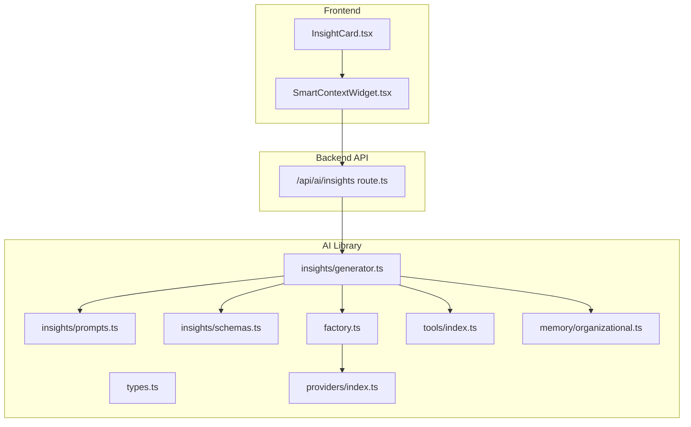
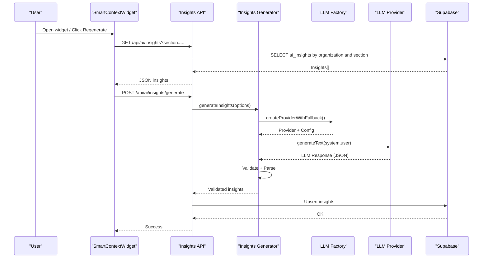
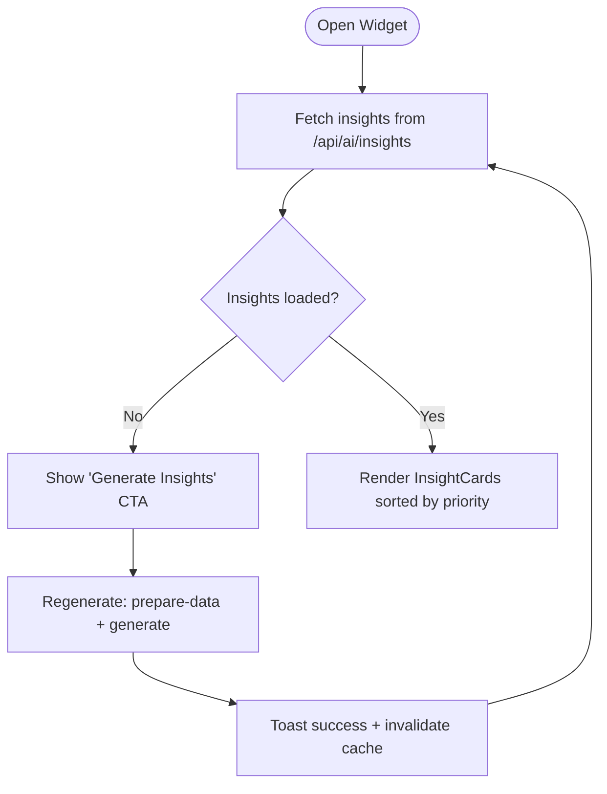
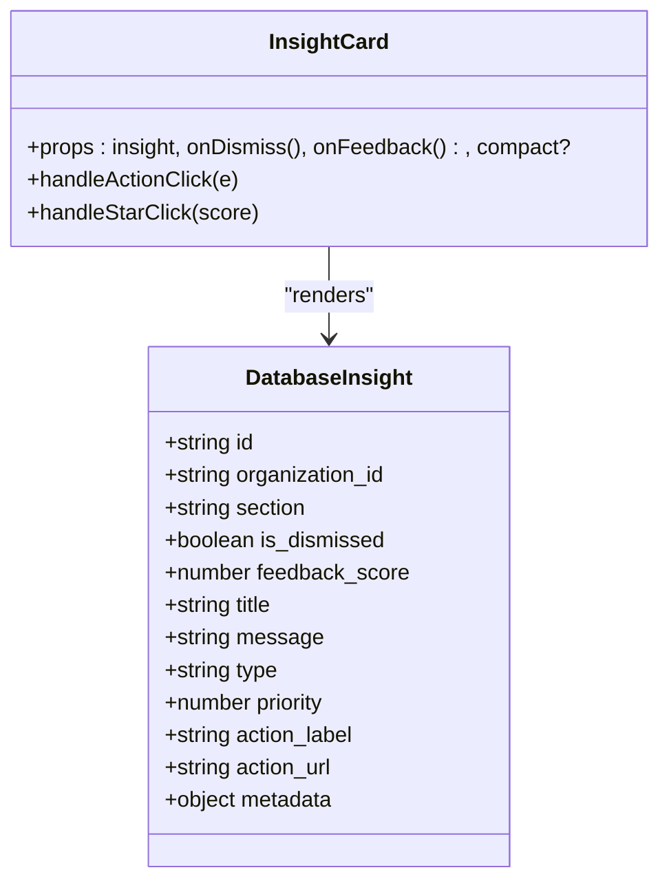
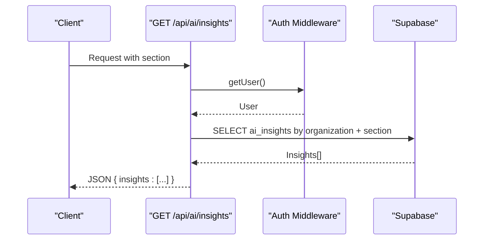
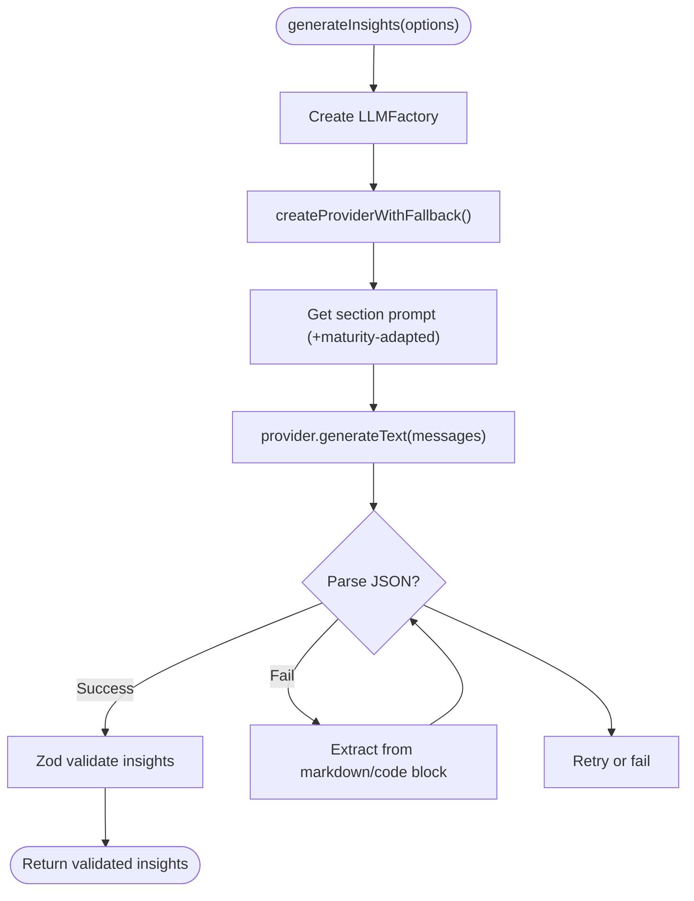
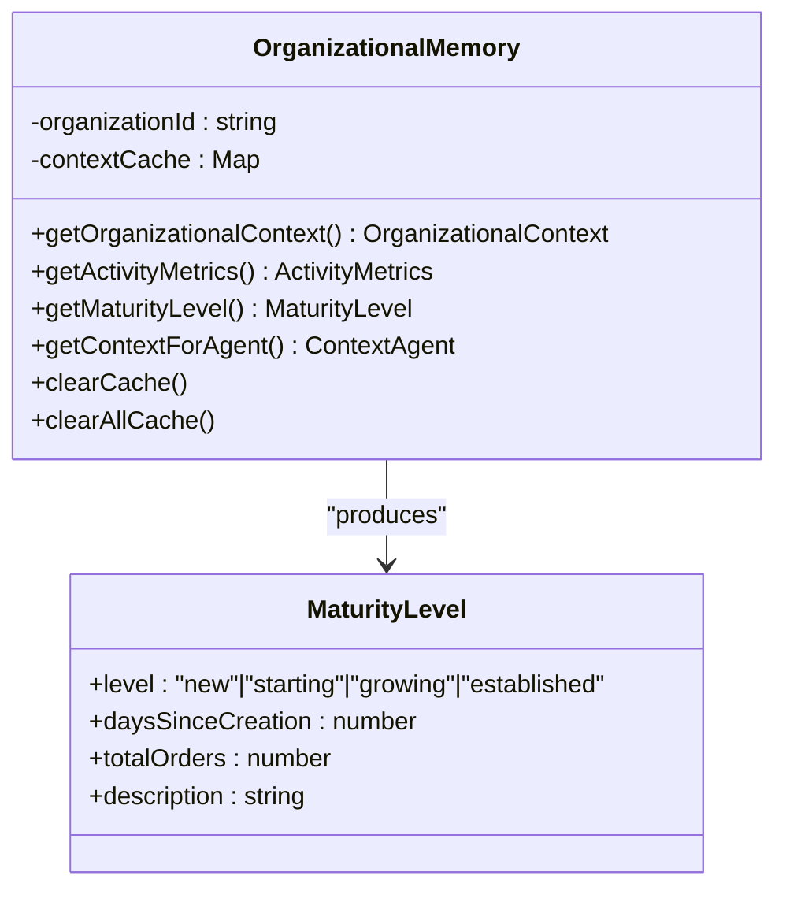
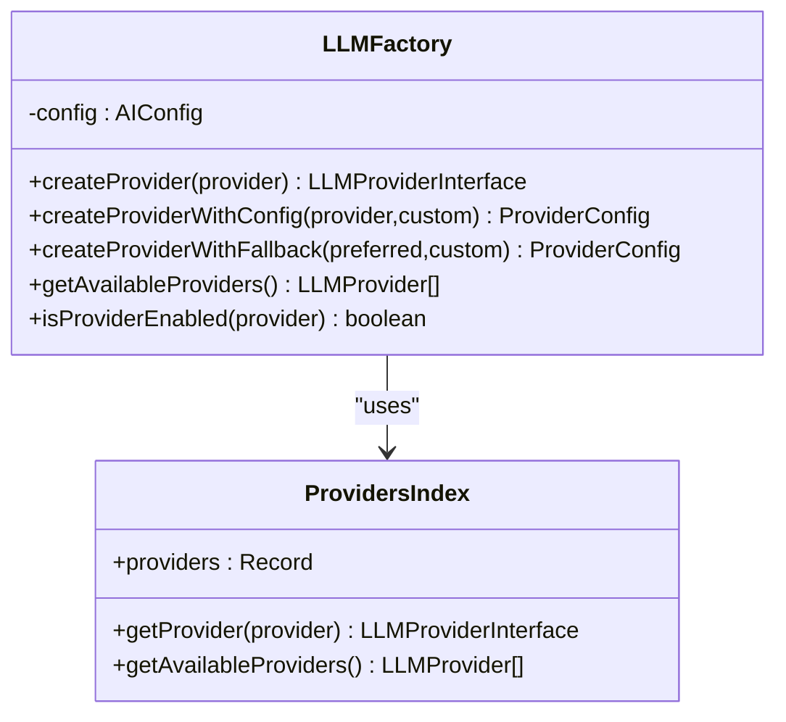
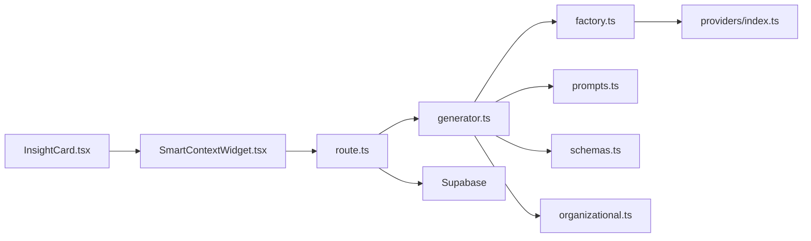

# AI-Powered Insights System

<cite>
**Referenced Files in This Document**
- [SmartContextWidget.tsx](file://src/components/ai/SmartContextWidget.tsx)
- [InsightCard.tsx](file://src/components/ai/InsightCard.tsx)
- [route.ts](file://src/app/api/ai/insights/route.ts)
- [generator.ts](file://src/lib/ai/insights/generator.ts)
- [prompts.ts](file://src/lib/ai/insights/prompts.ts)
- [schemas.ts](file://src/lib/ai/insights/schemas.ts)
- [factory.ts](file://src/lib/ai/factory.ts)
- [types.ts](file://src/lib/ai/types.ts)
- [index.ts](file://src/lib/ai/providers/index.ts)
- [index.ts](file://src/lib/ai/tools/index.ts)
- [organizational.ts](file://src/lib/ai/memory/organizational.ts)
- [generate-insights.test.ts](file://src/__tests__/integration/api/ai/generate-insights.test.ts)
- [AI_TESTING_SUMMARY.md](file://docs/AI_TESTING_SUMMARY.md)
</cite>

## Table of Contents

1. [Introduction](#introduction)
2. [Project Structure](#project-structure)
3. [Core Components](#core-components)
4. [Architecture Overview](#architecture-overview)
5. [Detailed Component Analysis](#detailed-component-analysis)
6. [Dependency Analysis](#dependency-analysis)
7. [Performance Considerations](#performance-considerations)
8. [Troubleshooting Guide](#troubleshooting-guide)
9. [Conclusion](#conclusion)
10. [Appendices](#appendices)

## Introduction

This document describes the AI-powered insights system designed to deliver intelligent recommendations and automated business assistance for an optometry management platform. The system integrates multi-provider Large Language Model (LLM) support, structured insight generation, smart context awareness, and autonomous database operations. It provides a floating widget for real-time access to AI-generated insights, with robust validation, retry mechanisms, and provider fallback strategies.

## Project Structure

The AI insights system spans frontend components, backend APIs, and AI libraries:

- Frontend: Smart context widget and insight cards for user interaction
- Backend: REST endpoints for fetching, dismissing, rating, and regenerating insights
- AI Library: LLM factory, provider registry, tool definitions, insight generator, prompts, schemas, and organizational memory

**Diagram sources**

- [SmartContextWidget.tsx](file://src/components/ai/SmartContextWidget.tsx#L1-L340)
- [InsightCard.tsx](file://src/components/ai/InsightCard.tsx#L1-L342)
- [route.ts](file://src/app/api/ai/insights/route.ts#L1-L93)
- [generator.ts](file://src/lib/ai/insights/generator.ts#L1-L224)
- [prompts.ts](file://src/lib/ai/insights/prompts.ts#L1-L425)
- [schemas.ts](file://src/lib/ai/insights/schemas.ts#L1-L133)
- [factory.ts](file://src/lib/ai/factory.ts#L1-L88)
- [types.ts](file://src/lib/ai/types.ts#L1-L92)
- [index.ts](file://src/lib/ai/providers/index.ts#L1-L34)
- [index.ts](file://src/lib/ai/tools/index.ts#L1-L75)
- [organizational.ts](file://src/lib/ai/memory/organizational.ts#L1-L379)

**Section sources**

- [SmartContextWidget.tsx](file://src/components/ai/SmartContextWidget.tsx#L1-L340)
- [route.ts](file://src/app/api/ai/insights/route.ts#L1-L93)
- [generator.ts](file://src/lib/ai/insights/generator.ts#L1-L224)

## Core Components

- Smart Context Widget: A floating popover or embedded panel that displays AI insights, allows regeneration, dismissal, and feedback submission.
- Insight Card: Renders individual insights with type-specific styling, action buttons, and star-based feedback.
- Insights API: Fetches, dismisses, rates, and regenerates insights per organization and section.
- Insights Generator: Orchestrates LLM calls, applies maturity-adapted prompts, validates structured output, and retries transient failures.
- Organizational Memory: Provides business context and maturity levels to tailor prompts and recommendations.
- Provider Registry and Factory: Manages multiple LLM providers with fallback and configuration validation.

**Section sources**

- [SmartContextWidget.tsx](file://src/components/ai/SmartContextWidget.tsx#L35-L340)
- [InsightCard.tsx](file://src/components/ai/InsightCard.tsx#L59-L342)
- [route.ts](file://src/app/api/ai/insights/route.ts#L17-L92)
- [generator.ts](file://src/lib/ai/insights/generator.ts#L41-L191)
- [organizational.ts](file://src/lib/ai/memory/organizational.ts#L55-L227)
- [factory.ts](file://src/lib/ai/factory.ts#L5-L87)

## Architecture Overview

The system follows a layered architecture:

- Presentation Layer: React components render insights and manage user interactions.
- Application Layer: API routes validate requests, enforce authentication, and delegate to AI generators.
- AI Layer: Factory resolves providers, applies prompts, parses and validates structured responses, and manages retries.
- Persistence Layer: Supabase-backed database stores insights, metadata, and user feedback.

**Diagram sources**

- [SmartContextWidget.tsx](file://src/components/ai/SmartContextWidget.tsx#L103-L151)
- [route.ts](file://src/app/api/ai/insights/route.ts#L17-L92)
- [generator.ts](file://src/lib/ai/insights/generator.ts#L41-L191)
- [factory.ts](file://src/lib/ai/factory.ts#L45-L75)

## Detailed Component Analysis

### Smart Context Widget

The Smart Context Widget is a React component that:

- Fetches insights via a background query with caching and retry logic
- Supports embedded mode for tight UI integration
- Allows regenerating insights by preparing data and invoking the generation endpoint
- Handles dismissal and feedback mutations
- Sorts insights by priority and renders InsightCards

**Diagram sources**

- [SmartContextWidget.tsx](file://src/components/ai/SmartContextWidget.tsx#L44-L151)

**Section sources**

- [SmartContextWidget.tsx](file://src/components/ai/SmartContextWidget.tsx#L35-L340)

### Insight Card

The Insight Card component:

- Applies type-specific styling and icons
- Renders title, message, priority dots, and action button
- Supports inline dismissal and star-based feedback
- Opens internal or external links with optional metadata injection

**Diagram sources**

- [InsightCard.tsx](file://src/components/ai/InsightCard.tsx#L59-L342)
- [schemas.ts](file://src/lib/ai/insights/schemas.ts#L124-L132)

**Section sources**

- [InsightCard.tsx](file://src/components/ai/InsightCard.tsx#L59-L342)

### Insights API

The backend API:

- Validates query parameters and authenticates users
- Resolves organization from admin user record
- Fetches non-dismissed insights ordered by priority and recency
- Returns structured JSON for the frontend

**Diagram sources**

- [route.ts](file://src/app/api/ai/insights/route.ts#L17-L92)

**Section sources**

- [route.ts](file://src/app/api/ai/insights/route.ts#L17-L92)

### Insights Generator

The generator orchestrates:

- Provider selection with fallback and configuration validation
- Adaptive prompts using organizational maturity
- Structured JSON parsing with markdown extraction
- Zod schema validation and retry logic for transient failures
- Single insight extraction for real-time scenarios

**Diagram sources**

- [generator.ts](file://src/lib/ai/insights/generator.ts#L41-L191)
- [prompts.ts](file://src/lib/ai/insights/prompts.ts#L45-L60)
- [organizational.ts](file://src/lib/ai/memory/organizational.ts#L176-L206)

**Section sources**

- [generator.ts](file://src/lib/ai/insights/generator.ts#L41-L191)

### Organizational Memory and Maturity System

The organizational memory:

- Builds context from organization, settings, top products, recent orders
- Computes maturity level based on age and activity metrics
- Supplies adaptive prompts and contextual awareness to the generator

**Diagram sources**

- [organizational.ts](file://src/lib/ai/memory/organizational.ts#L55-L227)

**Section sources**

- [organizational.ts](file://src/lib/ai/memory/organizational.ts#L55-L227)

### Provider Registry and Factory

The factory and provider registry:

- Maintain a map of supported providers
- Validate configurations and enable fallback across providers
- Expose availability checks and provider-specific model lists

**Diagram sources**

- [factory.ts](file://src/lib/ai/factory.ts#L5-L87)
- [index.ts](file://src/lib/ai/providers/index.ts#L10-L33)

**Section sources**

- [factory.ts](file://src/lib/ai/factory.ts#L5-L87)
- [index.ts](file://src/lib/ai/providers/index.ts#L1-L34)

### Tools and Autonomous Operations

The tools module aggregates domain-specific tools for autonomous operations:

- Product, category, order, customer, analytics, support tools
- Business flow analysis, system diagnosis, market trends, inventory optimization
- Recommendation generation and tool validation utilities

These tools enable the AI agent to perform autonomous actions when integrated with tool-calling capabilities.

**Section sources**

- [index.ts](file://src/lib/ai/tools/index.ts#L1-L75)

## Dependency Analysis

The AI insights system exhibits strong separation of concerns:

- Components depend on schemas and API routes
- Generator depends on factory, prompts, schemas, and organizational memory
- Factory depends on provider registry and configuration
- API routes depend on authentication, Supabase client, and generator

**Diagram sources**

- [SmartContextWidget.tsx](file://src/components/ai/SmartContextWidget.tsx#L1-L340)
- [InsightCard.tsx](file://src/components/ai/InsightCard.tsx#L1-L342)
- [route.ts](file://src/app/api/ai/insights/route.ts#L1-L93)
- [generator.ts](file://src/lib/ai/insights/generator.ts#L1-L224)
- [factory.ts](file://src/lib/ai/factory.ts#L1-L88)
- [index.ts](file://src/lib/ai/providers/index.ts#L1-L34)
- [prompts.ts](file://src/lib/ai/insights/prompts.ts#L1-L425)
- [schemas.ts](file://src/lib/ai/insights/schemas.ts#L1-L133)
- [organizational.ts](file://src/lib/ai/memory/organizational.ts#L1-L379)

**Section sources**

- [generator.ts](file://src/lib/ai/insights/generator.ts#L1-L224)
- [factory.ts](file://src/lib/ai/factory.ts#L1-L88)

## Performance Considerations

- Caching: Frontend caches insights for 5 minutes and invalidates on mutation.
- Retry Strategy: Generator retries transient LLM failures with exponential backoff.
- Token Limits: Controlled max tokens and structured prompts reduce cost and latency.
- Provider Fallback: Automatic fallback across providers improves reliability.
- Validation Early Exit: Zod validation prevents unnecessary processing on malformed responses.

[No sources needed since this section provides general guidance]

## Troubleshooting Guide

Common issues and resolutions:

- Authentication Failure: API returns unauthorized; ensure proper session and admin user binding.
- Organization Not Found: Admin user missing organization association; verify admin_users records.
- No LLM Providers Configured: Factory throws provider initialization error; configure at least one provider.
- Schema Validation Errors: LLM response format invalid; ensure provider returns strict JSON as per prompts.
- Network/Timeout Errors: Retries applied automatically; monitor provider health and rate limits.

**Section sources**

- [route.ts](file://src/app/api/ai/insights/route.ts#L27-L48)
- [factory.ts](file://src/lib/ai/factory.ts#L45-L75)
- [generator.ts](file://src/lib/ai/insights/generator.ts#L167-L187)
- [generate-insights.test.ts](file://src/__tests__/integration/api/ai/generate-insights.test.ts#L195-L220)

## Conclusion

The AI-powered insights system delivers contextual, actionable intelligence with multi-provider LLM support, robust validation, and adaptive prompting. Its modular architecture enables easy extension, reliable operation through fallbacks and retries, and seamless integration with the application’s UI and database.

[No sources needed since this section summarizes without analyzing specific files]

## Appendices

### Practical Examples

- AI Agent Configuration
  - Configure default and fallback providers via environment variables and provider configs.
  - Enable specific providers and supply API keys; factory validates enabled and apiKey presence.
  - Example paths:
    - [factory.ts](file://src/lib/ai/factory.ts#L21-L43)
    - [index.ts](file://src/lib/ai/providers/index.ts#L10-L29)

- Insight Interpretation
  - Types: warning, opportunity, info, neutral; priorities 1–10; optional action_url and metadata.
  - Example paths:
    - [schemas.ts](file://src/lib/ai/insights/schemas.ts#L15-L97)

- Automated Task Execution
  - Use tools module to define autonomous operations (e.g., optimize inventory, generate recommendations).
  - Integrate tool-calling into agent workflows for self-healing and proactive suggestions.
  - Example paths:
    - [index.ts](file://src/lib/ai/tools/index.ts#L15-L50)

- Provider Fallback Mechanism
  - Factory attempts preferred provider followed by fallback providers until a valid configuration is found.
  - Example paths:
    - [factory.ts](file://src/lib/ai/factory.ts#L45-L75)

- Performance Optimization
  - Frontend caching, retry with backoff, controlled token usage, and early validation.
  - Example paths:
    - [SmartContextWidget.tsx](file://src/components/ai/SmartContextWidget.tsx#L49-L65)
    - [generator.ts](file://src/lib/ai/insights/generator.ts#L107-L187)

- AI Governance Considerations
  - Strict schema validation, deterministic prompts, and controlled tool usage.
  - Example paths:
    - [prompts.ts](file://src/lib/ai/insights/prompts.ts#L15-L40)
    - [schemas.ts](file://src/lib/ai/insights/schemas.ts#L79-L81)

### Testing Coverage Highlights

- Organizational maturity system and feedback systems
- OpenRouter provider integration and tool-call handling
- End-to-end insights generation with retry and schema validation

**Section sources**

- [AI_TESTING_SUMMARY.md](file://docs/AI_TESTING_SUMMARY.md#L76-L129)
