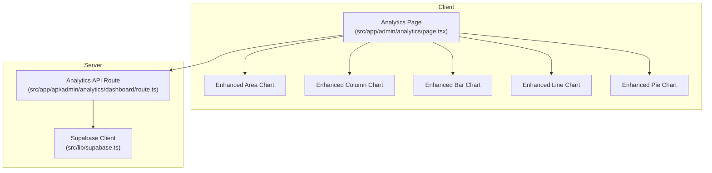
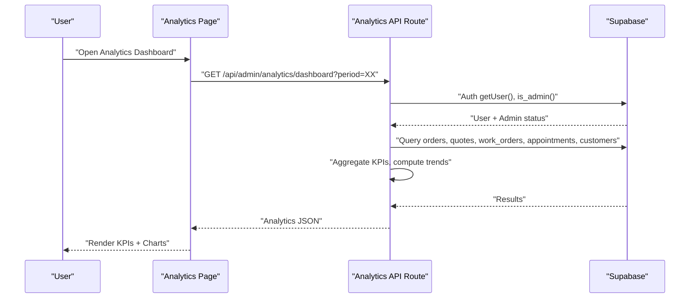
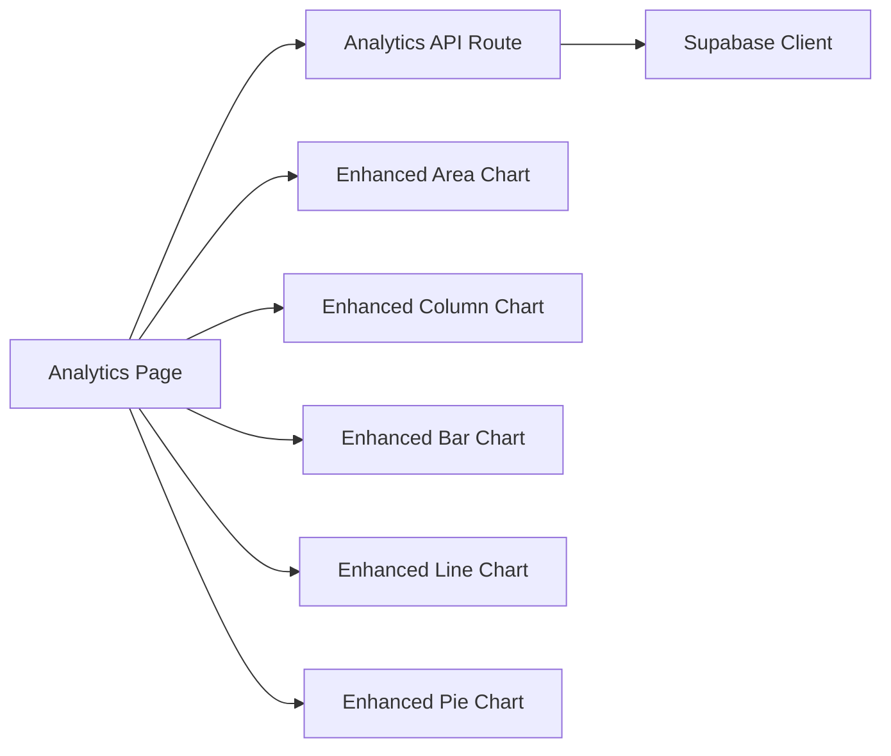

# Analytics & Business Intelligence

<cite>
**Referenced Files in This Document**
- [Analytics Page](file://src/app/admin/analytics/page.tsx)
- [Analytics API Route](file://src/app/api/admin/analytics/dashboard/route.ts)
- [Supabase Client](file://src/lib/supabase.ts)
- [Enhanced Area Chart](file://src/components/admin/charts/EnhancedAreaChart.tsx)
- [Enhanced Bar Chart](file://src/components/admin/charts/EnhancedBarChart.tsx)
- [Enhanced Column Chart](file://src/components/admin/charts/EnhancedColumnChart.tsx)
- [Enhanced Line Chart](file://src/components/admin/charts/EnhancedLineChart.tsx)
- [Enhanced Pie Chart](file://src/components/admin/charts/EnhancedPieChart.tsx)
</cite>

## Table of Contents

1. [Introduction](#introduction)
2. [Project Structure](#project-structure)
3. [Core Components](#core-components)
4. [Architecture Overview](#architecture-overview)
5. [Detailed Component Analysis](#detailed-component-analysis)
6. [Dependency Analysis](#dependency-analysis)
7. [Performance Considerations](#performance-considerations)
8. [Troubleshooting Guide](#troubleshooting-guide)
9. [Conclusion](#conclusion)
10. [Appendices](#appendices)

## Introduction

This document describes the analytics and business intelligence system for real-time metrics, KPI tracking, and interactive data visualization. It covers the dashboard architecture, chart components, data aggregation patterns, real-time update mechanisms, and customization options. It also provides practical examples for configuring dashboards, creating custom metrics, monitoring performance, filtering data, selecting time ranges, and exporting reports for business insights.

## Project Structure

The analytics system is composed of:

- A Next.js page that renders the analytics dashboard and orchestrates user interactions (time range selection, branch filtering, refresh actions).
- An API route that computes aggregated metrics and trends using Supabase.
- A set of reusable chart components built on Recharts for area, column, bar, line, and pie visualizations.
- A Supabase client configured for both browser and server-side operations.

**Diagram sources**

- [Analytics Page](file://src/app/admin/analytics/page.tsx#L134-L191)
- [Analytics API Route](file://src/app/api/admin/analytics/dashboard/route.ts#L8-L635)
- [Supabase Client](file://src/lib/supabase.ts#L1-L36)
- [Enhanced Area Chart](file://src/components/admin/charts/EnhancedAreaChart.tsx#L33-L188)
- [Enhanced Column Chart](file://src/components/admin/charts/EnhancedColumnChart.tsx#L32-L207)
- [Enhanced Bar Chart](file://src/components/admin/charts/EnhancedBarChart.tsx#L36-L200)
- [Enhanced Line Chart](file://src/components/admin/charts/EnhancedLineChart.tsx#L33-L175)
- [Enhanced Pie Chart](file://src/components/admin/charts/EnhancedPieChart.tsx#L64-L184)

**Section sources**

- [Analytics Page](file://src/app/admin/analytics/page.tsx#L134-L191)
- [Analytics API Route](file://src/app/api/admin/analytics/dashboard/route.ts#L8-L635)
- [Supabase Client](file://src/lib/supabase.ts#L1-L36)

## Core Components

- Analytics Page: Renders KPI cards, interactive charts, and tabbed sections. Manages time range selection, branch context, and refresh cycles.
- Analytics API Route: Validates admin access, checks feature availability, applies branch filters, aggregates metrics, and builds trend series.
- Chart Components: Reusable, responsive visualizations with tooltips, legends, and summary statistics.
- Supabase Client: Provides authenticated client for browser and service role client for secure server-side queries.

Key responsibilities:

- Real-time updates: Fetch analytics on demand and on branch/time-range changes.
- Data filtering: Applies branch-level filters and validates admin permissions.
- Metric computation: Computes revenue, counts, conversions, completion rates, and averages.
- Visualization: Supplies chart-ready datasets with localized formatting.

**Section sources**

- [Analytics Page](file://src/app/admin/analytics/page.tsx#L134-L191)
- [Analytics API Route](file://src/app/api/admin/analytics/dashboard/route.ts#L8-L635)
- [Enhanced Area Chart](file://src/components/admin/charts/EnhancedAreaChart.tsx#L33-L188)
- [Enhanced Column Chart](file://src/components/admin/charts/EnhancedColumnChart.tsx#L32-L207)
- [Enhanced Bar Chart](file://src/components/admin/charts/EnhancedBarChart.tsx#L36-L200)
- [Enhanced Line Chart](file://src/components/admin/charts/EnhancedLineChart.tsx#L33-L175)
- [Enhanced Pie Chart](file://src/components/admin/charts/EnhancedPieChart.tsx#L64-L184)

## Architecture Overview

The system follows a client-driven dashboard pattern:

- The client page triggers analytics retrieval via a Next.js API route.
- The API route authenticates the admin user, validates feature access, and constructs branch-aware queries.
- Aggregation logic computes KPIs, distributions, and daily trends.
- The client renders charts and KPIs, enabling interactive exploration.

**Diagram sources**

- [Analytics Page](file://src/app/admin/analytics/page.tsx#L160-L191)
- [Analytics API Route](file://src/app/api/admin/analytics/dashboard/route.ts#L8-L635)

## Detailed Component Analysis

### Analytics Page

Responsibilities:

- Manages loading, error, and refreshing states.
- Supports time range selection (7/30/90/365 days).
- Integrates branch context for multi-branch environments.
- Renders KPI cards and tabbed sections for Work Orders, Quotes, Sales, and Products.
- Switches between chart types (column/line) for selected metrics.

Interactions:

- Period change triggers a refetch.
- Branch selector updates branch context and refetches.
- Refresh button forces a reload.

Formatting:

- Currency formatting for CLP.
- Percentage formatting with directional icons.
- Localized status and payment method labels.

**Section sources**

- [Analytics Page](file://src/app/admin/analytics/page.tsx#L134-L191)
- [Analytics Page](file://src/app/admin/analytics/page.tsx#L193-L250)
- [Analytics Page](file://src/app/admin/analytics/page.tsx#L303-L345)
- [Analytics Page](file://src/app/admin/analytics/page.tsx#L347-L576)
- [Analytics Page](file://src/app/admin/analytics/page.tsx#L578-L764)
- [Analytics Page](file://src/app/admin/analytics/page.tsx#L765-L826)
- [Analytics Page](file://src/app/admin/analytics/page.tsx#L827-L932)
- [Analytics Page](file://src/app/admin/analytics/page.tsx#L933-L1041)
- [Analytics Page](file://src/app/admin/analytics/page.tsx#L1042-L1165)

### Analytics API Route

Responsibilities:

- Authentication and admin validation.
- Feature gating for advanced analytics.
- Branch-aware query construction and filtering.
- Aggregation of:
  - Revenue (POS + Work Orders), growth vs previous period.
  - Work Orders: totals, statuses, pending/completed/cancelled, average delivery days.
  - Quotes: totals, acceptance/rejection/expiry/conversion, conversion rate, average value.
  - Appointments: totals, completion rate, statuses.
  - Customers: total/new/recurring.
  - Products: totals, low/out-of-stock counts, top products, category revenue.
  - Payment methods: counts and revenue per method.
  - Daily trends: sales, customers, work orders, quotes.

Data shaping:

- Builds arrays and maps for chart consumption.
- Formats dates for trend visualization.
- Ensures localized labels for statuses and methods.

**Section sources**

- [Analytics API Route](file://src/app/api/admin/analytics/dashboard/route.ts#L8-L635)

### Chart Components

Reusable chart components share common patterns:

- Data normalization with computed totals and percentages.
- Custom tooltips and legends with optional percentage display.
- Responsive containers and configurable heights.
- Value formatting helpers for currency and large numbers.
- Summary statistics (average, min, max, total) for time-series charts.

Enhanced Area Chart

- Fills gradient area under curve.
- Shows summary stats and grid toggle.

Enhanced Column Chart

- Aggregates dense time-series into weekly buckets for readability.
- Displays summary stats and formatted axes.

Enhanced Bar Chart

- Horizontal bar support for ranked lists.
- Customizable colors and value formatting.

Enhanced Line Chart

- Smooth monotone line with dots and active dots.
- Grid toggle and summary stats.

Enhanced Pie Chart

- Automatic color palette and percentage labels.
- Legend with optional percentage display.

**Section sources**

- [Enhanced Area Chart](file://src/components/admin/charts/EnhancedAreaChart.tsx#L33-L188)
- [Enhanced Column Chart](file://src/components/admin/charts/EnhancedColumnChart.tsx#L32-L207)
- [Enhanced Bar Chart](file://src/components/admin/charts/EnhancedBarChart.tsx#L36-L200)
- [Enhanced Line Chart](file://src/components/admin/charts/EnhancedLineChart.tsx#L33-L175)
- [Enhanced Pie Chart](file://src/components/admin/charts/EnhancedPieChart.tsx#L64-L184)

### Data Aggregation Patterns

- Time windows: Current and previous periods for growth comparisons.
- Branch scoping: Filters applied to orders, quotes, work orders, appointments, and customers.
- Order item joins: Ensures only items from orders in the current period are counted.
- Category mapping: Products joined to categories for revenue attribution.
- Status mapping: Normalized labels for statuses and payment methods.

**Section sources**

- [Analytics API Route](file://src/app/api/admin/analytics/dashboard/route.ts#L66-L155)
- [Analytics API Route](file://src/app/api/admin/analytics/dashboard/route.ts#L172-L202)
- [Analytics API Route](file://src/app/api/admin/analytics/dashboard/route.ts#L204-L448)

### Real-Time Updates and Supabase Integration

- Client fetches analytics on mount and on period/branch changes.
- Server-side Supabase client ensures secure queries and admin validation.
- Service role client enables privileged reads for analytics computations.

Note: The current implementation performs on-demand fetches triggered by UI actions. Real-time streaming would require adding Supabase Realtime channels or periodic polling.

**Section sources**

- [Analytics Page](file://src/app/admin/analytics/page.tsx#L160-L191)
- [Analytics API Route](file://src/app/api/admin/analytics/dashboard/route.ts#L2-L6)
- [Supabase Client](file://src/lib/supabase.ts#L1-L36)

### Customizable Metric Displays

- KPI cards: Currency, counts, and growth indicators with icons and colors.
- Tabbed sections: Dedicated views for Work Orders, Quotes, Sales, and Products.
- Chart type toggles: Column/line switches for trend visualization.
- Formatting helpers: Currency and percentage formatters with localized labels.

**Section sources**

- [Analytics Page](file://src/app/admin/analytics/page.tsx#L347-L576)
- [Analytics Page](file://src/app/admin/analytics/page.tsx#L578-L764)
- [Analytics Page](file://src/app/admin/analytics/page.tsx#L765-L932)
- [Analytics Page](file://src/app/admin/analytics/page.tsx#L933-L1041)
- [Analytics Page](file://src/app/admin/analytics/page.tsx#L1042-L1165)

### Practical Examples

#### Dashboard Configuration

- Time range selection: Choose 7/30/90/365 days to adjust the analysis window.
- Branch context: Super admins can switch branches; regular admins without branch visibility receive empty datasets.
- Refresh: Use the refresh button to reload metrics after changes.

**Section sources**

- [Analytics Page](file://src/app/admin/analytics/page.tsx#L144-L162)
- [Analytics Page](file://src/app/admin/analytics/page.tsx#L321-L344)

#### Custom Metric Creation

- Add new KPIs by extending the analytics response shape in the API route and rendering them in the page.
- Extend chart components to visualize new series (e.g., conversion funnels, retention cohorts).
- Introduce new tabs by adding new tab panels and chart components.

**Section sources**

- [Analytics API Route](file://src/app/api/admin/analytics/dashboard/route.ts#L549-L618)
- [Analytics Page](file://src/app/admin/analytics/page.tsx#L578-L764)

#### Performance Monitoring

- Monitor revenue growth, average order value, and conversion rates.
- Track inventory health (low/out-of-stock counts) and top-performing products.
- Observe daily trends for sales, customers, work orders, and quotes.

**Section sources**

- [Analytics API Route](file://src/app/api/admin/analytics/dashboard/route.ts#L204-L448)
- [Analytics Page](file://src/app/admin/analytics/page.tsx#L933-L1041)

#### Data Filtering and Time Range Selection

- Branch filter: Automatically applied when a branch is selected or when a user lacks branch access.
- Time range: Controlled by a dropdown; passed as a query parameter to the API.
- Status and payment method labels: Localized for readability.

**Section sources**

- [Analytics API Route](file://src/app/api/admin/analytics/dashboard/route.ts#L112-L131)
- [Analytics Page](file://src/app/admin/analytics/page.tsx#L321-L344)
- [Analytics Page](file://src/app/admin/analytics/page.tsx#L215-L249)

#### Export Capabilities

- The current implementation does not include built-in export buttons.
- To enable exports, integrate chart libraries with export utilities or add server-side CSV/PDF generation endpoints.

[No sources needed since this section provides general guidance]

## Dependency Analysis

The analytics system exhibits clean separation of concerns:

- Client page depends on chart components and the analytics API route.
- API route depends on Supabase clients and branch middleware.
- Chart components depend on Recharts and React hooks.

**Diagram sources**

- [Analytics Page](file://src/app/admin/analytics/page.tsx#L134-L191)
- [Analytics API Route](file://src/app/api/admin/analytics/dashboard/route.ts#L8-L635)
- [Supabase Client](file://src/lib/supabase.ts#L1-L36)
- [Enhanced Area Chart](file://src/components/admin/charts/EnhancedAreaChart.tsx#L33-L188)
- [Enhanced Column Chart](file://src/components/admin/charts/EnhancedColumnChart.tsx#L32-L207)
- [Enhanced Bar Chart](file://src/components/admin/charts/EnhancedBarChart.tsx#L36-L200)
- [Enhanced Line Chart](file://src/components/admin/charts/EnhancedLineChart.tsx#L33-L175)
- [Enhanced Pie Chart](file://src/components/admin/charts/EnhancedPieChart.tsx#L64-L184)

**Section sources**

- [Analytics Page](file://src/app/admin/analytics/page.tsx#L134-L191)
- [Analytics API Route](file://src/app/api/admin/analytics/dashboard/route.ts#L8-L635)
- [Supabase Client](file://src/lib/supabase.ts#L1-L36)

## Performance Considerations

- Query batching: The API route uses Promise.all to fetch multiple datasets efficiently.
- Data aggregation: Pre-aggregates KPIs and trends server-side to minimize client computation.
- Chart optimization: Column chart aggregates dense time-series into weekly buckets to reduce rendering overhead.
- Formatting: Uses memoization for derived data to avoid unnecessary recalculations.

Recommendations:

- Implement caching for repeated queries within short intervals.
- Consider pagination for large datasets in detailed tables.
- Add debounced refresh for rapid period changes.

**Section sources**

- [Analytics API Route](file://src/app/api/admin/analytics/dashboard/route.ts#L133-L155)
- [Enhanced Column Chart](file://src/components/admin/charts/EnhancedColumnChart.tsx#L39-L77)

## Troubleshooting Guide

Common issues and resolutions:

- Unauthorized access: Ensure admin authentication and feature validation pass.
- Missing environment variables: Verify Supabase URL and keys are configured.
- Empty datasets: Confirm branch context and that the user has appropriate access.
- Feature not available: Advanced analytics require a qualifying subscription tier.

**Section sources**

- [Analytics API Route](file://src/app/api/admin/analytics/dashboard/route.ts#L14-L57)
- [Supabase Client](file://src/lib/supabase.ts#L7-L9)

## Conclusion

The analytics and business intelligence system delivers a robust, extensible foundation for real-time metrics and interactive visualizations. It supports branch-aware analytics, flexible time ranges, and a variety of chart types tailored for business insights. With minor enhancements—such as export capabilities and optional real-time streaming—the system can serve as a comprehensive dashboard for operational monitoring and strategic decision-making.

## Appendices

### API Definition: Analytics Dashboard

- Endpoint: GET /api/admin/analytics/dashboard
- Query parameters:
  - period: integer (7, 30, 90, 365)
- Request headers:
  - Branch context header for multi-branch filtering
- Response:
  - analytics: aggregated KPIs, distributions, and trends

**Section sources**

- [Analytics API Route](file://src/app/api/admin/analytics/dashboard/route.ts#L63-L64)
- [Analytics API Route](file://src/app/api/admin/analytics/dashboard/route.ts#L549-L618)

### Chart Component Reference

- EnhancedAreaChart: Area chart with gradient fill and summary stats.
- EnhancedColumnChart: Column chart with weekly aggregation and summary stats.
- EnhancedBarChart: Horizontal or vertical bar chart with tooltips and legends.
- EnhancedLineChart: Smooth line chart with grid toggle and summary stats.
- EnhancedPieChart: Pie chart with legend, percentage labels, and custom tooltip.

**Section sources**

- [Enhanced Area Chart](file://src/components/admin/charts/EnhancedAreaChart.tsx#L33-L188)
- [Enhanced Column Chart](file://src/components/admin/charts/EnhancedColumnChart.tsx#L32-L207)
- [Enhanced Bar Chart](file://src/components/admin/charts/EnhancedBarChart.tsx#L36-L200)
- [Enhanced Line Chart](file://src/components/admin/charts/EnhancedLineChart.tsx#L33-L175)
- [Enhanced Pie Chart](file://src/components/admin/charts/EnhancedPieChart.tsx#L64-L184)
