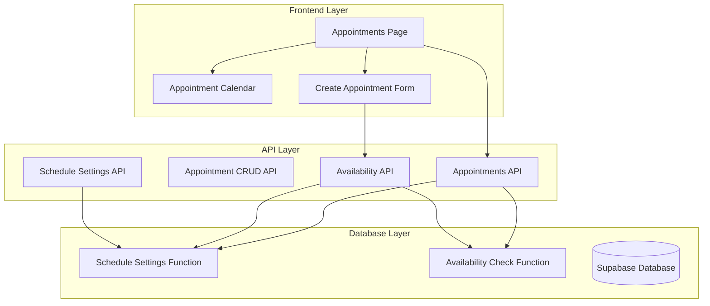
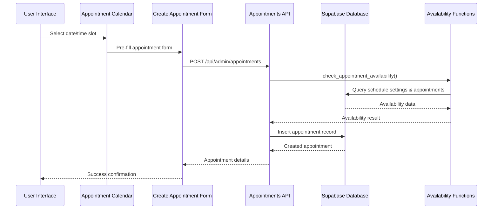
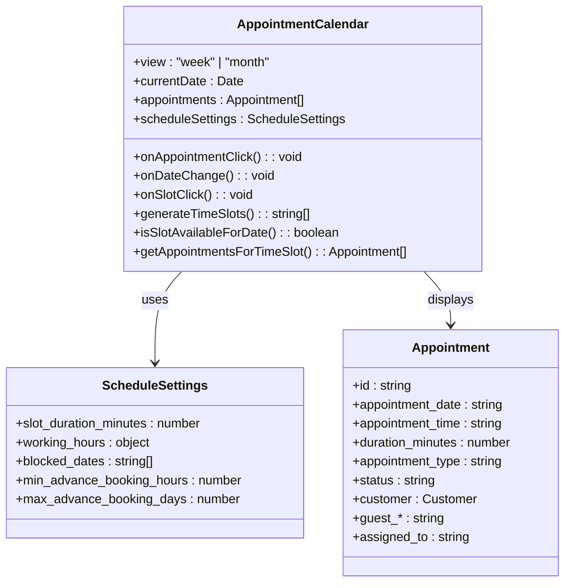
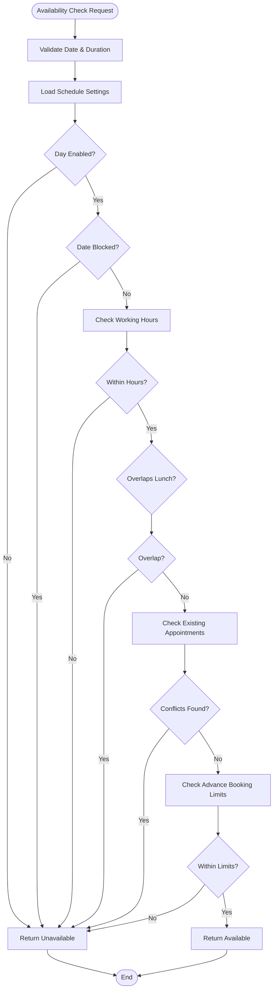
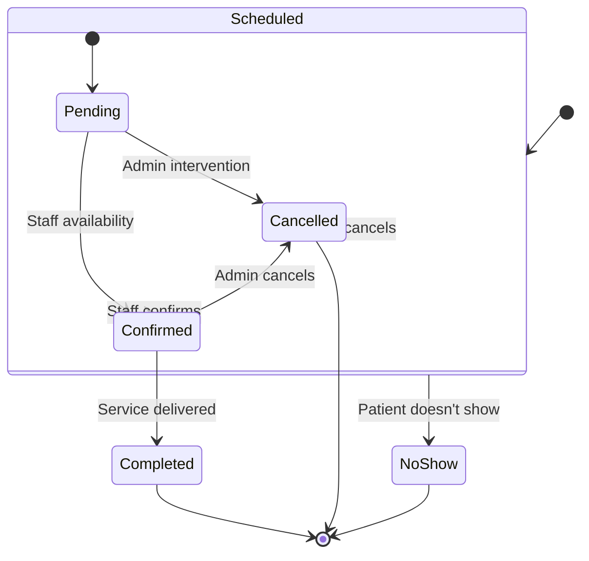
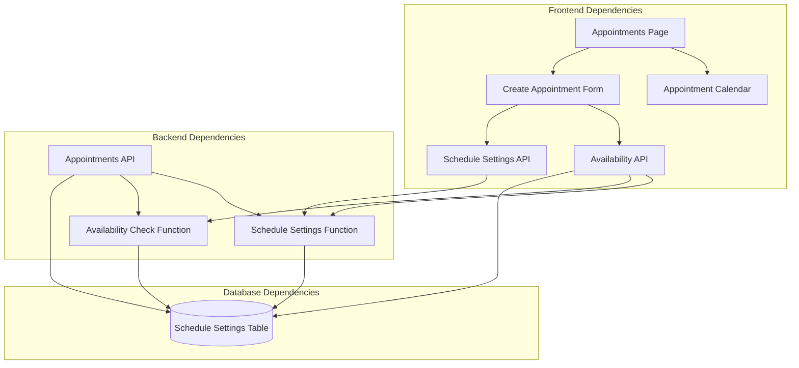

# Appointment Scheduling System

<cite>
**Referenced Files in This Document**
- [Appointments Page](file://src/app/admin/appointments/page.tsx)
- [Appointment Calendar](file://src/components/admin/AppointmentCalendar.tsx)
- [Create Appointment Form](file://src/components/admin/CreateAppointmentForm.tsx)
- [Appointments API](file://src/app/api/admin/appointments/route.ts)
- [Appointment CRUD API](file://src/app/api/admin/appointments/[id]/route.ts)
- [Availability API](file://src/app/api/admin/appointments/availability/route.ts)
- [Schedule Settings API](file://src/app/api/admin/schedule-settings/route.ts)
- [Schedule Settings Function](file://supabase/migrations/20250126000000_create_schedule_settings_system.sql)
- [Availability Check Function](file://supabase/migrations/20250127000001_fix_check_appointment_availability.sql)
- [Debug Availability Function](file://supabase/migrations/20250127000002_debug_check_appointment_availability.sql)
- [Timezone Fix Function](file://supabase/migrations/20250127000003_fix_timezone_check_appointment_availability.sql)
- [Fallback Function](file://supabase/migrations/20251216000004_fix_appointment_availability_fallback.sql)
</cite>

## Table of Contents

1. [Introduction](#introduction)
2. [Project Structure](#project-structure)
3. [Core Components](#core-components)
4. [Architecture Overview](#architecture-overview)
5. [Detailed Component Analysis](#detailed-component-analysis)
6. [Dependency Analysis](#dependency-analysis)
7. [Performance Considerations](#performance-considerations)
8. [Troubleshooting Guide](#troubleshooting-guide)
9. [Conclusion](#conclusion)

## Introduction

The Appointment Scheduling System is a comprehensive calendar-based solution for managing optometric appointments, staff availability, and patient workflows. Built with Next.js and Supabase, it provides an interactive calendar interface supporting both weekly and monthly views, intelligent availability checking, and robust appointment lifecycle management including creation, rescheduling, cancellation, and completion workflows.

The system features advanced scheduling capabilities including time slot management, resource allocation, holiday and maintenance blocking, automated reminders, and capacity management. It supports both registered customers and guest appointments with seamless auto-registration capabilities.

## Project Structure

The system follows a modular architecture with clear separation between frontend components, backend APIs, and database functions:



**Diagram sources**

- [Appointments Page](file://src/app/admin/appointments/page.tsx#L112-L164)
- [Appointment Calendar](file://src/components/admin/AppointmentCalendar.tsx#L72-L80)
- [Create Appointment Form](file://src/components/admin/CreateAppointmentForm.tsx#L47-L53)
- [Appointments API](file://src/app/api/admin/appointments/route.ts#L205-L280)
- [Schedule Settings Function](file://supabase/migrations/20250126000000_create_schedule_settings_system.sql#L156-L236)

**Section sources**

- [Appointments Page](file://src/app/admin/appointments/page.tsx#L1-L800)
- [Appointment Calendar](file://src/components/admin/AppointmentCalendar.tsx#L1-L630)
- [Create Appointment Form](file://src/components/admin/CreateAppointmentForm.tsx#L1-L800)

## Core Components

### Interactive Calendar Interface

The system provides a sophisticated calendar interface supporting both weekly and monthly views with intelligent time slot management:

**Weekly View Features:**

- 15-minute increment time slots generated from schedule settings
- Real-time availability indicators with color-coded appointment types
- Click-to-create functionality for available time slots
- Past date/time blocking and visual indicators
- Responsive design with sticky headers and custom scrollbars

**Monthly View Features:**

- Full-month grid display with appointment indicators
- Hover effects for empty slots showing create intent
- Compact appointment previews with status badges
- Current day highlighting and past date dimming

**Section sources**

- [Appointment Calendar](file://src/components/admin/AppointmentCalendar.tsx#L342-L522)
- [Appointment Calendar](file://src/components/admin/AppointmentCalendar.tsx#L525-L628)

### Availability Checking System

The availability system implements sophisticated conflict detection and blocking mechanisms:

**Core Availability Logic:**

- Working hours enforcement with configurable start/end times
- Lunch break exclusion for overlapping periods
- Staff-specific availability checking
- Minimum/maximum booking advance time controls
- Holiday and maintenance date blocking
- Conflict detection for overlapping appointments

**Section sources**

- [Availability Check Function](file://supabase/migrations/20250127000001_fix_check_appointment_availability.sql#L1-L104)
- [Schedule Settings Function](file://supabase/migrations/20250126000000_create_schedule_settings_system.sql#L156-L236)

### Appointment Types and Duration Management

The system supports eight distinct appointment types with specialized workflows:

**Supported Appointment Types:**

- Eye Exam: Comprehensive vision examination
- Consultation: General eye health consultation
- Fitting: Glasses/contacts fitting procedures
- Delivery: Prescription lens delivery
- Repair: Eyewear repair services
- Follow-up: Post-treatment follow-up visits
- Emergency: Urgent care appointments
- Other: Miscellaneous/optometric procedures

**Duration Management:**

- Configurable default appointment durations
- Flexible 15-minute slot increments
- Automatic slot generation based on working hours
- Duration-aware conflict detection

**Section sources**

- [Create Appointment Form](file://src/components/admin/CreateAppointmentForm.tsx#L111-L120)
- [Schedule Settings API](file://src/app/api/admin/schedule-settings/route.ts#L64-L124)

### Staff Assignment and Resource Allocation

Advanced staff assignment capabilities enable efficient resource management:

**Staff Assignment Features:**

- Dedicated staff member assignment per appointment
- Staff-specific availability checking
- Resource utilization tracking
- Multi-staff scheduling coordination

**Section sources**

- [Appointments API](file://src/app/api/admin/appointments/route.ts#L162-L170)
- [Appointment CRUD API](file://src/app/api/admin/appointments/[id]/route.ts#L162-L170)

## Architecture Overview



**Diagram sources**

- [Appointments Page](file://src/app/admin/appointments/page.tsx#L401-L412)
- [Create Appointment Form](file://src/components/admin/CreateAppointmentForm.tsx#L376-L470)
- [Appointments API](file://src/app/api/admin/appointments/route.ts#L205-L280)
- [Availability Check Function](file://supabase/migrations/20250127000001_fix_check_appointment_availability.sql#L1-L104)

## Detailed Component Analysis

### Calendar Component Architecture



**Diagram sources**

- [Appointment Calendar](file://src/components/admin/AppointmentCalendar.tsx#L49-L70)
- [Appointment Calendar](file://src/components/admin/AppointmentCalendar.tsx#L29-L47)

**Section sources**

- [Appointment Calendar](file://src/components/admin/AppointmentCalendar.tsx#L1-L630)

### Availability Checking Workflow



**Diagram sources**

- [Availability Check Function](file://supabase/migrations/20250127000001_fix_check_appointment_availability.sql#L11-L99)

**Section sources**

- [Availability Check Function](file://supabase/migrations/20250127000001_fix_check_appointment_availability.sql#L1-L104)
- [Debug Availability Function](file://supabase/migrations/20250127000002_debug_check_appointment_availability.sql#L1-L77)

### Appointment Lifecycle Management



**Section sources**

- [Appointment CRUD API](file://src/app/api/admin/appointments/[id]/route.ts#L194-L261)

### Guest Appointment Handling System

```mermaid
flowchart TD
GuestCreation["Guest Appointment Creation"] --> ValidateGuest["Validate Guest Data"]
ValidateGuest --> StoreGuest["Store Guest Data in Appointment"]
StoreGuest --> CreateAppointment["Create Appointment Record"]
CreateAppointment --> CheckCompletion{"Status = Completed?"}
CheckCompletion --> |No| CompleteWorkflow["Complete Guest Workflow"]
CheckCompletion --> |Yes| AutoRegister["Auto-register Guest as Customer"]
AutoRegister --> SearchExisting["Search Existing Customer by RUT"]
SearchExisting --> FoundExisting{"Existing Customer?"}
FoundExisting --> |Yes| UpdateAppointment["Update Appointment with Customer ID"]
FoundExisting --> |No| CreateCustomer["Create New Customer Record"]
CreateCustomer --> UpdateAppointment
UpdateAppointment --> ClearGuestData["Clear Guest Fields"]
ClearGuestData --> CompleteWorkflow
CompleteWorkflow --> EmailNotification["Send Confirmation Email"]
EmailNotification --> [*]
```

**Diagram sources**

- [Create Appointment Form](file://src/components/admin/CreateAppointmentForm.tsx#L422-L457)
- [Appointment CRUD API](file://src/app/api/admin/appointments/[id]/route.ts#L280-L363)

**Section sources**

- [Create Appointment Form](file://src/components/admin/CreateAppointmentForm.tsx#L422-L457)
- [Appointment CRUD API](file://src/app/api/admin/appointments/[id]/route.ts#L280-L363)

## Dependency Analysis



**Diagram sources**

- [Appointments API](file://src/app/api/admin/appointments/route.ts#L337-L340)
- [Availability API](file://src/app/api/admin/appointments/availability/route.ts#L61-L69)
- [Schedule Settings API](file://src/app/api/admin/schedule-settings/route.ts#L35-L44)

**Section sources**

- [Appointments API](file://src/app/api/admin/appointments/route.ts#L1-L640)
- [Availability API](file://src/app/api/admin/appointments/availability/route.ts#L1-L172)
- [Schedule Settings API](file://src/app/api/admin/schedule-settings/route.ts#L1-L334)

## Performance Considerations

### Database Optimization Strategies

- **Index Usage**: Schedule settings and appointment queries utilize appropriate indexing for date, time, and status fields
- **Batch Operations**: Related data fetching uses batch queries to minimize database round trips
- **Pagination**: Large dataset queries implement proper pagination limits
- **Connection Pooling**: Supabase service role clients optimize database connections

### Frontend Performance Enhancements

- **Code Splitting**: Dynamic imports for heavy components like calendar and forms
- **Memoization**: React.memo and useMemo for expensive calculations
- **Virtual Scrolling**: Custom scrollbar implementation for large datasets
- **Lazy Loading**: Component lazy loading to reduce initial bundle size

### API Response Optimization

- **Selective Field Loading**: API endpoints load only required fields
- **Error Handling**: Comprehensive error handling with specific error codes
- **Logging**: Structured logging for performance monitoring and debugging

## Troubleshooting Guide

### Common Issues and Solutions

**Availability Check Failures:**

- Verify schedule settings are properly configured for the target branch
- Check that working hours match the appointment date (weekday vs weekend)
- Ensure minimum/maximum booking limits are appropriate for the appointment type
- Review blocked dates configuration for holidays and maintenance periods

**Calendar Display Issues:**

- Confirm schedule settings are loaded before calendar initialization
- Verify time zone settings match the organization's operational region
- Check browser compatibility for calendar rendering features
- Ensure responsive breakpoints are properly configured

**Guest Registration Problems:**

- Validate RUT format compliance before auto-registration attempts
- Check organization-level customer search for existing records
- Monitor auto-registration process logs for error conditions
- Verify email notification system is properly configured

**Performance Issues:**

- Monitor database query execution times for availability checks
- Check API response times for large appointment datasets
- Review frontend bundle size and loading performance
- Analyze network requests for optimization opportunities

**Section sources**

- [Debug Availability Function](file://supabase/migrations/20250127000002_debug_check_appointment_availability.sql#L1-L77)
- [Timezone Fix Function](file://supabase/migrations/20250127000003_fix_timezone_check_appointment_availability.sql#L1-L44)

## Conclusion

The Appointment Scheduling System provides a robust, scalable solution for optometric practice management with comprehensive calendar functionality, intelligent availability checking, and flexible appointment workflow management. The system's modular architecture enables easy maintenance and extension while maintaining high performance and reliability.

Key strengths include advanced conflict detection, guest appointment handling with auto-registration, comprehensive staff assignment capabilities, and flexible configuration options. The system supports both individual practitioners and multi-location organizations through its branch-aware architecture and global configuration capabilities.

Future enhancements could include automated reminder systems, capacity management features, and expanded reporting capabilities to further streamline optometric practice operations.
