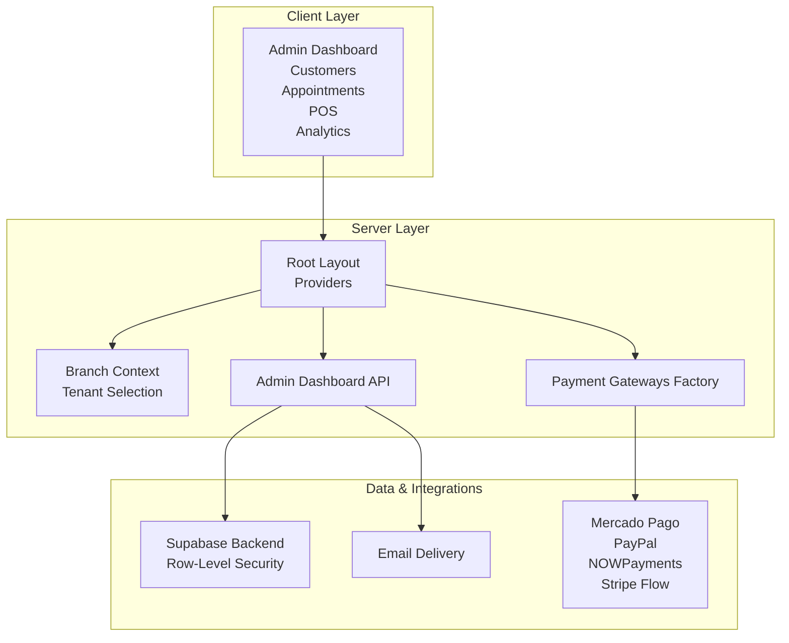
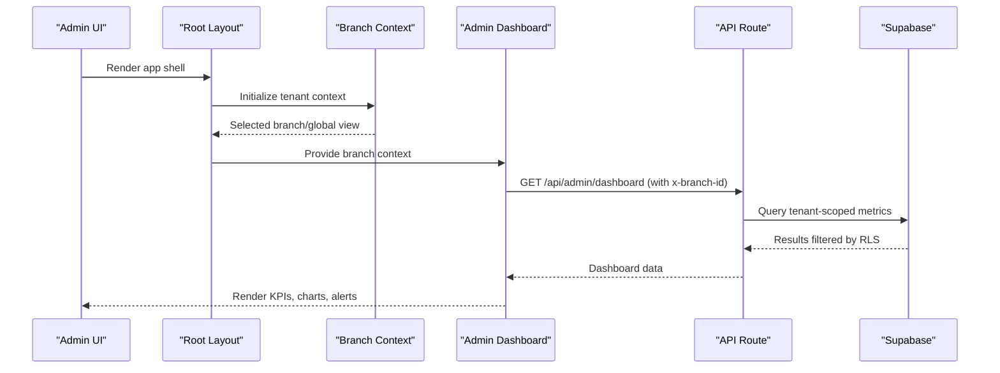
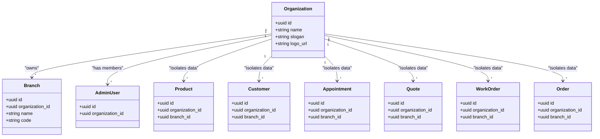
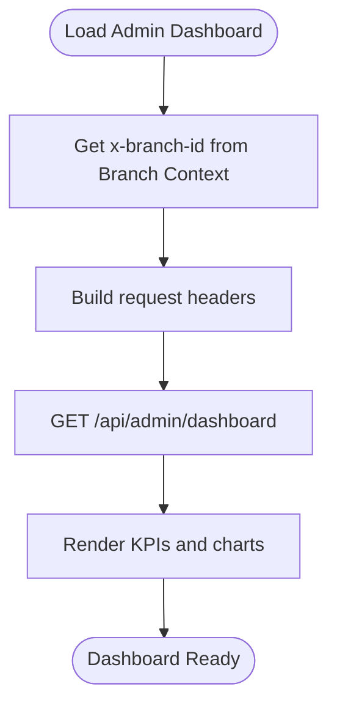
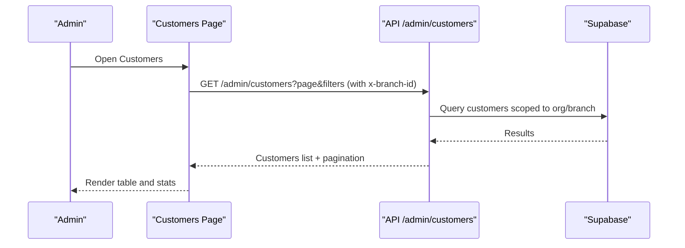
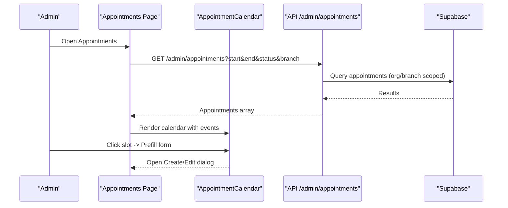
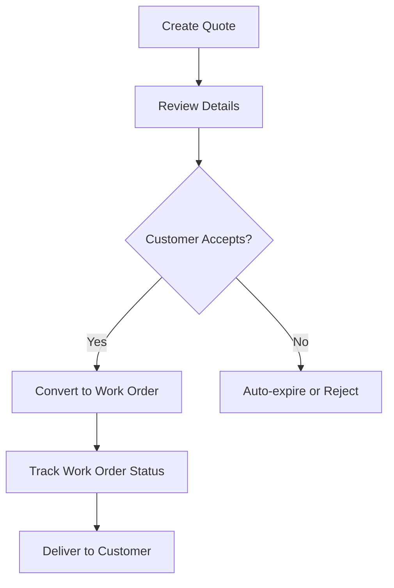
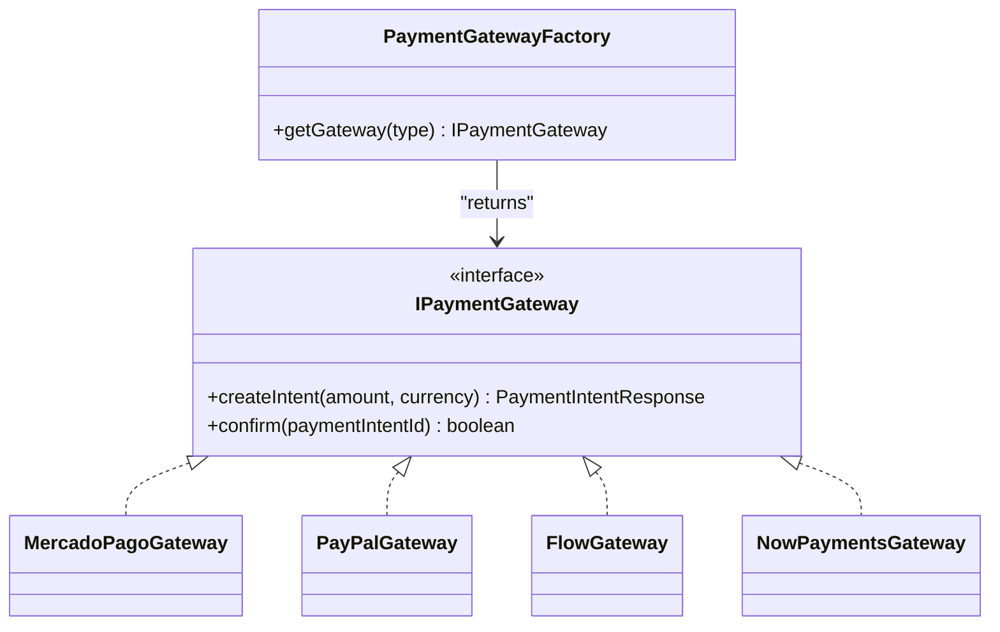
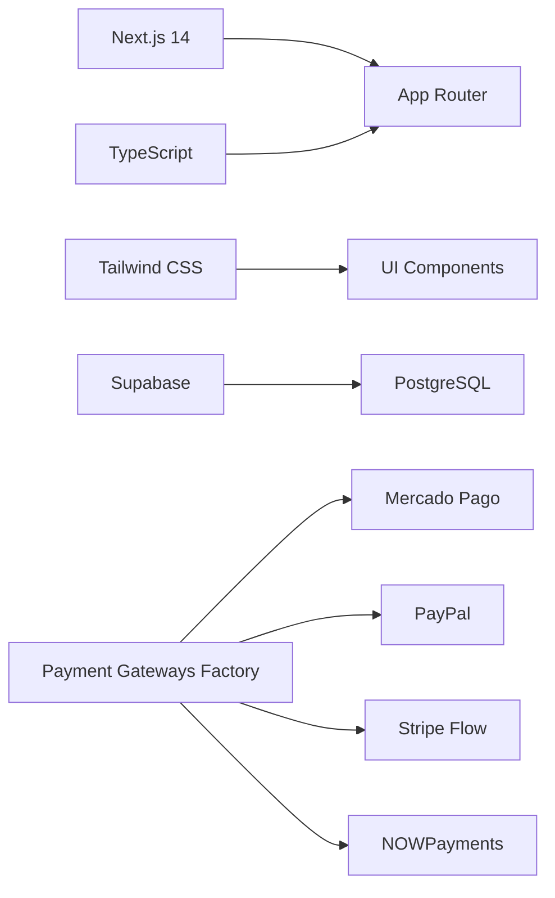

# Core Features Overview

<cite>
**Referenced Files in This Document**
- [README.md](file://README.md)
- [package.json](file://package.json)
- [src/app/layout.tsx](file://src/app/layout.tsx)
- [src/app/admin/page.tsx](file://src/app/admin/page.tsx)
- [src/app/admin/customers/page.tsx](file://src/app/admin/customers/page.tsx)
- [src/app/admin/appointments/page.tsx](file://src/app/admin/appointments/page.tsx)
- [src/contexts/BranchContext.tsx](file://src/contexts/BranchContext.tsx)
- [src/lib/payments/index.ts](file://src/lib/payments/index.ts)
- [supabase/migrations/20260128000000_create_organizations_and_subscriptions.sql](file://supabase/migrations/20260128000000_create_organizations_and_subscriptions.sql)
- [supabase/migrations/20260128000001_extend_rls_for_multitenancy.sql](file://supabase/migrations/20260128000001_extend_rls_for_multitenancy.sql)
- [supabase/migrations/20260131000000_create_payments_and_webhook_events.sql](file://supabase/migrations/20260131000000_create_payments_and_webhook_events.sql)
- [supabase/migrations/20260203000002_create_payment_gateways_config.sql](file://supabase/migrations/20260203000002_create_payment_gateways_config.sql)
- [supabase/migrations/20260203000003_add_organization_id_to_notifications.sql](file://supabase/migrations/20260203000003_add_organization_id_to_notifications.sql)
- [supabase/migrations/20260203000004_add_organization_id_to_lens_families.sql](file://supabase/migrations/20260203000004_add_organization_id_to_lens_families.sql)
- [supabase/migrations/20260203000005_add_organization_id_to_orders.sql](file://supabase/migrations/20260203000005_add_organization_id_to_orders.sql)
- [supabase/migrations/20260203000006_add_organization_id_to_prescriptions.sql](file://supabase/migrations/20260203000006_add_organization_id_to_prescriptions.sql)
- [supabase/migrations/20260203000007_add_organization_id_to_products.sql](file://supabase/migrations/20260203000007_add_organization_id_to_products.sql)
- [supabase/migrations/20260203000008_add_organization_id_to_quotes.sql](file://supabase/migrations/20260203000008_add_organization_id_to_quotes.sql)
- [supabase/migrations/20260203000009_add_organization_id_to_work_orders.sql](file://supabase/migrations/20260203000009_add_organization_id_to_work_orders.sql)
- [supabase/migrations/20260203000010_add_organization_id_to_appointments.sql](file://supabase/migrations/20260203000010_add_organization_id_to_appointments.sql)
- [supabase/migrations/20260203000011_add_organization_id_to_customers.sql](file://supabase/migrations/20260203000011_add_organization_id_to_customers.sql)
- [supabase/migrations/20260203000012_add_organization_id_to_admin_users.sql](file://supabase/migrations/20260203000012_add_organization_id_to_admin_users.sql)
- [supabase/migrations/20260203000013_add_organization_id_to_branches.sql](file://supabase/migrations/20260203000013_add_organization_id_to_branches.sql)
- [supabase/migrations/20260203000014_add_organization_id_to_schedule_settings.sql](file://supabase/migrations/20260203000014_add_organization_id_to_schedule_settings.sql)
- [supabase/migrations/20260203000015_add_organization_id_to_quote_settings.sql](file://supabase/migrations/20260203000015_add_organization_id_to_quote_settings.sql)
- [supabase/migrations/20260203000016_add_organization_id_to_pos_settings.sql](file://supabase/migrations/20260203000016_add_organization_id_to_pos_settings.sql)
- [supabase/migrations/20260203000017_add_organization_id_to_system_config.sql](file://supabase/migrations/20260203000017_add_organization_id_to_system_config.sql)
- [supabase/migrations/20260203000018_add_organization_id_to_notifications.sql](file://supabase/migrations/20260203000018_add_organization_id_to_notifications.sql)
- [supabase/migrations/20260203000019_add_organization_id_to_optical_internal_support.sql](file://supabase/migrations/20260203000019_add_organization_id_to_optical_internal_support.sql)
- [supabase/migrations/20260203000020_add_organization_id_to_optical_support_tickets.sql](file://supabase/migrations/20260203000020_add_organization_id_to_optical_support_tickets.sql)
- [supabase/migrations/20260203000021_add_organization_id_to_optical_internal_support.sql](file://supabase/migrations/20260203000021_add_organization_id_to_optical_internal_support.sql)
- [supabase/migrations/20260203000022_add_organization_id_to_optical_internal_support.sql](file://supabase/migrations/20260203000022_add_organization_id_to_optical_internal_support.sql)
- [supabase/migrations/20260203000023_add_organization_id_to_optical_internal_support.sql](file://supabase/migrations/20260203000023_add_organization_id_to_optical_internal_support.sql)
- [supabase/migrations/20260203000024_add_organization_id_to_optical_internal_support.sql](file://supabase/migrations/20260203000024_add_organization_id_to_optical_internal_support.sql)
- [supabase/migrations/20260203000025_add_organization_id_to_optical_internal_support.sql](file://supabase/migrations/20260203000025_add_organization_id_to_optical_internal_support.sql)
- [supabase/migrations/20260203000026_add_organization_id_to_optical_internal_support.sql](file://supabase/migrations/20260203000026_add_organization_id_to_optical_internal_support.sql)
- [supabase/migrations/20260203000027_add_organization_id_to_optical_internal_support.sql](file://supabase/migrations/20260203000027_add_organization_id_to_optical_internal_support.sql)
- [supabase/migrations/20260203000028_add_organization_id_to_optical_internal_support.sql](file://supabase/migrations/20260203000028_add_organization_id_to_optical_internal_support.sql)
- [supabase/migrations/20260203000029_add_organization_id_to_optical_internal_support.sql](file://supabase/migrations/20260203000029_add_organization_id_to_optical_internal_support.sql)
- [supabase/migrations/20260203000030_add_organization_id_to_optical_internal_support.sql](file://supabase/migrations/20260203000030_add_organization_id_to_optical_internal_support.sql)
- [supabase/migrations/20260203000031_add_organization_id_to_optical_internal_support.sql](file://supabase/migrations/20260203000031_add_organization_id_to_optical_internal_support.sql)
- [supabase/migrations/20260203000032_add_organization_id_to_optical_internal_support.sql](file://supabase/migrations/20260203000032_add_organization_id_to_optical_internal_support.sql)
- [supabase/migrations/20260203000033_add_organization_id_to_optical_internal_support.sql](file://supabase/migrations/20260203000033_add_organization_id_to_optical_internal_support.sql)
- [supabase/migrations/20260203000034_add_organization_id_to_optical_internal_support.sql](file://supabase/migrations/20260203000034_add_organization_id_to_optical_internal_support.sql)
- [supabase/migrations/20260203000035_add_organization_id_to_optical_internal_support.sql](file://supabase/migrations/20260203000035_add_organization_id_to_optical_internal_support.sql)
- [supabase/migrations/20260203000036_add_organization_id_to_optical_internal_support.sql](file://supabase/migrations/20260203000036_add_organization_id_to_optical_internal_support.sql)
- [supabase/migrations/20260203000037_add_organization_id_to_optical_internal_support.sql](file://supabase/migrations/20260203000037_add_organization_id_to_optical_internal_support.sql)
- [supabase/migrations/20260203000038_add_organization_id_to_optical_internal_support.sql](file://supabase/migrations/20260203000038_add_organization_id_to_optical_internal_support.sql)
- [supabase/migrations/20260203000039_add_organization_id_to_optical_internal_support.sql](file://supabase/migrations/20260203000039_add_organization_id_to_optical_internal_support.sql)
- [supabase/migrations/20260203000040_add_organization_id_to_optical_internal_support.sql](file://supabase/migrations/20260203000040_add_organization_id_to_optical_internal_support.sql)
- [supabase/migrations/20260203000041_add_organization_id_to_optical_internal_support.sql](file://supabase/migrations/20260203000041_add_organization_id_to_optical_internal_support.sql)
- [supabase/migrations/20260203000042_add_organization_id_to_optical_internal_support.sql](file://supabase/migrations/20260203000042_add_organization_id_to_optical_internal_support.sql)
- [supabase/migrations/20260203000043_add_organization_id_to_optical_internal_support.sql](file://supabase/migrations/20260203000043_add_organization_id_to_optical_internal_support.sql)
- [supabase/migrations/20260203000044_add_organization_id_to_optical_internal_support.sql](file://supabase/migrations/20260203000044_add_organization_id_to_optical_internal_support.sql)
- [supabase/migrations/20260203000045_add_organization_id_to_optical_internal_support.sql](file://supabase/migrations/20260203000045_add_organization_id_to_optical_internal_support.sql)
- [supabase/migrations/20260203000046_add_organization_id_to_optical_internal_support.sql](file://supabase/migrations/20260203000046_add_organization_id_to_optical_internal_support.sql)
- [supabase/migrations/20260203000047_add_organization_id_to_optical_internal_support.sql](file://supabase/migrations/20260203000047_add_organization_id_to_optical_internal_support.sql)
- [supabase/migrations/20260203000048_add_organization_id_to_optical_internal_support.sql](file://supabase/migrations/20260203000048_add_organization_id_to_optical_internal_support.sql)
- [supabase/migrations/20260203000049_add_organization_id_to_optical_internal_support.sql](file://supabase/migrations/20260203000049_add_organization_id_to_optical_internal_support.sql)
- [supabase/migrations/20260203000050_add_organization_id_to_optical_internal_support.sql](file://supabase/migrations/20260203000050_add_organization_id_to_optical_internal_support.sql)
- [supabase/migrations/20260203000051_add_organization_id_to_optical_internal_support.sql](file://supabase/migrations/20260203000051_add_organization_id_to_optical_internal_support.sql)
- [supabase/migrations/20260203000052_add_organization_id_to_optical_internal_support.sql](file://supabase/migrations/20260203000052_add_organization_id_to_optacial_internal_support.sql](file://supabase/migrations/20260203000052_add_organization_id_to_optical_internal_support.sql)
</cite>

## Table of Contents

1. [Introduction](#introduction)
2. [Project Structure](#project-structure)
3. [Core Components](#core-components)
4. [Architecture Overview](#architecture-overview)
5. [Detailed Component Analysis](#detailed-component-analysis)
6. [Dependency Analysis](#dependency-analysis)
7. [Performance Considerations](#performance-considerations)
8. [Troubleshooting Guide](#troubleshooting-guide)
9. [Conclusion](#conclusion)

## Introduction

Opttius is a comprehensive optical management platform designed for opticians and lab networks. It provides a complete business suite including customer lifecycle management, appointment scheduling, quote and work order processing, point-of-sale (POS), product catalog and inventory, analytics and reporting, payment processing, notifications, and support ticketing. The platform supports multi-tenancy via organizations and branches, enabling scalable deployment across optical chains while maintaining strict data isolation and subscription management.

## Project Structure

The application follows a modern Next.js 14 App Router architecture with TypeScript, Supabase for backend and database, and Tailwind CSS for styling. The admin-facing dashboard orchestrates core workflows, while API routes handle tenant-aware operations and integrations.

**Diagram sources**

- [src/app/layout.tsx](file://src/app/layout.tsx#L30-L55)
- [src/contexts/BranchContext.tsx](file://src/contexts/BranchContext.tsx#L38-L206)
- [src/lib/payments/index.ts](file://src/lib/payments/index.ts#L19-L34)

**Section sources**

- [README.md](file://README.md#L283-L331)
- [src/app/layout.tsx](file://src/app/layout.tsx#L30-L55)

## Core Components

- Multi-tenant architecture with organizations and branches, enforced by Row-Level Security (RLS) policies and organization-scoped tables.
- Admin dashboard aggregating KPIs, charts, and tenant-aware summaries.
- Tenant selection and global view for super admins.
- Payment gateways factory supporting multiple providers.
- Comprehensive optical workflows: customers, appointments, quotes, work orders, POS, inventory, and support.

**Section sources**

- [README.md](file://README.md#L5-L86)
- [src/app/admin/page.tsx](file://src/app/admin/page.tsx#L201-L244)
- [src/contexts/BranchContext.tsx](file://src/contexts/BranchContext.tsx#L38-L206)
- [src/lib/payments/index.ts](file://src/lib/payments/index.ts#L19-L34)

## Architecture Overview

The system is built around a tenant-first design. Requests include an x-branch-id header to scope queries to the appropriate organization and branch. Supabase enforces RLS policies at the row level, ensuring data isolation across tenants. The admin dashboard fetches tenant-specific metrics and renders charts and summaries. Payment processing integrates multiple gateways through a unified factory.

**Diagram sources**

- [src/app/layout.tsx](file://src/app/layout.tsx#L30-L55)
- [src/contexts/BranchContext.tsx](file://src/contexts/BranchContext.tsx#L38-L206)
- [src/app/admin/page.tsx](file://src/app/admin/page.tsx#L210-L240)

## Detailed Component Analysis

### Multi-Tenant Architecture and Organization-Based Data Isolation

- Organizations define the top-level tenant boundary. Branches operate under organizations and can be globally viewed by super admins.
- All domain tables include organization_id and branch_id to enforce isolation.
- RLS policies are extended to require organization and branch scoping for reads/writes.
- Super admins can toggle global view to aggregate metrics across all branches.

**Diagram sources**

- [supabase/migrations/20260128000000_create_organizations_and_subscriptions.sql](file://supabase/migrations/20260128000000_create_organizations_and_subscriptions.sql)
- [supabase/migrations/20260128000001_extend_rls_for_multitenancy.sql](file://supabase/migrations/20260128000001_extend_rls_for_multitenancy.sql)
- [supabase/migrations/20260203000007_add_organization_id_to_products.sql](file://supabase/migrations/20260203000007_add_organization_id_to_products.sql)
- [supabase/migrations/20260203000011_add_organization_id_to_customers.sql](file://supabase/migrations/20260203000011_add_organization_id_to_customers.sql)
- [supabase/migrations/20260203000010_add_organization_id_to_appointments.sql](file://supabase/migrations/20260203000010_add_organization_id_to_appointments.sql)
- [supabase/migrations/20260203000008_add_organization_id_to_quotes.sql](file://supabase/migrations/20260203000008_add_organization_id_to_quotes.sql)
- [supabase/migrations/20260203000009_add_organization_id_to_work_orders.sql](file://supabase/migrations/20260203000009_add_organization_id_to_work_orders.sql)
- [supabase/migrations/20260203000005_add_organization_id_to_orders.sql](file://supabase/migrations/20260203000005_add_organization_id_to_orders.sql)

**Section sources**

- [supabase/migrations/20260128000000_create_organizations_and_subscriptions.sql](file://supabase/migrations/20260128000000_create_organizations_and_subscriptions.sql)
- [supabase/migrations/20260128000001_extend_rls_for_multitenancy.sql](file://supabase/migrations/20260128000001_extend_rls_for_multitenancy.sql)
- [src/contexts/BranchContext.tsx](file://src/contexts/BranchContext.tsx#L38-L206)

### Admin Dashboard and Analytics

- The dashboard aggregates revenue trends, order statuses, top products, and KPIs (appointments, products, customers).
- Charts are rendered with responsive components and formatted currency values.
- The dashboard requests support global view for super admins and branch-scoped data otherwise.

**Diagram sources**

- [src/app/admin/page.tsx](file://src/app/admin/page.tsx#L210-L240)

**Section sources**

- [src/app/admin/page.tsx](file://src/app/admin/page.tsx#L201-L244)

### Customer Management with Medical History Tracking

- Customer profiles include medical and contact lens history, search by name/email/phone/RUT, and analytics (spending, orders, segments).
- Supports registered and guest customers for appointments.
- Branch-aware filtering and global view for super admins.

**Diagram sources**

- [src/app/admin/customers/page.tsx](file://src/app/admin/customers/page.tsx#L94-L132)

**Section sources**

- [src/app/admin/customers/page.tsx](file://src/app/admin/customers/page.tsx#L75-L159)

### Appointment Scheduling System with Calendar Interface

- Interactive weekly/monthly calendar with availability checks, time-slot selection, and guest booking.
- Filters by status and optional branch selector in global view.
- Schedule settings integration and weekly report generation.

**Diagram sources**

- [src/app/admin/appointments/page.tsx](file://src/app/admin/appointments/page.tsx#L166-L202)

**Section sources**

- [src/app/admin/appointments/page.tsx](file://src/app/admin/appointments/page.tsx#L112-L202)

### Quote and Work Order Processing with Status Tracking

- Quotes include frames, lenses, treatments, and labor; expiration automation; conversion to work orders; email and PDF generation.
- Work orders track lifecycle stages (ordered, sent, in progress, ready, received, assembled, QC, delivered) with timeline and history.
- Both are organization- and branch-scoped with status transitions and audit trails.

**Diagram sources**

- [README.md](file://README.md#L24-L41)

**Section sources**

- [README.md](file://README.md#L24-L41)

### Point-of-Sale (POS) System with Integrated Payment Processing

- Fast checkout with customer search, quote loading, and multiple payment methods (cash, debit, credit, installments).
- Automatic tax calculation and totals.
- Payment gateways factory supports Mercado Pago, PayPal, Stripe Flow, and NOWPayments.

**Diagram sources**

- [src/lib/payments/index.ts](file://src/lib/payments/index.ts#L19-L34)

**Section sources**

- [README.md](file://README.md#L42-L50)
- [src/lib/payments/index.ts](file://src/lib/payments/index.ts#L19-L34)

### Product Catalog Management with Optical Specifications, Inventory, and Pricing

- Full optical catalog: frames, lenses, accessories, and services.
- Lens families and matrices, optical specifications, customizable product options, and inventory controls.
- Pricing systems and tax handling integrated with POS and orders.

**Section sources**

- [README.md](file://README.md#L59-L66)

### Analytics Dashboard with Real-Time Metrics, AI-Generated Insights, and Reporting

- Real-time KPIs, revenue trends, order status distribution, and top products.
- AI-powered insights generation and reporting capabilities.

**Section sources**

- [README.md](file://README.md#L67-L86)
- [src/app/admin/page.tsx](file://src/app/admin/page.tsx#L633-L750)

### Payment Processing Integration with Multiple Gateways

- Unified payment gateway factory with provider-specific implementations.
- Webhook event handling and payment status synchronization.

**Section sources**

- [src/lib/payments/index.ts](file://src/lib/payments/index.ts#L19-L34)
- [supabase/migrations/20260131000000_create_payments_and_webhook_events.sql](file://supabase/migrations/20260131000000_create_payments_and_webhook_events.sql)
- [supabase/migrations/20260203000002_create_payment_gateways_config.sql](file://supabase/migrations/20260203000002_create_payment_gateways_config.sql)

### Notification System with Real-Time Alerts

- Organization-scoped notifications for admins with flexible types and priorities.
- Real-time updates and visibility controls.

**Section sources**

- [README.md](file://README.md#L67-L73)
- [supabase/migrations/20260203000003_add_organization_id_to_notifications.sql](file://supabase/migrations/20260203000003_add_organization_id_to_notifications.sql)

### Support Ticketing System

- Internal support and external optical support tickets with organization scoping.
- Metrics and management tools for support operations.

**Section sources**

- [README.md](file://README.md#L67-L73)
- [supabase/migrations/20260203000020_add_organization_id_to_optical_support_tickets.sql](file://supabase/migrations/20260203000020_add_organization_id_to_optical_support_tickets.sql)

## Dependency Analysis

The project leverages Next.js 14, TypeScript, Supabase, and a range of UI and utility libraries. Payment processing integrates multiple third-party providers through dedicated gateway implementations.

**Diagram sources**

- [package.json](file://package.json#L36-L86)
- [src/lib/payments/index.ts](file://src/lib/payments/index.ts#L19-L34)

**Section sources**

- [package.json](file://package.json#L36-L86)

## Performance Considerations

- Use lazy loading for heavy components (calendar, forms) to optimize initial load.
- Implement branch-aware caching and pagination for large datasets (customers, appointments, orders).
- Minimize payload sizes by requesting only necessary fields from API endpoints.
- Monitor chart rendering performance and consider virtualization for dense lists.

## Troubleshooting Guide

- Branch context initialization failures: verify localStorage persistence and server-side branch retrieval for super admins.
- Dashboard data errors: ensure x-branch-id header is present and valid; check RLS policy compliance.
- Payment gateway issues: confirm gateway credentials and webhook configurations; validate intent creation and confirmation flows.
- Supabase connectivity: restart local Supabase stack and re-run migrations if schema inconsistencies occur.

**Section sources**

- [src/contexts/BranchContext.tsx](file://src/contexts/BranchContext.tsx#L73-L155)
- [src/app/admin/page.tsx](file://src/app/admin/page.tsx#L210-L240)
- [README.md](file://README.md#L444-L491)

## Conclusion

Opttius delivers a robust, multi-tenant optical management solution with deep tenant isolation, comprehensive workflows, and scalable integrations. Its architecture supports optical chains and lab networks while providing powerful analytics, real-time notifications, and flexible payment processing. The documented features demonstrate streamlined operations from customer engagement to delivery and financial reconciliation.
