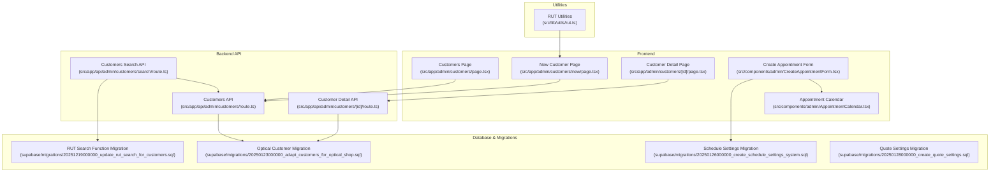
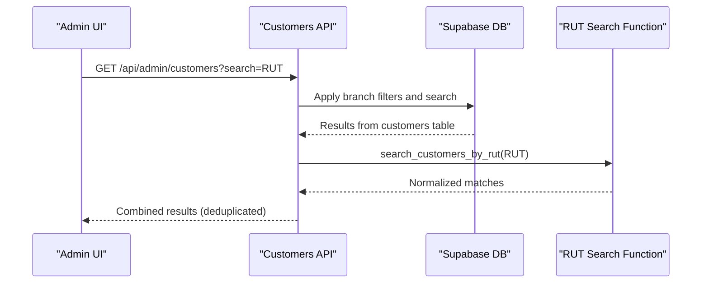
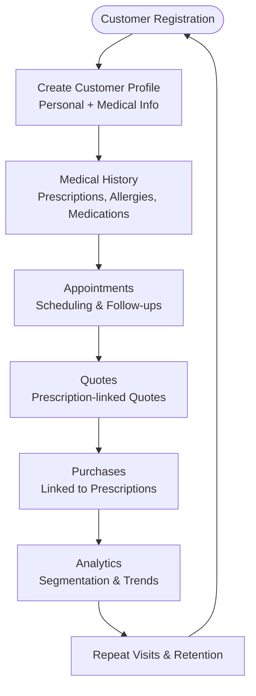
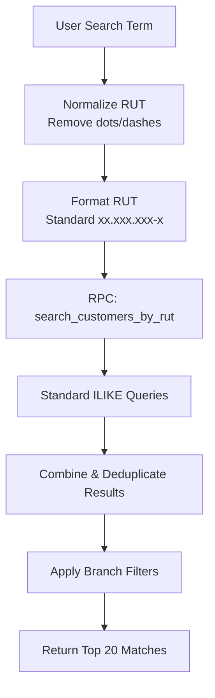
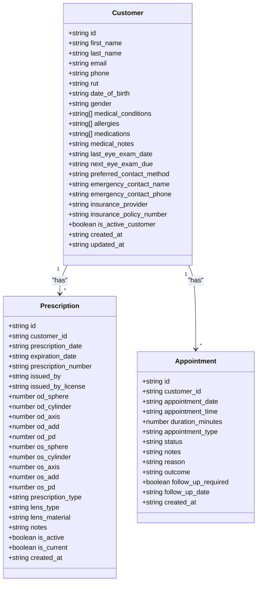
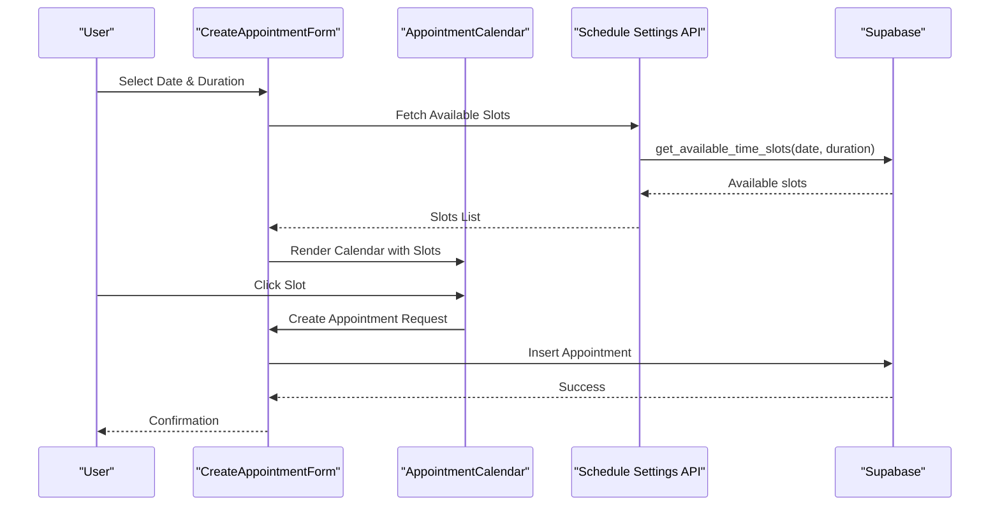
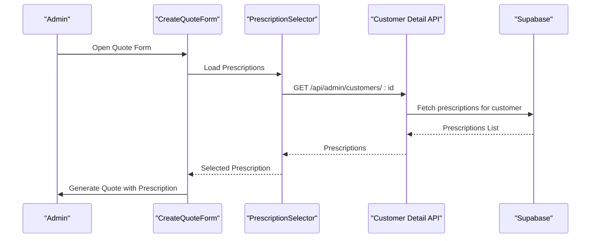
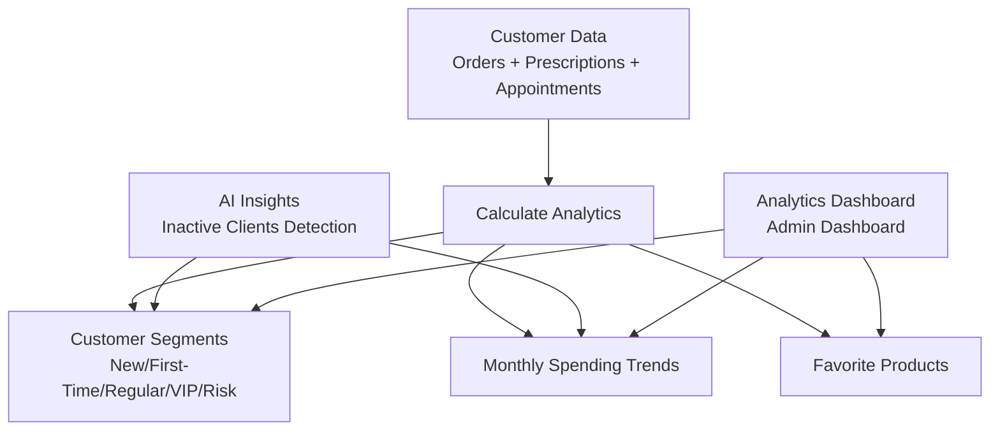
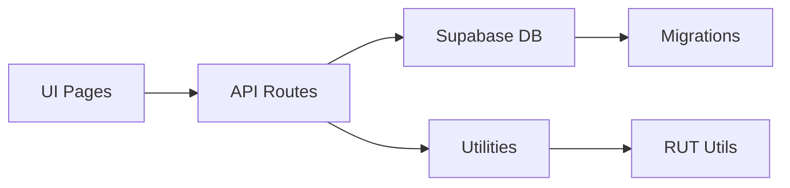

# Customer Management System

<cite>
**Referenced Files in This Document**
- [Customers Page](file://src/app/admin/customers/page.tsx)
- [New Customer Page](file://src/app/admin/customers/new/page.tsx)
- [Customer Detail Page](file://src/app/admin/customers/[id]/page.tsx)
- [Customers API Route](file://src/app/api/admin/customers/route.ts)
- [Customer Detail API Route](file://src/app/api/admin/customers/[id]/route.ts)
- [Customers Search API Route](file://src/app/api/admin/customers/search/route.ts)
- [RUT Utilities](file://src/lib/utils/rut.ts)
- [Schedule Settings Migration](file://supabase/migrations/20250126000000_create_schedule_settings_system.sql)
- [Optical Customer Migration](file://supabase/migrations/20250123000000_adapt_customers_for_optical_shop.sql)
- [RUT Search Function Migration](file://supabase/migrations/20251219000000_update_rut_search_for_customers.sql)
- [Quote Settings Migration](file://supabase/migrations/20250128000000_create_quote_settings.sql)
- [Create Appointment Form](file://src/components/admin/CreateAppointmentForm.tsx)
- [Appointment Calendar](file://src/components/admin/AppointmentCalendar.tsx)
- [Create Work Order Form - Prescription Selector](file://src/components/admin/CreateWorkOrderForm/PrescriptionSelector.tsx)
- [Create Quote Form - Prescription Selector](file://src/components/admin/CreateQuoteForm.tsx)
- [AI Insights Prepare Data](file://src/app/api/ai/insights/prepare-data/route.ts)
- [Admin Dashboard](file://src/app/api/admin/dashboard/route.ts)
</cite>

## Table of Contents

1. [Introduction](#introduction)
2. [Project Structure](#project-structure)
3. [Core Components](#core-components)
4. [Architecture Overview](#architecture-overview)
5. [Detailed Component Analysis](#detailed-component-analysis)
6. [Dependency Analysis](#dependency-analysis)
7. [Performance Considerations](#performance-considerations)
8. [Troubleshooting Guide](#troubleshooting-guide)
9. [Conclusion](#conclusion)

## Introduction

This document describes the comprehensive customer management system designed for an optical shop environment. It focuses on complete customer profiles, medical history tracking, and appointment management. The system integrates intelligent search functionality supporting RUT formatting, partial matches, and guest customer handling. It documents the customer lifecycle from registration to purchase history, including medical record integration and prescription tracking. Practical examples illustrate customer onboarding, medical history management, and customer service workflows. Data privacy considerations, medical record security, and customer communication features are addressed throughout.

## Project Structure

The customer management system spans frontend Next.js pages, backend API routes, Supabase database migrations, and shared utilities. Key areas include:

- Customer listing and creation interfaces
- Customer detail view with analytics
- Intelligent search with RUT normalization
- Medical history and prescriptions
- Appointments and scheduling
- Quote and purchase history
- Security and privacy controls

**Diagram sources**

- [Customers Page](file://src/app/admin/customers/page.tsx#L1-L516)
- [New Customer Page](file://src/app/admin/customers/new/page.tsx#L1-L353)
- [Customer Detail Page](file://src/app/admin/customers/[id]/page.tsx#L1-L800)
- [Customers API Route](file://src/app/api/admin/customers/route.ts#L1-L703)
- [Customer Detail API Route](file://src/app/api/admin/customers/[id]/route.ts#L1-L651)
- [Customers Search API Route](file://src/app/api/admin/customers/search/route.ts#L103-L347)
- [Optical Customer Migration](file://supabase/migrations/20250123000000_adapt_customers_for_optical_shop.sql#L1-L455)
- [Schedule Settings Migration](file://supabase/migrations/20250126000000_create_schedule_settings_system.sql#L1-L306)
- [RUT Search Function Migration](file://supabase/migrations/20251219000000_update_rut_search_for_customers.sql#L1-L37)
- [Quote Settings Migration](file://supabase/migrations/20250128000000_create_quote_settings.sql#L1-L153)
- [RUT Utilities](file://src/lib/utils/rut.ts#L1-L65)

**Section sources**

- [Customers Page](file://src/app/admin/customers/page.tsx#L1-L516)
- [New Customer Page](file://src/app/admin/customers/new/page.tsx#L1-L353)
- [Customer Detail Page](file://src/app/admin/customers/[id]/page.tsx#L1-L800)
- [Customers API Route](file://src/app/api/admin/customers/route.ts#L1-L703)
- [Customer Detail API Route](file://src/app/api/admin/customers/[id]/route.ts#L1-L651)
- [Customers Search API Route](file://src/app/api/admin/customers/search/route.ts#L103-L347)
- [RUT Utilities](file://src/lib/utils/rut.ts#L1-L65)
- [Optical Customer Migration](file://supabase/migrations/20250123000000_adapt_customers_for_optical_shop.sql#L1-L455)
- [Schedule Settings Migration](file://supabase/migrations/20250126000000_create_schedule_settings_system.sql#L1-L306)
- [RUT Search Function Migration](file://supabase/migrations/20251219000000_update_rut_search_for_customers.sql#L1-L37)
- [Quote Settings Migration](file://supabase/migrations/20250128000000_create_quote_settings.sql#L1-L153)

## Core Components

- Customer Profile Management: Creation, editing, and viewing customer profiles with personal, address, and medical information.
- Medical History Tracking: Prescriptions, eye exam dates, allergies, medications, and emergency contacts.
- Appointment Management: Scheduling, calendar integration, availability checking, and follow-up tracking.
- Intelligent Search: RUT normalization and partial matching across multiple formats.
- Quote and Purchase History: Integration with quote settings and purchase records linked to prescriptions.
- Analytics and Insights: Customer segmentation, purchase analytics, and activity trends.

**Section sources**

- [Customers API Route](file://src/app/api/admin/customers/route.ts#L225-L223)
- [Customer Detail API Route](file://src/app/api/admin/customers/[id]/route.ts#L116-L222)
- [Customers Search API Route](file://src/app/api/admin/customers/search/route.ts#L103-L206)
- [Optical Customer Migration](file://supabase/migrations/20250123000000_adapt_customers_for_optical_shop.sql#L38-L197)

## Architecture Overview

The system follows a layered architecture:

- Frontend: Next.js pages and components for customer management, appointments, and analytics.
- Backend: API routes handling authentication, authorization, branch filtering, and data retrieval.
- Database: Supabase with migrations defining customer, prescription, appointment, and purchase schemas.
- Utilities: Shared RUT formatting and validation utilities.

**Diagram sources**

- [Customers Search API Route](file://src/app/api/admin/customers/search/route.ts#L103-L206)
- [RUT Search Function Migration](file://supabase/migrations/20251219000000_update_rut_search_for_customers.sql#L10-L34)

**Section sources**

- [Customers Search API Route](file://src/app/api/admin/customers/search/route.ts#L103-L206)
- [RUT Search Function Migration](file://supabase/migrations/20251219000000_update_rut_search_for_customers.sql#L10-L34)

## Detailed Component Analysis

### Customer Lifecycle Management

The customer lifecycle spans registration, profile maintenance, medical record integration, appointment scheduling, quote generation, and purchase history tracking.

**Section sources**

- [New Customer Page](file://src/app/admin/customers/new/page.tsx#L31-L133)
- [Customers API Route](file://src/app/api/admin/customers/route.ts#L312-L595)
- [Customer Detail Page](file://src/app/admin/customers/[id]/page.tsx#L766-L979)
- [Customer Detail API Route](file://src/app/api/admin/customers/[id]/route.ts#L116-L222)

### Intelligent Search Functionality

The search system supports RUT formatting, normalization, and partial matching across multiple formats. It combines RPC function results with standard queries and deduplicates results.

**Diagram sources**

- [Customers Search API Route](file://src/app/api/admin/customers/search/route.ts#L103-L206)
- [RUT Utilities](file://src/lib/utils/rut.ts#L47-L64)
- [RUT Search Function Migration](file://supabase/migrations/20251219000000_update_rut_search_for_customers.sql#L10-L34)

**Section sources**

- [Customers Search API Route](file://src/app/api/admin/customers/search/route.ts#L103-L206)
- [RUT Utilities](file://src/lib/utils/rut.ts#L17-L64)
- [RUT Search Function Migration](file://supabase/migrations/20251219000000_update_rut_search_for_customers.sql#L10-L34)

### Customer Profile Structure

Customer profiles include personal information, medical data, contact preferences, and administrative fields. The schema extends the profiles table with optical-specific fields.

**Diagram sources**

- [Optical Customer Migration](file://supabase/migrations/20250123000000_adapt_customers_for_optical_shop.sql#L38-L145)
- [Customer Detail Page](file://src/app/admin/customers/[id]/page.tsx#L92-L223)

**Section sources**

- [Optical Customer Migration](file://supabase/migrations/20250123000000_adapt_customers_for_optical_shop.sql#L38-L145)
- [Customer Detail Page](file://src/app/admin/customers/[id]/page.tsx#L92-L223)

### Appointment Management and Calendar Integration

The system provides a configurable scheduling system with 15-minute slots, working hours, and availability checks. The calendar component integrates with schedule settings and appointment forms.

**Diagram sources**

- [Create Appointment Form](file://src/components/admin/CreateAppointmentForm.tsx#L227-L264)
- [Schedule Settings Migration](file://supabase/migrations/20250126000000_create_schedule_settings_system.sql#L1-L306)
- [Appointment Calendar](file://src/components/admin/AppointmentCalendar.tsx#L49-L97)

**Section sources**

- [Create Appointment Form](file://src/components/admin/CreateAppointmentForm.tsx#L227-L264)
- [Schedule Settings Migration](file://supabase/migrations/20250126000000_create_schedule_settings_system.sql#L1-L306)
- [Appointment Calendar](file://src/components/admin/AppointmentCalendar.tsx#L49-L97)

### Prescription and Quote Integration

Prescriptions are linked to quotes and work orders, enabling seamless transitions from quote to purchase. The system supports selecting current prescriptions during quote and work order creation.

**Diagram sources**

- [Create Quote Form - Prescription Selector](file://src/components/admin/CreateQuoteForm.tsx#L1610-L1645)
- [Create Work Order Form - Prescription Selector](file://src/components/admin/CreateWorkOrderForm/PrescriptionSelector.tsx#L84-L161)
- [Customer Detail API Route](file://src/app/api/admin/customers/[id]/route.ts#L155-L173)

**Section sources**

- [Create Quote Form - Prescription Selector](file://src/components/admin/CreateQuoteForm.tsx#L1610-L1645)
- [Create Work Order Form - Prescription Selector](file://src/components/admin/CreateWorkOrderForm/PrescriptionSelector.tsx#L84-L161)
- [Customer Detail API Route](file://src/app/api/admin/customers/[id]/route.ts#L155-L173)

### Analytics and Customer Insights

The system calculates customer analytics including total spent, order count, average order value, segments, and monthly spending trends. AI insights leverage appointment and customer data for inactivity detection.

**Diagram sources**

- [Customer Detail API Route](file://src/app/api/admin/customers/[id]/route.ts#L224-L317)
- [AI Insights Prepare Data](file://src/app/api/ai/insights/prepare-data/route.ts#L287-L326)
- [Admin Dashboard](file://src/app/api/admin/dashboard/route.ts#L436-L464)

**Section sources**

- [Customer Detail API Route](file://src/app/api/admin/customers/[id]/route.ts#L224-L317)
- [AI Insights Prepare Data](file://src/app/api/ai/insights/prepare-data/route.ts#L287-L326)
- [Admin Dashboard](file://src/app/api/admin/dashboard/route.ts#L436-L464)

## Dependency Analysis

The system exhibits strong separation of concerns:

- Frontend pages depend on API routes for data operations.
- API routes depend on Supabase for database access and branch filtering.
- Database migrations define schemas and constraints for data integrity.
- Utilities provide shared functionality (RUT formatting/validation).

**Diagram sources**

- [Customers API Route](file://src/app/api/admin/customers/route.ts#L1-L703)
- [Customer Detail API Route](file://src/app/api/admin/customers/[id]/route.ts#L1-L651)
- [RUT Utilities](file://src/lib/utils/rut.ts#L1-L65)
- [Optical Customer Migration](file://supabase/migrations/20250123000000_adapt_customers_for_optical_shop.sql#L1-L455)

**Section sources**

- [Customers API Route](file://src/app/api/admin/customers/route.ts#L1-L703)
- [Customer Detail API Route](file://src/app/api/admin/customers/[id]/route.ts#L1-L651)
- [RUT Utilities](file://src/lib/utils/rut.ts#L1-L65)
- [Optical Customer Migration](file://supabase/migrations/20250123000000_adapt_customers_for_optical_shop.sql#L1-L455)

## Performance Considerations

- Indexes on frequently queried fields (RUT, appointment date/time, status) improve search and filtering performance.
- Functional indexes for normalized RUT enable efficient partial matching.
- Pagination and limit clauses prevent large result sets.
- Branch filtering reduces dataset size early in queries.
- Lazy loading of heavy components minimizes initial bundle size.

[No sources needed since this section provides general guidance]

## Troubleshooting Guide

Common issues and resolutions:

- Authentication failures: Verify admin role and session validity in API routes.
- Branch access errors: Ensure branch context headers are present for multi-tenant filtering.
- RUT search inconsistencies: Confirm normalized RUT storage and function availability.
- Availability calculation errors: Validate schedule settings and timezone configurations.
- Missing orders in customer detail: Orders are linked by email; ensure consistent email usage.

**Section sources**

- [Customers API Route](file://src/app/api/admin/customers/route.ts#L55-L82)
- [Customer Detail API Route](file://src/app/api/admin/customers/[id]/route.ts#L55-L88)
- [Customers Search API Route](file://src/app/api/admin/customers/search/route.ts#L150-L157)

## Conclusion

The customer management system provides a robust foundation for optical shop operations. It integrates customer profiles, medical history, appointments, quotes, and purchases while ensuring data privacy and security. The intelligent search, analytics, and scheduling features streamline daily workflows and enhance customer service. The modular architecture supports future enhancements and maintains scalability across multiple branches and organizations.
