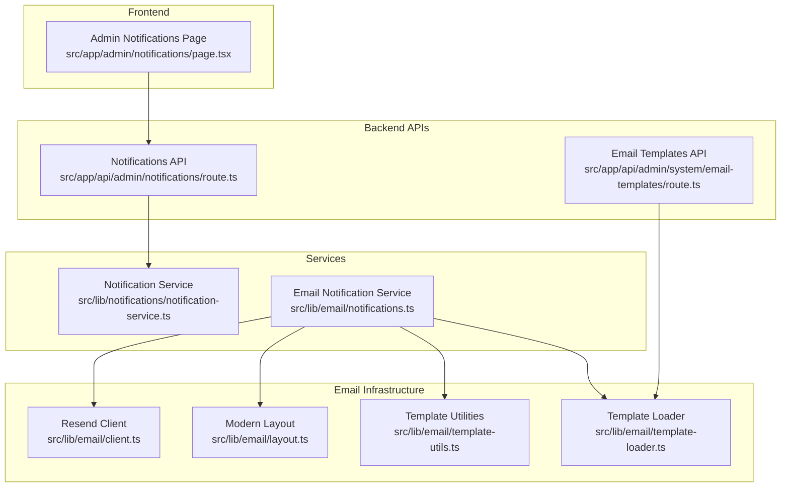
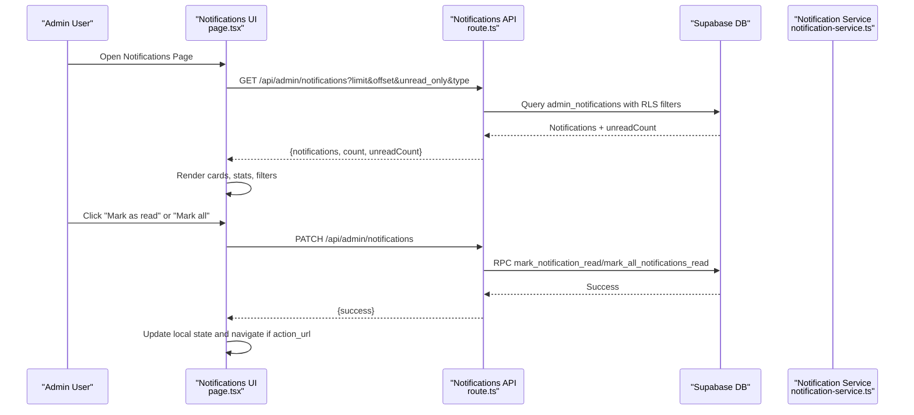
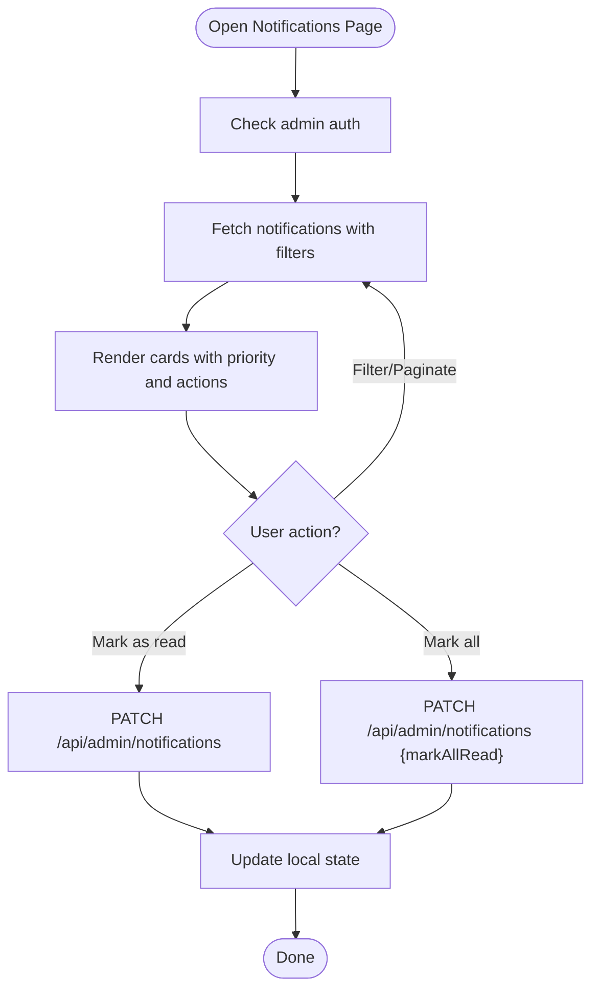
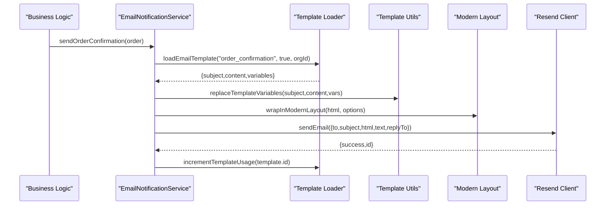
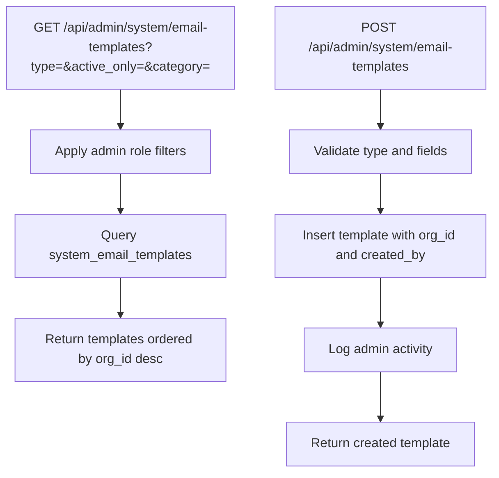
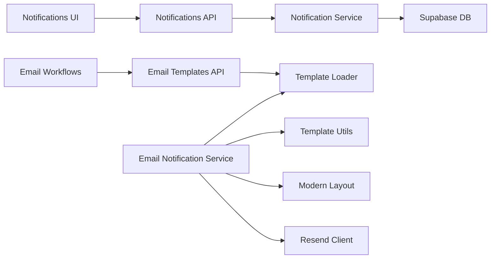

# Notification & Communication System

<cite>
**Referenced Files in This Document**
- [page.tsx](file://src/app/admin/notifications/page.tsx)
- [notification-service.ts](file://src/lib/notifications/notification-service.ts)
- [route.ts](file://src/app/api/admin/notifications/route.ts)
- [notifications.ts](file://src/lib/email/notifications.ts)
- [client.ts](file://src/lib/email/client.ts)
- [template-loader.ts](file://src/lib/email/template-loader.ts)
- [layout.ts](file://src/lib/email/layout.ts)
- [route.ts](file://src/app/api/admin/system/email-templates/route.ts)
- [template-utils.ts](file://src/lib/email/template-utils.ts)
</cite>

## Table of Contents

1. [Introduction](#introduction)
2. [Project Structure](#project-structure)
3. [Core Components](#core-components)
4. [Architecture Overview](#architecture-overview)
5. [Detailed Component Analysis](#detailed-component-analysis)
6. [Dependency Analysis](#dependency-analysis)
7. [Performance Considerations](#performance-considerations)
8. [Troubleshooting Guide](#troubleshooting-guide)
9. [Conclusion](#conclusion)

## Introduction

This document describes the notification and communication system for real-time alerts and customer messaging. It covers the notification architecture with real-time updates, email templates, and multi-channel communication capabilities. It explains notification types, priority levels, and delivery mechanisms, along with the email system featuring template management, batch sending, and delivery tracking. Practical examples demonstrate configuration, template customization, and communication workflows, including notification preferences, unsubscribe handling, and compliance requirements.

## Project Structure

The notification and communication system spans frontend UI, backend APIs, and email infrastructure:

- Admin notification center with filtering, pagination, and read/unread management
- Backend notification service supporting scoped notifications for branches and organizations
- Email notification service with dynamic template loading, variable substitution, and modern layouts
- Template management APIs enabling multi-tenant template customization
- Email transport via Resend with batch sending and usage tracking



**Diagram sources**

- [page.tsx](file://src/app/admin/notifications/page.tsx#L81-L623)
- [route.ts](file://src/app/api/admin/notifications/route.ts#L5-L166)
- [notification-service.ts](file://src/lib/notifications/notification-service.ts#L49-L531)
- [notifications.ts](file://src/lib/email/notifications.ts#L61-L800)
- [client.ts](file://src/lib/email/client.ts#L1-L113)
- [template-loader.ts](file://src/lib/email/template-loader.ts#L19-L76)
- [template-utils.ts](file://src/lib/email/template-utils.ts#L10-L46)
- [layout.ts](file://src/lib/email/layout.ts#L16-L142)
- [route.ts](file://src/app/api/admin/system/email-templates/route.ts#L6-L112)

**Section sources**

- [page.tsx](file://src/app/admin/notifications/page.tsx#L1-L623)
- [route.ts](file://src/app/api/admin/notifications/route.ts#L1-L166)
- [notification-service.ts](file://src/lib/notifications/notification-service.ts#L1-L531)
- [notifications.ts](file://src/lib/email/notifications.ts#L1-L800)
- [client.ts](file://src/lib/email/client.ts#L1-L113)
- [template-loader.ts](file://src/lib/email/template-loader.ts#L1-L116)
- [template-utils.ts](file://src/lib/email/template-utils.ts#L1-L112)
- [layout.ts](file://src/lib/email/layout.ts#L1-L142)
- [route.ts](file://src/app/api/admin/system/email-templates/route.ts#L1-L229)

## Core Components

- Admin Notifications UI: Fetches, filters, paginates, and marks notifications as read. Supports unread-only, type, and priority filters.
- Notifications API: Enforces admin authorization, applies RLS policies, and exposes endpoints to list notifications and mark as read.
- Notification Service: Creates notifications with type, priority, related entities, actions, and scoping (branch/organization/root). Integrates with settings to enable/disable and override priorities.
- Email Notification Service: Loads templates by type, replaces variables, wraps content in modern layout, sends via Resend, and tracks template usage.
- Email Transport: Resend client with test-domain safety and batch sending support.
- Template Management: Multi-tenant templates with organization-specific overrides and system defaults.

**Section sources**

- [page.tsx](file://src/app/admin/notifications/page.tsx#L81-L623)
- [route.ts](file://src/app/api/admin/notifications/route.ts#L5-L166)
- [notification-service.ts](file://src/lib/notifications/notification-service.ts#L49-L531)
- [notifications.ts](file://src/lib/email/notifications.ts#L61-L800)
- [client.ts](file://src/lib/email/client.ts#L54-L113)
- [template-loader.ts](file://src/lib/email/template-loader.ts#L19-L76)
- [route.ts](file://src/app/api/admin/system/email-templates/route.ts#L6-L112)

## Architecture Overview

The system combines real-time admin notifications with robust email communication:

- Real-time notifications: Admins receive scoped alerts with priority and action links. The UI supports filtering and pagination.
- Email communication: Templates are stored in the database, loaded dynamically, and personalized per organization. Emails are sent via Resend with modern layouts and unsubscribe preferences.



**Diagram sources**

- [page.tsx](file://src/app/admin/notifications/page.tsx#L97-L194)
- [route.ts](file://src/app/api/admin/notifications/route.ts#L5-L98)
- [notification-service.ts](file://src/lib/notifications/notification-service.ts#L128-L160)

## Detailed Component Analysis

### Admin Notifications Center

- Fetches paginated notifications with optional unread-only and type filters.
- Supports marking individual or all notifications as read via RPC.
- Displays priority badges, time-since, and action buttons with navigation.
- Sticky filters sidebar for quick refinement.



**Diagram sources**

- [page.tsx](file://src/app/admin/notifications/page.tsx#L97-L194)
- [route.ts](file://src/app/api/admin/notifications/route.ts#L101-L166)

**Section sources**

- [page.tsx](file://src/app/admin/notifications/page.tsx#L81-L623)
- [route.ts](file://src/app/api/admin/notifications/route.ts#L5-L166)

### Notification Service

- Defines notification types (orders, quotes, work orders, appointments, payments, support, system alerts).
- Determines priority from settings or defaults, with overrides.
- Scopes notifications by branch and organization, or targets root/admin roles for SaaS broadcasts.
- Creates notifications with related entities, action URLs/labels, and metadata.

```mermaid
classDiagram
class NotificationService {
+createNotification(params) Promise~{success,error}~
+notifyNewQuote(...)
+notifyQuoteStatusChange(...)
+notifyQuoteConverted(...)
+notifyNewWorkOrder(...)
+notifyWorkOrderStatusChange(...)
+notifyWorkOrderCompleted(...)
+notifyNewCustomer(...)
+notifyNewSale(...)
+notifyNewAppointment(...)
+notifySaasSupportTicketNew(...)
+notifySaasSupportTicketAssigned(...)
+notifySaasSupportNewMessage(...)
-formatCurrency(amount) string
}
```

**Diagram sources**

- [notification-service.ts](file://src/lib/notifications/notification-service.ts#L49-L531)

**Section sources**

- [notification-service.ts](file://src/lib/notifications/notification-service.ts#L3-L47)
- [notification-service.ts](file://src/lib/notifications/notification-service.ts#L53-L160)
- [notification-service.ts](file://src/lib/notifications/notification-service.ts#L165-L253)
- [notification-service.ts](file://src/lib/notifications/notification-service.ts#L258-L350)
- [notification-service.ts](file://src/lib/notifications/notification-service.ts#L355-L404)
- [notification-service.ts](file://src/lib/notifications/notification-service.ts#L409-L432)
- [notification-service.ts](file://src/lib/notifications/notification-service.ts#L437-L463)
- [notification-service.ts](file://src/lib/notifications/notification-service.ts#L468-L489)
- [notification-service.ts](file://src/lib/notifications/notification-service.ts#L494-L518)

### Email Notification Service

- Loads templates by type with organization override and system fallback.
- Replaces variables using default and computed values.
- Wraps content in a modern layout with organization branding and unsubscribe link.
- Sends via Resend with reply-to support and logs usage counts.



**Diagram sources**

- [notifications.ts](file://src/lib/email/notifications.ts#L84-L174)
- [template-loader.ts](file://src/lib/email/template-loader.ts#L19-L76)
- [template-utils.ts](file://src/lib/email/template-utils.ts#L10-L46)
- [layout.ts](file://src/lib/email/layout.ts#L16-L142)
- [client.ts](file://src/lib/email/client.ts#L54-L88)

**Section sources**

- [notifications.ts](file://src/lib/email/notifications.ts#L61-L800)
- [template-loader.ts](file://src/lib/email/template-loader.ts#L1-L116)
- [template-utils.ts](file://src/lib/email/template-utils.ts#L1-L112)
- [layout.ts](file://src/lib/email/layout.ts#L1-L142)
- [client.ts](file://src/lib/email/client.ts#L1-L113)

### Email Template Management

- Multi-tenant templates with organization-specific overrides and system defaults.
- Admins can list, filter, and create templates with validation.
- Category-based visibility for global vs organization admins.



**Diagram sources**

- [route.ts](file://src/app/api/admin/system/email-templates/route.ts#L6-L112)
- [route.ts](file://src/app/api/admin/system/email-templates/route.ts#L114-L229)

**Section sources**

- [route.ts](file://src/app/api/admin/system/email-templates/route.ts#L1-L229)
- [template-loader.ts](file://src/lib/email/template-loader.ts#L19-L76)

## Dependency Analysis

- Frontend depends on backend APIs for notifications and templates.
- Notification Service depends on Supabase for settings and notifications persistence.
- Email Notification Service depends on Template Loader, Utilities, Layout, and Resend Client.
- Template Management API depends on Supabase for multi-tenant filtering and logging.



**Diagram sources**

- [page.tsx](file://src/app/admin/notifications/page.tsx#L81-L623)
- [route.ts](file://src/app/api/admin/notifications/route.ts#L5-L166)
- [notification-service.ts](file://src/lib/notifications/notification-service.ts#L49-L531)
- [route.ts](file://src/app/api/admin/system/email-templates/route.ts#L6-L112)
- [template-loader.ts](file://src/lib/email/template-loader.ts#L19-L76)
- [notifications.ts](file://src/lib/email/notifications.ts#L61-L800)
- [client.ts](file://src/lib/email/client.ts#L54-L88)

**Section sources**

- [page.tsx](file://src/app/admin/notifications/page.tsx#L1-L623)
- [route.ts](file://src/app/api/admin/notifications/route.ts#L1-L166)
- [notification-service.ts](file://src/lib/notifications/notification-service.ts#L1-L531)
- [route.ts](file://src/app/api/admin/system/email-templates/route.ts#L1-L229)
- [template-loader.ts](file://src/lib/email/template-loader.ts#L1-L116)
- [notifications.ts](file://src/lib/email/notifications.ts#L1-L800)
- [client.ts](file://src/lib/email/client.ts#L1-L113)

## Performance Considerations

- Pagination and filtering reduce payload sizes for notifications.
- Template loading prioritizes organization-specific templates to minimize fallback queries.
- Batch sending introduces small delays to avoid rate limits; consider queueing for large volumes.
- Currency and date formatting are localized for user experience; ensure consistent locale handling.

## Troubleshooting Guide

- Unauthorized or forbidden access: Admin checks and RPC validations return 401/403; verify user session and admin role.
- Template not found: Email workflows gracefully skip sending when no active template is available; ensure templates are created and activated.
- Resend not configured: Missing API key disables email sending; configure environment variables and verify domain settings.
- Usage tracking failures: Template usage increments are best-effort; errors are logged but do not block email delivery.

**Section sources**

- [route.ts](file://src/app/api/admin/notifications/route.ts#L14-L36)
- [notifications.ts](file://src/lib/email/notifications.ts#L97-L102)
- [client.ts](file://src/lib/email/client.ts#L4-L8)
- [client.ts](file://src/lib/email/client.ts#L62-L65)

## Conclusion

The notification and communication system provides a robust foundation for real-time admin alerts and customer email messaging. It supports multi-tenant customization, flexible scoping, and scalable email workflows with modern layouts and template management. By leveraging Supabase RLS, dynamic templates, and Resend transport, the system ensures secure, compliant, and efficient customer communication while maintaining clear operational controls for administrators.
