# Payment Processing System

<cite>
**Referenced Files in This Document**
- [payment.ts](file://src/types/payment.ts)
- [route.ts](file://src/app/api/checkout/create-intent/route.ts)
- [route.ts](file://src/app/api/checkout/confirm-payment/route.ts)
- [route.ts](file://src/app/api/checkout/gateways/route.ts)
- [route.ts](file://src/app/api/webhooks/mercadopago/route.ts)
- [route.ts](file://src/app/api/webhooks/paypal/route.ts)
- [route.ts](file://src/app/api/webhooks/nowpayments/route.ts)
- [gateway.ts](file://src/lib/payments/mercadopago/gateway.ts)
- [gateway.ts](file://src/lib/payments/paypal/gateway.ts)
- [gateway.ts](file://src/lib/payments/flow/gateway.ts)
- [gateway.ts](file://src/lib/payments/nowpayments/gateway.ts)
- [payment-service.ts](file://src/lib/payments/services/payment-service.ts)
- [mercadopago.ts](file://src/lib/mercadopago.ts)
</cite>

## Table of Contents

1. [Introduction](#introduction)
2. [Project Structure](#project-structure)
3. [Core Components](#core-components)
4. [Architecture Overview](#architecture-overview)
5. [Detailed Component Analysis](#detailed-component-analysis)
6. [Dependency Analysis](#dependency-analysis)
7. [Performance Considerations](#performance-considerations)
8. [Security and Compliance](#security-and-compliance)
9. [Troubleshooting Guide](#troubleshooting-guide)
10. [Practical Setup Examples](#practical-setup-examples)
11. [Conclusion](#conclusion)

## Introduction

This document describes the payment processing system that integrates multiple payment gateways (Stripe, PayPal, Mercado Pago, and NOWPayments for cryptocurrency) within the Opttius application. It explains how payment intents are created, how webhooks are handled, and how transactions are reconciled against internal records. It also covers subscription management, recurring payments, and refund processing capabilities, along with practical configuration examples and security considerations.

## Project Structure

The payment system is organized around:

- Public checkout APIs for intent creation and confirmation
- Gateway-specific webhook handlers
- A gateway abstraction layer with per-provider implementations
- A service layer managing database operations and business logic
- Shared types and interfaces for payment and webhook events

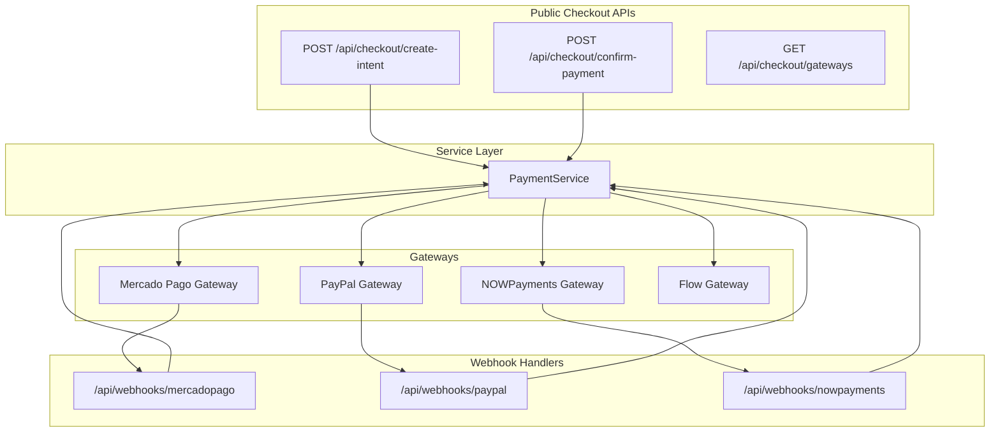

**Diagram sources**

- [route.ts](file://src/app/api/checkout/create-intent/route.ts#L34-L259)
- [route.ts](file://src/app/api/checkout/confirm-payment/route.ts#L32-L231)
- [route.ts](file://src/app/api/checkout/gateways/route.ts#L8-L25)
- [gateway.ts](file://src/lib/payments/mercadopago/gateway.ts#L69-L170)
- [gateway.ts](file://src/lib/payments/paypal/gateway.ts#L60-L144)
- [gateway.ts](file://src/lib/payments/nowpayments/gateway.ts#L58-L138)
- [gateway.ts](file://src/lib/payments/flow/gateway.ts#L47-L131)
- [route.ts](file://src/app/api/webhooks/mercadopago/route.ts#L15-L371)
- [route.ts](file://src/app/api/webhooks/paypal/route.ts#L14-L116)
- [route.ts](file://src/app/api/webhooks/nowpayments/route.ts#L18-L70)
- [payment-service.ts](file://src/lib/payments/services/payment-service.ts#L19-L493)

**Section sources**

- [route.ts](file://src/app/api/checkout/create-intent/route.ts#L34-L259)
- [route.ts](file://src/app/api/checkout/confirm-payment/route.ts#L32-L231)
- [route.ts](file://src/app/api/checkout/gateways/route.ts#L8-L25)
- [payment-service.ts](file://src/lib/payments/services/payment-service.ts#L19-L493)

## Core Components

- Payment types and interfaces define shared structures for payment records, webhook events, and gateway identifiers.
- Checkout APIs handle intent creation and confirmation flows.
- Gateway implementations encapsulate provider-specific logic for creating payment intents and processing webhooks.
- PaymentService centralizes database operations, idempotent webhook handling, order fulfillment, and organization subscription updates.

**Section sources**

- [payment.ts](file://src/types/payment.ts#L8-L48)
- [payment-service.ts](file://src/lib/payments/services/payment-service.ts#L19-L493)

## Architecture Overview

The system follows a gateway-agnostic design:

- Clients call public checkout endpoints to create payment intents.
- Gateways return approval URLs or invoice URLs depending on provider.
- Providers notify the application via webhooks.
- Webhook handlers convert provider events into normalized webhook events and reconcile them with internal payment records.
- PaymentService ensures idempotency, updates statuses, fulfills orders, and manages organization subscriptions.

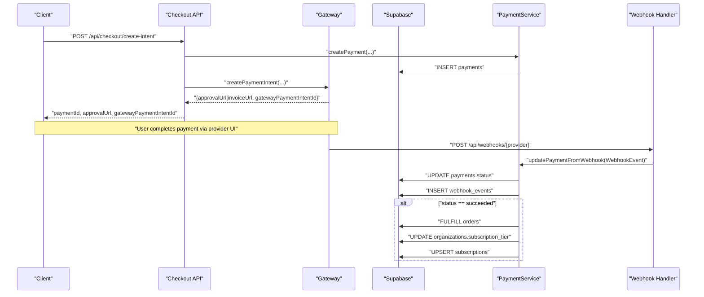

**Diagram sources**

- [route.ts](file://src/app/api/checkout/create-intent/route.ts#L170-L235)
- [gateway.ts](file://src/lib/payments/mercadopago/gateway.ts#L69-L170)
- [gateway.ts](file://src/lib/payments/nowpayments/gateway.ts#L62-L138)
- [gateway.ts](file://src/lib/payments/flow/gateway.ts#L48-L131)
- [gateway.ts](file://src/lib/payments/paypal/gateway.ts#L60-L144)
- [route.ts](file://src/app/api/webhooks/mercadopago/route.ts#L15-L371)
- [route.ts](file://src/app/api/webhooks/paypal/route.ts#L14-L116)
- [route.ts](file://src/app/api/webhooks/nowpayments/route.ts#L18-L70)
- [payment-service.ts](file://src/lib/payments/services/payment-service.ts#L115-L185)

## Detailed Component Analysis

### Payment Types and Interfaces

- Defines global enums and shapes for payment status, gateway identifiers, payment records, and webhook events.
- Ensures consistent mapping across gateways and internal systems.

**Section sources**

- [payment.ts](file://src/types/payment.ts#L8-L48)

### Checkout Intent Creation

- Validates request payload, authenticates the user, resolves organization context, normalizes currencies for specific gateways, creates a payment record, invokes the selected gateway to create a payment intent, and updates the payment record with gateway identifiers.

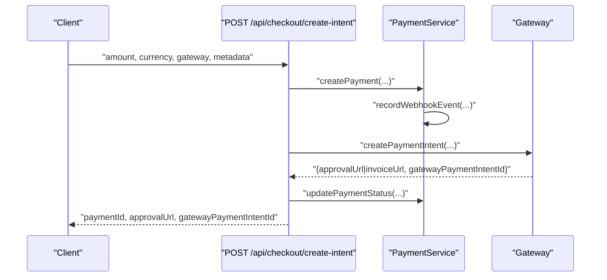

**Diagram sources**

- [route.ts](file://src/app/api/checkout/create-intent/route.ts#L34-L259)
- [payment-service.ts](file://src/lib/payments/services/payment-service.ts#L27-L94)
- [gateway.ts](file://src/lib/payments/mercadopago/gateway.ts#L69-L170)

**Section sources**

- [route.ts](file://src/app/api/checkout/create-intent/route.ts#L34-L259)

### Checkout Payment Confirmation (Mercado Pago Bricks)

- Confirms a payment using a tokenized card (Bricks), updates the payment record, applies success actions to the organization, and optionally saves the card for future recurring payments.

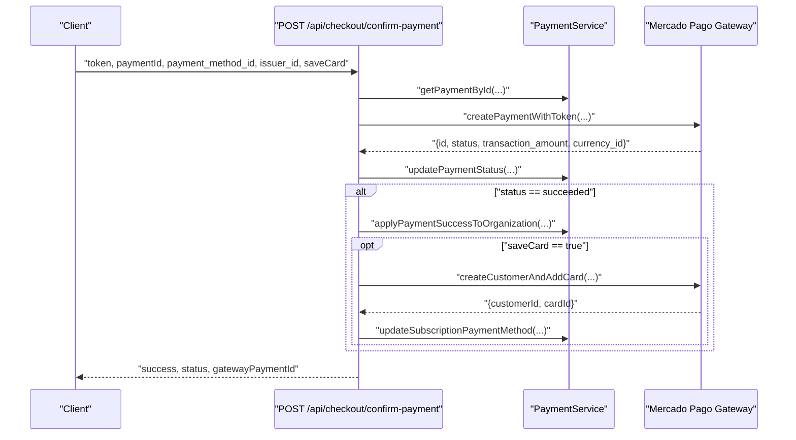

**Diagram sources**

- [route.ts](file://src/app/api/checkout/confirm-payment/route.ts#L32-L231)
- [gateway.ts](file://src/lib/payments/mercadopago/gateway.ts#L315-L401)
- [payment-service.ts](file://src/lib/payments/services/payment-service.ts#L299-L445)

**Section sources**

- [route.ts](file://src/app/api/checkout/confirm-payment/route.ts#L32-L231)
- [gateway.ts](file://src/lib/payments/mercadopago/gateway.ts#L315-L401)
- [payment-service.ts](file://src/lib/payments/services/payment-service.ts#L299-L445)

### Gateway Implementations

#### Mercado Pago

- Creates preferences and returns approval URLs.
- Processes webhooks by fetching payment or merchant order details and mapping statuses.
- Supports saving cards, creating preapproval plans, and managing subscriptions.

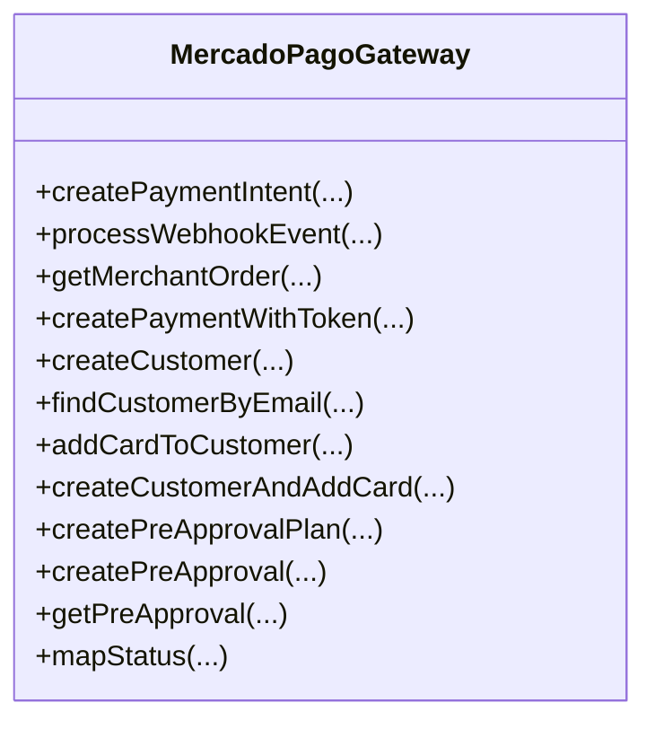

**Diagram sources**

- [gateway.ts](file://src/lib/payments/mercadopago/gateway.ts#L68-L696)

**Section sources**

- [gateway.ts](file://src/lib/payments/mercadopago/gateway.ts#L69-L170)
- [gateway.ts](file://src/lib/payments/mercadopago/gateway.ts#L172-L256)
- [gateway.ts](file://src/lib/payments/mercadopago/gateway.ts#L315-L401)
- [gateway.ts](file://src/lib/payments/mercadopago/gateway.ts#L518-L640)

#### PayPal

- Creates PayPal orders and returns approval URLs.
- Processes webhooks and maps statuses to internal status values.

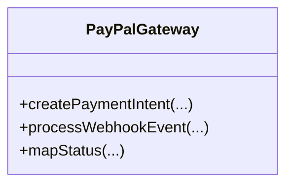

**Diagram sources**

- [gateway.ts](file://src/lib/payments/paypal/gateway.ts#L59-L234)

**Section sources**

- [gateway.ts](file://src/lib/payments/paypal/gateway.ts#L60-L144)
- [gateway.ts](file://src/lib/payments/paypal/gateway.ts#L146-L209)

#### NOWPayments (Cryptocurrency)

- Creates invoices and handles IPN callbacks with signature verification.
- Maps cryptocurrency statuses to internal status values.

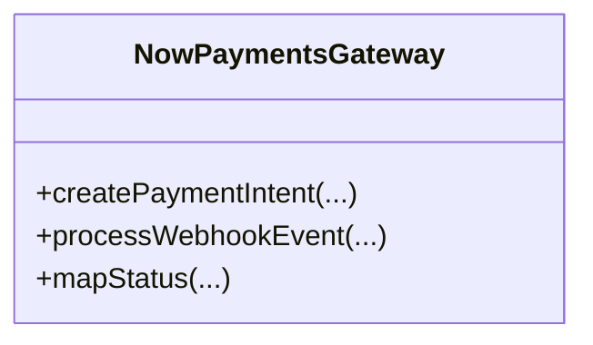

**Diagram sources**

- [gateway.ts](file://src/lib/payments/nowpayments/gateway.ts#L58-L240)

**Section sources**

- [gateway.ts](file://src/lib/payments/nowpayments/gateway.ts#L62-L138)
- [gateway.ts](file://src/lib/payments/nowpayments/gateway.ts#L143-L208)

#### Flow (Chilean Payment)

- Generates HMAC signatures and interacts with Flow’s endpoints to create payment orders and process callbacks.

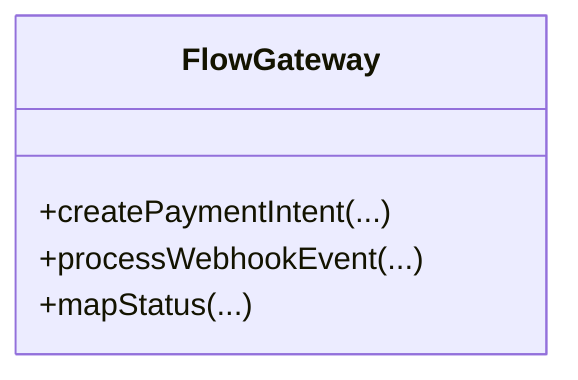

**Diagram sources**

- [gateway.ts](file://src/lib/payments/flow/gateway.ts#L47-L227)

**Section sources**

- [gateway.ts](file://src/lib/payments/flow/gateway.ts#L48-L131)
- [gateway.ts](file://src/lib/payments/flow/gateway.ts#L133-L198)

### Webhook Handling

- Each provider exposes a dedicated webhook endpoint that validates signatures (where applicable), parses events, records idempotency, updates payment statuses, and triggers downstream actions (order fulfillment, subscription updates).

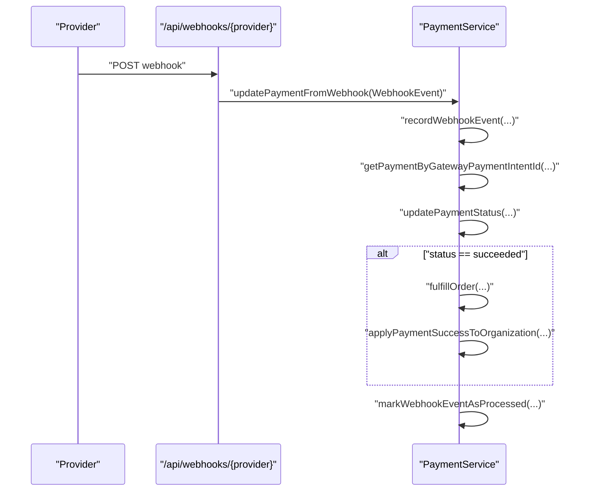

**Diagram sources**

- [route.ts](file://src/app/api/webhooks/mercadopago/route.ts#L15-L371)
- [route.ts](file://src/app/api/webhooks/paypal/route.ts#L14-L116)
- [route.ts](file://src/app/api/webhooks/nowpayments/route.ts#L18-L70)
- [payment-service.ts](file://src/lib/payments/services/payment-service.ts#L115-L185)

**Section sources**

- [route.ts](file://src/app/api/webhooks/mercadopago/route.ts#L15-L371)
- [route.ts](file://src/app/api/webhooks/paypal/route.ts#L14-L116)
- [route.ts](file://src/app/api/webhooks/nowpayments/route.ts#L18-L70)
- [payment-service.ts](file://src/lib/payments/services/payment-service.ts#L115-L185)

### Subscription Management and Recurring Payments

- Organization subscription tier is updated upon successful payment.
- Existing trials or previous subscriptions are converted to active subscriptions with proper period dates.
- Saved payment methods (Phase C) can be stored and associated with the subscription.

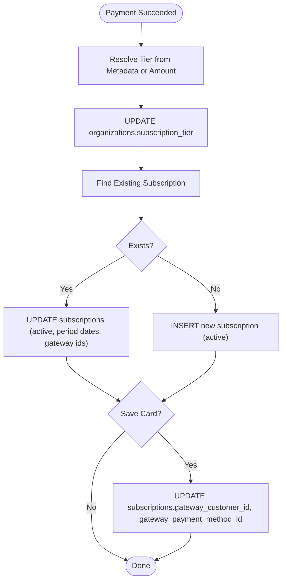

**Diagram sources**

- [payment-service.ts](file://src/lib/payments/services/payment-service.ts#L299-L445)

**Section sources**

- [payment-service.ts](file://src/lib/payments/services/payment-service.ts#L299-L445)

### Refund Processing

- Refunds are supported through gateway-specific mechanisms:
  - Mercado Pago: Uses payment refund APIs to issue refunds.
  - PayPal: Refunds are handled via PayPal’s refund endpoints.
  - NOWPayments: Refund status mapping aligns with internal refund status.
  - Flow: Refund handling depends on provider capabilities.

Note: The current codebase focuses on payment capture and webhook reconciliation. Specific refund initiation flows are not present in the referenced files and would require extending gateway implementations accordingly.

**Section sources**

- [gateway.ts](file://src/lib/payments/mercadopago/gateway.ts#L315-L401)
- [gateway.ts](file://src/lib/payments/paypal/gateway.ts#L60-L144)
- [gateway.ts](file://src/lib/payments/nowpayments/gateway.ts#L213-L238)
- [gateway.ts](file://src/lib/payments/flow/gateway.ts#L200-L225)

## Dependency Analysis

- Checkout APIs depend on PaymentService and the PaymentGatewayFactory to resolve the appropriate gateway implementation.
- Gateway implementations depend on provider SDKs or HTTP clients and environment variables for credentials.
- Webhook handlers depend on PaymentService for idempotent reconciliation and downstream actions.
- PaymentService depends on Supabase for database operations and email notifications for success events.

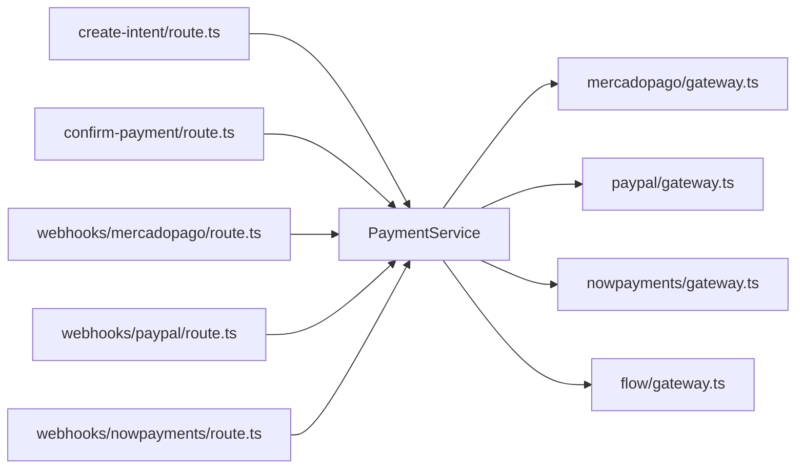

**Diagram sources**

- [route.ts](file://src/app/api/checkout/create-intent/route.ts#L133-L138)
- [route.ts](file://src/app/api/checkout/confirm-payment/route.ts#L119-L125)
- [gateway.ts](file://src/lib/payments/mercadopago/gateway.ts#L68-L696)
- [gateway.ts](file://src/lib/payments/paypal/gateway.ts#L59-L234)
- [gateway.ts](file://src/lib/payments/nowpayments/gateway.ts#L58-L240)
- [gateway.ts](file://src/lib/payments/flow/gateway.ts#L47-L227)
- [route.ts](file://src/app/api/webhooks/mercadopago/route.ts#L15-L371)
- [route.ts](file://src/app/api/webhooks/paypal/route.ts#L14-L116)
- [route.ts](file://src/app/api/webhooks/nowpayments/route.ts#L18-L70)
- [payment-service.ts](file://src/lib/payments/services/payment-service.ts#L19-L493)

**Section sources**

- [route.ts](file://src/app/api/checkout/create-intent/route.ts#L133-L138)
- [route.ts](file://src/app/api/checkout/confirm-payment/route.ts#L119-L125)
- [payment-service.ts](file://src/lib/payments/services/payment-service.ts#L19-L493)

## Performance Considerations

- Idempotency: Webhook events are recorded and marked processed to avoid duplicate updates.
- Database operations: Batched updates and single-row selects minimize overhead.
- Currency normalization: NOWPayments conversion reduces provider-specific constraints.
- Logging: Structured logs enable quick diagnosis of failures without exposing sensitive data.

[No sources needed since this section provides general guidance]

## Security and Compliance

- Signature verification:
  - Mercado Pago: Validates webhook signatures using provided headers.
  - NOWPayments: Verifies IPN signatures using a shared secret.
  - PayPal: Signature verification is recommended for production environments.
- Environment isolation: Sandbox mode flags and separate credentials for development and production.
- Least privilege: Service role clients are used for backend operations.
- Data protection: Payment metadata and webhook payloads are logged with redacted headers.

**Section sources**

- [route.ts](file://src/app/api/webhooks/mercadopago/route.ts#L233-L245)
- [gateway.ts](file://src/lib/payments/nowpayments/gateway.ts#L143-L208)
- [gateway.ts](file://src/lib/payments/paypal/gateway.ts#L146-L209)

## Troubleshooting Guide

Common issues and resolutions:

- Missing or invalid gateway credentials: Ensure environment variables are set for the selected gateway and mode (sandbox/production).
- Webhook signature validation failures: Confirm signature secrets and headers are configured correctly.
- Payment not found by intent ID: Verify gateway identifiers are persisted and match during reconciliation.
- Duplicate webhook processing: Idempotency prevents duplicate updates; check webhook_events records.
- Order fulfillment not triggered: Confirm payment succeeded and order exists; verify downstream logic.

**Section sources**

- [route.ts](file://src/app/api/webhooks/mercadopago/route.ts#L301-L314)
- [payment-service.ts](file://src/lib/payments/services/payment-service.ts#L115-L185)

## Practical Setup Examples

### Enable a Gateway in Checkout

- Retrieve enabled gateways from the configuration table and render them in the checkout UI.

**Section sources**

- [route.ts](file://src/app/api/checkout/gateways/route.ts#L8-L25)

### Create a Payment Intent

- Call the checkout intent endpoint with amount, currency, and gateway selection. The system creates a payment record and returns an approval or invoice URL.

**Section sources**

- [route.ts](file://src/app/api/checkout/create-intent/route.ts#L34-L259)

### Confirm a Mercado Pago Payment

- Submit a tokenized card payment with required metadata. The system captures the payment, updates the record, and applies success actions.

**Section sources**

- [route.ts](file://src/app/api/checkout/confirm-payment/route.ts#L32-L231)

### Configure Webhooks

- Set up provider webhooks pointing to the respective endpoints. Ensure signature secrets are configured for providers requiring verification.

**Section sources**

- [route.ts](file://src/app/api/webhooks/mercadopago/route.ts#L15-L371)
- [route.ts](file://src/app/api/webhooks/paypal/route.ts#L14-L116)
- [route.ts](file://src/app/api/webhooks/nowpayments/route.ts#L18-L70)

### Transaction Monitoring

- Use the webhook monitor component to observe incoming events and their processing status.

**Section sources**

- [route.ts](file://src/app/api/webhooks/mercadopago/route.ts#L15-L371)
- [route.ts](file://src/app/api/webhooks/paypal/route.ts#L14-L116)
- [route.ts](file://src/app/api/webhooks/nowpayments/route.ts#L18-L70)

## Conclusion

The payment processing system provides a robust, gateway-agnostic foundation for handling multiple payment methods, reconciling webhooks, and managing subscriptions. By leveraging idempotent webhook handling, structured logging, and modular gateway implementations, the system supports scalable and secure financial transaction management across Stripe, PayPal, Mercado Pago, and NOWPayments.
