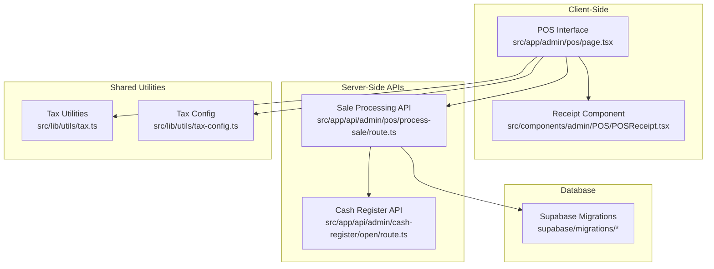
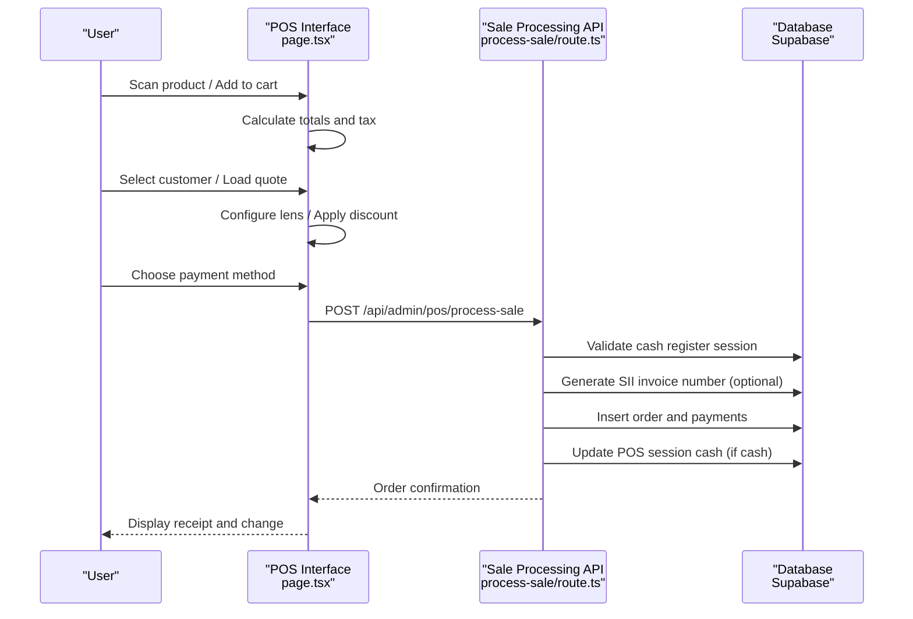
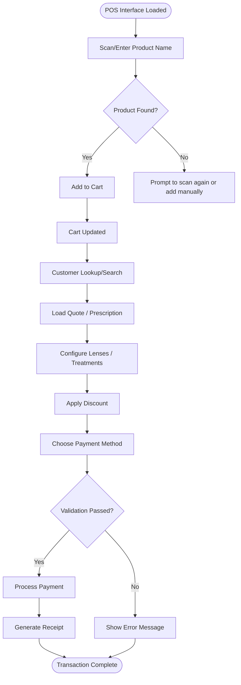
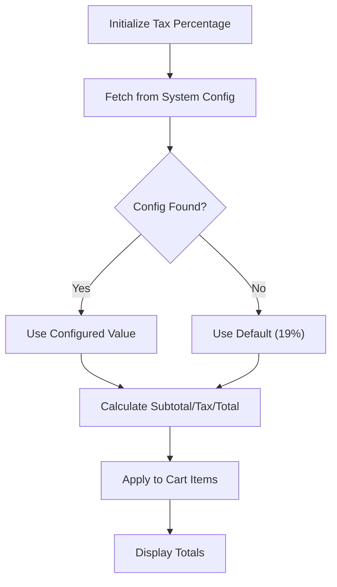
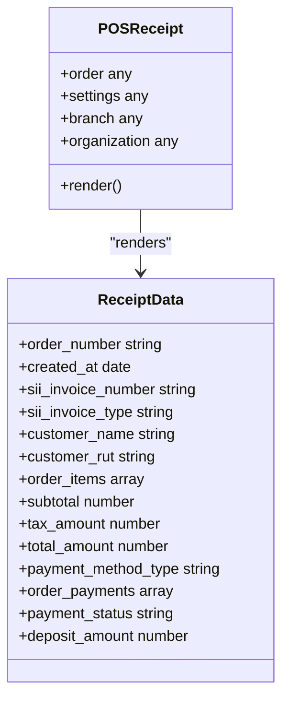
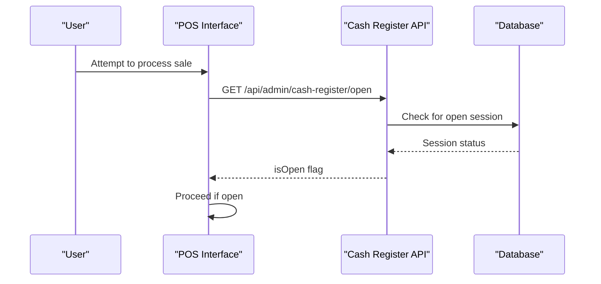
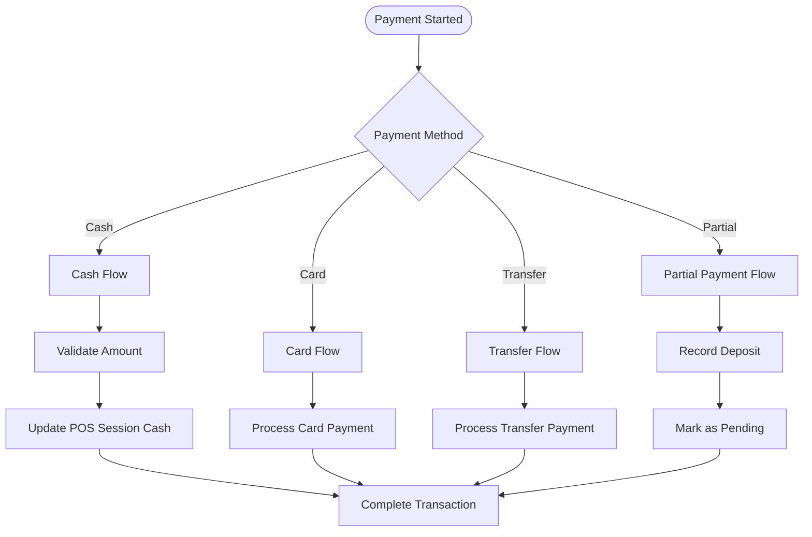
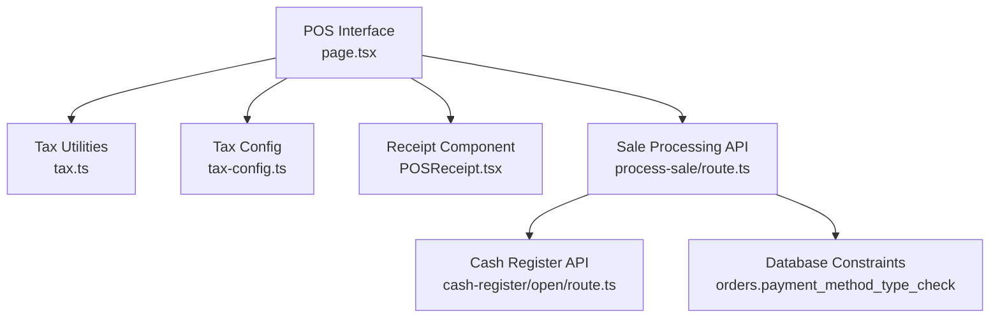

# Point of Sale (POS) System

<cite>
**Referenced Files in This Document**
- [POS Page](file://src/app/admin/pos/page.tsx)
- [POS Receipt Component](file://src/components/admin/POS/POSReceipt.tsx)
- [Tax Utilities](file://src/lib/utils/tax.ts)
- [Tax Configuration](file://src/lib/utils/tax-config.ts)
- [POS API Route](file://src/app/api/admin/pos/process-sale/route.ts)
- [Cash Register Open API](file://src/app/api/admin/cash-register/open/route.ts)
- [Supabase Migrations](file://supabase/migrations/20260127000001_update_orders_payment_method_type_for_deposit.sql)
</cite>

## Table of Contents

1. [Introduction](#introduction)
2. [Project Structure](#project-structure)
3. [Core Components](#core-components)
4. [Architecture Overview](#architecture-overview)
5. [Detailed Component Analysis](#detailed-component-analysis)
6. [Dependency Analysis](#dependency-analysis)
7. [Performance Considerations](#performance-considerations)
8. [Troubleshooting Guide](#troubleshooting-guide)
9. [Conclusion](#conclusion)

## Introduction

This document describes the Point of Sale (POS) system for integrated retail operations and payment processing. It covers product scanning, customer lookup, sales management, cash register functionality, session management, and payment method integration including cash, card, and cryptocurrency processing. It also details the checkout workflow, receipt generation, and inventory deduction processes, with practical examples and guidance for multi-payment scenarios, tax calculation, discount application, and receipt printing functionality.

## Project Structure

The POS system is implemented as a Next.js application with:

- A client-side POS interface for scanning products, managing the cart, and processing payments
- Server-side APIs for sale processing, cash register sessions, and system configuration
- Shared utilities for tax calculation and configuration
- A receipt component for printing and displaying order details

**Diagram sources**

- [POS Page](file://src/app/admin/pos/page.tsx#L148-L175)
- [POS Receipt Component](file://src/components/admin/POS/POSReceipt.tsx#L14-L31)
- [POS API Route](file://src/app/api/admin/pos/process-sale/route.ts#L126-L182)
- [Cash Register Open API](file://src/app/api/admin/cash-register/open/route.ts#L117-L149)
- [Tax Utilities](file://src/lib/utils/tax.ts#L13-L38)
- [Tax Configuration](file://src/lib/utils/tax-config.ts#L12-L45)

**Section sources**

- [POS Page](file://src/app/admin/pos/page.tsx#L148-L175)
- [POS API Route](file://src/app/api/admin/pos/process-sale/route.ts#L126-L182)
- [Cash Register Open API](file://src/app/api/admin/cash-register/open/route.ts#L117-L149)
- [Tax Utilities](file://src/lib/utils/tax.ts#L13-L38)
- [Tax Configuration](file://src/lib/utils/tax-config.ts#L12-L45)

## Core Components

- POS Interface: Manages product search, cart operations, customer lookup, quote loading, lens configuration, discounts, and payment processing.
- Tax Calculation Utilities: Provides functions to compute subtotal, tax, and total amounts considering tax-inclusive or tax-exclusive pricing.
- Tax Configuration: Retrieves the applicable tax percentage from system configuration.
- Receipt Component: Generates printable receipts with order details, totals, payments, and optional SII invoice information.
- Sale Processing API: Validates cash register status, generates SII invoice numbers when required, processes payments, and updates POS sessions.
- Cash Register API: Opens POS sessions with initial cash amounts and manages session lifecycle.

Key capabilities:

- Product scanning and cart management
- Customer search and quote loading
- Lens family selection and price calculation
- Multi-payment scenarios (cash, card, transfer, partial payments)
- Tax calculation and discount application
- Receipt generation and printing
- Session management and inventory deduction

**Section sources**

- [POS Page](file://src/app/admin/pos/page.tsx#L91-L146)
- [Tax Utilities](file://src/lib/utils/tax.ts#L46-L94)
- [Tax Configuration](file://src/lib/utils/tax-config.ts#L12-L45)
- [POS Receipt Component](file://src/components/admin/POS/POSReceipt.tsx#L14-L56)
- [POS API Route](file://src/app/api/admin/pos/process-sale/route.ts#L126-L182)
- [Cash Register Open API](file://src/app/api/admin/cash-register/open/route.ts#L117-L149)

## Architecture Overview

The POS system integrates client-side UI with server-side APIs and database operations. The client handles user interactions and displays real-time totals and tax calculations. The server validates cash register sessions, processes payments, and persists order data with appropriate tax and discount logic.

**Diagram sources**

- [POS Page](file://src/app/admin/pos/page.tsx#L2375-L2399)
- [POS API Route](file://src/app/api/admin/pos/process-sale/route.ts#L126-L182)
- [POS API Route](file://src/app/api/admin/pos/process-sale/route.ts#L1310-L1322)

## Detailed Component Analysis

### POS Interface

The POS interface orchestrates product scanning, customer lookup, cart management, lens configuration, and payment processing. It maintains state for products, cart items, customer selection, payment methods, and tax calculations.

Key features:

- Product search with keyboard navigation and auto-focus
- Intelligent customer search supporting RUT and email
- Quote loading from URL parameters and quote selection
- Lens family selection with automatic price calculation
- Discount application by percentage or fixed amount
- Multi-payment handling (cash, partial cash, card, transfer)
- Receipt preview and printing

**Diagram sources**

- [POS Page](file://src/app/admin/pos/page.tsx#L833-L907)
- [POS Page](file://src/app/admin/pos/page.tsx#L1045-L1124)
- [POS Page](file://src/app/admin/pos/page.tsx#L2375-L2399)

**Section sources**

- [POS Page](file://src/app/admin/pos/page.tsx#L833-L907)
- [POS Page](file://src/app/admin/pos/page.tsx#L1045-L1124)
- [POS Page](file://src/app/admin/pos/page.tsx#L1600-L1657)
- [POS Page](file://src/app/admin/pos/page.tsx#L2375-L2399)

### Tax Calculation and Configuration

The system computes tax-inclusive and tax-exclusive totals using shared utilities and retrieves the configured tax percentage from system settings.

**Diagram sources**

- [Tax Configuration](file://src/lib/utils/tax-config.ts#L12-L45)
- [Tax Utilities](file://src/lib/utils/tax.ts#L46-L94)
- [POS Page](file://src/app/admin/pos/page.tsx#L415-L424)

**Section sources**

- [Tax Configuration](file://src/lib/utils/tax-config.ts#L12-L45)
- [Tax Utilities](file://src/lib/utils/tax.ts#L46-L94)
- [POS Page](file://src/app/admin/pos/page.tsx#L415-L424)

### Receipt Generation

The receipt component renders order details, customer information, items, totals, taxes, and payment methods. It supports configurable printer types and widths for thermal printers.

**Diagram sources**

- [POS Receipt Component](file://src/components/admin/POS/POSReceipt.tsx#L14-L56)
- [POS Receipt Component](file://src/components/admin/POS/POSReceipt.tsx#L104-L150)
- [POS Receipt Component](file://src/components/admin/POS/POSReceipt.tsx#L152-L190)

**Section sources**

- [POS Receipt Component](file://src/components/admin/POS/POSReceipt.tsx#L14-L56)
- [POS Receipt Component](file://src/components/admin/POS/POSReceipt.tsx#L104-L150)
- [POS Receipt Component](file://src/components/admin/POS/POSReceipt.tsx#L152-L190)

### Cash Register and Session Management

The cash register API opens POS sessions with an initial cash amount and associates them with the current cashier and branch. The POS interface periodically checks the cash register status to ensure it is open before processing sales.

**Diagram sources**

- [POS Page](file://src/app/admin/pos/page.tsx#L426-L460)
- [Cash Register Open API](file://src/app/api/admin/cash-register/open/route.ts#L117-L149)

**Section sources**

- [POS Page](file://src/app/admin/pos/page.tsx#L426-L460)
- [Cash Register Open API](file://src/app/api/admin/cash-register/open/route.ts#L117-L149)

### Payment Processing and Multi-Payment Scenarios

The POS supports multiple payment methods including cash, debit/credit cards, transfers, and partial payments. The sale processing API validates the cash register session, generates SII invoice numbers when required, and inserts order and payment records.

**Diagram sources**

- [POS Page](file://src/app/admin/pos/page.tsx#L2375-L2399)
- [POS API Route](file://src/app/api/admin/pos/process-sale/route.ts#L1310-L1322)
- [Supabase Migrations](file://supabase/migrations/20260127000001_update_orders_payment_method_type_for_deposit.sql#L8-L11)

**Section sources**

- [POS Page](file://src/app/admin/pos/page.tsx#L2375-L2399)
- [POS API Route](file://src/app/api/admin/pos/process-sale/route.ts#L1310-L1322)
- [Supabase Migrations](file://supabase/migrations/20260127000001_update_orders_payment_method_type_for_deposit.sql#L8-L11)

## Dependency Analysis

The POS system exhibits clear separation of concerns:

- Client-side state management for UI interactions
- Shared utilities for tax computation and configuration
- Server-side APIs for business logic and persistence
- Database constraints ensuring data integrity for payment methods and SII invoices

**Diagram sources**

- [POS Page](file://src/app/admin/pos/page.tsx#L148-L175)
- [Tax Utilities](file://src/lib/utils/tax.ts#L13-L38)
- [Tax Configuration](file://src/lib/utils/tax-config.ts#L12-L45)
- [POS Receipt Component](file://src/components/admin/POS/POSReceipt.tsx#L14-L31)
- [POS API Route](file://src/app/api/admin/pos/process-sale/route.ts#L126-L182)
- [Cash Register Open API](file://src/app/api/admin/cash-register/open/route.ts#L117-L149)
- [Supabase Migrations](file://supabase/migrations/20260127000001_update_orders_payment_method_type_for_deposit.sql#L8-L11)

**Section sources**

- [POS Page](file://src/app/admin/pos/page.tsx#L148-L175)
- [POS API Route](file://src/app/api/admin/pos/process-sale/route.ts#L126-L182)
- [Cash Register Open API](file://src/app/api/admin/cash-register/open/route.ts#L117-L149)
- [Supabase Migrations](file://supabase/migrations/20260127000001_update_orders_payment_method_type_for_deposit.sql#L8-L11)

## Performance Considerations

- Debounced search: Product and customer searches use debounced requests to reduce network overhead.
- Efficient cart updates: Single state updates consolidate cart modifications and discount adjustments.
- Real-time tax calculation: Tax computations are performed client-side based on item arrays to minimize server round trips.
- Receipt rendering: The receipt component is optimized for minimal DOM nodes and efficient text rendering.

[No sources needed since this section provides general guidance]

## Troubleshooting Guide

Common issues and resolutions:

- Cash register closed: Ensure the cash register is opened before processing sales. The POS interface periodically checks the cash register status.
- Payment validation errors: Verify that cash received meets or exceeds the total for cash payments, and that partial cash amounts are less than or equal to the total.
- Tax configuration missing: Confirm that the system configuration includes a valid tax percentage; the system falls back to 19% if not found.
- Receipt printing: Ensure printer settings are configured in billing settings; thermal printers require appropriate width settings.

**Section sources**

- [POS Page](file://src/app/admin/pos/page.tsx#L426-L460)
- [POS Page](file://src/app/admin/pos/page.tsx#L2375-L2399)
- [Tax Configuration](file://src/lib/utils/tax-config.ts#L12-L45)
- [POS Receipt Component](file://src/components/admin/POS/POSReceipt.tsx#L18-L31)

## Conclusion

The POS system provides a comprehensive solution for integrated retail operations, combining intuitive product scanning, customer lookup, and sales management with robust cash register and payment processing capabilities. Its modular architecture, shared tax utilities, and receipt generation component enable reliable checkout workflows, accurate tax calculations, and flexible multi-payment scenarios. The system is designed for scalability and maintainability, with clear separation between client-side UI logic and server-side business operations.
