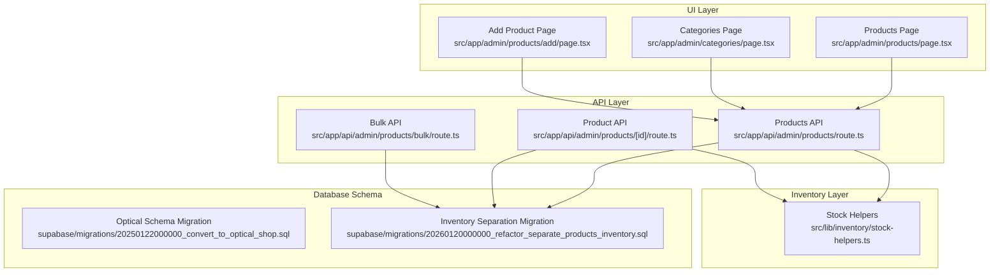
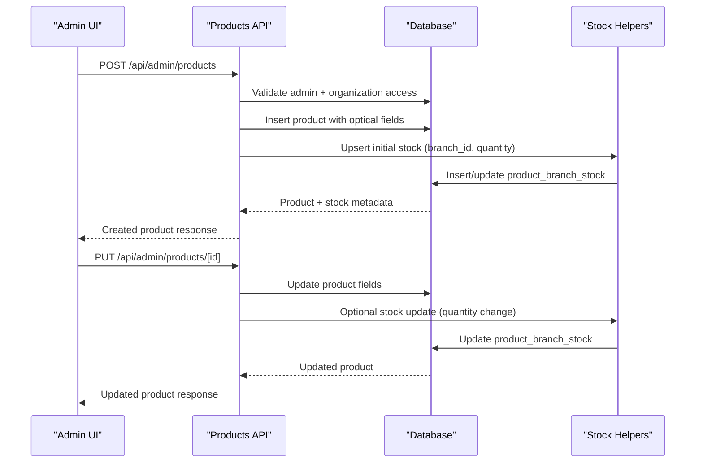
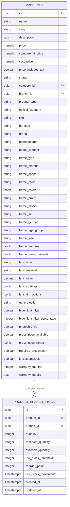
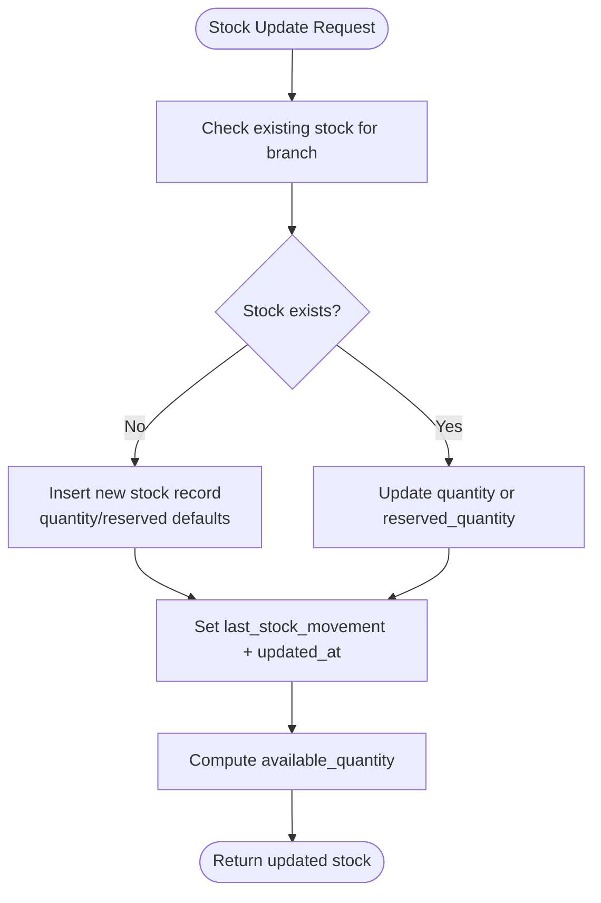
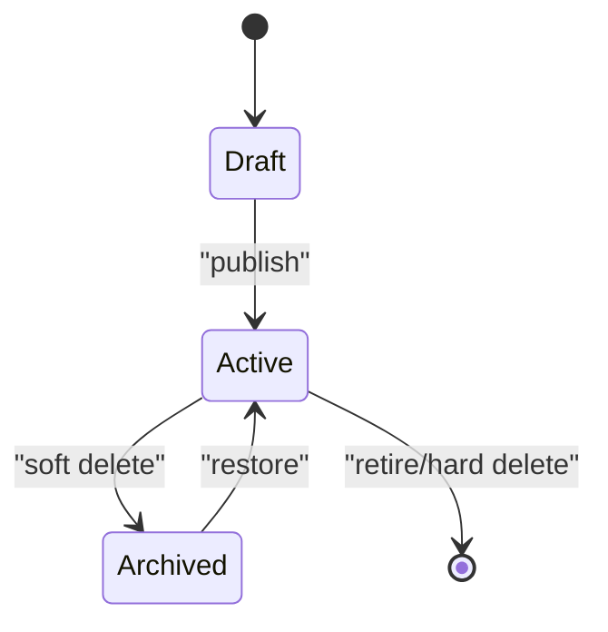
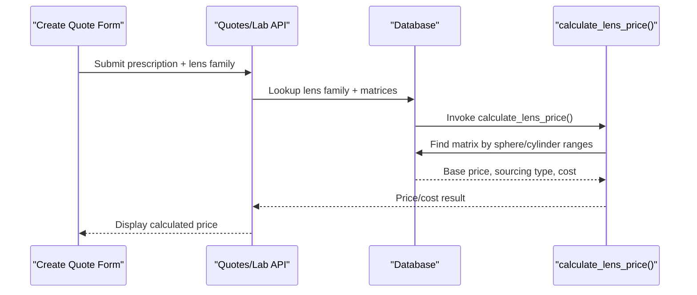
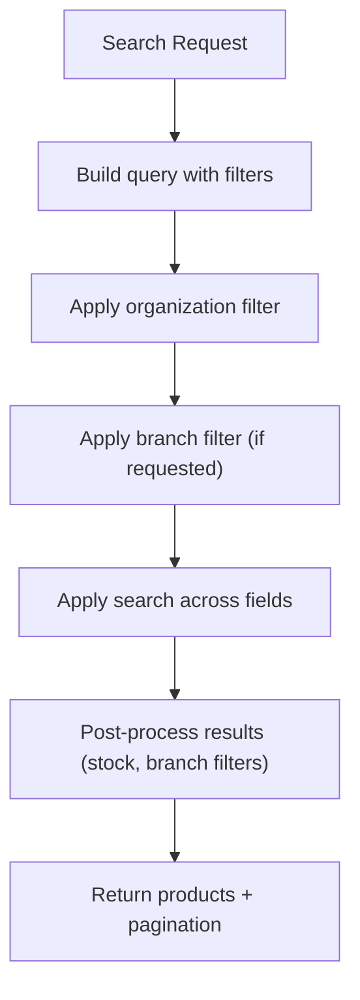
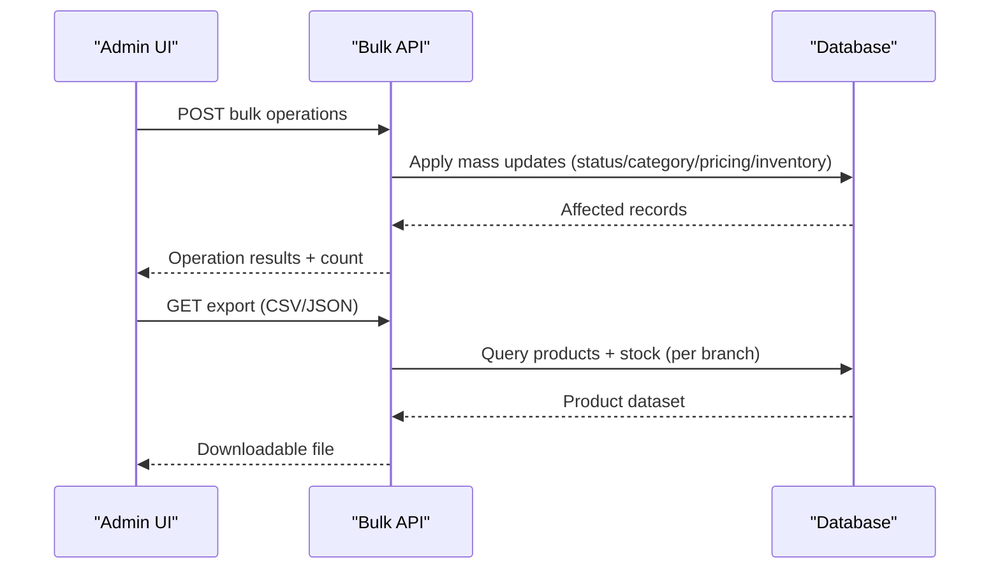
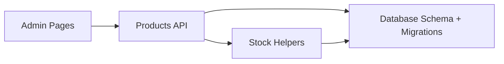

# Product Catalog Management

<cite>
**Referenced Files in This Document**
- [convert_to_optical_shop.sql](file://supabase/migrations/20250122000000_convert_to_optical_shop.sql)
- [refactor_separate_products_inventory.sql](file://supabase/migrations/20260120000000_refactor_separate_products_inventory.sql)
- [products route.ts](file://src/app/api/admin/products/route.ts)
- [products [id] route.ts](file://src/app/api/admin/products/[id]/route.ts)
- [bulk route.ts](file://src/app/api/admin/products/bulk/route.ts)
- [stock-helpers.ts](file://src/lib/inventory/stock-helpers.ts)
- [Products Page](file://src/app/admin/products/page.tsx)
- [Categories Page](file://src/app/admin/categories/page.tsx)
- [Add Product Page](file://src/app/admin/products/add/page.tsx)
- [Create Quote Form](file://src/components/admin/CreateQuoteForm.tsx)
- [LENS_FAMILIES_AND_MATRICES_SCHEMA.md](file://docs/LENS_FAMILIES_AND_MATRICES_SCHEMA.md)
- [CONTACT_LENSES_INTEGRATION_GUIDE.md](file://docs/CONTACT_LENSES_INTEGRATION_GUIDE.md)
</cite>

## Table of Contents

1. [Introduction](#introduction)
2. [Project Structure](#project-structure)
3. [Core Components](#core-components)
4. [Architecture Overview](#architecture-overview)
5. [Detailed Component Analysis](#detailed-component-analysis)
6. [Dependency Analysis](#dependency-analysis)
7. [Performance Considerations](#performance-considerations)
8. [Troubleshooting Guide](#troubleshooting-guide)
9. [Conclusion](#conclusion)

## Introduction

This document describes the optical product catalog management system within the Opttius application. It focuses on organizing optical products, tracking optical specifications, managing inventory across branches, and supporting the complete product lifecycle from creation to retirement. The system integrates product categorization, optical attributes (frame materials, lens types, treatments), pricing strategies, stock tracking, supplier management, barcode integration, bulk operations, and product search functionality.

## Project Structure

The product catalog management spans UI pages, API routes, database migrations, and inventory helpers:

- UI: Admin pages for product listing, creation, categories, and bulk operations
- API: REST endpoints for CRUD operations, bulk updates, exports, and stock management
- Database: Migrations defining optical product schema, inventory separation, and helper functions
- Inventory: Helpers for stock retrieval and updates

**Diagram sources**

- [Products Page](file://src/app/admin/products/page.tsx#L1-L800)
- [Categories Page](file://src/app/admin/categories/page.tsx#L1-L492)
- [Add Product Page](file://src/app/admin/products/add/page.tsx#L1-L800)
- [products route.ts](file://src/app/api/admin/products/route.ts#L1-L800)
- [products [id] route.ts](file://src/app/api/admin/products/[id]/route.ts#L1-L682)
- [bulk route.ts](file://src/app/api/admin/products/bulk/route.ts#L1-L683)
- [stock-helpers.ts](file://src/lib/inventory/stock-helpers.ts#L1-L247)
- [convert_to_optical_shop.sql](file://supabase/migrations/20250122000000_convert_to_optical_shop.sql#L1-L182)
- [refactor_separate_products_inventory.sql](file://supabase/migrations/20260120000000_refactor_separate_products_inventory.sql#L1-L225)

**Section sources**

- [Products Page](file://src/app/admin/products/page.tsx#L1-L800)
- [Categories Page](file://src/app/admin/categories/page.tsx#L1-L492)
- [Add Product Page](file://src/app/admin/products/add/page.tsx#L1-L800)
- [products route.ts](file://src/app/api/admin/products/route.ts#L1-L800)
- [products [id] route.ts](file://src/app/api/admin/products/[id]/route.ts#L1-L682)
- [bulk route.ts](file://src/app/api/admin/products/bulk/route.ts#L1-L683)
- [stock-helpers.ts](file://src/lib/inventory/stock-helpers.ts#L1-L247)
- [convert_to_optical_shop.sql](file://supabase/migrations/20250122000000_convert_to_optical_shop.sql#L1-L182)
- [refactor_separate_products_inventory.sql](file://supabase/migrations/20260120000000_refactor_separate_products_inventory.sql#L1-L225)

## Core Components

- Optical product schema: Defines product types, optical categories, and optical attributes (frame and lens specifications)
- Inventory separation: Dedicated branch-level stock table with reserved/available quantities and thresholds
- Product lifecycle: Creation, updates, pricing adjustments, inventory updates, archiving, and hard deletion
- Bulk operations: Mass status/category updates, pricing adjustments, inventory changes, duplication, and deletion
- Search and filtering: Multi-field search across name, description, SKU, and barcode; filters by category, stock status, and more
- Supplier and branding: Fields for brand, manufacturer, SKU, and barcode to support supplier and barcode integration

**Section sources**

- [convert_to_optical_shop.sql](file://supabase/migrations/20250122000000_convert_to_optical_shop.sql#L4-L182)
- [refactor_separate_products_inventory.sql](file://supabase/migrations/20260120000000_refactor_separate_products_inventory.sql#L9-L136)
- [products route.ts](file://src/app/api/admin/products/route.ts#L24-L539)
- [bulk route.ts](file://src/app/api/admin/products/bulk/route.ts#L46-L490)

## Architecture Overview

The system separates product catalog from inventory, enabling branch-specific stock management. The API validates permissions, enforces multi-tenancy, and delegates stock operations to helper functions and stored procedures.

**Diagram sources**

- [products route.ts](file://src/app/api/admin/products/route.ts#L542-L800)
- [products [id] route.ts](file://src/app/api/admin/products/[id]/route.ts#L211-L595)
- [stock-helpers.ts](file://src/lib/inventory/stock-helpers.ts#L182-L246)
- [refactor_separate_products_inventory.sql](file://supabase/migrations/20260120000000_refactor_separate_products_inventory.sql#L74-L136)

## Detailed Component Analysis

### Optical Product Schema and Attributes

The optical product schema extends the generic product model with:

- Product type: frame, lens, accessory, or service
- Optical category: sunglasses, prescription_glasses, reading_glasses, safety_glasses, contact_lenses, accessories, services
- Frame specifications: type, material, shape, color(s), measurements, gender, age group, size, features
- Lens specifications: type, material, index, coatings, tint options, UV protection, blue light filter, photochromic, prescription availability, prescription range, customization options
- Additional fields: SKU, barcode, brand, manufacturer, model number, warranty, and tax inclusion flag

**Diagram sources**

- [convert_to_optical_shop.sql](file://supabase/migrations/20250122000000_convert_to_optical_shop.sql#L4-L182)
- [refactor_separate_products_inventory.sql](file://supabase/migrations/20260120000000_refactor_separate_products_inventory.sql#L9-L136)

**Section sources**

- [convert_to_optical_shop.sql](file://supabase/migrations/20250122000000_convert_to_optical_shop.sql#L4-L182)
- [Add Product Page](file://src/app/admin/products/add/page.tsx#L70-L120)

### Inventory Management and Stock Tracking

Inventory is separated into a dedicated table with branch-level tracking:

- Available quantity = quantity - reserved_quantity
- Low stock threshold and reorder point support automated alerts
- Helper functions provide stock retrieval and updates
- Stored procedures encapsulate stock updates and movement timestamps

**Diagram sources**

- [stock-helpers.ts](file://src/lib/inventory/stock-helpers.ts#L67-L171)
- [refactor_separate_products_inventory.sql](file://supabase/migrations/20260120000000_refactor_separate_products_inventory.sql#L74-L136)

**Section sources**

- [stock-helpers.ts](file://src/lib/inventory/stock-helpers.ts#L1-L247)
- [refactor_separate_products_inventory.sql](file://supabase/migrations/20260120000000_refactor_separate_products_inventory.sql#L9-L136)

### Product Lifecycle Management

The lifecycle spans creation, updates, pricing, inventory, and retirement:

- Creation: Validates branch access, generates slug, inserts product, and initializes stock
- Updates: Supports optical fields, pricing, inventory adjustments, and status changes
- Retirement: Soft delete archives products; hard delete removes records with constraints

**Diagram sources**

- [products [id] route.ts](file://src/app/api/admin/products/[id]/route.ts#L290-L420)
- [bulk route.ts](file://src/app/api/admin/products/bulk/route.ts#L290-L420)

**Section sources**

- [products route.ts](file://src/app/api/admin/products/route.ts#L542-L800)
- [products [id] route.ts](file://src/app/api/admin/products/[id]/route.ts#L211-L595)
- [bulk route.ts](file://src/app/api/admin/products/bulk/route.ts#L290-L420)

### Pricing Strategies and Lens Families

Pricing strategies leverage lens families and matrices:

- Lens families define genetic characteristics (type, material)
- Price matrices define pricing by sphere/cylinder ranges
- Automatic price calculation via stored procedure
- Integration with quotes and lab work orders

**Diagram sources**

- [Create Quote Form](file://src/components/admin/CreateQuoteForm.tsx#L2470-L2497)
- [LENS_FAMILIES_AND_MATRICES_SCHEMA.md](file://docs/LENS_FAMILIES_AND_MATRICES_SCHEMA.md#L134-L144)
- [CONTACT_LENSES_INTEGRATION_GUIDE.md](file://docs/CONTACT_LENSES_INTEGRATION_GUIDE.md#L34-L56)

**Section sources**

- [Create Quote Form](file://src/components/admin/CreateQuoteForm.tsx#L2470-L2497)
- [LENS_FAMILIES_AND_MATRICES_SCHEMA.md](file://docs/LENS_FAMILIES_AND_MATRICES_SCHEMA.md#L134-L144)
- [CONTACT_LENSES_INTEGRATION_GUIDE.md](file://docs/CONTACT_LENSES_INTEGRATION_GUIDE.md#L34-L56)

### Category Management and Search

- Categories: Create, update, delete categories with slugs and descriptions
- Search: Full-text search across name, description, SKU, and barcode; filters by category, stock, and status
- Filtering: Supports in-stock, low-stock, featured, and status toggles

**Diagram sources**

- [products route.ts](file://src/app/api/admin/products/route.ts#L24-L539)
- [Categories Page](file://src/app/admin/categories/page.tsx#L52-L220)

**Section sources**

- [Categories Page](file://src/app/admin/categories/page.tsx#L1-L492)
- [products route.ts](file://src/app/api/admin/products/route.ts#L24-L539)

### Barcode Integration and Supplier Management

- Barcode: Dedicated barcode field for scanning and inventory reconciliation
- Supplier/Brand: Fields for brand, manufacturer, SKU, and model number support supplier integration workflows
- Practical usage: Use SKU/barcode for fast lookup and cross-reference with suppliers

**Section sources**

- [convert_to_optical_shop.sql](file://supabase/migrations/20250122000000_convert_to_optical_shop.sql#L348-L354)
- [Add Product Page](file://src/app/admin/products/add/page.tsx#L72-L76)

### Bulk Operations and Export

- Bulk operations: Update status, category, pricing, inventory, duplicate, and delete/archive
- Export: CSV/JSON export of products with stock data per branch
- Import: JSON import with create/update modes

**Diagram sources**

- [bulk route.ts](file://src/app/api/admin/products/bulk/route.ts#L46-L490)
- [Products Page](file://src/app/admin/products/page.tsx#L278-L356)

**Section sources**

- [bulk route.ts](file://src/app/api/admin/products/bulk/route.ts#L1-L683)
- [Products Page](file://src/app/admin/products/page.tsx#L208-L276)

## Dependency Analysis

The system exhibits clear separation of concerns:

- UI depends on API routes for data operations
- API routes depend on database migrations for schema and helper functions for stock
- Inventory helpers encapsulate stock logic and are reused across product APIs

**Diagram sources**

- [products route.ts](file://src/app/api/admin/products/route.ts#L1-L800)
- [stock-helpers.ts](file://src/lib/inventory/stock-helpers.ts#L1-L247)
- [convert_to_optical_shop.sql](file://supabase/migrations/20250122000000_convert_to_optical_shop.sql#L1-L182)
- [refactor_separate_products_inventory.sql](file://supabase/migrations/20260120000000_refactor_separate_products_inventory.sql#L1-L225)

**Section sources**

- [products route.ts](file://src/app/api/admin/products/route.ts#L1-L800)
- [stock-helpers.ts](file://src/lib/inventory/stock-helpers.ts#L1-L247)
- [convert_to_optical_shop.sql](file://supabase/migrations/20250122000000_convert_to_optical_shop.sql#L1-L182)
- [refactor_separate_products_inventory.sql](file://supabase/migrations/20260120000000_refactor_separate_products_inventory.sql#L1-L225)

## Performance Considerations

- Indexes on optical product fields (product_type, optical_category, frame_type, frame_material, brand) improve query performance
- GIN indexes on arrays (frame_colors, lens_coatings, lens_tint_options) support efficient filtering
- Generated available_quantity reduces runtime computation overhead
- Post-processing stock filters may require separate counts for precise pagination
- Use branch-aware queries to minimize result sets and improve responsiveness

[No sources needed since this section provides general guidance]

## Troubleshooting Guide

Common issues and resolutions:

- Unauthorized access: Ensure admin role and organization/branch context are valid
- Branch selection required: Creating products requires a selected branch (except super admins)
- Slug conflicts: System appends timestamp to ensure uniqueness
- Stock updates without branch: Stock updates are skipped; select a branch first
- Hard delete constraints: Products with orders require force delete confirmation

**Section sources**

- [products route.ts](file://src/app/api/admin/products/route.ts#L682-L695)
- [products [id] route.ts](file://src/app/api/admin/products/[id]/route.ts#L538-L586)
- [bulk route.ts](file://src/app/api/admin/products/bulk/route.ts#L343-L367)

## Conclusion

The optical product catalog management system provides a robust foundation for organizing optical products, tracking optical specifications, and managing inventory across branches. Its modular architecture supports lifecycle operations, bulk management, search, and integration with pricing systems. By leveraging dedicated optical schema fields, branch-level stock tracking, and stored procedures, the system scales efficiently while maintaining strong data integrity and user experience.
