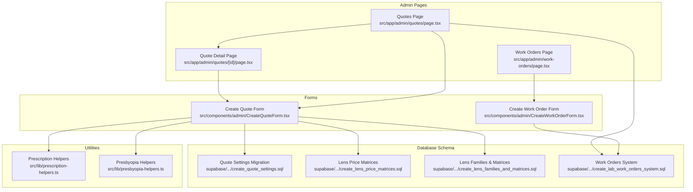
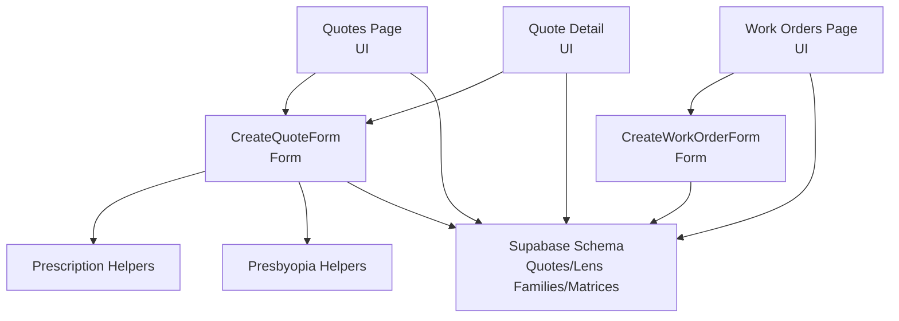
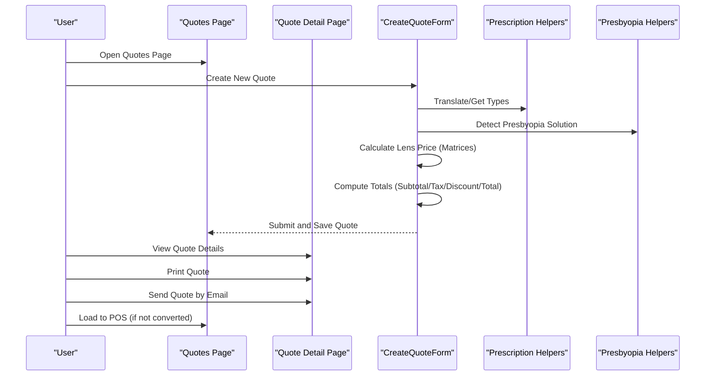
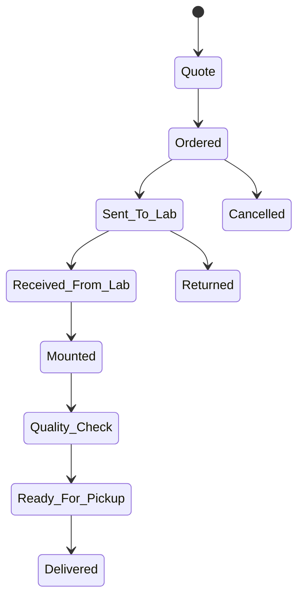
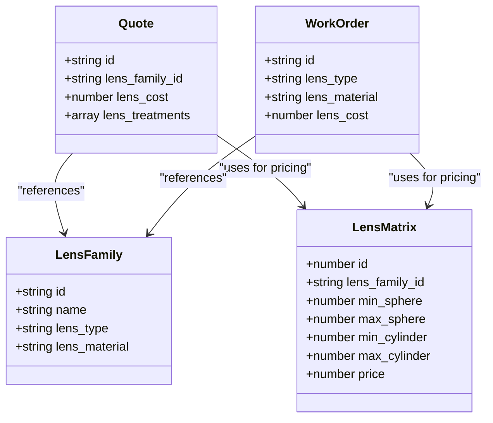
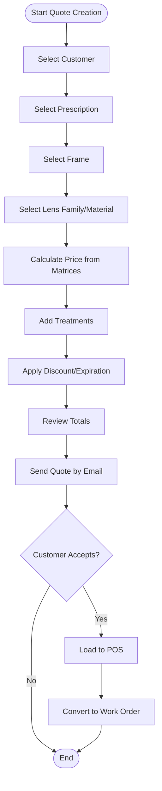
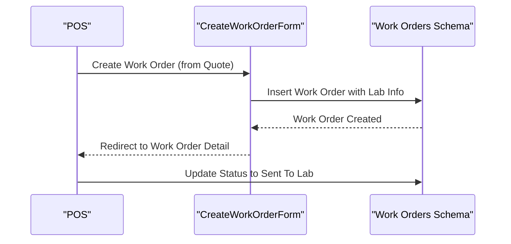
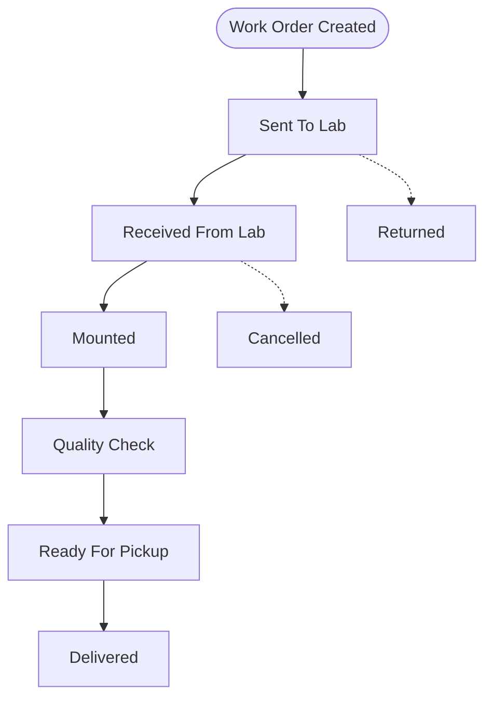
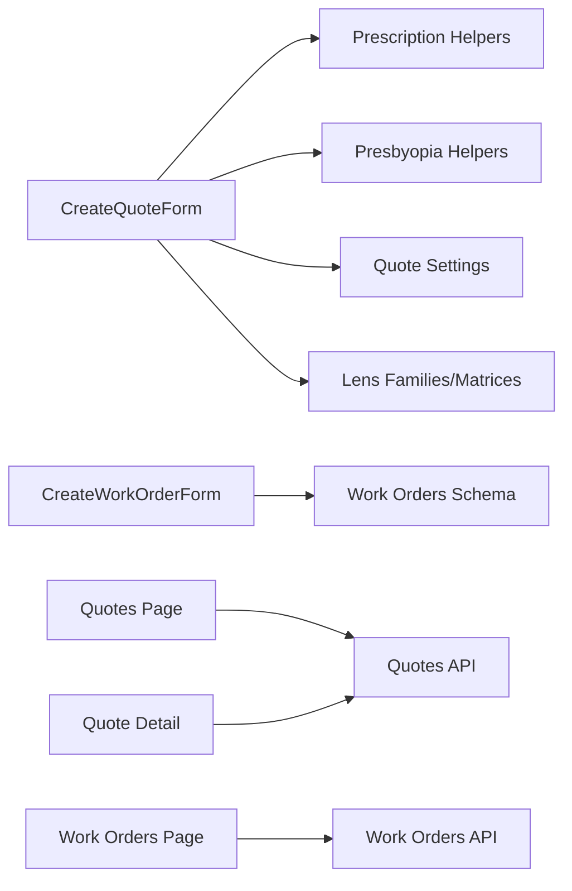

# Quote & Work Order Management

<cite>
**Referenced Files in This Document**
- [src/app/admin/quotes/page.tsx](file://src/app/admin/quotes/page.tsx)
- [src/app/admin/work-orders/page.tsx](file://src/app/admin/work-orders/page.tsx)
- [src/components/admin/CreateQuoteForm.tsx](file://src/components/admin/CreateQuoteForm.tsx)
- [src/components/admin/CreateWorkOrderForm.tsx](file://src/components/admin/CreateWorkOrderForm.tsx)
- [src/app/admin/quotes/[id]/page.tsx](file://src/app/admin/quotes/[id]/page.tsx)
- [src/lib/prescription-helpers.ts](file://src/lib/prescription-helpers.ts)
- [src/lib/presbyopia-helpers.ts](file://src/lib/presbyopia-helpers.ts)
- [supabase/migrations/20250125000000_create_lab_work_orders_system.sql](file://supabase/migrations/20250125000000_create_lab_work_orders_system.sql)
- [supabase/migrations/20250128000000_create_quote_settings.sql](file://supabase/migrations/20250128000000_create_quote_settings.sql)
- [supabase/migrations/20260121000000_create_lens_price_matrices.sql](file://supabase/migrations/20260121000000_create_lens_price_matrices.sql)
- [supabase/migrations/20260129000000_create_lens_families_and_matrices.sql](file://supabase/migrations/20260129000000_create_lens_families_and_matrices.sql)
</cite>

## Table of Contents

1. [Introduction](#introduction)
2. [Project Structure](#project-structure)
3. [Core Components](#core-components)
4. [Architecture Overview](#architecture-overview)
5. [Detailed Component Analysis](#detailed-component-analysis)
6. [Dependency Analysis](#dependency-analysis)
7. [Performance Considerations](#performance-considerations)
8. [Troubleshooting Guide](#troubleshooting-guide)
9. [Conclusion](#conclusion)

## Introduction

This document describes the quote and work order management system designed for optical prescription processing and laboratory workflow. It covers the complete lifecycle from quote creation and pricing calculation to approval and conversion into work orders, including status tracking, laboratory integration, and quality control. It also documents optical parameter management, lens selection interfaces, and practical workflows for customer communication, material tracking, and delivery coordination.

## Project Structure

The system is organized around Next.js pages and components:

- Admin pages for listing and managing quotes and work orders
- Dedicated forms for creating quotes and converting quotes to work orders
- Utility libraries for prescription and presbyopia logic
- Supabase migrations defining the underlying schema for quotes, work orders, lens families/matrices, and quote settings

**Diagram sources**

- [src/app/admin/quotes/page.tsx](file://src/app/admin/quotes/page.tsx#L97-L655)
- [src/app/admin/work-orders/page.tsx](file://src/app/admin/work-orders/page.tsx#L90-L724)
- [src/app/admin/quotes/[id]/page.tsx](file://src/app/admin/quotes/[id]/page.tsx#L113-L800)
- [src/components/admin/CreateQuoteForm.tsx](file://src/components/admin/CreateQuoteForm.tsx#L1-L800)
- [src/components/admin/CreateWorkOrderForm.tsx](file://src/components/admin/CreateWorkOrderForm.tsx#L1-L378)
- [src/lib/prescription-helpers.ts](file://src/lib/prescription-helpers.ts#L1-L38)
- [src/lib/presbyopia-helpers.ts](file://src/lib/presbyopia-helpers.ts#L1-L1703)
- [supabase/migrations/20250128000000_create_quote_settings.sql](file://supabase/migrations/20250128000000_create_quote_settings.sql)
- [supabase/migrations/20260121000000_create_lens_price_matrices.sql](file://supabase/migrations/20260121000000_create_lens_price_matrices.sql)
- [supabase/migrations/20260129000000_create_lens_families_and_matrices.sql](file://supabase/migrations/20260129000000_create_lens_families_and_matrices.sql)
- [supabase/migrations/20250125000000_create_lab_work_orders_system.sql](file://supabase/migrations/20250125000000_create_lab_work_orders_system.sql)

**Section sources**

- [src/app/admin/quotes/page.tsx](file://src/app/admin/quotes/page.tsx#L1-L655)
- [src/app/admin/work-orders/page.tsx](file://src/app/admin/work-orders/page.tsx#L1-L724)
- [src/app/admin/quotes/[id]/page.tsx](file://src/app/admin/quotes/[id]/page.tsx#L1-L800)
- [src/components/admin/CreateQuoteForm.tsx](file://src/components/admin/CreateQuoteForm.tsx#L1-L800)
- [src/components/admin/CreateWorkOrderForm.tsx](file://src/components/admin/CreateWorkOrderForm.tsx#L1-L378)
- [src/lib/prescription-helpers.ts](file://src/lib/prescription-helpers.ts#L1-L38)
- [src/lib/presbyopia-helpers.ts](file://src/lib/presbyopia-helpers.ts#L1-L1703)
- [supabase/migrations/20250128000000_create_quote_settings.sql](file://supabase/migrations/20250128000000_create_quote_settings.sql)
- [supabase/migrations/20260121000000_create_lens_price_matrices.sql](file://supabase/migrations/20260121000000_create_lens_price_matrices.sql)
- [supabase/migrations/20260129000000_create_lens_families_and_matrices.sql](file://supabase/migrations/20260129000000_create_lens_families_and_matrices.sql)
- [supabase/migrations/20250125000000_create_lab_work_orders_system.sql](file://supabase/migrations/20250125000000_create_lab_work_orders_system.sql)

## Core Components

- Quotes listing and management: filter, search, status updates, deletion, and conversion triggers
- Quote detail and communication: printing, sending via email, POS loading, and conversion to work order
- Quote creation form: customer/prescription/frame selection, lens family/material/treatments, pricing calculation, expiration handling
- Work orders listing and management: status badges, payment status editing, statistics, and deletion controls
- Work order creation form: customer/prescription/frame selection, lens configuration, lab info, pricing, status, notes
- Prescription and presbyopia helpers: translation and recommendation logic
- Database schema: quote settings, lens families/matrices, and work orders system

**Section sources**

- [src/app/admin/quotes/page.tsx](file://src/app/admin/quotes/page.tsx#L75-L655)
- [src/app/admin/quotes/[id]/page.tsx](file://src/app/admin/quotes/[id]/page.tsx#L43-L800)
- [src/components/admin/CreateQuoteForm.tsx](file://src/components/admin/CreateQuoteForm.tsx#L60-L800)
- [src/app/admin/work-orders/page.tsx](file://src/app/admin/work-orders/page.tsx#L63-L724)
- [src/components/admin/CreateWorkOrderForm.tsx](file://src/components/admin/CreateWorkOrderForm.tsx#L24-L378)
- [src/lib/prescription-helpers.ts](file://src/lib/prescription-helpers.ts#L1-L38)
- [src/lib/presbyopia-helpers.ts](file://src/lib/presbyopia-helpers.ts#L1-L1703)

## Architecture Overview

The system follows a layered architecture:

- UI Layer: Next.js pages and components for quotes, work orders, and forms
- Business Logic: Forms orchestrate data collection, calculations, and validations
- Utilities: Prescription and presbyopia helpers encapsulate domain logic
- Persistence: Supabase-backed schema with migrations defining tables and relationships
- External Integrations: POS loading, email sending, and optional payment systems

**Diagram sources**

- [src/app/admin/quotes/page.tsx](file://src/app/admin/quotes/page.tsx#L56-L70)
- [src/app/admin/quotes/[id]/page.tsx](file://src/app/admin/quotes/[id]/page.tsx#L113-L179)
- [src/components/admin/CreateQuoteForm.tsx](file://src/components/admin/CreateQuoteForm.tsx#L1-L800)
- [src/components/admin/CreateWorkOrderForm.tsx](file://src/components/admin/CreateWorkOrderForm.tsx#L1-L378)
- [src/lib/prescription-helpers.ts](file://src/lib/prescription-helpers.ts#L1-L38)
- [src/lib/presbyopia-helpers.ts](file://src/lib/presbyopia-helpers.ts#L1-L1703)
- [supabase/migrations/20250128000000_create_quote_settings.sql](file://supabase/migrations/20250128000000_create_quote_settings.sql)
- [supabase/migrations/20260121000000_create_lens_price_matrices.sql](file://supabase/migrations/20260121000000_create_lens_price_matrices.sql)
- [supabase/migrations/20260129000000_create_lens_families_and_matrices.sql](file://supabase/migrations/20260129000000_create_lens_families_and_matrices.sql)
- [supabase/migrations/20250125000000_create_lab_work_orders_system.sql](file://supabase/migrations/20250125000000_create_lab_work_orders_system.sql)

## Detailed Component Analysis

### Quote Lifecycle: Creation, Pricing, Expiration, Communication

- Creation: The CreateQuoteForm collects customer, prescription, frame, lens family/material/treatments, and calculates pricing using lens matrices and quote settings. It supports optical and contact lenses, presbyopia solutions, and manual overrides.
- Pricing Calculation: Uses lens family matrices and presbyopia helpers to compute lens costs, applies treatments, labor costs, taxes, discounts, and generates totals.
- Expiration Handling: Loads default expiration days from quote settings and displays expiration dates; expired quotes are visually highlighted.
- Customer Communication: Quote detail page enables printing and sending via email, with POS loading for quick sale conversion.

**Diagram sources**

- [src/app/admin/quotes/page.tsx](file://src/app/admin/quotes/page.tsx#L97-L204)
- [src/app/admin/quotes/[id]/page.tsx](file://src/app/admin/quotes/[id]/page.tsx#L113-L466)
- [src/components/admin/CreateQuoteForm.tsx](file://src/components/admin/CreateQuoteForm.tsx#L337-L625)
- [src/lib/prescription-helpers.ts](file://src/lib/prescription-helpers.ts#L1-L38)
- [src/lib/presbyopia-helpers.ts](file://src/lib/presbyopia-helpers.ts#L1-L1703)

**Section sources**

- [src/components/admin/CreateQuoteForm.tsx](file://src/components/admin/CreateQuoteForm.tsx#L1-L800)
- [src/app/admin/quotes/[id]/page.tsx](file://src/app/admin/quotes/[id]/page.tsx#L113-L466)
- [src/app/admin/quotes/page.tsx](file://src/app/admin/quotes/page.tsx#L75-L204)
- [src/lib/prescription-helpers.ts](file://src/lib/prescription-helpers.ts#L1-L38)
- [src/lib/presbyopia-helpers.ts](file://src/lib/presbyopia-helpers.ts#L1-L1703)

### Work Order System: Status Tracking, Laboratory Integration, Quality Control

- Status Tracking: Comprehensive statuses including quote, ordered, sent_to_lab, received_from_lab, mounted, quality_check, ready_for_pickup, delivered, cancelled, returned.
- Payment Status Editing: Inline editing of payment status (pending, partial, paid, refunded) with optimistic updates and error handling.
- Laboratory Integration: Work order form captures lab name, contact, order number, and estimated delivery date; work orders are created from POS after quote acceptance.
- Quality Control: Dedicated quality_check status and ready_for_pickup to coordinate handover and delivery.

**Diagram sources**

- [src/app/admin/work-orders/page.tsx](file://src/app/admin/work-orders/page.tsx#L157-L238)
- [src/components/admin/CreateWorkOrderForm.tsx](file://src/components/admin/CreateWorkOrderForm.tsx#L1-L378)

**Section sources**

- [src/app/admin/work-orders/page.tsx](file://src/app/admin/work-orders/page.tsx#L63-L724)
- [src/components/admin/CreateWorkOrderForm.tsx](file://src/components/admin/CreateWorkOrderForm.tsx#L1-L378)

### Optical Parameter Management and Lens Selection Interface

- Lens Families and Matrices: Lens families define materials/types; matrices provide pricing based on sphere/cylinder/addition ranges. The system supports progressive, bifocal, trifocal, and single vision configurations.
- Presbyopia Solutions: Automatic detection and recommended solutions; supports two separate lenses with distinct families and pricing.
- Treatments and Materials: Treatment options and material indices influence pricing; manual overrides available when matrices do not apply.

**Diagram sources**

- [supabase/migrations/20260129000000_create_lens_families_and_matrices.sql](file://supabase/migrations/20260129000000_create_lens_families_and_matrices.sql)
- [supabase/migrations/20260121000000_create_lens_price_matrices.sql](file://supabase/migrations/20260121000000_create_lens_price_matrices.sql)
- [src/components/admin/CreateQuoteForm.tsx](file://src/components/admin/CreateQuoteForm.tsx#L337-L625)
- [src/components/admin/CreateWorkOrderForm.tsx](file://src/components/admin/CreateWorkOrderForm.tsx#L130-L157)

**Section sources**

- [src/components/admin/CreateQuoteForm.tsx](file://src/components/admin/CreateQuoteForm.tsx#L200-L475)
- [src/lib/presbyopia-helpers.ts](file://src/lib/presbyopia-helpers.ts#L1-L1703)
- [supabase/migrations/20260129000000_create_lens_families_and_matrices.sql](file://supabase/migrations/20260129000000_create_lens_families_and_matrices.sql)
- [supabase/migrations/20260121000000_create_lens_price_matrices.sql](file://supabase/migrations/20260121000000_create_lens_price_matrices.sql)

### Practical Workflows

#### Workflow 1: Creating a Quote and Approving It

- Select customer and load their prescriptions
- Choose frame and lens family; system computes price using matrices
- Adjust treatments, discounts, and expiration days
- Review totals and send quote by email
- On customer acceptance, load to POS and convert to work order

**Diagram sources**

- [src/components/admin/CreateQuoteForm.tsx](file://src/components/admin/CreateQuoteForm.tsx#L337-L625)
- [src/app/admin/quotes/[id]/page.tsx](file://src/app/admin/quotes/[id]/page.tsx#L431-L466)
- [src/app/admin/quotes/page.tsx](file://src/app/admin/quotes/page.tsx#L530-L542)

**Section sources**

- [src/components/admin/CreateQuoteForm.tsx](file://src/components/admin/CreateQuoteForm.tsx#L1-L800)
- [src/app/admin/quotes/[id]/page.tsx](file://src/app/admin/quotes/[id]/page.tsx#L431-L466)
- [src/app/admin/quotes/page.tsx](file://src/app/admin/quotes/page.tsx#L523-L542)

#### Workflow 2: Dispatching a Work Order to the Laboratory

- From POS, create a work order linked to the accepted quote
- Enter lab details (name, contact, order number, estimated delivery)
- Confirm pricing and payment status
- Update status to sent_to_lab and track progress

**Diagram sources**

- [src/components/admin/CreateWorkOrderForm.tsx](file://src/components/admin/CreateWorkOrderForm.tsx#L173-L245)
- [supabase/migrations/20250125000000_create_lab_work_orders_system.sql](file://supabase/migrations/20250125000000_create_lab_work_orders_system.sql)

**Section sources**

- [src/components/admin/CreateWorkOrderForm.tsx](file://src/components/admin/CreateWorkOrderForm.tsx#L173-L245)
- [supabase/migrations/20250125000000_create_lab_work_orders_system.sql](file://supabase/migrations/20250125000000_create_lab_work_orders_system.sql)

#### Workflow 3: Progress Tracking and Delivery Coordination

- Monitor statuses: sent_to_lab, received_from_lab, mounted, quality_check, ready_for_pickup, delivered
- Edit payment status as payments are processed
- Coordinate delivery with estimated delivery dates and notes

**Diagram sources**

- [src/app/admin/work-orders/page.tsx](file://src/app/admin/work-orders/page.tsx#L157-L238)
- [src/components/admin/CreateWorkOrderForm.tsx](file://src/components/admin/CreateWorkOrderForm.tsx#L302-L315)

**Section sources**

- [src/app/admin/work-orders/page.tsx](file://src/app/admin/work-orders/page.tsx#L157-L238)
- [src/components/admin/CreateWorkOrderForm.tsx](file://src/components/admin/CreateWorkOrderForm.tsx#L302-L315)

## Dependency Analysis

- Forms depend on utilities for prescription and presbyopia logic
- Forms rely on quote settings and lens families/matrices for pricing
- Pages depend on backend APIs for CRUD operations and status updates
- Work order creation depends on POS-linked quote conversion

**Diagram sources**

- [src/components/admin/CreateQuoteForm.tsx](file://src/components/admin/CreateQuoteForm.tsx#L1-L800)
- [src/lib/prescription-helpers.ts](file://src/lib/prescription-helpers.ts#L1-L38)
- [src/lib/presbyopia-helpers.ts](file://src/lib/presbyopia-helpers.ts#L1-L1703)
- [supabase/migrations/20250128000000_create_quote_settings.sql](file://supabase/migrations/20250128000000_create_quote_settings.sql)
- [supabase/migrations/20260129000000_create_lens_families_and_matrices.sql](file://supabase/migrations/20260129000000_create_lens_families_and_matrices.sql)
- [src/app/admin/quotes/page.tsx](file://src/app/admin/quotes/page.tsx#L115-L152)
- [src/app/admin/work-orders/page.tsx](file://src/app/admin/work-orders/page.tsx#L119-L155)
- [src/app/admin/quotes/[id]/page.tsx](file://src/app/admin/quotes/[id]/page.tsx#L134-L179)
- [src/components/admin/CreateWorkOrderForm.tsx](file://src/components/admin/CreateWorkOrderForm.tsx#L173-L245)

**Section sources**

- [src/components/admin/CreateQuoteForm.tsx](file://src/components/admin/CreateQuoteForm.tsx#L1-L800)
- [src/components/admin/CreateWorkOrderForm.tsx](file://src/components/admin/CreateWorkOrderForm.tsx#L1-L378)
- [src/app/admin/quotes/page.tsx](file://src/app/admin/quotes/page.tsx#L115-L152)
- [src/app/admin/work-orders/page.tsx](file://src/app/admin/work-orders/page.tsx#L119-L155)
- [src/app/admin/quotes/[id]/page.tsx](file://src/app/admin/quotes/[id]/page.tsx#L134-L179)

## Performance Considerations

- Lazy loading of heavy components (e.g., CreateQuoteForm) reduces initial bundle size
- Debounced calculations for lens pricing prevent excessive API calls
- Optimistic UI updates for payment status improve responsiveness
- Pagination and filtering minimize rendering overhead for large lists

## Troubleshooting Guide

- Quote settings not applied: Verify quote settings endpoint and branch headers; check for localStorage-based updates
- Lens price calculation failures: Ensure lens family UUID validity and presence of matrices for the selected parameters
- Email sending errors: Validate recipient email format and backend email configuration
- Work order creation errors: Confirm required fields (customer, prescription, frame) and branch permissions
- Status update failures: Check network connectivity and backend API responses

**Section sources**

- [src/components/admin/CreateQuoteForm.tsx](file://src/components/admin/CreateQuoteForm.tsx#L223-L257)
- [src/app/admin/quotes/[id]/page.tsx](file://src/app/admin/quotes/[id]/page.tsx#L431-L466)
- [src/app/admin/work-orders/page.tsx](file://src/app/admin/work-orders/page.tsx#L308-L349)

## Conclusion

The quote and work order management system integrates optical parameter handling, precise pricing via lens families/matrices, robust status tracking, and seamless laboratory workflows. Its modular design, utility-driven logic, and clear separation of concerns enable efficient processing from quote creation through delivery, while supporting customer communication and operational visibility.
