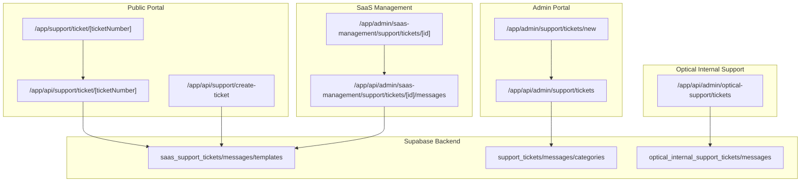
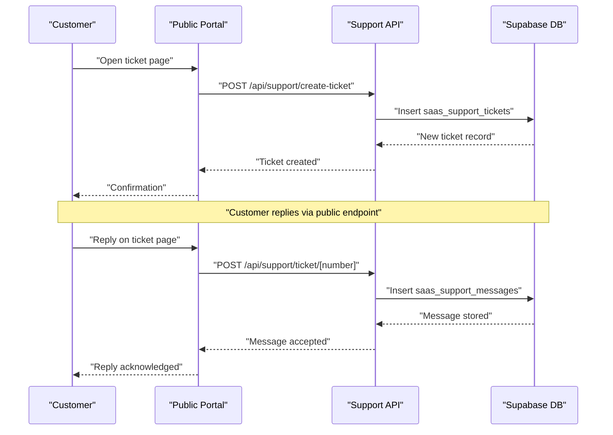
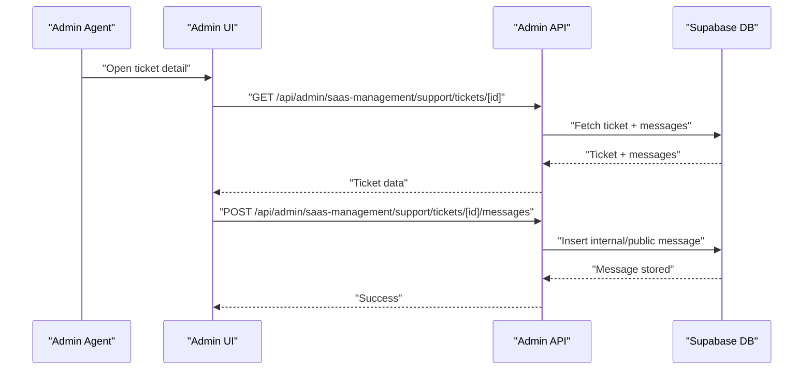
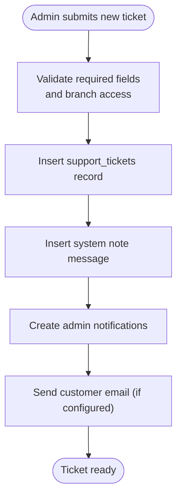
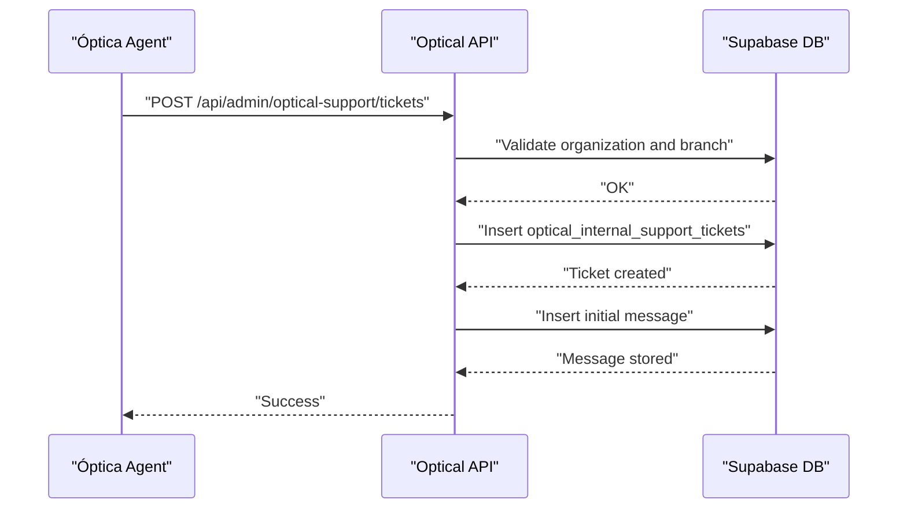
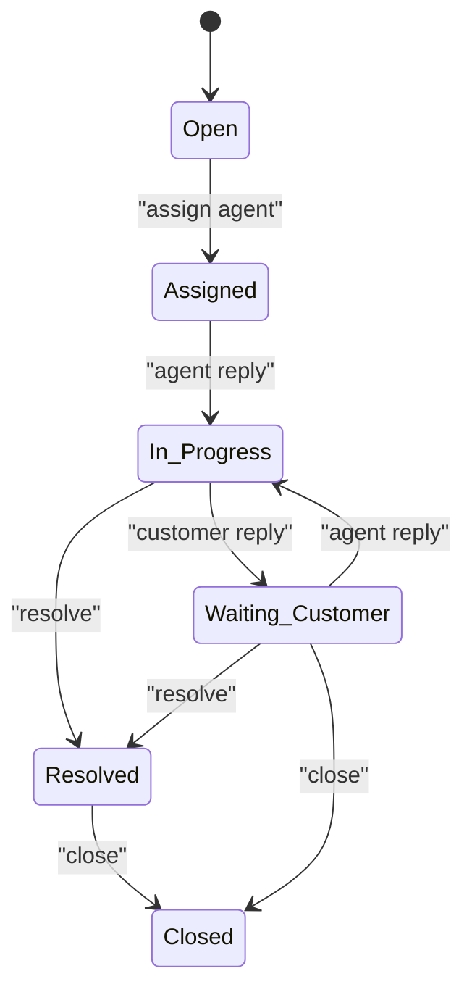
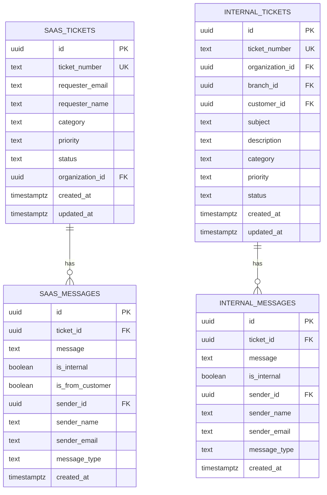

# Support & Ticketing System

<cite>
**Referenced Files in This Document**
- [20250116200000_create_support_system.sql](file://supabase/migrations/20250116200000_create_support_system.sql)
- [20260131000011_create_saas_support_system.sql](file://supabase/migrations/20260131000011_create_saas_support_system.sql)
- [20260201000002_create_optical_internal_support.sql](file://supabase/migrations/20260201000002_create_optical_internal_support.sql)
- [route.ts](file://src/app/api/support/create-ticket/route.ts)
- [route.ts](file://src/app/api/support/ticket/[ticketNumber]/route.ts)
- [page.tsx](file://src/app/support/ticket/[ticketNumber]/page.tsx)
- [route.ts](file://src/app/api/admin/support/tickets/route.ts)
- [page.tsx](file://src/app/admin/support/tickets/new/page.tsx)
- [route.ts](file://src/app/api/admin/optical-support/tickets/route.ts)
- [page.tsx](file://src/app/admin/saas-management/support/tickets/[id]/page.tsx)
</cite>

## Table of Contents

1. [Introduction](#introduction)
2. [Project Structure](#project-structure)
3. [Core Components](#core-components)
4. [Architecture Overview](#architecture-overview)
5. [Detailed Component Analysis](#detailed-component-analysis)
6. [Dependency Analysis](#dependency-analysis)
7. [Performance Considerations](#performance-considerations)
8. [Troubleshooting Guide](#troubleshooting-guide)
9. [Conclusion](#conclusion)
10. [Appendices](#appendices)

## Introduction

This document describes the comprehensive support and ticketing system for Opttius, covering:

- Public customer portal for creating and managing SaaS support tickets
- Internal administrative workflows for support teams
- Optical internal support for ópticas (opticians) to track issues with their customers
- Ticket lifecycle from creation to resolution, including categorization, assignment, and escalation
- Support queue management, agent collaboration, and customer communication
- SLA tracking, knowledge base integration via reusable templates, and support analytics

The system supports three distinct ticketing domains:

- Public SaaS support (external customers)
- Internal administrative support (for customers of ópticas)
- Optical internal support (for ópticas’ internal workflows)

## Project Structure

The system is implemented as a Next.js application with a Supabase backend. Frontend pages and API routes are organized under:

- Public customer portal: `/app/support/*` and `/app/api/support/*`
- Administrative portal: `/app/admin/*` and `/app/api/admin/*`
- SaaS management: `/app/admin/saas-management/support/*`
- Optical internal support: `/app/api/admin/optical-support/*`

**Diagram sources**

- [page.tsx](file://src/app/support/ticket/[ticketNumber]/page.tsx#L120-L511)
- [route.ts](file://src/app/api/support/ticket/[ticketNumber]/route.ts#L1-L197)
- [route.ts](file://src/app/api/support/create-ticket/route.ts#L1-L143)
- [page.tsx](file://src/app/admin/support/tickets/new/page.tsx#L56-L580)
- [route.ts](file://src/app/api/admin/support/tickets/route.ts#L1-L503)
- [page.tsx](file://src/app/admin/saas-management/support/tickets/[id]/page.tsx#L158-L791)
- [route.ts](file://src/app/api/admin/optical-support/tickets/route.ts#L1-L343)

**Section sources**

- [20250116200000_create_support_system.sql](file://supabase/migrations/20250116200000_create_support_system.sql#L1-L387)
- [20260131000011_create_saas_support_system.sql](file://supabase/migrations/20260131000011_create_saas_support_system.sql#L1-L333)
- [20260201000002_create_optical_internal_support.sql](file://supabase/migrations/20260201000002_create_optical_internal_support.sql#L1-L334)

## Core Components

- Public SaaS support:
  - Ticket creation without authentication
  - Public ticket view and customer replies
  - Auto-generated ticket numbers and notifications
- Internal administrative support:
  - Agent-created tickets on behalf of customers
  - Full CRUD for tickets, messages, and templates
  - Branch-aware filtering and multitenancy
- Optical internal support:
  - Tickets for ópticas to track issues with their customers
  - Organization-scoped visibility and RLS policies
- Knowledge base integration:
  - Reusable templates for common responses
  - Variable substitution for dynamic content
- Analytics:
  - Real-time statistics views and metrics

**Section sources**

- [route.ts](file://src/app/api/support/create-ticket/route.ts#L1-L143)
- [route.ts](file://src/app/api/support/ticket/[ticketNumber]/route.ts#L1-L197)
- [page.tsx](file://src/app/support/ticket/[ticketNumber]/page.tsx#L120-L511)
- [route.ts](file://src/app/api/admin/support/tickets/route.ts#L1-L503)
- [page.tsx](file://src/app/admin/support/tickets/new/page.tsx#L56-L580)
- [route.ts](file://src/app/api/admin/optical-support/tickets/route.ts#L1-L343)
- [20250116200000_create_support_system.sql](file://supabase/migrations/20250116200000_create_support_system.sql#L92-L115)
- [20260131000011_create_saas_support_system.sql](file://supabase/migrations/20260131000011_create_saas_support_system.sql#L99-L122)

## Architecture Overview

The system separates concerns across three domains while sharing common patterns:

- Public SaaS support: Stateless, public endpoints for customer-facing workflows
- Internal administrative support: Authenticated admin endpoints with branch-awareness
- Optical internal support: Organization-scoped tickets with strict RLS

**Diagram sources**

- [route.ts](file://src/app/api/support/create-ticket/route.ts#L1-L143)
- [route.ts](file://src/app/api/support/ticket/[ticketNumber]/route.ts#L83-L197)
- [page.tsx](file://src/app/support/ticket/[ticketNumber]/page.tsx#L165-L207)

## Detailed Component Analysis

### Public SaaS Support System

- Ticket creation:
  - Accepts requester information and optional organization lookup
  - Generates unique ticket numbers and sends notifications
  - Supports non-authenticated requests
- Public ticket view:
  - Displays ticket details and public messages
  - Validates requester email before allowing replies
  - Updates ticket timestamps and status transitions
- Notifications:
  - Email notifications via Resend
  - Admin push notifications

**Diagram sources**

- [page.tsx](file://src/app/admin/saas-management/support/tickets/[id]/page.tsx#L158-L791)
- [route.ts](file://src/app/api/admin/saas-management/support/tickets/[id]/messages/route.ts)

**Section sources**

- [route.ts](file://src/app/api/support/create-ticket/route.ts#L1-L143)
- [route.ts](file://src/app/api/support/ticket/[ticketNumber]/route.ts#L1-L197)
- [page.tsx](file://src/app/support/ticket/[ticketNumber]/page.tsx#L120-L511)

### Internal Administrative Support System

- Admin-created tickets:
  - Branch-aware creation with customer and order context
  - Automatic initial system message and admin notifications
- Filtering and pagination:
  - Status, priority, assigned_to, category, search, page, limit
- Multitenancy:
  - Branch context validation for non-super admins

**Diagram sources**

- [route.ts](file://src/app/api/admin/support/tickets/route.ts#L242-L503)

**Section sources**

- [route.ts](file://src/app/api/admin/support/tickets/route.ts#L1-L503)
- [page.tsx](file://src/app/admin/support/tickets/new/page.tsx#L56-L580)

### Optical Internal Support System

- Organization-scoped tickets:
  - Strict RLS policies restrict visibility to organization members
  - Supports related entities: orders, work orders, appointments, quotes
- Creation workflow:
  - Validates branch and customer ownership
  - Creates ticket with metadata and initial message
- Filtering and sorting:
  - Supports branch, customer, status, priority, category, assigned_to, search, pagination, and sort options

**Diagram sources**

- [route.ts](file://src/app/api/admin/optical-support/tickets/route.ts#L166-L343)

**Section sources**

- [route.ts](file://src/app/api/admin/optical-support/tickets/route.ts#L1-L343)
- [20260201000002_create_optical_internal_support.sql](file://supabase/migrations/20260201000002_create_optical_internal_support.sql#L1-L334)

### Ticket Lifecycle and Workflows

- Creation:
  - Public: anonymous creation with requester info
  - Internal: admin-on-behalf creation with customer context
  - Optical: agent-created with organization/branch/customer linkage
- Categorization and assignment:
  - Categories defined per domain
  - Assignments tracked with timestamps
- Collaboration:
  - Public/internal: customer replies update last_response_at and status if needed
  - Internal: agents add internal/private notes and public replies
- Escalation:
  - Priority increases handled via status/priority updates
  - Templates enable standardized escalations
- Resolution:
  - Status transitions to resolved/closed with resolution notes
  - Satisfaction metrics captured where applicable

**Diagram sources**

- [20250116200000_create_support_system.sql](file://supabase/migrations/20250116200000_create_support_system.sql#L11-L16)
- [20260131000011_create_saas_support_system.sql](file://supabase/migrations/20260131000011_create_saas_support_system.sql#L31-L38)

**Section sources**

- [route.ts](file://src/app/api/support/ticket/[ticketNumber]/route.ts#L147-L160)
- [page.tsx](file://src/app/admin/saas-management/support/tickets/[id]/page.tsx#L280-L316)

### Support Queue Management and Agent Collaboration

- Queue management:
  - Filters by status, priority, assigned_to, category
  - Pagination and ordering by created_at
  - Message counts and “needs response” indicators
- Agent collaboration:
  - Internal notes hidden from customers
  - Templates for standardized responses
  - Assignments and timestamps for SLA tracking

**Section sources**

- [route.ts](file://src/app/api/admin/support/tickets/route.ts#L7-L240)
- [page.tsx](file://src/app/admin/saas-management/support/tickets/[id]/page.tsx#L158-L791)

### Customer Communication Features

- Public portal:
  - Secure reply validation by requester email
  - Read-only visibility of public messages
- Internal portal:
  - Toggle internal vs public messages
  - Template insertion for quick replies
- Notifications:
  - Email confirmations and admin alerts

**Section sources**

- [route.ts](file://src/app/api/support/ticket/[ticketNumber]/route.ts#L115-L121)
- [page.tsx](file://src/app/support/ticket/[ticketNumber]/page.tsx#L367-L444)

### SLA Management and Metrics

- Built-in timestamps:
  - first_response_at, last_response_at
  - response_time_minutes, resolution_time_minutes
- Statistics:
  - Real-time dashboard view for support_ticket_stats
  - Priority and status breakdowns

**Section sources**

- [20250116200000_create_support_system.sql](file://supabase/migrations/20250116200000_create_support_system.sql#L366-L387)
- [20260131000011_create_saas_support_system.sql](file://supabase/migrations/20260131000011_create_saas_support_system.sql#L49-L57)

### Knowledge Base Integration

- Templates:
  - Reusable content with variable substitution
  - Active/inactive status and usage tracking
- Usage:
  - Agents can apply templates to speed up replies

**Section sources**

- [20250116200000_create_support_system.sql](file://supabase/migrations/20250116200000_create_support_system.sql#L92-L115)
- [20260131000011_create_saas_support_system.sql](file://supabase/migrations/20260131000011_create_saas_support_system.sql#L99-L122)
- [page.tsx](file://src/app/admin/saas-management/support/tickets/[id]/page.tsx#L318-L322)

### Practical Examples

#### Example: Customer creates a public SaaS ticket

- Steps:
  - Visit public portal, fill requester info and ticket details
  - Submit via POST /api/support/create-ticket
  - Receive confirmation and admin notification
- Outcomes:
  - Unique ticket number generated
  - Requester receives email confirmation

**Section sources**

- [route.ts](file://src/app/api/support/create-ticket/route.ts#L1-L143)

#### Example: Agent manages a SaaS ticket

- Steps:
  - Open ticket detail in admin portal
  - Add internal note or public reply
  - Update status/priority or mark resolved/closed
- Outcomes:
  - Message visibility controlled by internal flag
  - SLA metrics updated automatically

**Section sources**

- [page.tsx](file://src/app/admin/saas-management/support/tickets/[id]/page.tsx#L158-L791)

#### Example: Customer replies to a public ticket

- Steps:
  - Navigate to ticket view
  - Enter email and message
  - Submit via POST /api/support/ticket/[number]
- Outcomes:
  - Reply validated against requester email
  - Ticket status updated if previously resolved/closed

**Section sources**

- [route.ts](file://src/app/api/support/ticket/[ticketNumber]/route.ts#L83-L197)
- [page.tsx](file://src/app/support/ticket/[ticketNumber]/page.tsx#L165-L207)

## Dependency Analysis

- Database schema:
  - saas*support*\* tables for public SaaS support
  - support\_\* tables for internal customer support
  - optical*internal_support*\* tables for ópticas
- Row Level Security:
  - Public SaaS: requester-only access to own tickets
  - Internal: admin users can view/manage all; customers can view own
  - Optical: organization-scoped visibility and actions
- Triggers and functions:
  - Auto-generate ticket numbers
  - Update timestamps on message insert
  - Statistics view aggregation

**Diagram sources**

- [20260131000011_create_saas_support_system.sql](file://supabase/migrations/20260131000011_create_saas_support_system.sql#L6-L97)
- [20260201000002_create_optical_internal_support.sql](file://supabase/migrations/20260201000002_create_optical_internal_support.sql#L7-L110)

**Section sources**

- [20250116200000_create_support_system.sql](file://supabase/migrations/20250116200000_create_support_system.sql#L1-L387)
- [20260131000011_create_saas_support_system.sql](file://supabase/migrations/20260131000011_create_saas_support_system.sql#L1-L333)
- [20260201000002_create_optical_internal_support.sql](file://supabase/migrations/20260201000002_create_optical_internal_support.sql#L1-L334)

## Performance Considerations

- Indexes:
  - Dedicated indexes on status, priority, assigned_to, created_at improve query performance
- Pagination:
  - API endpoints support page and limit parameters to avoid large result sets
- Asynchronous notifications:
  - Email and admin notifications are non-blocking to maintain responsiveness
- Statistics:
  - Materialized or aggregated views reduce repeated heavy computations

[No sources needed since this section provides general guidance]

## Troubleshooting Guide

- Authentication failures:
  - Admin endpoints require authenticated admin users; unauthorized responses indicate missing or invalid session
- Validation errors:
  - Body validation ensures required fields are present; errors return descriptive messages
- Branch/organization access:
  - Non-super admins must select a branch; optical tickets require matching organization/branch ownership
- Email delivery:
  - Resend configuration is required; absence results in skipped notifications
- Ticket not found:
  - Public ticket endpoints return 404 when ticket number is invalid

**Section sources**

- [route.ts](file://src/app/api/admin/support/tickets/route.ts#L32-L61)
- [route.ts](file://src/app/api/admin/optical-support/tickets/route.ts#L22-L56)
- [route.ts](file://src/app/api/support/ticket/[ticketNumber]/route.ts#L38-L40)

## Conclusion

The Opttius support and ticketing system provides a robust, multi-domain solution:

- Public SaaS support enables customer self-service with secure replies and notifications
- Internal administrative workflows streamline agent collaboration with templates and queue management
- Optical internal support isolates ópticas’ internal issues within organization boundaries
- SLA tracking, knowledge base integration, and analytics support continuous improvement

[No sources needed since this section summarizes without analyzing specific files]

## Appendices

### API Reference Summary

- Public SaaS
  - POST /api/support/create-ticket: Create public ticket
  - GET /api/support/ticket/[ticketNumber]: Fetch public ticket and messages
  - POST /api/support/ticket/[ticketNumber]: Add customer reply
- Internal Admin
  - GET /api/admin/support/tickets: List tickets with filters
  - POST /api/admin/support/tickets: Create ticket on behalf of customer
- SaaS Management
  - GET /api/admin/saas-management/support/tickets/[id]: Fetch ticket detail
  - POST /api/admin/saas-management/support/tickets/[id]/messages: Add agent message
- Optical Internal
  - GET /api/admin/optical-support/tickets: List optical internal tickets
  - POST /api/admin/optical-support/tickets: Create optical internal ticket

**Section sources**

- [route.ts](file://src/app/api/support/create-ticket/route.ts#L1-L143)
- [route.ts](file://src/app/api/support/ticket/[ticketNumber]/route.ts#L1-L197)
- [route.ts](file://src/app/api/admin/support/tickets/route.ts#L1-L503)
- [page.tsx](file://src/app/admin/saas-management/support/tickets/[id]/page.tsx#L158-L791)
- [route.ts](file://src/app/api/admin/optical-support/tickets/route.ts#L1-L343)
