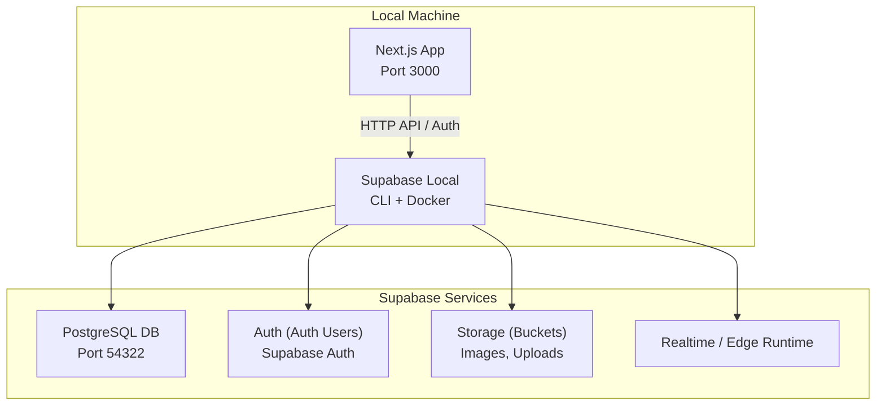
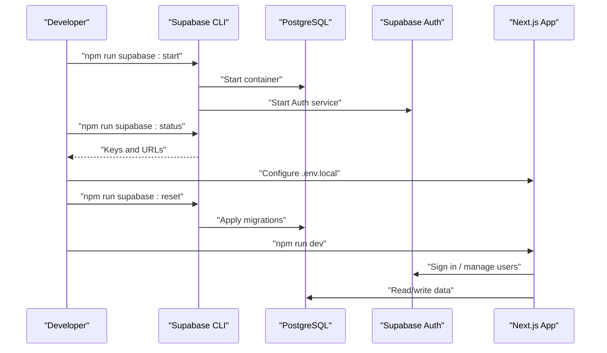
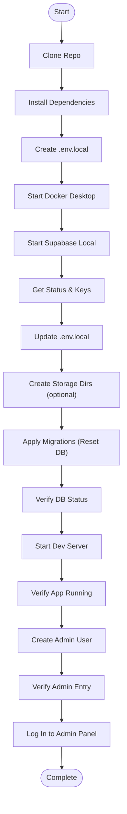
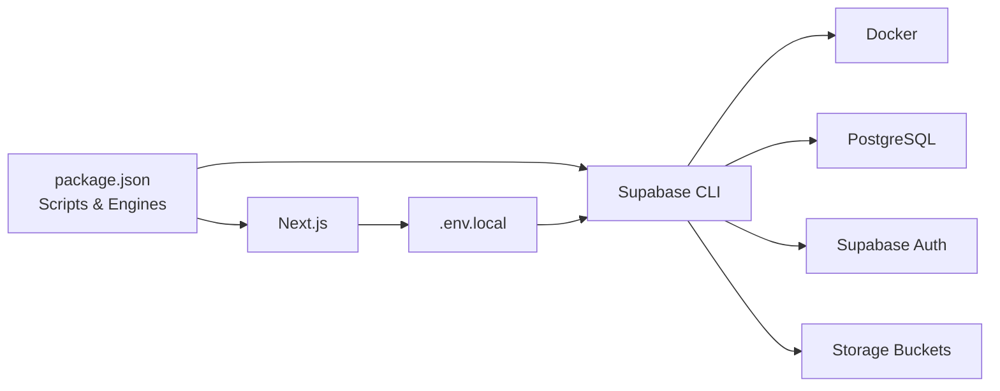

# Getting Started

<cite>
**Referenced Files in This Document**
- [README.md](file://README.md)
- [SETUP_GUIDE.md](file://SETUP_GUIDE.md)
- [package.json](file://package.json)
- [env.example](file://env.example)
- [supabase/config.toml](file://supabase/config.toml)
- [scripts/create-admin-via-api.js](file://scripts/create-admin-via-api.js)
- [scripts/sql-utils/grant-admin-access.sql](file://scripts/sql-utils/grant-admin-access.sql)
- [next.config.js](file://next.config.js)
- [supabase/migrations/20241220000000_create_user_profiles.sql](file://supabase/migrations/20241220000000_create_user_profiles.sql)
- [scripts/SEEDING_README.md](file://scripts/SEEDING_README.md)
</cite>

## Table of Contents

1. [Introduction](#introduction)
2. [Project Structure](#project-structure)
3. [Core Components](#core-components)
4. [Architecture Overview](#architecture-overview)
5. [Detailed Component Analysis](#detailed-component-analysis)
6. [Dependency Analysis](#dependency-analysis)
7. [Performance Considerations](#performance-considerations)
8. [Troubleshooting Guide](#troubleshooting-guide)
9. [Conclusion](#conclusion)
10. [Appendices](#appendices)

## Introduction

This guide helps you rapidly onboard Opttius, an optical management platform built with Next.js 14, TypeScript, and Supabase. It covers prerequisites, environment setup, local Supabase configuration, database initialization, environment variables, administrator account creation, and first login. It also includes practical examples, troubleshooting tips, and guidance for choosing between local and cloud environments.

## Project Structure

Opttius follows a modern full-stack architecture:

- Frontend: Next.js App Router with TypeScript
- Backend: Supabase (PostgreSQL, Auth, Storage, Edge Functions)
- Configuration: Supabase CLI and TOML configuration, environment variables
- Developer scripts: Node.js scripts for admin creation and seeding

**Diagram sources**

- [supabase/config.toml](file://supabase/config.toml#L7-L31)
- [supabase/config.toml](file://supabase/config.toml#L100-L127)
- [supabase/config.toml](file://supabase/config.toml#L128-L147)
- [next.config.js](file://next.config.js#L82-L110)

**Section sources**

- [README.md](file://README.md#L283-L331)
- [SETUP_GUIDE.md](file://SETUP_GUIDE.md#L1-L50)

## Core Components

- Supabase local development stack (CLI, PostgreSQL, Auth, Storage, Studio, Mailpit)
- Next.js application with App Router and TypeScript
- Environment variables for Supabase, payment providers, and optional integrations
- Admin user creation via Supabase Auth API or SQL scripts
- Database migrations applied through Supabase CLI

Key setup commands and files:

- Supabase CLI scripts in package.json
- Supabase configuration in TOML
- Environment template and local overrides
- Admin creation scripts

**Section sources**

- [package.json](file://package.json#L5-L35)
- [supabase/config.toml](file://supabase/config.toml#L1-L345)
- [env.example](file://env.example#L1-L120)
- [scripts/create-admin-via-api.js](file://scripts/create-admin-via-api.js#L1-L165)
- [scripts/sql-utils/grant-admin-access.sql](file://scripts/sql-utils/grant-admin-access.sql#L1-L68)

## Architecture Overview

The development environment uses Supabase local for database, authentication, storage, and admin UI. The Next.js app communicates with Supabase via the JavaScript client and exposes admin pages under /admin.

**Diagram sources**

- [README.md](file://README.md#L112-L197)
- [SETUP_GUIDE.md](file://SETUP_GUIDE.md#L81-L224)
- [package.json](file://package.json#L13-L18)

## Detailed Component Analysis

### Prerequisites and System Requirements

- Node.js version requirement is enforced by the project’s engines field.
- Docker Desktop is required for Supabase local.
- Git is needed to clone the repository.
- npm or yarn is used to install dependencies.

Verification steps:

- Confirm Node.js version meets the requirement.
- Ensure Docker Desktop is running.
- Verify Git availability.

**Section sources**

- [package.json](file://package.json#L122-L124)
- [SETUP_GUIDE.md](file://SETUP_GUIDE.md#L5-L14)
- [README.md](file://README.md#L88-L96)

### Step-by-Step Installation and First Login

1. Clone the repository

- Use Git to clone the repository to your machine.

2. Install dependencies

- Run the package manager install command.

3. Configure environment variables

- Copy the example environment file to .env.local.
- Update Supabase keys and URLs from the local status output.

4. Start Docker Desktop

- Ensure Docker is running before starting Supabase.

5. Start local Supabase

- Launch the local Supabase stack using the CLI script.

6. Retrieve Supabase credentials

- Use the status command to fetch keys and URLs.

7. Update environment variables

- Paste the keys into .env.local.

8. Create storage directories (optional)

- Prevents storage warnings during reset.

9. Apply database migrations

- Reset the database to apply all migrations.

10. Verify database setup

- Confirm all services are running.

11. Start the development server

- Launch the Next.js app.

12. Verify application is running

- Open the main URL in your browser.

13. Create your first admin user

- Choose one of the three methods:
  - Node.js script (recommended)
  - Sign up first, then grant admin via SQL
  - Use Supabase Studio SQL Editor

14. Verify admin user creation

- Query the admin_users table to confirm.

15. Log in to the admin panel

- Navigate to the login page and sign in with admin credentials.

**Diagram sources**

- [README.md](file://README.md#L97-L282)
- [SETUP_GUIDE.md](file://SETUP_GUIDE.md#L16-L387)

**Section sources**

- [README.md](file://README.md#L97-L282)
- [SETUP_GUIDE.md](file://SETUP_GUIDE.md#L16-L387)

### Environment Variable Configuration

- Required Supabase variables for local development are documented in the environment template.
- Optional variables include payment providers, email, AI providers, and cloud storage.
- The Next.js configuration reads these variables for runtime behavior.

Practical tips:

- Always copy env.example to .env.local and fill in values.
- For local Supabase, use the keys provided by the status command.
- For production, replace keys with cloud Supabase values.

**Section sources**

- [env.example](file://env.example#L1-L120)
- [README.md](file://README.md#L504-L548)
- [SETUP_GUIDE.md](file://SETUP_GUIDE.md#L54-L150)
- [next.config.js](file://next.config.js#L81-L110)

### Administrator Account Creation

Three secure methods are provided:

- Node.js script that uses Supabase Auth admin APIs to create a user and grant admin access.
- SQL script to grant admin access to an existing user.
- Supabase Studio SQL Editor to manually create admin entries.

Security notes:

- The Node.js script warns against using default credentials in production.
- For production, avoid hardcoding secrets and use secure admin workflows.

**Section sources**

- [scripts/create-admin-via-api.js](file://scripts/create-admin-via-api.js#L1-L165)
- [scripts/sql-utils/grant-admin-access.sql](file://scripts/sql-utils/grant-admin-access.sql#L1-L68)
- [README.md](file://README.md#L206-L282)
- [SETUP_GUIDE.md](file://SETUP_GUIDE.md#L235-L387)

### Database Initialization and Migrations

- Supabase migrations are applied via the CLI reset command.
- The migration files define tables, RLS policies, triggers, and functions.
- Example migration files include user profiles, ecommerce system, admin users, support systems, POS, and more.

Validation:

- After reset, verify the status shows all services healthy.
- Optionally seed test data for development.

**Section sources**

- [README.md](file://README.md#L180-L192)
- [SETUP_GUIDE.md](file://SETUP_GUIDE.md#L166-L204)
- [supabase/migrations/20241220000000_create_user_profiles.sql](file://supabase/migrations/20241220000000_create_user_profiles.sql#L1-L82)
- [scripts/SEEDING_README.md](file://scripts/SEEDING_README.md#L1-L138)

### Supabase Local Configuration

- Ports and services are configured in the Supabase TOML file.
- Default ports include API, DB, Studio, and Mailpit.
- Adjust ports if conflicts occur.

**Section sources**

- [supabase/config.toml](file://supabase/config.toml#L7-L31)
- [supabase/config.toml](file://supabase/config.toml#L79-L99)
- [README.md](file://README.md#L456-L470)
- [SETUP_GUIDE.md](file://SETUP_GUIDE.md#L459-L462)

### Deployment Considerations: Local vs Cloud

- Local development uses Supabase local with Docker for rapid iteration.
- Production requires a cloud Supabase project and updated environment variables.
- The README explicitly notes this distinction.

Guidance:

- Use local for development and testing.
- For production, provision a Supabase project, update environment variables, and deploy the Next.js app.

**Section sources**

- [README.md](file://README.md#L612-L613)
- [SETUP_GUIDE.md](file://SETUP_GUIDE.md#L501-L510)

## Dependency Analysis

The project’s scripts and configuration rely on:

- Supabase CLI for local development
- Docker for containerized services
- Next.js for the frontend runtime
- Payment and AI integrations via environment variables

**Diagram sources**

- [package.json](file://package.json#L5-L35)
- [supabase/config.toml](file://supabase/config.toml#L1-L345)
- [env.example](file://env.example#L1-L120)

**Section sources**

- [package.json](file://package.json#L5-L35)
- [supabase/config.toml](file://supabase/config.toml#L1-L345)
- [env.example](file://env.example#L1-L120)

## Performance Considerations

- First-time Supabase startup downloads Docker images and may take several minutes; subsequent starts are faster.
- Keep Docker running and ensure sufficient CPU/RAM allocation for smooth operation.
- Use the reset command to reapply migrations efficiently during development.

[No sources needed since this section provides general guidance]

## Troubleshooting Guide

Common issues and resolutions:

- Supabase won’t start: Check Docker is running; restart Supabase using stop/start commands.
- Port conflicts: Modify ports in the Supabase configuration file.
- Migration errors: Reset the database to reapply migrations.
- Build errors: Clear Next.js cache and reinstall dependencies.
- Cannot access admin panel: Verify login, check admin_users table, and confirm admin status.

**Section sources**

- [README.md](file://README.md#L443-L503)
- [SETUP_GUIDE.md](file://SETUP_GUIDE.md#L446-L488)

## Conclusion

You now have a complete, step-by-step path to set up Opttius locally, configure Supabase, initialize the database, create an administrator, and log in for the first time. Use the troubleshooting section for quick fixes and refer to the deployment guidance for production preparation.

[No sources needed since this section summarizes without analyzing specific files]

## Appendices

### Quick Access Points

- Main App: http://localhost:3000
- Admin Panel: http://localhost:3000/admin
- Login: http://localhost:3000/login
- Signup: http://localhost:3000/signup
- Supabase Studio: http://127.0.0.1:54323
- Email Testing (Mailpit): http://127.0.0.1:54324

**Section sources**

- [README.md](file://README.md#L398-L405)
- [SETUP_GUIDE.md](file://SETUP_GUIDE.md#L435-L443)
