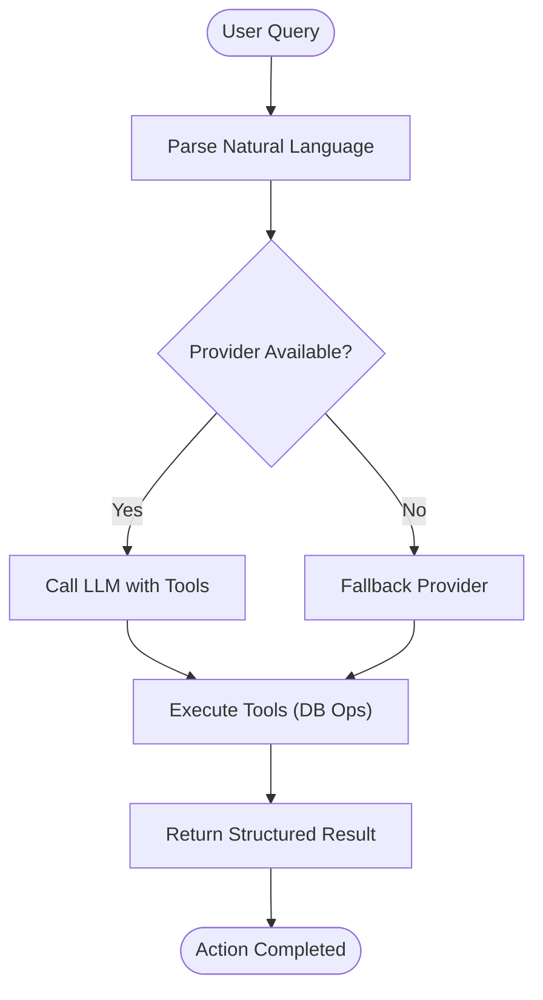

# Project Overview

<cite>
**Referenced Files in This Document**
- [README.md](file://README.md)
- [package.json](file://package.json)
- [src/app/layout.tsx](file://src/app/layout.tsx)
- [src/lib/supabase.ts](file://src/lib/supabase.ts)
- [supabase/config.toml](file://supabase/config.toml)
- [src/config/business.ts](file://src/config/business.ts)
- [supabase/migrations/20260128000000_create_organizations_and_subscriptions.sql](file://supabase/migrations/20260128000000_create_organizations_and_subscriptions.sql)
- [src/types/database.ts](file://src/types/database.ts)
- [src/lib/payments/index.ts](file://src/lib/payments/index.ts)
- [src/app/admin/saas-management/page.tsx](file://src/app/admin/saas-management/page.tsx)
</cite>

## Table of Contents

1. [Introduction](#introduction)
2. [Project Structure](#project-structure)
3. [Core Components](#core-components)
4. [Architecture Overview](#architecture-overview)
5. [Detailed Component Analysis](#detailed-component-analysis)
6. [Dependency Analysis](#dependency-analysis)
7. [Performance Considerations](#performance-considerations)
8. [Troubleshooting Guide](#troubleshooting-guide)
9. [Conclusion](#conclusion)

## Introduction

Opttius is a complete optical management SaaS platform designed for optical chains, laboratories, and practitioners. Built as a full-stack Next.js 14 application with TypeScript and Supabase, it provides end-to-end capabilities to manage patients, appointments, quotes, lab work orders, optical products, POS transactions, and more. The platform emphasizes multi-tenancy for SaaS delivery, AI-powered insights, and comprehensive optical workflow automation.

Key business value propositions:

- Streamlined optical workflows from patient appointment scheduling to lab work order fulfillment
- Multi-tenant SaaS architecture enabling white-label deployments for optical chains and franchises
- AI-assisted operations for intelligent insights and automated administrative tasks
- Integrated payment processing supporting traditional and crypto payment methods
- Real-time notifications, analytics, and robust role-based access control

Target audiences:

- Optical chains and multi-location practices
- Independent optical laboratories and opticians
- Practitioners requiring integrated patient and inventory management

Differentiators:

- Multi-tenant architecture with organization and subscription tiers
- AI agent with tool-calling for autonomous database operations
- Comprehensive optical domain coverage: prescriptions, contact lenses, frames, and lab orders
- Extensible payment gateway factory supporting Stripe Flow, Mercado Pago, PayPal, and NowPayments

## Project Structure

The project follows a modern Next.js App Router structure with a clear separation of concerns:

- Application shell and providers in the root layout
- Feature-based pages under the admin and public routes
- Supabase-driven backend with migrations and local development configuration
- Strong typing via generated Supabase database types
- Payment gateway abstraction for extensibility

**Diagram sources**

- [src/app/layout.tsx](file://src/app/layout.tsx#L30-L55)
- [src/lib/supabase.ts](file://src/lib/supabase.ts#L1-L36)
- [supabase/config.toml](file://supabase/config.toml#L100-L127)

**Section sources**

- [README.md](file://README.md#L283-L331)
- [src/app/layout.tsx](file://src/app/layout.tsx#L30-L55)

## Core Components

- Multi-tenant SaaS foundation with organizations, subscriptions, and tiered plans
- Optical workflow management covering appointments, quotes, work orders, and POS
- AI-powered insights and an intelligent assistant for administrative tasks
- Payment gateway factory supporting multiple providers (Stripe Flow, Mercado Pago, PayPal, NowPayments)
- Supabase-based authentication, real-time features, and row-level security

**Section sources**

- [supabase/migrations/20260128000000_create_organizations_and_subscriptions.sql](file://supabase/migrations/20260128000000_create_organizations_and_subscriptions.sql#L1-L287)
- [src/config/business.ts](file://src/config/business.ts#L1-L92)
- [src/lib/payments/index.ts](file://src/lib/payments/index.ts#L1-L38)
- [README.md](file://README.md#L74-L87)

## Architecture Overview

Opttius adopts a layered architecture:

- Presentation layer: Next.js App Router pages and components
- Domain services: API routes implementing business logic
- Data access: Supabase client with typed database interfaces
- Infrastructure: Supabase local development stack with configurable ports and storage

**Diagram sources**

- [src/app/layout.tsx](file://src/app/layout.tsx#L30-L55)
- [src/lib/supabase.ts](file://src/lib/supabase.ts#L1-L36)
- [supabase/config.toml](file://supabase/config.toml#L1-L345)

## Detailed Component Analysis

### Multi-Tenant SaaS Foundation

The platform implements a multi-tenant architecture centered around organizations and subscriptions:

- Organizations represent tenants (optical chains, labs, practices)
- Subscriptions manage billing cycles and status
- Subscription tiers define feature sets and limits
- Branches and admin users are scoped to organizations

**Diagram sources**

- [supabase/migrations/20260128000000_create_organizations_and_subscriptions.sql](file://supabase/migrations/20260128000000_create_organizations_and_subscriptions.sql#L6-L31)

**Section sources**

- [supabase/migrations/20260128000000_create_organizations_and_subscriptions.sql](file://supabase/migrations/20260128000000_create_organizations_and_subscriptions.sql#L1-L287)
- [src/app/admin/saas-management/page.tsx](file://src/app/admin/saas-management/page.tsx#L1-L7)

### Optical Workflow Lifecycle

The complete optical management lifecycle spans from patient engagement to lab fulfillment:

**Diagram sources**

- [README.md](file://README.md#L15-L50)

**Section sources**

- [README.md](file://README.md#L15-L50)

### AI-Powered Insights and Assistant

Opttius integrates AI agents capable of autonomous operations:

- Multi-provider support (OpenAI, Anthropic, Google, DeepSeek)
- Tool-calling for database operations via natural language
- Dedicated AI insights generation pipeline

**Diagram sources**

- [README.md](file://README.md#L83-L85)

**Section sources**

- [README.md](file://README.md#L525-L601)

### Payment Integration Ecosystem

The payment system uses a factory pattern to support multiple gateways:

- Stripe Flow (card payments)
- Mercado Pago (local Latin American payments)
- PayPal (global payments)
- NowPayments (cryptocurrency payments)

**Diagram sources**

- [src/lib/payments/index.ts](file://src/lib/payments/index.ts#L1-L38)

**Section sources**

- [src/lib/payments/index.ts](file://src/lib/payments/index.ts#L1-L38)
- [README.md](file://README.md#L85-L86)

## Dependency Analysis

The project leverages a cohesive set of technologies:

- Next.js 14 with App Router for routing and SSR
- TypeScript for type safety across UI, API, and database layers
- Supabase for authentication, database, storage, and real-time features
- Payment SDKs for seamless checkout experiences
- React Query for caching and optimistic updates
- Tailwind CSS for responsive UI

**Diagram sources**

- [package.json](file://package.json#L36-L86)
- [src/app/layout.tsx](file://src/app/layout.tsx#L30-L55)

**Section sources**

- [package.json](file://package.json#L36-L86)
- [src/types/database.ts](file://src/types/database.ts#L1-L200)

## Performance Considerations

- Use Supabase’s built-in real-time subscriptions judiciously to avoid unnecessary bandwidth
- Leverage React Query caching for frequently accessed data (appointments, quotes, products)
- Optimize database queries with appropriate indexes (as defined in migrations)
- Minimize payload sizes by selecting only required fields in API responses
- Enable compression and use CDN for static assets

## Troubleshooting Guide

Common setup and runtime issues:

- Supabase local containers not starting: verify Docker availability and port conflicts; adjust ports in configuration if needed
- Environment variables missing: ensure Supabase keys and optional payment credentials are configured
- Migration errors: reset the database using provided scripts to re-apply migrations
- Authentication issues: confirm user exists in admin users table and has proper privileges

**Section sources**

- [README.md](file://README.md#L443-L503)
- [supabase/config.toml](file://supabase/config.toml#L7-L345)

## Conclusion

Opttius delivers a comprehensive, multi-tenant SaaS solution tailored for optical practices and laboratories. Its full-stack Next.js architecture, powered by Supabase, ensures rapid development and reliable scalability. The platform’s optical workflow coverage, AI-driven insights, and flexible payment integrations position it as a strong candidate for modern optical businesses seeking digital transformation.
