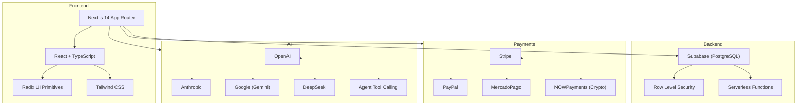
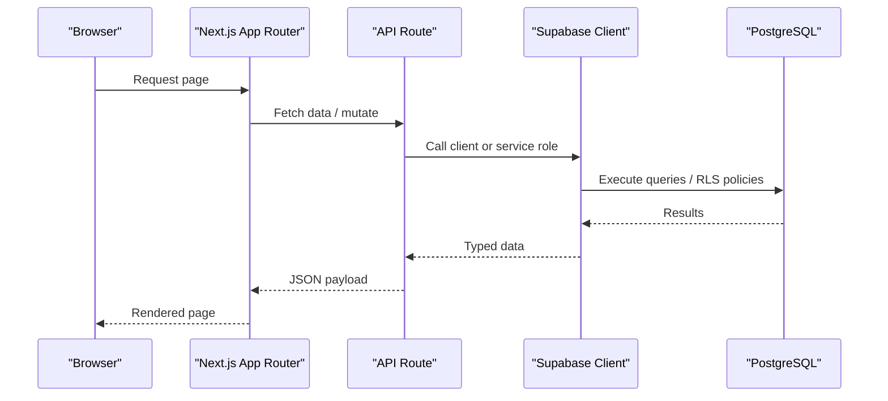
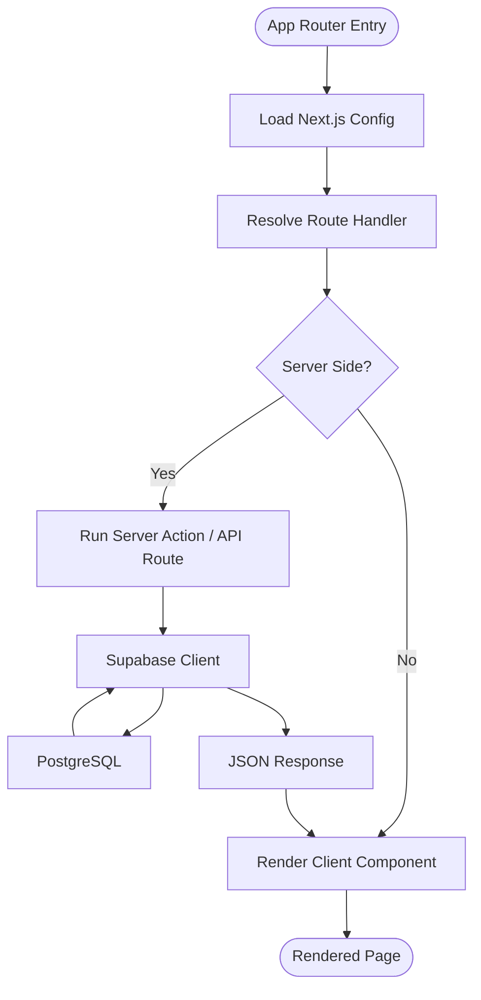
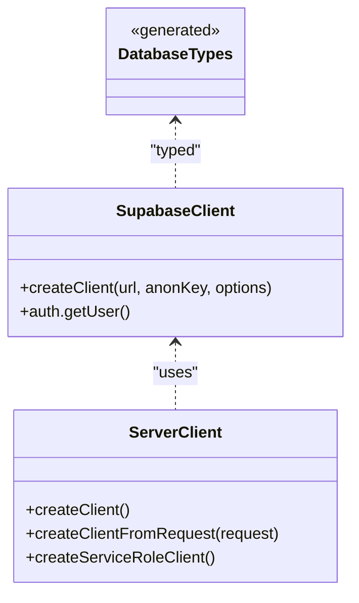
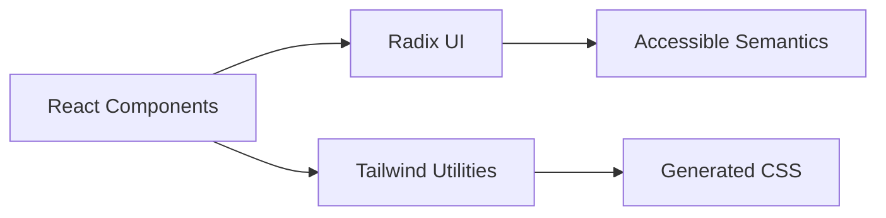
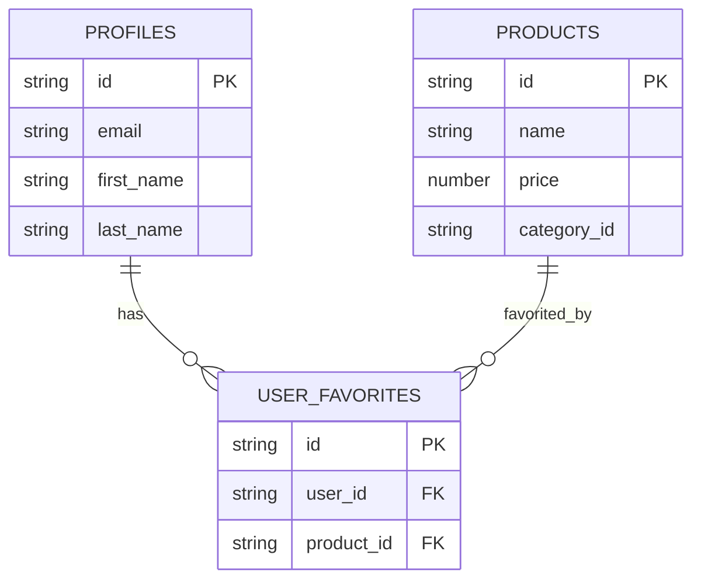
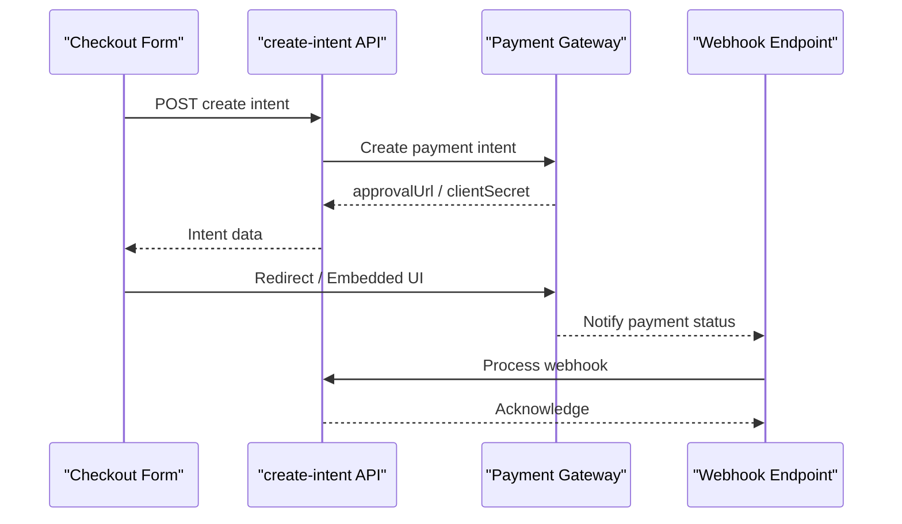
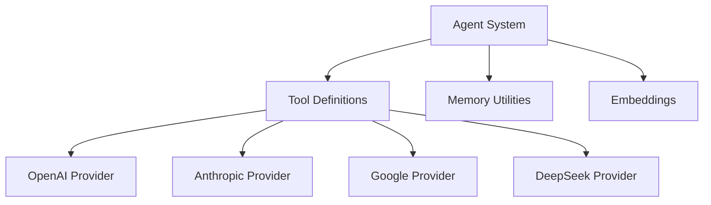
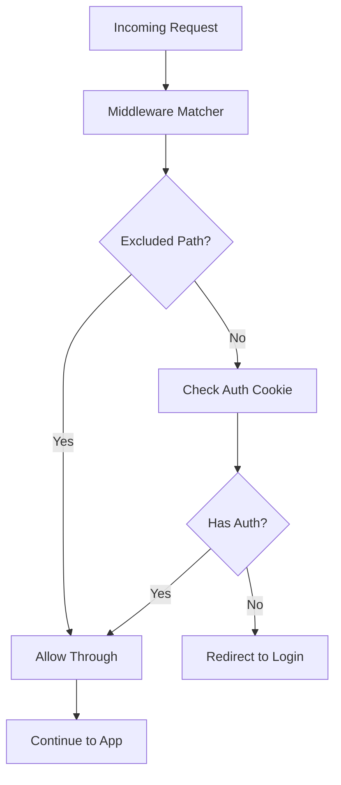
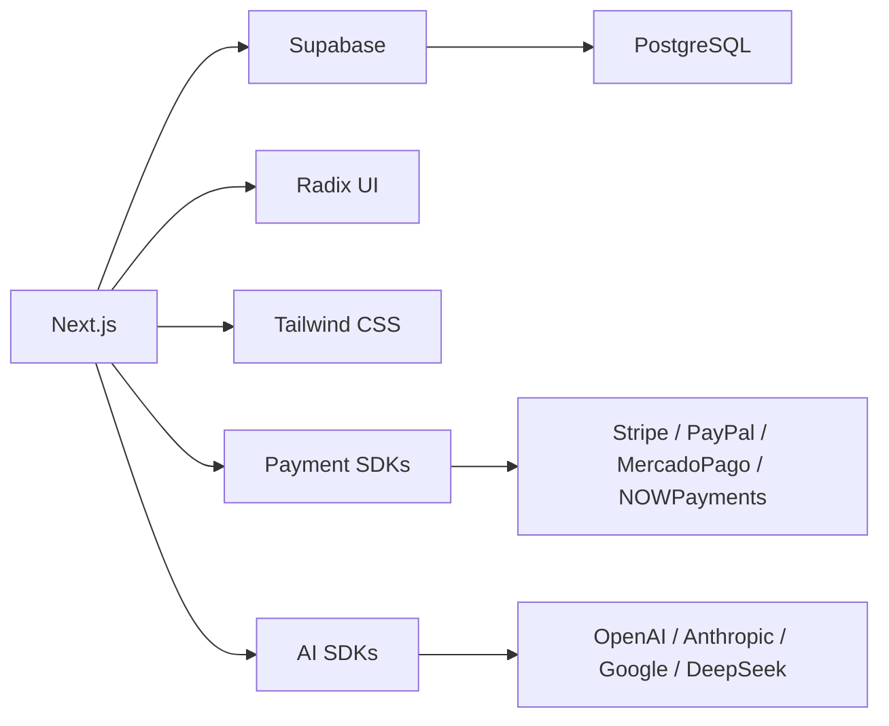

# Technology Stack

<cite>
**Referenced Files in This Document**
- [package.json](file://package.json)
- [next.config.js](file://next.config.js)
- [tsconfig.json](file://tsconfig.json)
- [tailwind.config.ts](file://tailwind.config.ts)
- [src/lib/supabase.ts](file://src/lib/supabase.ts)
- [src/utils/supabase/server.ts](file://src/utils/supabase/server.ts)
- [src/middleware.ts](file://src/middleware.ts)
- [src/types/database.ts](file://src/types/database.ts)
- [src/lib/mercadopago.ts](file://src/lib/mercadopago.ts)
- [src/lib/payments/interfaces.ts](file://src/lib/payments/interfaces.ts)
- [src/components/checkout/CheckoutForm.tsx](file://src/components/checkout/CheckoutForm.tsx)
- [src/components/checkout/CheckoutPageContent.tsx](file://src/components/checkout/CheckoutPageContent.tsx)
- [docs/PAYMENT_GATEWAYS_IMPLEMENTATION_GUIDE.md](file://docs/PAYMENT_GATEWAYS_IMPLEMENTATION_GUIDE.md)
- [docs/CRYPTO_PAYMENTS_IMPLEMENTATION_SUMMARY.md](file://docs/CRYPTO_PAYMENTS_IMPLEMENTATION_SUMMARY.md)
- [docs/NOWPAYMENTS_COMPLETADO.md](file://docs/NOWPAYMENTS_COMPLETADO.md)
</cite>

## Table of Contents

1. [Introduction](#introduction)
2. [Project Structure](#project-structure)
3. [Core Components](#core-components)
4. [Architecture Overview](#architecture-overview)
5. [Detailed Component Analysis](#detailed-component-analysis)
6. [Dependency Analysis](#dependency-analysis)
7. [Performance Considerations](#performance-considerations)
8. [Troubleshooting Guide](#troubleshooting-guide)
9. [Conclusion](#conclusion)

## Introduction

This document presents the complete technology stack and architectural choices for the Opttius platform. It covers the web framework (Next.js 14 with App Router), TypeScript for type safety, Supabase for authentication, database, and real-time capabilities, the frontend stack (React with Radix UI primitives and Tailwind CSS), the backend architecture (PostgreSQL with Row Level Security and stored procedures), payment processing integrations (Stripe, PayPal, MercadoPago, and cryptocurrency via NOWPayments), AI integration with multiple LLM providers and an agent-based tool calling system, and development tools, build processes, and deployment technologies.

## Project Structure

The Opttius platform follows a modern full-stack architecture:

- Frontend built with Next.js 14 App Router, TypeScript, React, Radix UI, and Tailwind CSS
- Backend powered by Supabase (PostgreSQL) with Row Level Security (RLS) and serverless functions
- Payment processing integrated with Stripe, PayPal, MercadoPago, and NOWPayments
- AI system leveraging multiple LLM providers and an agent-based tool calling framework
- Robust middleware and security configurations for authentication and CSP

**Diagram sources**

- [package.json](file://package.json#L36-L86)
- [next.config.js](file://next.config.js#L1-L161)
- [tailwind.config.ts](file://tailwind.config.ts#L1-L425)
- [src/lib/supabase.ts](file://src/lib/supabase.ts#L1-L36)
- [src/utils/supabase/server.ts](file://src/utils/supabase/server.ts#L1-L110)

**Section sources**

- [package.json](file://package.json#L1-L134)
- [next.config.js](file://next.config.js#L1-L161)
- [tsconfig.json](file://tsconfig.json#L1-L32)
- [tailwind.config.ts](file://tailwind.config.ts#L1-L425)

## Core Components

- Web Framework: Next.js 14 with App Router for server-side rendering, static generation, and API routes
- Type Safety: TypeScript strict mode with path aliases and incremental builds
- Styling: Tailwind CSS with a comprehensive theme system, animations, and responsive utilities
- UI Primitives: Radix UI for accessible, headless components
- Authentication and Database: Supabase client libraries for auth, database, and serverless functions
- Payments: Gateway-agnostic payment intents and webhooks with Stripe, PayPal, MercadoPago, and NOWPayments
- AI: Multi-provider LLM integration and an agent-based tool calling system
- Middleware and Security: Next.js middleware for route protection and robust CSP headers

**Section sources**

- [package.json](file://package.json#L36-L86)
- [tsconfig.json](file://tsconfig.json#L1-L32)
- [tailwind.config.ts](file://tailwind.config.ts#L1-L425)
- [src/lib/supabase.ts](file://src/lib/supabase.ts#L1-L36)
- [src/utils/supabase/server.ts](file://src/utils/supabase/server.ts#L1-L110)
- [src/middleware.ts](file://src/middleware.ts#L1-L109)

## Architecture Overview

The Opttius platform employs a layered architecture:

- Presentation Layer: Next.js App Router pages and components with React and Radix UI
- Application Layer: Next.js API routes and server actions orchestrating business logic
- Data Access Layer: Supabase client libraries and serverless functions interacting with PostgreSQL
- External Integrations: Payment gateways and AI providers via SDKs and webhooks

**Diagram sources**

- [src/lib/supabase.ts](file://src/lib/supabase.ts#L1-L36)
- [src/utils/supabase/server.ts](file://src/utils/supabase/server.ts#L1-L110)
- [src/middleware.ts](file://src/middleware.ts#L1-L109)

## Detailed Component Analysis

### Web Framework: Next.js 14 with App Router

- App Router enables file-system routing, route handlers, and API routes
- TypeScript configuration enforces strictness and path aliases for modular code
- Webpack customization externalizes native modules for server components
- Content Security Policy and security headers configured centrally

**Diagram sources**

- [next.config.js](file://next.config.js#L1-L161)
- [tsconfig.json](file://tsconfig.json#L1-L32)
- [src/lib/supabase.ts](file://src/lib/supabase.ts#L1-L36)

**Section sources**

- [next.config.js](file://next.config.js#L1-L161)
- [tsconfig.json](file://tsconfig.json#L1-L32)

### Authentication and Database: Supabase

- Client initialization with environment variables for public URLs and keys
- Server-side client creation supporting cookies and Bearer tokens for API routes
- Service role client for admin operations bypassing RLS
- Database types generated for type-safe operations

**Diagram sources**

- [src/lib/supabase.ts](file://src/lib/supabase.ts#L1-L36)
- [src/utils/supabase/server.ts](file://src/utils/supabase/server.ts#L1-L110)
- [src/types/database.ts](file://src/types/database.ts#L1-L271)

**Section sources**

- [src/lib/supabase.ts](file://src/lib/supabase.ts#L1-L36)
- [src/utils/supabase/server.ts](file://src/utils/supabase/server.ts#L1-L110)
- [src/types/database.ts](file://src/types/database.ts#L1-L271)

### Frontend Stack: React, Radix UI, Tailwind CSS

- React components with TypeScript for type-safe props and state
- Radix UI primitives for accessible, unstyled components
- Tailwind CSS for utility-first styling, animations, and responsive design
- Path aliases configured for clean imports across the codebase

**Diagram sources**

- [package.json](file://package.json#L36-L86)
- [tailwind.config.ts](file://tailwind.config.ts#L1-L425)

**Section sources**

- [package.json](file://package.json#L36-L86)
- [tailwind.config.ts](file://tailwind.config.ts#L1-L425)

### Backend Architecture: PostgreSQL, RLS, Stored Procedures

- Supabase PostgreSQL with Row Level Security policies for tenant isolation
- Serverless functions for business logic and data orchestration
- Migration system evolving schema and policies over time
- Stored procedures and functions referenced in migration files

**Diagram sources**

- [src/types/database.ts](file://src/types/database.ts#L9-L190)

**Section sources**

- [src/types/database.ts](file://src/types/database.ts#L1-L271)

### Payment Processing: Stripe, PayPal, MercadoPago, NOWPayments

- Gateway-agnostic payment intents and webhooks
- Redirect-based flows for Stripe, PayPal, and NOWPayments
- Embedded components for in-browser payment collection (e.g., MercadoPago)
- Webhook processing with idempotency and fulfillment logic

**Diagram sources**

- [src/components/checkout/CheckoutForm.tsx](file://src/components/checkout/CheckoutForm.tsx#L50-L103)
- [src/components/checkout/CheckoutPageContent.tsx](file://src/components/checkout/CheckoutPageContent.tsx#L237-L283)
- [src/lib/payments/interfaces.ts](file://src/lib/payments/interfaces.ts#L1-L41)
- [docs/PAYMENT_GATEWAYS_IMPLEMENTATION_GUIDE.md](file://docs/PAYMENT_GATEWAYS_IMPLEMENTATION_GUIDE.md#L1509-L1618)
- [docs/CRYPTO_PAYMENTS_IMPLEMENTATION_SUMMARY.md](file://docs/CRYPTO_PAYMENTS_IMPLEMENTATION_SUMMARY.md#L101-L124)
- [docs/NOWPAYMENTS_COMPLETADO.md](file://docs/NOWPAYMENTS_COMPLETADO.md#L461-L467)

**Section sources**

- [src/components/checkout/CheckoutForm.tsx](file://src/components/checkout/CheckoutForm.tsx#L50-L103)
- [src/components/checkout/CheckoutPageContent.tsx](file://src/components/checkout/CheckoutPageContent.tsx#L237-L283)
- [src/lib/mercadopago.ts](file://src/lib/mercadopago.ts#L1-L21)
- [src/lib/payments/interfaces.ts](file://src/lib/payments/interfaces.ts#L1-L41)
- [docs/PAYMENT_GATEWAYS_IMPLEMENTATION_GUIDE.md](file://docs/PAYMENT_GATEWAYS_IMPLEMENTATION_GUIDE.md#L1509-L1618)
- [docs/CRYPTO_PAYMENTS_IMPLEMENTATION_SUMMARY.md](file://docs/CRYPTO_PAYMENTS_IMPLEMENTATION_SUMMARY.md#L238-L351)
- [docs/NOWPAYMENTS_COMPLETADO.md](file://docs/NOWPAYMENTS_COMPLETADO.md#L461-L467)

### AI Integration: LLM Providers and Agent Tool Calling

- Multi-provider LLM integration (OpenAI, Anthropic, Google, DeepSeek)
- Agent-based tool calling system enabling autonomous actions
- Embedding and memory utilities for contextual AI experiences
- Tool definitions and provider abstractions for extensibility

[No sources needed since this diagram shows conceptual workflow, not actual code structure]

### Middleware and Security

- Next.js middleware enforces authentication and redirects unauthorized users
- Content Security Policy configured per environment with frame-ancestors, connect-src, and frame-src
- Strict Transport Security and other security headers applied in production

**Diagram sources**

- [src/middleware.ts](file://src/middleware.ts#L1-L109)
- [next.config.js](file://next.config.js#L75-L158)

**Section sources**

- [src/middleware.ts](file://src/middleware.ts#L1-L109)
- [next.config.js](file://next.config.js#L75-L158)

## Dependency Analysis

The project leverages a cohesive set of dependencies:

- Next.js 14 for the application runtime and App Router
- Supabase for authentication, database, and serverless functions
- Radix UI for accessible UI primitives
- Tailwind CSS for styling and animations
- Payment SDKs for Stripe, PayPal, MercadoPago, and NOWPayments
- AI SDKs for multiple LLM providers
- Testing and development tools for quality assurance

**Diagram sources**

- [package.json](file://package.json#L36-L86)

**Section sources**

- [package.json](file://package.json#L36-L86)

## Performance Considerations

- Server Components and externalization of native modules reduce bundle sizes and improve SSR performance
- Tailwind CSS purge and custom animations minimize CSS overhead
- Supabase RLS and efficient queries ensure scalable data access
- Payment intent creation and webhook processing designed for low-latency responses
- Middleware selectively applies authentication checks to optimize routing

[No sources needed since this section provides general guidance]

## Troubleshooting Guide

- Environment Variables: Ensure NEXT_PUBLIC_SUPABASE_URL, NEXT_PUBLIC_SUPABASE_ANON_KEY, and SUPABASE_SERVICE_ROLE_KEY are configured
- Authentication: Verify auth cookies and middleware redirection behavior for protected routes
- Payment Webhooks: Confirm webhook endpoints are reachable and signatures are validated
- CSP Issues: Review Content-Security-Policy directives for embedded payment frames and external domains
- Database Policies: Validate Row Level Security policies for tenant isolation and access controls

**Section sources**

- [src/lib/supabase.ts](file://src/lib/supabase.ts#L1-L36)
- [src/utils/supabase/server.ts](file://src/utils/supabase/server.ts#L1-L110)
- [src/middleware.ts](file://src/middleware.ts#L1-L109)
- [next.config.js](file://next.config.js#L81-L158)

## Conclusion

The Opttius platform combines a modern React stack with Next.js 14 App Router, TypeScript, and Tailwind CSS, backed by Supabase for authentication and database operations. The backend leverages PostgreSQL with Row Level Security and serverless functions, while the frontend integrates Radix UI primitives for accessibility and a comprehensive styling system. Payment processing is unified across Stripe, PayPal, MercadoPago, and NOWPayments, with robust webhook handling and security measures. The AI system supports multiple LLM providers and an agent-based tool calling framework, enabling intelligent automation. Development tools, build processes, and security configurations ensure a reliable and maintainable platform.
