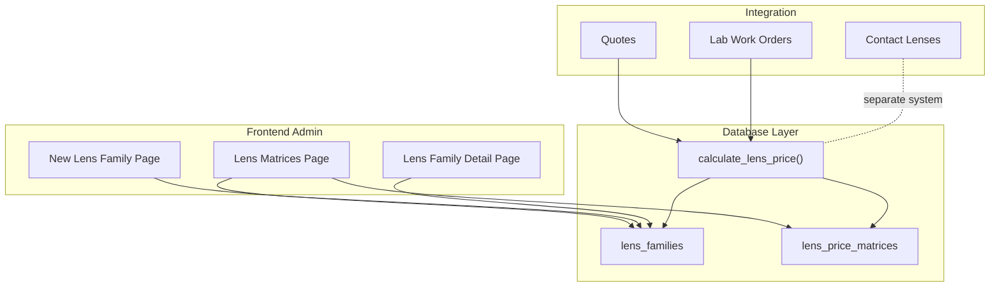
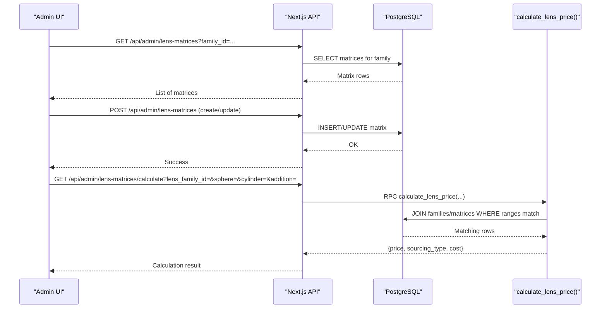
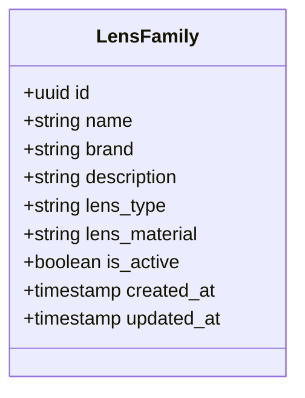
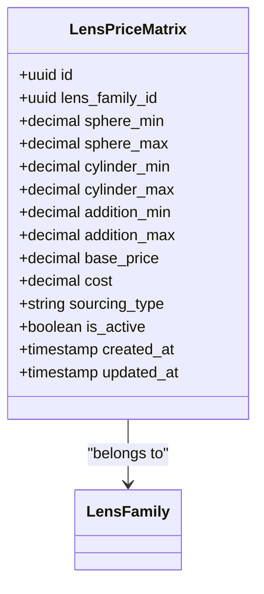
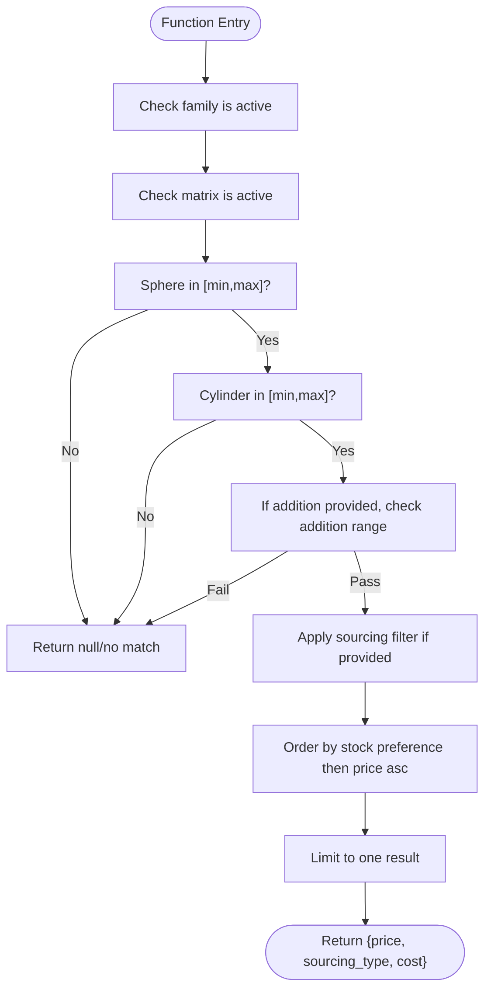
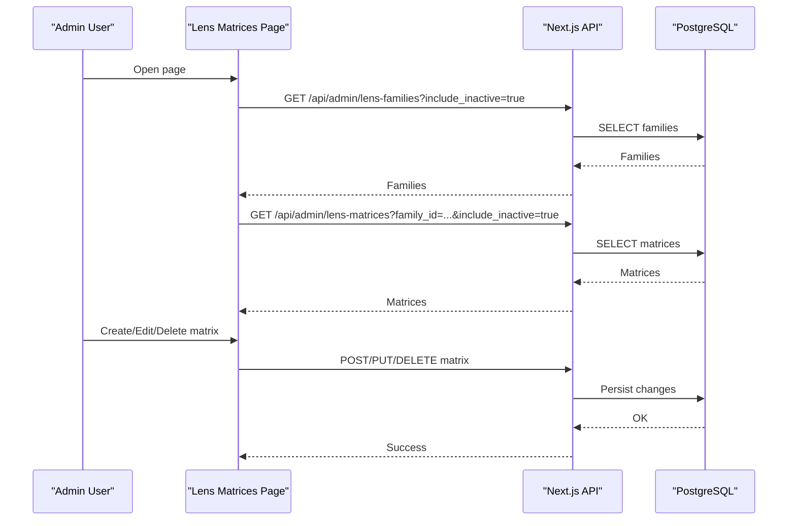
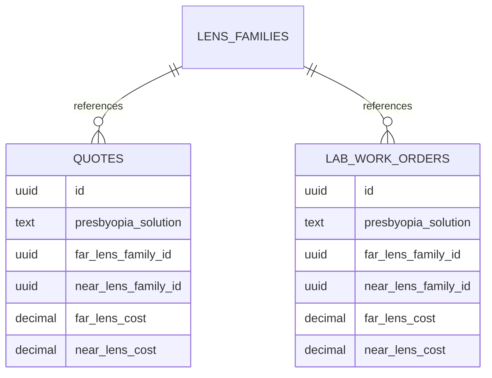
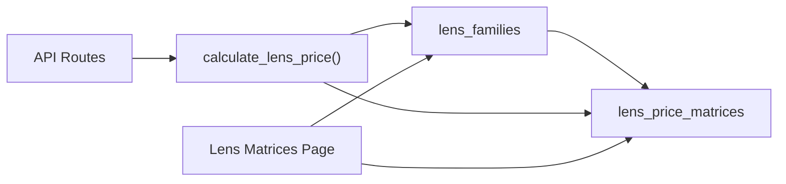

# Lens Family & Matrix System

<cite>
**Referenced Files in This Document**
- [20260129000000_create_lens_families_and_matrices.sql](file://supabase/migrations/20260129000000_create_lens_families_and_matrices.sql)
- [20260131000003_fix_lens_matrices_addition_ranges.sql](file://supabase/migrations/20260131000003_fix_lens_matrices_addition_ranges.sql)
- [20260122000002_lens_matrices_v2_fix_schema.sql](file://supabase/migrations/20260122000002_lens_matrices_v2_fix_schema.sql)
- [LENS_FAMILIES_AND_MATRICES_SCHEMA.md](file://docs/LENS_FAMILIES_AND_MATRICES_SCHEMA.md)
- [LENS_PRICE_CALCULATION_SYSTEM.md](file://docs/LENS_PRICE_CALCULATION_SYSTEM.md)
- [lens-matrices/page.tsx](file://src/app/admin/lens-matrices/page.tsx)
- [lens-families/[id]/page.tsx](file://src/app/admin/lens-families/[id]/page.tsx)
- [lens-families/new/page.tsx](file://src/app/admin/lens-families/new/page.tsx)
</cite>

## Table of Contents

1. [Introduction](#introduction)
2. [Project Structure](#project-structure)
3. [Core Components](#core-components)
4. [Architecture Overview](#architecture-overview)
5. [Detailed Component Analysis](#detailed-component-analysis)
6. [Dependency Analysis](#dependency-analysis)
7. [Performance Considerations](#performance-considerations)
8. [Troubleshooting Guide](#troubleshooting-guide)
9. [Conclusion](#conclusion)
10. [Appendices](#appendices)

## Introduction

This document describes the lens family and matrix system in Opttius, covering the hierarchical structure of lens families (single vision, progressive, toric, multifocal), the matrix configuration model for defining allowable parameter ranges, pricing tiers, and sourcing options, and the end-to-end workflow for creating, validating, and pricing lenses. It also explains integration with quotes and work orders, customization and regional considerations, and the relationship to the contact lens system.

## Project Structure

The lens system spans three primary areas:

- Database schema and stored procedures for lens families and price matrices
- Frontend administration pages for managing lens families and matrices
- Documentation that defines the schema, calculation logic, and integration points

**Diagram sources**

- [20260129000000_create_lens_families_and_matrices.sql](file://supabase/migrations/20260129000000_create_lens_families_and_matrices.sql#L6-L104)
- [lens-matrices/page.tsx](file://src/app/admin/lens-matrices/page.tsx#L88-L162)
- [lens-families/[id]/page.tsx](file://src/app/admin/lens-families/[id]/page.tsx#L9-L15)
- [lens-families/new/page.tsx](file://src/app/admin/lens-families/new/page.tsx#L3-L10)

**Section sources**

- [20260129000000_create_lens_families_and_matrices.sql](file://supabase/migrations/20260129000000_create_lens_families_and_matrices.sql#L1-L222)
- [lens-matrices/page.tsx](file://src/app/admin/lens-matrices/page.tsx#L1-L1077)
- [lens-families/[id]/page.tsx](file://src/app/admin/lens-families/[id]/page.tsx#L1-L16)
- [lens-families/new/page.tsx](file://src/app/admin/lens-families/new/page.tsx#L1-L11)

## Core Components

- Lens families: Define genetic characteristics (lens type and material) and commercial metadata. Examples include single vision, bifocal, trifocal, progressive, reading, computer, and sports. Materials include CR-39, polycarbonate, high-index variants, Trivex, and glass.
- Lens price matrices: Define pricing tiers per range of sphere, cylinder, and addition (for presbyopia). Each matrix row specifies base price, cost, sourcing type (stock or surfaced), and activation state.
- Calculation engine: A stored procedure selects the appropriate matrix based on family and optical parameters, preferring stock when available and choosing the lowest price among matches.

Key behaviors:

- Ranges are inclusive and validated by constraints.
- Presbyopia is supported via addition ranges; monofocals have addition_min/addition_max equal to zero.
- Soft deletion via is_active flag.
- Row-level security restricts access to administrators.

**Section sources**

- [20260129000000_create_lens_families_and_matrices.sql](file://supabase/migrations/20260129000000_create_lens_families_and_matrices.sql#L10-L49)
- [LENS_FAMILIES_AND_MATRICES_SCHEMA.md](file://docs/LENS_FAMILIES_AND_MATRICES_SCHEMA.md#L214-L221)
- [LENS_PRICE_CALCULATION_SYSTEM.md](file://docs/LENS_PRICE_CALCULATION_SYSTEM.md#L215-L227)

## Architecture Overview

The system follows a layered architecture:

- Data layer: PostgreSQL tables with GIST indexes for efficient range queries and a stored procedure for price calculation.
- API layer: Next.js API routes expose endpoints for listing, creating/updating, and calculating prices.
- Presentation layer: Admin pages manage lens families and matrices, and integrate with quote/work order flows.

**Diagram sources**

- [20260129000000_create_lens_families_and_matrices.sql](file://supabase/migrations/20260129000000_create_lens_families_and_matrices.sql#L51-L103)
- [lens-matrices/page.tsx](file://src/app/admin/lens-matrices/page.tsx#L138-L162)
- [LENS_PRICE_CALCULATION_SYSTEM.md](file://docs/LENS_PRICE_CALCULATION_SYSTEM.md#L78-L101)

## Detailed Component Analysis

### Lens Families

Lens families encapsulate:

- Commercial identity: name, brand, description
- Genetic traits: lens_type and lens_material
- Lifecycle: is_active flag and timestamps

Supported lens types align with standard optical categories, while materials reflect common substrates and indices. Families act as the inheritance layer for matrices.

**Diagram sources**

- [20260129000000_create_lens_families_and_matrices.sql](file://supabase/migrations/20260129000000_create_lens_families_and_matrices.sql#L6-L20)

**Section sources**

- [20260129000000_create_lens_families_and_matrices.sql](file://supabase/migrations/20260129000000_create_lens_families_and_matrices.sql#L6-L20)
- [LENS_FAMILIES_AND_MATRICES_SCHEMA.md](file://docs/LENS_FAMILIES_AND_MATRICES_SCHEMA.md#L65-L121)

### Lens Price Matrices

Each matrix row defines:

- Range boundaries: sphere_min/sphere_max, cylinder_min/cylinder_max, addition_min/addition_max
- Pricing: base_price and cost
- Sourcing: stock or surfaced
- Activation: is_active

Constraints ensure valid ranges. Indexes optimize lookups for sphere, cylinder, and addition ranges.

**Diagram sources**

- [20260129000000_create_lens_families_and_matrices.sql](file://supabase/migrations/20260129000000_create_lens_families_and_matrices.sql#L23-L38)
- [20260129000000_create_lens_families_and_matrices.sql](file://supabase/migrations/20260129000000_create_lens_families_and_matrices.sql#L41-L47)

**Section sources**

- [20260129000000_create_lens_families_and_matrices.sql](file://supabase/migrations/20260129000000_create_lens_families_and_matrices.sql#L23-L38)
- [20260129000000_create_lens_families_and_matrices.sql](file://supabase/migrations/20260129000000_create_lens_families_and_matrices.sql#L41-L47)
- [LENS_FAMILIES_AND_MATRICES_SCHEMA.md](file://docs/LENS_FAMILIES_AND_MATRICES_SCHEMA.md#L145-L206)

### Calculation Engine

The stored procedure calculate_lens_price:

- Filters by family, sphere, cylinder, optional addition, and sourcing preference
- Requires both family and matrix to be active
- Prioritizes stock over surfaced when no sourcing filter is provided
- Returns the lowest-priced match

**Diagram sources**

- [20260129000000_create_lens_families_and_matrices.sql](file://supabase/migrations/20260129000000_create_lens_families_and_matrices.sql#L52-L81)
- [20260131000003_fix_lens_matrices_addition_ranges.sql](file://supabase/migrations/20260131000003_fix_lens_matrices_addition_ranges.sql#L165-L198)

**Section sources**

- [20260129000000_create_lens_families_and_matrices.sql](file://supabase/migrations/20260129000000_create_lens_families_and_matrices.sql#L52-L81)
- [LENS_PRICE_CALCULATION_SYSTEM.md](file://docs/LENS_PRICE_CALCULATION_SYSTEM.md#L103-L142)

### Admin Management Pages

- Lens Matrices Page: Lists matrices with filtering by family and activation state, supports pagination, and provides create/edit/delete actions. Includes import dialog and search by family, brand, and sourcing type.
- Lens Family Detail Page: Edits an existing family.
- New Lens Family Page: Guides creation of a new family using a wizard component.

**Diagram sources**

- [lens-matrices/page.tsx](file://src/app/admin/lens-matrices/page.tsx#L119-L162)
- [lens-families/[id]/page.tsx](file://src/app/admin/lens-families/[id]/page.tsx#L9-L15)
- [lens-families/new/page.tsx](file://src/app/admin/lens-families/new/page.tsx#L3-L10)

**Section sources**

- [lens-matrices/page.tsx](file://src/app/admin/lens-matrices/page.tsx#L88-L486)
- [lens-families/[id]/page.tsx](file://src/app/admin/lens-families/[id]/page.tsx#L1-L16)
- [lens-families/new/page.tsx](file://src/app/admin/lens-families/new/page.tsx#L1-L11)

### Integration with Quotes and Work Orders

Quotes and lab work orders reference lens families and costs to streamline manufacturing and quoting:

- Columns include presbyopia solution type and far/near lens family references with associated costs.
- This enables automatic parameter validation and pricing calculation during quote creation and work order generation.

**Diagram sources**

- [LENS_FAMILIES_AND_MATRICES_SCHEMA.md](file://docs/LENS_FAMILIES_AND_MATRICES_SCHEMA.md#L764-L794)

**Section sources**

- [LENS_FAMILIES_AND_MATRICES_SCHEMA.md](file://docs/LENS_FAMILIES_AND_MATRICES_SCHEMA.md#L764-L794)

### Relationship to Contact Lens System

The contact lens system is separate from the spectacle lens family and matrix system. While both manage optical products, contact lenses operate under distinct models and APIs.

**Section sources**

- [LENS_FAMILIES_AND_MATRICES_SCHEMA.md](file://docs/LENS_FAMILIES_AND_MATRICES_SCHEMA.md#L798-L800)

## Dependency Analysis

- Lens families are referenced by lens price matrices (foreign key).
- The calculation function joins lens families and matrices to enforce active state and inheritance of genetic traits.
- Frontend pages depend on API endpoints for listing, creating/updating, and calculating prices.
- Indexes on range columns enable efficient matching.

**Diagram sources**

- [20260129000000_create_lens_families_and_matrices.sql](file://supabase/migrations/20260129000000_create_lens_families_and_matrices.sql#L25-L38)
- [20260129000000_create_lens_families_and_matrices.sql](file://supabase/migrations/20260129000000_create_lens_families_and_matrices.sql#L52-L81)
- [lens-matrices/page.tsx](file://src/app/admin/lens-matrices/page.tsx#L119-L162)

**Section sources**

- [20260129000000_create_lens_families_and_matrices.sql](file://supabase/migrations/20260129000000_create_lens_families_and_matrices.sql#L41-L47)
- [20260129000000_create_lens_families_and_matrices.sql](file://supabase/migrations/20260129000000_create_lens_families_and_matrices.sql#L52-L81)

## Performance Considerations

- GIST indexes on numeric ranges for sphere, cylinder, and addition enable fast overlap queries.
- Inclusive range checks minimize boundary errors and improve matching accuracy.
- Ordering by sourcing preference and price ensures optimal selection with minimal overhead.
- Soft deletion avoids costly cascading deletes and maintains historical reporting.

[No sources needed since this section provides general guidance]

## Troubleshooting Guide

Common issues and resolutions:

- Addition parameter not passed: Ensure the calculation endpoint forwards addition to the stored procedure.
- Missing addition ranges: Apply the migration to populate addition_min and addition_max and validate constraints.
- Debugging mismatches: Use the debug endpoint to inspect candidate matrices and the final result.
- Cylinder zero values: Always pass cylinder explicitly (including zero) to avoid undefined comparisons.

**Section sources**

- [LENS_PRICE_CALCULATION_SYSTEM.md](file://docs/LENS_PRICE_CALCULATION_SYSTEM.md#L144-L175)
- [LENS_PRICE_CALCULATION_SYSTEM.md](file://docs/LENS_PRICE_CALCULATION_SYSTEM.md#L237-L241)
- [LENS_PRICE_CALCULATION_SYSTEM.md](file://docs/LENS_PRICE_CALCULATION_SYSTEM.md#L504-L546)

## Conclusion

The lens family and matrix system provides a robust, extensible framework for defining optical families, configuring pricing tiers across spherical, cylindrical, and addition ranges, and integrating seamlessly with quotes and work orders. The stored procedure’s prioritization logic and indexing strategy ensure accurate, fast price determination, while administrative pages offer intuitive controls for configuration and maintenance.

[No sources needed since this section summarizes without analyzing specific files]

## Appendices

### Lens Types and Materials Reference

- Lens types: single_vision, bifocal, trifocal, progressive, reading, computer, sports
- Materials: cr39, polycarbonate, high_index_1_67, high_index_1_74, trivex, glass

**Section sources**

- [20260129000000_create_lens_families_and_matrices.sql](file://supabase/migrations/20260129000000_create_lens_families_and_matrices.sql#L10-L15)
- [LENS_FAMILIES_AND_MATRICES_SCHEMA.md](file://docs/LENS_FAMILIES_AND_MATRICES_SCHEMA.md#L124-L141)

### API Endpoints Summary

- GET /api/admin/lens-families: List families (with optional inclusion of inactive)
- POST /api/admin/lens-families: Create a family
- PUT /api/admin/lens-families/[id]: Update a family
- DELETE /api/admin/lens-families/[id]: Deactivate a family
- GET /api/admin/lens-matrices: List matrices (filter by family and include_inactive)
- POST /api/admin/lens-matrices: Create a matrix
- GET /api/admin/lens-matrices/calculate: Calculate price given family and parameters

**Section sources**

- [LENS_FAMILIES_AND_MATRICES_SCHEMA.md](file://docs/LENS_FAMILIES_AND_MATRICES_SCHEMA.md#L616-L761)
